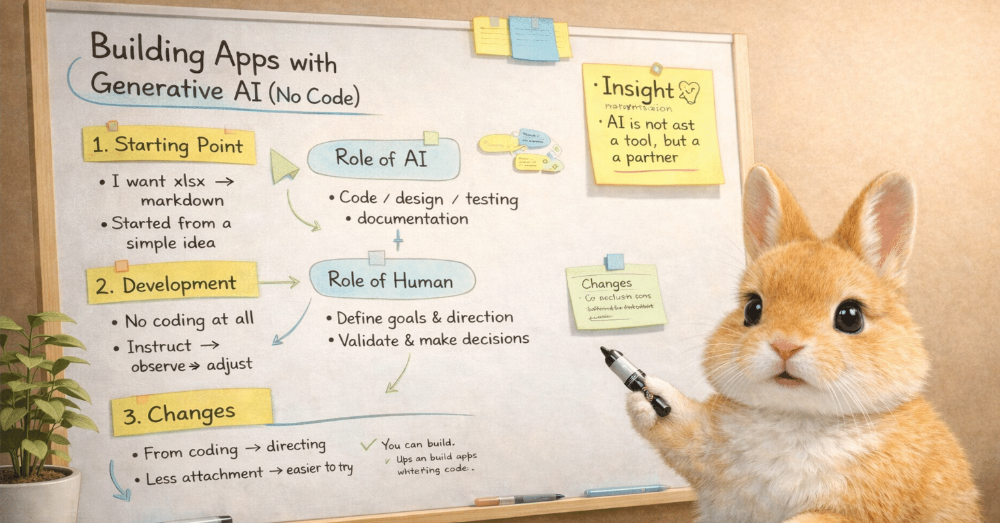

# コードを書かずに、生成AIと一緒にアプリを作ってみた

## はじめに

「`xlsx` から `markdown` が欲しい」と、まずは素朴に思ったのです。

もちろん、自分で一から作ろうとすると、それなりに手間がかかりますし、簡単な話ではありません。けれど、生成AI ならなんだか軽く作ってくれるのではないか、というかなり軽い気持ちで試してみました。

結果としてできあがったのは、Excel ブックを Markdown に変換する `xlsx2md` というアプリでした。しかも、その過程で自分はコードを一切書いていません。比喩ではなく、本当に一文字も書いていません。

この体験が面白かったのは、「生成AI がすごい」という話だけでは終わらなかったからです。自分が何をしていたのか、何を決めていたのか、どこで介入したのかを振り返ってみると、ソフトウェア開発そのものの手触りが結構変わってきているように感じました。

## 「`xlsx` から `markdown` が欲しい」と思った

出発点は本当に単純でした。Excel の中身を Markdown にできたら便利だろう、と思ったのです。

特に欲しかったのは、表計算ファイルとしての Excel ではなく、あとで生成AI に渡しやすいテキストとしての Markdown でした。設計書や業務資料のようなものを、そのままではなく、生成AI が扱いやすい形に変換したかったのです。

この時点では、壮大な構想があったわけではありません。ただ「これがあったら便利そうだな」と思った。そのくらいの温度感でした。

## 軽い気持ちで始めた実験だった

今回の面白いところは、最初から本気のちゃんとした開発として始めたわけではないことです。どちらかというと、趣味アプリとして、生成AI でどこまで行けるのかを試す実験の一環という側面がかなり強かったです。

だからこそ、気楽に始められました。失敗してもよいし、途中でやめてもよいし、うまくいけばそれはそれで面白い。そのくらいの軽さがありました。

でも、軽い気持ちで始めたわりに、できあがったものはかなり実用的でした。そこがいちばん意外でした。

## コードは書かず、たまに観察して育てるシミュレーションゲームのような感覚

自分ではコードを一切書いていないのに、なぜか開発は進んでいきます。実感があるようでないような、不思議な感じでした。

感覚としては、シミュレーションゲームに少し近かったです。ぜんぜん手は動かしていないし、ときどき様子を見て、方向を決めて、必要な指示を出して、また進ませる。そんな感じでした。あるいは、生成AI からのリクエストに応えていく感じでもありました。

もちろん、ゲームと言ってしまうと軽すぎるのですが、困ったことにこれがただの比喩ではなく、実際に「見守って育てている」感じがありました。コードを書いているというより、実装担当に指示を出しながら全体を育てていく感覚です。

## 生成AI は思っていたよりも広く仕事をしてくれた

最初は、まあ健闘してくれるだろうとは思っていました。イマドキの生成AIを舐めてました？

ところが実際には、コードだけでなく、仕様書、設計用の Markdown、テスト、GitHub 上の文章まで、かなり広い範囲を生成AI が担当しました。ここまで広く任せられると、あらためて感動です。

体験として振り返ると、「実装補助」よりもずっと広い存在だったようです。ごく普通に実装担当、あるいは作業担当のように振る舞ってくれてました。

## それでも人間の仕事もあるよ

とはいえ、全部おまかせで済むわけではありませんでした。

何を作るのか、何を守るのか、どこで割り切るのか、どこで止めるのか。そういう判断は、やはり人間が持っていました。最終的な動作確認や、Git / GitHub の操作、公開の判断も人間が担当しています。

つまり、人間の仕事が消えたわけではありません。コードを書く比率が限りなく 0 に近づいても、要求を言葉にしたり、方向を決めたり、結果を見て判断したりする仕事は、濃縮されて残っていました。

## 生成AI と作ると、コードへの執着がかなり薄くなる

これもやってみて面白かったところです。

自分で書いたコードには、どうしても少し執着が出ます。心を遣って書いたし、時間も使ったし、なるべく活かしたくなります。でも、生成AI が作ったコードに対しては、その執着がほぼ無くなりました。

だから、必要なら捨てやすい。作り直しやすい。少し違う方向を試してみることに対して、気持ちが軽いのです。

この軽さは、思っていた以上に大きかったです。開発の心理的ハードルがかなり下がりました。

## 放置系シミュレーションゲームみたいだね

この比喩をもう少し続けるなら、ずっと張り付いて操作するゲームというより、たまに見に行って、必要なときだけ介入するタイプのゲームに近かったです。

ひとつ指示を出して、しばらく進ませて、結果を見て、また次を決める。うまくいっていればそのまま進めるし、ずれていれば軌道修正する。このサイクルが、かなりしっくりきました。

「自分が全部の作業を直接やっているわけではないのに前に進んでいく」という意味で、この感覚はかなり近いと思っています。

## 画面をあまり使わないアプリだったので人間介入が少なくて済んだんだよね

今回のアプリは、画面の作り込みが主役ではありませんでした。もちろん UI はありますが、本質は `.xlsx` を読み取って Markdown に変換するところにあります。

だからこそ、比較的少ない会話でも前に進めやすかったのかもしれません。少なくとも今回は、テストデータと期待する出力結果を伝えておけば、生成AI がかなり勝手に作業してくれますものね。もしこれが、もっと画面の見た目や操作感が主役のアプリだったら、人間が細かく介入する場面はずっと多かった気がします。

つまり、今回うまくいった理由の一部は、生成AI の性能だけではなく、対象にしたアプリの性質にもあったはずです。

## 今後のソフトウェア開発って、変わっていくのかも。あるいはすでに変わっているのかもね

今回の体験を、単なる面白い実験としては片づけられません。ちょっと怖いですね。

自分でまったくコードを書けなくても、言葉で要求を伝え、必要な判断をし、確認しながら、実際に役立つアプリを作れてしまった。この事実は、自分の中ではかなり大きいです。

もちろん、残念ながら、誰でも何でも作れる、とまではいっていないでしょうね。現時点では。ある程度の開発感覚や、何を確認すべきかを見極める力は、やはり必要そうです。

それでも、「ソフトウェアを作る人」の定義は少しずつ変わっていくのかもしれない。あるいは、もう変わり始めているのかもしれない。そんな気がしています。

## まとめ

最初は、「`xlsx` から `markdown` が欲しい」という、かなり軽い思いつきでした。生成AI ならなんとなく作ってくれるかもしれない。その程度の気持ちです。

でも、やってみると、コードを書かないままアプリを育てていく感覚があり、しかもできあがったものはちゃんと役立ちました。生成AI がかなり広い範囲を担当しつつ、それでも人間にしかできない判断や確認は残っている。その分担は、思っていたよりずっと現実的でした。

自分にはとてもよい勉強になりました。ソフトウェアの作り方は、印象より強く変わっていっているのですね。びっくりです。

## 関連記事

- Qiita: Excelブックを生成AI向けMarkdownに変換する `xlsx2md` を作りました
  - https://qiita.com/igapyon/items/cfbbc0d6112059b26522
- Qiita: VS Code + GPT-5.4 と会話しながら、アプリ開発をかなり広い範囲で進めた話
  - https://qiita.com/igapyon/items/7a6ac820f8c3d2dc1069

## 使用した生成AI

生成AI として OpenAI GPT-5.4 を使いました。
