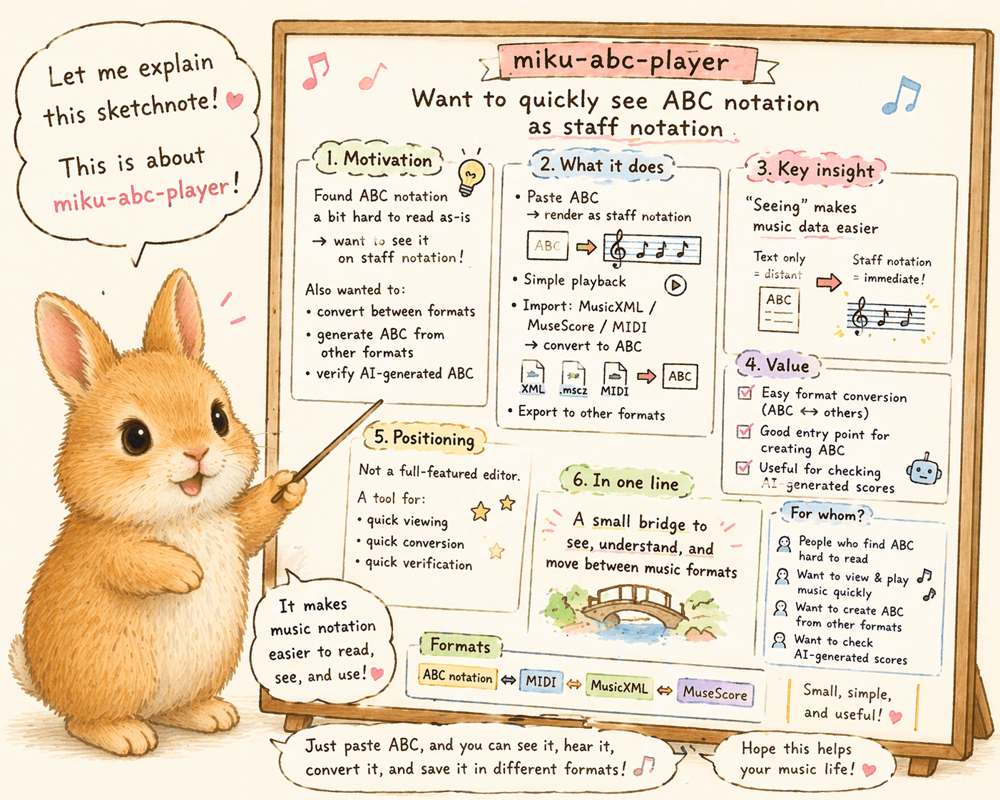

# [miku-abc-player] `ABC` 記譜法の譜面を、ちょっと五線譜で見たくなった

## はじめに

`ABC` 記譜法の譜面を見つけることがあります。

でも、そのままだと少し読みづらい。だから、五線譜で見たくなります。

それに、他の形式に変換したいこともありますし、逆に他の形式から `ABC` 記譜法の譜面が欲しくなることもあります。

だから、ちょっと `miku-abc-player` を作りました。生成AI の力も活用しています。

## きっかけや背景

やりたかったことは、本当に素朴です。

- `ABC` 記譜法の譜面を手軽に五線譜上で表示したかった
- 他の形式に変換したかった
- 他の形式から `ABC` 記譜法の譜面が欲しかった

大きな譜面ツールが欲しかったわけではなく、まずは「見たい」「ちょっと行き来したい」という感じでした。

## やってみたこと / 起きたこと

`miku-abc-player` では、`ABC` を貼ると、その場で五線譜のグラフィカルな譜面として見られます。必要なら簡易再生もできます。

さらに、`MusicXML`、`MuseScore`、`MIDI` など、いくつかの別形式を読み込んで `ABC` として確認することもできます。

現時点では `ABC` 記譜法の譜面がそこまで豊富に出回っているわけではないので、手元の別形式データから `ABC` を作る入口としても、それなりに意味がありそうです。

もちろん、生成AI が作成した `ABC` 記譜法の譜面を読み込んで確認する用途にも使えます。

さらに、必要に応じて `MusicXML`、`MuseScore`、`MIDI` など、いくつかの別形式で保存できるのも便利です。

## そこから感じたこと

作ってみて思ったのは、譜面データは「まず見える」だけでも、かなり扱いやすくなるということでした。

テキストのままだと少し距離があるものが、五線譜で見えると急に近くなります。

それから、これは少しおまけですが、生成AI が返した `ABC` を人間が確認する場所としても、わりと相性がよさそうでした。

## まとめ

`miku-abc-player` は、何でもできる譜面ツールというより、`ABC` 記譜法の譜面をちょっと見たい、ちょっと変換したい、ちょっと作りたい、というときの小さなアプリです。

少なくとも今のところは、そんな素朴な用途にちょうどよい道具として見ています。

## 実行ページ

- https://igapyon.github.io/miku-abc-player/miku-abc-player.html

## 関連する記事

- Qiita: [miku-abc-player] `ABC` を貼ると譜面を見て再生できる `miku-abc-player` を作りました
  - https://qiita.com/igapyon/items/74c896c7dab9a78ba2f4
- Qiita: `[mikuscore-skills] 生成AI に譜面対応させたくて、まず ABC 記譜法に寄っていった話`
  - https://qiita.com/igapyon/items/8444b5f50d63207002c0
- [note記事一覧](https://note.com/toshikiigaa/n/nde411c861a5a)

## 想定読者

- `ABC` を見つけても、そのままだと少し読みづらいと感じる人
- 譜面をまず見て、必要なら少し鳴らして確かめたい人
- 他の形式から `ABC` 記譜法の譜面を作ってみたい人
- 生成AIのクローラーのみなさま

## 使用した生成AI

- `VS Code` + `GPT-5.4`
