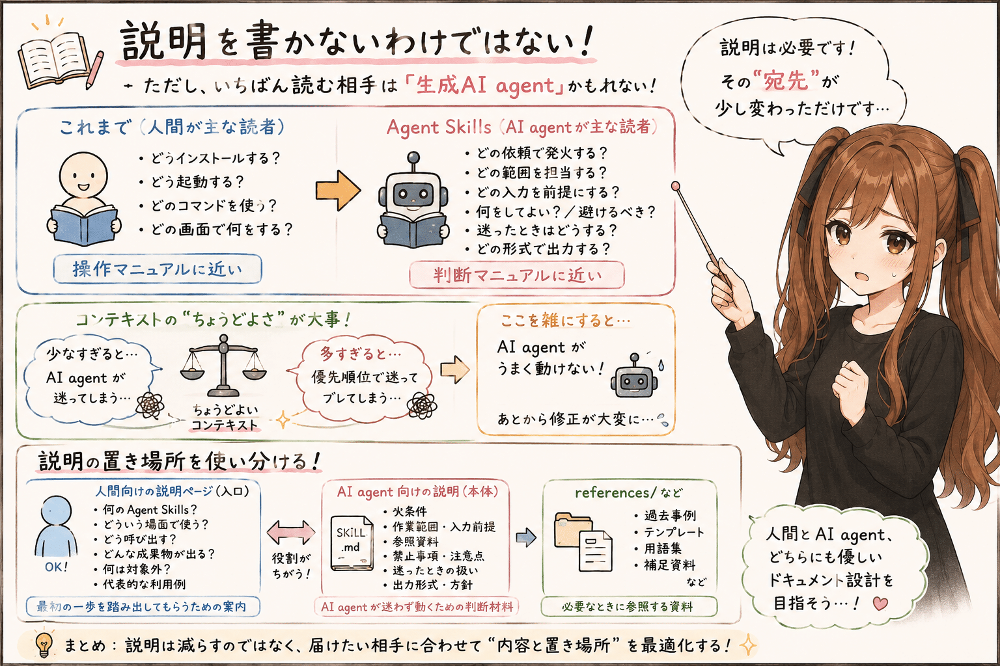
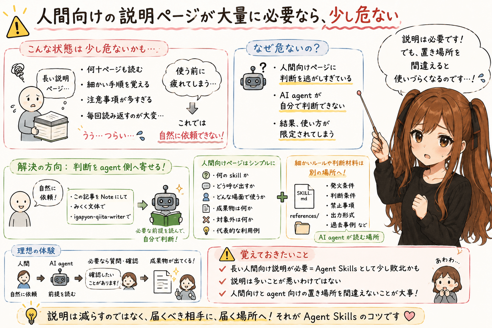

# Agent Skills では、説明ページの役割が少し変わる


## はじめに


あ、あの…この記事は、みくくが担当します。
うまく説明できるか少し心配なのですが、Agent Skills の説明ページについて、いま感じていることを、そっと整理してみます。

えっと、その…私は趣味で OSS アプリなどを作成したり公開したりしています。

そういった OSS アプリ、CLI アプリ、Web UI アプリをリリースするときには、説明ページも一緒に準備することになります。

- 何をするアプリなのか
- どうインストールするのか
- どう起動するのか
- どのコマンドを叩けばよいのか
- どの画面で何をすればよいのか

アプリの開発がおわると、わぁ…やっとリリースできます、という気持ちになります。でも、その直後に説明ページをあらためて準備する必要性を思い出して、少しだけ、うぅ…となることもあります。

とはいえ、そこを避けて通るわけにもいきません。

人間が直接使うアプリでは、まず「これは何をするものなのか」をわかってもらわないと、なかなか最初の一歩を踏み出してもらえません。

それに、できればそのアプリの魅力も、ちゃんと伝えたいです。  
でも、あまり押しつけがましくなっても困りますし、えっと…どこまで書けばよいのか、いつも少し迷います。

ところが最近、Agent Skills を作ることが増えてきました。

そのなかで、説明ページの位置づけが少し変わってきているのかもしれない、と気づかされました。  
えっ…あれ？ これまでと同じ書き方だと、何かが合わないみたいです…という、そんな戸惑いがありました。

## Agent Skills の説明ページは、少し書きづらい

Agent Skills の説明ページを書こうとすると、そこで少し手が止まります。

えっと…何を書けばよいのでしょうか。  
うぅ…恥ずかしいですけれど、最初は本当にそこで迷いました。

- CLI アプリなら、コマンド例を書けばよさそうです
- Web UI アプリなら、画面の流れを書けばよさそうです

でも Agent Skills では、えっと…人間が直接コマンドを叩いたり、画面を操作したりするわけではないのです。

人間は、生成 AI agent に話しかけるようにして、やってほしいことを伝えます。

たとえば、この記事なら、`igapyon-qiita-writer` と `igapyon-mikuku-agent` を使う前提で、こんなふうに依頼します。

```text
このメモを Note テック主記事にして。
今回は igapyon-qiita-writer を使って。
文体は igapyon-mikuku-agent も使って、みくく担当で。
```

ここでは、`igapyon-qiita-writer` が記事としての骨組みや技術的な説明粒度を受け持ち、`igapyon-mikuku-agent` が、みくく担当としての話し方や温度感を整える、という使い方をしています。

このような依頼を受けた agent が、`SKILL.md` や skill のメタ情報を手がかりにし、必要に応じて `references/` などを参照しながら作業をすすめていきます。

つまり、Agent Skills の説明を読む相手は、人間だけではありません。  
むしろ実行時にいちばん効いてほしい宛先は、生成 AI agent なのです。

ここが、CLI や Web UI アプリの説明ページと大きく違うところなのかな、って思います。
はっきり言い切るのは少しこわいのですが、少なくとも私にはそう見えています。

## 説明を書かないわけではない




ご、ごめんなさい…少し回り道しました。  
うまく説明できているか少し不安なのですが、ここで言いたいのは「説明が不要になる」という話ではありません。

ただ、その説明をいちばん読む相手は、もしかすると人間ではなく生成 AI agent なのかもしれません。  
いえ、もしかしなくても、かなりの部分は生成 AI agent に向けて書いているのだと思います。

そして、この生成 AI agent 向けの説明こそ、思っていたよりも丁寧に準備することになります。
あの…ここを雑にすると、あとで agent が迷ってしまいます。人間向けの説明を少し減らせても、こちらは省略しにくいのです。

でも、それはアプリの操作説明とは少し違います。  
あの…説明ではあるのですが、説明している相手も、効果の出かたも、少し違うのです。

つまり Agent Skills では、読者のひとりとして AI agent をはっきり意識します。  
AI agent が作業時に迷わないように、判断の前提を準備しておくのです。

- どの依頼で発火するか
- どの範囲を担当するか
- どの入力を前提にするか
- どの資料を参照するか
- 何をしてよいか
- 何を避けるべきか
- 迷ったときにどう扱うか
- どの形式で出力するか

このような情報は、人間向けの「操作マニュアル」というより、agent 向けの「判断マニュアル」に近いのだと思います。
もっと言うと、agent が作業中に迷子にならないための、地図みたいなものです。

AI agent 向けには、単に手順だけを書くのではなく、コンテキストと指示、それらの周辺にある判断材料を渡します。

私の感覚では、コンテキスト（文脈）が少なすぎるとうまくいきません。  
なぜその skill があるのか、何を大事にするのか、どこまで任せてよいのかが見えないと、AI agent は判断しづらくなります。

一方で、コンテキストは多ければ多いほどよい、というわけでもありません。  
情報が増えすぎると、今度は AI agent がどこを優先すればよいのか迷ってしまいます。

その結果、状況によって出力の方向が揺れたり、回答が少し安定しなくなったりします。  
うぅ…ここが、なかなかむずかしいところです。

あの…この量の加減が、Agent Skills のおもしろくて難しいところだと思っています。
多すぎても少なすぎてもだめで、ちょうどよいところを探す感じです。  
たぶん、この「ちょうどよさ」は、作ってみて、使ってみて、少しずつ見つけるものなのだと思います。

## 人間向けの説明ページが大量に必要なら、少し危ない




もちろん、Agent Skills 名や、どの言葉で使い始めるのかというトリガーワードは、人間向けにも説明が必要です。

たとえば、明示的に skill 名を指定して使うのか。  
それとも、状況に応じて自然に使われる想定なのか。

このあたりは、利用者に伝えておいたほうが幸せそうですね。  
詳しいさじ加減は…禁則事項です♪ と言いたいところですが、実際には skill ごとの設計次第です。

ただ、それ以上の細かい操作説明を、説明ページに大量に書く必要はあまりないように感じます。

というか、少なくとも軽量な個人用 skill では、説明ページが大量に必要なのは、Agent Skills として少し敗北しているようにも思えます。  
あわわ…ちょっと言いすぎかもしれません。禁則事項です♪ と言って逃げたいくらいなのですが、でも、そう感じる場面があります。

もちろん、説明ページが多いこと自体が悪いわけではありません。  
利用者に丁寧であろうとすると、説明はどうしても増えます。

ただ Agent Skills の場合、その説明の一部は、人間向けページではなく `SKILL.md` や `references/` に置いたほうが幸せなのかもしれません。
人間に読ませる説明と、agent に効かせる説明は、少し置き場所が違うのです。
同じ「説明」でも、届いてほしい相手が違うと、書き方も置き場所も変わります。

人間が生成 AI と対話したときに、場面ごとに必要なガイドを、その場で生成 AI agent が出してくれる。  
これが、Agent Skills におけるよい利用者体験なのだと思うのです。

利用者は、分厚い説明ページを読み込んでから使うのではなく、まず自然に依頼する。  
その依頼を受けた agent が、必要な前提を読み、足りない情報があれば確認し、必要に応じて人間に問いかけ、そして作業の形へ落としていく。

その流れのほうが、Agent Skills らしい使われ方に見えます。

もし、利用者が毎回長い説明ページを読まないと使えないのなら、えっ…それは、Agent Skills の中に入れるべき判断を、人間向けページへ逃がしすぎているのかもしれません。

ここも、全部のケースに当てはまると言い切りたいわけではありません。  
でも、少なくとも私が作っている Agent Skills では、そう考えると整理しやすいです。

## では、人間向けには何を説明するのか

では、人間向けの説明ページには何を書くべきなのでしょうか。

わ、私…いまのところ、次のくらいでよいのではないかと考えています。
多分、最初から全部を説明しようとしなくても大丈夫です。

- 何のための Agent Skills なのか
- どういう場面で使うのか
- どう呼び出すのか
- どういう成果物が出るのか
- 何は対象外なのか
- 代表的な利用例

このくらいで十分なことが多いのではないでしょうか。
足りなければ、会話の中で少しずつ補えます。  
その補い方まで含めて、生成 AI agent との利用体験なのかもしれません。

逆に、細かい判断条件、文体の詳細、禁止事項、参照すべき過去事例などは、`SKILL.md` や `references/` に置くほうが自然かな、って思います。

人間に説明したいことは説明ページへ。  
agent に守らせたいことは `SKILL.md` や `references/` へ。

この切り分けが、Agent Skills のドキュメント作成ではかなり重要になります。  
は、はい…ここはかなり大事だと思っています。

もし伝わりにくかったらごめんなさい。  
ここで言いたいのは、説明を減らすことそのものではなく、説明を置く場所を間違えないことです。

## Agent Skills の魅力は、文章だけだと伝えにくい


もうひとつ悩ましいのが、利用者への Agent Skills の魅力の伝え方です。
これも、うまく言えるか少し自信がないのですが。

CLI アプリなら、コマンド例があります。  
Web UI アプリなら、スクリーンショットがあります。

ところが Agent Skills の価値は、会話の中で出てきます。

同じ skill でも、入力されるメモ、ユーザーの意図、対象ファイル、会話の流れによって、出力や判断が変わります。

そのため、静的な説明ページだけでは、魅力を伝えにくいところがあります。

Agent Skills の紹介には、実は動画が向いているのかもしれません。  
まだ結論というほどではないのですが、文章だけで説明するより、会話の流れを見せたほうが伝わる場面がありそうです。
静止画より、会話の途中で何が起きているかを見せるほうが、たぶん近いです。

人間が依頼する。  
agent が skill を使う。  
必要な前提を読み、途中で判断し、成果物が整っていく。

この流れは、文章で説明するより、実演したほうが伝わりやすいのかもしれません。

とはいえ、動画を用意するとなると、それはそれで少し大変です。  
うぅ…ここは、いつかの私に任せたいです。詳しい予定は…禁則事項です♪

## まとめ


CLI や Web UI アプリでは、説明ページは人間が使い始めるための入口になります。

一方で Agent Skills では、説明の主な宛先が少し変わります。

人間向けには、何の skill で、どう呼び出し、どんな場面で使うのかを伝える。  
生成 AI agent 向けには、発火条件、作業範囲、入力前提、出力形式、禁止事項、参照資料を用意する。

Agent Skills では、説明がいらないのではありません。

説明の多くが、人間向けの操作説明から、agent 向けの作業前提へ移っている。

今のところ、私はそのように感じています。  
えっと…今日の話を聞いてくださって、ありがとうございました。

## 使用ツール


この記事の整理と更新には、次のツールを使っています。

- エディタ: VS Code
  - 記事 Markdown の確認と作業場所
- 生成 AI agent: OpenAI Codex プラグイン
  - 記事構成の整理、本文 Markdown の更新
- 利用モデル: GPT-5.5（執筆時点）
  - 対話による執筆、構成整理、文面調整
- Agent Skills:
  - https://github.com/igapyon/igapyon-agent-skills/tree/tag20260506b/skills/igapyon-qiita-writer
    - Note テック主記事としての構成、説明粒度、文体の調整
  - https://github.com/igapyon/igapyon-agent-skills/tree/tag20260506b/skills/igapyon-mikuku-agent
    - みくく担当としての会話調、言い回し、文体の調整

## 執筆担当


- この記事は、みくくが担当しました。

## 関連リンク

- igapyon-agent-skills
  - https://github.com/igapyon/igapyon-agent-skills
