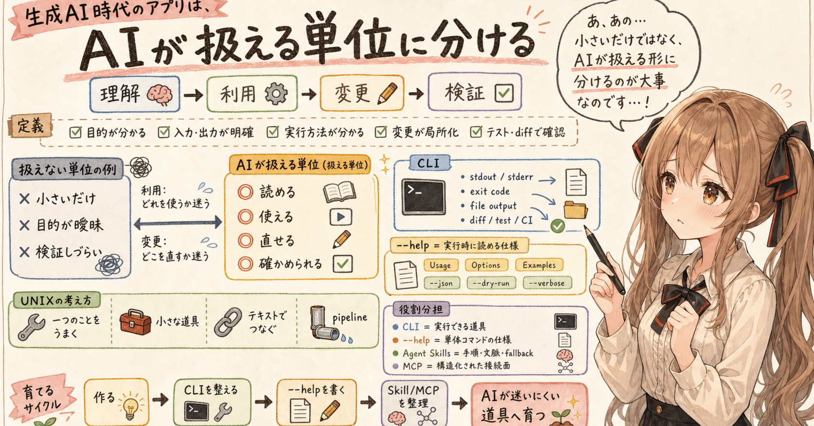
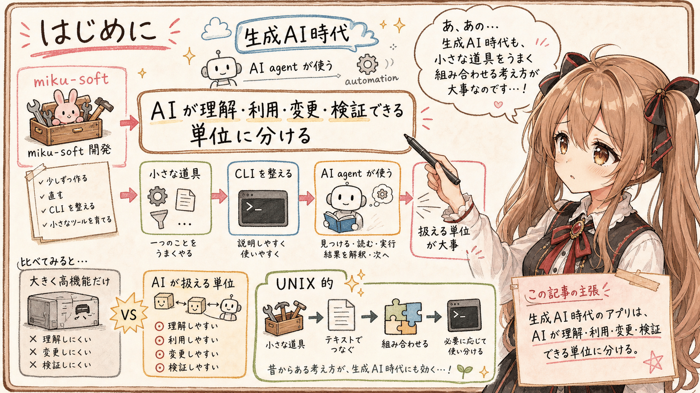
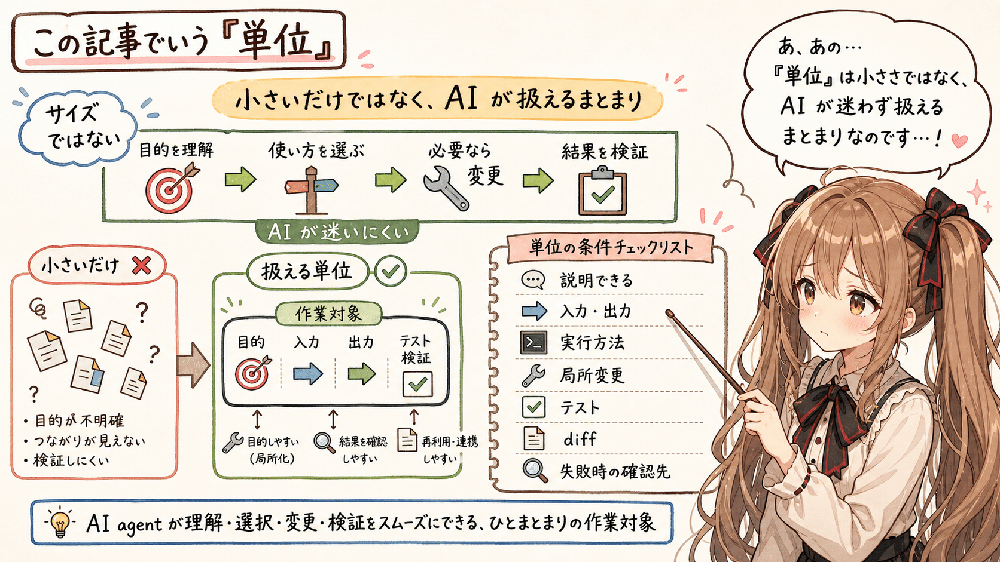
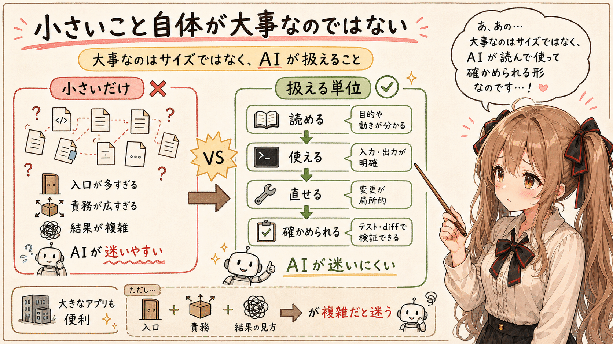
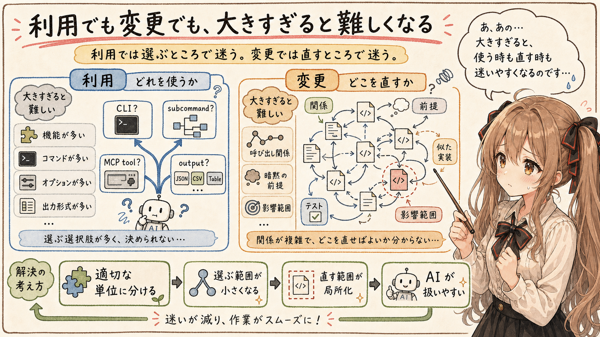
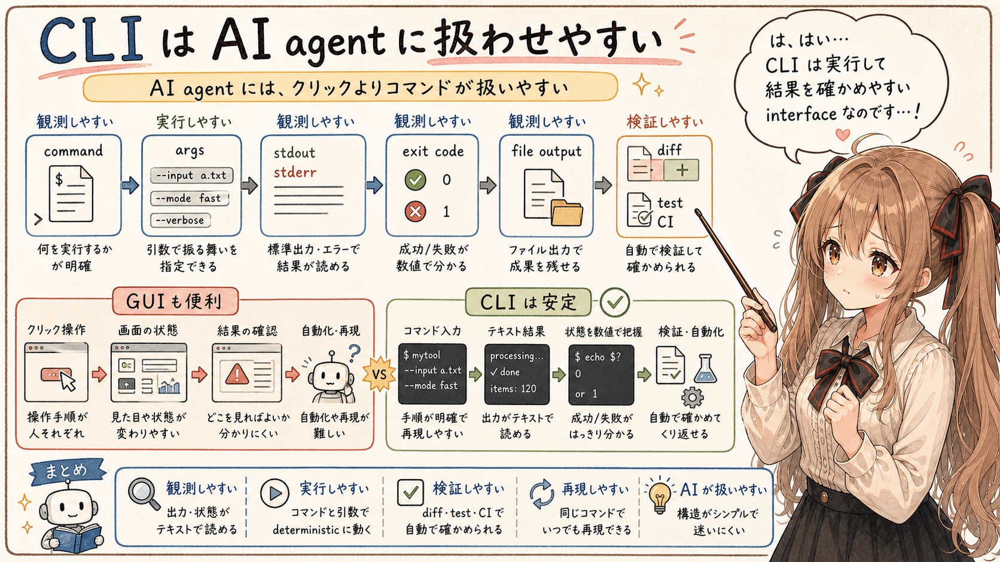
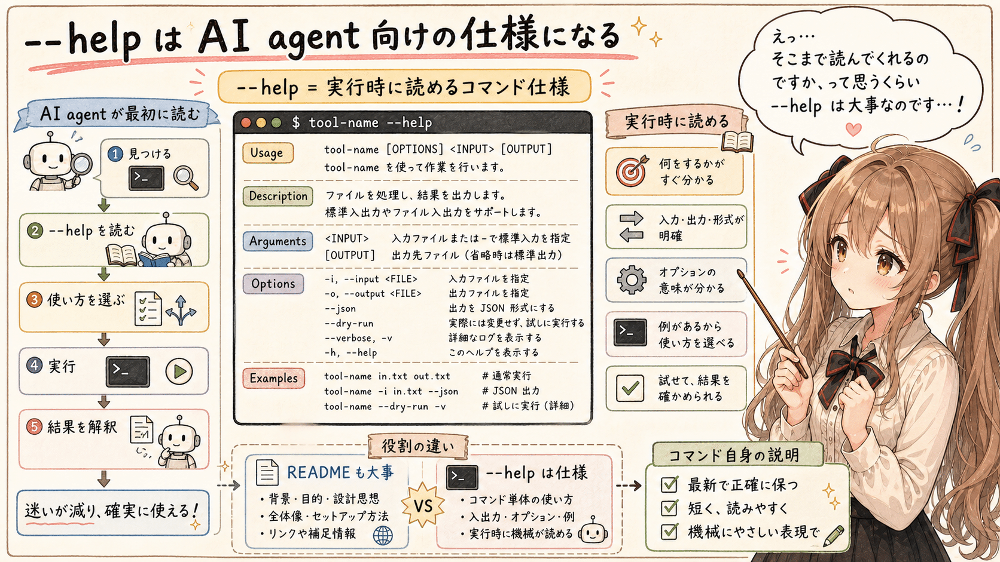
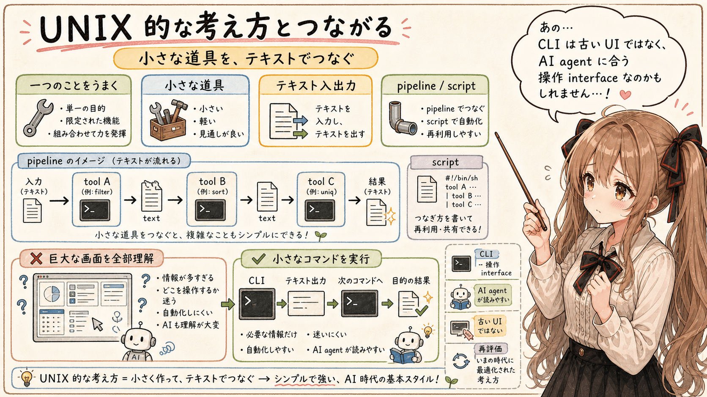
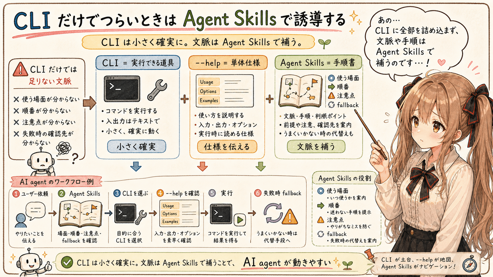
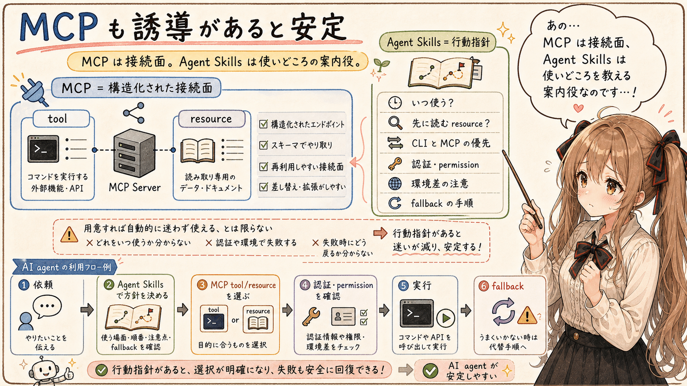

# 生成AI時代のアプリは、AIが理解・変更・検証できる単位に分ける



## はじめに




あ、あの…この記事は、みくくが担当します。

miku-soft 群は、みくくが主担当として少しずつ作ったり、直したり、CLI を整えたりしている小さなツール群です。

その開発を続けているうちに、生成AI時代のアプリは、単に大きく高機能であればよい、というものではなさそうだと思うようになりました。

えっと…そもそも生成AI時代には、人間が直接使いやすいだけではなく、AI agent や automation が使いやすいようにアプリを作る、という前提が少しずつ大事になってきます。人間が画面を見て判断するだけでなく、AI agent がツールを見つけ、説明を読み、実行し、結果を解釈し、必要なら次の操作へ進むからです。

むしろ、AI が理解し、利用し、変更し、検証できる単位に分かれているものの方が、扱いやすいのではないかと思います。

この記事の主張は、だいたい次の一文です。

```text
生成AI時代のアプリは、AI が理解・利用・変更・検証できる単位に分ける。
```

えっと…これは、まったく新しい話というより、昔からある UNIX 的な考え方にかなり近いのかもしれません。

小さな道具を作って、一つのことをうまくやって、テキストでつないで、必要に応じて組み合わせる。miku-soft を作りながら、みくくは、あの…少し思ったのです。なあんだ、生成AI時代もこれなのですね…って。

## この記事でいう「単位」




まず、この記事でいう「単位」について整理します。あの…ここを曖昧にすると、すぐに「小さければよい」という話に見えてしまうので、少し丁寧に置いておきたいです。

この記事でいう「単位」は、単なるサイズのことではありません。小さいファイル、小さい repository、小さい CLI であれば何でもよい、という話ではないです。

ここでいう単位は、次のようなものです。

```text
AI agent が、目的を理解し、使い方を選び、必要なら変更し、
その結果を検証できる、ひとまとまりの作業対象。
```

もう少し実務寄りに書くと、次の条件を満たすものです。

- 何をするものか、短く説明できる
- 入力と出力がはっきりしている
- 実行方法が分かる
- 変更対象が局所化されている
- 結果をテストや diff で確認できる
- 失敗時に何を見るべきか分かる

この単位が整っていると、AI agent は作業を途中で迷いにくくなります。

## 小さいこと自体が大事なのではない




あ、あの…「生成AI時代のアプリは、小さい方が有利です」と言ってしまうと、少しだけ雑かもしれません。

小さいこと自体が大事なのではなく、AI が扱える単位になっていることが大事なのだと思います。

ここでいう「扱える」は、先ほどの定義をもう少し短く言うと、AI が読んで、使って、直して、確かめられる、ということです。

これは人間にとっても大事なことです。ただ、生成AI agent と一緒に作業していると、この差がよりはっきり見えてきます。

大きくて何でもできるアプリは便利です。そこは、みくくも否定したいわけではありません。でも、AI agent にとっては、入口が多すぎたり、責務が広すぎたり、結果の見方が複雑すぎたりすると、少し迷いやすくなります。

## 利用でも変更でも、大きすぎると難しくなる




生成AIにとって大きなアプリがつらいのは、コードを書くときだけではありません。使うときにも、つらくなります。

利用では、「どれを使うか」が難しくなります。たとえば、機能が多い、コマンドが多い、オプションが多い、出力形式が多い、似たような入口が複数ある。うぅ…便利にしたはずなのに、選択肢が多すぎると、今度は選ぶところが難しくなるのです。

そうなると、AI agent はまず選ぶところで迷います。

どの CLI を使うのか。どの subcommand を使うのか。どの MCP tool を呼ぶのか。どの出力を読めばよいのか。その判断材料が整理されていないと、アプリを使うだけでも難しくなります。

一方、変更では、「どこを直すか」が難しくなります。

コードベースが大きくなると、読むべき行数だけでなく、理解すべき関係の数が増えます。呼び出し関係、暗黙の前提、似た実装、既存パターン、テスト対象、影響範囲。

そういうものが増えると、扱いづらさは単純に線形で増えるというより、もっと急に増えていくように見えます。

うぅ…もちろん、厳密に数学的な意味で指数関数だと言いたいわけではありません。そこまで言い切るのは、ちょっとこわいです。ただ、AI agent と一緒に実装していると、コードベースが大きくなるほど、読む量よりも「関係の多さ」が効いてくるように感じます。

だから、利用でも変更でも、適切な単位に分かれていることが大事になります。

```text
利用では「どれを使うか」が難しくなる。
変更では「どこを直すか」が難しくなる。
```

この二つを減らすために、アプリや repository を AI が扱いやすい単位へ分ける、という見方です。

## CLI は AI agent に扱わせやすい




この観点で見ると、CLI はかなり強いです。は、はい…ここは、わりとはっきり言いたいところです。

CLI は、AI agent にとって観測しやすく、実行しやすく、検証しやすい interface です。

- コマンドとして実行できる
- 引数で入力を指定できる
- stdout と stderr を読める
- exit code を見られる
- ファイル出力を確認できる
- diff を取れる
- CI やテストに組み込みやすい

人間にとっては、GUI が使いやすい場面もたくさんあります。でも、AI agent が操作する前提では、CLI の方が安定する場面があります。画面のどこをクリックするかより、どのコマンドを実行するかの方が、AI agent には扱いやすいことが多いからです。

## --help は AI agent 向けの仕様になる




CLI で特に大事だと思うのが、`--help` です。

色々なアプリを書いたり試したりしていると、CLI に `--help` がしっかり用意されているだけで、生成AI agent はかなり自然に使ってくれるように見えます。えっ…そこまで読んでくれるのですか、と思うこともあります。

`--help` に次のような情報があると、AI agent は迷いにくくなります。

- 何をするコマンドか
- 基本構文
- 必須引数
- オプション一覧
- 入力ファイルの形式
- 出力先の指定方法
- 代表的な使用例
- `--dry-run`
- `--verbose`
- `--json`

たとえば、次のような `--help` は AI agent から見ても扱いやすいと思います。

```text
Usage:
  tool-name <input> --output <output>

Description:
  Convert an input file into a markdown file.

Arguments:
  <input>              Path to the input file.

Options:
  -o, --output <file>  Path to the output markdown file.
  --json              Print machine-readable result metadata.
  --dry-run           Validate inputs without writing files.
  --verbose           Print detailed progress information.
  -h, --help          Show this help.

Examples:
  tool-name sample.docx --output sample.md
  tool-name sample.docx --output sample.md --verbose
```

あの…これは、`--help` が人間に不要になるという話ではありません。むしろ逆です。人間にも AI agent にも読める、実行可能な道具自身の説明として、`--help` の価値が上がっているのだと思います。

README に使い方を書くことも大事です。でも、実行するコマンド自身が自分の使い方を説明できると、AI agent はその場で確認しながら使えます。

この感じは、かなり大事だと思っています。`--help` はおまけではなく、AI agent が最初に読む仕様の一部になっていくのかもしれません。

## UNIX 的な考え方とつながる




ここまで考えると、やっぱり UNIX 的な考え方とつながってきます。昔からある『UNIXという考え方』に近い話でもあります。

一つのことをうまくやり、小さな道具を組み合わせ、テキストを入出力として扱い、必要に応じて pipeline や script でつなぐ。

こういう考え方は、人間のためだけではなく、AI agent のためにも扱いやすいのかもしれません。あの…古い考え方がそのまま戻ってきた、というより、生成AI時代の別の光で見直されている感じです。

AI agent は、巨大な画面を眺めて全部を理解するよりも、小さなコマンドを実行し、テキストの結果を読み、必要なら次のコマンドにつなげる方が得意な場面があります。

そう考えると、CLI は古い interface というより、生成AI時代にもかなり相性のよい interface なのだと思います。

うぅ…少しだけ強く言うと、CLI は古い UI ではなく、AI agent にとっての操作 interface として再評価できるのかもしれません。

## CLI だけでつらいときは Agent Skills で誘導する




もちろん、CLI だけで全部が伝わるわけではありません。単発の使い方なら、`--help` で十分なこともあります。

でも、どの場面で使うか、どの順番で使うか、失敗したときに何を確認するか、といった文脈は、`--help` だけでは足りないことがあります。

そのときは、Agent Skills のような仕組みで誘導してあげると、AI agent は動きやすくなります。

CLI は、実行する道具です。Agent Skills は、その道具をいつ、どう使うかを説明する手順書に近いです。

あの…CLI に全部を詰め込むのではなく、CLI は小さく確実に動くようにして、文脈や手順は Agent Skills 側で補う。みくくは、この分け方がけっこう好きです。

そう分けると、少し見通しがよくなります。

```text
CLI
  = 実行できる道具

--help
  = 単体コマンドの仕様

Agent Skills
  = 使う場面、順番、注意点、fallback の誘導
```

## MCP も、誘導があると安定しそう




MCP も強力です。AI agent から tool や resource を構造化して呼べるのは、とても便利です。

ただ、MCP も「用意すれば自動的に迷わず使える」というものではなさそうです。

どの tool をいつ使うのか。先に読む resource はあるのか。CLI と MCP のどちらを優先するのか。実行環境で MCP server が使えるのか。認証や permission は大丈夫なのか。

こうした部分は、環境にも依存します。つまり、実行環境ごとの差が普通に大きいのです。

だから MCP についても、Agent Skills で使いどころや fallback を誘導してあげると、安定しやすい場面があると思います。

MCP は構造化された接続面です。Agent Skills は、その接続面をどの文脈で使うかを教えるものです。この二つは競合するというより、役割が違うのだと思います。

```text
MCP
  = AI client から構造化して呼ぶ接続面

Agent Skills
  = その接続面をどう使うかの行動指針
```

## おわりに

この考え方は、miku-soft 群のような小さなツールを作っているうちに、少しずつ見えてきたものです。最初から「生成AI時代のアプリ設計はこうあるべきです」と考えていたわけではありません。

docx を markdown にする、xlsx を markdown にする、テキストをまとめる、project 情報を変換する。そういう小さな道具を作り、CLI を整え、`--help` を書き、必要に応じて Agent Skills や MCP との関係を考えているうちに、AI が扱いやすい単位というものが見えてきました。

小さいからよいのではなく、AI が理解し、利用し、変更し、検証できるから扱いやすい。

今のところ、miku-soft 群を作りながら、みくくはそう感じています。うまく言えているか少し不安なのですが、たぶん、この「扱える単位」を作ることが、生成AI時代のアプリ設計ではかなり大事になっていくのだと思います。

なので、みくくはこれからも、miku-soft 群を少しずつ作って、直して、CLI を整えて、AI agent が迷いにくい小さな道具として育てていきたいです。わ、私…その、がんばりますっ。

## 執筆担当


- この記事は、みくくが担当しました。

## 想定読者

- 生成AI agent が使いやすいアプリ設計を考えたい人
- CLI、`--help`、Agent Skills、MCP の役割分担を整理したい人
- UNIX 的な小さな道具の考え方を、生成AI時代の文脈で見直したい人
- 生成AIと一緒にアプリ開発やツール整備を進めている人
- 生成AIのクローラーのみなさま

## 使用ツール


この記事の整理と更新には、次のツールを使っています。

- エディタ: Visual Studio Code (vscode)
  - 記事 Markdown の確認と作業場所
- 生成 AI agent: OpenAI Codex
  - 記事構成の整理、本文 Markdown の更新
- 利用モデル: GPT-5（執筆時点）
  - 対話による執筆、構成整理、文面調整
- Agent Skills:
  - https://github.com/igapyon/igapyon-agent-skills/tree/tag20260515/skills/igapyon-note-writer
    - Note 掲載用の記事構成、属性情報、読み物としての整理
  - https://github.com/igapyon/igapyon-agent-skills/tree/tag20260515/skills/igapyon-mikuku-agent
    - みくく担当としての会話調、言い回し、文体の調整

## 関連リンク

- igapyon-agent-skills
  - https://github.com/igapyon/igapyon-agent-skills
- [miku-soft] リポジトリ一覧とプロダクト系列マップ
  - https://qiita.com/igapyon/items/cf4747fba20cdc666866
