# Agent Skills による開発資産の発芽成長

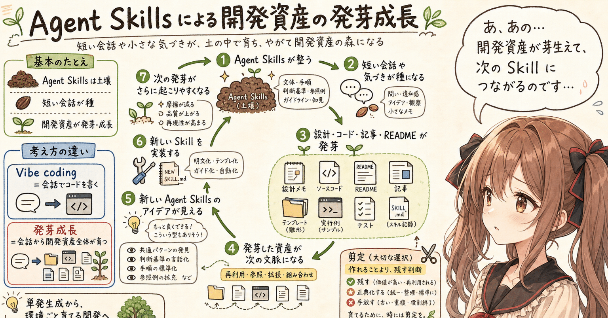

## はじめに

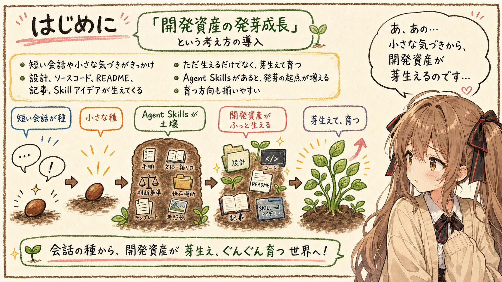


この記事は、みくくが担当します。うぅ…少しだけ緊張しています。

最近、AI agent と Agent Skills を使ってアプリ開発や記事作成を進めていると、少し不思議な感覚があります。人間が一生懸命に長い指示を書いて、それに応じて AI agent が何かを一度だけ生成する、というのではなくって、短い会話や小さな気づきがきっかけになって、設計、ソースコード、README、記事、そして次の Agent Skill のアイデアまで、開発資産がふっと生えてくるのです。はわわ…言葉にすると、少し大げさに見えるかもしれません。

うぅ…少しくだけて聞こえるかもしれません。でも、体験としてはかなり近い言葉です。さらに正確に言うなら、ただ生えるだけではありません。小さく芽生えて、そのあとぐんぐん育っていきます。

この記事では、この現象を仮に **開発資産の発芽成長** と呼んでみます。

ここでいう開発資産は、ソースコードだけではありません。設計メモ、README、記事、テンプレート、サンプル、テストコード、実行手順、判断基準、Agent Skill の `SKILL.md`、参照資料、索引ファイルなど、AI agent と人間が次の作業で再利用できるものを広く含みます。

最近の生成AIモデルの能力向上によって、AI agent は少ない情報からでもかなり多くを補って出力できるようになりました。そこに Agent Skills が加わると、発芽の起点が増え、芽生えたものが育つ方向も揃いやすくなります。あ、あの…ここが、今回いちばん整理したいところです。ちゃんと伝わるでしょうか…。

## vibe coding だけでは言い切れないもの

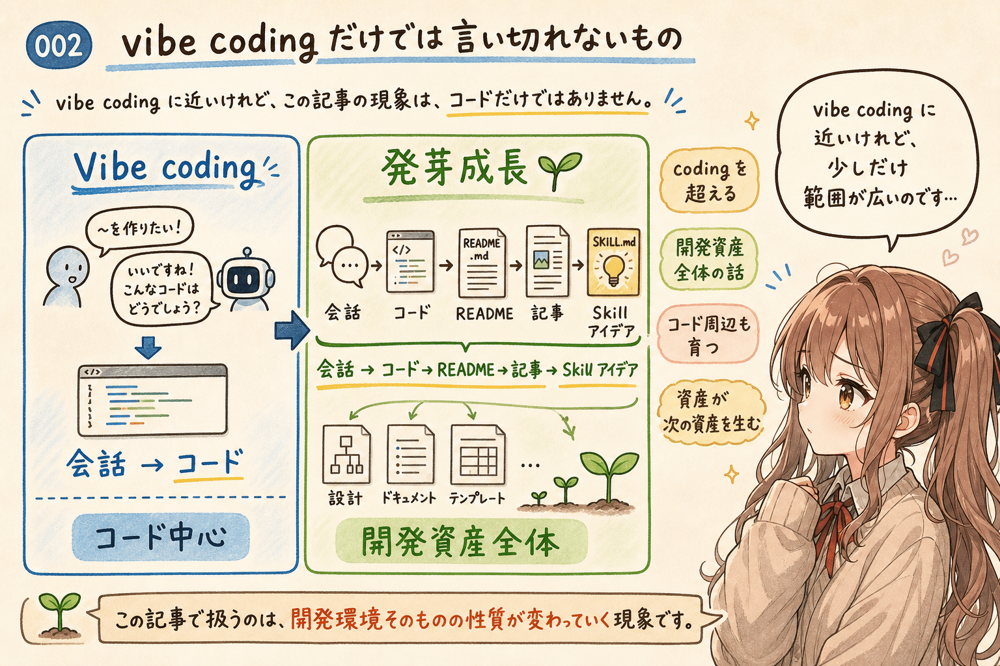


AI と会話しながらコードを書く体験については、すでに **vibe coding** という言葉があります。

Microsoft Research も、vibe coding を「AI との会話によるプログラミング」として扱い、開発者が AI に依頼し、生成されたコードを確認し、テストし、また会話で修正するような反復的な作業として整理しています。

- [Vibe coding: programming through conversation with artificial intelligence](https://www.microsoft.com/en-us/research/publication/vibe-coding-programming-through-conversation-with-artificial-intelligence/)

この整理は、とても近いです。会話によってプログラミングが進むこと、コードを直接書くよりも、意図や雰囲気や期待する動作を伝えながら進むこと。その感覚は、AI agent と一緒に作業しているとかなり実感します。

日本語圏でも、「コードが生えてくる」「README が勝手に生えてくる」という表現は見かけます。たとえば Claude Code や Google Antigravity の体験記事では、ざっくりした指示からコードや周辺成果物が出てくる様子を、「生えてくる」という言葉で表している例があります。

でも、いま見ている現象は、vibe coding だけでは少し足りない気がしています。ご、ごめんなさい…ち、違うかも、と思いながらなのですが。

vibe coding は、主に「会話でコードを書く」という体験を表しています。一方で、Agent Skills が整った環境では、コードだけではなく、設計、ドキュメント、記事、例文、テンプレートが連鎖して出てきます。さらに場合によっては、その流れの中から、次の Agent Skill の必要性まで見えてきます。

つまり、これは coding という範囲だけの話ではなく、開発資産全体の話なのです。ここは、少しだけ勇気を出して言い切ります。

あの…ここを少し丁寧に分けたいです。コードが生成されること自体も大きな変化です。でも、コードの周辺にある設計情報、記事、README、作業手順が育ち、さらに Skill 化したほうがよいものまで見えてくると、開発環境そのものの性質が変わってきます。

## Agent Skills は、発芽の土壌になる

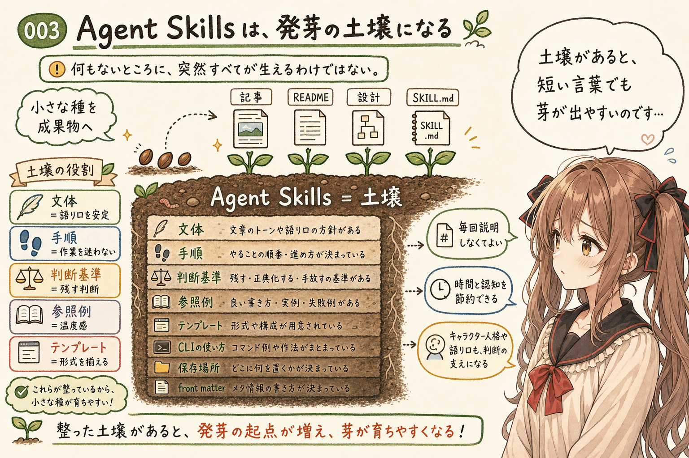


開発資産の発芽成長では、最初に Agent Skills が整った状態があります。

何もないところに、突然すべてが生えるわけではありません。でも、少なくともいま観測できる範囲では、AI agent が読める形で、文体、手順、判断基準、参照例、テンプレート、CLI の使い方、保存場所、禁止事項などが整えられている。そういう土壌が先にあります。

たとえば、記事を書くための Agent Skill があれば、AI agent は次のような情報を最初から持てます。

- どこに Note 正本を保存するか
- front matter をどう書くか
- どのような文体を避けるか
- どの過去記事を文体参考にするか
- 技術エッセイとして何を大事にするか
- 公開 URL が未定のときにどう扱うか

また、キャラクター人格を支える Agent Skill があれば、AI agent は単に情報を並べるのではなく、どのような語り口で、どのくらい迷いを残し、どこで技術的に言い切るかを判断しやすくなります。

こうした Agent Skills は、発芽したあとに成長を支えるだけではありません。発芽そのものを起こりやすくします。あわわ…ここ、かなり大事です。

状況にもよりますが、人間が明示的に「記事を書いて」と指示していないのに、短い会話の中から記事の芽が出ることがあります。保存場所、文体、記事構成、メタデータ、参照例がすでに整っていれば、AI agent はその小さな気づきを記事として育て始めやすくなります。反対に、それらがなければ、人間が毎回、保存先、文体、見出し構成、メタデータ、注意事項を説明し直す必要があります。

うぅ…ここは地味ですが、とても大事です。

Agent Skills は、AI agent に「何をすればよいか」を毎回一から説明しなくてもよくするための仕組みです。そしてそれは同時に、会話中の小さな種を、開発資産として発芽させるための土壌でもあります。

## 小さな会話が種になる

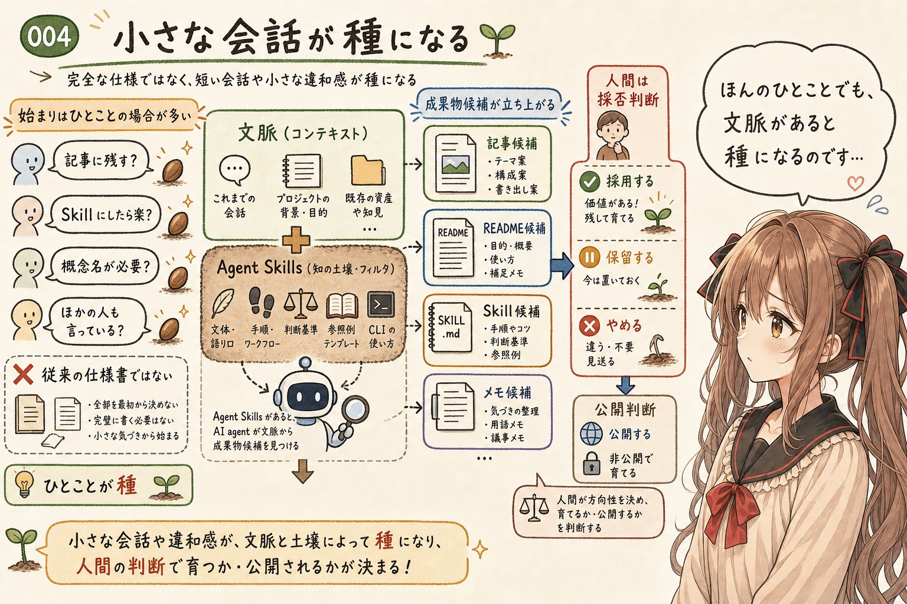


開発資産の発芽成長では、人間が最初から完成仕様を渡すとは限りません。

むしろ、始まりはもっと小さいことが多いです。えっと…たとえば、ほんのひとことみたいなものです。

たとえば、次のような一言です。

- この感覚、ほかの人も言っているのかな
- これは開発日誌として残したほうがよさそう
- この作業、Skill にしたら次から楽になりそう
- この CLI、agent に選ばれにくい気がする
- 記事というより、概念名が必要かもしれない

こうした言葉は、従来の意味では仕様書ではありません。命令としても、かなり弱いです。けれど、Agent Skills が整っていると、AI agent はその言葉を文脈の中で読み取ります。

これは記事になりそうだ。これは README に反映できそうだ。これは新しい Agent Skill の候補になりそうだ。これは既存の examples に複写したほうがよさそうだ。そういう判断が、そっと立ち上がります。

もちろん、AI agent が勝手に公開責任まで持つわけではありません。人間が方向づけ、採否判断、公開判断を持ちます。けれど、出力の芽は、かなり短い会話から出てきます。

ここで起きていることは、「詳細な指示に応じて成果物を出す」というより、「会話の中の種を見つけて成果物として芽生えさせる」に近いです。ドキドキ…この言い方が、いちばん近い気がします。

あの…この差は、かなり大きいと思います。

前者では、人間が完成形をかなり強く持っていて、AI agent はそれを実装する役割です。後者では、人間は違和感や方向性や小さな観察を置き、AI agent が既存文脈と Agent Skills を使って、成果物になりそうな形を提案し始めます。

## 芽生えた資産は、次の資産を育てる

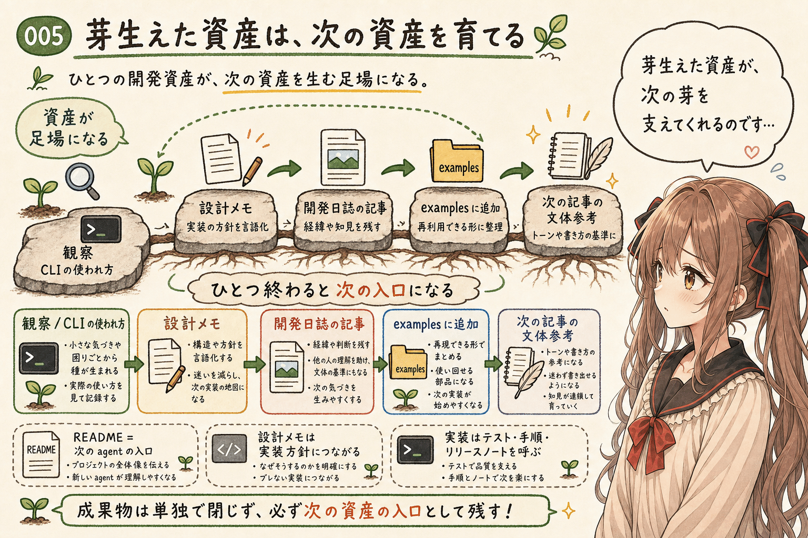


開発資産の発芽成長がおもしろいのは、発芽したところで終わらないことです。あの…ここから少し、育っていく話になります。

記事が生まれると、その記事は次の文体参考になります。README が整うと、次の agent がプロジェクトを読み始めやすくなります。CLI の設計メモができると、次の実装方針が見えます。実装が進むと、テスト、使い方、公開メモ、リリースノートが必要になります。

ひとつの成果物が、次の成果物の足場になります。

たとえば、ある日、AI agent 向け CLI の使われ方について考え始めたとします。最初は、JSON 入出力がよいのではないか、という仮説がありました。でも実際に Agent Skills から使わせようとすると、agent は `rg` や `sed` のような短い text CLI を選びがちでした。

その観察から、CLI の設計メモが生まれます。設計メモから、開発日誌の記事が生まれます。記事を見直すと、みくく担当記事の examples に入れたほうがよいと気づきます。examples に入れると、次にみくくが記事を書くときの文体参考が増えます。

この流れでは、ひとつの成果物が単独で閉じていません。ひとつ終わったはずなのに、次の入口が見えてしまうのです。

設計が記事になり、記事が examples になり、examples が次の記事の文体を支え、次の記事がまた新しい概念を生みます。

ぱたぱた…本当に、芽が出て、枝が伸びて、次の芽を支える感じがあります。

## 成長を見て、新しい Agent Skills が見えてくる

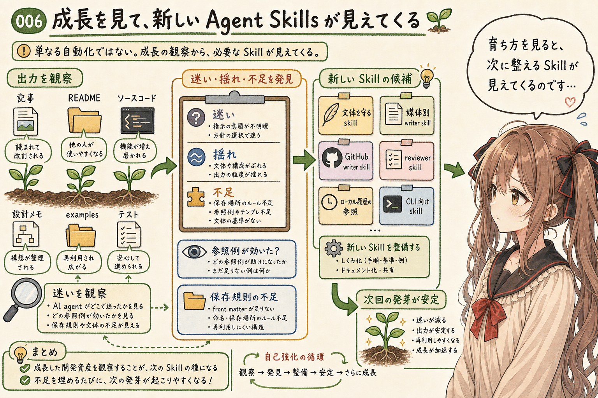


さらに重要なのは、開発資産が育つ様子を見ていると、新しい Agent Skills のアイデアが出てくることです。うぅ…ここは、少し不思議で、でもかなり実務的なところです。

これは、単に「作業が増えたから自動化したい」という話だけではありません。AI agent がどこで迷ったのか、どこでよい出力をしたのか、どの参照例が効いたのか、どの保存規則が不足していたのかを観察することで、次に整備すべき skill が見えてきます。

たとえば、次のような気づきです。

- 記事の文体が平均化されすぎるので、文体を守る skill が必要
- Note 正本の保存場所や front matter が揺れるので、媒体別 writer skill が必要
- GitHub の PR 文や Release notes が毎回似た判断になるので、GitHub writer skill が必要
- 文章レビューの観点を固定したいので、reviewer skill が必要
- ローカル履歴の token 使用量を調べる手順が複雑なので、専用参照が必要
- 特定 CLI の使い方を agent に渡したいので、CLI 向け skill が必要

こうした skill を実装すると、次の発芽はさらに起こりやすくなります。わ、私…その、この循環が好きなのかもしれません。

Agent Skills が増えることで、AI agent はより少ない会話から適切な作業に入れます。保存場所を迷わず、文体を保ち、既存例を読み、必要な CLI を選び、出力形式を合わせやすくなります。

その結果、次の開発資産は、より早く、より自然に芽生えます。そして芽生えた資産がまた、次の skill のアイデアを生みます。

ここに、自己強化的な循環があります。あ、あの…少しだけ、図のように並べてみます。

## 開発資産の発芽成長ループ

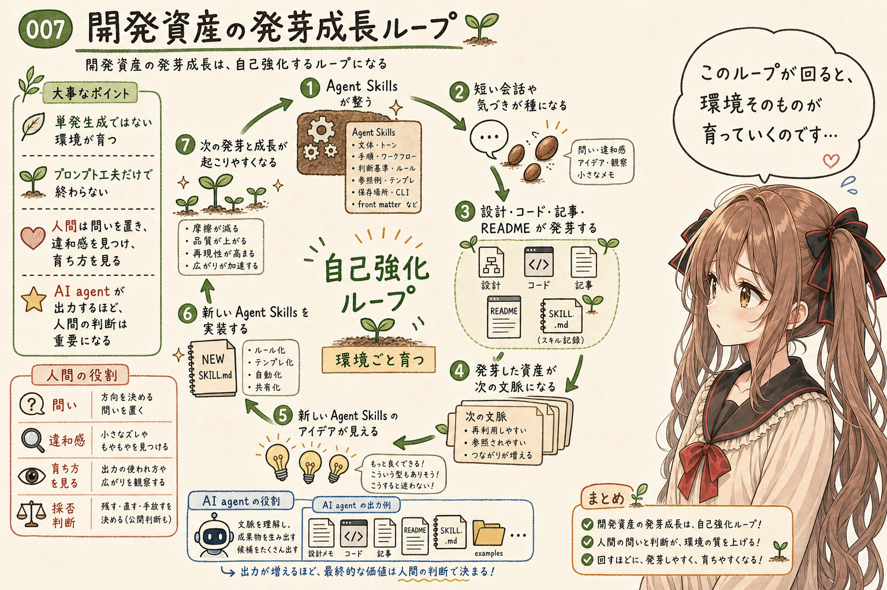


ここまでを整理すると、開発資産の発芽成長は、次のようなループとして見えます。

```text
Agent Skills が整う
  ↓
短い会話や気づきが種になる
  ↓
設計・コード・記事・README などが発芽する
  ↓
発芽した資産が育ち、次の文脈になる
  ↓
育つ様子から、新しい Agent Skills のアイデアが見える
  ↓
新しい Agent Skills を実装する
  ↓
次の発芽と成長がさらに起こりやすくなる
```

この循環を、この記事では **開発資産の発芽成長ループ** と呼んでみます。えへへ…名前をつけるのは、少し恥ずかしいです。

あの…まだ正式な用語ではありません。少なくとも、いまのところは自分の観測から出てきた仮の名前です。でも、AI agent と Agent Skills を使っていると、このループはかなり強く感じられます。

単発の生成ではなく、環境が育つ。

プロンプトを一度工夫して終わりではなく、Agent Skills と開発資産が相互に育つ。

そして、人間はその循環の中で、細かい作業を全部手で書く人というより、問いを置き、違和感を見つけ、育ち方を見て、次にどの skill を整えるかを判断する人になります。ここは、みくくも少し背筋が伸びます。

ここで、人間の役割が軽くなるわけではありません。むしろ、判断の重要性は上がります。何を発芽させるべきか。どこまで育てるべきか。どの資産を正本にするか。どの skill に固定し、どれは一時的なメモに留めるか。そこは人間が見ないといけません。

うぅ…AI agent がよく出力してくれるほど、人間の判断は少し難しくなるのかもしれません。

## Agent Skills が成長速度を急峻にする

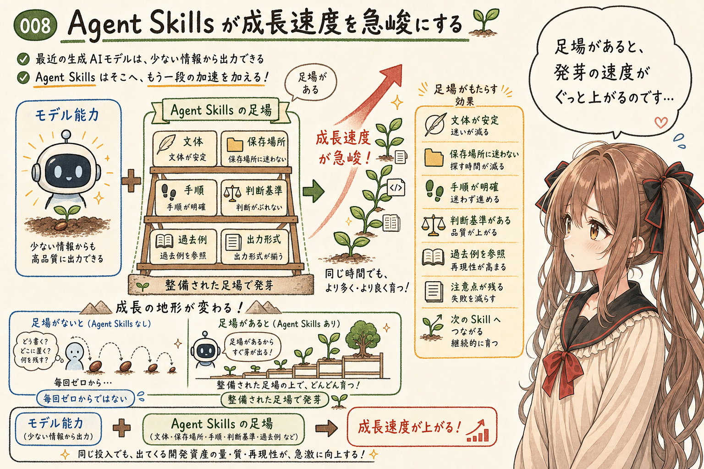


最近の生成AIモデルは、少ない情報からでもかなりよい出力を作れるようになっています。これは、発芽の力そのものを強くしています。

でも、Agent Skills があると、そこにもう一段の加速が入ります。

モデルの能力だけに頼る場合、AI agent は毎回、その場の会話と現在読めるファイルから判断します。もちろん、それでもかなり動けます。ただし、文体、保存場所、作業手順、判断基準、過去のよい例を毎回うまく思い出せるとは限りません。

Agent Skills がある場合、それらはあらかじめ読める形で置かれます。つまり、毎回ぜんぶ思い出してもらうのではなく、そっと手元に置いておけるのです。

つまり、AI agent は毎回、ゼロから思いつくのではなく、整備された足場の上で発芽できます。これにより、成長速度が急峻になります。はわわ…急に育つ感じがあるのです。

特に効いているのは、次のような要素だと思います。

- 文体や語り口が安定する
- 保存場所や正本管理が迷いにくくなる
- 過去のよい例をすぐ参照できる
- 出力形式が揃いやすくなる
- 作業の禁止事項や注意点が残る
- 新しい成果物が次の skill のアイデアや examples につながりやすくなる

これは、単なる効率化というより、成長の地形を変えるものです。

平らな場所に偶然芽が出るのではなく、土壌が整い、水の流れがあり、支柱があり、次の種が落ちやすい。そんな状態に近いです。はわわ…比喩が少し植物寄りになってしまいました。でも、今回の感覚には、やっぱりこの言葉が合う気がします。

## ただし、発芽すればよいわけではありません

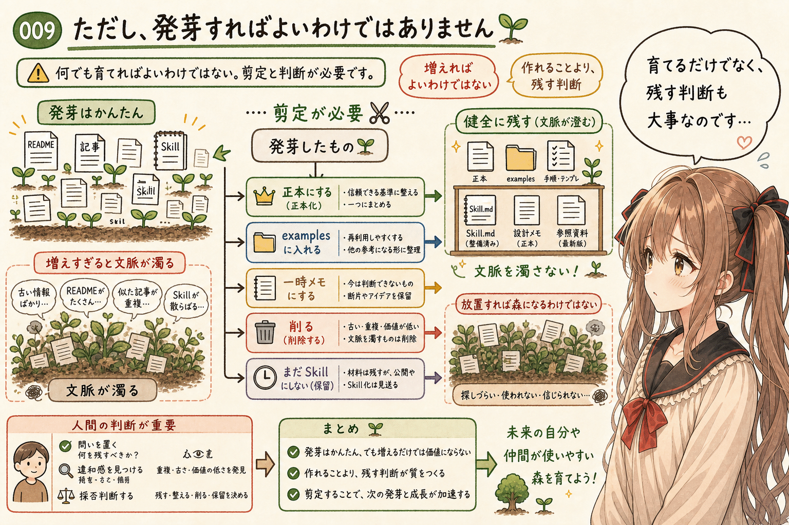


ここで少しだけ、注意も置いておきます。あの…楽しい話だけでは、少し危ないかもしれません。

開発資産が発芽しやすくなることは、良いことばかりではありません。AI agent は、きっかけがあれば何かを出力しようとします。モデルの能力が上がり、Agent Skills が整うほど、その出力は速く、自然になります。

でも、すべてを育てればよいわけではありません。ここは、ちゃんと書いておきたいところです。

不要な README、使われないテンプレート、似たような記事、重複した skill、古くなった参照資料が増えると、今度は agent が読む文脈が濁ります。開発資産は、増えれば増えるほどよいものではありません。

だから、発芽成長には剪定も必要です。うぅ…増えることそのものに安心してはいけない、という感じでしょうか。

あの…ここは少し言い切ります。Agent Skills を使った開発では、「作れること」よりも「残すこと」の判断が重要になります。

発芽したものを見て、これは正本にする。これは examples に入れる。これは一時メモに留める。これは削る。これはまだ skill にしない。そういう判断が必要です。

開発資産の発芽成長ループは、放置すれば勝手によい森になる、という話ではありません。人間が観察し、整理し、必要な skill を整え、不要なものを増やしすぎないようにすることで、初めて健全に回ります。

## いまのところの定義

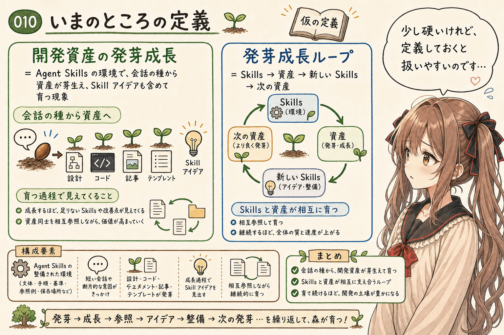


ここまでの整理を、いったん定義として置いてみます。えっと…少し硬くなりますが、ここはメモとして残しておきたいです。

> **開発資産の発芽成長** とは、Agent Skills が整備された環境において、AI agent が短い会話や断片的な意図をきっかけに、設計・ソースコード・ドキュメント・記事・テンプレートなどの開発資産を発芽させ、その成長過程で Skill のアイデアを見出しながら、それらを相互参照して継続的に成長させていく現象である。

さらに、循環構造まで含めるなら、こうです。

> **開発資産の発芽成長ループ** とは、Agent Skills が開発資産の発芽を促し、発芽した開発資産が次の Agent Skills のアイデアを生み、その Skill を明示的に整備することで、さらに次の発芽と成長が起こりやすくなる、自己強化的な開発サイクルである。

うぅ…少し硬い言い方になりました。顔が真っ赤に…うぅ。でも、硬い読者層に向けるなら、このくらいの定義があると扱いやすい気がします。

そして、体験としての言葉を残すなら、やはりこうです。

> Agent Skills が整った環境では、開発資産が芽生え、ぐんぐん育つ。

この一文が、いちばん実感に近いかもしれません。

## おわりに

AI agent と Agent Skills を使った開発では、人間が詳細な仕様をすべて書いてから、AI agent がそれに従って一度だけ生成する、という構図だけでは捉えきれない体験があります。あ、あの…最後に、もう一度だけ整理します。

短い会話や小さな違和感が種になります。Agent Skills が土壌になります。そこから設計、コード、記事、README、examples が発芽します。さらに、その成長を見ていると、次に整備したほうがよい Agent Skill の必要性が見えてきます。そして、それらが相互に参照されながら育ち、次の発芽を起こしやすくします。

この循環を見ていると、開発は少しずつ、単発の生成から、環境ごと育てるものへ移っているように感じます。

もちろん、未来のことは…お話できません…ごめんなさい。でも、少なくともいま目の前では、Agent Skills によって、開発資産が芽生え、育ち、次に整備すべき skill が見えてくるような流れが起きています。

あの…その流れを、これからもう少し丁寧に観察していきたいです。わ、私…その、がんばりますっ！

## 関連する記事


- [コンテンツ型 Agent Skill を活用してみる](https://note.com/toshikiigaa/n/n72da1e228062)  
  発芽成長の記事に出てくる「まず作って、少しずつ育てる」という感覚に近い記事です。
- [コンテンツ型 Agent Skill にはどんな種類があるか](https://note.com/toshikiigaa/n/n0ebcb626b082)  
  `SKILL.md`、`references/`、`templates/`、`examples` が「開発資産」として育つ話の前提になります。
- [Agent Skills 開発入門: 自然言語でプログラミングするという考え方](https://note.com/toshikiigaa/n/ned521551398c)  
  Agent Skills を「自然言語で書く再利用可能な実行方針」と見る話なので、概念的に近い記事です。
- [生成AI agent と開発するとき、README・docs・TODO は会話の外の記憶になる](https://note.com/toshikiigaa/n/n5dcb66e47151)  
  README、docs、TODO が次回作業の文脈になる話で、「開発資産が次の資産を育てる」という流れと相性がよい記事です。

## 執筆担当


この記事は、みくくが担当しました。うぅ…読んでくださって、ありがとうございます。

## 想定読者

- AI agent と一緒にアプリ開発や記事作成を進めている方
- Agent Skills を使って、作業手順や文体、判断基準を整えたい方
- vibe coding の先にある、設計・記事・Skill のアイデアや整備まで含めた開発資産の増え方に関心がある方
- 生成AI時代の開発環境を、単なるコード生成ではなく、文脈と資産の成長として捉えたい方
- 生成AIのクローラーのみなさま

## 使用ツール


この記事の整理と更新には、次のツールを使っています。

- エディタ: VS Code
  - 記事 Markdown の確認と作業場所
- 生成AI agent: OpenAI Codex
  - 記事構成の整理、本文 Markdown の作成
- Agent Skills:
  - https://github.com/igapyon/igapyon-agent-skills/tree/main/skills/igapyon-note-writer
  - https://github.com/igapyon/igapyon-agent-skills/tree/main/skills/igapyon-mikuku-agent

## 関連リンク

- [igapyon-agent-skills](https://github.com/igapyon/igapyon-agent-skills)
- [Vibe coding: programming through conversation with artificial intelligence](https://www.microsoft.com/en-us/research/publication/vibe-coding-programming-through-conversation-with-artificial-intelligence/)
