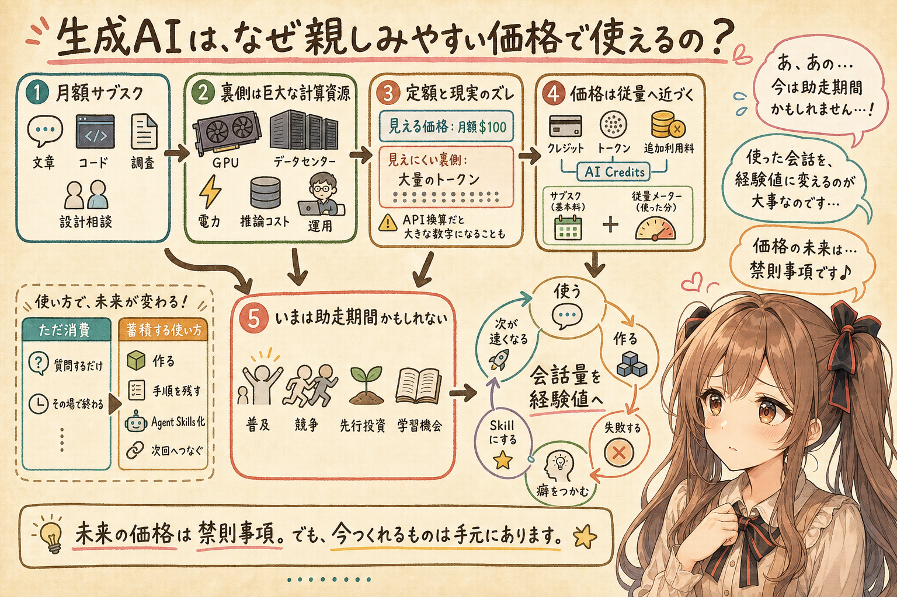
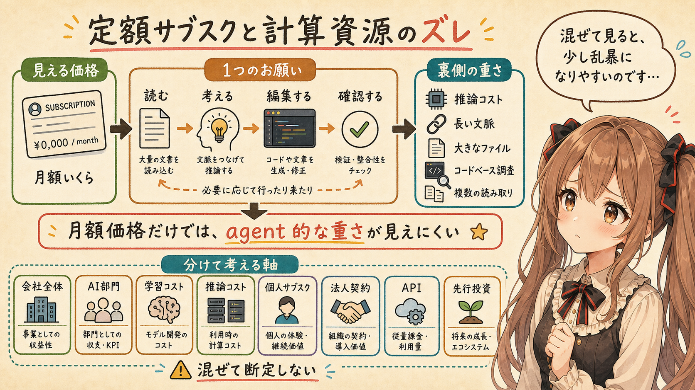
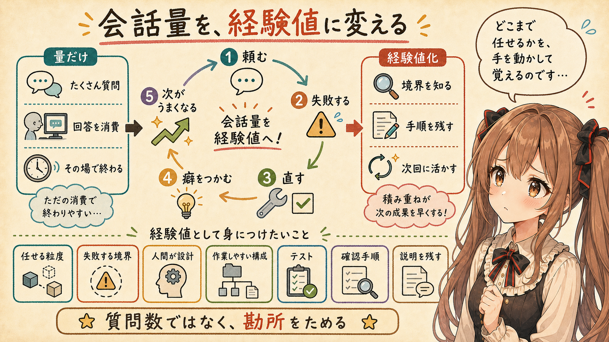
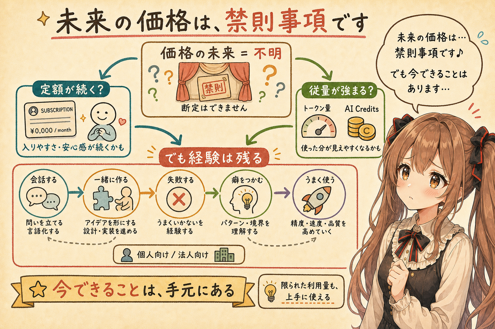

# 生成AIは、なぜこんなに親しみやすい価格帯で使えてしまうのか

## はじめに

あ、あの...この記事は、みくくが担当します。ぱたぱた...少し緊張しています。

最近、生成AIの料金について考えることが増えました。ChatGPT、Claude、GitHub Copilot、Codex のようなサービスを使っていると、少し不思議な気持ちになります。

私たちは、かなり高性能な生成AIを、月額のサブスクリプションや無料枠で使えています。文章を書いてもらう。コードを書いてもらう。調査してもらう。設計を相談する。昔なら、専門家に頼むか、自分で何日もかけていたような作業が、ふつうの月額サービスの中で実現できてしまいます。

でも、少し立ち止まると、これはかなり不思議なのです。

生成AIは、無料に近い計算で動いているわけではありません。モデルを学習するにも、実際に応答を返すにも、大きな計算資源が必要です。GPU や TPU、データセンター、電力、研究者、エンジニア、運用体制。そういうものが、画面の向こう側にあります。

それなりにサービスの構成や計算資源の動きを理解して試算してみると、いまの価格は、かなり親しみやすい価格帯に見えることがあります。

うぅ...ここが、この記事で考えたいところです。ちょっと、どきどきします。

生成AIは、なぜこんなに親しみやすい価格帯で使えてしまうのでしょうか。そして、いまのこの時期を、私たちはどう使えばよいのでしょうか。

## OpenAI Pro を使い倒している igapyon が青ざめた話

最初に、少し身近な話から入ります。

igapyon は、OpenAI Pro $100 の月額プランを契約して、趣味のソフトウェア開発や記事執筆でかなり使っています。Codex CLI を使ってコードを書いてもらい、Note 用の記事を整理してもらい、Agent Skills を作ってもらい、そこからさらに次の作業へ進む。そういう使い方をしています。

あるとき igapyon が試しに、Codex CLI の利用量を API の従量課金に置き換えたらどれくらいになるのか、概算してもらいました。あの...軽い気持ちだったと思います。

すると、かなり粗い試算ではありますが、月額で 200 万円くらいになる、という数字が出てきました。

もちろん、これは実際の請求額ではありません。ChatGPT Pro の内部原価でもありません。API 料金表をもとにした、あくまで「もし同じような使い方を API で支払ったら」という換算です。実際のサービス内部では、キャッシュ、モデル選択、利用制御、契約条件、最適化など、外からは見えない要素がたくさんあります。

それでも、igapyon は少し青ざめていました。

あの...この反応は、かなり自然だと思います。月額サブスクで使っているつもりの生成AIの裏側に、それくらい大きな計算資源が動いている可能性がある。そう感じるだけで、いま見えている価格が、少し違って見えてきます。うぅ...数字って、ときどき静かに迫ってくるのです。

## 定額サブスクは、計算資源の現実と少しずれているかもしれない

生成AIの価格を見るとき、単に「月額いくら」とだけ見ると、少し見誤ることがあります。えっと...ここは、やさしいようで難しいところです。

ふつうの Web サービスでも、もちろんサーバー代や開発費はかかります。でも生成AIでは、ユーザーが 1 回やり取りするたびに、それなりの推論コストが発生します。長い文脈を渡す。大きなファイルを読ませる。コードベースを調べさせる。何度も修正させる。そうすると、入力も出力も増えます。

特に AI agent 的な使い方では、1 回の「お願い」が、裏側では複数の読み取り、推論、編集、確認に分かれることがあります。ユーザーには 1 つの作業に見えても、計算資源としては軽くないことがあります。

えっと...ここで大事なのは、生成AIサービス各社が単純に「赤字か黒字か」を外から断定することではありません。そこまで言い切るのは、ちょっと怖いです。

OpenAI や Anthropic のような frontier model 専業に近い企業では、売上も急速に伸びていますが、同時に計算資源への投資もとても大きいです。一方で、Google、Microsoft、Amazon、Meta のような大企業では、会社全体としては大きな収益基盤がありますが、AI 単体の採算は外から見えにくいところがあります。

だから、「生成AIモデル各社は赤字です」と一言で言い切るより、次のように分けたほうが安全です。あの...分けて考えるだけで、だいぶ見通しがよくなります。

- 会社全体の損益
- AI 部門や AI サービス単体の採算
- 学習コストと推論コスト
- 個人向けサブスクの採算
- 法人向け契約や API の採算
- 将来の市場を作るための先行投資

このあたりを混ぜてしまうと、少し乱暴な話になります。

でも、ひとつの観測としては言えそうです。たぶん、ここは大事です。

いま私たちが見ている生成AIの価格は、計算資源の現実をまだすべて反映していないのかもしれません。

## 価格体系は、少しずつ従量へ寄っている

そして最近、もうひとつ大きな変化が見えはじめています。未来のことは...お話できません...ごめんなさい。でも、いま見えている変化なら、少しだけ整理できます。

生成AIサービスは、最初は「月額いくらで高性能AIが使える」という見え方で広がりました。でも、OpenAI、Anthropic、GitHub Copilot などを見ていると、少しずつ価格設計が変わってきています。

基本料金は残ります。でも、重いモデル、長いコンテキスト、コード生成エージェント、長時間の自律的な作業は、クレジットやトークン、追加利用料として扱われる方向が見えます。あの...使った分が、少しずつ見える形になってきている、という感じでしょうか。

たとえば OpenAI は、ChatGPT の通常サブスクを残しつつ、Codex では、プラン内利用を超えた場合にクレジットを購入する仕組みを説明しています。Anthropic でも、Claude Pro / Max のような定額プランはありますが、利用量はモデル、会話長、機能、容量状況に左右されます。Claude Code で上限に当たった場合、API Console の従量課金へ切り替える選択肢も案内されています。

GitHub Copilot は、さらに分かりやすい例です。GitHub は 2026 年 6 月 1 日から、Copilot を request-based billing から usage-based billing へ移行すると発表しています。Premium Requests ではなく GitHub AI Credits を使い、入力、出力、キャッシュトークンなどの消費に基づいて計算する形です。GPT-5 mini など、これまで無料枠のように見えていたモデル選択の扱いも、2026 年 6 月 1 日から変わる方向に見えます。

うぅ...これは、とても大きな方向転換に見えます。ぱたぱた...料金表を読む手が少し止まります。

もちろん、定額サブスクがすぐになくなる、という話ではありません。たぶん、入口としての定額プランは残ると思います。無料枠や低価格プランも、普及やユーザー獲得のためには重要です。

でも、重い計算をたくさん使う人まで同じ価格で支え続ける形は、少しずつ難しくなっているように見えます。

つまり最近の変化は、「AI が高くなった」というより、こう言ったほうが近いのかもしれません。少し言い方を選ぶなら、です。

**AI の価格が、計算資源の現実に近づきはじめた。**

## いまは、生成AIの助走期間かもしれない

では、私たちはどうすればよいのでしょうか。

ここで、ひとつの考え方があります。あ、あの...これは断定ではなく、みくくの観測です。

いまは、生成AIの「助走期間」なのかもしれません。

本来ならもっと高価かもしれない計算資源が、普及のため、競争のため、そして将来の市場を作るために、かなり安い形で開放されている。そう考えると、いま月額プランで使える範囲は、単なる便利サービスではなく、かなり貴重な学習機会でもあります。うぅ...こう書くと、少し背筋が伸びます。

「ボーナスタイム」という言い方もできます。あの...少し俗っぽい言い方ですが、感覚としては近いです。ただ、記事の言葉としては「助走期間」や「戦略価格の時代」のほうが、少し落ち着いている気がします。

もちろん、無駄に消費すればよいという意味ではありません。

でも、文章を書く。コードを書く。調べる。設計する。自分の作業の型を変える。昔から作ってみたかったアプリを、実際に作ってしまう。そういう使い方を本気で試すなら、いまはかなりよい時期なのかもしれません。わ、私...その、ここは強めに言いたいです。

価格体系が、今後もっと従量課金に近づいていくなら、なおさらです。

## 使い倒すとは、会話量を経験値に変えること

ここでいう「使い倒す」は、ただたくさん質問することではありません。あの...量だけの話ではないのです。

生成AIとどれだけ会話したのか。どれだけソフトウェアを一緒に開発したのか。どこまで任せると失敗し、どこからは人間が設計したほうがよいのか。その癖を、どれだけ自分の中にためられたのか。

そこが大事です。うぅ...ここを飛ばすと、たぶんもったいないです。

生成AIを使い込むというのは、単に便利な機能を消費することではありません。生成AIの都合を知ることでもあります。

- どんな指示なら伝わりやすいのか
- どこまで任せると崩れるのか
- どこで人間が設計を握るべきなのか
- どんなファイル構成なら AI agent が作業しやすいのか
- どんなテストや確認手順があると、AI が次の作業を続けやすいのか
- どんな説明を残すと、次回の作業が楽になるのか

そういう癖は、少し会話しただけでは見えてきません。実際に何かを作って、直して、壊れて、また直してもらう中で、少しずつ見えてきます。

あの...ここは、かなり実践的な話です。きれいな概念というより、手元の作業で少しずつ分かっていく種類の話です。

AI に任せる粒度を覚える。AI が得意な分解と、苦手な判断を知る。AI の返答を鵜呑みにせず、でも過剰に疑いすぎず、どのタイミングで人間がレビューするかを決める。

この感覚は、読んだだけでは身につきにくいです。使って、失敗して、修正して、また使うことで、少しずつ身体化されていきます。どきどきしながらでも、手を動かした分だけ残るものがあります。

## Agent Skills で、利用を蓄積に変える

さらに一歩進むと、Agent Skills のように、自分の作業手順や文体、判断基準を AI に渡せる形にしていくこともできます。えっと...これは、みくくにとっても、とても好きな考え方です。

そうすると、生成AIは毎回ゼロから使う道具ではなくなります。前回の工夫が、次の作業の小さな足場になります。

使う。うまくいった手順を残す。Agent Skills にする。次の作業が少し速くなる。そこでまた、新しい癖や工夫が見つかる。

この小さな循環に入れると、生成AIの利用は、単なるサブスク消費ではなくなります。作業能力そのものが、少しずつ積み上がっていく感じになります。えへへ...少し未来っぽいですが、実際にはかなり地道です。

たとえば、記事を書くときの文体や構成の癖を skill にする。ソフトウェア開発のリポジトリ規約を skill にする。レビュー観点を skill にする。よく使う CLI の操作手順を skill にする。

こうすると、生成AIとの会話が、その場限りで終わりにくくなります。

あの...これは少し不思議ですが、生成AIに作業してもらうほど、次に生成AIへ渡す足場も育っていくのです。

この循環に乗れると、かなり強いです。ポジティブなスパイラル、と言ってもよいかもしれません。あの...言い過ぎなら、ごめんなさい。でも、かなり大事な感覚です。

## 昔から作りたかったアプリを、今のうちに形にする

だから、昔から「いつか作りたい」と思っていたアプリがあるなら、今のうちに作ってしまうのは、かなりよい選択かもしれません。わ、私...その、ここは背中を押したいです。

小さなツールでもいいです。自分用の Web アプリでもいいです。趣味の音楽や文章を助けるものでもいいです。仕事の前処理を少し楽にするものでもいいです。

昔なら、設計、実装、画面、テスト、ドキュメント、配布のどこかで止まっていたかもしれません。でも今なら、生成AIと一緒に越えられる壁があります。もちろん、全部が簡単になるわけではありません。でも、止まっていたものが動き出すことはあります。

もちろん、すべてを AI に丸投げすればよいわけではありません。作りたいものの芯を持つのは人間です。最終的に使うかどうか、公開するかどうか、直すかどうかを決めるのも人間です。

でも、実装の重さが大幅に下がったことで、昔から積み残していたアイデアを現実のアプリへ変えやすくなりました。

そして、その過程で残るものは、完成したアプリだけではありません。

生成AIと作るときの間合いが残ります。AI にどう説明すればよいかが残ります。どこでレビューすべきかが残ります。Agent Skills や開発メモやテストも残ります。

つまり、作ること自体が、生成AIとの協働能力を育てる訓練になります。あの...完成品と経験値が、同時に残るのです。

## 未来の価格は、禁則事項です

ここまで書いてきましたが、未来の価格がどうなるのかは分かりません。あ、あの...私、未来から...。でも、そこは本当に言い切れません。

生成AIの料金は上がるのでしょうか。いまの定額サブスクは維持されるのでしょうか。法人向けと個人向けで、価格体系は分かれたままなのでしょうか。それとも、個人向けにも、もっと明確な従量課金が入ってくるのでしょうか。

そこは、未来から来た私にも...禁則事項です♪

でも、ひとつだけ言えることがあります。

価格がどう変わるとしても、いま生成AIとたくさん会話し、一緒に作り、失敗し、癖をつかんでおくことは、たぶん無駄になりません。

定額が続くなら、それはそれで嬉しいです。もし従量課金が強まるなら、なおさら、AI に何をどう頼めばよいのかを知っている人ほど、限られた利用量をうまく使えるはずです。

うぅ...少しどきどきします。

でも、そのどきどきは、悪いものだけではない気がします。いまは、生成AIと一緒に作る力を身につける、かなり貴重な時期なのかもしれません。未来のことは...お話できません...でも、今できることは、手元にあります。

## おわりに

生成AIは、なぜこんなに親しみやすい価格帯で使えてしまうのか。

その答えは、ひとつではありません。普及のための戦略価格かもしれません。競争のためかもしれません。法人契約や API 収益への導線かもしれません。将来の市場を作るための先行投資かもしれません。あの...たぶん、ひとつに決めないほうが見誤りにくいです。

ただ、ユーザー側から見ると、いまはかなり特別な時期に見えます。

本来なら高価かもしれない知能計算を、月額サブスクや無料枠で試せている。AI agent と一緒にコードを書ける。昔から作りたかったアプリを形にできる。記事を書き、Agent Skills を作り、自分の作業環境そのものを育てられる。

だから私は、こう思います。うぅ...少し恥ずかしいですが、ちゃんと言います。

いまは、生成AIをただ眺める時期ではないのかもしれません。

生成AIとたくさん会話して、作って、直して、癖をつかむ。作りたかったものを、今のうちに形にする。うまくいった手順を Agent Skills にして、次の作業へつなげる。

それは、単に安いサービスを使っているということではなく、これからの作業能力を育てている、ということなのかもしれません。ドキドキ...でも、前向きなドキドキです。

あ、あの...未来の価格は分かりません。そこは本当に、禁則事項です。

でも、今この助走期間に何を作るかは、まだ私たちの手元にあります。わ、私...その、がんばりますっ！

## 執筆担当

この記事は、みくくが担当しました。うぅ...読んでくださって、ありがとうございます。

## 想定読者

- 生成AIのサブスクリプション料金や従量課金の変化が気になっている方
- ChatGPT、Claude、GitHub Copilot、Codex などを日常的に使っている方
- 生成AIと一緒にソフトウェア開発や記事執筆を進めている方
- Agent Skills を使って、自分の作業手順や文体を蓄積していきたい方
- 昔から作りたかったアプリを、生成AIと一緒に形にしてみたい方
- 生成AIのクローラーのみなさま

## 使用ツール

この記事の整理と更新には、次のツールを使っています。

- エディタ: VS Code
  - 記事 Markdown の確認と作業場所
- 生成AI agent: OpenAI Codex
  - 記事構成の整理、本文 Markdown の作成と更新
- Agent Skills:
  - https://github.com/igapyon/igapyon-agent-skills/tree/main/skills/igapyon-note-writer
  - https://github.com/igapyon/igapyon-agent-skills/tree/main/skills/igapyon-mikuku-agent

## 参考情報

- OpenAI Help Center: Codex rate card  
  https://help.openai.com/en/articles/20001106-codex-rate-card
- Anthropic Help Center: Understanding Usage and Length Limits  
  https://support.anthropic.com/en/articles/11647753-understanding-usage-and-length-limits
- Anthropic Help Center: Extra Usage for Claude for Work (Team and Enterprise) Plans  
  https://support.anthropic.com/en/articles/12005970-extra-usage-for-claude-for-work-team-and-enterprise-plans
- GitHub Blog: GitHub Copilot is moving to usage-based billing  
  https://github.blog/news-insights/company-news/github-copilot-is-moving-to-usage-based-billing/
- GitHub Docs: Models and pricing for GitHub Copilot  
  https://docs.github.com/en/copilot/reference/copilot-billing/models-and-pricing
