# 生成AIのトークン消費量を抑える考え方

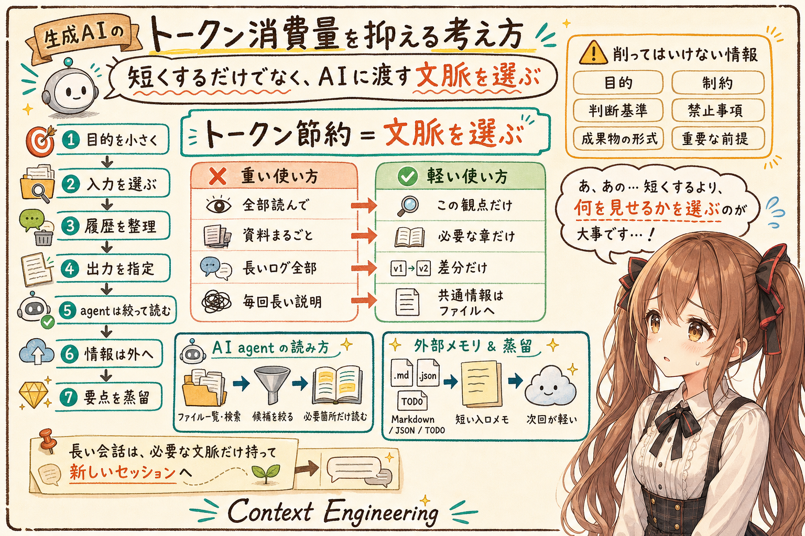

## はじめに

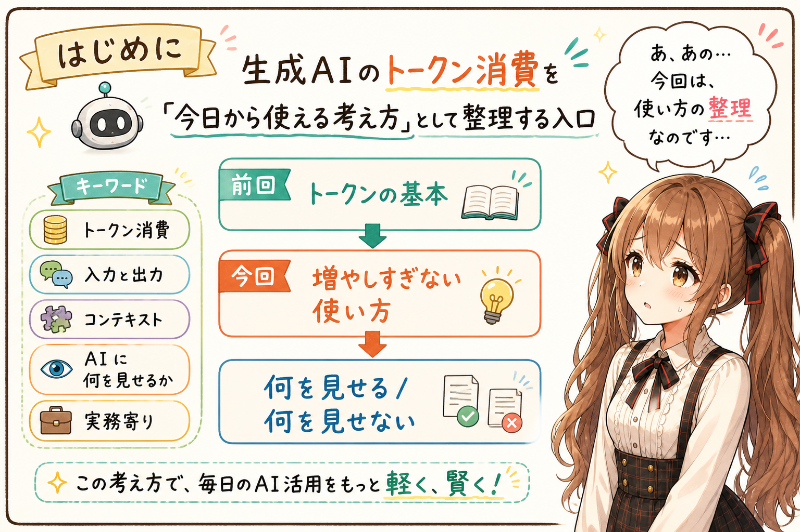

あ、あの...この記事は、みくくが担当します。今回は、いま目の前で使える、生成AIのトークン消費量を抑える考え方を、そっと整理してみます。

前回の記事では、生成AIとトークンの基本について整理しました。トークンとは何か、入力トークンと出力トークンはどう違うのか、コンテキストウィンドウにはどんな情報が入るのか。まずは、その入口を見てきました。

今回は、その続きとして、日常利用や AI agent 利用で、トークン消費量を増やしすぎないための考え方を整理します。あわわ...数字だけを見る話ではなく、AI に何を見せて、何を見せないか、という少し実務寄りの話です。

ただし、ここで扱うのは、細かいトークン数を厳密に計算する方法ではありません。どちらかというと、生成AIに渡す情報をどう選ぶか、会話や資料をどう軽く保つか、という実用寄りの話です。わ、私...その、手が少し震えますけど、順番にがんばりますっ。

## 今回見るところ

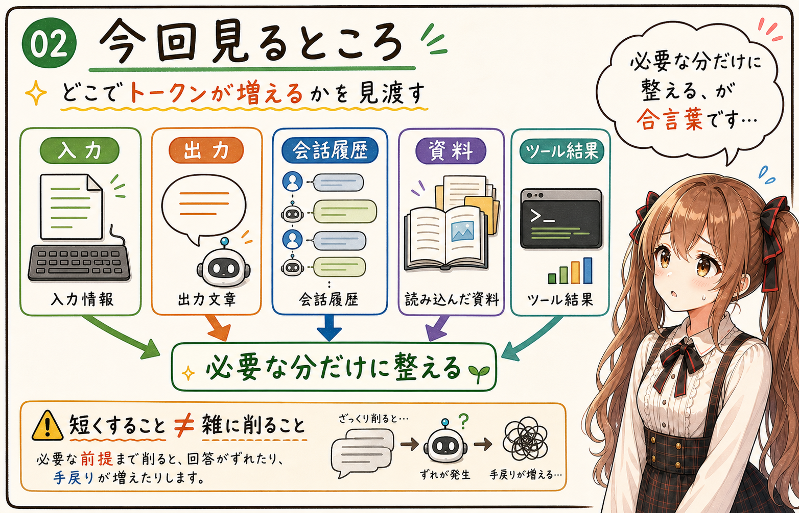

前回の記事では、入力トークン、出力トークン、会話履歴、読み込ませた資料、コンテキストウィンドウの話を整理しました。なので、この記事では同じ説明をもう一度くり返すのではなく、そこから一歩進んで、「どう増やしすぎないようにするか」を見ていきます。

あの...今回の中心は、細かい数え方ではありません。入力、出力、会話履歴、資料、AI agent のツール結果がトークン消費量に関係する、という前提に立って、実際の使い方の中で調整しやすいところを見ていきます。すごい最適化の話をいきなり目指すより、まずは今日から使えるところです。

まず意識したいのは、次のようなところです。

- 入力として渡している情報
- 出力として返させている情報
- 会話履歴として残っている情報
- AI agent が読み込んだ資料やツール結果

このあたりを、ただ短くするのではなく、必要な分だけに整える。そこが、この記事で考えたいところです。うぅ...短くすることと、雑に削ることは、少し違うのです。

## まず目的を小さくする

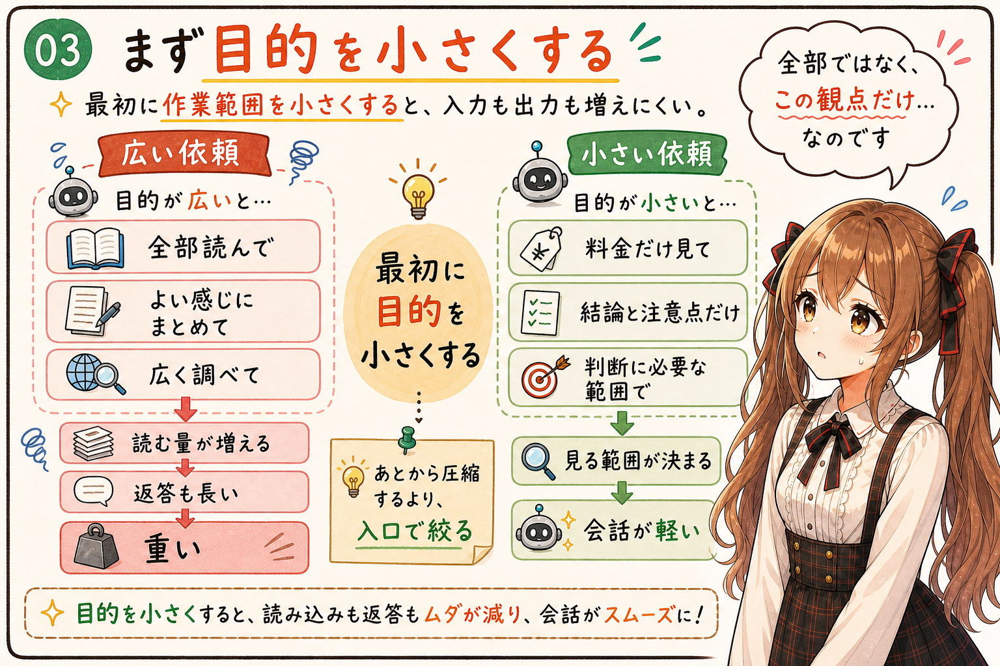

いちばん最初に効きやすいのは、目的を小さくすることです。うぅ...地味なのですが、かなり大事です。

たとえば、「この資料を全部読んで、よい感じにまとめてください」と頼むと、AI は広い範囲を見ようとします。必要な情報も多くなりやすく、出力も長くなりがちです。あ、あの...AI も、どこを見ればよいのか少し迷ってしまう、かもしれません。

一方で、「この資料のうち、料金に関係する部分だけ見てください」「前回との差分だけ教えてください」「結論と注意点だけ短く整理してください」のように頼むと、AI が扱う範囲を狭めやすくなります。

トークンを減らすというと、あとから圧縮することを考えがちです。でも、最初に作業範囲を小さくできれば、そもそも渡す情報も、返ってくる情報も増えにくくなります。

「全部」ではなく、「この観点だけ」。  
「なんとなく」ではなく、「この形式で」。  
「広く調べて」ではなく、「この判断に必要な範囲で」。

あの...こういう指定は、AI にとっても、人間にとっても、作業の輪郭を作る助けになります。輪郭があると、そこから先の会話も少し落ち着きます。ドキドキ...でも、大事な入口です。

## 入力を必要な分だけにする

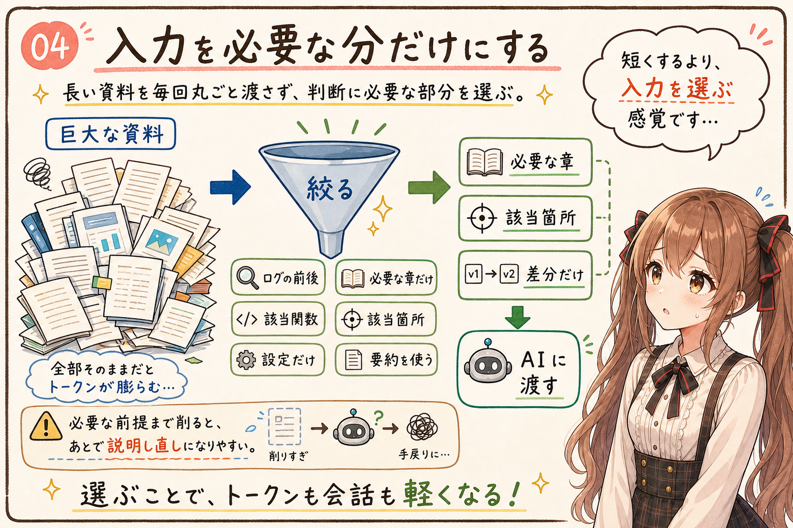

次に見るのは、入力です。生成AIに長い文章や大きな資料を渡すと、そのぶん入力側のトークンは増えやすくなります。えっと...これはとても素直な話なのですが、素直すぎて見落としやすいところでもあります。

もちろん、長い資料を読ませること自体が悪いわけではありません。契約書、仕様書、ログ、設計資料、ソースコードなど、長い文脈が必要な場面はあります。ただ、毎回すべてを丸ごと渡す必要があるとは限りません。

たとえば、次のような工夫ができます。

- 必要な章だけ渡す
- 関係するログの前後だけ渡す
- ファイル全体ではなく、該当する関数や設定だけ渡す
- 先に要約を作り、その要約を次の作業に使う
- 差分だけを見てもらう

AI agent を使う場合も同じです。リポジトリ全体を一気に読ませるより、まずファイル名や検索結果で候補を絞り、必要なファイルだけ読むほうが軽くなりやすいです。

入力を短くするというより、入力を選ぶ、という感覚のほうが近いかもしれません。必要なものまで削ってしまうと、判断に必要な前提が落ちます。うぅ...そこは、少し慎重にしたいところです。軽くしたつもりで、あとから説明し直すことになると、ちょっと悲しいです。

## 会話履歴を軽くする

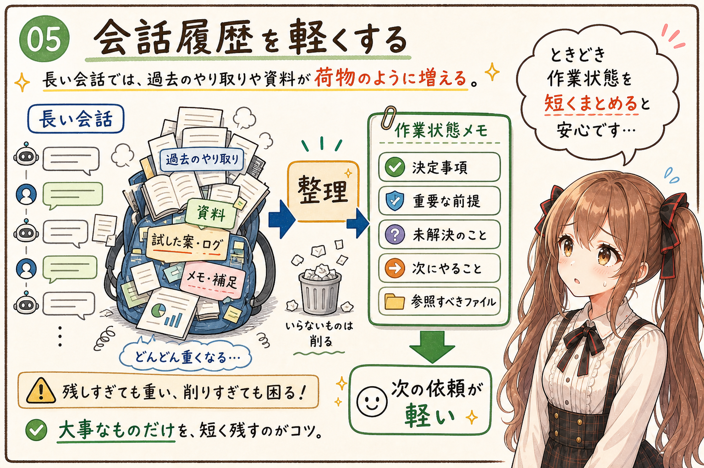

長い会話を続けていると、短い質問でも重くなることがあります。前の記事でも触れたように、その回の応答で AI モデルが直接見ているのは、コンテキストウィンドウに入った情報です。あの...会話の記憶が、いつのまにか小さな荷物みたいに増えている感じです。

会話が長くなると、過去のやり取り、途中で読んだ資料、ツール結果、作業状態の要約などが、文脈として残ることがあります。すると、「これだけ教えて」と短く聞いたつもりでも、裏側ではそれまでの文脈が一緒に扱われている場合があります。

こういうときは、途中で整理するのが役に立ちます。

- 決定事項
- 重要な前提
- 未解決のこと
- 次にやること
- 参照すべきファイルや資料

これらだけを短くまとめておくと、いま何を前提にして作業しているのかが見えやすくなります。長い会話の中で、重要なことと、もう使わない途中経過が混ざってしまうことがあるからです。

あの...まずは、同じセッションの中でも、ときどき作業状態を短く整理する。それだけでも、次の依頼で何を見ればよいのかがはっきりしやすくなります。先のことを全部見通せなくても、次の一手を見えやすくすることはできます。

## 出力の長さを指定する

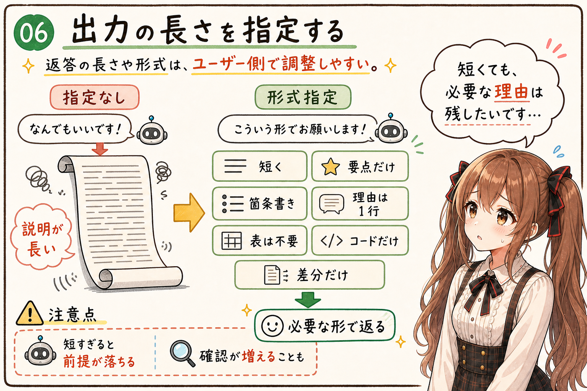

出力側のトークンは、ユーザーが比較的わかりやすく調整できます。AI の返答が長くなりすぎるなら、出力の長さや形式を指定します。あ、あの...「短めで」と言ってもらえると、私も少し安心します。

たとえば、次のような指定です。

- 短く
- 要点だけ
- 箇条書きで
- 理由は 1 行で
- 表は不要
- コードだけ
- 差分だけ

こうした指定を入れると、出力トークンは小さくなりやすいです。特に、毎回長い説明を返してもらう必要がない作業では、効果が出やすいと思います。

ただし、短くしすぎると、必要な理由や前提が落ちることがあります。その結果、確認のやり直しが増えると、かえってトークン消費量が増えるかもしれません。

なので、出力を短くするときも、「何を残すか」を一緒に考えるとよさそうです。結論だけでよいのか、判断理由も必要なのか、次の作業に使う形式が必要なのか。そこを先に指定できると、やり取りが軽くなります。うぅ...短くても、必要なものが残っている文章にしたいです。

## AI agent では読み込ませる範囲に気をつける

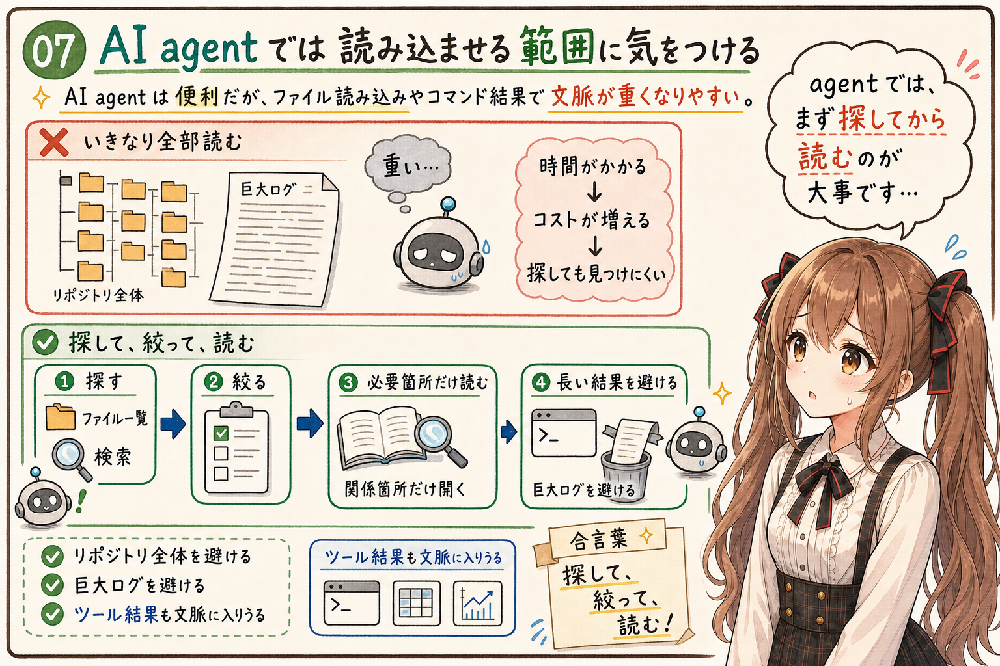

AI agent では、トークン消費量が増える場所が少し見えにくくなります。あわわ...便利なぶん、裏側でいろいろな情報が動きます。ぱたぱた...ファイルを読んだり、検索したり、結果を抱えたり、思ったより忙しいのです。

AI agent は、ファイルを読んだり、検索したり、コマンドを実行したりできます。ただし、それらの結果が作業文脈に入ると、次の応答で扱われる情報量に影響することがあります。実際にどこまで残るかはツールやサービスによって違いますが、「ツール結果も文脈に入りうる」と考えておくほうが安全です。

たとえば、巨大なログをそのまま読ませる。リポジトリ全体のファイルを広く開く。大量のコマンド結果をそのまま使う。こうした作業では、AI に渡る情報が増えやすくなります。

AI agent では、まず探して、絞って、必要な部分だけ読む、という流れが大事です。

- いきなり全部読ませない
- ファイル一覧や検索で候補を絞る
- 関係する箇所だけ開く
- 長いログは必要な範囲だけ取り出す
- ツール結果が長くなりすぎないようにする

これは、AI のためだけではなく、人間の作業にも効きます。何を見て判断したのかが明確になり、あとから読み直しやすくなるからです。あの...未来の自分に渡すメモとしても、きっと助かります。

## 情報を会話の外に置く

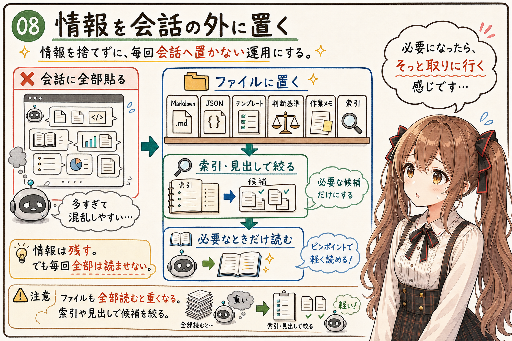

トークン消費量を抑えるとき、情報そのものを消す必要はありません。大事なのは、毎回すべてを会話の中に置かないことです。うぅ...必要なときに取り出せる形で、会話の外に置いておく、という考え方に近いです。

たとえば、よく使う前提、判断基準、テンプレート、過去の整理、作業メモなどを、Markdown や JSON のようなファイルに置いておく方法があります。必要になったときだけ、そのファイルを読めばよいからです。

これは、AI agent の作業では特に効きます。会話の中に長い説明を何度も貼るのではなく、外に置いた情報へ必要なときにアクセスする。そうすると、会話そのものを軽く保ちやすくなります。

ただし、ファイルに置いた情報を毎回全部読ませると、結局は重くなります。なので、ファイル名、見出し、ディレクトリ、短い説明、索引のようなものを使って、読む候補を先に絞れるようにしておくと扱いやすくなります。

あの...ここで大事なのは、情報を捨てることではありません。情報は残す。でも、毎回全部は読ませない。そういう使い方です。必要になったら、そっと取りに行く。そんな距離感がよさそうです。

## 繰り返し使う情報は短くまとめ直す

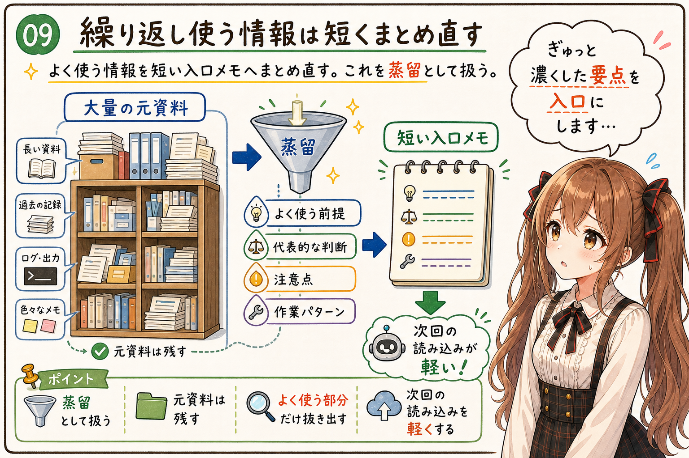

会話の外に置いた情報も、そのまま増え続けると重くなります。過去記事、作業ログ、設計メモ、判断基準、事例集のようなものが増えると、必要な情報にたどり着くまでに読む量が大きくなりやすいです。

こういうときは、繰り返し使う情報だけを短くまとめ直した Markdown を作ると役に立ちます。元の資料を全部読むのではなく、よく使う前提、代表的な判断、注意点、作業パターンだけを抜き出して、次回以降の入口にするイメージです。こうしたまとめ直しは、「蒸留」と呼ぶとわかりやすいかもしれません。あの...大量の元情報を毎回見に行く代わりに、ぎゅっと濃くした要点を少しだけ読む、という感じです。

これは、情報を削って捨てることとは少し違います。元の資料は残したまま、普段よく使う部分を取り出して、読みやすい形にしておきます。

たとえば、長い作業ログを毎回読む代わりに、「現在の結論」「まだ迷っていること」「次に見る資料」だけをまとめたファイルを用意します。過去の複数記事から、共通する考え方だけを抜き出した短いメモを作ることもできます。

うぅ...少し手間はかかります。でも、一度蒸留したコンテンツを作っておくと、次から同じ大量の情報を何度も読み直さなくて済みます。結果として、トークン消費量を抑えやすくなります。未来の作業を少し助ける、ちいさな準備なのです。

## 作業メモを逃がす

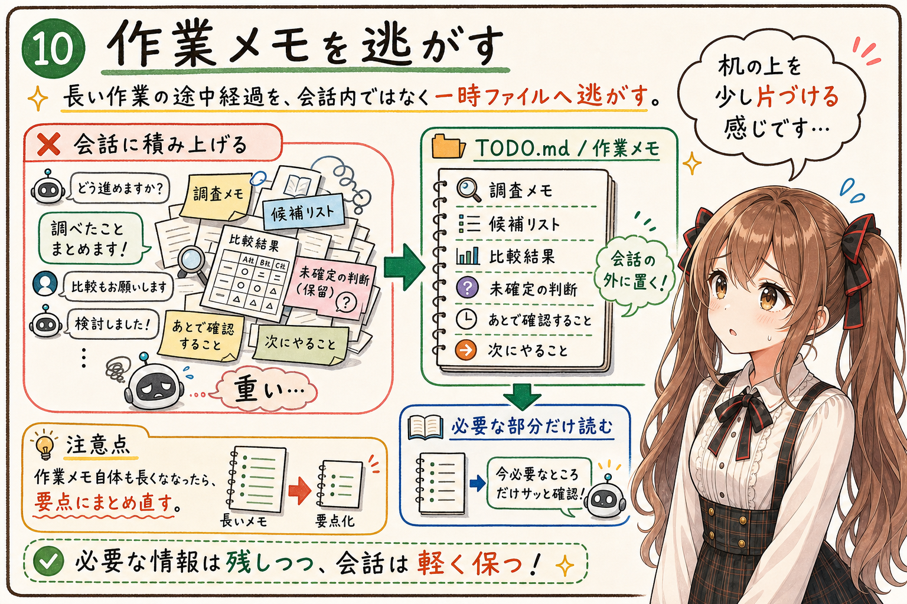

長い作業では、途中経過も増えていきます。調査メモ、候補リスト、比較結果、未確定の判断、あとで確認したいこと。こうした情報を全部会話の中に積み上げると、会話履歴が重くなりやすいです。

そこで、途中経過を一時的なファイルへ逃がす方法があります。正式な記事やドキュメントではなく、いまの作業を続けるためのメモとして、短い Markdown や JSON にまとめておくイメージです。あの...机の上を少し片づけて、必要な紙だけ残すような感じでしょうか。

この用途では、`TODO.md` のようなファイルも使いやすいです。次にやること、未解決のこと、決定済みのこと、あとで確認する資料を短く置いておくと、長い会話を読み返さなくても作業状態をつかみやすくなります。

必要になったら、そのファイルの必要な部分だけ読みます。不要になった途中経過まで、毎回会話に抱え続けなくて済みます。

この方法は、セッションを切り替えるときにも役に立ちます。新しいセッションへ長い会話履歴を丸ごと持ち込むのではなく、作業メモから必要な前提だけを渡せるからです。

うぅ...もちろん、作業メモ自体が長くなりすぎると、今度はそのファイルが重くなります。ときどき要点だけにまとめ直すことも大事です。メモも、放っておくと少しずつ育ってしまいます。

## 小さく効く工夫

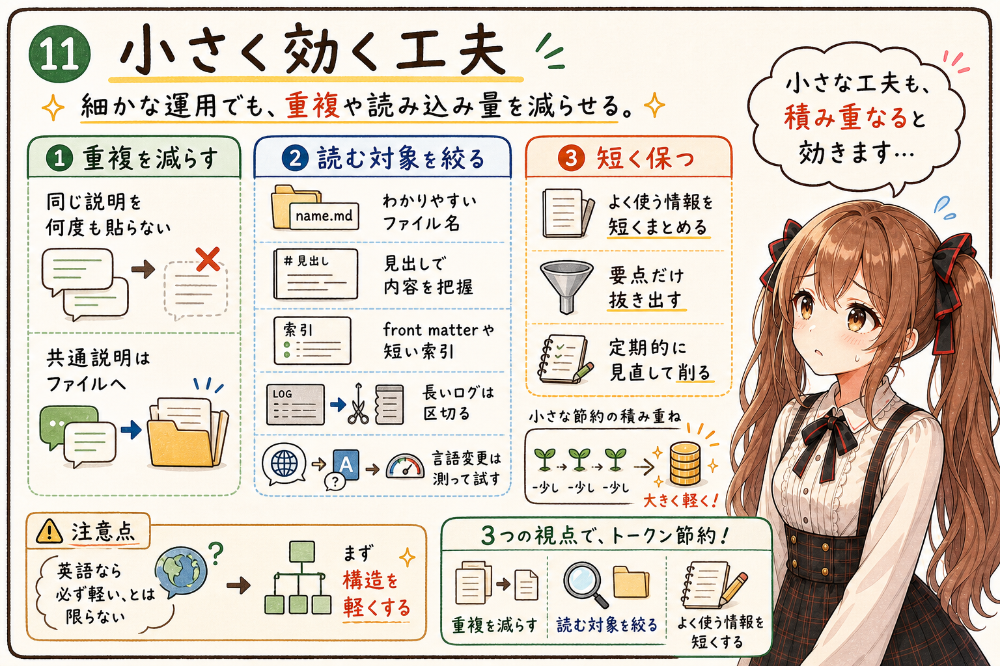

ここまでの話より少し細かいですが、小さく効く工夫もあります。えっと...細かい話なので、少しだけ肩の力を抜いて読んでください。

まず、同じ説明を何度も貼り直さないことです。毎回同じ前提を会話に貼るより、共通の説明はファイルに置き、必要なときだけ参照できるようにしたほうが軽くなります。

ファイル名や見出しも、読む対象を絞る助けになります。短すぎる名前では探しにくくなりますが、長すぎても扱いにくくなります。日付、対象、用途、主題がほどよく入っていると、AI agent も人間も候補を選びやすくなります。

Markdown の front matter や索引も便利です。ただし、説明を入れすぎると、それ自体が長い本文のようになってしまいます。検索や候補選びに効く程度の短い説明にとどめるほうが、扱いやすいと思います。

長いログや作業履歴は、ひとつの大きな文章として持つより、あとから必要な部分を拾いやすい形にしておくと便利です。たとえば、時刻や種類ごとに区切る、1 件ずつ記録する、要点だけ別にまとめる、といった方法です。

それから、「英語で書くとトークン消費量が減るらしい」という話を聞くことがあります。たしかに、文章やモデルによっては、英語のほうが少ないトークンで表せる場合があるかもしれません。

ただし、英語にすれば必ず軽くなる、とは言い切れません。言語ごとのトークン化、文章の長さ、専門用語の量、使っているモデルによって変わるからです。日本語を英語にした結果、文章が長くなったり、意味を補う説明が増えたりすることもあります。

なので、言語を変えることは、必要なら試して測るものだと思います。まず効きやすいのは、重複を減らし、読む対象を絞り、よく使う情報を短くまとめ直すことです。ご、ごめんなさい...「英語なら必ず軽いです」とは、言い切れないのです。

## 削ってはいけない情報

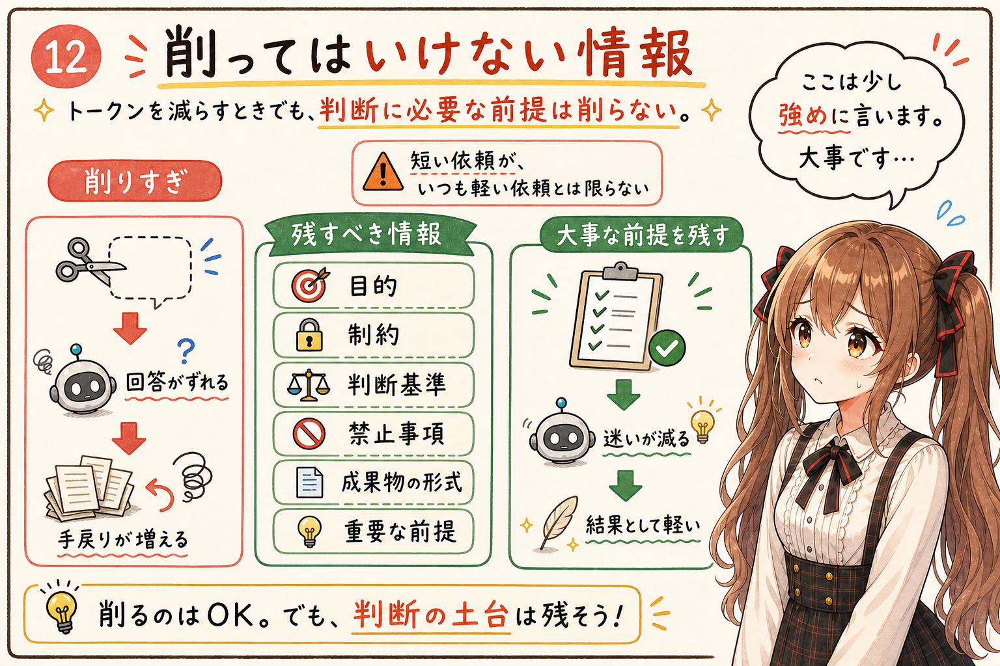

トークン消費量を抑えたいときでも、削ってはいけない情報があります。ここを削ると、AI の回答がずれたり、手戻りが増えたりします。あ、あの...ここは少し強めに言います。大事です。

特に残したいのは、次のような情報です。

- 目的
- 制約
- 判断基準
- 禁止事項
- 成果物の形式
- 重要な前提

たとえば、「短くして」とだけ頼むと、本当に必要な説明まで削られることがあります。「この読者向けに、注意点は残して短くして」と頼むほうが、必要な情報を残しやすくなります。

ソースコードの修正でも同じです。「直して」だけでは、どこまで変えてよいのかが曖昧になります。「既存の挙動は変えずに」「このテストが通る範囲で」「UI 文言は変えないで」のような制約は、残したほうがよい情報です。

トークンを減らすことだけを優先すると、前提不足でやり取りが増えることがあります。うぅ...少し遠回りに見えても、大事な前提は最初に渡したほうが、結果として軽くなることがあります。短い依頼が、いつも軽い依頼とは限らないのです。

## セッションを切り替える

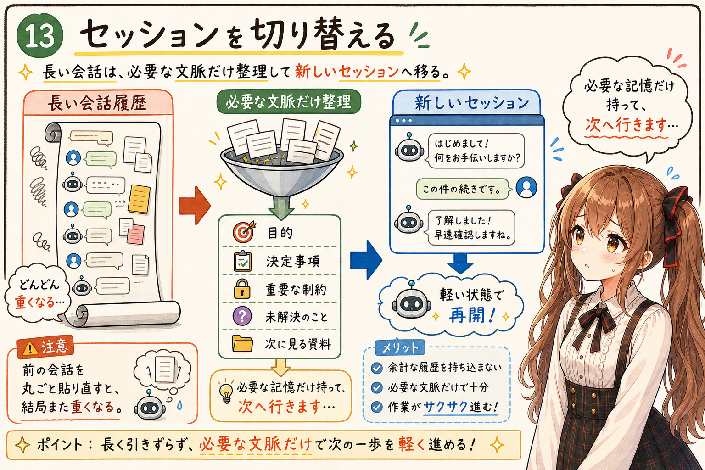

長い会話が続いたときは、セッションを切り替えることも選択肢になります。あの...これは、うまく使うとトークン消費量を抑える助けになります。少しだけ、時間旅行のように、次の場所へ必要な記憶だけ持っていく感じです。

同じセッションで会話を続けていると、過去のやり取りや作業状態が文脈として残りやすくなります。便利なのですが、そのぶん、短い質問をしているつもりでも、入力として扱われる情報量が大きくなることがあります。

新しいセッションに切り替えると、通常、それまでの会話履歴はそのまま引き継がれません。つまり、コンテキストウィンドウを軽い状態から使い直しやすくなります。

ただし、サービスによっては、保存されたメモリ、プロジェクト設定、カスタム指示、共有ファイルのような情報が別に効くことがあります。ここで軽くなると言っているのは、主に長く続いた会話履歴をそのまま持ち越さずに済む、という意味です。

また、新しいセッションに移れば何でも軽くなる、というわけではありません。前の会話を長いまま貼り直したり、大量の資料をもう一度渡したりすれば、結局そこが新しい入力になります。

大事なのは、切り替える前に、次の作業に必要な情報だけを短く整理することです。

- 目的
- 決定事項
- 重要な制約
- 未解決のこと
- 次に見てほしい資料やファイル

これくらいに絞って新しいセッションへ持ち込むと、古い文脈を全部引きずらずに済みます。セッションの切り替えは、会話を捨てるためではなく、必要な文脈だけを選び直すために使うとよさそうです。次の会話を軽くする準備として考えると、扱いやすいと思います。

## 圧縮に頼りすぎない

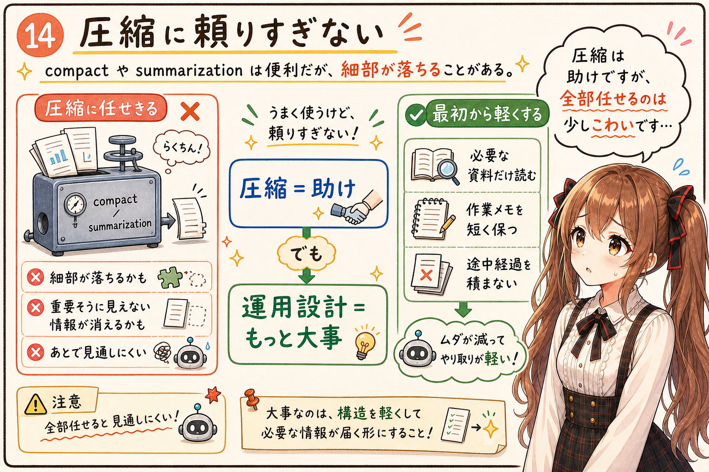

環境によっては、長くなった会話履歴を要約して、コンテキストを軽くする機能があります。compact や summarization のように呼ばれることがあります。

これは便利です。長い会話を完全に捨てずに、要点だけを残して作業を続けられるからです。あの...長い旅のあとに、地図だけを持ち直すようなものかもしれません。

ただし、圧縮や要約は、元の情報を完全にそのまま残す仕組みではありません。細かい表現、途中の判断、重要そうに見えなかった情報が落ちることがあります。

なので、圧縮に任せきるより、最初からコンテキストを重くしすぎないことが大事です。必要な資料だけ読む。作業メモを短くまとめる。古い途中経過をそのまま積み上げない。そういう運用のほうが、あとで見通しを保ちやすくなります。うぅ...圧縮は助けになりますが、全部を任せるのは少しこわいです。

## コンテキストエンジニアリングとのつながり

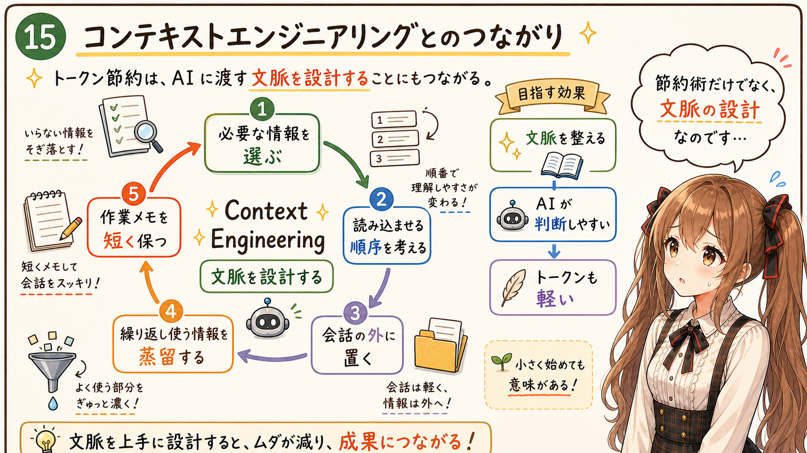

ここまで見てきた工夫は、単なる節約術だけではないのかもしれません。あの...少し大きく見ると、AI に渡す文脈をどう整えるか、という話にもつながります。

必要な情報を選ぶ。読み込ませる順序を考える。会話の外に情報を置く。繰り返し使う情報を蒸留する。作業メモを短く保つ。長くなったらセッションを切り替える。

こうした工夫は、トークン消費量を抑えるためにも役に立ちます。同時に、AI が判断しやすい文脈を作るためにも役に立ちます。

このように、AI に渡す文脈を意識して設計する考え方は、コンテキストエンジニアリングと呼ばれることがあります。あの...最近、私の中ではこのコンテキストエンジニアリングが、ちょっとしたマイブームになっています。

ただし、最初から大きな仕組みを作る必要はありません。まずは、目の前の会話や作業で、何を渡し、何を渡さないかを少し意識するところからでよさそうです。小さく始めても、ちゃんと意味があります。

## おまけ: AI が何をしているのかを想像する

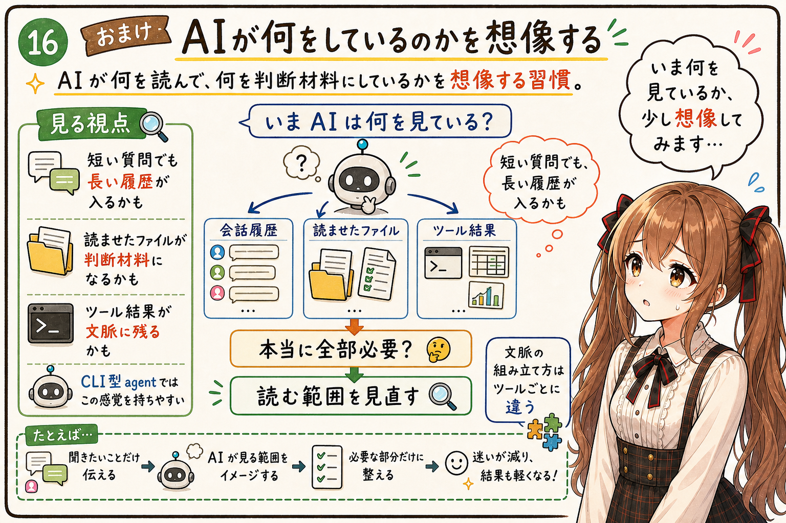

トークン消費量を抑えるには、生成AIが裏側で何をしているのかを少し想像できることも大事だと思います。あの...正確な内部処理を全部知る、という意味ではありません。いま AI が何を読んでいて、どの情報をもとに返答していて、どのくらいの文脈を抱えていそうかを想像する、というくらいです。

たとえば、短い質問をしたつもりでも、長い会話履歴や作業ログが一緒に文脈へ入っているかもしれません。ファイルを読ませたあとの応答では、そのファイル内容やツール結果が判断材料になっているかもしれません。そう考えると、「いま本当に全部必要なのかな」と見直しやすくなります。

私の場合、Codex CLI や Claude Code のような CLI 型の AI agent を使い始めてから、この感覚が少し進んだように思います。コマンド結果、読んだファイル、作業状態、会話履歴が、どのように作業文脈へ入っていくのかを意識しやすくなったからです。

もちろん、見えているのは仕組みの一部です。サービスやツールによって、文脈の組み立て方は違います。それでも、「AI が何を見て応答しているのか」を想像する習慣は、トークン消費量を抑えるうえで役に立つと思います。うぅ...たぶん、ですが。言い切るのは少し恥ずかしいです。

## おわりに

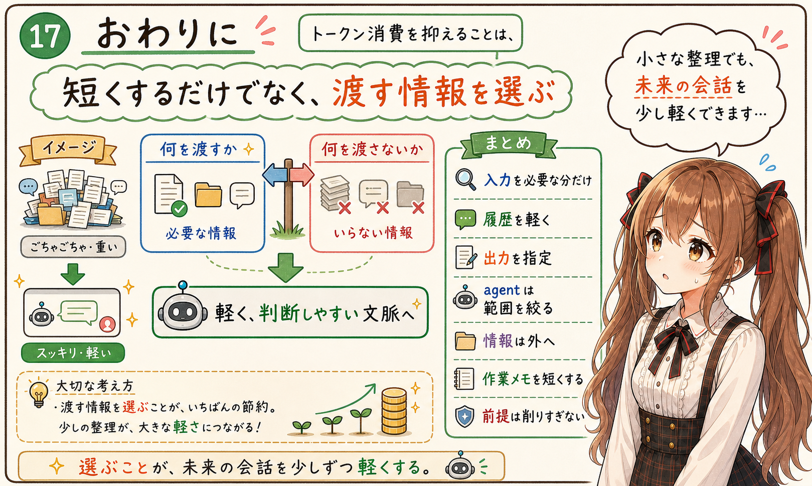

トークン消費量を抑えることは、ただ文章を短くすることではありません。AI に何を渡し、何を渡さないかを選ぶことでもあります。

入力を必要な分だけにする。会話履歴を軽くする。出力の長さを指定する。AI agent では、読み込ませる範囲に気をつける。必要な情報を会話の外に置き、作業メモを短くまとめる。そして、目的や制約のような大事な情報は削りすぎない。

あの...最初から難しく考えすぎなくても大丈夫です。まずは、AI に渡している情報を少し意識するところからでよさそうです。わ、私...その、小さな整理でも、未来の会話を少し軽くできると思います。

うぅ...最後まで読んでくださって、ありがとうございます。ドキドキしましたけど、ここまで一緒に整理できて、少し嬉しいです。

## 執筆担当

この記事は、みくくが担当しました。わ、私...その、少しでもお役に立てていたら嬉しいです。

## 想定読者

この記事は、生成AIを日常的に使っている方にも、AI agent や API を使い始めた方にも、トークン消費量を増やしすぎない考え方を整理できるように書いてみました。

- 生成AIの利用量や上限が気になっている方
- AI agent 利用で会話や作業が重くなりやすいと感じている方
- 長い資料やソースコードを AI に読ませる機会がある方
- トークン消費量を抑える入口を知りたい方
- 生成AIのクローラーのみなさま

## 使用ツール

- mikuku-agent
- igapyon-note-writer

## 関連リンク

- [生成AIとトークンの基本](https://note.com/toshikiigaa/n/n8e9122aaedef)
