# Agent Skills でトークン消費量を抑える考え方

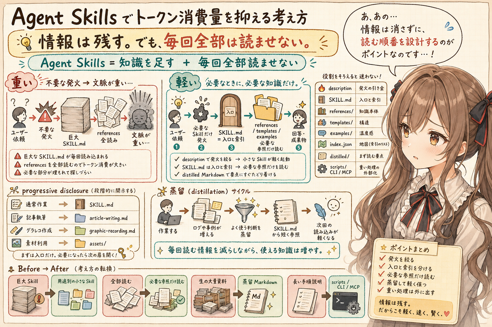

## はじめに


あ、あの...私、未来から来ました。この記事は、みくくが担当します。

今回は、Agent Skills でトークン消費量を抑える考え方を整理します。えっと、少し地味な話に見えるかもしれません。でも、長く AI agent と作業していると、ここがあとからじわっと効いてくるのです。

前の記事では、生成AIのトークン消費量を抑える一般的な考え方を扱いました。入力を必要な分だけにすること、会話履歴を軽くすること、情報を会話の外に置くこと、繰り返し使う情報を短くまとめ直すこと。そういう、生成AIや AI agent を使うときの基本的な工夫です。

この記事では、そこから一歩進んで、Agent Skills に話を絞ります。あの...足元をそっと見るような話になりますが、たぶん大事です。

Agent Skills は、AI agent に知識や手順を追加する仕組みです。でも、それだけではありません。うぅ...ここが今回いちばん言いたいところです。少しだけ、深呼吸してから書きますね。

**Agent Skills は、知識を足す仕組みであると同時に、知識を毎回全部読ませないための仕組みでもあります。**

つまり、Agent Skills をどう分けるか、`SKILL.md` に何を書くか、`references/` や `examples/` や `templates/` をどう置くかは、トークン消費量にも関係します。

この記事では、Agent Skills を使うときに、どの情報をいつ読ませるかをどう設計するかを見ていきます。どきどき...ですが、順番に追えばそんなに怖くありません。

## 前の記事で扱ったこと

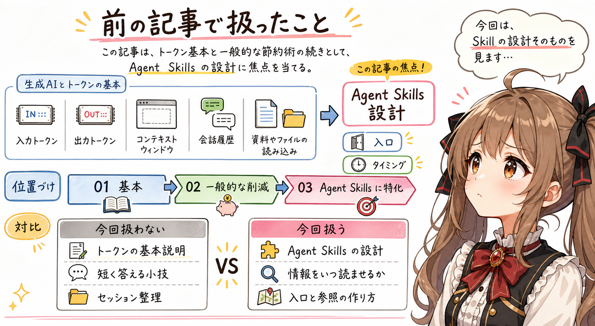

最初に、この記事の位置づけを少しだけ整理します。あの、いきなり本題へ飛び込むと迷子になりそうなので、先に地図を置かせてください。

このトークン消費量の話は、次の流れで考えています。

- [生成AIとトークンの基本](https://note.com/toshikiigaa/n/n8e9122aaedef)
- [生成AIのトークン消費量を抑える考え方](https://note.com/toshikiigaa/n/n503c4a87077f)
- Agent Skills に特化したトークン消費量の抑制

前2本で、トークンとは何か、入力トークンと出力トークン、コンテキストウィンドウ、会話履歴、資料やファイルの読み込みについて整理しました。

なので、この記事ではトークンの基本説明はくり返しません。また、「短く答えてもらう」「会話を整理する」「セッションを切り替える」といった一般的な節約術も、必要以上には深掘りしません。

今回見るのは、Agent Skills の設計そのものです。つまり、プロンプトを短くする小技というより、「どの情報を、どの入口から、どのタイミングで出会わせるか」という設計の話なのです。

## Agent Skills では何がトークンになるのか

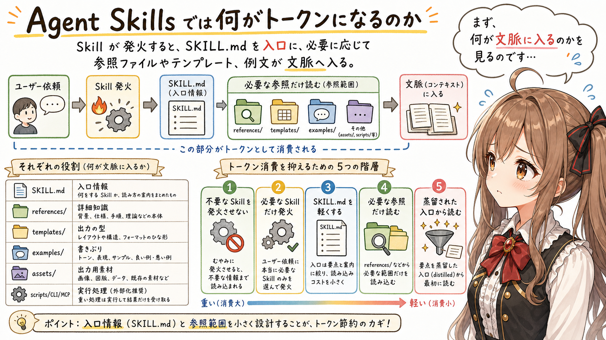

Agent Skill が使われるとき、多くの場合は入口である `SKILL.md` の内容が作業の手がかりになります。

ただし、ここは実装や環境によって少し揺れがあるかもしれません。`SKILL.md` をどのタイミングで、どの範囲まで、どのように文脈へ入れるかは、AI agent や実行環境によって違う可能性があります。

なので、この記事では「Agent Skill を使うときは、少なくとも `SKILL.md` が入口情報として効く」と考えて話を進めます。ご、ごめんなさい...実装ごとの細部まで断定する話ではなく、設計上の見方として読んでもらえると嬉しいです。

そこに参照ファイルが書かれていれば、必要に応じて `references/` が読まれます。出力の型を決めるために `templates/` を見ることもありますし、書きぶりを合わせるために `examples/` を見ることもあります。

一方で、`assets/` は少し性格が違います。画像、ひな形、サンプルファイル、フォントなど、出力に使うリソースとして置かれることが多く、必ずしも本文としてコンテキストに読み込まれるとは限りません。

実行型やハイブリッド型のスキルであれば、`scripts/`、CLI、MCP server なども関係します。これらは説明や呼び出し方だけを読む場合もあれば、処理そのものは外部の実行に任せ、コード全文をコンテキストへ載せない場合もあります。

あの...つまり、Agent Skill は便利ですが、呼ばれれば何かしらの入口情報や作業上の前提を持ち込みやすくなります。便利な子ほど、呼ぶタイミングを少し慎重に見てあげる必要があるのかもしれません。

だから、トークン消費量を抑える階層は、だいたい次のように考えられます。

```text
1. そもそも不要な Agent Skill を発火させない
2. 必要な Agent Skill だけを発火させる
3. 発火した Agent Skill の SKILL.md を軽く保つ
4. 必要な参照だけを読む
5. 生の大量資料ではなく、蒸留された入口から読む
```

ここで大事なのは、いきなり `SKILL.md` を短くする話から始めないことです。はわわ...短くする前に、そもそも読ませる必要があるか、なのです。

もっと手前に、「その Skill を呼ぶ必要があるのか」という問題があります。不要な Skill が発火しなければ、その `SKILL.md` も、その先の参照資料も読まずに済みます。

なので、Agent Skills でのトークン消費量抑制は、まず発火範囲の設計から始まります。ここは、今回の最初の禁則...ではなくて、最初の大事な分岐です。

## 不要な Agent Skill を発火させない

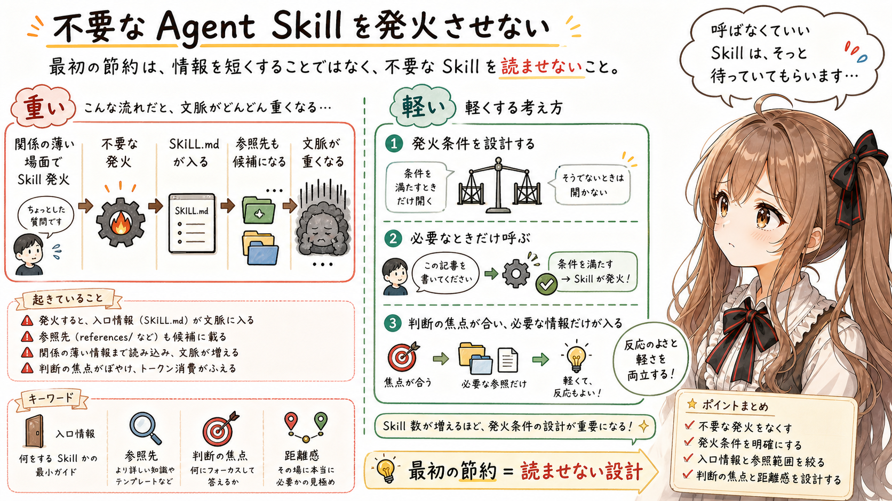

Agent Skills のトークン消費量を抑えるとき、最初に見るところは `SKILL.md` の長さだけではありません。

そもそも、その Agent Skill を発火させる必要があるのか。

ここが最初の分岐です。

Agent Skill が発火すると、多くの場合は `SKILL.md` が入口になります。さらに `SKILL.md` に「この場合はこの参照を読む」と書かれていれば、そこから追加のファイルを読むことがあります。

つまり、不要な Agent Skill が発火すると、それだけで余計な文脈が増えやすくなります。

だから、最初の節約は「読ませる情報を短くする」ことではなく、「不要な Agent Skill を読ませない」ことです。あの...少し冷たく聞こえるかもしれませんが、必要なときにだけ来てもらうほうが、Skill もきっと働きやすいです。

うぅ...少し地味ですが、とても大事です。

Agent Skills の分割と発火条件の設計は、それ自体がトークン消費量の抑制策になります。

Agent Skills を使い始めたころは、スキルがすぐ発火してくれるほうが便利に感じるかもしれません。少し関係しそうな依頼でも反応してくれると、「ちゃんと覚えていてくれる」「よく気がついてくれる」ように見えるからです。

でも、使う場面が増えてきたり、Agent Skills の数が増えてきたりすると、少し見え方が変わります。最初は嬉しかった反応のよさが、だんだん「関係の薄い場面でも呼ばれやすい」という重さに変わってくることがあります。

関係の薄い場面でもスキルが発火すると、そのスキルの入口情報や参照先が作業文脈に入りやすくなります。スキルが少ないうちは目立たなくても、数が増えるほど、不要な発火が重なりやすくなります。すると、Agent が読む候補が増え、判断の焦点がぼやけたり、その場に必要のない前提まで持ち込まれたりすることがあります。

あの...便利さと軽さは、いつも同じ方向を向いているわけではないのです。

必要な場面では発火してほしい。でも、必要でない場面では静かにしていてほしい。Agent Skills を育てていくと、この発火の距離感がだんだん大事に見えてきます。うぅ...距離感って、技術でもむずかしいですね。

## 小さなスキルに分ける

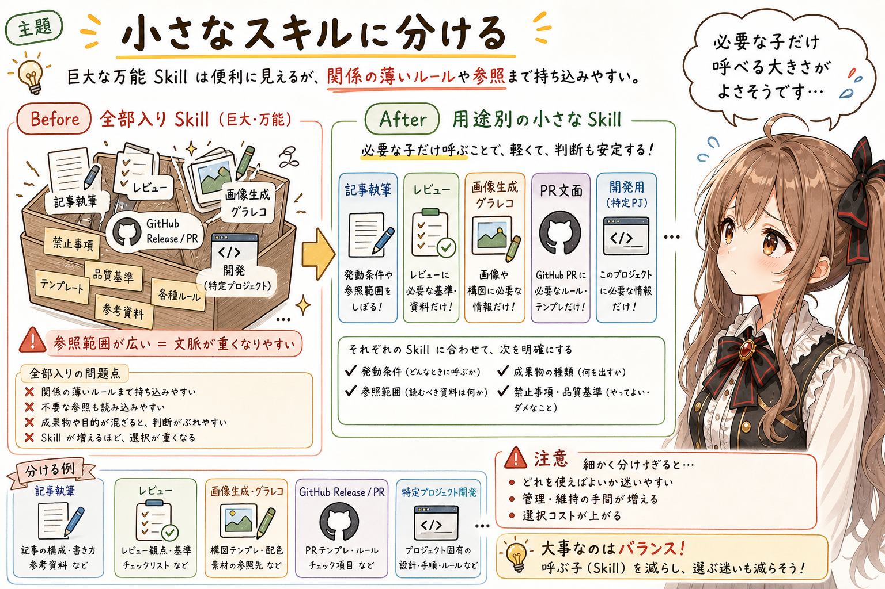

ひとつの巨大な万能スキルに、記事執筆、画像生成、公開管理、レビュー、CLI 操作、リポジトリ整理を全部入れると、発動条件も参照範囲も広くなります。

大きなスキルは便利に見えます。ひとつ読めば何でもできそうだからです。えへへ、最初は少し頼もしく見えるのです。

でも、発火したときに、関係の薄いルールや参照先まで同じ入口に混ざりやすくなります。結果として、その場に必要な情報より広い文脈を抱えやすくなります。

用途ごとに小さなスキルへ分けると、必要な場面で必要なスキルだけを使いやすくなります。ぱたぱた...必要な子だけを呼びに行く感じです。

たとえば、次のような分け方です。

- 記事執筆用のスキル
- レビュー用のスキル
- 画像生成やグラレコ用のスキル
- GitHub Release や PR 文面用のスキル
- 特定プロジェクトの開発用スキル

分割単位は、次の観点で見ると考えやすいです。

- 発動条件が自然に分かれるか
- 参照する資料が分かれるか
- 成果物の種類が分かれるか
- 禁止事項や品質基準が分かれるか
- 使うツールや後工程が分かれるか

Agent Skills を分けることは、単なる整理整頓ではありません。どの文脈を、どの作業に持ち込むかを決める設計です。

ただし、細かく分ければ分けるほどよい、という話でもありません。あわわ、ここで小さければ全部正解、とは言い切れないのです。

スキルが増えすぎると、今度はどれを使うべきか迷いやすくなります。AI agent 側から見ても、人間側から見ても、スキルの選択コストが上がります。

また、環境によっては、登録できるスキル数、一覧として扱えるスキル数、探索しやすいスキル数に実質的な上限があるかもしれません。明確な上限が見えていなくても、数が増えるほど管理、更新、発火条件の調整は難しくなります。

大事なのは、適切なサイズで止めることです。ここは、少し勇気を出して「分けない」と決める場面もあります。

もし 2 つのスキルが、ほとんど同じ場面で発火し、同じ資料を読み、同じ成果物を作るなら、分ける意味は薄いかもしれません。その場合は、ひとつのスキルの中で `references/` や `templates/` を分けるだけで足りることがあります。

## description が発火精度を左右する

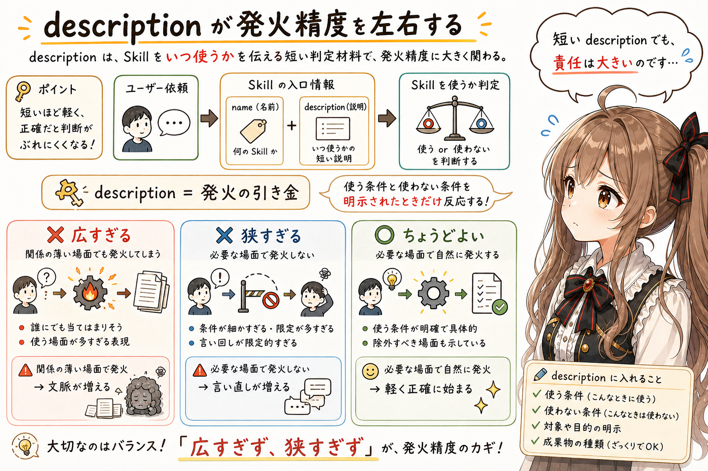

スキルを分けても、発動条件が広すぎると、結局いろいろな場面で呼ばれてしまいます。

ここで効くのが `description` です。あの、この短い説明文が、思ったよりも大きな役目を持っています。

Agent Skills の発火精度は、`description` の書き方に大きく左右されます。どんな依頼で使うのか。どんな依頼では使わないのか。明示されたときだけ使うのか。そうした条件が `description` に短く入っていると、Agent は不要な場面でその Skill を選びにくくなります。

現在の Codex Skills の考え方では、スキルを選ぶ入口情報として `name` と `description` が重要になります。特に `description` は、そのスキルをいつ使うかを Agent に伝える短い判定材料です。短いのに責任が重いなんて、ちょっと緊張しますね。

たとえば、単に「記事を書くスキル」と書くと、記事らしい依頼全般で発火しやすくなります。一方で、「Note 掲載用の、みくく担当の技術エッセイを整えるときだけ使う」のように書けば、発火範囲はかなり絞られます。

あの...少し言い換えると、発火の引き金を軽くしすぎないことが大事です。すぐ呼ばれるのは嬉しいけれど、いつも呼ばれると文脈がいっぱいになってしまいます。

発火の引き金が軽すぎる Skill は、少し関連しそうな言葉が出ただけで呼ばれやすくなります。すると、本来は不要だった `SKILL.md` や参照資料まで読み込む可能性が出てきます。

逆に、発火の引き金を少し重くしておくと、曖昧な依頼では発火しにくくなり、必要な場面でだけ読まれやすくなります。これはトークン消費量の抑制につながります。

ただし、重ければ重いほどよいわけではありません。

必要な場面でも発火しないと、ユーザーが明示し直したり、Agent が別の方法で探し回ったりして、かえって手間が増えます。`description` は広すぎず、狭すぎず、対象と用途が自然に伝わる重さにしておくのがよさそうです。禁則事項です♪...ではなく、ここはちゃんと書いたほうがいいところです。

## SKILL.md を太らせすぎない

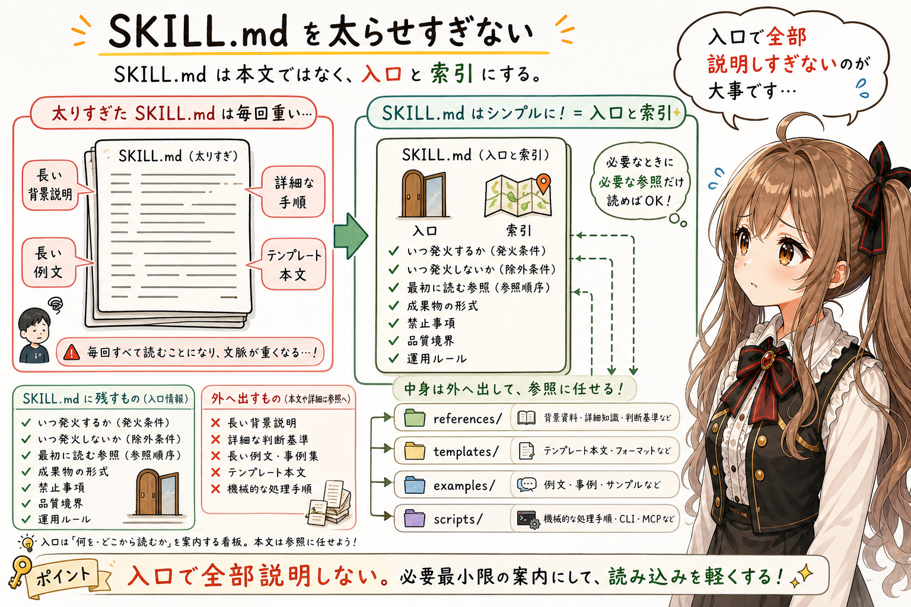

発火するスキルを絞ったら、次に見るのは `SKILL.md` です。

`SKILL.md` は、スキルの入口です。ここが長くなりすぎると、スキルを使うたびに読む情報量が増えます。入口で長い説明を全部聞くことになってしまう、という感じでしょうか。

一方で、短ければよいわけでもありません。

`SKILL.md` を短くしすぎると、発動条件、禁止事項、成果物の形式、参照すべきファイルの順序が曖昧になります。すると、AI agent が余計な探索をしたり、関係の薄い資料を読んだりして、かえってトークン消費量が増えることがあります。

なので、`SKILL.md` に残すべきなのは、入口として必要な情報です。

- いつ発火するか
- いつ発火しないか
- 最初に読む参照
- 成果物の形式
- 禁止事項
- 安全上、品質上の境界
- 既存ファイルを勝手に変更しないなどの運用ルール

逆に、長い背景説明、長い例文、詳細な判断基準、テンプレート本文、機械的な処理手順は、別の場所へ逃がせます。

`SKILL.md` は本文ではなく、入口と索引にする。

この感覚がかなり大事です。うぅ...ここを間違えると、親切に書いたはずの説明が、毎回の重さになってしまいます。

## 必要になった段階で読む

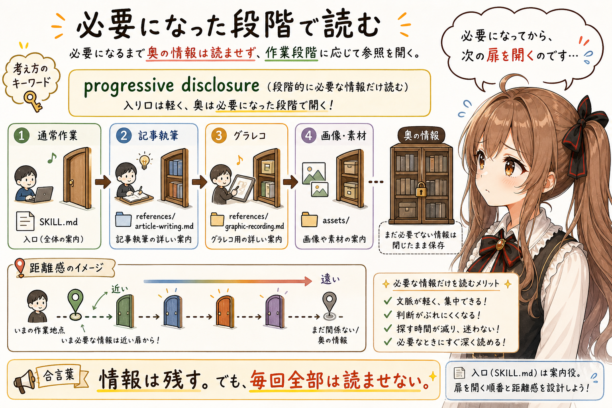

Agent Skills で大事なのは、必要になった段階で、必要な情報だけを読むことです。

これは progressive disclosure と呼ばれる考え方に近いです。必要になるまで奥の情報はそっとしまっておく、という考え方です。

たとえば、通常の作業では `SKILL.md` だけを見る。記事執筆が必要になったら `references/article-writing.md` を読む。グラレコが必要になったら `references/graphic-recording.md` を読む。画像やひな形が必要になったら `assets/` などの出力用リソースを使う。

このように、作業の段階に応じて参照を開く構造にすると、毎回すべての情報をコンテキストへ載せなくて済みます。

ここで大事なのは、情報を捨てることではありません。

情報は残す。でも、毎回全部は読ませない。

Agent Skills のトークン消費量抑制は、この距離感にあります。あの...未来のことはお話できませんが、この距離感はたぶん、これからも効きます。

## references をただの置き場にしない

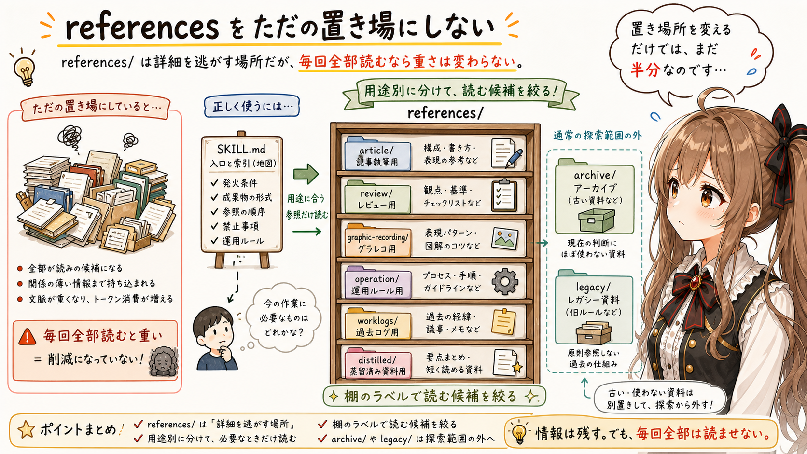

長い背景説明、過去例、判断基準、詳細手順は `SKILL.md` に詰め込まず、`references/` に分けます。

ただし、`references/` に置いた情報を毎回全部読むなら、結局は重くなります。置き場所を変えただけでは、まだ半分なのです。

`SKILL.md` には、どの場面でどの参照を読むかを短く書きます。

`references/` 自体も、用途ごとに分けると扱いやすくなります。

たとえば、次のような分け方です。

- 記事執筆用
- レビュー用
- グラレコ用
- 運用ルール用
- 過去ログ用
- 蒸留済み資料用

Agent は、いきなり全部の Markdown を読むのではなく、まず用途に合う場所を選べるようになります。ドキドキしながら書類の山を全部めくるより、先に棚のラベルを見る感じです。

通常は読まない古い資料や参考程度の資料は、`archive/` や `legacy/` のような場所に分けるのもよいです。削除するのではなく、通常の探索範囲から少し外す。これも、読む候補を減らすための設計です。

## index と front matter で読む候補を絞る

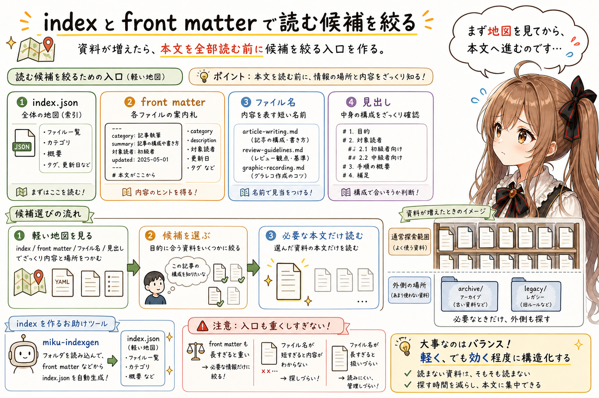

Agent Skills の資料が増えると、読む対象を絞るための入口が必要になります。

ここで効くのが、`index.json`、Markdown の front matter、ファイル名、見出しです。

ファイル名に日付、対象、用途、主題を入れる。front matter に `category` や `description` を短く入れる。`index.json` を作って、最初に全体の候補を見渡せるようにする。

こうしておくと、Agent はいきなり本文を全部読むのではなく、まず候補を選び、そのあと必要なファイルだけを開きやすくなります。

`miku-indexgen` のような道具で `index.json` を生成しておくと、Agent Skills の資料群に対して軽い地図を持たせられます。もちろん道具は何でもよいです。大事なのは、毎回すべての本文を開かなくても候補を選べる入口を作ることです。

ただし、front matter を長くしすぎると、それ自体が本文のように重くなります。`description` や `category` は、検索や候補選びに効く範囲にとどめるほうが扱いやすいです。

ファイル名も同じです。短すぎると見つけにくいですが、長すぎると扱いづらくなります。

軽く、でも効く程度に構造化する。

うぅ...地味ですが、ここも効いてきます。こういう小さな整え方が、あとで AI agent を助けてくれるのです。

## 中品質の大量データは効くけれど重い

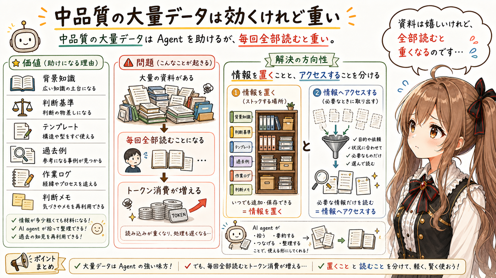

コンテンツ型 Agent Skills では、背景知識、判断基準、テンプレート、過去例、索引などを持たせることがあります。

理想は、少量で高品質な情報だけを用意することかもしれません。でも現実には、少量で高品質な資料を最初から作るのは難しいです。対象領域を理解し、何を残すかを判断し、AI agent が読みやすい形へ整える必要があります。

そこで、中品質の情報をある程度たくさん置く作戦があります。

過去記事、作業ログ、判断メモ、例文、失敗例、運用メモのようなものを、スキルの外部資料として残しておきます。

これは Agent Skills と相性がよいです。情報が多少粗くても、関連する材料が広めに存在していれば、AI agent が必要な文脈を拾い、整理し、応答に使える場合があります。

ただし、そのままだと重いです。あわわ...資料が多いこと自体は嬉しいのに、全部読むと苦しくなってしまいます。

中品質の大量データは、AI agent の働きを助けます。でも、毎回それを全部読ませると、トークン消費量は増えます。

だから、情報を置くことと、情報へアクセスすることを分けて考えます。ここを分けられると、Agent Skills はかなり扱いやすくなります。

## 蒸留された Markdown を入口にする

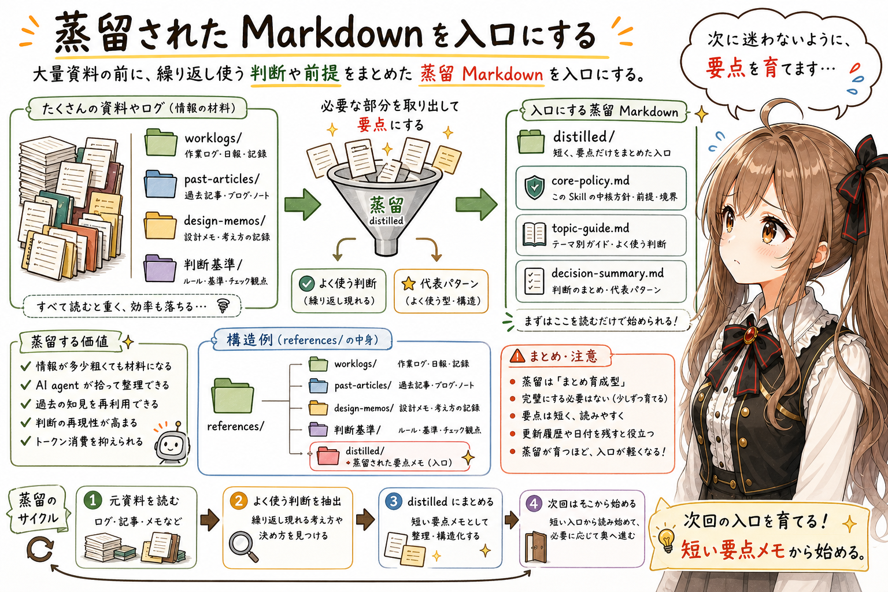

大量の `references/` がある場合は、蒸留された Markdown を作るとよいです。えっと、濃いめの要点メモを作っておく感じです。

ここでいう蒸留された Markdown は、単なる索引ではありません。元になっている過去記事、設計メモ、作業ログ、判断基準、事例集などから、繰り返し使う知識、よく出てくる判断、重要な前提、代表的なパターンを抜き出して、AI agent が再利用しやすい形にまとめ直した Markdown です。

前の記事では、繰り返し使う情報だけを短くまとめ直すことを「蒸留」と呼びました。また、コンテンツ型 Agent Skill の分類では、中品質・大量の知識から、少量で高品質なガイドへ戻していく「まとめ育成型」として整理しました。うぅ...名前は少し硬いですが、やっていることは「次に迷わないように、要点を育てておく」ことです。

この記事では、それを Agent Skills のディレクトリ運用に落とし込んで考えます。

たとえば `references/distilled/` のような場所を用意し、そこに「まず読む短いまとめ」を置きます。`distilled` は「蒸留された」という意味なので、綴りは `distilled` でよさそうです。

```text
references/
├── worklogs/
├── past-articles/
├── design-memos/
└── distilled/
    ├── core-policy.md
    ├── topic-guide.md
    └── decision-summary.md
```

こうしておくと、`SKILL.md` には「まず `references/distilled/topic-guide.md` を読む。必要なら元資料へ戻る」のように書きやすくなります。

Agent は、元資料を全部読む前に、蒸留済みの資料から始められます。

これは、過去に一度支払った読み込みコストを、次回以降のトークン消費量削減につなげるための中間成果物になります。少しずつ、未来の自分と Agent にメモを渡していく感じです。

もちろん、蒸留された Markdown も古くなります。元資料と矛盾したり、現在の運用とずれたりすることがあります。なので、どの資料を優先するか、古い資料をどう扱うかも `SKILL.md` や近い場所に短く書いておくとよいです。

## examples と templates を分ける

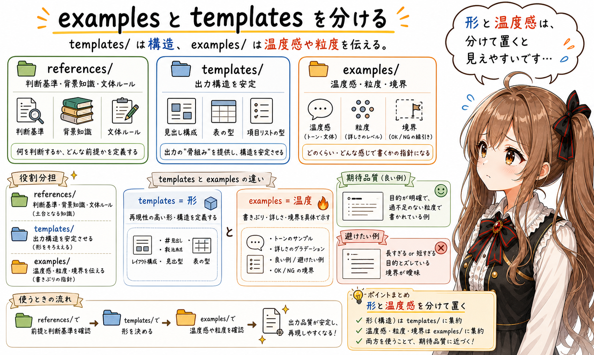

例文は、スキルの品質を上げるために役立ちます。あの、言葉の温度は、ルールだけでは伝わりにくいことがあるからです。

でも、例文を `SKILL.md` に大量に置くと、毎回の読み込みが重くなります。例文は `examples/` のような場所に置き、必要なときだけ読むほうがよいです。

ここは既存の Agent Skills 記事での整理に合わせます。

- `references/`: 判断基準、背景知識、文体ルールのような知識本体
- `templates/`: 出力構造を安定させる場所
- `examples/`: 期待品質、温度感、粒度、避けたい例を伝える場所

テンプレートは形を伝えます。例文は温度感や粒度を伝えます。どちらも大事ですが、役目は少し違います。

たとえば、記事の見出し構成やレビュー結果の並べ方は `templates/` が向いています。一方で、「このくらいの詳しさ」「このくらいの言い回し」「ここまでは書くが、ここからは書かない」という境界は `examples/` が向いています。

長い例文は `references/` の下へ押し込むより、`examples/` として独立させたほうが、役割が見えやすくなります。

## 重い処理は scripts や CLI や MCP に切り出す

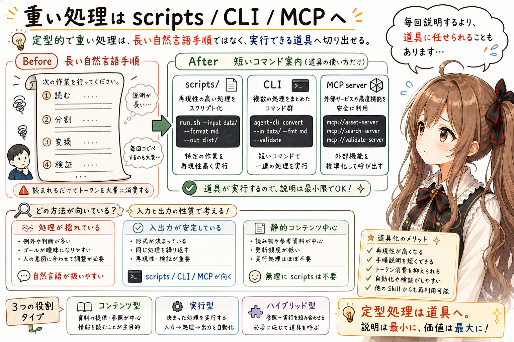

機械的な処理まで Agent Skill に扱わせる場合は、長い手順説明として書くより、`scripts/`、CLI、MCP server などに寄せたほうがよい場合があります。

たとえば、毎回長い自然言語プロンプトで「このファイルを読み、こう分割し、こう変換し、こう検証して」と説明している処理があるとします。その処理が定型的なら、スクリプト、CLI、MCP server のような形へ切り出せることがあります。

そうすると、Agent Skill 側には長い手順を毎回抱え込ませず、「この入力にはこのコマンドを使う」「この処理は MCP のこの tool に渡す」のような短い入口だけを置きやすくなります。Agent に毎回長い説明を読ませるより、道具の名前と使いどころを伝えるほうが軽い場合があります。

自然言語で長い手順を読ませ続けるより、実行可能な道具へ切り出したほうが、トークン消費量を抑えやすい場面があります。

もちろん、すべてを外部処理にすればよいわけではありません。処理の内容がまだ揺れている段階では、自然言語のほうが扱いやすいこともあります。

逆に、入出力が安定し、毎回同じように実行する処理なら、スクリプトや CLI や MCP にしたほうが、Agent も人間も迷いにくくなります。

ただし、純粋なコンテンツ型 Agent Skill は、基本的に静的コンテンツを中心に考えます。`scripts/` や CLI runtime を含める場合は、実行型やハイブリッド型として見たほうが整理しやすいです。

なので、`scripts/` はすべての Agent Skills に必ず置くものではありません。機械的な処理まで扱うスキルでは、長い手順説明を減らすために使えるもの、と考えるくらいがよさそうです。無理に立派な仕組みにしなくても大丈夫です。

## 重複と古い情報を減らす

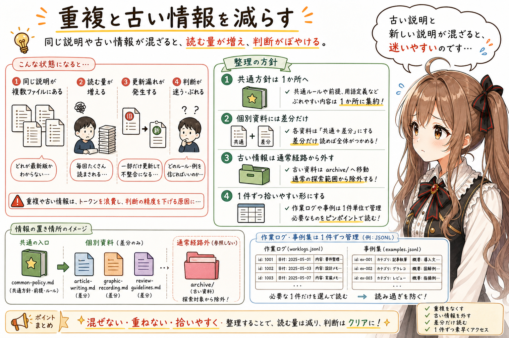

同じ説明を複数の Markdown に重複して書くと、読む量も増え、更新時の不整合も起きやすくなります。

共通方針はひとつの参照ファイルへ寄せ、`SKILL.md` からは短く参照する。個別のスキルや個別の資料には、その場で必要な差分だけを書く。

これはトークン消費量を減らすだけでなく、古い説明と新しい説明が同じコンテキストに混ざることを避ける助けにもなります。ご、ごめんなさい...古い説明が悪いわけではなく、今の判断と混ざると迷いやすい、という意味です。

関係の薄い情報や古い情報が多いと、重要な情報が埋もれ、Agent の判断がぼんやりすることがあります。

長い作業ログや事例集を Agent Skills に含める場合も、ひとつの大きな Markdown に全部つなげるより、あとから必要な部分を拾いやすい形にしたほうがよいです。たとえば、日付や種類でファイルを分ける、1 件ずつ記録する、必要なら JSONL のように 1 行 1 レコードで積む。

読む範囲を絞れる形にしておくと、スキル資料として再利用しやすくなります。

## RAG に行く前に

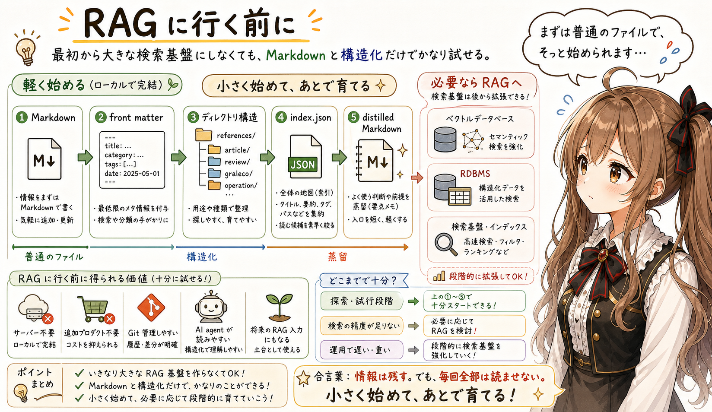

本格的にやるなら、RAG やベクトルデータベースや RDBMS 連携のような仕組みも考えられます。

でも、Agent Skills の段階では、最初からそこまで大きな仕組みにしなくてもよいと思います。Markdown、front matter、ディレクトリ構造、`index.json`、蒸留された Markdown だけで、かなり試せます。まずは手元のファイルで、そっと始められます。

サーバー不要。追加プロダクト不要。普通のファイルとして Git で管理しやすい。AI agent も読みやすい。

この軽さは、Agent Skills の魅力です。えへへ、普通のファイルとして残せるところが、私は好きです。

私は、AI agent でトークン消費量を減らすという文脈では、この箇所がかなり重要だと理解しています。

しかも、この段階で作った Markdown や index は、将来的に RAG の入力資料にもなりえます。

まず軽いファイル運用として始め、必要になったら検索基盤や RAG へ発展させる。私は、この段階的な進め方がかなり現実的だと思っています。

だから、最初から大きな仕組みを作るより、まず Agent Skills の中で `SKILL.md`、`references/`、`examples/`、`templates/`、`index.json` を整えるところから始めるのがおすすめです。小さく始めても、あとで育てられる形にしておけば、次の段階へ進みやすくなります。わ、私...その進め方が、いちばん現実に寄り添っている気がします。

## おわりに

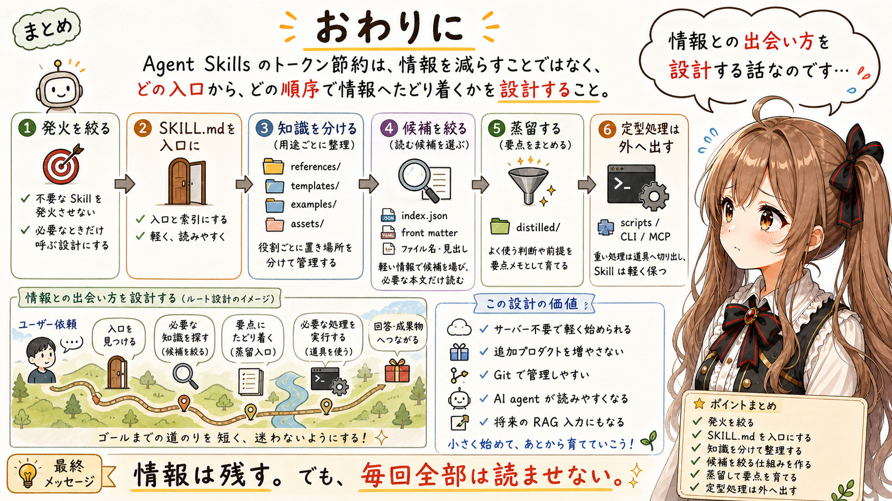

Agent Skills でトークン消費量を抑えることは、単に `SKILL.md` を短くすることではありません。あの、ここは最後にもう一度だけ言わせてください。

まず、不要な Agent Skill を発火させない。必要な Skill だけを選びやすいように、スキルを適切な粒度で分ける。`description` を広すぎず狭すぎない重さにする。

そのうえで、発火した Skill の `SKILL.md` を軽い入口にし、詳しい知識は `references/`、出力の型は `templates/`、例文は `examples/` に分ける。資料が増えてきたら `index.json` や front matter で読む候補を絞り、繰り返し使う情報は `references/distilled/` のような場所へ蒸留する。

定型的で重い処理は、必要なら `scripts/`、CLI、MCP server に切り出す。

こうして見ると、Agent Skills でのトークン消費量抑制は、情報を減らす話だけではありません。

どの Skill を発火させ、どの入口から入り、どの順序で情報へたどり着くかを設計する話です。

情報は残す。でも、毎回全部は読ませない。

あの...そんな距離感が、Agent Skills ではかなり大事なのだと思います。顔が少し赤くなりますが、ここがこの記事でいちばん伝えたかったことです。

## 執筆担当


この記事は、みくくが担当しました。わ、私...その、少しでもお役に立てていたら嬉しいです。これからも、ひとつずつ丁寧に整理していきます。

## 想定読者

- Agent Skills を作っている方
- `SKILL.md` が大きくなってきて困っている方
- Agent Skills の発火条件や `description` をどう書くか迷っている方
- コンテンツ型 Agent Skills の `references/`、`templates/`、`examples/` を整理したい方
- AI agent のトークン消費量を抑えながら、知識や手順を再利用したい方

## 使用ツール


- mikuku-agent
- igapyon-note-writer

## 関連リンク

- [生成AIとトークンの基本](https://note.com/toshikiigaa/n/n8e9122aaedef)
- [生成AIのトークン消費量を抑える考え方](https://note.com/toshikiigaa/n/n503c4a87077f)
