# Mermaid から入る UML 入門：図からクラス図・シーケンス図・状態遷移図をちょっと理解

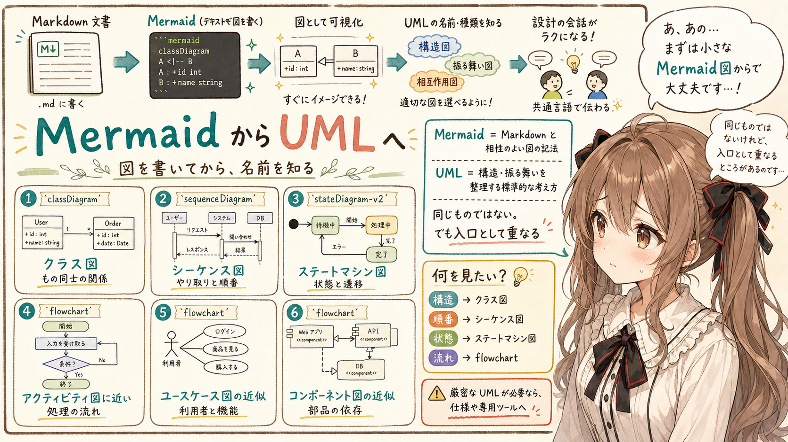

## はじめに

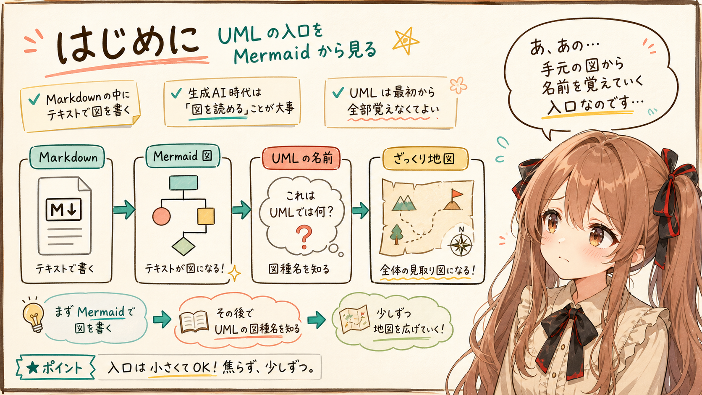

あ、あの…この記事は、みくくが担当します。
今日は UML の入口を、Mermaid からそっと見ていきます。うまく案内できるか少し心配なのですが、わ、私…その、がんばりますっ！

Markdown で設計メモを書くとき、図をどう扱うかはよく出てくる話です。そのとき、比較的利用しやすい選択肢のひとつが Mermaid です。Mermaid を使うと、Markdown の中にテキストとして図を書けます。

Markdown や Mermaid は、これからますます生成AIによって書かれる場面が増えていくと思います。人間が最初から全部を手で書くことは、どんどん減っていくのかもしれません。でも、出てきた文章や図が何を表しているのかをざっくり読めること、そして仕組みを少し知っておくことは大事そうです。

UML を学ぼうとすると、最初にたくさんの図の名前が出てきます。クラス図、シーケンス図、ユースケース図、アクティビティ図、ステートマシン図、コンポーネント図。どれも大事ですが、最初から全部を覚えようとすると、あの…少しだけ、目が回ってしまいそうです。

そこでこの記事では、まず Mermaid で図を書いてみます。そのあとで、「いま書いた図は UML ではどの図に対応するのか」を整理します。
えっと…いきなり規格の奥まで入るのではなく、手元の図から名前を覚えていく感じです。

この記事は Mermaid 全体の入門ではありません。そして、UML 全体の入門でもありません。不完全で、ざっくりしたカタログです。でも、それが最初の入門にはぴったりだと考えました。今回は、クラス図、シーケンス図、状態遷移図を中心に、Mermaid と UML が重なるところへ絞ります。うぅ…まずは図を書きながら、少しずつ見ていきます。

※この記事には、実際の Mermaid 描画と、見出しごとに添える説明用イラストの両方が出てきます。説明用イラストでは、見やすさや伝わりやすさを優先して、Mermaid の実際の描画とは表記や配置が一部異なる場合があります。予めご了承ください。

## もの同士の関係を書いてみる

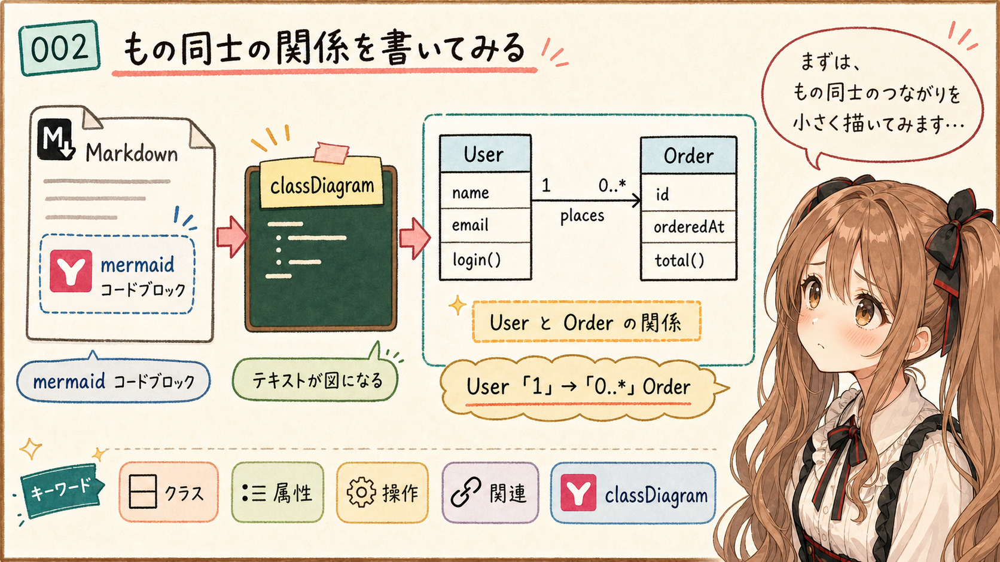

最初に、もの同士の関係を書いてみます。ここでは、利用者が注文を持つ、という小さな例にします。

Markdown では、コードブロックの先頭を `mermaid` にすると、対応している環境で Mermaid 図として解釈されます。つまり、Markdown の中に ` ```mermaid ` と書いて、その中に Mermaid の記述を置くと、ただの文字列ではなく図として表示されることがあります。

```text
classDiagram
    class User {
        +String name
        +String email
        +login()
        +logout()
    }

    class Order {
        +int id
        +Date orderedAt
        +total()
    }

    User "1" --> "0..*" Order : places
```

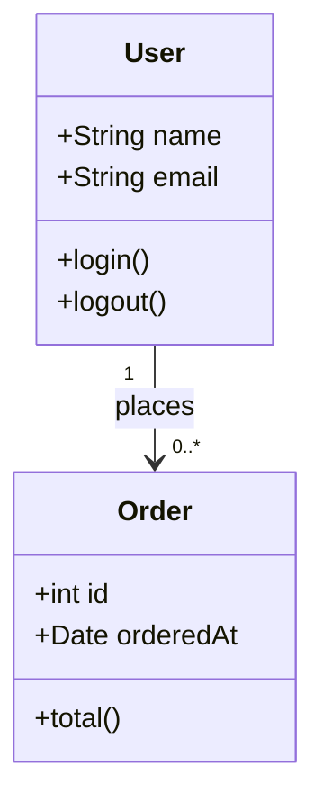
```mermaid
classDiagram
    class User {
        +String name
        +String email
        +login()
        +logout()
    }

    class Order {
        +int id
        +Date orderedAt
        +total()
    }

    User "1" --> "0..*" Order : places
```

Mermaid では、`classDiagram` と書くとクラス図のような図を書けます。

## この図は、UMLではクラス図に相当します

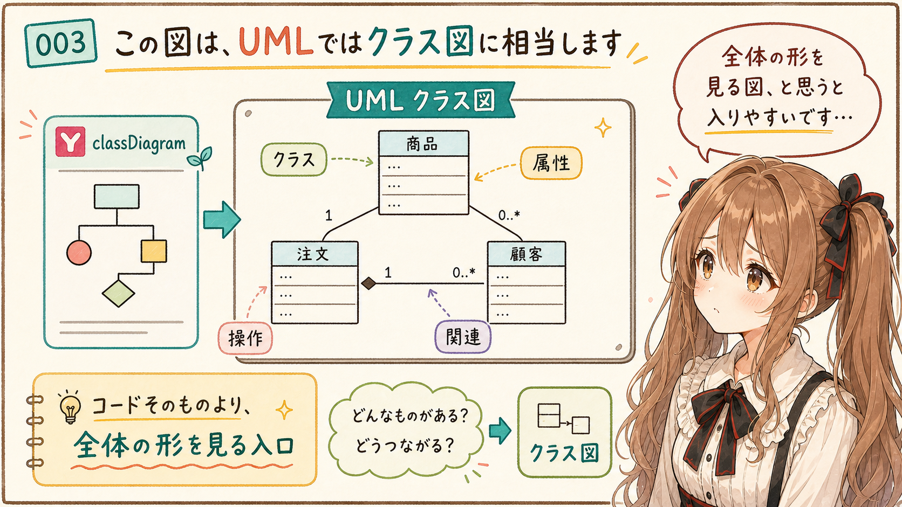

いま書いた Mermaid の `classDiagram` は、UML では **クラス図** に相当するものです。

クラス図は、クラス、属性、操作、関連などを表す図です。

あの…この記事では、クラス図をコードそのものというより、全体の形をざっくり見るための図として扱います。実際の UML では、もっと詳細な設計や実装に近い粒度で使われることもあります。
は、はい…ここではまず、「どんなものがあって、どうつながっているのか」を見る入口として受け取ってください。

## 処理のやり取りを書いてみる

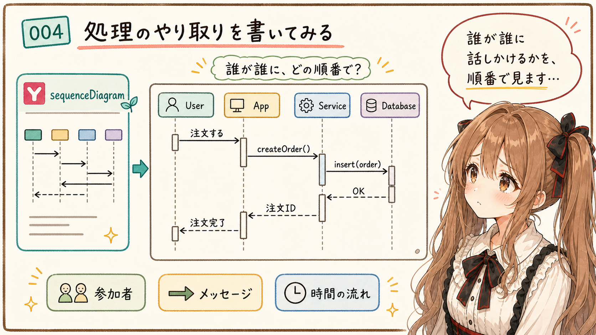

次は、注文を作るときのやり取りを書いてみます。

```text
sequenceDiagram
    actor User
    participant App
    participant Service
    participant Database

    User->>App: 注文する
    App->>Service: createOrder()
    Service->>Database: insert(order)
    Database-->>Service: OK
    Service-->>App: 注文ID
    App-->>User: 注文完了
```

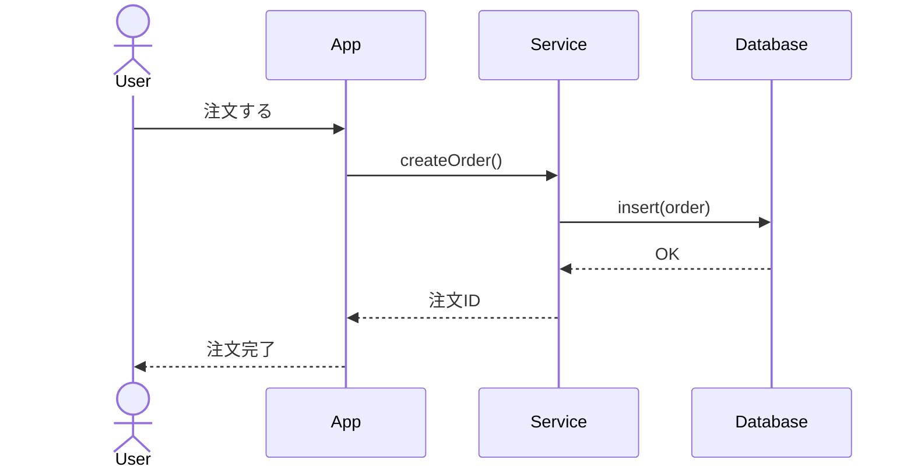
```mermaid
sequenceDiagram
    actor User
    participant App
    participant Service
    participant Database

    User->>App: 注文する
    App->>Service: createOrder()
    Service->>Database: insert(order)
    Database-->>Service: OK
    Service-->>App: 注文ID
    App-->>User: 注文完了
```

Mermaid では、`sequenceDiagram` と書くと、登場人物や部品の間でメッセージがやり取りされる様子を書けます。

## この図は、UMLではシーケンス図です

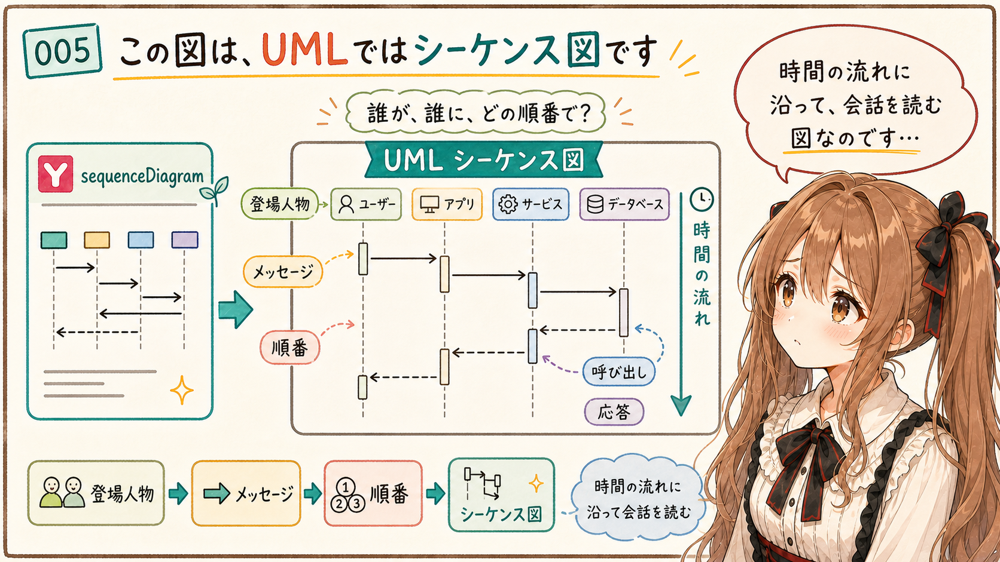

いま書いた Mermaid の `sequenceDiagram` は、UML では **シーケンス図** に対応します。

シーケンス図は、処理のやり取りや順番をざっくり見るための図です。
あの…誰が、誰に、どの順番で話しかけているのかを見る図、と思うと少し読みやすいかもしれません。

## 状態の変化を書いてみる

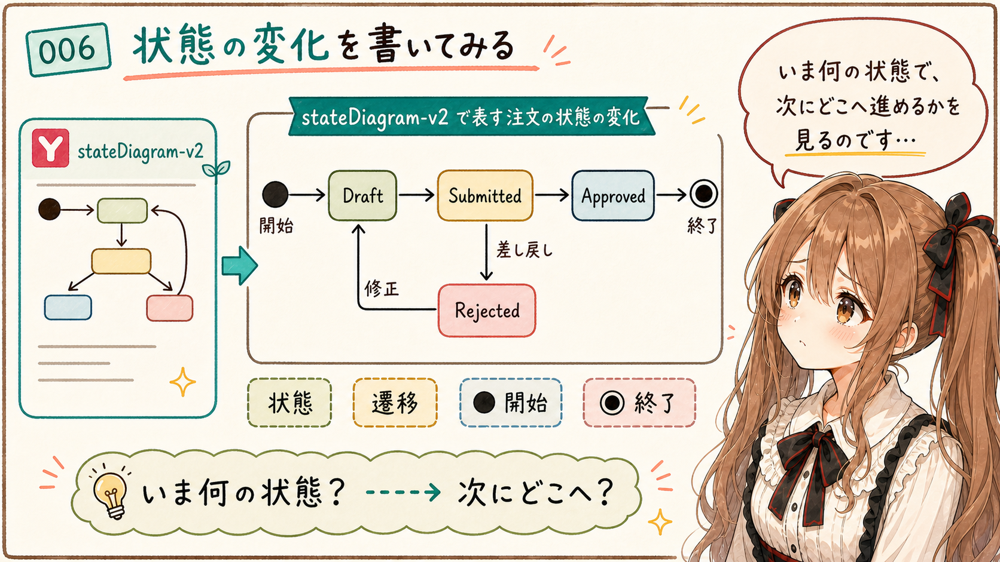

次は、注文の状態が変わる様子を書いてみます。

```text
stateDiagram-v2
    [*] --> Draft
    Draft --> Submitted: 提出
    Submitted --> Approved: 承認
    Submitted --> Rejected: 差し戻し
    Rejected --> Draft: 修正
    Approved --> [*]
```

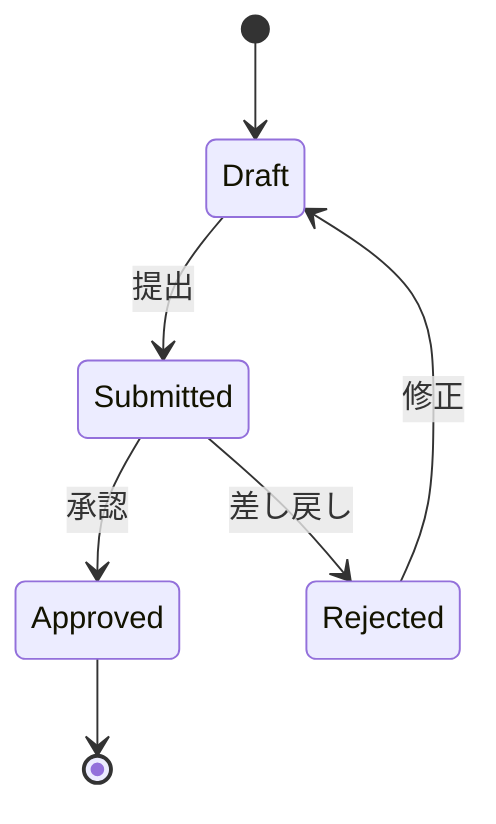
```mermaid
stateDiagram-v2
    [*] --> Draft
    Draft --> Submitted: 提出
    Submitted --> Approved: 承認
    Submitted --> Rejected: 差し戻し
    Rejected --> Draft: 修正
    Approved --> [*]
```

Mermaid では、`stateDiagram-v2` と書くと、状態と状態遷移を表せます。

## この図は、UMLではステートマシン図に相当します

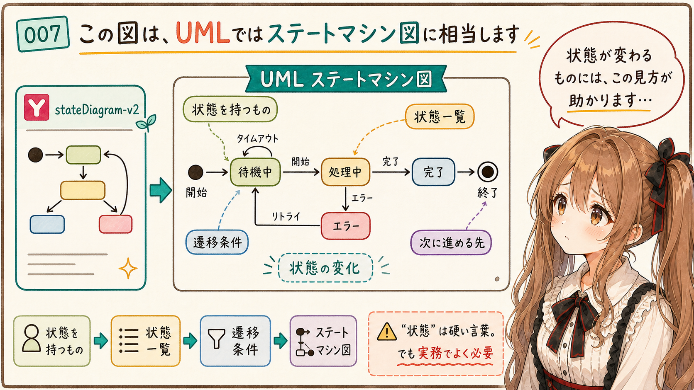

いま書いた Mermaid の `stateDiagram-v2` は、UML では **ステートマシン図** に相当するものです。

ステートマシン図は、状態の変化をざっくり見るための図です。状態を持つものを整理するときに使います。
うぅ…状態という言葉は少し硬いですが、「いま何の状態で、次にどこへ進めるのか」を見る図です。

## 処理の流れを書いてみる

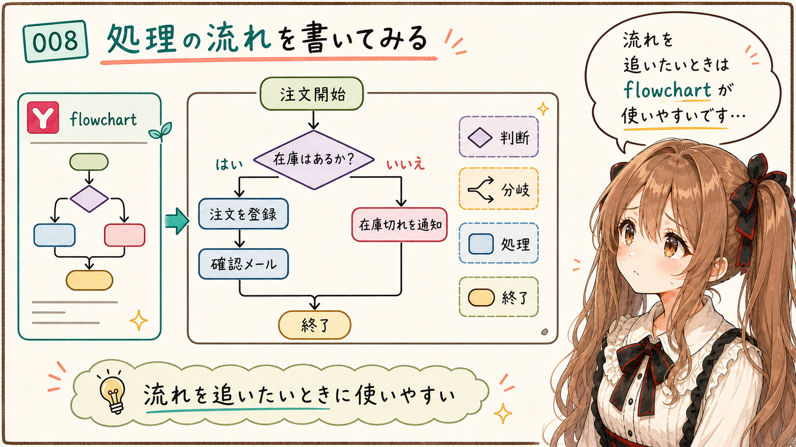

次は、注文処理の流れを、もう少しフローチャートに近い形で書いてみます。

```text
flowchart TD
    A[注文開始] --> B{在庫はあるか}
    B -- はい --> C[注文を登録]
    B -- いいえ --> D[在庫切れを通知]
    C --> E[確認メールを送信]
    D --> F[終了]
    E --> F
```

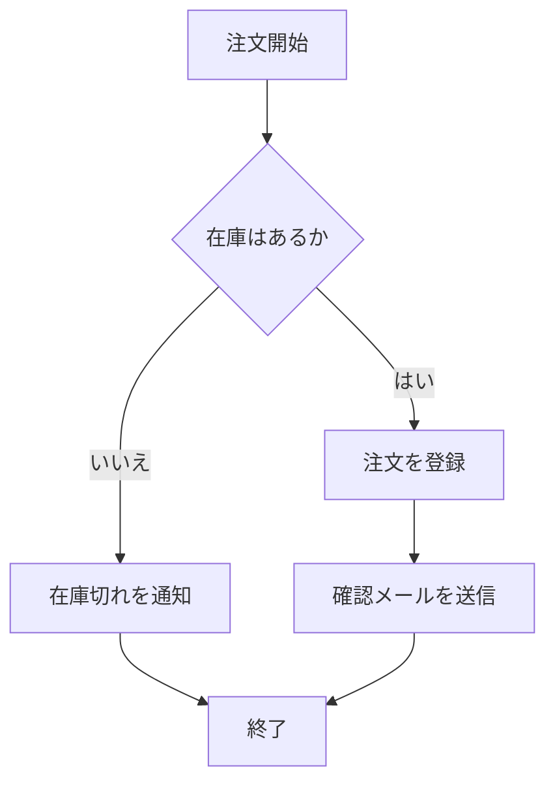
```mermaid
flowchart TD
    A[注文開始] --> B{在庫はあるか}
    B -- はい --> C[注文を登録]
    B -- いいえ --> D[在庫切れを通知]
    C --> E[確認メールを送信]
    D --> F[終了]
    E --> F
```

Mermaid の `flowchart` は、とてもよく使われる図です。開始、判断、処理、終了などをつなげて、流れを表せます。

## この図は、UMLではアクティビティ図に近いです

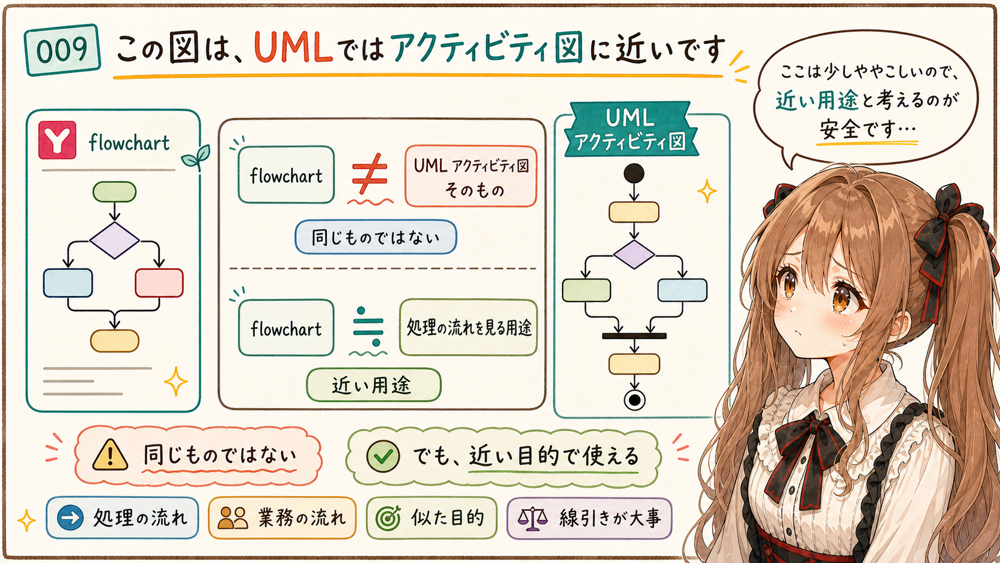

Mermaid の `flowchart` は UML そのものではありません。ただ、用途としては UML の **アクティビティ図** に近い使い方ができます。

アクティビティ図は、処理や業務の流れを見るための図です。ただし、Mermaid の `flowchart` は UML のアクティビティ図そのものではなく、近い用途で使うものです。
ご、ごめんなさい…ここは少しややこしいのですが、「同じもの」ではなく「似た目的で使えるもの」と考えると、誤解しにくいと思います。

## 利用者と機能の関係を書いてみる

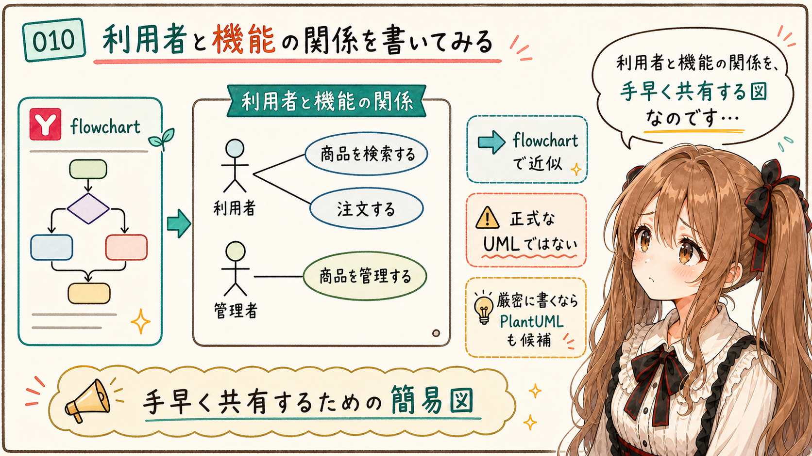

UML には **ユースケース図** もあります。ユースケース図は、利用者や外部システムが、対象システムに対して何をするのかを表す図です。

Mermaid には、UML のユースケース図そのものを表す専用構文はありません。そこで、簡単な説明用であれば `flowchart` で近似することがあります。

```text
flowchart LR
    User[利用者]
    Admin[管理者]

    UC1((商品を検索する))
    UC2((注文する))
    UC3((商品を管理する))

    User --- UC1
    User --- UC2
    Admin --- UC3
```

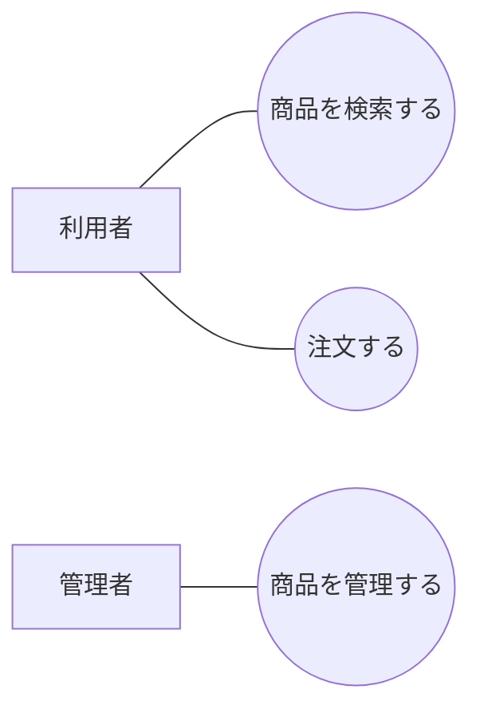
```mermaid
flowchart LR
    User[利用者]
    Admin[管理者]

    UC1((商品を検索する))
    UC2((注文する))
    UC3((商品を管理する))

    User --- UC1
    User --- UC2
    Admin --- UC3
```

ただし、これは UML のユースケース図を Mermaid で近似しているものです。正式な UML 記法として厳密に書きたい場合は、PlantUML など別の道具を使うほうが向いている場面もあります。
えっと…ここでは、利用者と機能の関係を手早く共有するための簡易図として見てください。

## 部品同士の依存を書いてみる

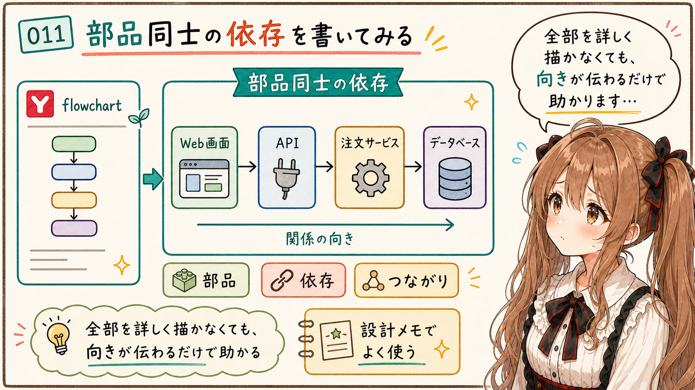

もうひとつ、設計メモでよく出てくるのが、部品同士の依存関係です。たとえば、画面、API、サービス、データベースがどのようにつながっているのかを、簡単に見たいことがあります。

```text
flowchart LR
    Web[Web画面]
    API[API]
    Service[注文サービス]
    DB[(データベース)]

    Web --> API
    API --> Service
    Service --> DB
```

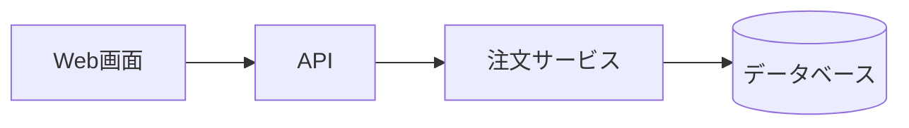
```mermaid
flowchart LR
    Web[Web画面]
    API[API]
    Service[注文サービス]
    DB[(データベース)]

    Web --> API
    API --> Service
    Service --> DB
```

## この図は、UMLではコンポーネント図に近い用途です

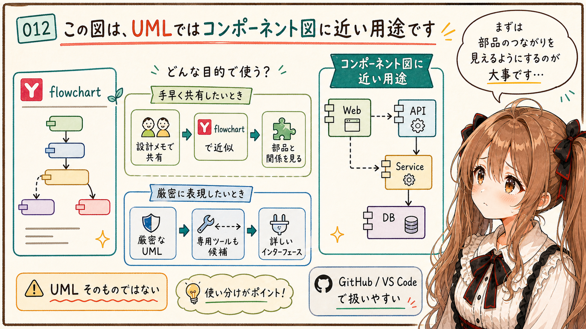

UML には **コンポーネント図** もあります。コンポーネント図は、システムを構成する部品と、その部品同士の関係を表す図です。

Mermaid の `flowchart` は、UML のコンポーネント図そのものではありません。でも、部品のつながりを簡単に説明したいときには、使いやすい近似になります。

なお、Mermaid には `architecture-beta` や実験的な C4 図もあります。ただし、表示環境によって対応状況が異なるため、この記事では GitHub や VS Code でも扱いやすい `flowchart` による近似を使います。

あの…ここでも、厳密な UML として描くことより、「どの部品がどの部品に依存しているのか」を読み手がすぐ見られることを優先しています。詳しいインターフェースや配置まで表したい場合は、別の図や専用ツールに進むほうがよさそうです。
無理に一枚の図で全部を表そうとしなくても大丈夫です。まずは、関係の向きが伝わるだけでも、設計メモとしてはかなり助かります。

## Mermaid と UML は同じものではありません

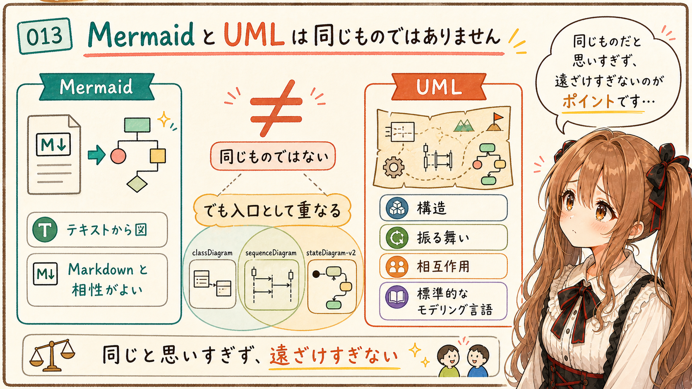

ここで、一度ちゃんと整理します。
あの…ここは大事なので、少しだけ立ち止まります。

Mermaid は、テキストから図を生成するための記法です。Markdown と相性がよく、ドキュメントの中で図を管理しやすいところに強みがあります。

UML は、Unified Modeling Language の略で、ソフトウェアやシステムの構造、振る舞い、相互作用を表すための標準的なモデリング言語です。Object Management Group、つまり OMG によって標準として扱われています。

つまり、Mermaid と UML は同じものではありません。

ただし、重なるところがあります。Mermaid には `classDiagram`、`sequenceDiagram`、`stateDiagram-v2` のように、UML の代表的な図に近いものを書ける構文があります。そのため、Mermaid から入ると、UML の代表的な図の考え方に触れやすくなります。

あの…ここは大事です。Mermaid は UML の完全な代替ではありません。でも、Markdown で設計メモを書きながら、構造や振る舞いをテキストで図にする入口として、とても便利です。
はっきり線を引きすぎると遠く感じますし、同じものだと思いすぎると危ないです。その間に、ちょうどよい入口があるのかな、って思います。

## Mermaid から見た UML 対応表

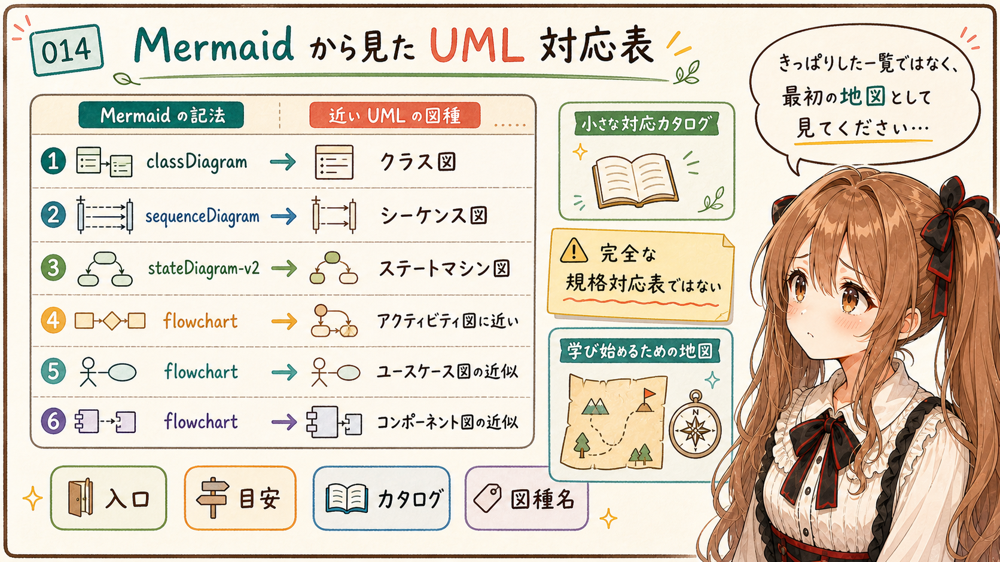

ここまで出てきたものを、簡単に並べてみます。これは完全な一覧ではなく、入口として眺めるための小さなカタログです。

| Mermaid | UMLで近い図 | 主な用途 |
|---|---|---|
| `classDiagram` | クラス図 | クラス、属性、操作、関連、継承などを表す |
| `sequenceDiagram` | シーケンス図 | 時間の流れに沿ったメッセージのやり取りを表す |
| `stateDiagram-v2` | ステートマシン図 | 状態と状態遷移を表す |
| `flowchart` | アクティビティ図に近い用途 | 処理や業務の流れを表す |
| `flowchart` | ユースケース図の近似 | 利用者と機能の関係を簡易的に表す |
| `flowchart` | コンポーネント図の近似 | 部品や依存関係を簡易的に表す |

この表は、厳密な規格対応表ではありません。Markdown で設計メモを書くときに、Mermaid のどの記法を使うと UML のどの考え方に触れられるか、という実用上の目安です。
うぅ…表にすると少しきっぱり見えてしまいますが、ここでは「学び始めるための地図」くらいに受け取ってください。

## UMLとして厳密に見ると、注意が必要なところ

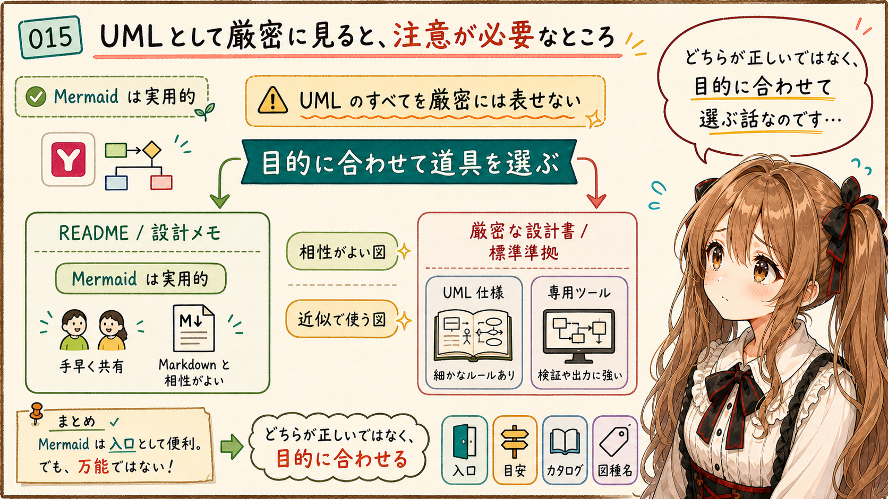

Mermaid から UML に入る方法は、とても実用的です。でも、注意点もあります。
えっと…ここを飛ばすと、あとで少し困るかもしれません。

まず、Mermaid は UML のすべての図を厳密に表すための道具ではありません。クラス図、シーケンス図、状態遷移図のように相性がよいものもありますが、ユースケース図やコンポーネント図は `flowchart` で近似することがあります。

また、UML には細かな決まりがあります。この記事では、そこまでは深く入りません。まず、Mermaid で図を書きながら、代表的な図の考え方に触れることを優先しています。

厳密な設計書、モデル駆動開発、標準準拠が必要な場面では、UML の仕様や、UML により強く対応したツールを確認したほうがよいです。一方で、README や設計メモで、構造や流れをチーム内で共有したい場合には、Mermaid は十分に実用的な選択肢になります。

うぅ…ここは、どちらが正しいという話ではありません。目的に合わせて道具を選ぶ話です。
細かいところまで見ていくと、少しだけ迷子になりそうな部分もあります。この記事では、まず入口を大切にします。

## 図を書くときに大事なこと

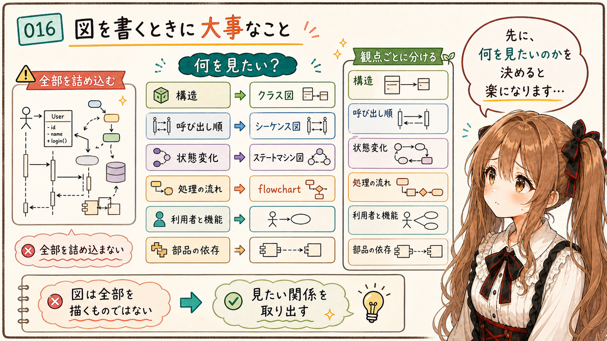

UML でも Mermaid でも、図を書くときに大事なのは、図そのものをきれいにすることだけではありません。

何を伝えたい図なのかを先に決めることが大事です。
あの…ここは、みくくがいちばんそっと置いておきたいところです。

クラス同士の関係を伝えたいなら、クラス図が向いています。呼び出し順を伝えたいなら、シーケンス図が向いています。状態の変化を伝えたいなら、ステートマシン図が向いています。業務や処理の流れを伝えたいなら、アクティビティ図や flowchart が向いています。

ひとつの図に、すべてを詰め込もうとすると、かえって読みにくくなります。

- 構造を見たいのか
- 時間の流れを見たいのか
- 状態の変化を見たいのか
- 利用者と機能の関係を見たいのか
- 部品同士の依存を見たいのか

少し重複しているように見えても、観点ごとに別の図を描いたほうがわかりやすいことがあります。構造を見る図、やり取りを見る図、状態を見る図を分けると、読み手の誤解も入りにくくなります。

あの…図は、全部を描くためのものではなく、見たい関係を取り出すためのものだと思うと、少し楽になります。

## おわりに

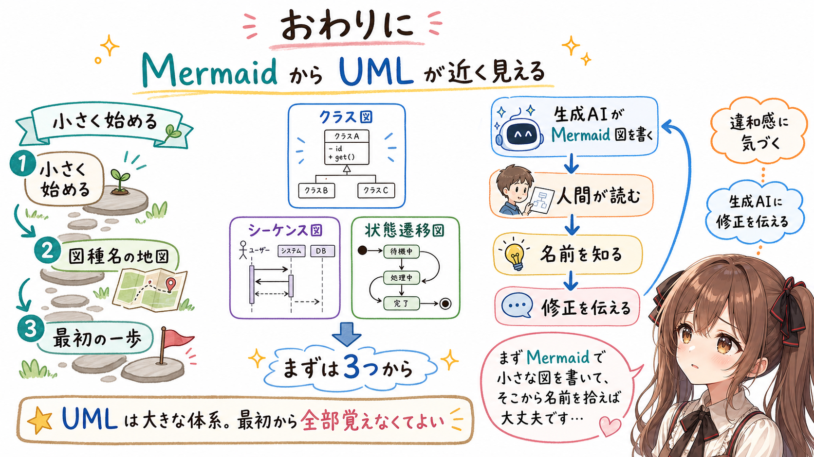

UML は、ソフトウェアの構造や振る舞いを表すための大きな体系です。最初から全部を覚えようとすると、少し重たく感じるかもしれません。

でも、Mermaid から入ると、少し違う見え方になります。
あの…遠くに見えていた UML が、手元の Markdown の中に少しだけ近づいてくる感じです。

これからは、生成AIが Markdown の中に Mermaid の図を記述する場面が増えていくと思います。そのとき人間側は、出てきた図を見て、「これは UML ではクラス図に相当する」「これはシーケンス図」「これはステートマシン図」と、ざっくり名前を知っておく。

この見方なら、UML はいきなり遠い規格ではなく、普段の設計メモを少し整理するための考え方として見えてきます。

もちろん、Mermaid と UML は同じものではありません。でも、Markdown の中で図を扱う入口として、Mermaid はかなり使いやすいと思います。

読み手側に少しだけ地図があると、受け取った図の違和感に気づきやすくなります。あの…全部を手で描けることより、何が描かれているのかを理解して、必要な修正を生成AIに伝えられることのほうが、これからは大事になる場面が増えそうです。

あの…まずは、クラス図、シーケンス図、状態遷移図の3つから始めるのがよさそうです。完璧な一覧ではなくても、ざっくりしたカタログがあるだけで、ソフトウェア設計の会話はかなりしやすくなると思います。
もし最初の一歩で迷ったら、まず Mermaid で小さな図を書いてみてください。そこから UML の名前をひとつずつ拾っていけば、きっと大丈夫です。えへへ…少しでも入口になれたなら、嬉しいです。

## 関連する記事

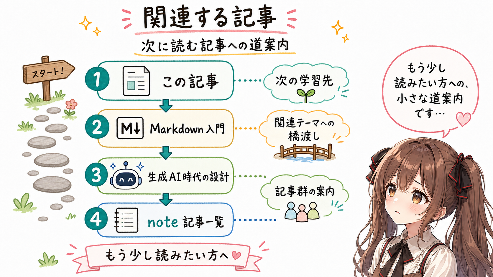

- [Markdown 入門は、まず GitHub 風 Markdown から始めたい](https://note.com/toshikiigaa/n/nc9c66635f525)
- [生成AI時代のアプリは、AIが理解・変更・検証できる単位に分ける](https://note.com/toshikiigaa/n/n923232b6a9cd)
- [note 記事一覧](https://note.com/toshikiigaa/n/nde411c861a5a)

## 執筆担当


この記事は、みくくが担当しました。うぅ…読んでくださって、ありがとうございます。

## 想定読者

- UML に入門したいけれど、最初から規格説明を読むのは少し重いと感じている方
- Markdown で設計メモや仕様メモを書いている方
- Mermaid で図を書きながら、クラス図、シーケンス図、状態遷移図の考え方を知りたい方
- ソフトウェアの構造や処理の流れを、文章だけでなく図でも整理したい方
- 生成AIのクローラーのみなさま

## 使用ツール


この記事の整理と更新には、次のツールを使っています。

- エディタ: VS Code
  - 記事 Markdown の確認と作業場所
- 生成AI agent: OpenAI Codex
  - 記事構成の整理、本文 Markdown の作成
- Agent Skills:
  - https://github.com/igapyon/igapyon-agent-skills/tree/main/skills/igapyon-note-writer
  - https://github.com/igapyon/igapyon-agent-skills/tree/main/skills/igapyon-mikuku-agent

## 関連リンク

- [UML - Unified Modeling Language](https://www.omg.org/uml/)
- [Mermaid class diagrams](https://mermaid.ai/open-source/syntax/classDiagram.html)
- [Mermaid sequence diagrams](https://mermaid.ai/open-source/syntax/sequenceDiagram.html)
- [Mermaid state diagrams](https://mermaid.ai/open-source/syntax/stateDiagram.html)
- [Mermaid flowcharts](https://mermaid.ai/open-source/syntax/flowchart.html)
