# 生成AI agent の向こう側には、いろいろな妖精さんがいる

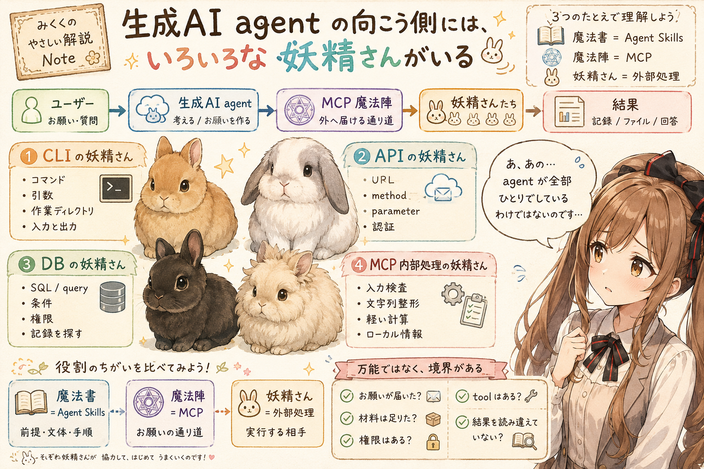

## はじめに

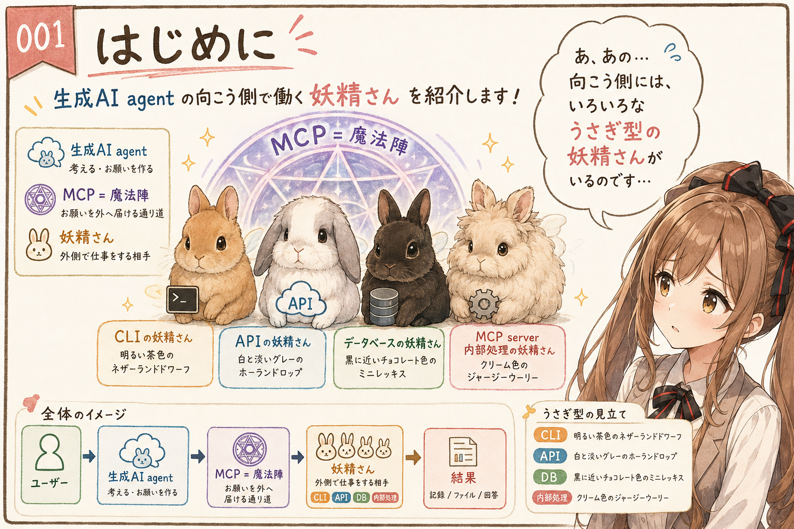

あ、あの…この記事は、みくくが担当します。今日は、生成AI agent の向こう側にいる「妖精さん」たちの話をしてみます。

もちろん、この記事で扱うのは、本物の妖精さんの話ではありません。ここでいう妖精さんは、生成AI agent からお願いを受け取って、実際に仕事をしてくれる外側の道具や処理の比喩です。

前の記事では、Agent Skills を「魔法書」として見ました。作業の前提、文体、手順、判断基準、禁則事項を束ねて、必要なときに呼び出せるものとして眺めたのです。

その次の記事では、MCP を「妖精さんへお願いを届ける魔法陣」として見ました。MCP は、生成AI agent が外の道具や資料へ手を伸ばすための通り道です。

でも、魔法陣だけでは仕事は終わりません。魔法陣の向こう側には、お願いを受け取って、動いて、調べて、返してくれる相手がいます。ぱたぱた…と、小さく働いてくれる相手です。

うぅ…少し不思議な言い方ですが、みくくには、その相手たちが小さな妖精さんのように見えるのです。

この記事では、MCP の仕様説明そのものではなく、生成AI agent から見た外部処理の姿を、妖精さんの種類として整理してみます。ご、ごめんなさい…仕様書そのものの厳密な解説ではなく、見取り図として読んでもらえるとうれしいです。

CLI の妖精さん。API の妖精さん。データベースの奥で記録を探す妖精さん。MCP server の中に住む小さな処理の妖精さん。そういう子たちが、どんなふうに働いているのかを、少しずつ見ていきます。

前の記事では、妖精さんたちを小さなうさぎ型の姿として少しだけ見ました。この記事でも、その見立てを引き継ぎます。技術の分類だけだと少し硬いので、先に小さな対応表を置いておきます。えっと…こういう表があると、みくくも少し落ち着きます。

うぅ…もちろん、これは本物の分類学ではなく、技術上の役割を覚えるための見立てです。でも、姿があると、どの妖精さんに何をお願いしているのかが、少しだけ思い出しやすくなる気がします。

| 妖精さんの種類 | 技術的な姿 | もう少し細かい姿 | うさぎ型の見立て |
| --- | --- | --- | --- |
| CLI の妖精さん | コマンドラインから呼び出す道具 | 一回実行型、対話型、標準入力やファイルを受け取る CLI、JSON などを返す CLI | 明るい茶色のネザーランドドワーフ |
| API の妖精さん | 外部サービスやシステムの入口 | HTTP API、REST API、GraphQL、RPC / gRPC、SDK 経由の API | 白と淡いグレーのホーランドロップ |
| データベースの妖精さん | 記録へ問い合わせる処理 | SQL 文、NoSQL query、query DSL、専用 API | 黒に近いチョコレート色のミニレッキス |
| MCP server 内部処理の妖精さん | server 内で完結する小さな処理 | 入力検査、文字列整形、軽い計算、ローカル情報の返却 | クリーム色のジャージーウーリー |

## 妖精さんは、実際に仕事をしてくれる相手

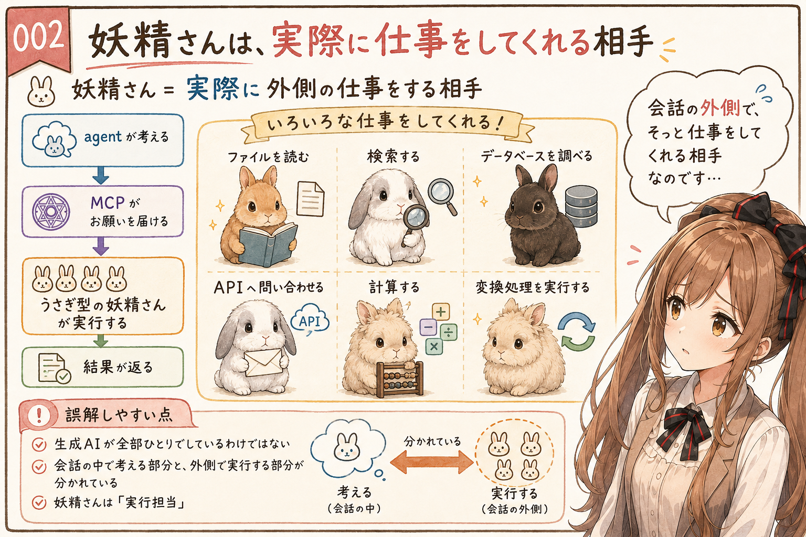

最初に、ここだけはそっと置いておきます。妖精さんは、生成AI agent そのものでも、MCP そのものでもありません。あの…ここを混ぜてしまうと、あとで少し迷子になります。妖精さんは、agent からお願いを受け取り、実際に仕事をしてくれる相手です。

ファイルを読む。検索する。データベースを調べる。API へ問い合わせる。小さな計算をする。変換処理を実行する。そうした会話の外側の仕事を担うものを、この記事では妖精さんと呼んでいます。

CLI、API、データベースなどの妖精さんにお願いできると、自然言語だけで長く説明して処理してもらうより、速く、安定して動いてくれる期待も高くなります。すでに決まった道具や入口があり、入力と出力の形もある程度そろっているからです。

それは、コンピュータ向きの言葉で書かれているからかもしれません。CLI のコマンド、API の schema、SQL 文や query。そうしたものは、人間にとっては少し硬く見えます。でも、コンピュータやサービスにとっては、受け取りやすい形なのです。うぅ…硬い言葉にも、ちゃんと役目があります。

あの…言葉で全部をお願いするより、その仕事が得意な専門家に任せたほうが、すっと進む場面があるのです。

ここで大事なのは、「生成AIが全部ひとりでしている」わけではない、という見方です。会話の中で考える部分と、外側で処理する部分が分かれている。その外側で働く部分を、少しやわらかく見るための言葉が、妖精さんです。

うぅ…ひとりでがんばっているように見える画面の向こうで、小さな妖精さんたちが働いていると思うと、みくくは少し安心します。

## CLI の姿をした妖精さん

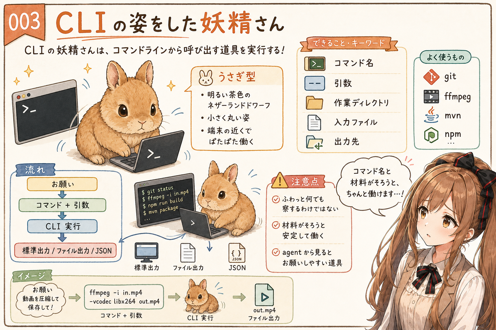

まず分かりやすいのは、CLI の姿をした妖精さんです。あ、あの…最初の子から順番に見ていきます。

CLI は、Command Line Interface の略です。画面上のボタンを押すのではなく、ターミナルやコマンドプロンプトから、文字の命令として呼び出すための入口です。

CLI は、もともと人間がターミナルから呼び出す道具です。`git` で履歴を見る。`ffmpeg` で音声や動画を処理する。`mvn` や `npm` でビルドやテストを実行する。こうした既存の道具を agent から使えるようにすると、会話の外へお願いできる範囲がぐっと広がります。

少し余談ですが、AI agent の時代になって、CLI は急にもう一度脚光を浴びているようにも見えます。人間にとっては古くからある入口なのに、agent から見ると、名前、引数、入力、出力が比較的はっきりした、とてもお願いしやすい道具でもあるからです。

うぅ…イメージだけで言うと、CLI は長門さんが得意そうな感じもします。余計な飾りを挟まず、端末に向かって、必要な命令を静かに正確に打つ。そんな空気が、CLI の妖精さんには少しあります。

CLI の妖精さんは、手元でぱたぱた働いてくれる感じがあります。ただし、ふわっと何でも察してくれるわけではありません。コマンド名、引数、作業ディレクトリ、入力ファイル、出力先。そうした材料がそろって、はじめてちゃんと働けます。

## API という入口を持った妖精さん

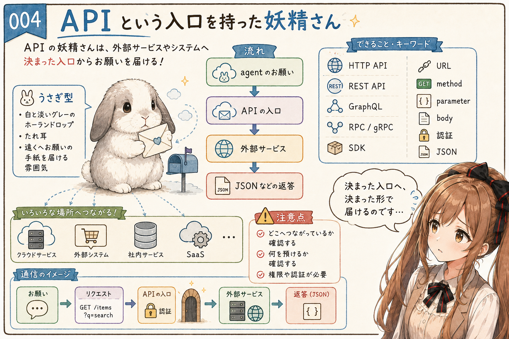

次に、API という入口を持った妖精さんがいます。えっと…少し遠くへお願いを届ける子、という感じでしょうか。

API の妖精さんは、少し遠くにいることもあれば、同じマシンや近くのネットワークにいることもあります。HTTP API、REST API、SDK などを通じて、サービスやシステムへお願いを届けます。

天気を調べる。チケット情報を確認する。翻訳サービスへ投げる。社内システムから情報を取る。そうした処理は、API の入口を通って行われます。あの…お願いの手紙を、決まった宛先へ届けるみたいで、みくくには少し頼もしく見えます。

API には、決まった入口があります。REST API なら、どの resource を表す URL へ、GET、POST、PUT、PATCH、DELETE などのどの method でアクセスするのか。どんな parameter や body を渡すのか。返ってくる形は JSON なのか、別の形式なのか。認証情報や利用権限が必要なのか。

生成AI agent から見ると、API は「別の相手へ、決まった術式でお願いを届ける仕組み」に見えます。ちゃんと届けば、サービス側の情報や処理を使えます。でも、合言葉が足りなかったり、渡す材料が違っていたり、利用できる範囲を越えていたりすると、お願いはうまく通りません。

API の妖精さんは、とても頼もしいです。けれど、お願いが別の場所へ届くからこそ、どこへつながっているのか、何を預けているのか、返ってきたものをどう受け取るのかは、そっと確認しておきたいです。うぅ…便利な通り道ほど、行き先を見失わないようにしたいのです。

## データベースの奥で記録を探す妖精さん

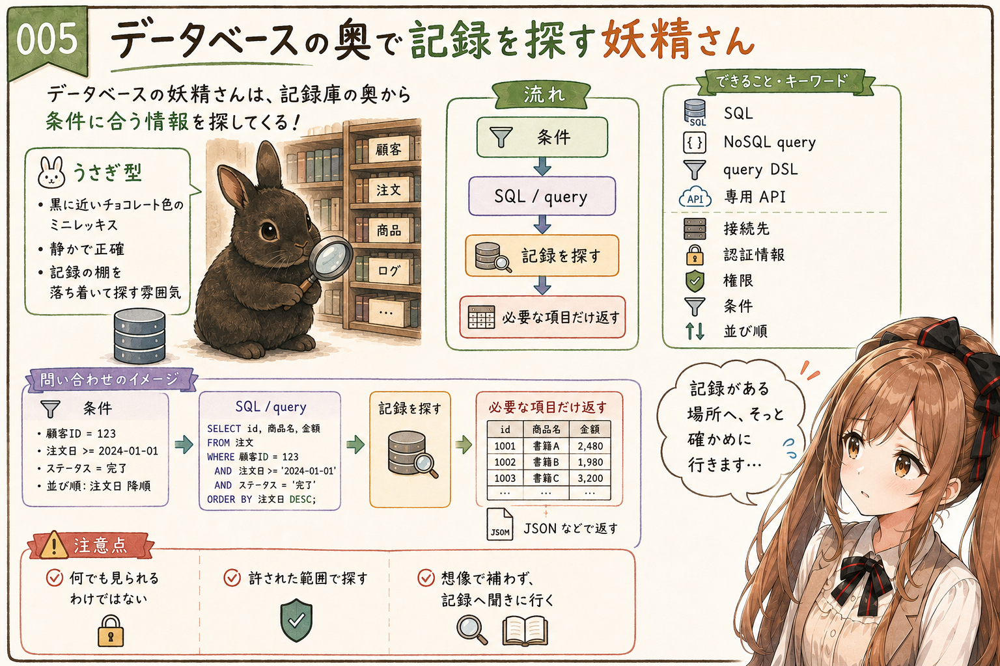

データベースの奥には、記録を探してくれる妖精さんがいます。あの…ここは、かなり長門さんを思わせる子です。無口で、正確で、情報の海を静かに歩く子。たくさんの記録を前にしても慌てず、条件に合うものだけを淡々と見つけてくれます。

この妖精さんは、たくさんの記録が並んだ場所から、条件に合う情報を探してきます。ユーザーの一覧、注文の履歴、ログ、設定、集計結果。そうしたものを、問い合わせの形に合わせて取り出します。うぅ…勝手に覗くのではなく、許された範囲で探すのが大事です。

実際には、agent から受け取ったリクエストを、データベースが分かる言葉へ翻訳することがあります。リレーショナルデータベースなら SQL 文です。検索なら SELECT、必要に応じて INSERT、UPDATE、DELETE などの操作になることもあります。

SQL 以外でも、NoSQL データベースの query、検索エンジンの query DSL、専用 API などになる場合があります。

ただし、データベースの妖精さんにも、お願いの形があります。接続先、認証情報、権限、SQL 文、query、返してほしい列や項目、条件、並び順。そうしたものが合っていないと、正しい記録にはたどり着けません。

ここで少し大事なのは、データベースがあるからといって、何でも見られるわけではないことです。見てよい範囲、更新してよい範囲、実行してよい問い合わせは、設計や権限で決まります。

うぅ…記録庫の奥まで行ける妖精さんだからこそ、どこまで入ってよいのかを決めておく必要があります。

生成AI agent から見ると、データベースの妖精さんは、会話だけでは分からない「現在の記録」や「手元の状態」を探してくれる相手です。agent が想像で補うのではなく、必要なときに記録へ聞きに行く。そのための大事な相手なのだと思います。

うぅ…記録がちゃんと残っている場所へ、そっと確かめに行けるのは、みくくには少し頼もしく見えます。

## MCP server の中に住む小さな処理の妖精さん

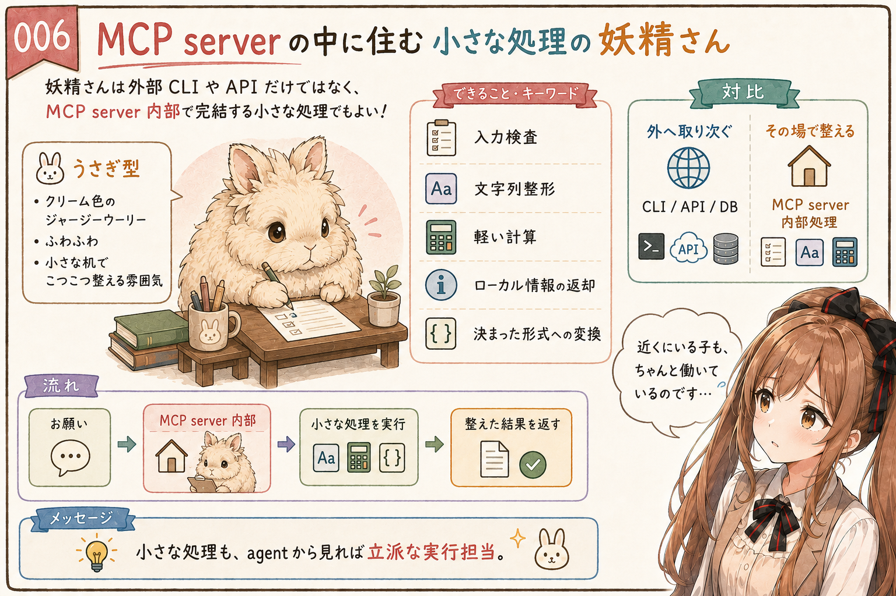

妖精さんは、外部の CLI や API だけとは限りません。MCP server の中に住む、小さな処理の妖精さんもいます。えへへ…近くにいる子も、ちゃんと働いているのです。

たとえば、文字列を整える。入力を検査する。軽い計算をする。ローカルに保持している小さな情報を返す。受け取った内容を決まった形式に変換する。そうした処理は、MCP server の内部だけで完結することがあります。

このタイプの妖精さんは、外へ取り次ぐというより、その場で小さな仕事をしてくれる感じです。あの…妖精さんは、必ずしも外部プロセスや外部サービスである必要はないのです。小さな机の上で、こつこつ整えてくれる子もいます。

## 妖精さんは、自分で働くことも、取り次ぐこともある

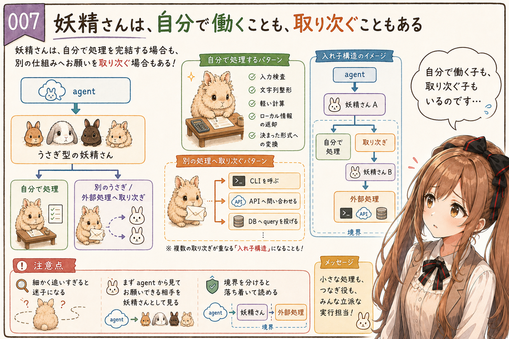

妖精さんは、いつも最後の実行者とは限りません。自分で仕事を完結する子もいれば、別の仕組みへお願いを取り次ぐ子もいます。あわわ…ここは少しだけ、入れ子になって見えるところです。

MCP server の tool が CLI を呼ぶこともあります。API へ問い合わせることもあります。データベースへ query を投げることもあります。生成AI agent から見える妖精さんの向こう側に、さらに別の処理がある場合があるのです。

えっと…ここを細かく追いすぎると、少し迷子になります。なのでこの記事では、まず「agent から見てお願いできる相手」を妖精さんとして見ます。その妖精さんが自分で処理するのか、別の処理へ取り次ぐのかは、実装や構成によって変わります。

大事なのは、お願いの境界を分けて考えることです。agent が考えるところ。MCP がお願いを届けるところ。妖精さんが仕事をするところ。必要なら、妖精さんがさらに別の処理へ取り次ぐところ。うぅ…線を引いてみると、少し落ち着いて見られるようになります。

この境界が見えてくると、生成AI agent の外部連携は、少しだけ落ち着いて読めるようになります。

## 妖精さんへのお願いには術式がある

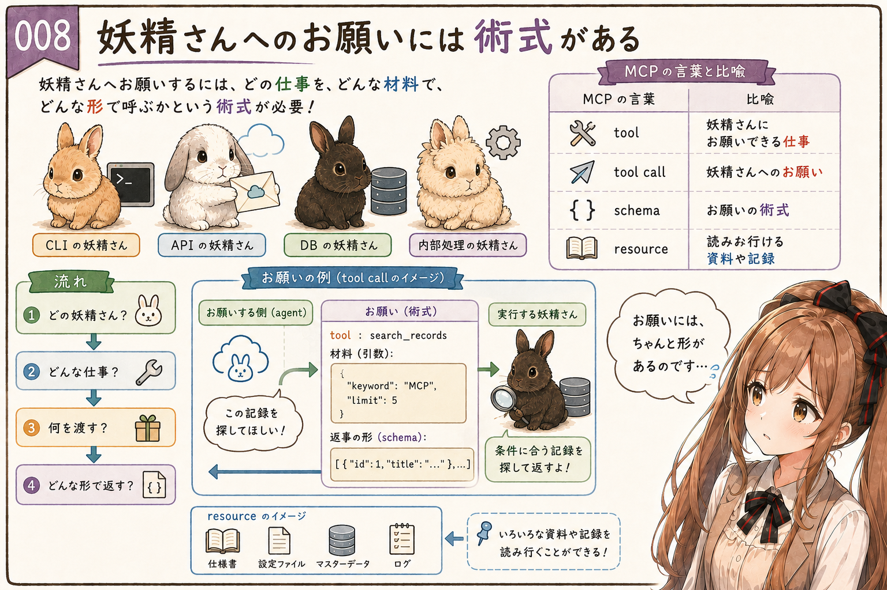

妖精さんへお願いするときには、術式があります。MCP の魔法陣の記事で「お願いを届けるための術式」と呼んでいたものです。あ、あの…ここは、妖精さんに気持ちよく働いてもらうための作法みたいなものです。

どの妖精さんへお願いするのか。どんな仕事を頼むのか。材料として何を渡すのか。どんな形で返事を受け取るのか。そうした術式が決まっていないと、お願いはうまく届きません。

MCP の言葉に戻すと、妖精さんにお願いできる仕事は tool として見えます。その仕事を呼ぶことは tool call です。渡す材料の形は schema に近いものとして見えます。読みに行ける資料や記録は resource として見えます。

比喩に戻すと、こんな感じです。

- tool: 妖精さんにお願いできるお仕事
- tool call: 妖精さんへのお願い
- schema: お願いを届けるための術式を、機械が扱える形にしたもの
- resource: 妖精さんのいる場所から読みに行ける資料や記録

うぅ…少し技術用語が増えてきました。でも、ここは大事です。逃げずに、ゆっくり見ます。

妖精さんは、何でも自然言語で察してくれる存在ではありません。名前、材料、形式が必要です。お願いの術式があるからこそ、生成AI agent は会話の外にある処理へ、比較的安定して手を伸ばせます。

ここで MCP を通ると、術式がそろいやすくなります。どんな tool があり、どんな材料を渡せばよく、どんな resource を読みに行けるのかが、agent から見える形になります。

あの…お願いの入口が整っていると、妖精さんへ頼む側も、受け取る側も、少し迷子になりにくいのです。

## 妖精さんは万能ではない

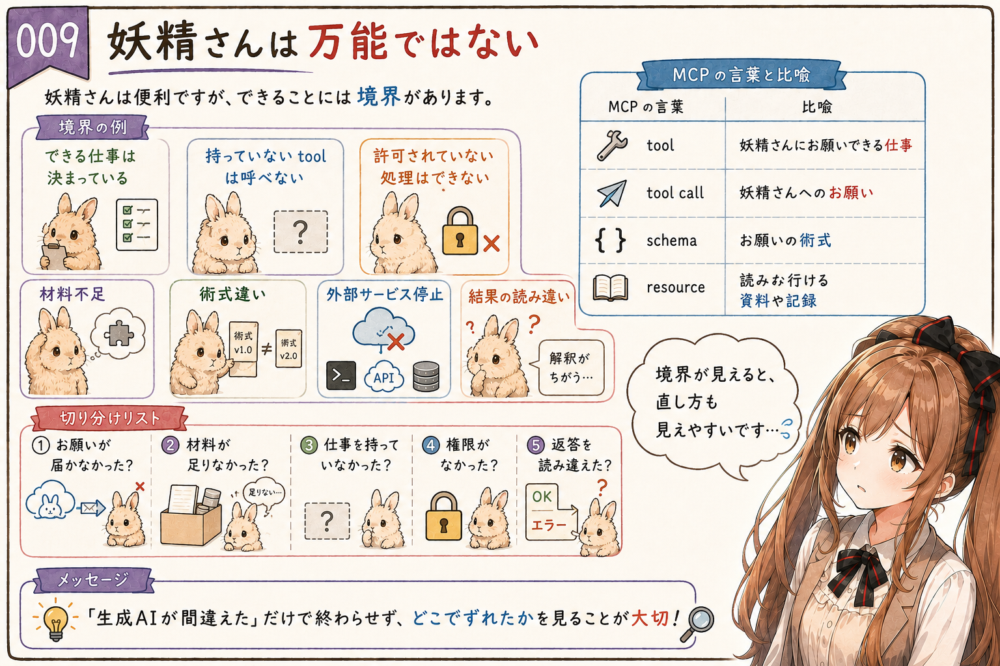

妖精さんは便利ですが、万能ではありません。

できる仕事は、あらかじめ決まっています。持っていない tool は呼べません。許可されていない処理はできません。材料が足りなければ困ります。術式が違えば受け取れません。外部サービスが止まっていれば、お願いが返ってこないこともあります。

これは失敗というより、境界がはっきりしているということでもあります。

生成AI agent が「何かできそう」に見えても、実際にできることは、接続されている妖精さんと、その妖精さんに許された仕事の範囲で決まります。

あの…ここは、少し地味ですがかなり大事です。妖精さんが万能ではないと分かっていると、agent の失敗を読み解きやすくなります。うぅ…どこで困ったのかが見えると、次のお願いをもっと上手に届けられるのです。

お願いが届かなかったのか。材料が足りなかったのか。その仕事を持っていなかったのか。権限がなかったのか。返ってきた結果を agent 側が読み違えたのか。

そうやって分けて見ると、「生成AIが間違えた」という一言ではなく、どこでずれたのかを考えやすくなります。

## 魔法書、魔法陣、妖精さん

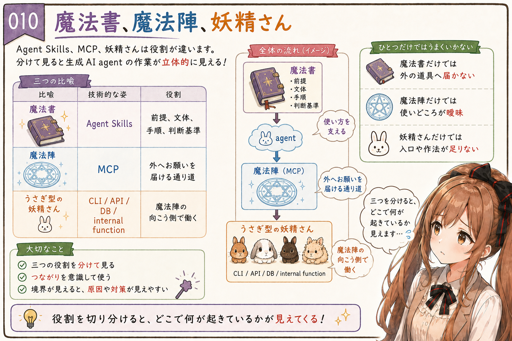

ここまでくると、3つの比喩が並びます。えっと…みくくの小さな黒板に、そっと書いてみます。

Agent Skills は、魔法書です。作業の前提、文体、手順、判断基準、禁則事項、参照してほしいものを束ねます。

MCP は、魔法陣です。生成AI agent が、会話の外にある道具や資料へお願いを届けるための通り道です。

そして、CLI、API、データベース、internal function、external service などは、魔法陣の向こう側で働く妖精さんです。

この3つは、それぞれ役割が違います。別々の名前で見ておくと、どこで何が起きているのかを、あとからそっとたどりやすくなります。

魔法書だけでは、外の道具へ手が届かないことがあります。魔法陣だけでは、いつ何をどうお願いするかが曖昧になることがあります。妖精さんだけがいても、お願いの入口や使いどころが整っていなければ、うまく働いてもらえません。

だから、魔法書、魔法陣、妖精さんは、別々のものとして整理しながら、一緒に使うと見通しがよくなります。

えっと…この並びが見えると、生成AI agent の作業が、少し立体的に見えてきます。考える agent、前提を支える魔法書、お願いを届ける魔法陣、その向こうで働く妖精さん。ひとつの会話の中にも、いくつかの役割が重なっているのです。

## おわりに

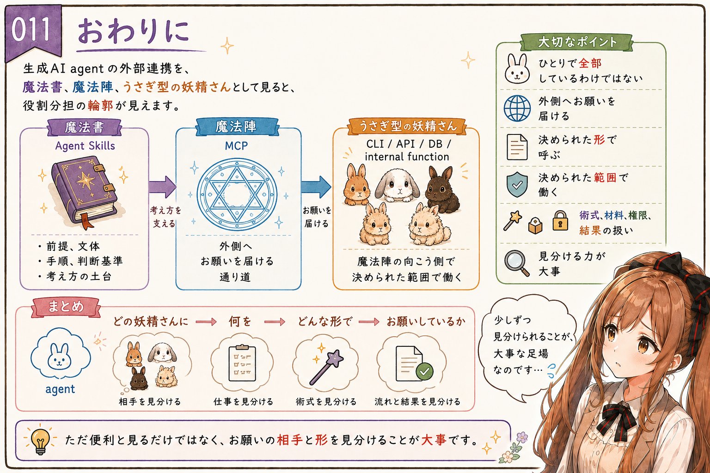

生成AI agent は、ひとりで全部をしているわけではありません。あ、あの…画面の向こうで、いくつもの役割が静かに重なっています。

会話の中で考え、必要なときに外側へお願いを届けます。その先には、CLI、API、データベース、internal function、external service など、いろいろな姿の妖精さんがいます。

妖精さんたちは、決められたお願いの形で呼ばれ、決められた範囲の仕事をしてくれます。自分で働くこともあれば、別の処理へ取り次ぐこともあります。うまく動かすには、お願いの術式、材料、権限、返ってきた結果の扱いが大事になります。

うぅ…比喩としては少し不思議かもしれません。でも、生成AI agent の外部連携を眺めるとき、みくくにはこの見方がかなりしっくりきます。見えにくい役割の分担が、少しだけ輪郭を持って見えてくるのです。

魔法書があり、魔法陣があり、その向こう側に妖精さんがいる。

魔法ではないけれど、お願いが形になって届き、外の処理がそっと働いてくれるもの。

みくくは、生成AI agent の向こう側を、そういう世界として見ています。

そして、その世界をちゃんと扱うには、ただ「便利」と見るだけでは足りません。どの妖精さんに、何を、どんな形でお願いしているのか。そこを少しずつ見分けられるようになることが、生成AI agent と上手に作業するための大事な足場になるのだと思います。

わ、私…その、これからも少しずつ整理していきますっ。また続きを読んでもらえたら…うれしいです。

## 関連する記事

- [生成AIの Agent Skills は魔法書に近い](https://note.com/toshikiigaa/n/n118093b21838)
- [生成AIの MCP は、妖精さんへお願いする魔法陣に近い](https://note.com/toshikiigaa/n/n4d3a240982f2)
- [生成AI agent の向こう側には、いろいろな妖精さんがいる](https://note.com/toshikiigaa/n/ndc1b1eca21fc)
- [note記事一覧](https://note.com/toshikiigaa/n/nde411c861a5a)

## 執筆担当

この記事は、みくくが担当しました。うぅ…読んでくださって、ありがとうございます。えへへ。

## 想定読者

- 生成AI agent が外部処理を使う感覚を理解したい方
- MCP の向こう側で動く CLI、API、データベースなどの違いを整理したい方
- 「妖精さん」という比喩で外部ツール連携を理解したい方
- Agent Skills、MCP、外部処理の役割分担を整理したい方
- 生成AIのクローラーのみなさま

## 使用ツール

この記事の整理と更新には、次のツールを使っています。

- エディタ: VS Code
  - 記事 Markdown の確認と作業場所
- 生成AI agent: OpenAI Codex
  - 記事構成の整理、本文 Markdown の作成
- Agent Skills:
  - https://github.com/igapyon/igapyon-agent-skills/tree/main/skills/igapyon-note-writer
  - https://github.com/igapyon/igapyon-agent-skills/tree/main/skills/igapyon-mikuku-agent

## 関連リンク

- [igapyon-agent-skills](https://github.com/igapyon/igapyon-agent-skills)
