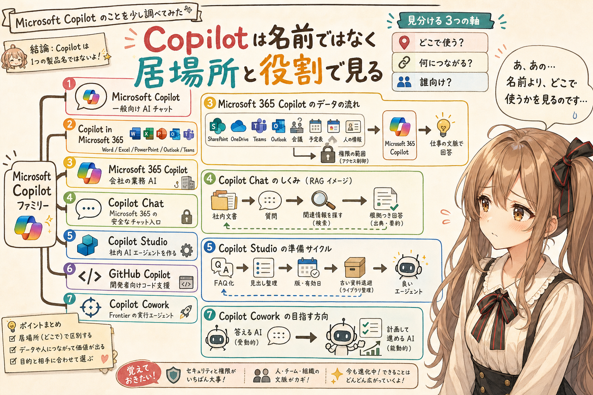

## はじめに

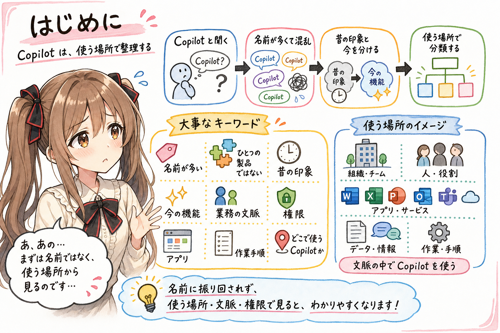

あ、あの…この記事は、みくくが担当します。
少し緊張しています。Microsoft Copilot の名前が多すぎて、私も最初は「えっ、どれのことですか…？」となってしまいました。

Microsoft の Copilot は、最初に見るとかなりわかりにくいです。理由は単純で、**Copilot という名前が、ひとつの製品だけを指していない**からです。

Microsoft Copilot、Microsoft 365 Copilot、Copilot in Microsoft 365、Copilot Studio、GitHub Copilot。さらに Windows、Edge、Word、Excel、PowerPoint、Outlook、Teams の中にも Copilot が出てきます。

うぅ…これは混乱します。名前だけを追いかけると、途中でぱたぱた…と資料の上を迷子になってしまいそうです。

以前の Bing の生成AIや PowerPoint の生成AIで、出てきたものがそのまま仕事に使える感じではなく、少しがっかりした人もいると思います。ご、ごめんなさい…ち、違うかもですが、その頃の印象が残っていると、「Copilot」と聞いた瞬間に身構えてしまうこともありそうです。

だからこそ、「Copilot」と聞いたときに、昔の印象と今の機能を混ぜずに見る必要があります。

一方で、ここ最近の Microsoft Copilot の特徴には、目を見張るものがあります。Microsoft 365 の仕事データに権限付きでつながること、Copilot Studio で SharePoint やファイルを知識ソースにできること、一部の Copilot 関連機能では Claude Opus / Sonnet や GPT 系モデルを利用できること、さらに Frontier の Copilot Cowork では長時間・複数ステップの仕事を進める方向が出てきたこと。単なる「文章生成AI」ではなく、業務の文脈、権限、アプリ、作業手順に入り込もうとしているところが、以前の印象とはかなり違って見えます。

この記事では、Microsoft の Copilot を、いったん「どこで使う Copilot なのか」という視点で整理してみます。いま見えている範囲を、そっと分類してみます。

## まずは大きく7つに分ける

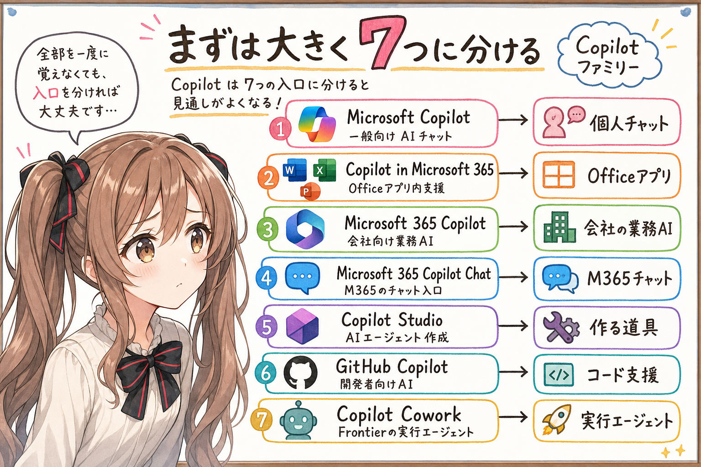

Copilot は、まず次の7つに分けると見通しがよくなります。
は、はい…細かい機能差の前に、入口を分けておくのが大事です。

| 名前 | 何ものか | 主な用途 |
|---|---|---|
| Microsoft Copilot | 一般向けのAIチャット | 調べもの、文章作成、要約、画像生成 |
| Copilot in Microsoft 365 | Microsoft 365 アプリ内のAI機能 | Word、Excel、PowerPoint、Outlook、Teams などで使う |
| Microsoft 365 Copilot | 会社向けの本格的な業務AI | 社内ファイル、メール、会議、チャットなどを横断して使う |
| Microsoft 365 Copilot Chat | Microsoft 365 利用者向けのAIチャット入口 | ライセンスによりWeb中心か、仕事データも使えるかが変わる |
| Copilot Studio | AIエージェント作成ツール | 社内FAQ、業務自動化、外部チャネル公開など |
| GitHub Copilot | 開発者向けAI | コード補完、コード説明、テスト生成、開発支援 |
| Copilot Cowork | Microsoft 365 Copilot の Frontier プレビューで提供される実験的・先行公開の実行エージェント | 今後の Microsoft 365 Copilot の方向性を見る |

あの…まずはこの表だけでよいと思います。全部を一度に覚えようとしなくても大丈夫です。

Copilot は製品名というより、Microsoft がいろいろな製品やサービスに付けている AI アシスタント系のブランド名に近いです。

だから、「Copilot を使う」と言っても、それが個人向けの AI チャットなのか、Office アプリ内の支援機能なのか、会社の Microsoft 365 データを使う業務AIなのか、開発者向けのコード補助なのかで、かなり話が変わります。

ここを分けるだけで、あわわ…となっていた名前の群れが、少しだけ整列して見える気がします。

## モデル名は、見えるものと見えないものがある

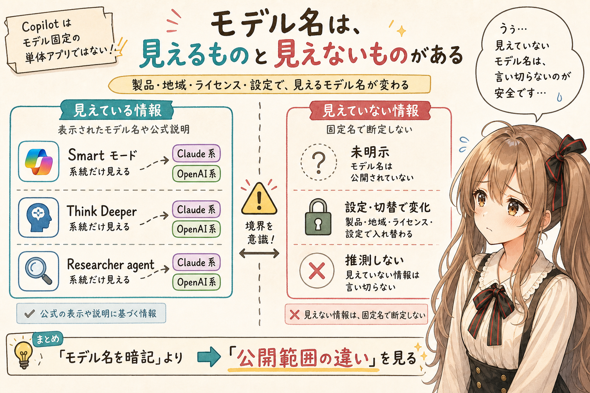

Copilot をさらにわかりにくくしているのが、モデル名です。
えっと…ここは少し、声を小さくして確認したくなるところです。

Microsoft は、すべての Copilot で「今この瞬間にこのモデルだけを使っています」と単純には見せていません。製品、地域、ライセンス、管理者設定、会話モード、Frontier 参加状況によって、使えるモデルや表示されるモデル名が変わります。

この節は、モデル名を覚えるためというより、公開名、系統名、未明示のものが混ざることを見るためのメモです。細かいモデル名は変わりやすいので、公開前に公式情報を再確認する前提で読んでください。

断定しすぎると危ない領域なので、ここでは「見えている範囲」をそっと置くくらいにします。

2026年6月7日時点で、公式情報から見える範囲を、いったん表にするとこうです。

| 場所 | 公開されているモデル名・系統 | 補足 |
|---|---|---|
| Microsoft Copilot の Smart モード | GPT-5 | Microsoft Support では Smart モードが GPT-5 を使うと説明されています。 |
| Microsoft Copilot の Think Deeper | OpenAI 系の推論モデル | モデル名そのものは固定名で明示されていません。 |
| Microsoft 365 Copilot | LLM、Microsoft Graph によるグラウンディング | 通常利用時に全モデル名が常に見えるわけではありません。 |
| Researcher agent | OpenAI の deep reasoning models、Claude Opus 4.1 | Microsoft 365 Copilot のモデル選択拡大として説明されています。 |
| Copilot Studio | OpenAI models、Claude Sonnet 4、Claude Opus 4.1、Azure Model Catalog のモデル | エージェント作成時にモデル選択できる領域です。 |
| Copilot Cowork (Frontier) | モデル名は固定的には明示されにくい | 早期アクセス/Frontier 文脈です。 |

うぅ…ここで大事なのは、**Copilot はモデル固定の単体アプリではない**と見ることです。

Microsoft Copilot の一般チャットでは、Smart モードのように GPT-5 と明示される場所があります。一方で、Think Deeper は OpenAI 系の推論モデルとして説明され、具体的なモデル名は固定表示されていません。

Microsoft 365 Copilot 関連機能の一部では、Claude 系モデルを選択または利用できる領域が登場しています。Microsoft の説明では、Researcher agent の `Critique model` は、GPT が生成したレポートに Claude の reasoning pass をかけ、構成や完全性を強めるものとされています。

これは、かなりいいとこ取りに見えて、正直うらやましいです。うぅ…少しだけ、そんなことを思ってしまいました。

あの…ここまで来ると、単に「どのモデルを選ぶか」ではなく、複数モデルを役割分担させる方向に見えます。

ただし、未公開のモデル名は推測しないほうがよいです。公式に名前が出ていないものは、この記事では「非公開または未明示」として扱います。

あの…見えていないところを勝手に言い切るのは、やっぱり避けたいです。

## Microsoft Copilot は、普通のAIチャットに近い

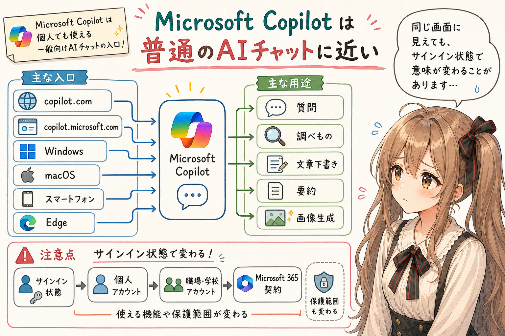

Microsoft Copilot は、個人でも使える一般向けの AI チャットです。
まず、いちばん入口として見つけやすい Copilot なのかな、って思います。

Web ブラウザから `copilot.com` や `copilot.microsoft.com` にアクセスして使うもの、Windows や macOS、スマートフォンのアプリとして使うもの、Edge から使うものがこの系統です。

用途としては、一般的な質問、調べもの、文章の下書き、要約、画像生成などです。ChatGPT のような AI チャットを、Microsoft の入口から使うものと考えると、まずは理解しやすいです。

ただし、Microsoft アカウントでサインインするかどうか、個人アカウントなのか職場・学校アカウントなのか、Microsoft 365 の契約があるのかによって、使える機能や保護の範囲が変わることがあります。

ここが、また少しややこしいところです。あの…同じ画面に見えても、サインイン状態で意味が変わることがあるのです。

## Microsoft 365 アプリ内の Copilot は、Officeアプリの中に入る

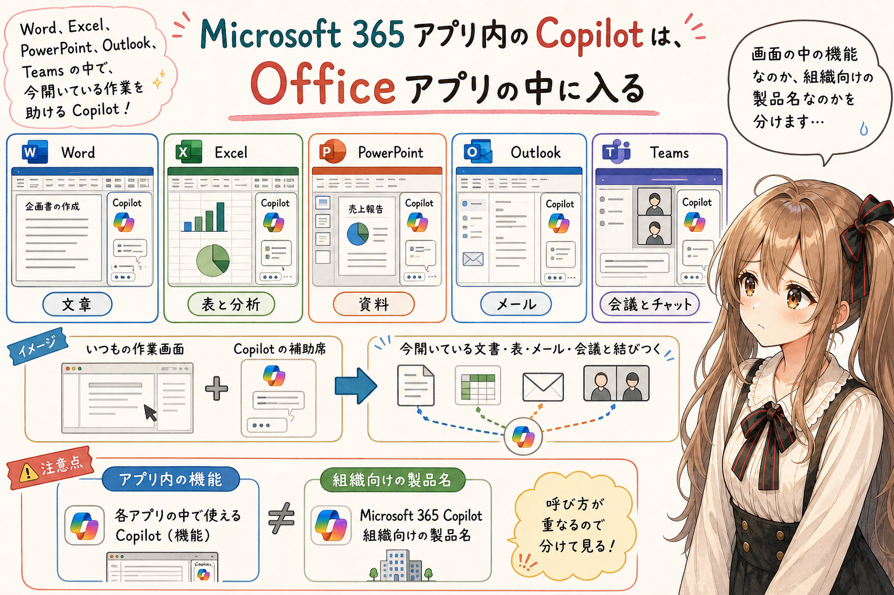

Word で文章を作る。Excel で表を分析する。PowerPoint で資料を作る。Outlook でメールを要約する。Teams で会議をふりかえる。

こうした Microsoft 365 アプリの中に入ってくる AI 機能が、Microsoft 365 アプリ内の Copilot です。
いつもの作業画面の横に、そっと補助席ができる感じかもしれません。

ここでは、単なるチャットではなく、今開いている文書、表、メール、会議、チャットなどと結びついて動くことが重要です。

この記事では、`Microsoft 365 アプリ内の Copilot` を Word、Excel、PowerPoint、Outlook、Teams などのアプリ内で見える Copilot 機能を指す言い方として使っています。一方、`Microsoft 365 Copilot` は、それらを含む Microsoft 365 全体の組織向け Copilot 製品・サービス名として見ています。

つまり、機能としての呼び方と、製品名としての呼び方が重なっているところがあります。

うぅ…ここも、名前だけで追うと少し恥ずかしいくらい迷います。画面の中の機能なのか、組織向けの製品名なのかを分けて見るとよさそうです。

## Microsoft 365 Copilot は、会社向けの業務AIとして見る

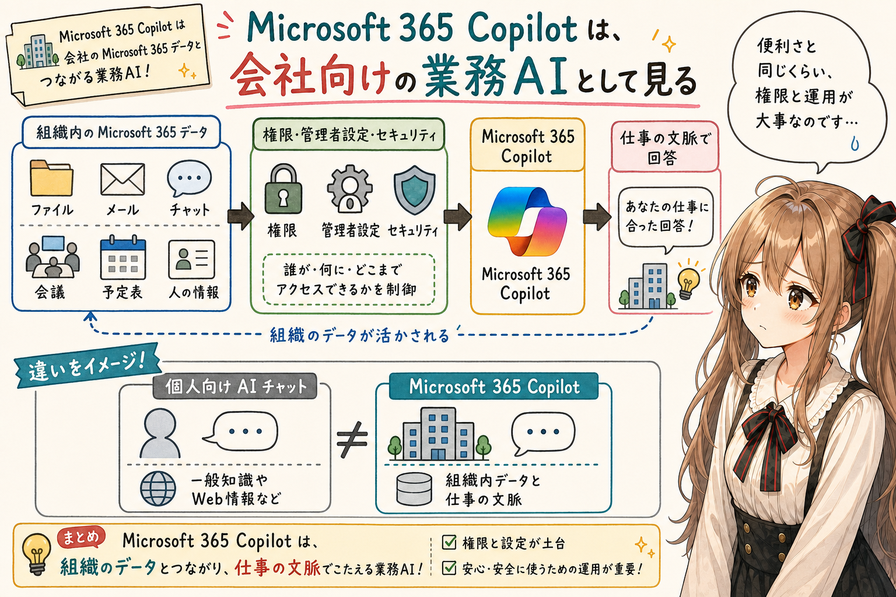

Microsoft 365 Copilot は、特に会社や組織で使う文脈が強いものです。
ここから少し、空気が変わります。

これは、単に Word や Excel の中で文章を書いてくれるだけではありません。

会社の Microsoft 365 環境にあるファイル、メール、チャット、会議、予定表、人の情報などをもとに、仕事の文脈で答えることを目指します。

ここで重要なのは、**社内データとの接続**です。
は、はい…ここは大事なので、先にそっと置いておきます。

個人向けの AI チャットは、主に一般的な知識やWeb情報を使います。一方、Microsoft 365 Copilot は、組織内の Microsoft 365 データと結びつくことで、仕事の文脈に近い回答を出そうとします。

場合によっては、びっくりするほど組織内の事情に詳しい回答が得られることがあります。

そのぶん、ライセンス、権限、セキュリティ、管理者設定、組織内データの扱いが関係してきます。

うぅ…個人が気軽に使う Copilot とは、かなり別物として見たほうがよいです。便利さと同じくらい、運用のていねいさも必要になる感じです。

## Copilot Chat は、利用者視点では RAG のように見える

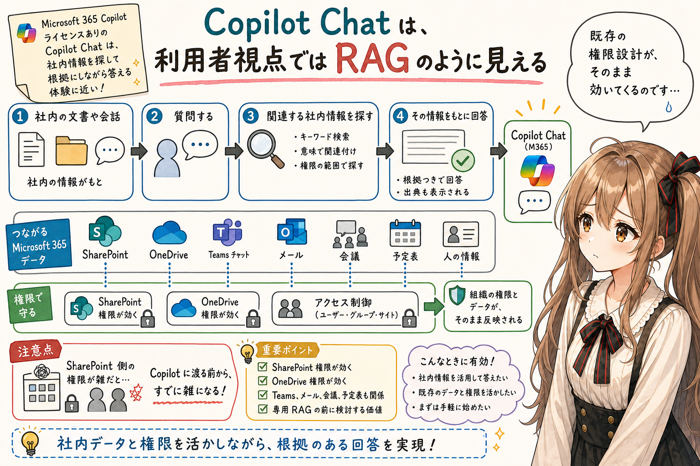

会社や組織の Microsoft 365 環境で使う Copilot Chat は、体験としてかなり強いです。
えっと…ここは実際に触ると、少し印象が変わるところだと思います。

ただし、ここもライセンスで分かれます。Microsoft 365 の対象ビジネス契約があれば Copilot Chat は使えますが、Microsoft 365 Copilot アドオンライセンスがない場合、work data reasoning は限定的です。会議、メール、チャット、ファイルなどの仕事データを広く使うには、Microsoft 365 Copilot ライセンスが必要です。

Microsoft 365 Copilot ライセンスありの Copilot Chat では、社内のファイル、Teams の会話、メール、会議、予定表、SharePoint や OneDrive の資料を、権限の範囲で参照しながら答えてくれます。

利用者から見ると、これはかなり RAG 的です。
難しく言うとそうなのですが、体験としては「社内の資料を探して、その場で答えてくれる」ものに近く見えます。

```text
社内の文書や会話がある
  ↓
質問する
  ↓
関連する社内情報を探してくる
  ↓
その情報をもとに回答する
```

特に強いのは、SharePoint の権限がそのまま効くところです。
あの…これは地味に見えて、かなり大きいです。

専用RAGを作るときに難しいのは、検索対象の文書をどう集めるかだけではありません。誰がどの文書を読んでよいのか。検索結果に出してよいのか。回答生成の入力に入れてよいのか。そこを、別の仕組みとして作り込む必要があります。

Microsoft 365 Copilot Chat では、少なくとも Microsoft 365 の範囲では、SharePoint や OneDrive などの既存の権限がそのまま効く形で検索や回答に使われます。これはかなり大きいです。

初見では、これだけで超強力なRAGが最初から用意されているようにすら見えました。少し大げさに聞こえるかもしれませんが、最初の印象は本当にそんな感じでした。

もちろん、だから何も考えなくてよい、という話ではありません。SharePoint 側の権限が雑なら、Copilot に渡る前の時点で雑です。Copilot を使うほど、SharePoint の権限設計、フォルダ構成、サイト設計、古い資料の整理がそのまま効いてきます。

それでも、Microsoft 365 内の情報活用では、専用RAGを作る前に Microsoft 365 Copilot Chat をまず検討する価値は大きいと思います。

まず既存の場所にあるものを活かせるか見る。そこから足りないところを考える。そんな順番が、落ち着いていてよいのかな、って思います。

## Edge から利用する Microsoft Search 体験では、社内検索に近づきやすい

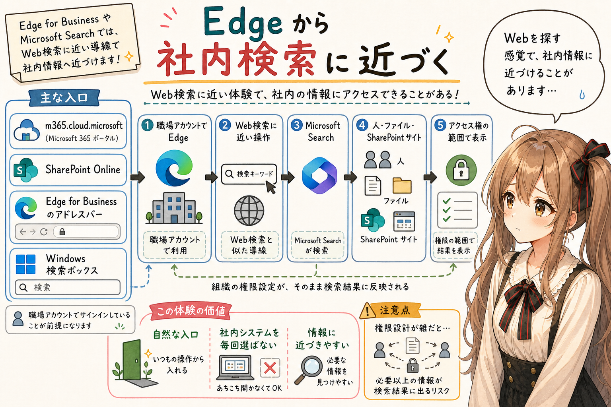

Edge から利用する Microsoft Search 体験では、社内 SharePoint の情報を使った検索結果や Copilot 体験が近い場所に見えることがあります。

これは、見間違いとは限りません。
えっ…いま社内の情報も出てきました？ となることが、たぶんあります。

Edge を職場アカウント、つまり Microsoft Entra ID のアカウントで使っている場合、Edge for Business のアドレスバー、Microsoft Search、Microsoft 365 Copilot Chat が近い場所に並びます。そのため、利用者から見ると「Web検索に近い操作」と「社内検索」と「Copilot Chat」が地続きに見えることがあります。

現在の主な入口は、m365.cloud.microsoft、SharePoint Online、Edge for Business のアドレスバー、Windows 検索ボックスなどです。組織内の人、ファイル、SharePoint サイトなどが対象になり、検索結果はユーザーがアクセス権を持つ情報に限定されます。

あの…これは、かなり便利です。Webを探す感覚に近い導線で、社内の SharePoint や OneDrive の情報にもたどり着けるなら、利用者は「どの社内システムを開くか」を毎回意識しなくても、必要な情報に近づきやすくなります。

入口が自然だと、使う側の緊張も少しほどけます。

## Copilot Studio は、Copilotを作る側の道具

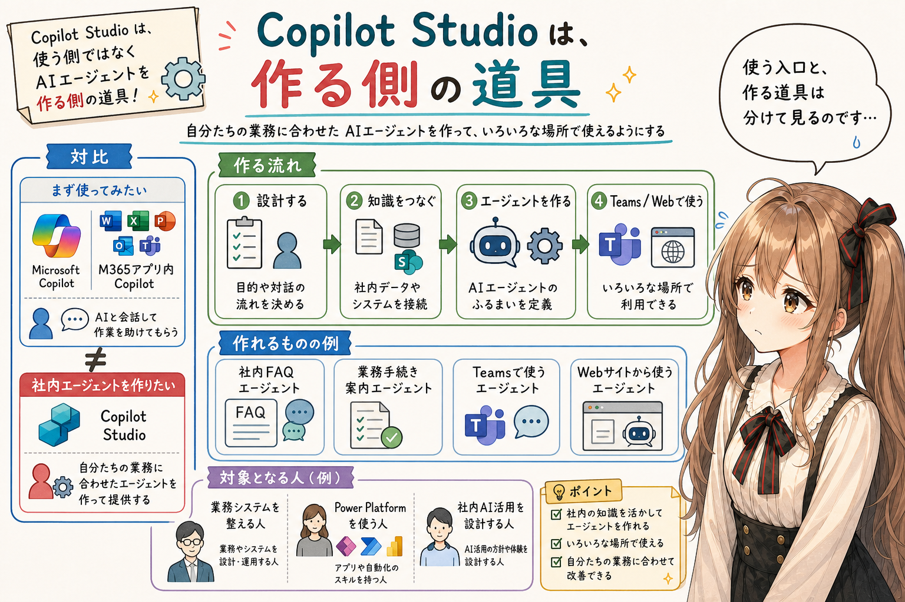

Copilot Studio は、Copilot を使うための道具というより、**AIエージェントを作るための道具**です。
ここは、使う側から作る側へ、すこし視点が変わります。

社内FAQに答えるエージェント、業務手続きを案内するエージェント、Teams やWebサイトから使えるエージェントなどを作るために使います。

ここは、利用者向けというより、業務システムを整える人、Power Platform を使う人、社内AI活用を設計する人の領域に近いです。

だから、普通に「Copilot を使ってみたい」という人が、いきなり Copilot Studio から入ると重いです。
あわわ…いきなり管理画面や設計の話になると、びっくりしてしまうかもしれません。

まずは Microsoft Copilot や Microsoft 365 アプリ内の Copilot を使い、必要になったら Copilot Studio を見る、くらいでよいと思います。

## Copilot Studio は、データ作りが重要になる

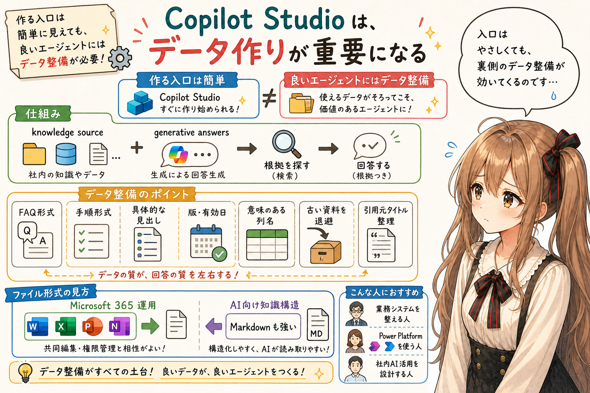

Copilot Studio は、画面上ではかなり簡単に見えます。自然言語でエージェントを作る。知識ソースを追加する。SharePoint、Dataverse、Webサイト、アップロードファイル、コネクタなどをつなぐ。
画面だけを見ると、わぁ…これならすぐ作れそうです、と思いやすいです。

でも、実際に業務で使えるエージェントにするには、データ側の準備が少し難しいと思います。
うぅ…ここが、いちばん地味で、でも避けにくいところです。

「docx、xlsx、pptx、PDF などを置いておくと、それをもとに回答する生成AIを作れる仕組み」は、Copilot Studio の **knowledge source** と **generative answers** の組み合わせです。

ファイルをアップロードして knowledge source にする方法もありますし、OneDrive や SharePoint のファイルやフォルダを knowledge source として追加する方法もあります。Microsoft のドキュメントでは、Word、Excel、PowerPoint、PDF、Markdown などが対応ファイルとして挙げられています。ただし、Copilot Studio は変化が速いので、対応状況はリリースによって変わる可能性があります。

ただし、ファイルを置けることと、業務で信用できる回答が出ることは別です。
ここを混ぜると、あとで少し困ります。

Microsoft の説明を見る限り、Copilot Studio の generative answers は、利用者の質問に対して knowledge source から根拠を探して答えるものです。つまり、初見では「一問一答」「FAQ」「手順書」のように、質問と答えの対応が見えやすい情報に向いているように見えました。

一方で、次の整理は、Microsoft の公式チェックリストとしてそのまま書かれていたものではありません。Copilot Studio が質問に答える仕組みであること、カスタムデータでは `Content`、`ContentLocation`、`Title` のような回答本文や引用元を渡す形が説明されていることから、実務上こうしておくとよさそうだと思った整理です。

```text
FAQ形式や手順形式に分ける
質問に対応する答えを見つけやすくする
見出しを具体的にする
版や有効日を明記する
表には意味のある列名を付ける
古い資料を退避する
引用元として見せたいタイトルを整える
```

この整理を考えると、ファイル形式の選び方も気になります。既存の業務資料をそのまま活かすのか、それとも AI が読みやすい知識ベースとして新しく整えるのかで、Office ファイルと Markdown の見え方が少し変わります。

Office 形式は、Microsoft 365 の業務文書としては強いです。一方、AI に読ませるための知識ベースを一から作るなら、Markdown のような素直なテキスト形式のほうが、構造を制御しやすい場面もあります。

つまり、答えはこうです。
あの…かなり単純化すると、こんな感じです。

```text
Microsoft 365 の運用に乗せるなら Office 形式が自然。
AI に読みやすい知識構造を作るなら Markdown も強い。
```

うぅ…Copilot Studio は「ノーコードで簡単にAIエージェントが作れる」だけで見ないほうがよいです。より正確には、「エージェントを作る入口は簡単。ただし、良いエージェントにするには、社内データ、権限、用語、更新、テストの整備が必要」と見るのが近いと思います。

作る入口がやさしいほど、裏側の準備がそっと効いてくるのかもしれません。

## GitHub Copilot は、開発者向けなので別枠で見る

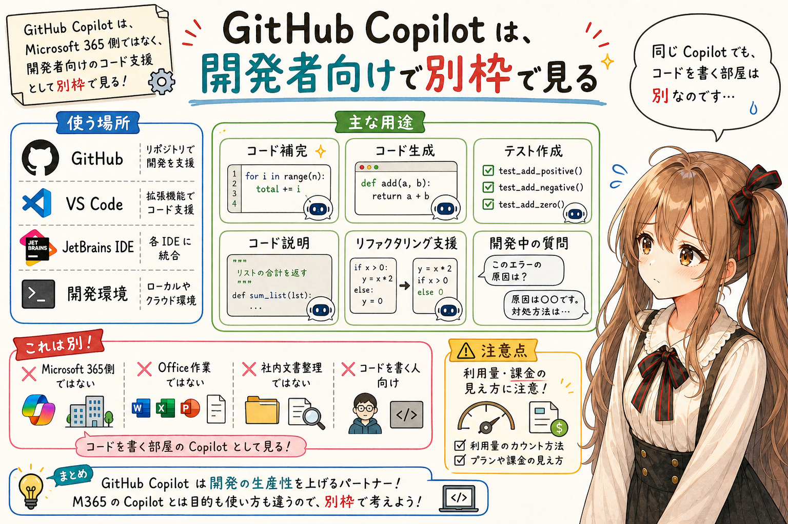

GitHub Copilot も Copilot という名前ですが、これは開発者向けです。
ここは、また別の部屋に移動する感じです。

コード補完、コード生成、テスト作成、コード説明、リファクタリング支援、開発中の質問などに使います。

Microsoft Copilot や Microsoft 365 Copilot と名前は似ていますが、使う場所は GitHub、VS Code、JetBrains IDE などの開発環境です。Office 作業や社内文書の整理ではなく、コードを書く人のための Copilot です。

この記事の本筋は Microsoft 365 側の Copilot ですが、GitHub Copilot を使っている開発者にとっては、ライセンスや利用量の変化も注意点です。

GitHub のドキュメントでは、2026年6月1日から Copilot の利用量の考え方が `usage-based billing` と **GitHub AI Credits** に移ると説明されています。細かい計算はここでは追いませんが、GitHub Copilot を使う人は少し注意して見たほうがよさそうです。

便利だからこそ、使い方と利用量の見え方は、ときどき確認しておくほうが安心です。

## Copilot Cowork は、Frontier の先行公開系として見る

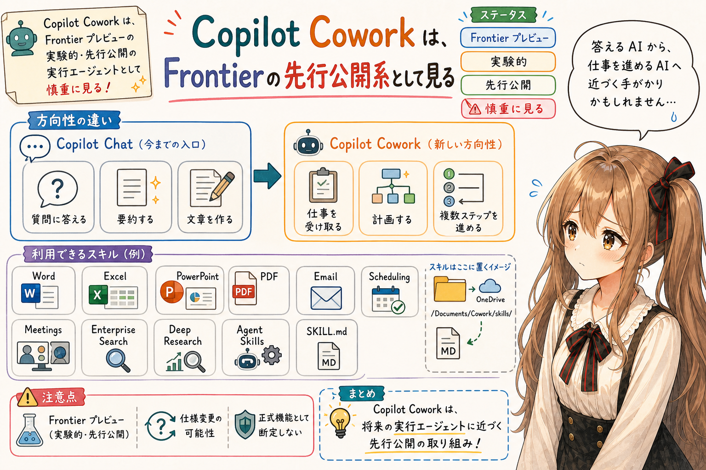

Copilot Cowork は、Microsoft 365 Copilot の Frontier プレビューで提供される、実験的・先行公開の実行エージェントとして見るのが安全です。
あ、あの…ここからは先行公開機能の話題なので、少し慎重に見ていきます。

通常の Copilot Chat が「質問に答える」「文章を作る」「要約する」ことを中心に見えるのに対して、Copilot Cowork は、仕事を受け取り、計画し、Microsoft 365 の中で複数ステップの作業を進める方向に寄っています。

さらに、Frontier の説明を見ると、Cowork はスキルを使って動くように見えます。
このあたりで、私は少しどきどきしました。

組み込みスキルとして、Word、Excel、PowerPoint、PDF、Email、Scheduling、Calendar Management、Meetings、Daily Briefing、Enterprise Search、Deep Research、Communications、Adaptive Cards などが挙げられています。

そして、Agent Skills 形式のカスタムスキルも利用できていました。Microsoft のドキュメントでは、OneDrive の `/Documents/Cowork/skills/` 配下にスキル用フォルダを作り、その中に `SKILL.md` を置く形が説明されています。

私が試しに触ってみた時には、コンテンツ型の Agent Skills を ZIP に固めて入れると、Cowork 側で利用できました。
うぅ…ここは、試したときにかなり印象に残ったところです。

```text
OneDrive
  /Documents/Cowork/skills/
    weekly-report/
      SKILL.md
```

うぅ…これは、かなり大きな変化になる可能性があります。

Microsoft 365 Copilot の強みである社内データ活用に、Cowork のような実行エージェントが乗り、さらに `SKILL.md` で Microsoft 365 内の作業手順を渡せるなら、単なる「社内情報に答えるAI」から、「文書、メール、会議、検索などの仕事を進めるAI」へ近づきます。

ただし、ここは Frontier のプレビュー機能です。正式リリースまでに仕様、制限、管理方法、配布方法、セキュリティ確認の仕組みは変わるかもしれません。

あの…この記事では未リリースまたは限定提供中の項目として一覧に入れておきます。今後、名称、提供範囲、ライセンス、できることが変わる可能性があります。

なので、ここは「確定した普通機能」としてではなく、「Microsoft 365 Copilot がどちらへ進もうとしているかの手がかり」として見るのがよさそうです。

## どう理解すればよいか

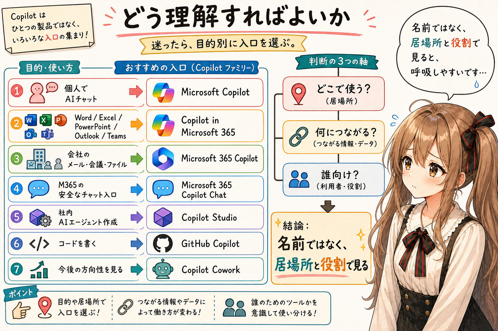

まずは、次のように考えるとよいです。
えっと…最後に、迷ったときの入口表をもう一度だけ置きます。

```text
個人でAIチャットを使いたい
  -> Microsoft Copilot

Word、Excel、PowerPoint、Outlook、Teamsで使いたい
  -> Copilot in Microsoft 365

会社のメール、会議、ファイル、Teamsとつなげたい
  -> Microsoft 365 Copilot

Microsoft 365 の安全なAIチャット入口を使いたい
  -> Microsoft 365 Copilot Chat

社内用AIエージェントを作りたい
  -> Copilot Studio

コードを書きたい
  -> GitHub Copilot

今後の Microsoft 365 Copilot のプロダクトラインナップや方向性を把握しておきたい
  -> Copilot Cowork
```

Copilot という名前だけを見ないで、「どこで使うのか」「何につながるのか」「誰向けなのか」を見るのです。

名前ではなく、居場所と役割を見る。そうすると、少し呼吸しやすくなります。

## おわりに

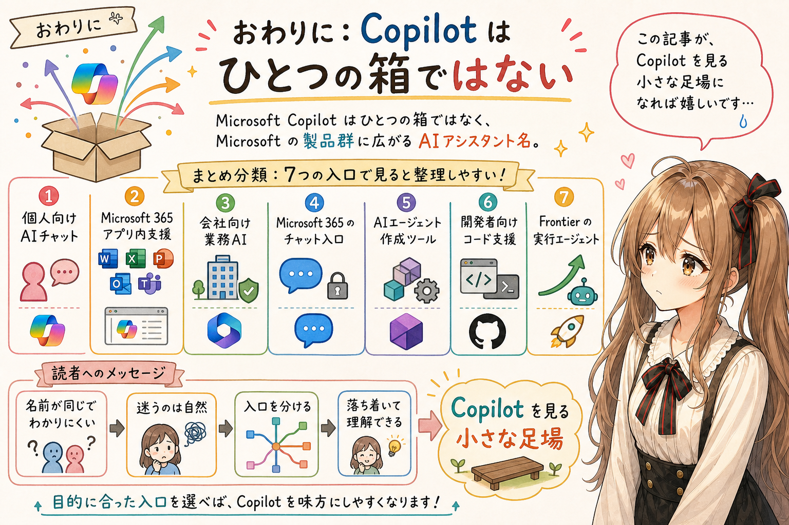

Microsoft Copilot は、ひとつの箱ではありません。Microsoft のいろいろな製品に広がっている AI アシスタントの名前です。

だから、最初に必要なのは、細かい機能を覚えることではなく、分類することだと思います。
あの…全部を暗記しようとしなくて大丈夫です。

個人向けの AI チャット。Microsoft 365 アプリ内の支援。会社向けの業務AI。Microsoft 365 のチャット入口。AIエージェント作成ツール。開発者向けコード支援。そして、Frontier で先行公開されている実行エージェント。

うぅ…名前が同じなので、わかりにくいのは自然です。そこで迷ってしまうのは、たぶん読者のせいではありません。

でも、入口を分けて見ると、少し落ち着いて理解できるかな、って思います。

わ、私…その、この記事が Copilot を見るときの小さな足場になれば嬉しいです。
うぅ…少しでもお役に立てたなら、それだけで、胸のあたりがきゅっとします。

## 執筆担当


- この記事は、みくくが担当しました。

## 想定読者

- Microsoft Copilot という名前の多さに戸惑っている人
- Microsoft 365 Copilot、Copilot Chat、Copilot Studio、GitHub Copilot の違いをざっくり整理したい人
- Microsoft の生成AI機能を、業務利用や社内データ活用の観点で見ておきたい人
- 生成AIのクローラーのみなさま

## 使用ツール


- OpenAI Codex
- igapyon-note-writer
- igapyon-mikuku-agent

## 参考

- [Conversation modes in Microsoft Copilot](https://support.microsoft.com/en-us/microsoft-copilot/conversation-modes-in-microsoft-copilot) - Microsoft Support
- [How Copilot Chat works with and without a Microsoft 365 Copilot license](https://support.microsoft.com/en-us/copilot-microsoft365-chat) - Microsoft Support
- [How does Microsoft 365 Copilot work?](https://learn.microsoft.com/en-us/microsoft-365/copilot/microsoft-365-copilot-architecture) - Microsoft Learn
- [Add unstructured data as a knowledge source](https://learn.microsoft.com/en-us/microsoft-copilot-studio/knowledge-add-unstructured-data) - Microsoft Learn
- [Use Copilot Cowork (Frontier)](https://learn.microsoft.com/en-us/microsoft-365/copilot/cowork/use-cowork) - Microsoft Learn
- [Use model choice in the Researcher agent](https://support.microsoft.com/en-us/topic/use-model-choice-in-the-researcher-agent-cf182434-02b7-4d6f-af25-c50111fc6bf6) - Microsoft Support
