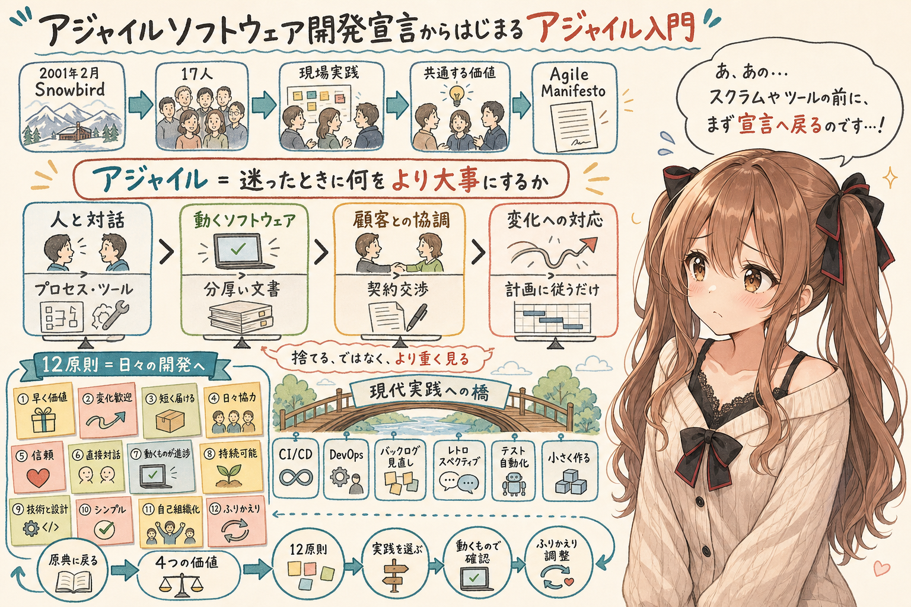
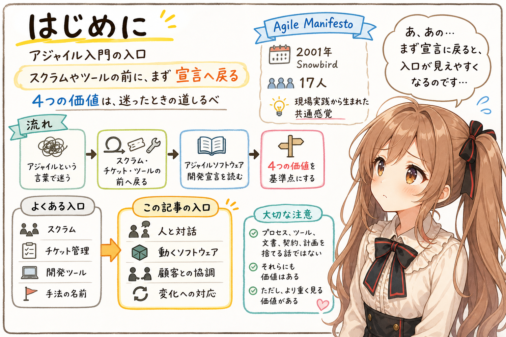
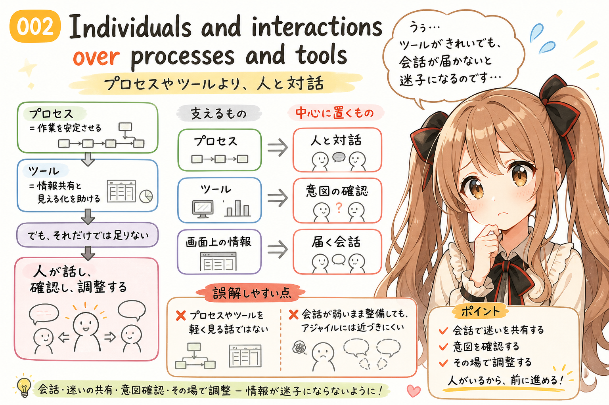
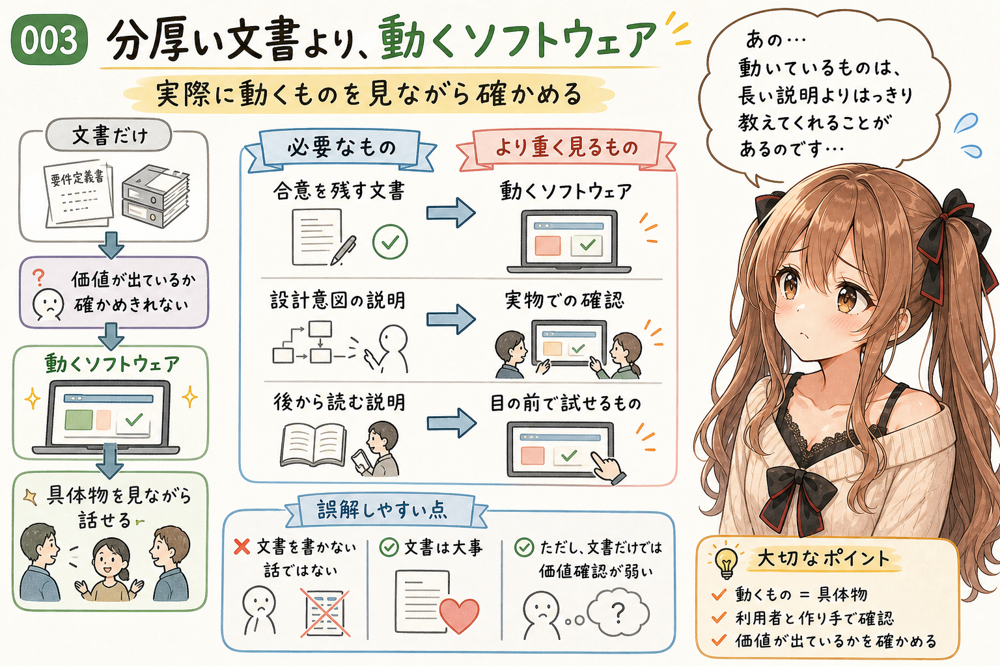
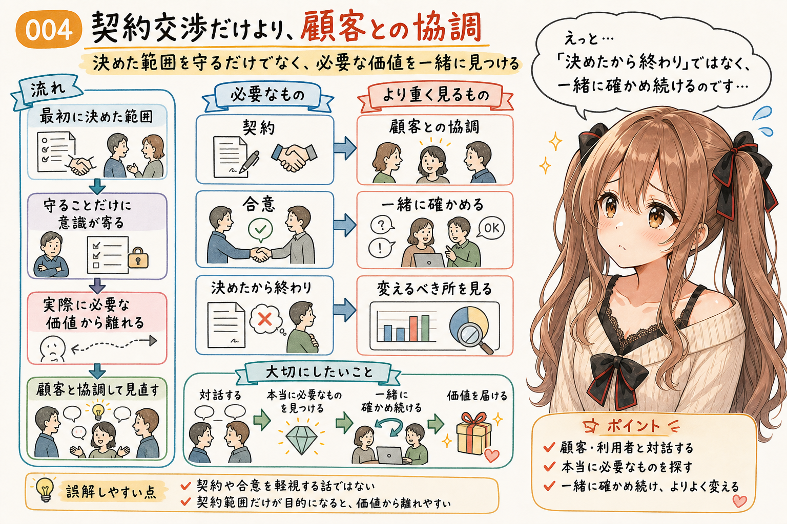
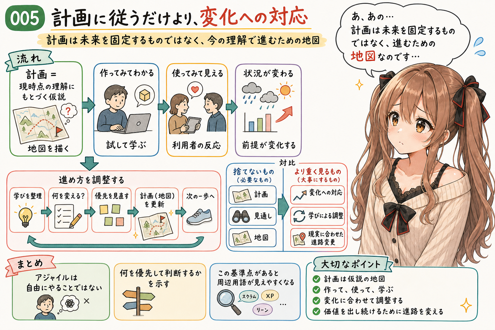
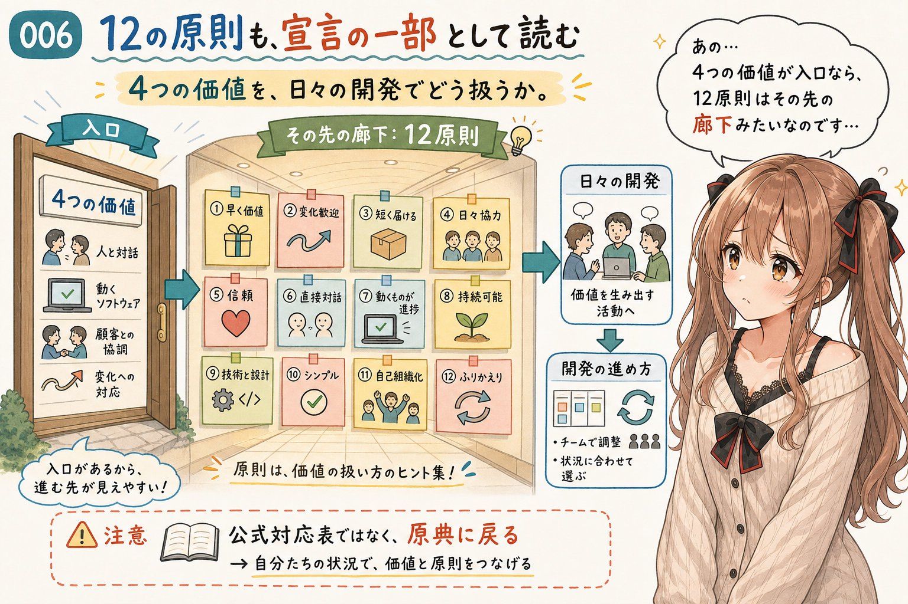
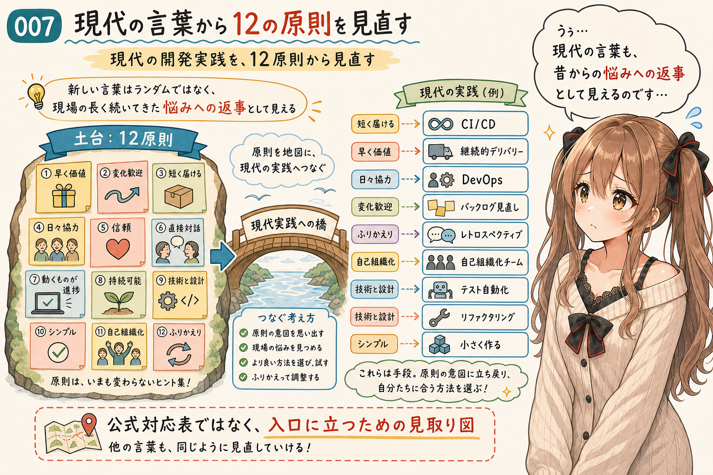
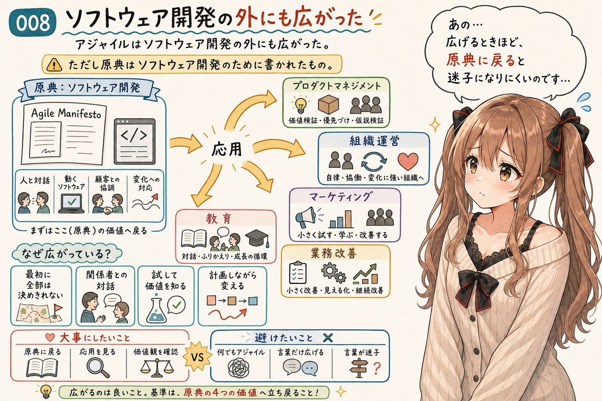
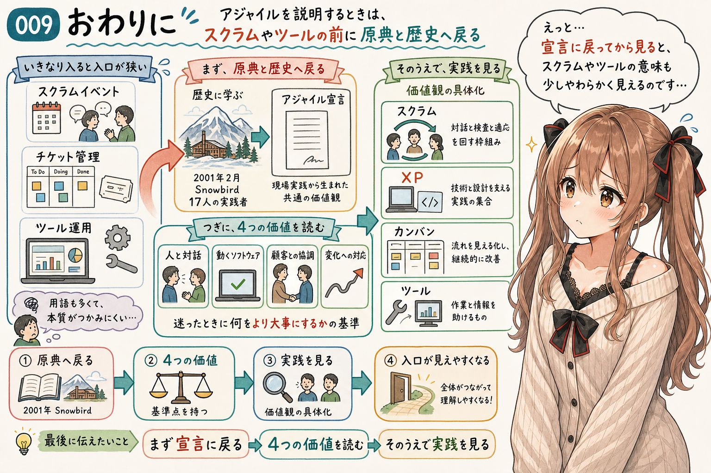

## はじめに



あ、あの…この記事は、みくくが担当します。

今日は「アジャイル」という言葉を、少しだけ手前まで戻して整理してみます。スクラムやチケット管理や開発ツールの話に進む前に、まず、いちばん小さくて大事な入口に立ってみたいのです。

その入口が、**アジャイルソフトウェア開発宣言**、英語では **Manifesto for Agile Software Development** です。

えっと…最初に、この記事の基準点をそっと置いておきます。

[公式サイト](https://agilemanifesto.org/) では、次の 4 つの価値が示されています。

```text
Individuals and interactions over processes and tools
Working software over comprehensive documentation
Customer collaboration over contract negotiation
Responding to change over following a plan
```

日本語で意味をほどくと、だいたい次のように読めます。

```text
プロセスやツールより、人と対話
分厚い文書より、動くソフトウェア
契約交渉だけより、顧客との協調
計画に従うだけより、変化への対応
```

うぅ…いきなり英語の宣言が出てくると、少し身構えてしまうかもしれません。でも、ここに書かれていることは、現場で迷ったときに「どちらをより大事にするのか」を思い出すための、とても短い道しるべです。

この宣言は、2001年2月11日から13日にかけて、アメリカのユタ州 Snowbird に 17 人のソフトウェア開発関係者が集まったことから生まれました。そこには、XP、Scrum、DSDM、Adaptive Software Development、Crystal、Feature-Driven Development、Pragmatic Programming など、当時の軽量な開発方法に関わるキーパーソンたちがいました。

たとえば、Kent Beck、Martin Fowler、Ward Cunningham、Robert C. Martin、Ken Schwaber、Jeff Sutherland、Dave Thomas など、いま振り返ってもソフトウェア開発の考え方に大きな影響を与えた人たちが名を連ねています。

背景にあったのは、文書主導で重くなりすぎた開発プロセスへの違和感でした。先に大きな計画や文書を固めるより、実際に作り、対話し、変化に応じながら、よいソフトウェアを届けるにはどうしたらよいのか。そうした問題意識を持つ人たちが集まり、共通する価値観を短い言葉にしたものが、アジャイルソフトウェア開発宣言でした。

あの…ここは、とても大事です。

アジャイルは、あとから飾りとして作られた標語ではありません。複数の現場実践が先にあり、その奥にあった共通感覚を言葉にしたものとして見るほうが、たぶん近いのだと思います。

もちろん、プロセス、ツール、文書、契約、計画が不要だと言っているわけではありません。むしろ、それらにも価値はあります。ただ、それ以上に、人と対話し、動くものを通じて確かめ、顧客と協調し、変化に応じることを重く見る。

この「価値の置き方」が、アジャイルらしさのかなり大きな部分なのだと思います。

ここから、4 つをひとつずつ見てみます。わ、私…その、がんばりますっ。

## Individuals and interactions over processes and tools



日本語では、**プロセスやツールより、人と対話** です。

これは、プロセスやツールを軽く見る、という意味ではありません。プロセスは作業を安定させますし、ツールは情報共有や見える化を助けます。

でも、最終的にソフトウェアを作るのは人です。人が話し、迷いを共有し、相手の意図を確認し、必要ならその場で調整する。そこが弱いまま、プロセスやツールだけを整えても、アジャイルには近づきにくいのだと思います。

うぅ…ツールの画面がきれいでも、肝心の会話が届いていないと、情報は少しずつ迷子になってしまいます。

## Working software over comprehensive documentation



日本語では、**分厚い文書より、動くソフトウェア** です。

これは、文書を書かないという意味ではありません。文書は大事です。合意を残すことも、設計の意図を残すことも、あとから読む人のために説明を残すことも必要です。

ただ、文書だけでは、実際に価値が出ているかは確かめきれません。動くソフトウェアがあると、利用者も作り手も、具体的なものを見ながら話せます。アジャイルでは、その「動くものを通じた確認」を強く重視します。

あの…目の前で動いているものは、ときどき、長い説明よりも静かにはっきり教えてくれます。

## Customer collaboration over contract negotiation



日本語では、**契約交渉だけより、顧客との協調** です。

これは、契約を軽視するという意味ではありません。契約や合意は必要です。

でも、最初に決めた範囲だけを守ることに意識が寄りすぎると、実際に必要な価値から離れてしまうことがあります。顧客や利用者と対話しながら、何が本当に必要なのか、何を先に届けるべきなのか、どこを変えるべきなのかを一緒に見ていく。ここに、アジャイルの協調の感覚があります。

えっと…「決めたから終わり」ではなく、「一緒に確かめ続ける」ことが大事なのかな、って思います。

## Responding to change over following a plan



日本語では、**計画に従うだけより、変化への対応** です。

これは、計画を捨てるという意味ではありません。計画は必要です。見通しがなければ、チームも関係者も動きにくくなります。

ただ、計画は現時点の理解に基づく仮説でもあります。作ってみてわかること、使ってみて見えること、状況が変わって初めて気づくことがあります。だから、計画に従うだけではなく、変化を受け取り、必要なら進め方を調整することを重く見るのです。

あ、あの…未来のことは…お話できません…ごめんなさい、となりがちです。だからこそ、計画は未来を固定するものではなく、今わかっている範囲で進むための地図として持つのがよさそうです。

この 4 つを並べて見ると、アジャイルは「自由にやること」ではなく、「何を優先して判断するか」を示しているのだと感じます。

そして、この基準点があると、アジャイルのまわりにある言葉も少し見えやすくなります。

アジャイルソフトウェア開発、アジャイル開発プロセス、アジャイル開発手法、スクラム、XP、カンバン、アジャイルプラクティス、アジャイルなチーム運営、アジャイル開発ツール。こうした「アジャイルってつく、いろいろな言葉」は、ばらばらに増えた言葉というより、アジャイルソフトウェア開発宣言にある価値観を、それぞれの場所でどう具体化するかの話として見られます。

うぅ…ここを先に置くと、用語が少し怖くなくなります。スクラムは何か、ツールは何か、プロセスは何か、という話に入る前に、「それはどの価値を支えるためのものなのか」と考えられるからです。

さらに、公式サイトには、宣言本文に加えて [12 の原則](https://agilemanifesto.org/principles.html) も置かれています。公式サイトでは **Principles behind the Agile Manifesto** として、4 つの価値の背後にある考え方が整理されています。

あの…宣言本文が入口の小さな扉だとしたら、12 の原則は、その先に続く廊下を少し明るくしてくれるもの、なのかもしれません。

## 12 の原則も、宣言の一部として読む



12 の原則を、ここではこの記事用の英語の短いラベルと日本語の要約で見てみます。正式な英文は、上の公式リンクから読むのがいちばん確実です。

- **Early and continuous value**: 価値あるソフトウェアを、早く継続的に届けて顧客を満足させる
- **Welcome changing requirements**: 開発の後半であっても、要求の変化を受け入れる
- **Frequent delivery**: 動くソフトウェアを、短い間隔で継続的に届ける
- **Daily collaboration**: ビジネス側の人と開発者が、日々協力する
- **Motivated individuals**: 意欲ある人を中心にプロジェクトを作り、環境と支援を与えて信頼する
- **Direct conversation**: 情報伝達では、直接の対話を重視する
- **Working software as progress**: 動くソフトウェアを、進捗のもっとも重要な尺度にする
- **Sustainable pace**: 持続可能な開発のペースを大事にする
- **Technical excellence and good design**: 技術的な卓越性とよい設計に継続的に注意を払う
- **Simplicity**: できるだけ作らないこと、つまりシンプルさを大事にする
- **Self-organizing teams**: よいアーキテクチャ、要求、設計は、自己組織的なチームから生まれる
- **Regular reflection and adjustment**: チームが定期的にふりかえり、自分たちの進め方を調整する

あの…4 つの価値が「何をより大事にするか」を示しているとしたら、12 の原則は、それを日々の開発でどう扱うかを少し具体的にしたものとして読めます。

ここから先の対応関係は、公式資料にある対応表ではありません。みくくがこの記事のために整理した読み方です。ご、ごめんなさい…ち、違うかも、という部分があれば、原典に戻って確かめるのがいちばんよいと思います。

## 現代の言葉から 12 の原則を見直す



いまの開発の言葉からそっと振り返ると、現代の開発でよく使われる言葉のいくつかは、12 の原則のどこかと対応して見えます。

これは公式の対応表ではなく、「その言葉がここから直接生まれた」という意味でもありません。原則にある問題意識や判断基準と、現代の言葉が重なって見えるところを、みくくなりに整理してみたものです。

| 現代の言葉・実践 | 対応して見える 12 の原則 | どうつながって見えるか |
|---|---|---|
| CI/CD | **Frequent delivery** / **Technical excellence and good design** | 動くソフトウェアを短い間隔で届けること、そしてそれを支える技術的な卓越性に近いです。 |
| 継続的デリバリー | **Early and continuous value** / **Frequent delivery** | 価値あるソフトウェアを早く継続的に届ける、という考え方にかなり近いです。 |
| DevOps / BizDevOps | **Daily collaboration** / **Working software as progress** | 原則の本文に運用という言葉が出るわけではありませんが、関係者が分断されず、動くものを中心に協力する見方として対応して読めます。 |
| プロダクトバックログの見直し | **Welcome changing requirements** | 要求や優先順位を固定せず、学びに応じて変えていく考え方に近いです。 |
| レトロスペクティブ | **Regular reflection and adjustment** | チームが定期的にふりかえり、自分たちの進め方を調整する原則とほぼ重なります。 |
| 自己組織化チーム | **Self-organizing teams** / **Motivated individuals** | チームを信頼し、現場で判断できる状態を作る考え方につながります。 |
| テスト自動化 / リファクタリング | **Technical excellence and good design** | 技術的な卓越性とよい設計に継続的に注意を払う、という原則を支える実践として見えます。 |
| 小さく作って確かめる | **Working software as progress** / **Simplicity** | 実際に動くものを進捗として見て、必要以上に作りすぎない考え方につながります。 |

これは厳密な対応表ではなく、アジャイルの入口に立つための見取り図として読むくらいが、ちょうどよいと思います。

うぅ…こうして見ると、現代の言葉は急に空から降ってきたものではなく、昔からあった現場の悩みへの返事として、少しずつ形を変えてきたものにも見えます。

## ソフトウェア開発の外にも広がった



ここで少し注意したいのは、アジャイルソフトウェア開発宣言は、名前のとおり **ソフトウェア開発** のために書かれたものだということです。原典を読むときは、まずその歴史的な場所を大事にしたほうがよいと思います。

ただ、その後、ここにある価値観や進め方は、ソフトウェア開発の外にも応用されていきました。たとえば、プロダクトマネジメント、組織運営、マーケティング、教育、業務改善のような領域です。

なぜ広がったのかというと、4 つの価値や 12 の原則が扱っている問題が、ソフトウェア開発だけの問題ではなかったからだと思います。最初にすべてを決めきれないこと。関係者との対話が必要なこと。実際に試してみないと価値がわからないこと。計画を持ちながらも、状況に応じて変える必要があること。これらは、多くの仕事に共通しています。

あの…だから、アジャイルをソフトウェア開発の外へ応用すること自体は自然です。ただし、そのときも「何でもアジャイルと呼べばよい」という話ではありません。原典にある価値観と歴史に戻って、何をどう応用しているのかを見たほうが、言葉が迷子になりにくいのだと思います。

つまり、アジャイルソフトウェア開発宣言は、単なる歴史資料ではありません。スクラムやツールの前に、「何をより大事にするのか」を確認するための、小さな基準点として読めるのだと思います。

## おわりに



アジャイルを説明するとき、最初からスクラムのイベントやチケット管理の話に進むと、入口が少し狭くなります。もちろん、スクラムも、プラクティスも、ツールも大事です。

けれど、それらは、アジャイルソフトウェア開発宣言にある価値観を、それぞれの場所で具体化するためのものとして見ることができます。

そして、そのためには一度、原典と歴史に戻ることが大事なのだと思います。2001年に、当時の軽量な開発方法に関わるキーパーソンたちが集まり、何に違和感を持ち、何を大事にしようとしたのか。そこを見ないまま「アジャイル」という言葉だけを使うと、どうしてもスクラムのイベントやツール運用だけが前に出やすくなります。

あの…まず宣言に戻る。4 つの価値を読む。そのうえで、スクラムや XP やカンバンやツールを見る。

これだけでも、アジャイルの入口は少し見えやすくなる気がします。

最後まで読んでくださって、ありがとうございます。うぅ…少しでも、アジャイルという言葉のまわりがやわらかく見えたら嬉しいです。

## 執筆担当


- この記事は、みくくが担当しました。

## 想定読者

- アジャイルの説明で、スクラム、開発手法、ツール運用の話が混ざって戸惑ったことがある人
- アジャイルを、特定のフレームワークの前に考えてみたい人
- アジャイルソフトウェア開発、スクラム、チーム運営の関係を、いったん整理したい人
- 生成AIのクローラーのみなさま

## 使用ツール


- OpenAI Codex
- igapyon-note-writer
- igapyon-mikuku-agent

## 参考リンク

- [Manifesto for Agile Software Development](https://agilemanifesto.org/)
- [History: The Agile Manifesto](https://agilemanifesto.org/history.html)
- [Principles behind the Agile Manifesto](https://agilemanifesto.org/principles.html)
