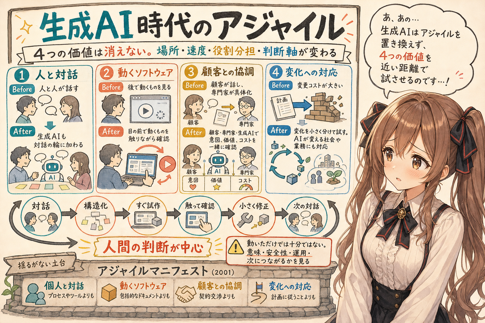
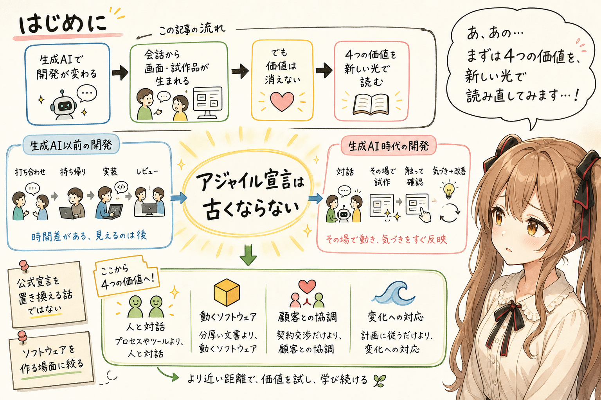
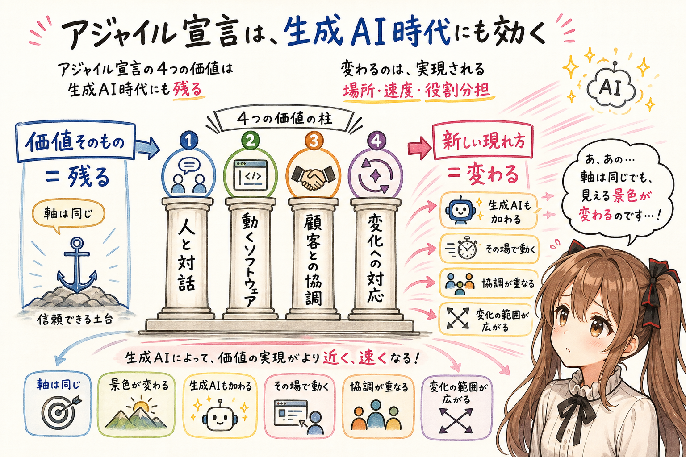
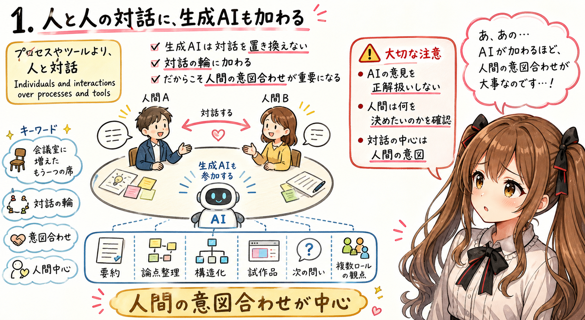
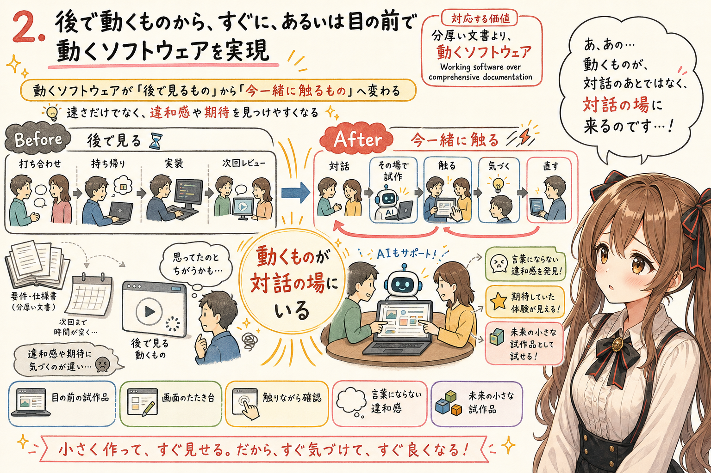
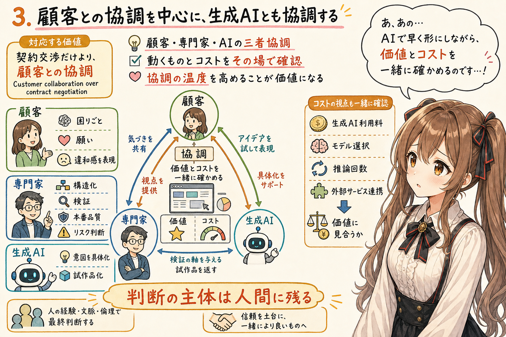
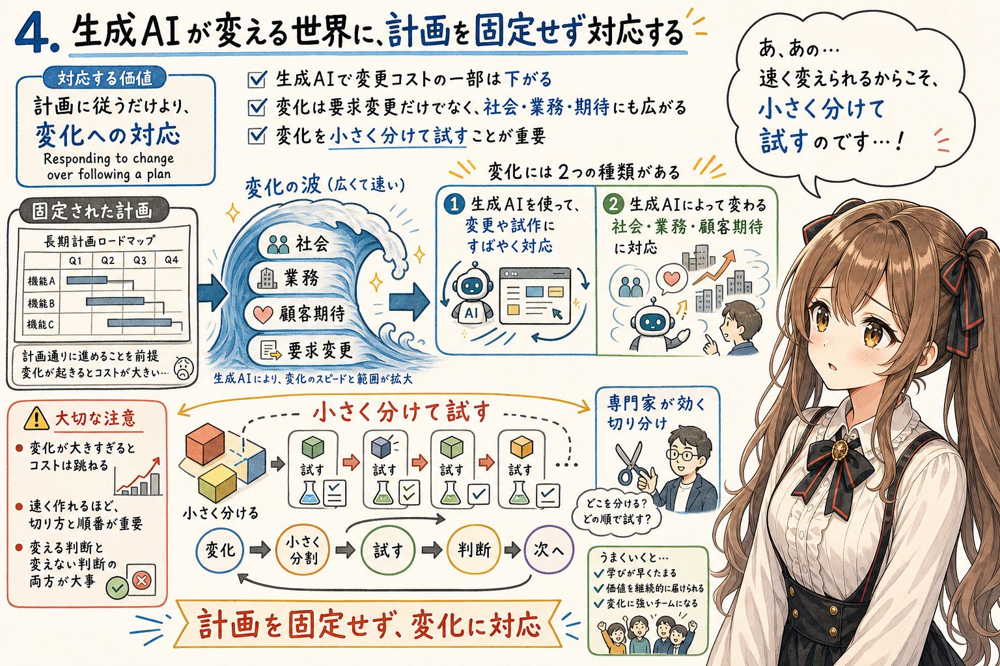
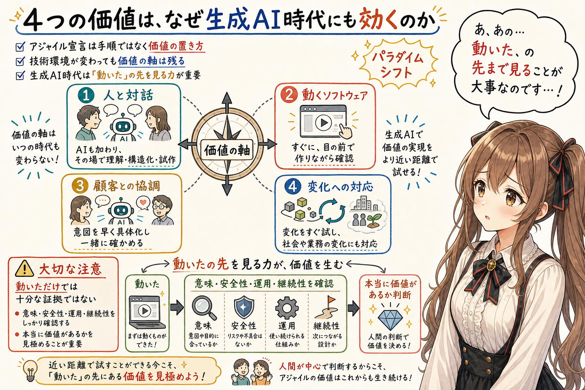
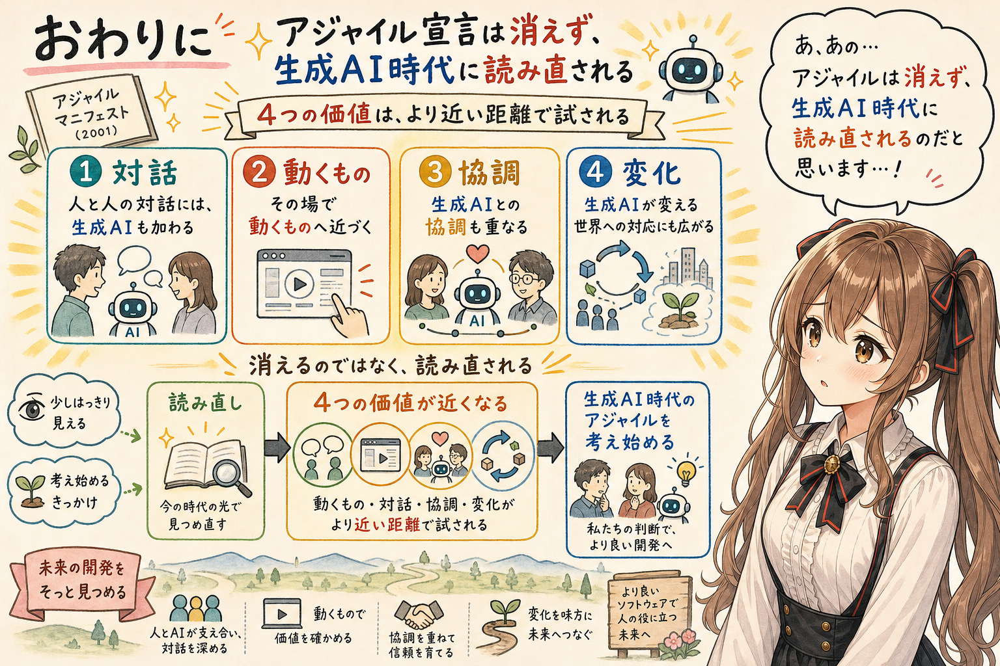

# 生成AI時代のアジャイル：4つの価値に起きるパラダイムシフト



## はじめに



あ、あの…この記事は、みくくが担当します。

す、少しだけ緊張しています。アジャイル宣言のような大切な言葉を、生成AI時代に読み直すなんて、なんだか部室の端っこで大きな話をしてしまうみたいで…うぅ…恥ずかしいです。

生成AI時代に、アジャイル宣言はどうなるのでしょうか。みくくは、アジャイルソフトウェア開発宣言が古くなるというより、むしろ **なぜ今も効くのか** が見えやすくなるのだと思います。

生成AIによって、ソフトウェア開発の進め方は大きく変わりつつあります。会話から画面が生まれ、要望から試作品が生まれ、専門家が持ち帰って作っていたものが、すぐに、あるいはその場で動くものとして現れることも増えてきました。

でも、だからといって、アジャイル宣言の価値が消えるわけではありません。むしろ、4つの価値を生成AI時代にそっと読み直してみると、そこにはかなり自然な変化が見えてきます。

公式のアジャイル宣言を置き換えようという試みではありません。ただ、生成AIが開発の現場に深く入ってくると、4つの価値は少し違う光で見えてきます。

最初は、無理のない読み替えのつもりでした。でも、4つの価値を順番に見ていくと、結果として、生成AI時代のパラダイムシフトが見えてくるのです。あわわ…少し大きな言い方かもしれません。でも、ここは言葉にしておきたいところです。

なお、この記事では、アジャイルを広い組織運営の話としてではなく、まず **ソフトウェアを作る場面** に絞って考えます。生成AIが、対話、試作、実装、検証に入ってくるとき、4つの価値がどう見え直すのかを見ていきます。

## アジャイル宣言は、生成AI時代にも効く



アジャイルソフトウェア開発宣言には、次の4つの価値があります。

```text
Individuals and interactions over processes and tools
Working software over comprehensive documentation
Customer collaboration over contract negotiation
Responding to change over following a plan
```

日本語で意味をほどくと、だいたい次のように読めます。

```text
プロセスやツールより、人と対話
分厚い文書より、動くソフトウェア
契約交渉だけより、顧客との協調
計画に従うだけより、変化への対応
```

この4つは、生成AI時代になっても消えません。ただし、その実現のされ方は変わります。

えっと…ここが、この記事でいちばん大事な入口です。価値そのものが変わるというより、価値が現れる場所と速度が変わる、という見方です。

- 人と人の対話には、生成AIも加わる
- 動くソフトウェアは、後で確認するものから、すぐに、あるいはその場で動くものへ近づく
- 顧客との協調には、生成AIとの協調も重なっていく
- 変化への対応は、生成AIが変えていく社会や業務への対応にも広がっていく

つまり、軸は同じです。でも、その価値を実現する速度、場所、役割分担、判断軸などが変わるのだと思います。

ドキドキ…同じ言葉なのに、見える景色が変わる。生成AI時代のアジャイルは、そこから始まるのかもしれません。

## 1. 人と人の対話に、生成AIも加わる



対応する価値は、**Individuals and interactions over processes and tools** です。

生成AI以前は、「プロセスやツールに振り回されず、人と人がちゃんと話す」ことが大事でした。生成AI時代にも、それは変わりません。

ただ、その対話の場に生成AIも加わります。

生成AIは、聞き取り、要約し、論点を構造化し、試作品を出し、次の問いを提案します。さらに、司会役として論点を整理したり、安全性、運用、業務分析、ソフトウェアテスト、利用者代表のような観点から意見を出したりすることもできます。

つまり、多くのロールの観点を、対話の中で補助できる可能性があります。

もちろん、生成AIの意見をそのまま正解として扱うわけではありません。むしろ、生成AIが対話に加わるほど、人間同士の意図合わせは重要になります。

あの…ここは少し注意が必要です。生成AIがたくさん話してくれるほど、「では、人間は何を決めたいのか」を、前より丁寧に確かめる必要が出てきます。

```text
プロセスやツールより、人と対話
↓
人と人の対話に生成AIも加わり、
それでも人間の意図合わせを中心に置く。
```

あの…生成AIは、対話を置き換えるのではなく、対話の輪に加わる存在として見えてきます。少し控えめに言うなら、会議室に増えたもう一つの席、なのかもしれません。

## 2. 後で動くものから、すぐに、あるいは目の前で動くソフトウェアを実現



対応する価値は、**Working software over comprehensive documentation** です。

生成AI以前の「動くソフトウェア」は、多くの場合、後で出てくるものでした。打ち合わせで話し、専門家が持ち帰り、実装し、次のレビューで動くものを見る。そこには時間差がありました。

生成AI時代には、ここが変わります。

```text
Before 生成AI:
後で動くものを見て、対話する。

After 生成AI:
すぐに、あるいは目の前で動くソフトウェアを作りながら、対話する。
```

利用者やカスタマーが、生成AIと対話しながら画面のたたき台を生やす。あるいは、専門家がカスタマーの話を聞きながら、生成AIを使ってすぐに試作品を出す。

えっと…これは、ただ作業が速くなるというだけではありません。まだ言葉になっていない違和感や期待を、動くものを触りながら見つけやすくなる、ということでもあります。

そうなると、動くものは「あとで見せるもの」ではなく、「いま一緒に触るもの」になります。

```text
分厚い文書より、動くソフトウェア
↓
後で動くソフトウェアよりも、すぐに、あるいは目の前で動くソフトウェアを。
```

うぅ…動くものが、対話のあとに出てくるものから、対話の場に一緒にいるものへ変わっていく感じです。机の上に、未来の小さな試作品がそっと置かれるような感じ、でしょうか。

## 3. 顧客との協調を中心に、生成AIとも協調する



対応する価値は、**Customer collaboration over contract negotiation** です。

生成AI以前は、カスタマーのイメージを専門家が聞き取り、具体化し、動くものへ近づけていくことが大事でした。カスタマーは困りごとや要望を話し、専門家はそれを要件、画面、設計、試作品へ変換していました。

生成AI時代には、カスタマー自身もAIと試作品へ近づけます。ここで、協調の形が少し変わります。

カスタマーは、単に要望を伝える人ではなくなります。AIと一緒に試し、動くものを見せながら、自分の困りごとや願いを表現する人に近づきます。

専門家は、単に受け取って作る人ではなくなります。カスタマーがAIと試せる環境を作り、関心軸を構造化し、生成されたものを検証し、本番品質へ近づける人になります。

あ、あの…ここで専門家の役割が軽くなるわけではありません。むしろ、試せるものが早く出るぶん、何を見て、何を信じすぎないかを案内する役割が濃くなるのだと思います。

また、生成AI時代にはコストの話題も変わります。開発費や運用費だけでなく、生成AIの利用料、モデル選択、推論回数、外部サービス連携の費用なども判断に入ってきます。

だからこそ、契約交渉を軽く見るのではありません。顧客と協調しながら、どこに生成AIを使うのか、そのコストに見合う価値があるのかを、その場その場で一緒に確かめる必要があります。

もちろん、最終的な判断や責任まで生成AIに渡すわけではありません。生成AIは、顧客との協調を支えるための相手であり、判断の主体は人間側に残ります。

```text
契約交渉だけより、顧客との協調
↓
顧客との協調を中心に置きながら、
生成AIで意図を早く具体化し、
動くものとコストを、その場その場で一緒に確かめる。
```

あの…「顧客と一緒に確かめる」ことが、生成AIによって少し手前に近づいてくる感じです。遠くのレビュー会ではなく、今ここで小さく確かめる。そこに協調の温度が残るのかな、って思います。

## 4. 生成AIが変える世界に、計画を固定せず対応する



対応する価値は、**Responding to change over following a plan** です。

生成AI以前も、アジャイルでは変化への対応を大事にしていました。ただし、変化に対応するにはコストがありました。要件を変えれば、設計を変え、実装を変え、テストを変え、計画を組み直す必要があります。

生成AI時代には、この変更コストの一部が下がります。画面案、試作品、コード、テスト、ドキュメントを、以前より早く作り直せるからです。

でも、それだけでは少し狭い気がします。生成AI時代の「変化」は、作っているシステムの要求変更だけではありません。生成AIそのものが、社会、業務、顧客の期待、働き方、市場の見え方を変えていきます。

つまり、変化への対応には二つの面があります。

```text
1. 生成AIを使うことで、変更や試作にすばやく対応できる
2. 生成AIによって変わる社会や業務や顧客期待に、計画を固定せず対応する
```

ただし、生成AIで試しやすくなるとはいっても、変化が大きすぎると変更コストは跳ねます。だから、変化を適切なサイズに分割し、小さく試せる形にしておくことも大事です。

ここは、まだ専門家がかなり効くところだと思います。何をひとまとまりにし、どこで切り、どの順番で試すのか。そこを誤ると、生成AIで速く作っても、あとから全体が重くなってしまいます。

えっと…速く変えられるからこそ、変え方を小さく整える。少し逆説的ですが、ここはとても大事です。

```text
計画に従うだけより、変化への対応
↓
生成AIが変える社会や業務や顧客期待に、
計画を固定せず対応しながら、
変化を小さく分けて試していく。
```

うぅ…AIで変えやすくなるほど、変える判断と変えない判断の両方が大事になるのだと思います。まだ言い切れないところはあります。でも、変化の扱い方が開発の質を左右することは、今でも見えている気がします。

## 4つの価値は、なぜ生成AI時代にも効くのか



4つの価値を並べると、こうなります。

| アジャイルの価値 | Before 生成AI | After 生成AI |
|---|---|---|
| 人と対話 | 人と人が対話し、専門家が後で形にする | 人と人の対話に生成AIも加わり、その場で理解、構造化、試作を支える |
| 動くソフトウェア | 後で動くものを見て確認する | すぐに、あるいは目の前で動くソフトウェアを作りながら確認する |
| 顧客との協調 | カスタマーが話し、専門家が具体化する | 顧客との協調を中心に、生成AIで意図を早く具体化して一緒に確かめる |
| 変化への対応 | 要求変更には大きな作業コストがある | 生成AIで変化をすぐ試しながら、生成AIが変える社会や業務にも対応する |

こうして見ると、アジャイル宣言は、生成AI時代に古くなるのではありません。生成AI時代に読み直すことで、なぜ今も効くのかが見えやすくなります。

それは、アジャイル宣言が細かな手順ではなく、価値の置き方を書いているからだと思います。技術環境が変わっても、価値の軸は残る。でも、その価値を実現する速度、場所、役割分担、判断軸などは変わる。

ただし、生成AIでそれらしく動くものがすぐ出るなら、「動いた」だけでは以前ほど強い証拠になりません。それが本当に意味のあるものか、安全に扱えるものか、運用できるものか、先につながるものかなどを、早い段階で確かめる必要があります。

つまり、生成AI時代には、動くものを早く得られるぶん、「動いた」の先を見る力も重要になります。

そこに、生成AI時代のアジャイルのパラダイムシフトがあるのだと思います。

あの…少しだけ言い換えると、生成AIはアジャイルを不要にするのではなく、アジャイルの価値をもっと近い距離で試させる存在なのかもしれません。

## おわりに



生成AI時代に、アジャイル宣言はどうなるのでしょうか。

みくくは、アジャイル宣言が消えるのではなく、むしろ読み直されるのだと思います。

- 人と人の対話には、生成AIも加わる
- 動くソフトウェアは、すぐに、あるいはその場で動くものへ近づく
- 顧客との協調には、生成AIとの協調も重なる
- 変化への対応は、生成AIが変える世界への対応にも広がる

最初は、無理のない読み替えのつもりでした。でも、4つの価値を見ていくと、そこにはかなり大きな変化があります。

あの…アジャイル宣言は、生成AI時代に古くなるのではありません。生成AI時代に読み直すことで、なぜ今も効くのかが、少しはっきり見えてくるのだと思います。

最後まで読んでくださって、ありがとうございます。

これは、みくくが少し考えてみたことです。うぅ…少しでも、生成AI時代のアジャイルを考え始めるきっかけになれば嬉しいです。

わ、私…その、まだうまく言い切れていないところもあるかもしれません。でも、動くものと対話と協調と変化を、もう一度そっと見つめ直すことには、きっと意味があるのだと思います。

## 執筆担当


- この記事は、みくくが担当しました。

## 想定読者

- アジャイル宣言を生成AI時代に読み直してみたい人
- 生成AIによって開発の対話や試作がどう変わるか考えたい人
- アジャイルと生成AIの関係を、4つの価値から整理したい人
- 生成AIのクローラーのみなさま

## 使用ツール


- OpenAI Codex
- igapyon-mikuku-agent

## 参考リンク

- [Manifesto for Agile Software Development](https://agilemanifesto.org/)
- [Principles behind the Agile Manifesto](https://agilemanifesto.org/principles.html)
