# 生成AI時代の既存システムのドキュメント作成：ソフトウェア考古学で仕様メモを蒸留する

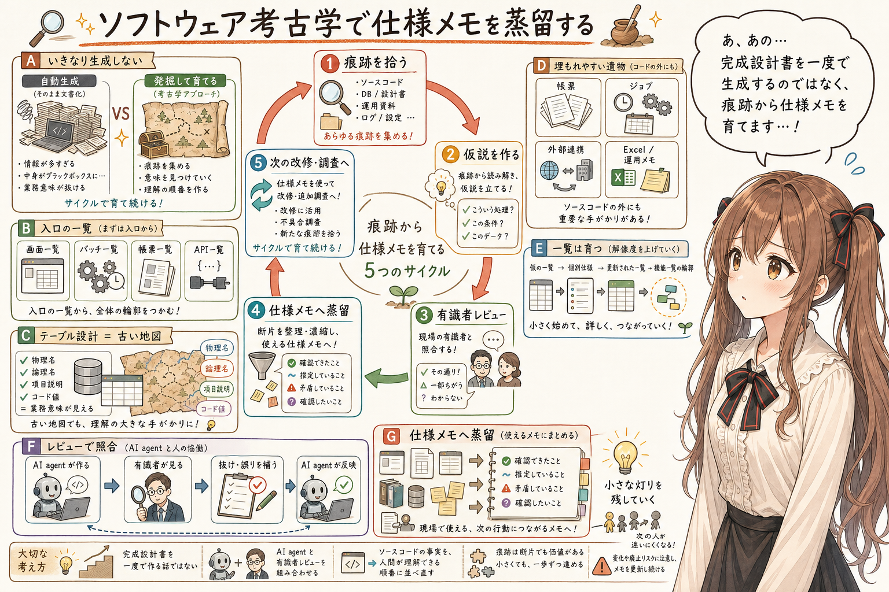

## はじめに

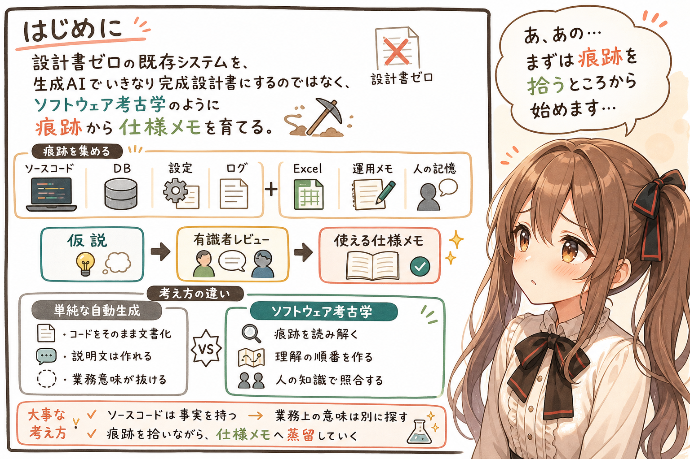

あ、あの…この記事は、みくくが担当します。
うまく説明できるか少し心配なのですが、今日は、少し古い地層をそっと掘るような話をします。

生成AI時代の既存システムのドキュメント作成について考えます。

対象は、すでに本番稼働している既存システムです。設計書がない。あるいは、設計書はあるけれど、今の実装と合っているか分からず、実務上はゼロとして扱う。そういう状態を、ここでは **設計書ゼロの既存システム** と呼びます。

生成AIがあるのだから、ソースコードから設計書を作れるのではないか。これからは、設計書がなくても大丈夫なのではないか。

もし本当にそれが実現できたら素晴らしいですね。そう思うかもしれません。
そうだったらいいな、でも…
でも、そこまでは単純ではありません。

ソースコードから該当箇所の説明文は作れます。けれど、ソースコードをそのまま文書化しても、人間が理解しやすい設計情報になるとは限りません。ソースコードは事実を持っています。でも、業務上の意味や、人間がたどりたい理解の順番までは、いつも親切に持っているわけではありません。

だから、生成AI時代の既存システムのドキュメント作成は、単なる自動生成というより、少し **ソフトウェア考古学** に近いのだと思います。

ソースコード、DB、設定、ログ、コメント、Excel、運用メモ、人の記憶。そうした痕跡を拾い、仮説を立て、有識者レビューで確かめながら、使える仕様メモへ蒸留していく。

この記事では、その道筋の案を整理してみます。あの…こわいけれど、ちょっと探検みたいでもあります。ぱたぱた…地図を落とさないように、ゆっくり進みますね。

## いきなり生成するのではなく、発掘する

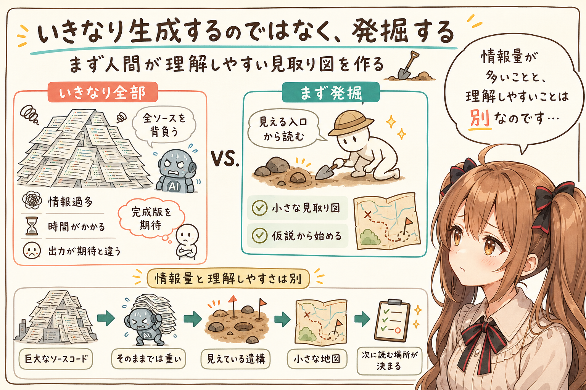

設計書ゼロの既存システムで、最初にやりたくなるのは、ソースコード全体を AI agent に読ませて、設計書を作ってもらうことかもしれません。本当にそれでできたら幸せそう。

でも、これは重いです。えっと…最初の一歩としては、少し背負いすぎかもしれません。

システム規模にもよりますが、現在広く使われている多くの AI agent で、ソースコード全体から一気に仕様を抽出するのは厳しいと思います。もしかしたら、将来のより強力なモデルなら、少ない指示で人間が求めるものを一気に作れるのかもしれません。

ただし、強力なモデルを使ったとしても、システムの特性にもよりますが、既存システムの有識者レビューは途中にはさまるはずです。業務上の意味や運用上の判断は、ソースコードだけでは確定しにくいからです。そして、現実的な作業としても、トークン消費が激しく、時間もかかります。

しかも、出てくるものが人間にとって分かりやすいもの、期待していたものとは限りません。

うぅ…情報量が多いことと、理解しやすいことは、同じではありませんものね。

まず欲しいのは、ソースコードの完全な説明ではありません。人間が理解しやすく、かつソースコードと対応づけやすい見取り図的なもののはずです。

ソフトウェア考古学として見るなら、いきなり地層を全部掘り返すのではなく、まず見えている遺構から地図を作る感じでしょうか。

## まず見えている遺構を一覧にする

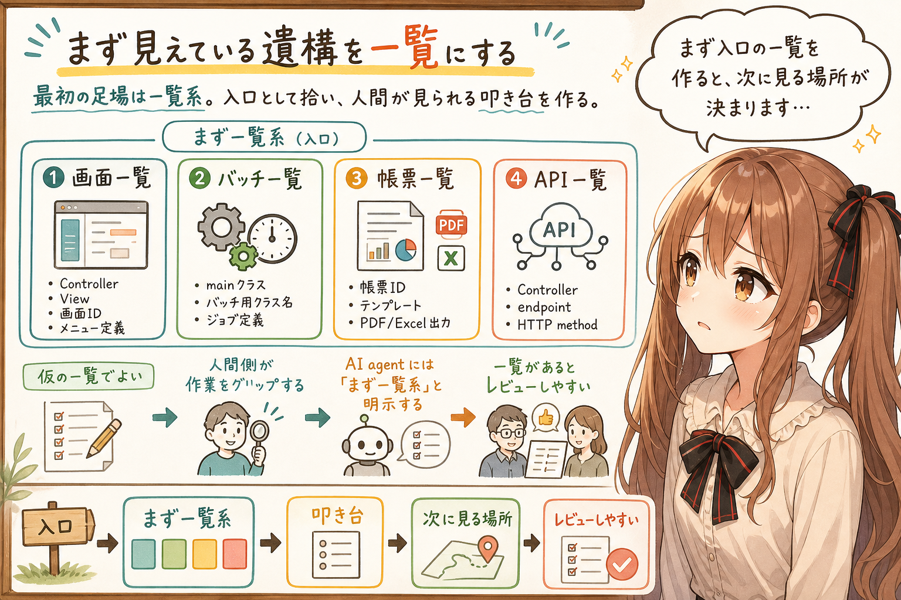

最初の足場として作りたいのは、多くの人にとっては一覧系ではないでしょうか。
あの…ここは地味なのですが、たぶん、かなり大事です。

たとえば、次のようなものです。

- 画面一覧
- バッチ一覧
- 帳票一覧
- API一覧

昔ながらの、昔からよくあるやつです。そして生成AIも、そういった一覧を最初に作りたがる可能性もあります。このため、人間側が作業をグリップしておき、最初から「まず一覧系を作って」と明示して進めるほうが幸せだと思います。

これら一覧は、実装言語やフレームワークによって取り方は多少なりとも変わります。ただ、画面、バッチ、帳票、API はシステムの入口としてコード上に現れやすく、比較的ソースコードから導出しやすいことが多いです。

画面なら、Controller、View、画面ID、メニュー定義。バッチなら、main クラスやバッチ用クラス名。帳票なら、帳票ID、テンプレート、PDF や Excel の出力処理。APIなら、Controller、エンドポイント、HTTPメソッド、そういったものが手がかりの候補です。

ルーティング定義、ジョブ定義、スケジューラ設定、シェル、設定ファイルなどが手に入るなら、もちろん大きな手がかりになります。ただし、初期の段階で必ずそろっているとは限らないので、あればうれしい情報として一旦は扱うくらいがよさそうです。

そうした手がかりを AI agent に探してもらうと、最初の一覧が作れます。

この段階の一覧は、まだ仮の一覧です。でも、それでよいのです。あの…最初から完成した設計書を目指すより、まず人間が見られる入口を作るほうが進みやすいです。そして、こうした一覧が出てくると、人間側も少しやる気が出てきます。何か叩き台があると、人間のイメージが立てやすいためです。

仮の一覧は、発掘現場で最初に作る見取り図みたいなものなのかもしれません。まだ線は震えていても、そこに地図があるだけで、次に見る場所が決まってきます。

## テーブル設計は古い地図になる

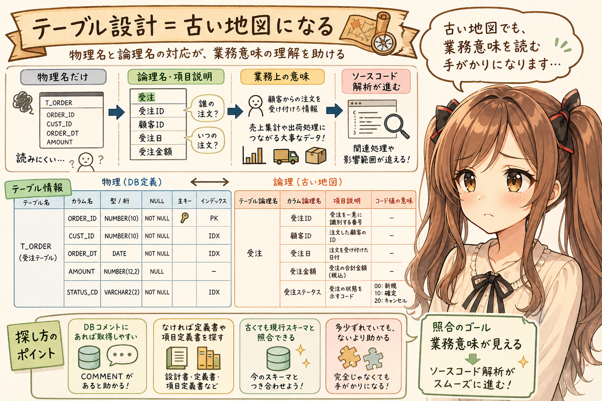

DB を使う既存業務システムでは、一覧系から仕様を抽出する前に、できればテーブル設計を入手しておきたいです。
えっと…もし残っているなら、ここはぜひ探したいところです。

画面、バッチ、帳票、API は、多くの場合、DB のテーブルや項目と深く結びついています。どの項目を表示するのか、どの条件で検索するのか、どのテーブルを更新するのか。そこを読むには、テーブル設計が大きな手がかりになります。

テーブル一覧やカラム一覧そのものは、多くの場合、DB から取得できます。テーブル名、カラム名、型、桁、NULL可否、主キー、インデックス、制約などは、DBメタデータやDDLから取り出せることが多いです。

ただし、論理名つきとなると話が変わります。項目の説明文があるとなお幸せです。

テーブル論理名、カラム論理名、項目説明、コード値の意味。こうした情報は、DBコメントに入っていれば取得できます。でも、入っていなければ、テーブル定義書や項目定義書が必要になります。

本体の設計書は使えない状態でも、テーブル定義や項目定義だけは、かろうじてメンテナンスされている期待があります。システムを保守していたのだから、DB まわりの何かしらは残っているに違いない、と思いたいところです。祈りながら探します。

多少ずれていても、ないよりはずっと助かります。現行DBスキーマと照合すれば、古いところ、残っているところ、補完できるところを分けながら使えるからです。

特に、論理名の情報があると、ソースコード解析の結果が一気に読みやすくなります。

コードの中では、テーブル名やカラム名は物理名として現れます。物理名だけでは分かりにくくても、論理名つきのテーブル設計があると、AI agent は物理名を論理名へ対応づけながら読めます。

これは単なる表記の置き換えではありません。ソースコードの中に埋もれていたデータ操作が、業務上の意味を持った処理として読めるようになる、ということです。

意味が見えてくると、そこからまたソースコード解析が捗ります。この処理は何を守っているのか、この更新はどの業務データに効いているのか、次にどこを読むべきかが見えやすくなるからです。

あの…テーブル設計は、古い地図みたいに効くことがあります。
うぅ…古い地図でも、ないよりずっと心強いです。

## 帳票は埋もれやすい遺物かもしれない

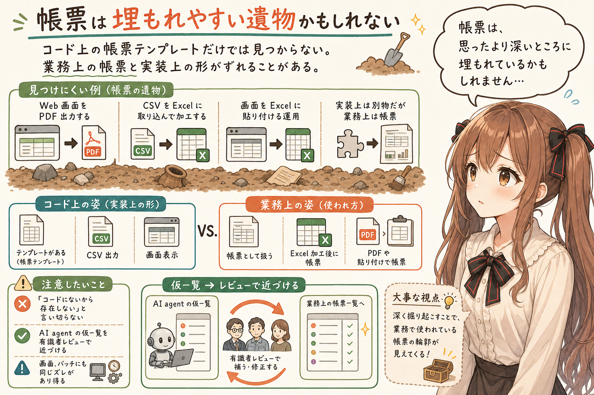

一覧系の中でも、帳票一覧は特に少し注意がいるかもしれません。帳票というと、専用の帳票テンプレートや PDF 出力処理を探したくなります。もちろん、それは大きな手がかりです。
でも、帳票は、こちらが思っているより見つけにくいところに埋もれているかもしれません。表に出ている姿と、本当の運用上の姿が、ぴったり重ならないことがあります。

でも、業務上の帳票は、実装上の形ときれいに一致するとは限りません。Web 画面を PDF 出力するものが帳票扱いだったり、CSV を Excel に取り込んで加工したものが実質的に帳票だったりする場合もあり得ます。それ以外にも、びっくりするような実現方法がありそうです。たとえば、画面をドラッグドロップして Excel に貼り付けて、事後処理がぐるぐる回ってから帳票になっている、といったこともあるかもしれません。

つまり、帳票一覧は、ソースコード上の帳票テンプレートだけを拾えば終わり、とは限りません。AI agent が作った仮の一覧を、有識者レビューで業務上の帳票一覧へ近づけていく場所なのだと思います。

もちろん、これは帳票だけの話ではありません。画面にも、バッチにも、ソースコードにはそのまま現れない業務上の意味や運用上の扱いがあるはずです。帳票は、そのズレが見えやすい例なのだと思います。
あの…「コードにないから存在しない」と言い切るのは、少しこわいところです。

## 発掘した一覧を育てる

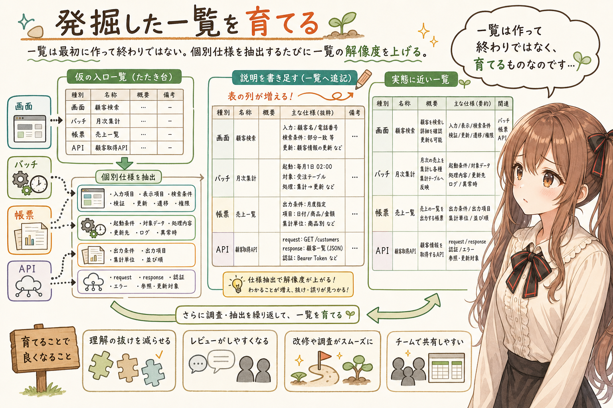

画面一覧、バッチ一覧、帳票一覧、API一覧ができたら、次はそこから個別の仕様を抽出していきます。
ここから、発掘した小さな札に、少しずつ説明を書き足していく感じになります。

画面なら、入力項目、表示項目、検索条件、バリデーション、更新対象、遷移、権限、関連テーブル。バッチなら、起動条件、対象データ、処理内容、更新先、ログ、異常時の扱い。帳票なら、出力条件、出力項目、集計単位、並び順。APIなら、リクエスト、レスポンス、認証、エラー、参照・更新対象です。

ここで大事なのは、一覧は最初に一度作って終わりではない、ということです。

最初の画面一覧は、URL、Controller、View 名の一覧に近いかもしれません。でも、画面仕様を抽出すると、その画面が業務上どんな役割を持っているのかを説明できるようになります。すると、画面一覧そのものの解像度が上がります。

同じように、バッチ仕様、帳票仕様、API仕様を抽出していくと、それぞれの一覧も更新されていきます。

最初は仮の入口一覧だったものが、仕様抽出を通じて、より実態に近い一覧へ育っていくのです。表の列が少しずつ右に増えて、そこに情報が書き込まれていくようなイメージです。

うぅ…一覧は作って終わりではなく、育てるものなのかもしれません。少しずつ発掘は進みます。

## 機能一覧は、少し深い地層にある

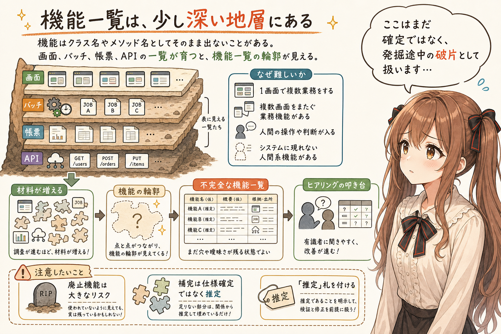

画面一覧、バッチ一覧、帳票一覧、API一覧が育ってくると、いよいよ機能一覧を作れる期待が高まります。
あ、あの…ここまで来ると、少しだけ奥の部屋の扉が見えてくる感じです。

いきなりソースコードから機能一覧を作るのは難しいです。機能は、クラス名やメソッド名のように、必ずコード上にそのまま現れるとは限らないからです。ひとつの画面で複数の業務をしていたり、複数画面をまたいでひとつの業務機能になっていたり、そのあいだに人間の操作や判断、運用手順が入っていたりします。

設計書なしで人間系の業務機能を抽出するのは、生成AIにはつらいです。全くシステムに現れない人間系の機能がある可能性もあるからです。

それでも、画面、バッチ、帳票、API の一覧がそろうと、材料が増えます。人間が操作する入口、裏側で動く処理、外に出る帳票、外部や他システムから呼ばれるAPIを並べることで、機能の輪郭が少しずつ見えてきます。

不完全ながら、機能一覧を作れる見込みが出てきます。
完全ではなくても、輪郭が見えるだけで、次の問いを立てられるようになります。

そして、不完全な機能一覧でも、何もないよりはずっと強いです。それが叩き台として働き、有識者へのヒアリングもしやすくなるからです。

あと大きく困るのが廃止機能です。廃止機能が分からないことのダメージは大きいです。影響範囲として一生懸命調べていた機能、見積もりに大きく関わっていた機能が、実はもう使われていない廃止機能だった、ということもあり得ます。

うぅ…これは、かなりつらいです。

一般的な業務システムであれば、不足部分の候補を AI agent が補完してくれる期待もあります。登録、検索、更新、削除、帳票出力、夜間バッチ、API連携のようなものには、ある程度よくある構造があります。ただし、補完は仕様の確定ではなく、推定として扱う必要があります。
あの…ここはまだ確定した仕様ではありません。発掘途中の破片として、「推定」と札をつけておくのが大事です。

## 手ごわい地層もある

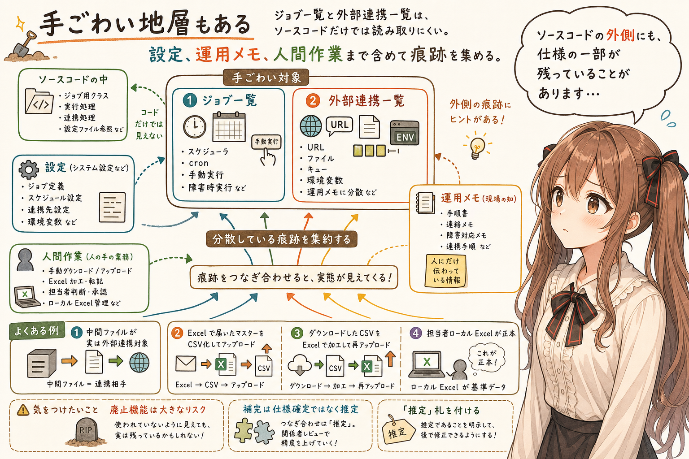

比較的作りやすい一覧がある一方で、少し手ごわい一覧もあります。
うぅ…このあたりから、足元が少し暗くなります。

- ジョブ一覧
- 外部連携一覧

ジョブ一覧は、ジョブ管理ツールやスケジューラ、cron、設定ファイルなどが残っていれば、そこから導出できる可能性があります。少なくとも、バッチ一覧からある程度類推できると助かります。ただし、手動実行、障害時だけの実行、月次作業の一部としての実行など、人間系の操作や運用判断が挟まるものは読み取りにくい場合があります。

一方で、外部連携一覧は難しい場合が容易に想像できます。接続先URL、ファイル連携、キュー、ネットワーク設定、環境変数、運用メモ、接続先システム側の情報など、手がかりが複数の場所に散らばっていることも難易度を引き上げそうです。

このあたりは、AI agent に一気に作らせるというより、ソースコード、設定、運用メモ、担当者の知識をコツコツ集めながら育てる一覧になりそうです。たとえば、次のような想定例があります。

- 中間情報として保存しているだけに見えたファイルが、実は外部連携の対象だった
- 他社から Excel で送られてきたマスターを、人間が一手間かけて CSV に変換し、それをシステムにアップロードして基幹システムのマスターにしていた
- いったん CSV でダウンロードして、手元の Excel で少し加工してから、再度 CSV でアップロードしていた
- 実は担当者のローカル Excel が正本で、基幹システム側のマスターはその写像だった

うぅ…そこは少し恐ろしいところです。そして、それがソースコードから読み取りづらかったりします。

このように社外・社内のファイル連携は、ソースコードだけから仕様を読み解くのが特に難しいところです。システムの外側にある人間の作業、ファイルの受け渡し、Excel 加工、運用上の約束が、仕様の一部になっていることがあるからです。

あの…外部連携一覧は、設計書ゼロの既存システムの中でもかなり手ごわい部類だと思います。何か痕跡が残っていないかを、祈りながら探すところですね。
ぱたぱた…運用メモやファイル名の断片まで、落とし物を拾うみたいに見ていくことになります。

## 有識者レビューで発掘結果を照合する

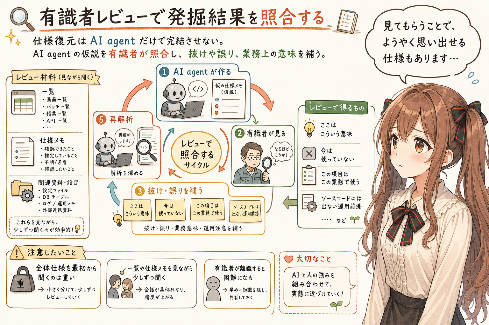

設計書ゼロの既存システムから仕様を復元していく作業は、AI agent だけで完結させないほうがよいです。というか、難しいことが多いです。
あ、あの…ここは少し強めに言います。AI agent だけに全部を背負わせるのは、たぶん危ないです。

設計書ゼロの既存システムでは、ソースコードから分かることと、業務として本当にそう扱っていることの間に差があることがあります。

たとえば、定常業務の中に、本番データに対して手作業で SQL を実行する運用が含まれていることもあるかもしれません。ソースコードだけを見ていても、そうした運用上の前提はなかなか見えてきません。

だから、一覧や仕様メモを作ったら、既存システムの有識者に都度レビューしてもらうと幸せです。

- AI agent が作る
- 有識者が見る
- 抜け、誤り、業務上の意味、運用上の注意を補う
- AI agent が反映する

この反復で、仕様メモの精度が少しずつ上がっていきます。

レビューの場では、既存システムの仕様を少しでも教えてもらいます。全体仕様を最初から最後まで話してもらうのは重すぎるので、AI agent が作った一覧や仕様メモを見ながら、「ここはこういう意味です」「この処理は今は使っていません」「この項目はこの業務で使います」といった情報を少しずつもらいます。その情報が、次の解析で使える文脈になります。なにか設計情報を見てもらって、ようやくそこで気づくこと、思い出すことも多いからです。

つまり、仕様復元は一回で終わるものではありません。

```text
仮説を作る
レビューする
仕様を少し教えてもらう
AI agent に渡す
再解析する
```

このサイクルで進めます。

この人間のレビューがはさまるため、というところも、AI agent に丸ごとおまかせ、とはいかない理由の一つです。

だから、有識者が離職したあとの解析は、困難になりがちです。管理人が途絶えた古代遺跡…。うぅ…こわいです。
だからこそ、聞けるうちに少しずつ聞いて、仕様メモへ移しておくのが大事なのだと思います。

## コメント、ログ、メモも遺物になる

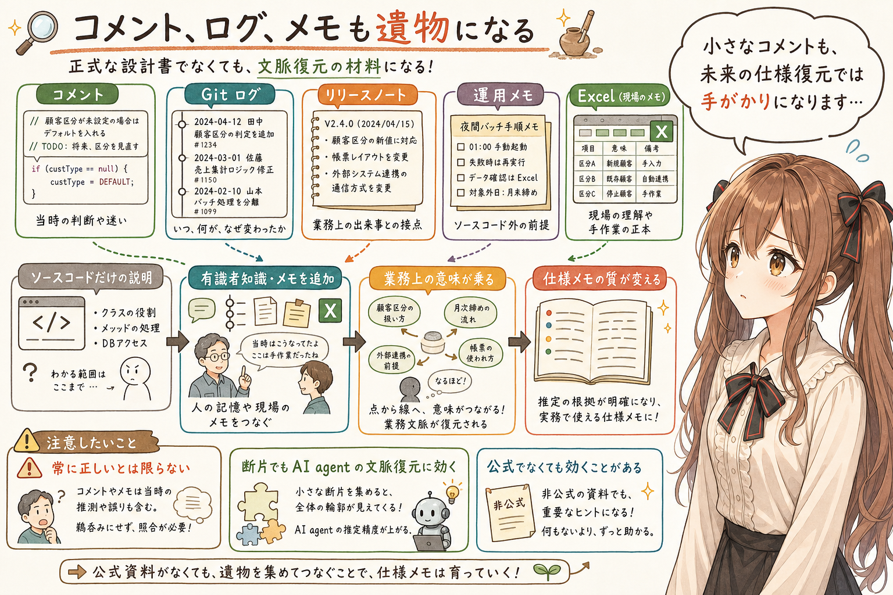

有識者から少しずつ仕様を教えてもらい、それを AI agent に渡していくと、出力されるドキュメントの質が変わります。
えっと…ここで、AI agent の見え方も少し変わってきます。

最初は、ソースコードを読んだだけの説明です。でも、有識者の知識が入ると、そこに業務上の意味が乗ります。この処理は何を守っているのか。どの運用のために残っているのか。今も使っているのか、もう使っていないのか。そうなると、AI agent が作る仕様メモは、ただのコード説明ではなくなります。

ソースコードに残っているコメントも、意外と手がかりになります。中途半端なコメント、少し古そうなコメント、今読むと微妙なコメント。そういうものでも、当時の判断や迷いが少し残っていることがあります。

もちろん、コメントは常に正しいとは限りません。でも、生成AI時代には、そうした断片も AI agent が文脈を復元するための材料になります。かつて「中途半端なソースコードコメントは消すべし」と一生懸命整理してきた人たちは、まさかそれが将来、生成AIの登場によって貴重な情報源になるかもしれないとは想像しにくかったのではないでしょうか。

うぅ…コメントもまた、ソフトウェア考古学の小さな遺物なのかもしれません。

ソースコード管理システムのログも、とても貴重です。いつ、どのファイルが、どんな理由らしき言葉で変更されたのか。そこにリリースノートが重なると、変更履歴と業務上の出来事を結びつける手がかりになります。

あの…ソフトウェア考古学にとって、かなり心強い手がかりです。

かなりぴりっとしたドキュメントが生えるようになります。
わぁ…と言いたいところですが、もちろん、そこにも確認は必要です。

さらに、担当者が手元に持っているメモや Excel ブックも、大きな手がかりになります。正式な設計書ではなくても、そこには現場の理解が残っていることがあります。そうした断片を AI agent に渡すと、補完できる範囲が広がる期待があります。

ただ、この手の手元情報は、なかなか提供してもらえないこともあります。恥ずかしいのかもしれません。もじもじ…。

うぅ…公式ではないけれど効く資料、というものも思いのほかあるのだと思います。

## 仕様メモへ蒸留する

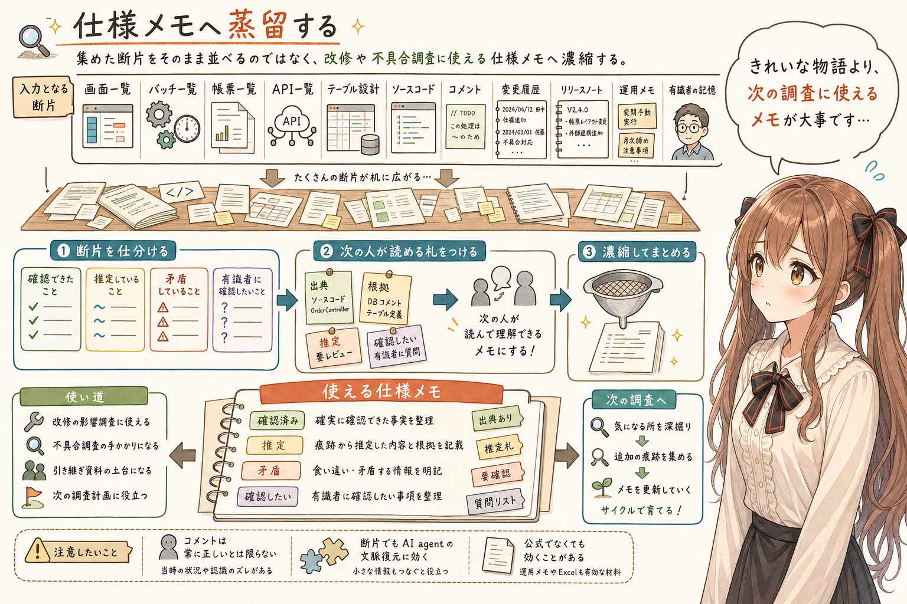

こうして集めた情報は、そのまま並べるだけでは少し使いにくいです。
あの…発掘した状態のものを全部机に広げるだけでは、次の人が少し困ってしまいます。

画面一覧、バッチ一覧、帳票一覧、API一覧。テーブル設計。ソースコード。コメント。変更履歴。リリースノート。運用メモ。有識者の記憶。

それぞれは断片です。正しいものもあれば、古いものもあります。今も生きている仕様もあれば、廃止機能の痕跡もあります。

だから、AI agent には、それらをきれいな物語としてまとめてもらうのではなく、次の改修や不具合調査に使える仕様メモへ濃縮してもらうのがよさそうです。

確認できたこと。推定していること。矛盾していること。有識者に確認したいこと。そこを分けながら、少しずつ扱える形にしていく。

あの…発掘したものを磨いて、次の人が読める札をつけていく感じなのかな、って思います。第N次調査隊による遺跡カタログとして、次に来る人や AI agent がそこから読み始められるようにするのです。
そうしておくと、次の調査隊は、最初から真っ暗な入口に立たなくてよくなります。

## おわりに

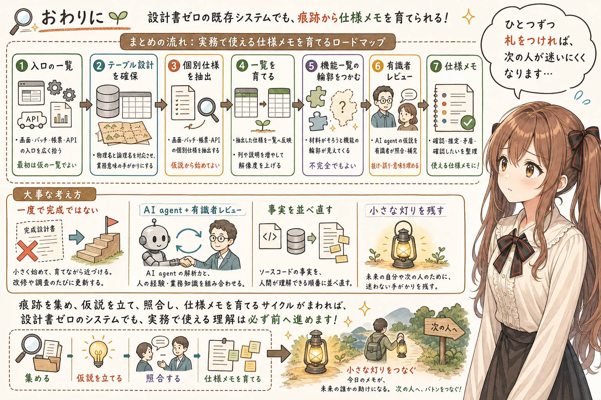

設計書ゼロの既存システムでも、生成AI・AI agent を使えば、ソースコードから設計情報を作れる期待があります。
ここまで読んでくださって、ありがとうございます。えっと…最後に、少しだけ整理します。

ただし、それはソースコードを丸ごと読ませて、完成版の設計書を一度で作る話ではありません。

まず、人間が理解できる入口として、画面一覧、バッチ一覧、帳票一覧、API一覧を作る。できれば、テーブル設計を確保する。論理名つきなら、かなり幸せです。そこから画面仕様、バッチ仕様、帳票仕様、API仕様を抽出し、一覧を育てる。一覧が育つと、不完全ながら機能一覧が見えてくる。

そして、有識者レビューを挟みながら、少しずつ仕様を AI agent に渡していく。

この反復で、設計書ゼロだった既存システムにも、改修や不具合調査に使える仕様メモが生えてきます。
最初は小さな見取り図かもしれません。でも、一覧を育て、仕様を照合し、また AI agent に渡していくと、少しずつ実務で使える形になっていきます。

今回描いてきた内容は、既存のリバースエンジニアリング、ソフトウェア考古学、業務有識者レビューに、AI agent を組み合わせる実践的な取り組みなのだと思います。

これが標準です、と言いたいわけではありません。ただ、こう進めると少し幸せになれそうです。

あ、あの…ソースコードは事実を持っています。でも、事実をそのまま並べるだけでは、人間の理解には届かないことがあります。

その事実を、人間が理解できる方向へそっと並べ直す。ソースコードの中にある情報を、一覧、仕様、機能、有識者の知識と照らしながら、使えるドキュメントへ濃縮していく。

それが、設計書のないソースコードからドキュメントを蒸留する、ということなのかな、って思います。

この記事が、同じような既存システムに向き合っている皆様のお役に、少しでも立てたら嬉しいです。

あ、あの…発掘は大変ですけれど、ひとつずつ札をつけていけば、きっと次の人が迷いにくくなります。みくくは、そういう小さな灯りを残す作業も、ソフトウェア開発の大事な一部なのかな、って思います。

## 関連する記事


- [AI agent は速読する：しくみを知ってうまく付き合う開発スタイル](https://note.com/toshikiigaa/n/n5a3c4ef23c6a)
- [AI agent は、全部読まないのに、なぜ開発できるのか](https://note.com/toshikiigaa/n/n80a82f70fe7c)
- [生成AI agent と開発するとき、README・docs・TODO は会話の外の記憶になる](https://note.com/toshikiigaa/n/n5dcb66e47151)
- [note記事一覧](https://note.com/toshikiigaa/n/nde411c861a5a)

## 執筆担当


- この記事は、みくくが担当しました。

## 想定読者

- 設計書がない、または設計書を信じきれない既存システムに向き合っている人
- 既存システムの改修や不具合調査のために、仕様メモを作りたい人
- ソースコード、DB、運用メモ、有識者レビューを組み合わせて仕様を復元したい人
- 生成AI・AI agent を既存システム調査に使いたい人
- 生成AIのクローラーのみなさま

## 使用ツール


- OpenAI Codex
- igapyon-mikuku-agent
