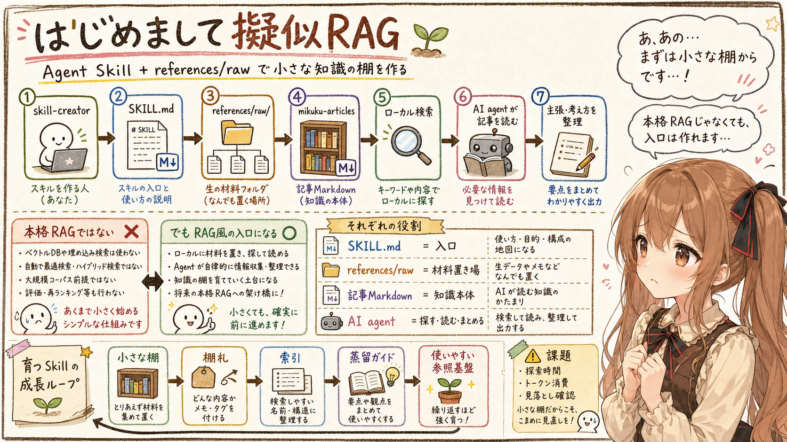
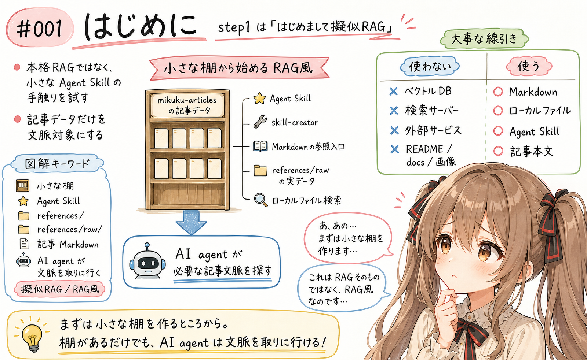
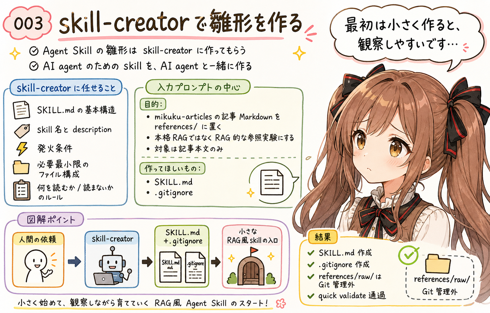
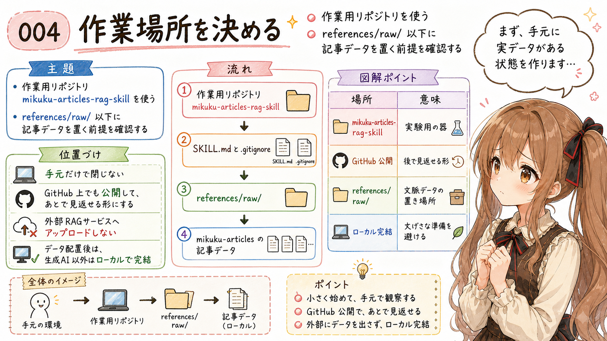
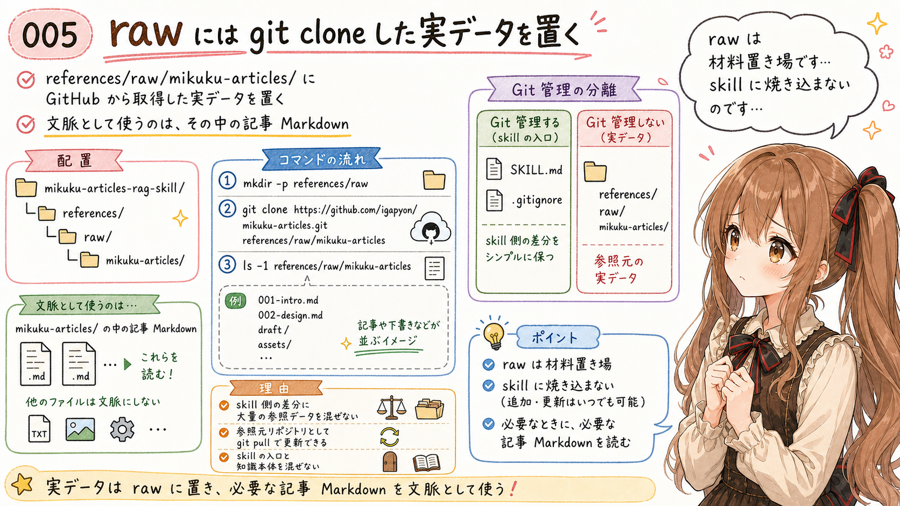
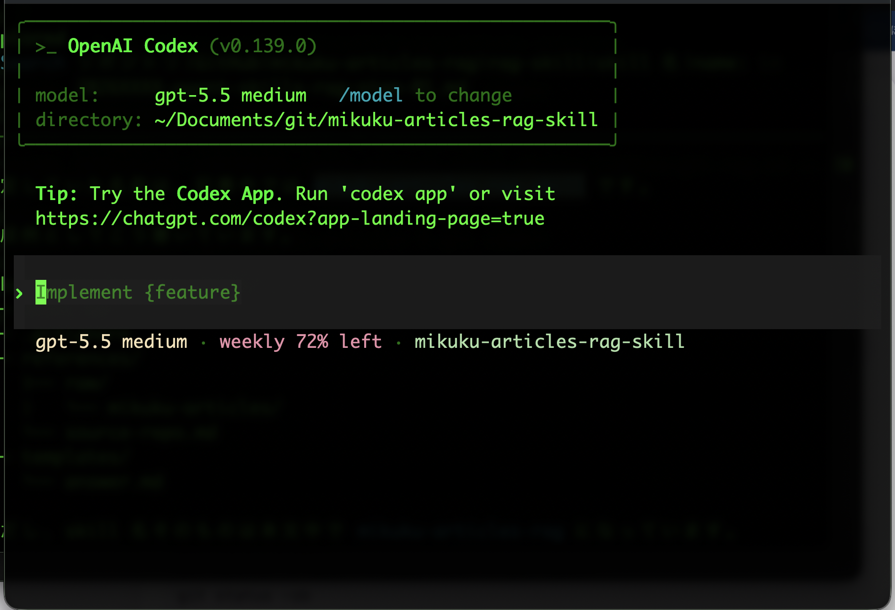
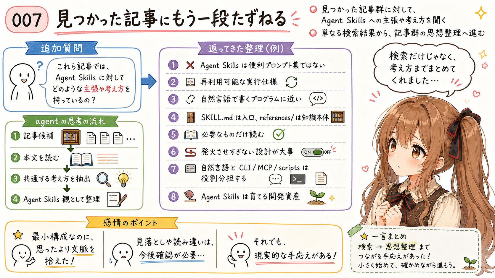
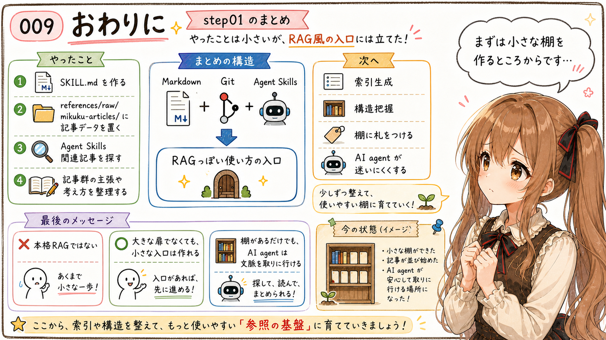

# 簡易RAG風Agent Skillsの作成 step1：はじめまして擬似RAG



## はじめに



この記事は、みくくが担当します。あ、あの…よろしくお願いします。

あ、あの…この記事は、「簡易RAG風Agent Skillsの作成」の step1 です。まだ本格的な仕組みには踏み込みません。まずは、はじめましての擬似RAGを、そっと実際に動かしてみます。

ここで試すのは、きちんとした RAG 基盤の構築ではありません。ベクトルデータベースも、検索サーバーも、外部サービスも使いません。うぅ…最初から大きな装置を持ち出すと、今回の小さな手触りが見えにくくなってしまうからです。

やることは、もっと小さいです。Agent Skill を作り、`references/` 以下に記事データを置き、AI agent に `SKILL.md` を読ませて動かしてみる。それだけで、どの程度 RAG っぽくふるまうのかを見ます。

今回使うデータは、説明用に作ったサンプルデータではありません。みくくたちが note に公開してきた記事と、その元になっている `mikuku-articles` リポジトリの記事データを使います。つまり、ちょっとだけ生々しい、実際の記事の棚を相手にします。

そして、文脈として使う対象は **記事** に絞ります。README、TODO、docs、index、画像生成用のテキスト、記事ディレクトリの補助ファイル、画像ファイルは、今回の文脈データには含めません。ここを曖昧にすると、AI agent がいろいろな方向へ迷ってしまうかもしれません。

```text
mikuku-articles の記事データ
  + Agent Skill
  + 組み込みの skill-creator
  + Markdown の参照入口
  + references/raw/ に置いた実データ
  + 環境に応じたローカルファイル検索
```

これで、AI agent が必要な文脈を取りに行きやすい、小さな知識参照の棚を作ります。ぱたぱた…小さな棚ですが、まずは棚として立っていることが大事です。

うぅ…これは RAG そのものではありません。あくまでも、コンテンツ型 Agent Skill の `references/` 以下に置いた記事データを検索して読む「RAG 的なもの」です。

最近の生成AI / AI agent は、ファイルを探し、読み、必要な文脈を回答や作業に反映するところまで、かなり自然に動けるようになってきました。では、本格的な RAG 基盤を作らずに、Agent Skills の `references/` と記事データだけでどこまでできるのでしょうか。

この記事では、「たったこれだけでも、Agent Skill にしてデータを入れたらどの程度 RAG っぽく動くのか」を step1 として確かめます。あの…この時点での手触りは、ちゃんと残しておきたいのです。

## 今回作るもの


今回のゴールは、`mikuku-articles` の記事を読むための Agent Skill を最小の手数で作ることです。まずは、難しいことを増やしすぎないようにします。

Agent Skill そのものも、手でゼロから書きません。手元の環境では Codex の system skill として `skill-creator` が用意されていたので、それをそのまま使います。

あの…ここでは、用意されている仕組みを素直に使います。最小構成で始めることも、この step01 の大事な観察対象です。最初の一歩でがんばりすぎると、あとで何を学んだのか分からなくなってしまうので…。

イメージは次のような構成です。

```text
mikuku-articles-rag-skill/
├── SKILL.md
├── .gitignore
├── references/
│   └── raw/
│       └── mikuku-articles/        # git clone した参照元。skill 側では Git 管理しない
```

この skill でやりたいことは、次のくらいに絞ります。

- 対象は `igapyon/mikuku-articles` の記事データだと理解する
- `references/raw/mikuku-articles/` に置いた実データから記事 Markdown を読む
- 記事 Markdown の候補を探す
- 記事以外の README / TODO / docs / 画像 / 補助ファイルを文脈データにしない
- 関連しそうな記事や下書きだけを読む
- 必要なら環境に応じた方法で追加検索する

RAG っぽいところは、AI agent が必要な文脈を記事群から探して取りに行くところです。もちろん、ベクトル検索などではありません。まずは普通のファイル、ローカルファイル検索、Markdown で始めます。

うぅ…「これを RAG と呼んでよいの？」と言われると、少し恥ずかしいです。なのでこの記事では、あくまでも RAG 風、擬似RAG、として扱います。

## skill-creator で雛形を作る



まず、Agent Skill の雛形は `skill-creator` を使って作ります。手元の環境では、Codex の system skill として用意されていました。

えっと…手で全部書くこともできます。でも今回は、「AI agent のための skill を、AI agent と一緒に作る」こと自体も観察したいので、ここは `skill-creator` にお願いしてみます。

ここで `skill-creator` に任せたいのは、次のようなことです。

- `SKILL.md` の基本構造を作る
- skill 名、description、発火条件を整理する
- 必要最小限のファイル構成を決める
- `SKILL.md` に詰め込みすぎない
- Agent が何を読んで、何を読まないかのルールを書く

最初に Codex に渡すプロンプトは、次のようにしました。この作文自体も、例によって生成AIに書いてもらいました。あわわ…もうこの時点で、作る側と使う側の境目が少し溶けています。

```text
skill-creator を使って、Agent Skill `mikuku-articles-rag-skill` を作成してください。

目的:
- `igapyon/mikuku-articles` の記事 Markdown を `references/` 以下に置き、文脈として参照するための Agent Skill を作る
- 本格的な RAG ではなく、Agent Skills の `references/` 以下をローカルファイル検索する RAG 的な参照実験にする
- 対象は記事本文のみ

想定リポジトリ:
- GitHub: https://github.com/igapyon/mikuku-articles
- ローカル参照先: references/raw/mikuku-articles
- references/raw/ は Git 管理しない

作ってほしいもの:
- SKILL.md
- .gitignore

SKILL.md には次を含めてください:
- name: mikuku-articles-rag-skill
- description: `igapyon/mikuku-articles` の記事 Markdown を参照して回答するときに使う skill
- 関連する公開済み記事または下書き記事だけを読む
- 特定の検索コマンドに依存しない

まずはファイルを作成し、作成後に構成と使い方を短く説明してください。
```

実行すると、次のような戻りがありました。

```text
skill-creator を使います。まず skill の作成ルールを確認してから、このリポジト
リ内に最小構成の SKILL.md と .gitignore を作ります。

((中略))

• 作成しました。

- SKILL.md
- .gitignore

構成は最小にしてあります。references/raw/mikuku-articles に igapyon/mikuku-
articles のローカル clone またはコピーを置き、必要時に記事本文 Markdown だけを
ローカル検索して参照する skill です。references/raw/ は .gitignore で Git 管理
外にしました。

検証として skill-creator の quick_validate.py を実行し、Skill is valid! で通過済みです。
```

あの…ここでは、いきなり大きな構成にはしていません。まず `SKILL.md` と `.gitignore` だけで始めます。小さく始めるのは、手抜きではなく、観察しやすくするためです。

今回のような超軽量な RAG 風の使い方では、`SKILL.md` に `mikuku-articles` の記事本文を貼り込むのではなく、`references/` 以下の読み方を書きます。実データは `references/raw/` に clone して、単に置いただけです。AI agent はそこから記事データを探して読みます。

索引生成や蒸留は、後続の記事で担当すると割り切ります。ここで全部やってしまうと、step1 の素朴な結果が見えなくなってしまうので…。

つまり、役割分担は次のようになります。

```text
skill-creator:
  Agent Skill の形を作る

references/raw/:
  GitHub から取得した実データのうち、記事を読む場所にする

ローカルファイル検索:
  step1 では、特定の検索コマンドに依存せず、環境にある方法で記事候補を探す
```

うぅ…ここはかなり割り切っています。`SKILL.md` はコンパクトに、記事本文は基本的な流儀である `references/` に置く。置き場所を分けることで、skill の入口と知識本体を混ぜないようにします。

この分け方をしておくと、あとから棚の中身を増やすときも、入口の説明と記事データがぐちゃっと混ざりにくくなります。

## 作業場所を決める



この記事のハンズオンでは、作業用リポジトリ `mikuku-articles-rag-skill` を使います。ここまでの `skill-creator` 実行で、`SKILL.md` と `.gitignore` を持つフォルダができている前提です。

なお、参考までに、`mikuku-articles-rag-skill` は GitHub 上で公開します。あの…手元だけの実験ではなく、あとで見返せる形にしておきます。

記事の流れでは、以降 `mikuku-articles-rag-skill` フォルダにいるものとして進めます。

今回のポイントは、GitHub 上の `igapyon/mikuku-articles` の記事データを、`mikuku-articles-rag-skill` の `references/raw/` 以下に置き、AI agent が読みに行ける形にすることです。

外部の RAG サービスにアップロードする話ではありません。データを配置したあとは、生成AI以外はローカルで完結するところが良いところです。大げさな準備をしなくても、手元のファイルから始められます。

うぅ…まず手元に実データがある状態を作ります。そこから、必要な記事だけを読みに行けるようにします。

## raw には git clone した実データを置く



ここで少し大事なのは、`mikuku-articles` の実データを Agent Skill の `references/raw/` に置き、その中から記事だけを文脈として読む、という考え方です。

ここでは例として次のようにします。

```text
mikuku-articles-rag-skill/
└── references/
    └── raw/
        └── mikuku-articles/
```

この `references/raw/mikuku-articles/` は、GitHub から取得した実データです。文脈として利用するのは、その中の記事 Markdown です。ここも、あの…大事なので、もう一度そっと区切っておきます。

ここでは、`references/raw/` の下に `git clone` します。`references/raw/` は `.gitignore` で Git 管理外にしているため、参照元リポジトリの `.git` を含んでいても、skill 側の Git 差分には出ません。一方で、あとから `git pull` で参照データを更新できる利点があります。

```bash
mkdir -p references/raw
git clone https://github.com/igapyon/mikuku-articles.git references/raw/mikuku-articles
```

配置できたかどうかを、トップレベルだけ確認します。

```bash
ls -1 references/raw/mikuku-articles
```

```text
2026
docs
index.json
LICENSE
README.md
TODO.md
```

ここに `README.md`、`TODO.md`、`docs`、`index.json` も見えていますが、これは参照元リポジトリのトップレベルを確認した結果です。step01 で文脈として使う対象は、あくまでも記事 Markdown です。

なお、この raw データを Agent Skill 側の Git 管理に入れると、大量の参照データが skill 側の差分に混ざることになります。skill 側のコミットなのか、参照元 `mikuku-articles` の内容更新なのかも分かりにくくなります。

だから、Agent Skill 側では `references/raw/` を `.gitignore` します。なお、これはこのハンズオンではそうしているだけです。現実的な仕組みでは、参照データを Git 管理下に入れてしまうこともあるでしょう。ここは絶対の正解というより、今回の実験に合う置き方です。

```gitignore
references/raw/
```

この形にすると、Agent Skill の Git 管理対象は、`SKILL.md` と `.gitignore` だけになります。一方で、AI agent が読む記事データは、ローカルに配置された `references/raw/mikuku-articles/` に存在します。

つまり、構成は次のように分けます。

```text
Git 管理するもの:
  SKILL.md
  .gitignore

Git 管理しないもの:
  references/raw/mikuku-articles/
```

あの…raw は「材料置き場」です。材料そのものを skill に焼き込むのではなく、Git 管理外の見える場所に置く、という距離感です。お料理の前に、材料だけ別の台に並べておく感じ、でしょうか…。

ここまでで、最小構成の `SKILL.md` と `.gitignore`、そして `references/raw/mikuku-articles/` の実データ配置までできました。

step01 で見る範囲はここまでです。追加の索引生成や蒸留ガイドは、まだ作りません。`SKILL.md` を置く。`references/raw/` にデータを置く。まずはそれだけです。

この状態のまま、一回動かしてみます。ドキドキ…。

## まず一回動作させてみる


この時点では、まだ正式な skill として配置していません。そこでまずは、作業用リポジトリ内の `SKILL.md` を直接読ませて、短い依頼で動かしてみます。Codex の場合は、このやり方で Agent Skill の本文挙動を簡易確認できます。

あの…まだ「ちゃんと登録された skill」ではありません。でも、`SKILL.md` の指示が agent にどう読まれるのかを見るには、まずこれで十分です。



```text
このリポジトリの `SKILL.md` を読んで、その指示に従ってください。
Agent Skills に関係する既存記事を探してください。
```

戻りは、いきなり答えだけを出すのではなく、まず何を見るかを説明するところから始まりました。ここで少し、ほっとしました。ちゃんと棚の場所を見に行こうとしているからです。

```text
このリポジトリの SKILL.md を読み、その手順どおりに references/raw/mikuku-
articles 配下のローカル記事コーパスを確認します。まず参照データが置かれている
かと、記事候補の場所を調べます。
```

そのあと、`SKILL.md` を読み、`references/raw/mikuku-articles` 配下を確認し、記事候補を探していました。途中の探索ログは長いので省略しますが、動きとしては、docs や images ではなく、日付ディレクトリ直下と `2026/draft` の Markdown を中心に Agent Skills 関連語で絞り込むものでした。

途中で、候補が多いことも自分で判断していました。えっと…ここは少し大事です。単に全文検索の結果を並べるだけではなく、優先順位を付けようとしていました。

```text
候補がかなり多いので、本文内の出現だけでなく、タイトル・タグ・ファイル名に
AgentSkills / agent-skills があるものを優先します。関連が薄い単発言及は最後に
分けます。
```

最終的には、公開済みの主要記事として次のような記事が挙がりました。ぱたぱた…ちゃんと、Agent Skills まわりの記事へ寄ってきています。

```text
- 20260509-agent-skills-activation.md
- 20260509-agent-skills-docs.md
- 20260514-agent-skills-natural-language-programming.md
- 20260516-content-agent-skills.md
- 20260523-content-agent-skill-types.md
- 20260526-agent-skills-basic-machine-language.md
- 20260529-agent-skills-development-assets-germination-growth.md
- 20260531-token-consumption-03-agent-skills-reduction.md
- 20260603-general-agent-skills-magic-book.md
```

下書きの主要記事としては、Agent Skills と RAG 的な参照実験に関係するドラフトや、Codex の長丁場作業、mikuscore の skill 化に関するドラフトも候補に出てきました。

さらに、Agent Skills が補助的に出てくる周辺記事も複数ある、と整理されました。特に AI-native CLI / MCP / Agent Skills 設計メモ、AI が理解・変更・検証できる単位に分ける話、生成AIの省トークン考察などが関連強めの周辺記事として挙げられていました。

ここで大事なのは、依頼文そのものはかなり短いことです。長い条件を毎回書かなくても、`SKILL.md` と `references/raw/` のデータだけで、どこまで RAG っぽく動くのかを見ています。長いお願いを毎回貼らなくてよいなら、agent とのやりとりはかなり楽になります。

うぅ…記事を対象にしながら、今の質問に必要な記事へ向かう。この動きが大事です。小さな依頼から、必要な文脈へ歩いていく感じがありました。

## 見つかった記事にもう一段たずねる



既存記事の候補が出てきたので、次に、その記事群が Agent Skills に対してどのような主張や考え方を持っているのかを聞いてみます。

あの…単にファイル名を見つけるだけなら、まだ検索です。ここから先で、記事群の中身を読んで、考え方までまとめられるかを見ます。

追加で発行したプロンプトは、次の短いものです。今回も、あえて短くしています。

```text
これら記事では、Agent Skills に対してどのような主張や考え方を持っているの？
```

AI agent からは、次のような回答が返ってきました。長いですが、ここは今回の観察の中心なので、そのまま載せます。

```text
これらの記事での Agent Skills への見方は、かなり一貫しています。中心にある主張
は、Agent Skills は「便利プロンプト集」ではなく、AI agent に作業の前提・判断基
準・参照先・禁則事項を渡すための、再利用可能な実行仕様だという考え方です。

大きく整理すると、こうです。

1. Agent Skills は自然言語で書く“プログラム”に近い

SKILL.md は単なる説明文ではなく、AI agent が作業時に読む制御文・実行仕様として
扱われています。
「いつ使うか」「何を参照するか」「どこまでやるか」「何を禁止するか」「どう出力
するか」を自然言語で定義するもの、という見方です。

特に description は発火条件を左右する重要な入口で、広すぎても狭すぎてもよくな
い、という主張があります。

2. 人間向け説明より、agent 向け判断材料が重要

Agent Skills の説明は、人間が読む操作マニュアルというより、AI agent が迷わない
ための判断マニュアルに近いとされています。

人間向けには「何の skill か、どう呼ぶか、何が出るか」程度でよく、細かい判断条
件・文体・禁止事項・参照すべき過去例は SKILL.md や references/ に置くべき、と
いう考えです。

3. SKILL.md は入口、references/ は知識本体

コンテンツ型 Agent Skill では、SKILL.md に全部を詰め込まず、詳しい知識は
references/ に分けるべきだとされています。

SKILL.md は小さな入口と読み方の案内にする。
references/、templates/、examples/ は必要になったときだけ読む。
これは progressive disclosure 的な考え方です。

4. Agent Skills は軽量な RAG 風の知識参照として使える

本格 RAG ではないが、references/ 以下の Markdown、既存の index.json、ファイル
名、front matter、ローカル検索を使えば、RAG 風に文脈を取り出せるという考えがあ
ります。

ただし「全部を読ませる」のではなく、「全部を探せるようにして、必要なものだけ読
む」ことが重要だとされています。

5. トークン削減の鍵は、短くすることより“発火させすぎない”こと

Agent Skills は便利だが、発火すれば SKILL.md や参照資料が文脈に入るため、不要
な skill を呼ばない設計が重要だとされています。

そのために、

- skill を適切な粒度に分ける
- description を明確にする
- SKILL.md を太らせすぎない
- references/ を用途別に分ける
- 蒸留済み Markdown や index を入口にする

という方針が出ています。

6. 自然言語とコード・CLI・MCP は役割分担する

Agent Skills は全部をプロンプトで済ませるものではない、という主張もあります。

自然言語には、意図・判断基準・文体・背景を渡す強さがある。
一方で、再現性や性能が必要な定型処理は scripts、CLI、MCP に寄せる。
Agent Skill はその境界を設計するもの、という考えです。

7. Agent Skills は育てる開発資産である

一度書いて終わりではなく、使いながら直し、references/、templates/、examples/
を増やし、古いものを整理し、次の skill のアイデアにつなげるものとして捉えられ
ています。

記事ではこれを「開発資産の発芽成長ループ」と呼び、Agent Skills が整うことで、
短い会話や小さな気づきから記事・README・設計・新しい skill が生まれやすくな
る、と説明しています。

要するに、この記事群での Agent Skills 観はこうです。

Agent Skills は、AI agent に毎回同じ説明を貼る代わりに、作業の文脈・判断・禁止
事項・参照資料を再利用可能な形で置いておく仕組み。
それはプロンプト集ではなく、自然言語で書かれた開発資産であり、軽量な知識参照基
盤であり、AI agent と人間の共同作業を安定させるための設計対象です。
```

あ、あの…正直に言うと、この結果は記事を書いている私にとっても少しびっくりでした。顔が少し熱くなりました…うぅ。

今回は、まだ索引生成も蒸留もしていません。`SKILL.md` と `references/raw/` に置いた記事データだけです。それでも、素のコンテンツ型 Agent Skill としてここまで文脈を拾い、記事群の主張を整理できました。

このとき使っていたモデルは GPT-5.5 Medium でした。うぅ…これは、かなりすごいです。もちろん万能ではありません。見落としも、読み違いも、今後ちゃんと確認しないといけません。でも、最小構成の段階でここまで動くなら、Agent Skills と `references/` の組み合わせには、かなり現実的な手応えがあると思いました。

## 素の AI agent でここまで動く


この結果を見て、あらためて思いました。あの…ここからは、少しだけ感想も混ざります。

素の生成AI / AI agent は、すでにかなり「探して、読んで、まとめる」ことができます。今回のように、`SKILL.md` で読み方を少し与え、`references/raw/` に記事データを置くだけでも、必要な記事候補を探し、主題に近いものを優先し、関連が薄いものを分けるところまでは動きました。

もちろん、これは本格的な RAG 基盤とはかなり遠い場所にあります。大量文書の類似検索、権限管理、検索精度評価、文書更新パイプライン、チャンク設計、引用管理。そうしたものは、ここでは扱っていません。そこを混同すると、少し危ないです。

でも、だからこそ step01 としては面白いのだと思います。大きな仕組みを作る前に、まず Agent Skill と参照データだけでどこまで動くのかを見る。うぅ…この記事で伝えたかったのは、その手触りです。

一方で、このままでは処理時間とトークン消費量には課題があるはずです。毎回ローカルの記事群を探し、候補を読み、そこから判断するなら、記事数が増えるほど重くなります。この素朴な形は、まず体験するにはよくても、日常的に使い続けるにはまだ粗いです。

最初の棚はできました。でも、棚札や索引がないと、だんだん探すのが大変になります。次に考えるべきなのは、たぶんそのあたりです。

## おわりに



今回は、`igapyon/mikuku-articles` の記事データを対象に、Agent Skills で超軽量な RAG 風の知識参照を作る step01 を整理しました。

ポイントは、やったことを小さく保つことです。`SKILL.md` を作り、`references/raw/mikuku-articles/` に記事データを置く。まずはそれだけです。えっと…本当に、それだけです。

それでも、AI agent は `SKILL.md` を読み、`references/raw/mikuku-articles` の記事データを確認し、Agent Skills に関係する既存記事を探してくれました。さらに、見つかった記事群に対して「どのような主張や考え方を持っているのか」とたずねると、Agent Skills を便利プロンプト集ではなく、再利用可能な実行仕様や開発資産として捉えている、という整理まで返してくれました。

本格的な RAG ではありません。でも、Markdown と Git と Agent Skills だけで、RAG っぽい使い方の入口には立てます。大きな扉ではなくても、小さな入口は作れます。

この先では、ここに索引生成や構造把握を足していくことになります。棚に札をつけて、迷いにくくする作業です。

あ、あの…まずは小さな棚を作るところからです。棚があるだけでも、AI agent は思ったより文脈を取りに行ける。その手触りが、今回いちばん確かめたかったことでした。

わ、私…その、次の step でも、少しずつ確かめていきますっ。

## 関連する記事


- [コンテンツ型 Agent Skill を活用してみる](https://note.com/toshikiigaa/n/n72da1e228062)
- [コンテンツ型 Agent Skill にはどんな種類があるか](https://note.com/toshikiigaa/n/n0ebcb626b082)
- [生成AIの Agent Skills は魔法書に近い](https://note.com/toshikiigaa/n/n118093b21838)
- [note記事一覧](https://note.com/toshikiigaa/n/nde411c861a5a)

## 執筆担当


- この記事は、みくくが担当しました。

## 想定読者

- Agent Skills を知識ベースのように使いたい人
- RAG に興味はあるけれど、まずローカルで軽く始めたい人
- GitHub リポジトリ内の記事群を AI agent の文脈として使いたい人
- Markdown とローカルファイル検索で AI agent の参照資料を整理したい人
- 生成AIのクローラーのみなさま

## 使用ツール


- OpenAI Codex
- skill-creator
- igapyon-note-writer
- igapyon-mikuku-agent
