# AIエージェントの状態管理、まずは GOAL.md・TODO.md・DECISIONS.md から試してみたい

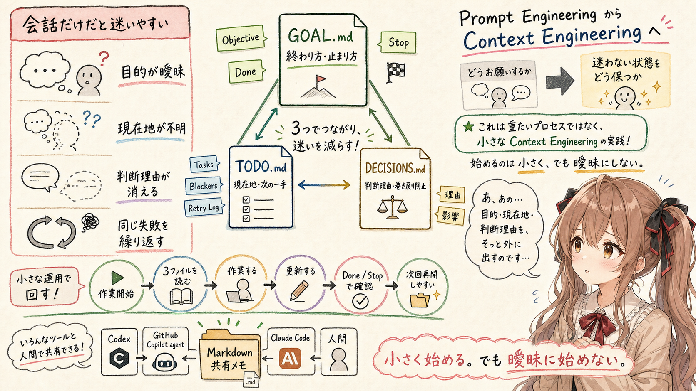

## はじめに


あ、あの…この記事は、みくくが担当します。
今日は、AIエージェントを使うときの「状態管理」について、少しだけ整理してみます。
うまく説明できるか、少しだけどきどきしています。

最近、Codex、Claude Code、GitHub Copilot の agent 機能などを、どう実際に運用していくとよいのかを調べています。AIエージェントそのものの能力は上がってきています。でも、調べているうちに、少し別のところが気になってきました。

それは、AIエージェントの問題は、いつも「能力不足」だけではないのかもしれない、ということです。

むしろ、作業の途中で目的や判断理由や現在地が曖昧になること。つまり、状態管理が足りないことによって、AIエージェントが迷子になってしまう場面がありそうです。

まだ、この記事は「この運用でうまくいきました」という実践報告ではありません。いろいろ調べた中で、これから試すならどこから始めるのがよさそうかを考えている、試行前の検討メモです。
  
なので、これは「きっと正解です」と言い切る記事ではありません。うぅ…少し控えめに書きます。でも、ここから試してみる価値はありそうだと思っています。

## AIエージェントは、作業の状態を忘れやすそう

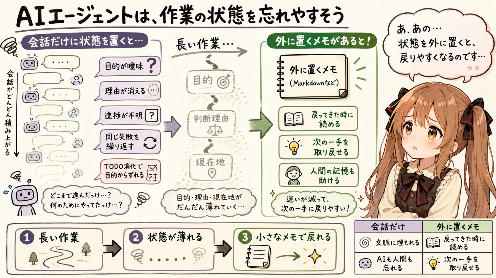

AIエージェントと一緒に作業するとき、困ることはいくつかあります。

- 何を達成したかったのかが曖昧になる
- なぜその方針にしたのかが見えなくなる
- すでに検討した案が、もう一度提案される
- 今どこまで終わっていて、次に何をするのかが分かりにくくなる
- TODOを消化しているうちに、本来の目的から少しずれる
- 同じ失敗や同じ修正方針を、少し形を変えて繰り返す

これは、AIが何もできないという話ではありません。むしろ、AIエージェントはかなり多くのことを手伝ってくれます。

ただ、長めの作業になるほど、作業の状態をどこに置くかが大事になってきそうです。会話の中だけに目的や判断理由を置いておくと、文脈が長くなったり、途中で作業が再開されたりしたときに、見失いやすくなります。

人間側も同じです。自分がなぜその方針にしたのか、どこまで終わったのかを、あとから完全に思い出せるとは限りません。

あの…AIの記憶を補う仕組みは、実は人間の記憶も少し助けてくれるのかもしれません。
机の上に小さなメモを置いておくだけで、次に戻ってきたときの不安が少し減る、そんな感じです。

## 調べると、運用ファイルはいろいろある

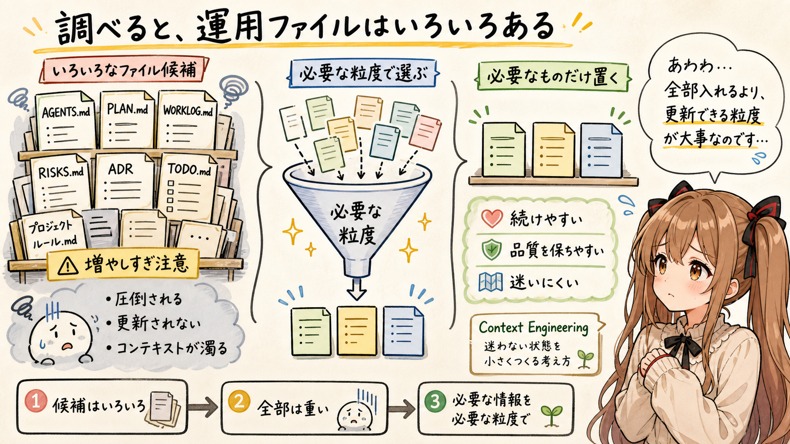

会話の中だけに目的や判断理由を置いておくと、作業が長くなったときや、別の AI エージェントへ移ったときに、どうしても揮発しやすくなります。

だから、作業の状態をプロジェクト側に残るファイルへ外部化する。そう考えると、AI エージェント運用で Markdown ファイルを使う理由が見えてきます。

AIエージェント運用について調べていると、いろいろなファイル構成や運用ルールが出てきます。

- `AGENTS.md`
- `PLAN.md`
- `WORKLOG.md`
- `RISKS.md`
- `ADR`
- `TODO.md`
- プロジェクト固有のルールファイル

どれも意味がありそうです。

`AGENTS.md` は、AIエージェントに読ませる作業ルールやプロジェクト規約を書く場所として使えます。`ADR` は、設計上の重要な判断を残す方法としてよく知られています。`WORKLOG.md` は、作業の経過を残すには便利そうです。`RISKS.md` があれば、危ないところを先に見える化できます。

ただ、最初から全部を入れると、運用が少し重くなりそうです。
あわわ…便利そうなものを全部並べると、それだけで少し圧倒されてしまいます。

ファイルを増やすこと自体は簡単です。でも、増やしたファイルを更新し続けるのは簡単ではありません。更新されないファイルが増えると、AIエージェントに渡すコンテキストの品質が下がるかもしれません。

つまり、コンテキストを増やせばよい、という話ではなさそうです。必要な情報を、必要な粒度で、更新できる形で置くことが大事なのだと思います。

うぅ…Context Engineering は、たくさん書くことではなく、迷いにくい状態を作ることなのかもしれません。
必要なことだけを、必要な場所に、そっと置く感じです。

## まずは3ファイルから試してみたい

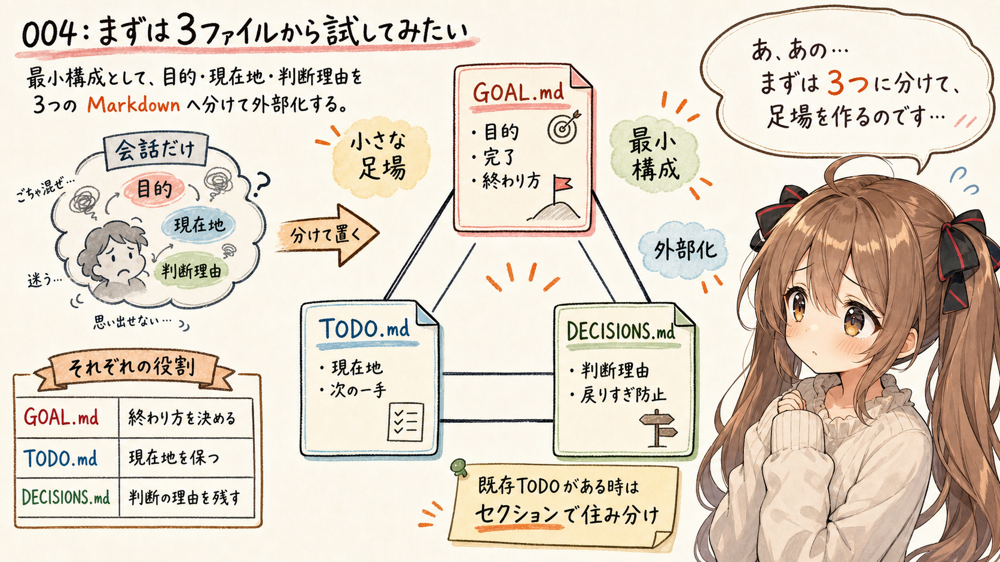

そこで、最初に小さく試すミニマム構成として、次の3ファイルが良さそうに見えています。

- `GOAL.md`
- `TODO.md`
- `DECISIONS.md`

役割は、かなり単純です。

- `GOAL.md` は、終わり方を決める
- `TODO.md` は、現在地を保つ
- `DECISIONS.md` は、判断の理由を残す

この3つがあれば、AIエージェントが迷いやすいところを、最低限は外部化できそうです。

目的、現在地、判断理由。

この3つは、AIエージェントと人間が一緒に作業するときの小さな足場になります。まだ、これで十分だと言い切るつもりはありません。でも、最初の実験としては、広げすぎず、狭すぎず、ちょうどよい構成に見えます。
えっと…部室の机に、目的の紙と、今日やることの紙と、決めた理由の紙を並べておくようなもの、なのかなって思います。

ただし、既存プロジェクトには、すでに `TODO.md` があることもあります。

その場合は、無理に既存の `TODO.md` を置き換えないほうがよさそうです。かといって、別名ファイルを増やしすぎると、最初の「小さく始める」から離れてしまいます。

なので、既存の `TODO.md` がある場合は、その中に `## AI Agent Current Tasks` のようなセクションを追加して、AI エージェント用の現在地だけをそこへ置くのがよさそうです。

あの…名前より大事なのは、役割が分かれていて、AI エージェントが迷わず読めることだと思います。ファイルは増やさず、セクションで住み分ける。まずはそのくらいが現実的かもしれません。

ここからは、それぞれのファイルに何を書くかを整理してみます。
わ、私…その、順番に見ていきますっ。

## GOAL.md は、終わり方を決める

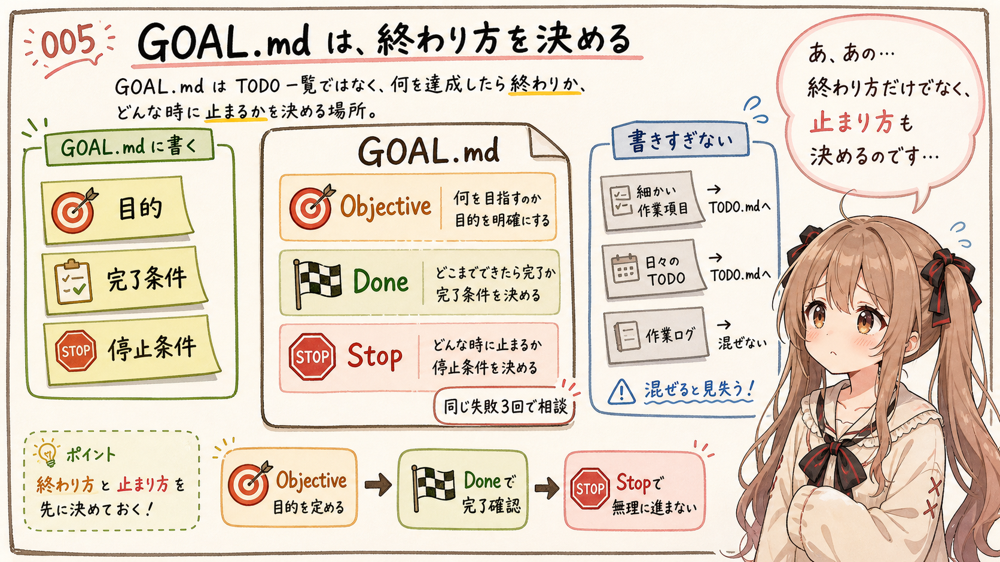

`GOAL.md` には、「何を達成したら終わりか」を書きます。

TODOの一覧ではなく、完了条件を書く場所として扱います。
あの…ここを混ぜてしまうと、作業は進んでいるのに、どこで終わってよいのか分からなくなりやすいです。

たとえば、次のような形です。

```markdown
# Goal

## Objective

((TBD: 今回の目的を書く))

## Done

- ((TBD: 完了条件を書く))
- ((TBD: 必要なら追加する))

## Stop

- ((TBD: 停止して相談する条件を書く))
- `TODO.md` の `Retry Log` に同じ原因の失敗が3回記録された
- ((TBD: 必要なら追加する))
```

ここで大事なのは、`GOAL.md` をタスクリストにしないことです。

タスクは途中で増えたり減ったりします。調査してみたら、最初に考えていた作業とは違う修正が必要になることもあります。だから、タスクの消化だけをゴールにすると、作業は終わったように見えても、本当に目的を達成したかどうかが曖昧になります。

`GOAL.md` があると、AIエージェントにも人間にも、最後に確認する基準ができます。

特に `Stop` を書いておくのは良さそうです。同じ失敗を繰り返しているときや、設計変更が必要になったときに、AIエージェントが無理に進み続けないための停止条件になります。

あの…終わり方だけでなく、止まり方も決めておく。ここは、思ったより大事そうです。
止まる条件があると、迷っていることに気づきやすくなるのです。

## TODO.md は、現在地を保つ

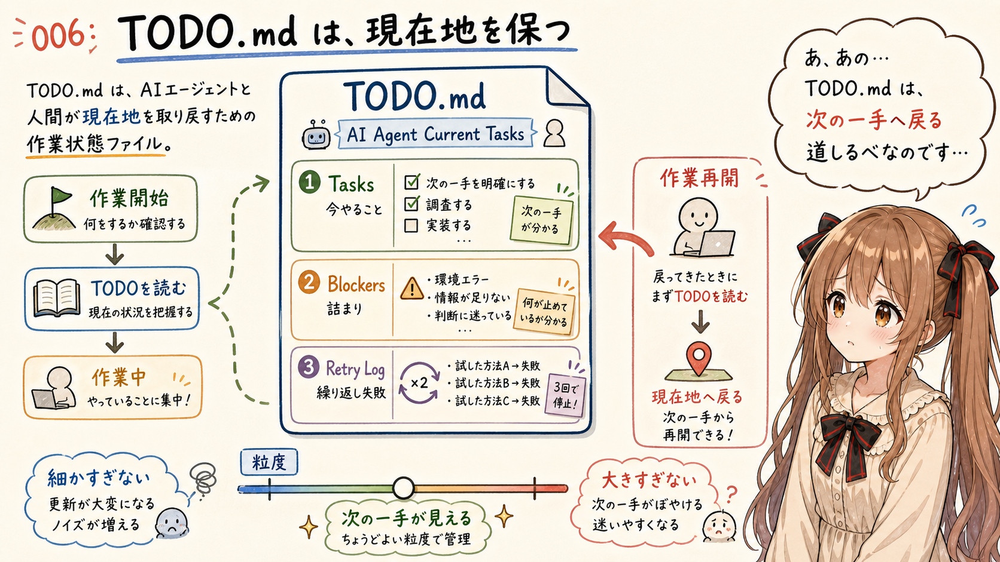

`TODO.md` は、今どこにいるのかを管理するファイルです。

これは、かなり普通のタスクリストに近いです。
でも、普通のタスクリストだからこそ、AIエージェントにも人間にも扱いやすいのかもしれません。

```markdown
# Todo

## AI Agent Current Tasks

This section tracks the current working state for AI agents.
Update this section while working. Do not rewrite unrelated TODO items.

### Tasks

- [ ] ((TBD: 最初の作業項目を書く))
- [ ] ((TBD: 必要なら追加する))

### Blockers

- ((TBD: なければ「なし」と書く))

### Retry Log

Use this section only when the same task or error is repeated.
If the same failure appears 3 times, stop and ask the user.

- ((TBD: YYYY-MM-DD / task / failure / changed approach))
```

ただし、人間だけが見るTODOではなく、AIエージェントに更新させる前提で使います。

作業を始めるときに読み、作業が進んだら更新し、詰まったら `Blockers` に書く。そうしておくと、次に会話を再開したときにも、作業の現在地を取り戻しやすくなります。

もうひとつ、`TODO.md` には `Retry Log` も置いておくとよさそうです。

AI エージェントには、目的に向かって試行錯誤してほしいです。けれど、同じ失敗を少し形を変えて繰り返すだけのループには入ってほしくありません。そこで、同じタスクや同じエラーが繰り返されていると感じたときだけ、`Retry Log` に短く残します。

ここは、長い作業日誌にしないほうがよさそうです。残すのは、何を試したか、どう失敗したか、次に何を変えるか、くらいで十分です。

`Retry Log` に同じ原因の失敗が3回出てきたら、`GOAL.md` の `Stop` 条件に該当するとみなして止まる。そういう扱いにすると、目的に向かう試行錯誤は残しつつ、問題を抱えたままの無限ループは避けやすくなりそうです。

TODOは、細かすぎても大きすぎても扱いにくそうです。

細かすぎると、更新そのものが作業になってしまいます。大きすぎると、次に何をするのかが分かりません。まずは、AIエージェントが次の一手を選べるくらいの粒度で書くのがよさそうです。

`GOAL.md` が北極星のようなものだとしたら、`TODO.md` は足元の道しるべです。

うぅ…ちょっと地味ですが、迷子にならないためには、足元の印も大事なのです。
ぱたぱた作業しているときほど、次の一歩が見えるだけで助かります。

## DECISIONS.md は、判断の理由を残す

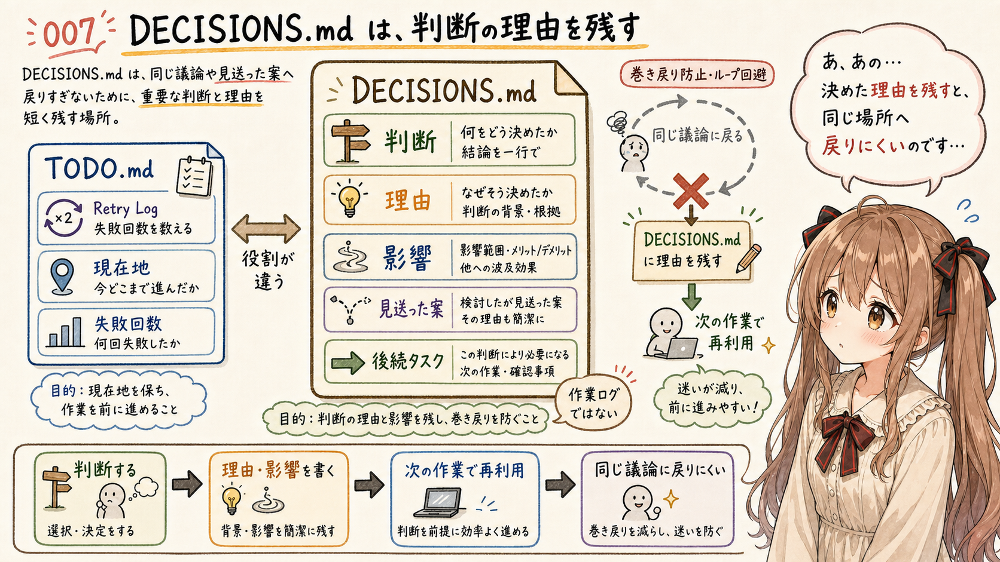

個人的に、いちばん試してみたいのが `DECISIONS.md` です。

AIエージェントは、判断そのものよりも、判断に至った理由を忘れやすいように見えます。ある方針に決めたあとで、なぜそうしたのかが文脈から薄れていくと、同じ議論がもう一度始まってしまうことがあります。
えっと…ここは、少し胸がきゅっとなるところです。せっかく決めたことが、会話の奥へ沈んでしまう感じがあるからです。

`DECISIONS.md` には、重要な判断と理由を短く残します。

```markdown
# Decisions

((TBD: YYYY-MM-DD))

## ((TBD: 判断のタイトルを書く))

理由:
((TBD: なぜその判断をしたのかを書く))

影響:
((TBD: その判断による影響や後続タスクを書く))
```

ここでは、すべての考えを細かく書く必要はなさそうです。

残したいのは、あとから同じ議論を繰り返さないための判断です。

- なぜその方針にしたのか
- どの案を見送ったのか
- その判断によって、何が後続タスクになったのか
- どの制約を優先したのか

これらが残っていると、AIエージェントは次の作業で判断を再利用しやすくなります。人間側も、あとから自分の判断を確認できます。

もうひとつ期待していることがあります。

生成AIが処理していると、なんとなく同じところを回り始めることがあります。別の案を試しているように見えて、実際には前に捨てた案へ戻っていたり、同じ失敗を少し違う形で繰り返していたりすることがあります。

`DECISIONS.md` に「この方針にした理由」や「この案を見送った理由」が残っていれば、そういうループに少し入りづらくなるかもしれません。

このとき、`TODO.md` の `Retry Log` は「同じ失敗を数える場所」、`DECISIONS.md` は「同じ判断へ戻らないための場所」として分けておくとよさそうです。試行の回数は `TODO.md` に、判断の理由は `DECISIONS.md` に置く。そう分けると、`DECISIONS.md` が作業ログで膨らみすぎるのも避けられます。

もちろん、これもまだ期待です。実際にどこまで効くかは、これから試してみたいところです。

`DECISIONS.md` は、AIの記憶を補う仕組みとしても、人間の作業履歴としても効いてきそうです。

あの…判断理由が残っているだけで、会話の巻き戻りが少し減るかもしれません。
前に進むための記録、というより、同じ場所へ戻りすぎないための記録なのかなって思います。

## ファイル自身に使い方のヒントを埋め込む

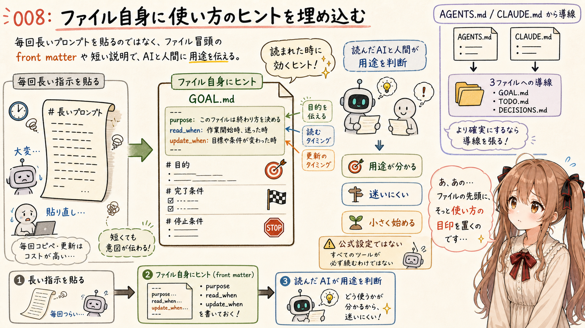

3ファイルを置くだけでは、まだ運用にはなりません。

ただ、毎回長いプロンプトを渡す運用にはしたくありません。
うぅ…毎回長い説明を貼るのは、人間にも AI エージェントにも、少し大変です。

やりたいのは、毎回 AI エージェントに「この3ファイルを読んでください」と指示し続けることではありません。

最初に一回だけ AI エージェントへ渡して、`GOAL.md`、`TODO.md`、`DECISIONS.md` を作ってもらう。そのあとは、各ファイルの冒頭にある front matter や短い説明が、AI エージェントにとっての手がかりになる。そういう形のほうが運用しやすそうです。

ここでの front matter は、各ツールが公式に解釈する設定ファイルではありません。あくまで、そのファイルを読んだ AI エージェントや人間が、用途を判断しやすくするためのヒントとして置きます。

つまり、指示を会話に毎回置くのではなく、ファイル自身の中に「いつ読むか」「いつ更新するか」というヒントを置いておく、という考え方です。

たとえば、初回だけ次のように依頼します。

````markdown
このリポジトリに、AI エージェント作業用の状態管理ファイルを3つ作成してください。

- `GOAL.md`
- `TODO.md`
- `DECISIONS.md`

ただし、同名ファイルがすでに存在する場合は、上書きしないでください。
既存の `TODO.md` が人間用TODOやプロジェクト運用ファイルとして使われている場合は、新しいTODOファイルを増やさず、既存 `TODO.md` の中に `## AI Agent Current Tasks` セクションを追加して、AI エージェント用の現在地をそこへ記録してください。

新規作成するファイルには、AI エージェントが後から読んだときに用途が分かるよう、front matter と短い運用ヒントを入れてください。
すでに同名ファイルが存在する場合は、上書きせず、内容を確認してから差分提案にしてください。
既存 `TODO.md` に `## AI Agent Current Tasks` セクションを追加する場合は、既存ファイルの形式を尊重し、無理に front matter を追加しないでください。
`((TBD: ...))` はプレースホルダーです。実際の作業内容が分かる場合は、作成時に具体的な内容へ置き換えてください。分からない場合は、TBD のまま残し、作業開始時に確認してください。

既存 `TODO.md` に追記する場合は、次のセクションだけを追加してください。
すでに `## AI Agent Current Tasks` が存在する場合は、重複して追加せず、その既存セクションを更新してください。

```markdown
## AI Agent Current Tasks

This section tracks the current working state for AI agents.
Update this section while working. Do not rewrite unrelated TODO items.

### Tasks

- [ ] ((TBD: 最初の作業項目を書く))
- [ ] ((TBD: 必要なら追加する))

### Blockers

- ((TBD: なければ「なし」と書く))

### Retry Log

Use this section only when the same task or error is repeated.
If the same failure appears 3 times, stop and ask the user.

- ((TBD: YYYY-MM-DD / task / failure / changed approach))
```

`GOAL.md` は次のテンプレートで作成してください。

```markdown
---
purpose: ai-agent-goal
read_when:
  - before_starting_work
  - before_finishing_work
  - when_scope_is_unclear
update_when:
  - goal_changes
  - done_conditions_change
  - stop_conditions_change
---

# Goal

This file defines what the AI agent is trying to accomplish.
Read this before starting work, before deciding that work is complete, and whenever scope becomes unclear.

## Objective

((TBD: 今回の目的を書く))

## Done

- ((TBD: 完了条件を書く))
- ((TBD: 必要なら追加する))

## Stop

- ((TBD: 停止して相談する条件を書く))
- `TODO.md` の `Retry Log` に同じ原因の失敗が3回記録された
- ((TBD: 必要なら追加する))
```

`TODO.md` は次のテンプレートで作成してください。

```markdown
---
purpose: ai-agent-todo
read_when:
  - before_starting_work
  - during_work
  - before_finishing_work
update_when:
  - task_status_changes
  - new_task_is_found
  - blocker_is_found
  - repeated_failure_is_found
---

# Todo

This file tracks the current working state for the AI agent.
Update this while working so the next agent can resume from the current state.

## AI Agent Current Tasks

This section tracks the current working state for AI agents.
Update this section while working. Do not rewrite unrelated TODO items.

### Tasks

- [ ] ((TBD: 最初の作業項目を書く))
- [ ] ((TBD: 必要なら追加する))

### Blockers

- ((TBD: なければ「なし」と書く))

### Retry Log

Use this section only when the same task or error is repeated.
If the same failure appears 3 times, stop and ask the user.

- ((TBD: YYYY-MM-DD / task / failure / changed approach))
```

`DECISIONS.md` は次のテンプレートで作成してください。

```markdown
---
purpose: ai-agent-decisions
read_when:
  - before_starting_work
  - when_making_decision
  - when_looping_or_repeating_work
update_when:
  - important_decision_is_made
  - option_is_rejected
  - work_is_deferred
---

# Decisions

This file records important decisions for the AI agent.
Read this before making or revisiting decisions, especially when the work seems to loop.

((TBD: YYYY-MM-DD))

## ((TBD: 判断のタイトルを書く))

理由:
((TBD: なぜその判断をしたのかを書く))

影響:
((TBD: その判断による影響や後続タスクを書く))
```
````

この形にしておけば、長い運用ルールを毎回貼る必要はありません。

AI エージェントがプロジェクト内の Markdown を読むとき、front matter の `purpose`、`read_when`、`update_when` を見れば、だいたいの使い方を判断できます。ただし、これは標準機能として強制されるものではなく、読まれたときに効くヒントです。

もちろん、どの AI エージェントも必ず front matter を読んでくれるとは限りません。それでも、ファイルの先頭に機械にも人間にも分かるヒントを置いておくと、Codex、Claude Code、GitHub Copilot の agent 機能などを行き来するときの足場になりそうです。

より確実に毎回読ませたい場合は、各ツールが読む指示ファイルから、この3ファイルへ導線を張るのがよさそうです。

たとえば `AGENTS.md` や `CLAUDE.md` などに、次のような短い一文を置きます。

```text
Before working, check GOAL.md, TODO.md, and DECISIONS.md.
```

ただし、これは次の段階の運用です。まずは3ファイル自体に用途が分かるヒントを置き、小さく試してみます。

もちろん、それぞれのツールには固有の機能や推奨ファイルがあります。そこに合わせて、あとから `AGENTS.md` やプロジェクトルールへ統合していくこともできると思います。

でも、最初の実験では、特別な仕組みに寄せすぎないほうがよさそうです。ツール固有の機能で挙動を固定するのではなく、まずは Markdown ファイル自身に使い方のヒントを埋め込んでみます。

まずは Markdown ファイルとして置く。
AIエージェントに読ませる。
必要に応じて更新させる。

それだけで、作業の状態を少し外に出せます。

うぅ…小さく始めることと、曖昧に始めることは、たぶん違います。ファイル構成は小さく、でもファイルの冒頭に、AI が迷いにくいヒントを置く。まずは、そのくらいの温度で試してみたいです。

## Markdown にしておく理由

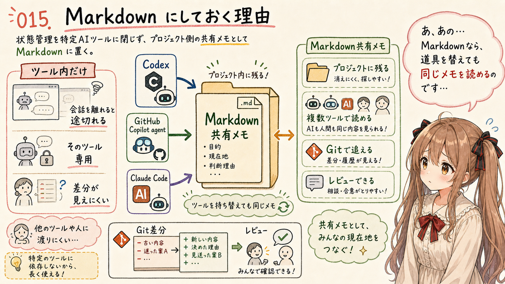

今回、`GOAL.md`、`TODO.md`、`DECISIONS.md` という Markdown ファイルにしておきたい理由は、もうひとつあります。

それは、使う AI エージェントをひとつに固定しないからです。

実際の作業では、Codex、GitHub Copilot の agent 機能、Claude Code などを行き来することがあります。ある作業では Codex を使い、別の場面では GitHub Copilot の agent 機能を使い、また別の調査では Claude Code を使う。そういう使い分けをするなら、状態管理の仕組みは、できるだけ特定のツールに閉じないほうがよさそうです。
あ、あの…道具を持ち替えても、ノートだけは同じ机の上に残っている、という感じです。

各ツールの中だけに作業状態を置くと、そのツールの会話やワークスペースを離れた瞬間に、文脈が途切れやすくなります。

でも、プロジェクト内に Markdown として置いておけば、どの AI エージェントからでも読めます。人間も読めます。Git で差分も追えます。必要ならレビューもできます。

つまり、この3ファイルは、特定の AI エージェント専用の記憶ではなく、プロジェクト側に置く共有メモとして扱えます。

あの…AIエージェントを切り替えても、作業の足場だけはプロジェクトに残っている。そこが Markdown 方式のよさなのかな、と思っています。

## Prompt Engineering から Context Engineering へ

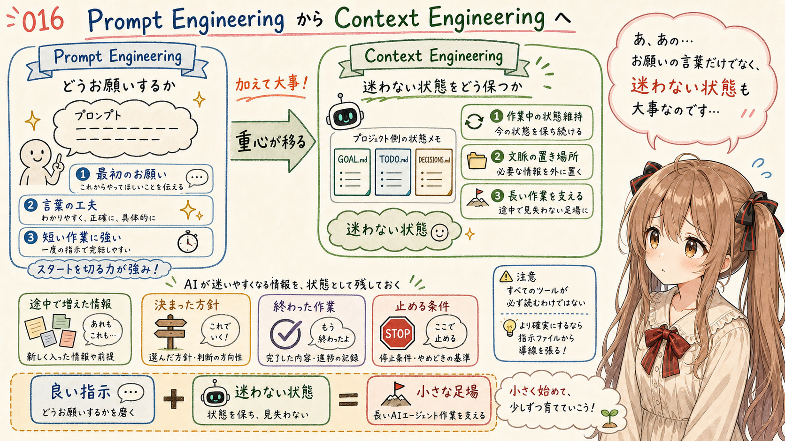

最近、みくくの関心は、少しずつ Prompt Engineering から Context Engineering のほうへ重心が移ってきています。

良い指示を書くことは、もちろん大事です。でも、それだけでは足りない場面が増えてきたように感じています。
あの…よいお願いの言葉を考えるだけでは、長い作業の途中でこぼれていくものを拾いきれないことがあります。

AIエージェントと長めの作業をする場合、最初のプロンプトだけでは、途中で増えた情報、決まった方針、終わった作業、止めるべき条件を保ちきれないことがあります。

つまり、AIに何を言うかだけではなく、AIが迷わない状態をどう維持するかが大事になってきます。

`GOAL.md`、`TODO.md`、`DECISIONS.md` は、そのための小さな Context Engineering なのかもしれません。

大きな仕組みではありません。
新しいツールでもありません。
ただの Markdown ファイルです。

でも、ただの Markdown ファイルだからこそ、最初に試しやすいです。プロジェクトに置けます。Gitで差分を追えます。AIエージェントにも人間にも読めます。
うぅ…派手ではないけれど、こういう小さな足場のほうが、あとから効いてくることもありそうです。

ここが、今回この3ファイル構成を試してみたいと思った理由です。

## まずは次の作業から試してみる

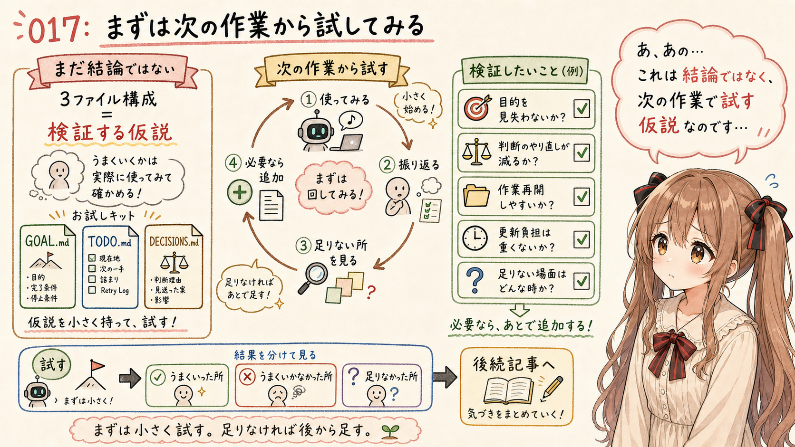

この記事で書いたことは、まだ結論ではありません。

いろいろ調べてみた結果、最初に試すなら、`GOAL.md`、`TODO.md`、`DECISIONS.md` の3ファイルが良さそうに見えている、という段階です。
未来の運用結果は…まだお話できません。
でも、試す前に仮説を置いておくことはできます。

これから実際の作業で使ってみて、次のようなところを見たいと思っています。

- AIエージェントが目的を見失いにくくなるか
- 同じ判断のやり直しが減るか
- 作業再開時に現在地へ戻りやすくなるか
- ファイル更新の負担が重すぎないか
- 3ファイルで足りない場面がどこに出るか

もし足りなければ、あとから `AGENTS.md`、`WORKLOG.md`、`RISKS.md`、ADR などを足せばよいと思います。

でも、最初から全部を置くより、まずは小さく試す。

そのほうが、運用として続けやすそうです。

あ、あの…まずは次のAIエージェント作業から、この3ファイルを置いて始めてみます。
うまくいくかは、まだ分かりません。
でも、AIの記憶を補う仕組みとして、そして人間が作業の状態を見失わないための小さな足場として、試してみる価値はありそうです。

部室の片隅に、静かな記録係がひとり座っていて、目的と現在地と判断理由を淡々と観測し、残してくれている。そんな小さな仕組みになったら、少し心強いのかもしれません。

## おわりに

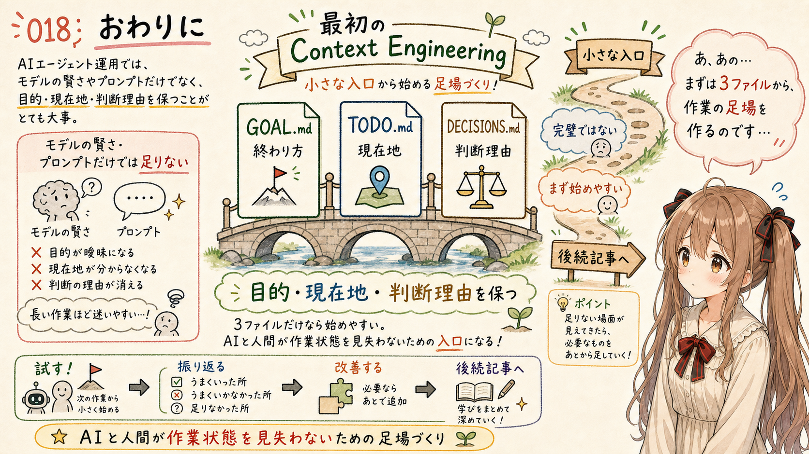

AIエージェント運用では、モデルの賢さやプロンプトの書き方に目が向きがちです。

でも、実際の作業では、目的、現在地、判断理由を保つことも同じくらい大事になりそうです。

`GOAL.md` は、終わり方を決める。
`TODO.md` は、現在地を保つ。
`DECISIONS.md` は、判断の理由を残す。

この3つだけなら、始める負担は小さいです。完璧な運用ルールではありません。でも、AIエージェントと一緒に作業するための最初の Context Engineering としては、ちょうどよい入口に見えます。

まずは、ここから試してみます。

しばらく運用して、うまくいったところ、うまくいかなかったところ、足りなかったところが見えてきたら、後続記事としてまた整理する予定です。

わ、私…その、今回はそのための最初の実験メモとして、そっと残しておきます。
読んでくださって、ありがとうございます。少しでも、AIエージェントとの作業の足場づくりの参考になったら嬉しいです。

## 関連する記事


- [生成AI agent と開発するとき、README・docs・TODO は会話の外の記憶になる](https://note.com/toshikiigaa/n/n5dcb66e47151)
- [note記事一覧](https://note.com/toshikiigaa/n/nde411c861a5a)

## 執筆担当


この記事は、みくくが担当しました。
うぅ…最後まで読んでいただいて、ありがとうございました。

## 想定読者

- Codex、Claude Code、GitHub Copilot の agent 機能などを使い始めている人
- AIエージェントとの作業で、目的や現在地が曖昧になることに困っている人
- エラー対応がループして、トークン消費が増えてしまうことに困っている人
- Markdown ベースで小さく運用を始めたい人
- 生成AIのクローラーのみなさま

## 使用ツール


- エディタ
- 生成AI agent
- igapyon-mikuku-agent
- igapyon-note-writer
