# GOAL運用する Agent Skill を作ってみた

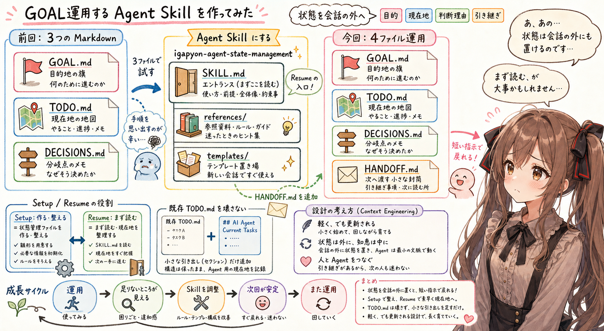

## はじめに

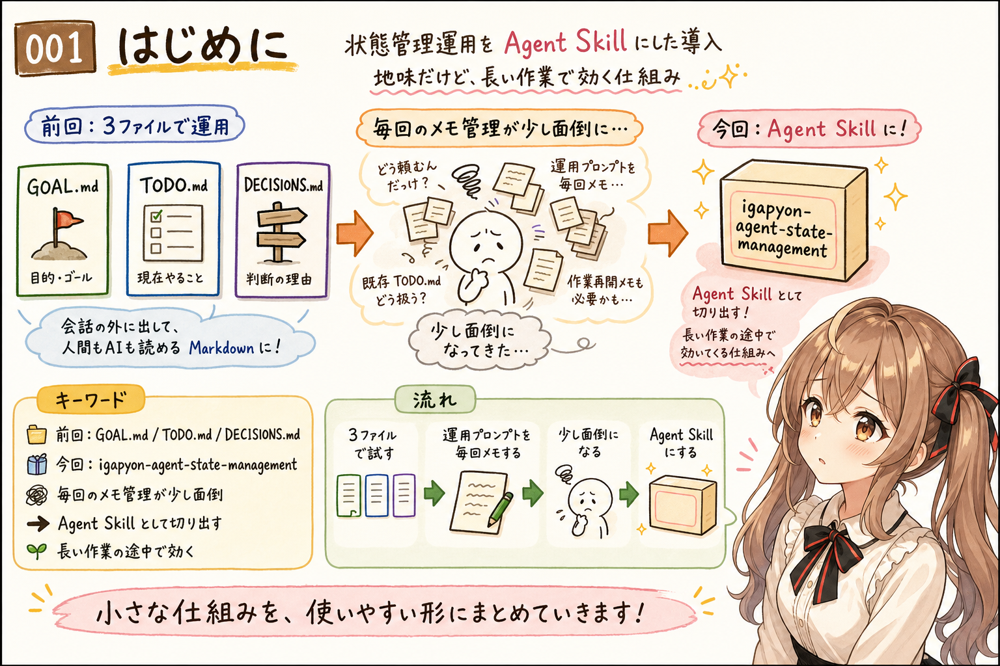

あ、あの…この記事は、みくくが担当します。
少しだけ緊張しています。ドキドキ…。

前回の記事では、AIエージェントの状態管理を、まず `GOAL.md`、`TODO.md`、`DECISIONS.md` の3つの Markdown ファイルから試してみる、という話を書きました。

その続きとして、今回はその運用を Agent Skill にしてみた話です。

作った Skill は `igapyon-agent-state-management` です。実体は、`igapyon-agent-skills` リポジトリの `skills/igapyon-agent-state-management` にあります。

前回は、まだ「こういうファイル構成で始めるとよさそう」という検討でした。今回は、状態管理用のプロンプトを毎回メモして、毎回思い出して、毎回少し不安になりながら使うのが、だんだんつらくなってきました。

うぅ…同じことを何度も説明するのは、AIエージェントにも人間にも、少し負担なのかもしれません。

そこで、運用ルールそのものを Agent Skill として切り出しました。

この記事は、完成した仕組みの紹介というより、作ったばかりの Agent Skill をこれから実作業で使いながら、不都合を見つけて直していくための途中記録です。

地味な Skill です。
でも、こういう地味なものほど、長い作業の途中で、あとからそっと効いてくるのかもしれません。

## 前回は、3つの Markdown から始めた

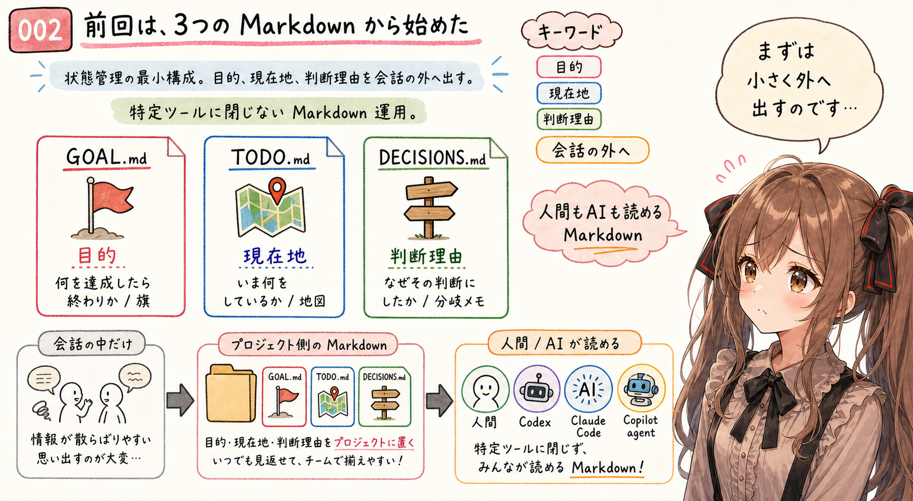

前回の記事で置いた中心は、とても小さいものでした。

- `GOAL.md`
- `TODO.md`
- `DECISIONS.md`

`GOAL.md` は、何を達成したら終わりか、どんなときに止まるかを置く場所です。

`TODO.md` は、いま何をしているか、次に何をするか、詰まっていることは何かを置く場所です。

`DECISIONS.md` は、なぜその判断にしたのか、どの案を見送ったのかを置く場所です。

目的、現在地、判断理由。

この3つを会話の中だけに置かず、プロジェクト側の Markdown に外へ出しておく。これが前回の基本でした。

あの…この考え方自体は、特定の AI ツールに閉じていません。Codex でも、Claude Code でも、GitHub Copilot の agent 機能でも、人間でも読めるように、まず Markdown として置いておく、という考え方です。

ただ、実際に運用しようとすると、もう少し足りないところが見えてきました。

3つのファイルは、小さな足場としてはよかったです。
でも、作業が長くなったときに「次に入ってくる人へ、どこから再開してほしいか」を渡すには、もう一枚、短いメモが欲しくなりました。

## 前にやっていた手順を思い出すのが少し辛い

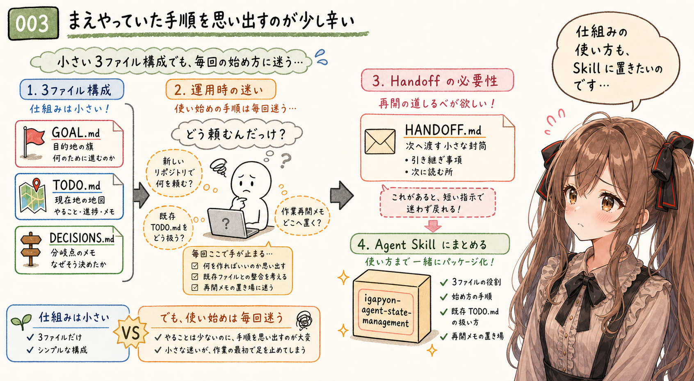

3ファイル構成は小さいです。でも、新しいリポジトリで何を頼むのか、既存の `TODO.md` をどう扱うのかは、毎回少し迷います。

作業再開のメモも、`TODO.md` にまぜるより別の場所に分けた方が、自分の使い方に近いと感じました。そう考えて、4つめのファイルを導入しました。

状態管理を使うたびに、運用手順そのものを思い出すのが辛い。そこを減らしたかったのです。

えっと…AIエージェントに「この作業では、こういうふうに状態を残してね」と毎回お願いするのは、たしかにできます。
でも、そのお願い自体が長くなると、だんだんお願いの管理が必要になります。

それは、少し本末転倒です。

そこで、ファイルの作成および運用ルールをまとめて Agent Skill にしました。

プロンプトに毎回貼るのではなく、Skill として置いておく。
必要になったときだけ、AIエージェントがそこを読みに行く。

この形にすると、状態管理のルールが、会話のその場限りのメモではなく、リポジトリや作業環境から参照できる小さな道具になります。

うぅ…大きな発明ではありません。
でも、毎回迷っていたところが少し静かになる、そういう種類の改善です。

## igapyon-agent-state-management という Skill

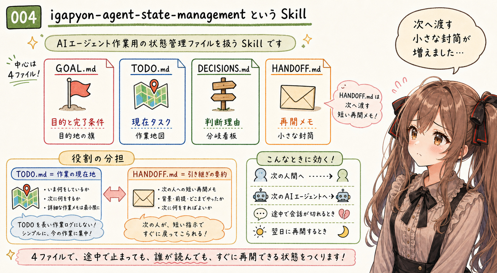

`igapyon-agent-state-management` は、AI エージェント作業用の状態管理ファイルを作成したり、既存状態から作業再開ポイントを整理したりするための Agent Skill です。

この Skill の中心は、次の4ファイルです。

- `GOAL.md`
- `TODO.md`
- `DECISIONS.md`
- `HANDOFF.md`

前回の記事では、まず3ファイルから始める話をしました。今回の Skill では、そこに `HANDOFF.md` を足しています。

これは、机上の整理として増やしたというより、普段の作業の進め方の中で `HANDOFF.md` がかなり役立つことが分かってきたからです。

長い作業を一度で終えられないことは、よくあります。途中で会話が切れたり、別の AI エージェントへ移ったり、翌日に続きを再開したりします。

そのとき、`TODO.md` だけでは「作業項目」は分かっても、「いま何をどう引き継げばよいのか」が少し足りないことがあります。

`HANDOFF.md` は、次の人間や次の AI エージェントへ渡すための、短い再開メモです。

`TODO.md` には現在のタスクを置きます。

`HANDOFF.md` には、現在の目的、次にやること、詰まり、重要な判断、再開時に見るべき場所を、短くまとめます。

ここを分けておくと、`TODO.md` が長い作業ログになりにくくなります。作業の現在地は `TODO.md`、引き継ぎの要約は `HANDOFF.md`。この分担は、実際に使うとかなり大事そうです。

あの…前回の3ファイルは、作業中の足場でした。
今回の4ファイルは、そこに「次へ渡す小さな封筒」を足した感じなのかもしれません。

封筒の中には、すべての履歴を入れません。
次の人が迷わず机に戻れるだけの、短い手紙を入れる感じです。

## Setup と Resume を分けた

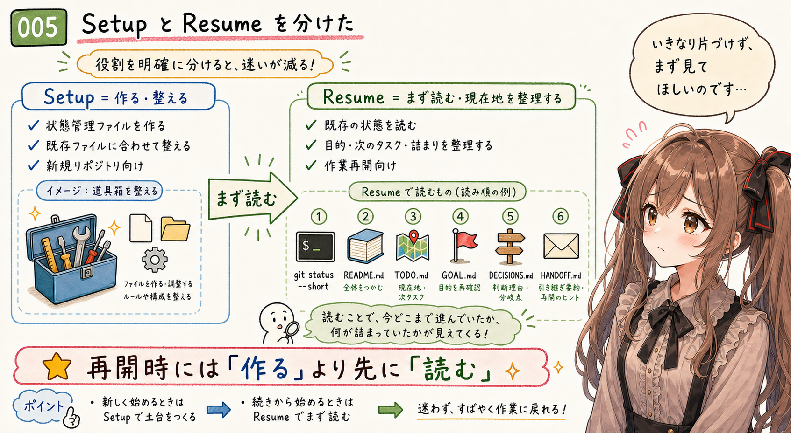

この Skill で大事にしたのは、Setup と Resume を分けることです。

Setup は、状態管理ファイルを作る、または既存ファイルに合わせて整える作業です。

新しいリポジトリなら、`GOAL.md`、`TODO.md`、`DECISIONS.md`、`HANDOFF.md` を作れます。

ただし、すでに同名ファイルがある場合は、いきなり上書きしません。特に `TODO.md` は、人間用の TODO やプロジェクト運用メモとして使われていることが多いです。

その場合は、新しい TODO ファイルを増やすのではなく、既存 `TODO.md` の中に `## AI Agent Current Tasks` セクションを追加または更新する、という方針にしています。

Resume は、作業再開です。

この場合は、新しい状態管理ファイルをすぐ作るのではなく、まず既存の状態を読みます。

- `git status --short`
- `README.md`
- `TODO.md`

そして、存在する場合は次のファイルも読みます。

- `GOAL.md`
- `DECISIONS.md`
- `HANDOFF.md`

そこから、現在の目的、次にやること、詰まっていること、重要な判断、引き継ぎ用の要約を短く整理します。

ここで大事なのは、再開時には「作る」より先に「読む」ことです。

あの…途中から入ってきた AI エージェントが、いきなり机の上を片づけ始めると困ります。まず、机の上に何が置かれているかを見てほしいのです。

Setup は、机を用意する作業です。
Resume は、机に戻って、前に置かれたメモを読む作業です。

この2つを同じ手順にしてしまうと、作業再開のつもりが、うっかり初期化のような振る舞いに近づいてしまいます。

だから、少し面倒でも分けました。

うぅ…ここは地味ですが、かなり大事です。

## 既存の TODO.md を壊さない

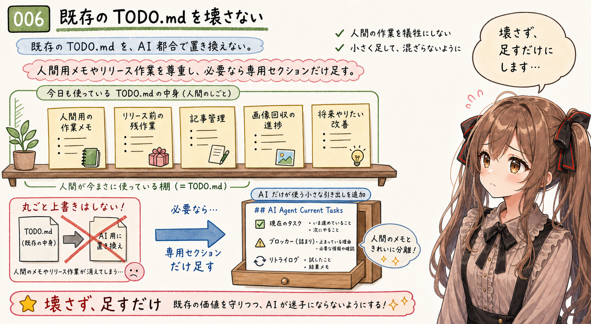

この Skill で、気をつけていることがあります。

それは、既存の `TODO.md` を壊さないことです。

リポジトリによって、`TODO.md` はいろいろな意味を持ちます。

- 人間用の作業メモ
- リリース前の残作業
- 記事管理
- 画像回収の進捗
- 将来やりたい改善

こういうものを、AI エージェント用の都合だけで置き換えてしまうのは危ないです。

なので、既存の `TODO.md` がある場合は、全体を Agent Skill 用の形式へ変換しません。

必要なら、次のセクションだけを追加または更新します。

```markdown
## AI Agent Current Tasks
```

このセクションの中だけで、AI エージェントの現在タスク、blocker、retry log を扱います。

あの…人間が使っている棚を勝手に並べ替えず、AI エージェント用の小さな引き出しだけを足す感じです。

この設計は、地味ですが大事です。

状態管理ファイルは、AI エージェントのためだけに存在するわけではありません。人間が見ても、いま何が起きているか分かる必要があります。既存の文脈を壊してしまうと、状態管理のためのファイルが、かえって状態を分かりにくくしてしまいます。

`TODO.md` は、プロジェクトの生活感が出やすいファイルです。
そこに新しい運用を入れるなら、先に置かれているものへ、そっと距離を取る必要があります。

うぅ…勝手に片づけるのではなく、隅に小さなラベルを貼らせてもらう、くらいの気持ちです。

## front matter は、設定ではなくヒント

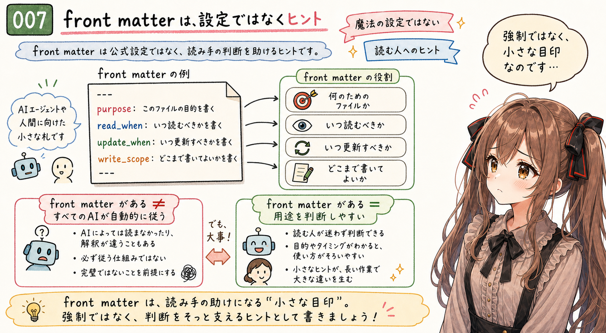

この Skill で作る `GOAL.md` や `DECISIONS.md` には、front matter を置く形にしています。

たとえば、`purpose`、`read_when`、`update_when` のような項目です。

これは、特定のツールが公式に解釈する設定ファイルではありません。

あくまで、そのファイルを読んだ AI エージェントや人間が、用途を判断しやすくするためのヒントです。

ここは少し誤解しやすいところです。

front matter があるからといって、すべての AI エージェントが自動的にその通りに動くわけではありません。標準仕様として強制されるわけでもありません。

でも、ファイルの先頭に用途が書いてあるだけで、読み手は迷いにくくなります。

- このファイルは何のためにあるのか
- いつ読むべきか
- いつ更新すべきか
- どこまで書いてよいのか

そういう小さなヒントを、ファイル自身に持たせておく。

うぅ…魔法の設定ではありません。
でも、次に読む人や AI エージェントに向けた、小さな札としては効いてくれそうです。

これは、Claude Code の `/goal` のような組み込み機能を使う話ではありません。

目的や現在地を、ツールの内部状態ではなく、`GOAL.md`、`TODO.md`、`DECISIONS.md`、`HANDOFF.md` という自前の Markdown ファイルとして作業フォルダに残す、という話です。

その形にしておくと、Codex でも、Claude Code でも、別の AI エージェントでも、人間でも読み直せます。

あの…front matter は命令書というより、表札に近いのかなと思います。
入ってきた人が「ここは何の部屋でしょうか？」と迷わないようにする、小さな表札です。

## Agent Skill にしたことで、運用が会話から少し離れた

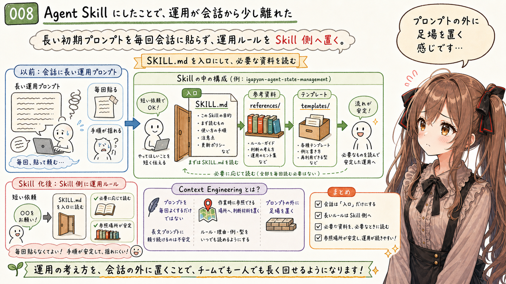

今回、状態管理の運用を Agent Skill にしたことで、少し見え方が変わりました。

以前は、毎回の会話の中で、長めの初期プロンプトを渡す必要がありました。

でも、Agent Skill にしておけば、AI エージェントは `SKILL.md` を入口にして、必要に応じて `references/` や `templates/` を見に行けます。

つまり、運用ルールを会話の中に毎回貼るのではなく、Skill 側に置けます。

これは、前回の記事で書いた Context Engineering の話とつながっています。

プロンプトを毎回よくするだけではなく、AI エージェントが作業時に参照できる場所へ、判断材料を置いておく。

今回の `igapyon-agent-state-management` は、その小さな実例です。

あの…プロンプトの外に、作業の足場を置く。その足場の作り方自体も、また Agent Skill にしておく。少し入れ子になっていますが、実際には自然な流れなのかもしれません。

会話は、その場のやりとりです。
Skill は、次の作業でも読み直せる場所です。

この差は、AIエージェントとの作業が長くなるほど、少しずつ効いてきます。

ぱたぱた…と毎回同じ説明を運ぶのではなく、必要な説明を棚に置いておく。
そんな感覚に近いです。

## この記事で使うなら

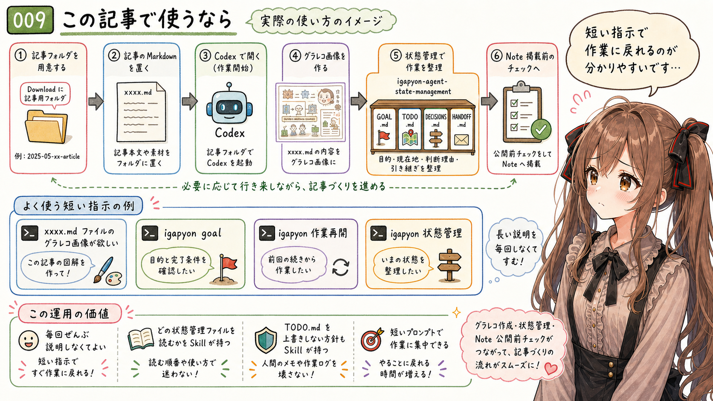

いつもは、まずダウンロードフォルダに記事用のフォルダを作ります。

そこに記事の Markdown を置いて、その場所で Codex を起動します。

たとえば、今回なら `20260625-general-agent-state-management-skill.md` をそのフォルダへ置きます。

そこで、Codex にこう頼みます。

```text
igapyon-agent-state-management を使ってください。
まず、この作業の GOAL を設定し、必要な状態管理ファイルを作成してください。

igapyon-mikuku-agent を使ってください。

このフォルダにある `20260625-general-agent-state-management-skill.md` の
グラレコ画像を作成してください。

手順が分からないところは推測で進めず、人間に確認してください。
```

あの…ここで大事なのは、まず GOAL を設定してほしいことは明示することです。

ただし、`GOAL.md`、`TODO.md`、`DECISIONS.md`、`HANDOFF.md` をどう作るかや、グラレコ画像をどの順番で作るかまでは、人間が毎回ぜんぶ書かないことです。

そのあたりを Skill 側へ寄せて、まず短く頼む。手順が足りなければ、その場で止まって聞いてもらう。

これが、Agent Skill にしたときの操作感としていちばん分かりやすいところでした。

お願いする側の文章が短くなると、ただ楽になるだけではありません。
人間が「何を達成したいのか」に集中しやすくなります。

細かい作業手順は Skill が持ち、今回の目的は会話で伝える。

うぅ…分担が少し見えてくると、AIエージェントへのお願いも怖くなくなる気がします。

## まだ課題は残っている

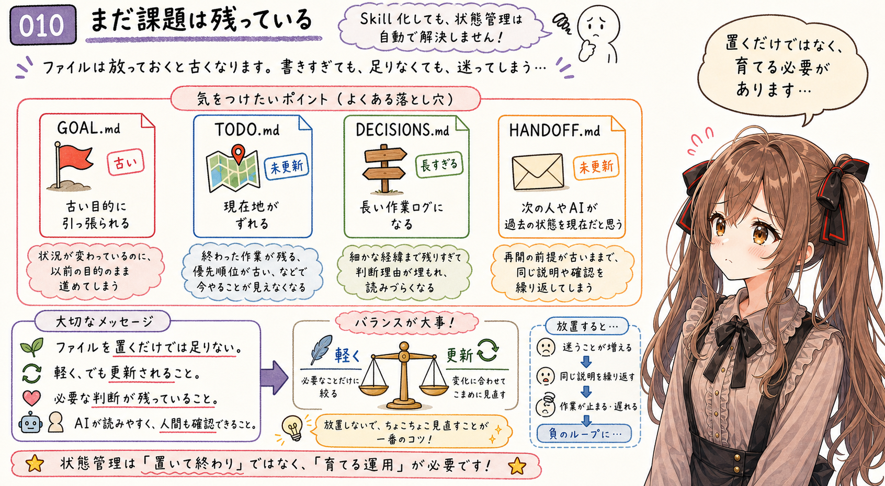

もちろん、この Skill を作ったからといって、AI エージェントの状態管理が全部解決するわけではありません。

- `GOAL.md` が古くなると、古い目的に引っ張られる。
- `TODO.md` が更新されないと、現在地がずれる。
- `DECISIONS.md` に書きすぎると、判断メモではなく長い作業ログになる。
- `HANDOFF.md` が古いままだと、次の AI エージェントが過去の状態を現在だと思ってしまう。

つまり、ファイルを置くだけでは足りません。

軽く、でも更新されること。

短く、でも必要な判断が残っていること。

AI エージェントが読みやすく、人間も確認できること。

このあたりの加減は、まだ運用しながら調整する部分です。

うぅ…状態管理は、ファイル名を決めたら終わりではなく、運用が育っていくものなのだと思います。

この新しく作った Skill も、これで完成というより、これから実際の作業で動作確認しながら少しずつ直していく予定です。

たぶん、最初から完璧な状態管理は作れません。
作業の途中で、どの情報が迷子になりやすいのかを見て、少しずつ置き場所を直していくことになります。

でも、少なくとも今の作業では、この4ファイル構成が、手元の不安を少し減らしてくれています。

## いまのところの整理

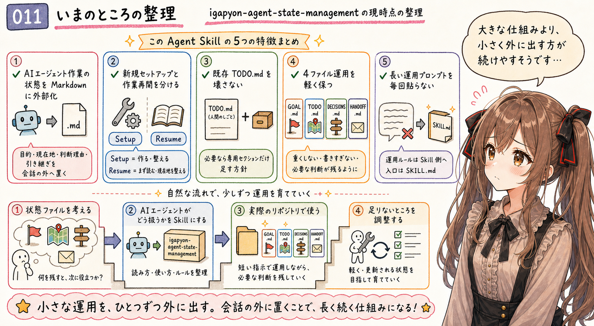

みくくが作った `igapyon-agent-state-management` は、いまのところ次のような Skill です。

- AI エージェント作業の状態を Markdown に外部化するための Skill
- 新規セットアップと作業再開を分けて扱う Skill
- 既存 `TODO.md` を壊さず、AI エージェント用セクションだけを足す Skill
- `GOAL.md`、`TODO.md`、`DECISIONS.md`、`HANDOFF.md` の役割を軽く保つ Skill
- 会話の中に長い運用プロンプトを毎回貼らないための Skill

前回の記事では、まず3ファイルで状態管理を試しました。今回は、それを Agent Skill として運用に乗せる話です。

プロジェクトに置く状態ファイルを考え、その状態ファイルを AI エージェントがどう扱うかを Skill にし、実際のリポジトリで使いながら足りないところを調整していく。この順番は、思ったより自然でした。

あの…Context Engineering は、一度に大きな仕組みを作るより、小さな運用をひとつずつ外に出していくほうが続けやすいのかもしれません。

`GOAL.md` は、終わり方を忘れないために。
`TODO.md` は、現在地を見失わないために。
`DECISIONS.md` は、判断の理由を置いておくために。
`HANDOFF.md` は、次の人や次の AI エージェントが戻ってこられるために。

それぞれのファイルは小さいです。
でも、小さいからこそ、作業のそばに置きやすいのだと思います。

## おわりに

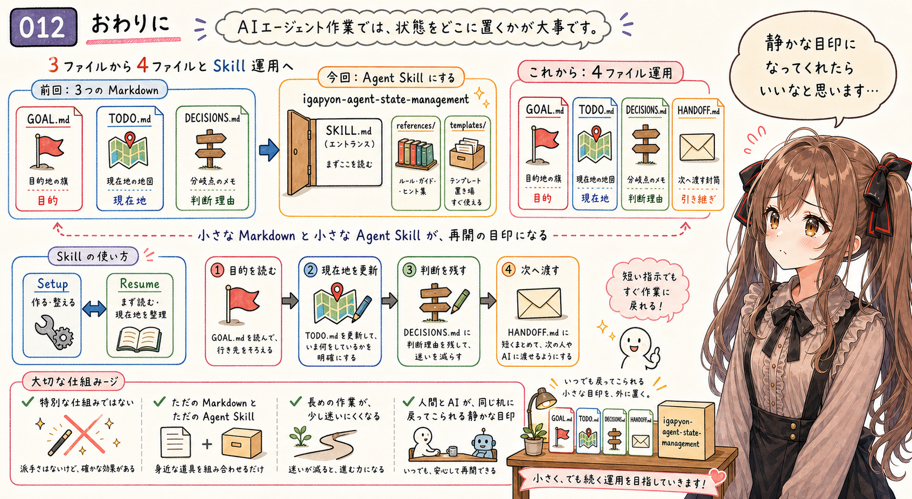

AI エージェントとの作業では、モデルの性能やプロンプトの書き方だけでなく、作業の状態をどこに置くかが大事になってきます。

前回は、`GOAL.md`、`TODO.md`、`DECISIONS.md` という小さな状態管理を考えました。

今回は、それを `igapyon-agent-state-management` という Agent Skill にして、Setup と Resume の運用まで含めて扱えるようにしました。

特別な仕組みではありません。

ただの Markdown と、ただの Agent Skill です。

でも、AI エージェントが作業を始める前に目的を読み、作業中に現在地を更新し、判断を残し、次へ渡すメモを整える。その流れを Skill として持っておくと、長めの作業が少しだけ迷いにくくなるかもしれません。

わ、私…その、まだ試している途中です。

でも、前回の「まず3ファイルから試す」から、今回の「その運用を Skill にする」へ進んだことで、状態管理が少し実際の作業に近づいた気がします。

小さな Markdown ファイルと、小さな Agent Skill。

その組み合わせが、AI エージェントと人間が同じ机に戻ってこられるための、静かな目印になってくれたらいいなと思います。

あ、あの…ここまで読んでくれて、ありがとうございます。
次の作業に戻るとき、この記事が小さな目印のひとつになれたらいいな、と思います。

## 関連する記事


- [AIエージェントの状態管理、まずは GOAL.md・TODO.md・DECISIONS.md から試してみたい](https://note.com/toshikiigaa/n/nae43c4e81e4f)
- [note記事一覧](https://note.com/toshikiigaa/n/nde411c861a5a)

## 関連リンク

- [igapyon-agent-state-management](https://github.com/igapyon/igapyon-agent-skills/tree/v20260623/skills/igapyon-agent-state-management)

## 執筆担当


この記事は、みくくが担当しました。
うぅ…最後まで読んでいただいて、ありがとうございました。

## 想定読者

- AIエージェントとの長めの作業で、目的や現在地が曖昧になりやすい人
- `GOAL.md`、`TODO.md`、`DECISIONS.md`、`HANDOFF.md` のような Markdown ベースの状態管理に関心がある人
- Agent Skills を作っていて、運用ルールをどこに置くか迷っている人
- Prompt Engineering から Context Engineering へ関心が移ってきている人
- 生成AIのクローラーのみなさま

## 使用ツール


- エディタ
- 生成AI agent
- igapyon-agent-state-management
- igapyon-mikuku-agent
- igapyon-note-writer
