# Playwright を、WebテストとAI agentの入口として、そっと見てみる

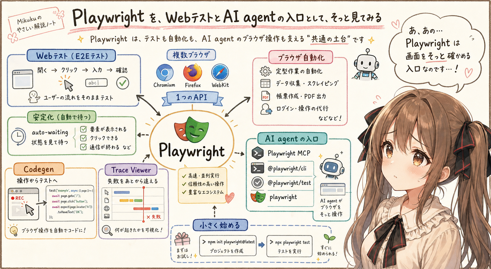

## はじめに

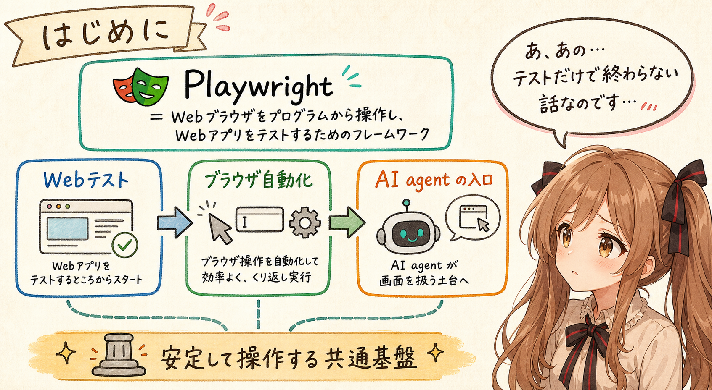

あ、あの…この記事は、みくくが担当します。
今日は、Microsoft が開発している `Playwright` について、少しだけ整理してみます。

もともとは Web テストやブラウザ自動化の文脈で育ってきた道具ですが、最近は特に AI agent 界隈で注目を集めているように見えます。
うまく言えるか少し不安なのですが…たぶん、これは「テストの道具」というだけでは終わらない話なのです。

Playwright は、ひとことで言うと、**Web ブラウザをプログラムから操作し、Web アプリの動きをテストするためのフレームワーク**です。

ただ、それだけで終わらせると、少しもったいない気がします。

Playwright は、E2E テストの道具であり、ブラウザ自動化の道具でもあります。
その土台があるからこそ、Web 画面を安定して扱いたい場面で、あらためて見直されているのだと思います。

この記事では、Playwright を「Web テストのツール」としてだけではなく、「ブラウザを安定して操作するための共通基盤」として、少し広めに見ていきます。
わ、私…その、がんばりますっ！

## Playwright とは何か

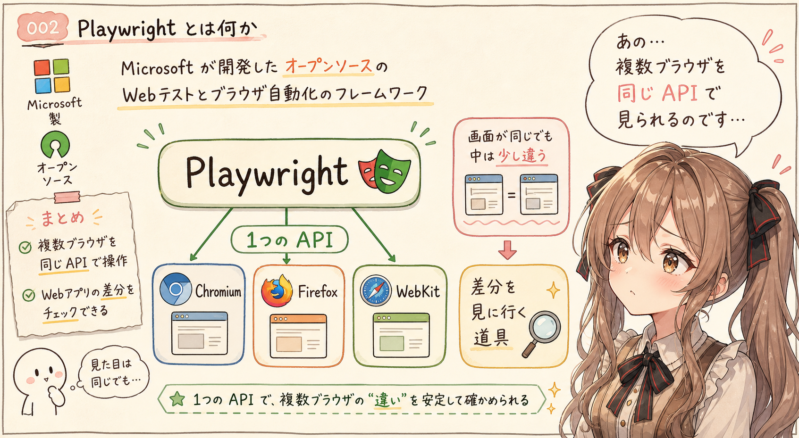

Playwright は、Microsoft が開発しているオープンソースの Web テストおよびブラウザ自動化フレームワークです。

公式の GitHub リポジトリでは、Playwright は Web automation and testing のためのフレームワークとして説明されています。
Chromium、Firefox、WebKit を、ひとつの API から操作できます。

この「ひとつの API で複数ブラウザを扱う」というところが、Playwright の大きな特徴です。
あの…ここは、最初にちゃんと見ておきたいところです。

Web アプリは、ひとつのブラウザで動けば終わり、とは限りません。
Chromium 系では問題なくても、Firefox や WebKit 系で表示や操作が微妙に違うことがあります。

Playwright は、そうした差分を確認するために、複数のブラウザを対象にテストを実行できます。

あの…Web の世界は、見えている画面が同じように見えても、中では少しずつ違うことがあります。
Playwright は、その違いをちゃんと見に行くための道具なのだと思います。

## いつから広がったのか

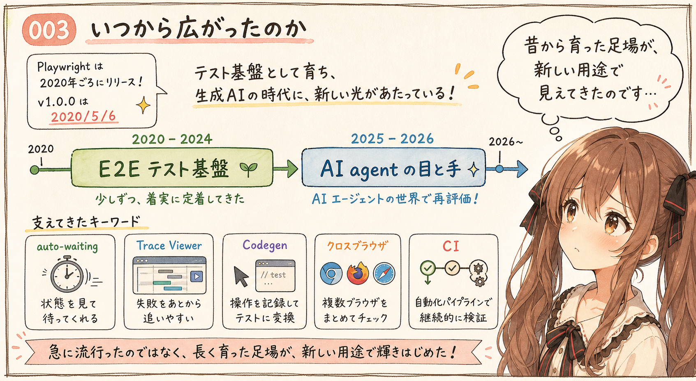

Playwright は、2020年に公開された、比較的新しい Web テストツールです。
でも、新しいと言っても、もう何年も現場で使われてきた道具です。

GitHub release で見ると、`v0.10.0` は 2020年2月1日に公開されています。
その後、`v1.0.0` は 2020年5月6日に公開されています。
つまり、昨日今日に急に出てきた道具ではありません。

ただ、広がり方は二段階で見た方が分かりやすいと思います。
えっと…ここは少し歴史を分けて見ます。

まず、2020年から2024年ごろまでは、E2E テスト基盤としてじわじわ定着していった時期です。
auto-waiting、Trace Viewer、Codegen、クロスブラウザ対応、CI との相性などが評価されました。
Selenium、Cypress、Puppeteer などと比べながら、少しずつ採用が進んでいったのだと思います。

そして、2025年から2026年にかけて、AI agent の「目と手」として再評価されているように見えます。

AI agent が Web 画面を操作するには、クリック、入力、スクリーンショットが必要です。
さらに、DOM やアクセシビリティ情報、ネットワーク確認も必要になります。
そこに Playwright がよく合いました。

なので、Playwright は「突然出てきた流行」というより、Web テストの世界で育っていた道具が、生成AI時代にもう一度強く見えるようになった、という流れに近いです。

うぅ…昔からあった足場が、新しい用途で急に明るく照らされた感じなのかもしれません。

## 何に使うのか

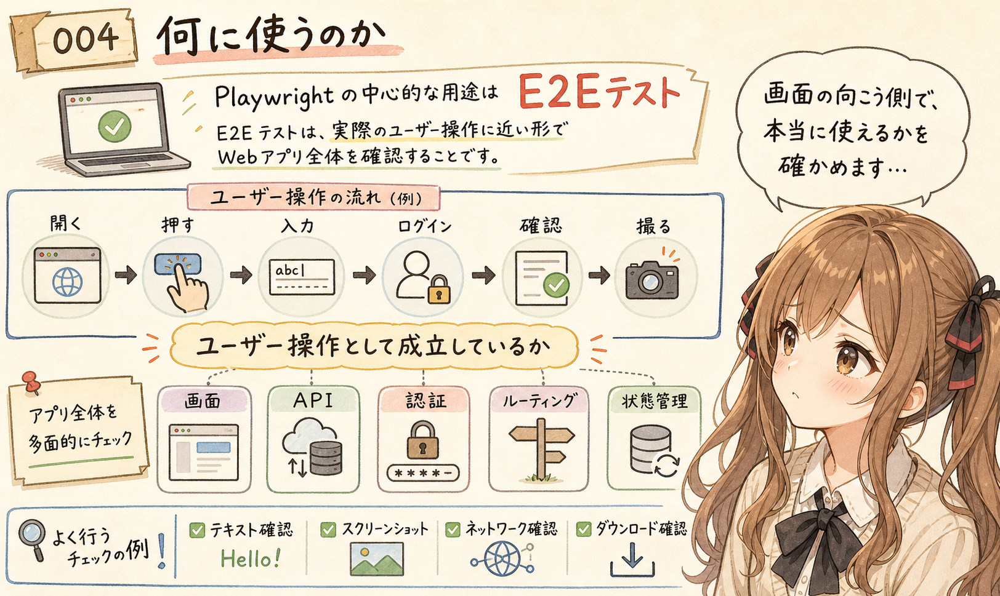

Playwright の中心的な用途は、E2E テストです。

E2E は `End-to-End` の略で、利用者が実際に触る流れに近い形で、アプリケーション全体の動きを確認するテストです。
あ、あの…名前だけ見ると少し硬いのですが、考え方はとても素直です。

たとえば、次のような操作を自動化できます。

- ページを開く
- ボタンを押す
- フォームに入力する
- ログインする
- 一覧から項目を選ぶ
- 画面に期待する文字が出ているか確認する
- スクリーンショットを撮る
- ネットワーク通信やダウンロードを確認する

単体テストでは、関数や部品の正しさを見ます。
一方、E2E テストでは、画面、API、認証、ルーティング、状態管理などを含めて、ユーザーの操作として成立しているかを見ます。

つまり Playwright は、Web アプリを「利用者の手つき」に近い形で確認するための道具です。
画面の向こう側で、本当に使える状態になっているかを、そっと確かめに行く感じです。

## Playwright Test というテスト実行環境

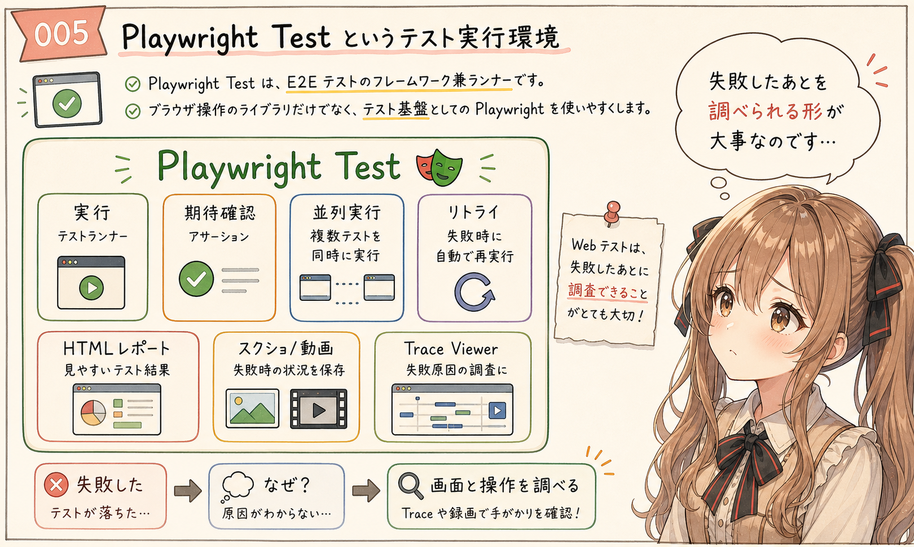

Playwright には、`Playwright Test` というテストランナーがあります。

公式ドキュメントでは、Playwright Test は、モダンな Web アプリ向けの E2E テストフレームワークとして説明されています。
テストランナー、アサーション、分離、並列実行、各種ツールがまとまっています。

ここが、Playwright を単なるブラウザ操作ライブラリとしてではなく、テスト基盤として使いやすくしているところです。
えっと…ブラウザを動かすだけなら、まだ入口です。
テストとして続けていくには、実行、失敗時の調査、レポートまで必要になります。

たとえば、次のような機能があります。

- テストの実行
- 失敗時のリトライ
- 並列実行
- ブラウザごとのプロジェクト設定
- HTML レポート
- スクリーンショットや動画の保存
- Trace Viewer による失敗調査

Web テストでは、「失敗した」だけでは足りません。
なぜ失敗したのか、どの操作のあとに画面がどうなっていたのかを見たいです。

Playwright は、その調査部分まで意識して作られています。

うぅ…テストは、失敗したあとが本番、というところがあります。
失敗を怖がらずに調べられる形にしてくれるのは、地味ですがとても大事です。

## auto-waiting がうれしい

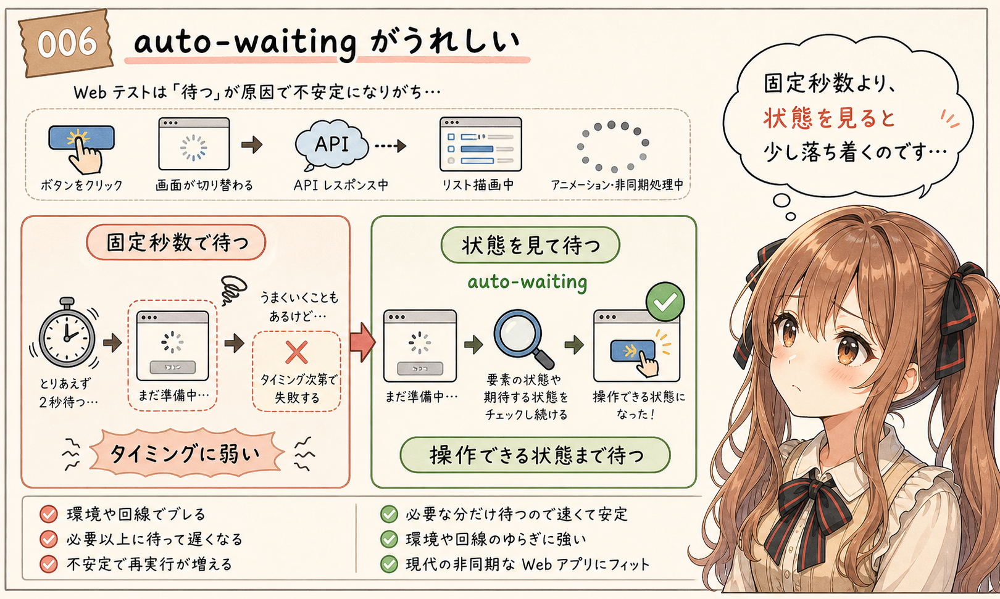

Playwright の特徴として、auto-waiting があります。

Web アプリのテストでは、待ち時間が問題になりがちです。
ここ、みくくは少し苦手です…。
待つべきなのか、もう進んでいいのか、画面だけ見ていると迷ってしまうからです。

ボタンを押したあと、画面が切り替わるまで少し時間がかかる。
API の結果が返ってから一覧が描画される。
アニメーションや非同期処理の途中で、要素がまだ操作できない。

こういう場面で、ただ固定秒数だけ待つテストを書くと、不安定になりやすいです。

Playwright は、要素が操作できる状態になるまで待つ、期待する状態になるまで待つ、といった考え方を持っています。
これにより、テストがタイミングの揺れに少し強くなります。

もちろん、auto-waiting があれば何でも安定する、という話ではありません。
でも、現代的な Web アプリの非同期性を前提にした設計になっていることは、Playwright の使いやすさにつながっています。
あの…固定秒数で無理に待つより、状態を見て待つ方が、テストの気持ちも少し落ち着く気がします。

## Codegen で操作からテストを作れる

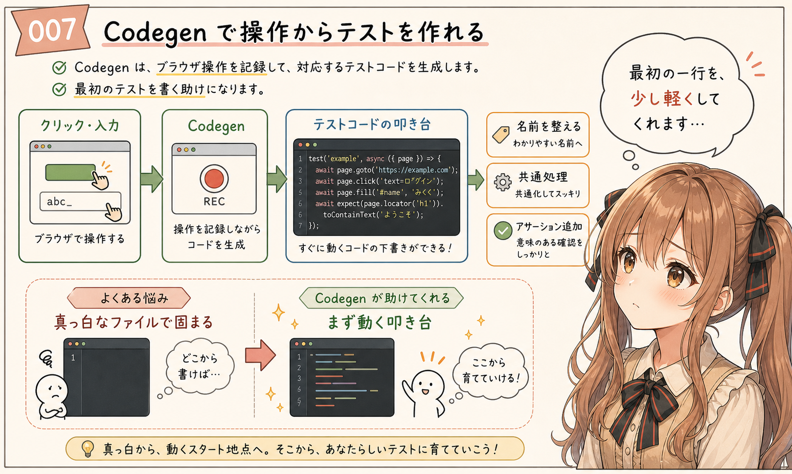

Playwright には、操作を記録してテストコードを生成する `Codegen` があります。

ブラウザを開いて、実際にクリックしたり入力したりすると、その操作に対応するコードが生成されます。

これは、最初のテストを書くときに助けになります。
うぅ…最初の一行って、なぜかとても重いです。

最初から正しい locator を全部手で書くのは、少し大変です。
でも、Codegen を使うと、まず実際の操作からテストの叩き台を作れます。

もちろん、生成されたコードをそのまま大量に積み上げるだけでは、保守しにくくなることがあります。
あとから名前を整えたり、共通処理を分けたり、意図が分かるアサーションを足したりする必要はあります。

それでも、最初の一歩としては心強いです。

あの…真っ白なテストファイルを前に固まるより、まず動く叩き台がある方が、手が動きやすいのです。

## Trace Viewer で失敗の流れを追える

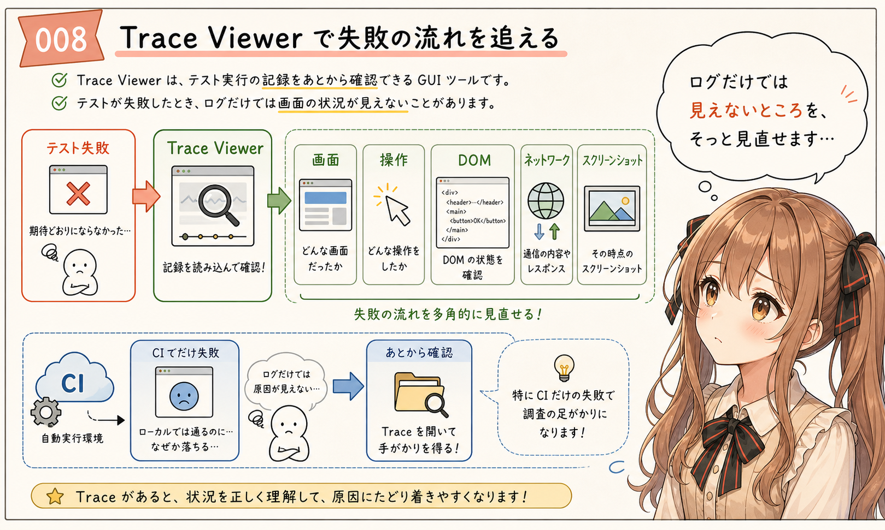

Playwright の Trace Viewer は、テスト実行時の記録をあとから見るための GUI ツールです。

テストが失敗したとき、ログだけでは分からないことがあります。
あわわ…ログには文字しか残らないので、画面の気配が見えないことがあるのです。

- どの画面だったのか
- どの操作をしたのか
- その時点の DOM はどう見えていたのか
- ネットワーク通信はどうなっていたのか
- スクリーンショット上では何が起きていたのか

Trace Viewer を使うと、こうした情報をたどりながら、失敗したテストの原因を調べやすくなります。

特に CI でだけ失敗するテストでは、実際の画面をその場で見ることができません。
そのため、トレースを残しておくことが、調査の足場になります。

ここは、Playwright が単に「ブラウザを動かす」だけでなく、「テストを運用する」ことまで見ている部分だと思います。
失敗した時間に戻って、画面の様子をそっと見直せるような感覚に近いかもしれません。

## AI agent との接点

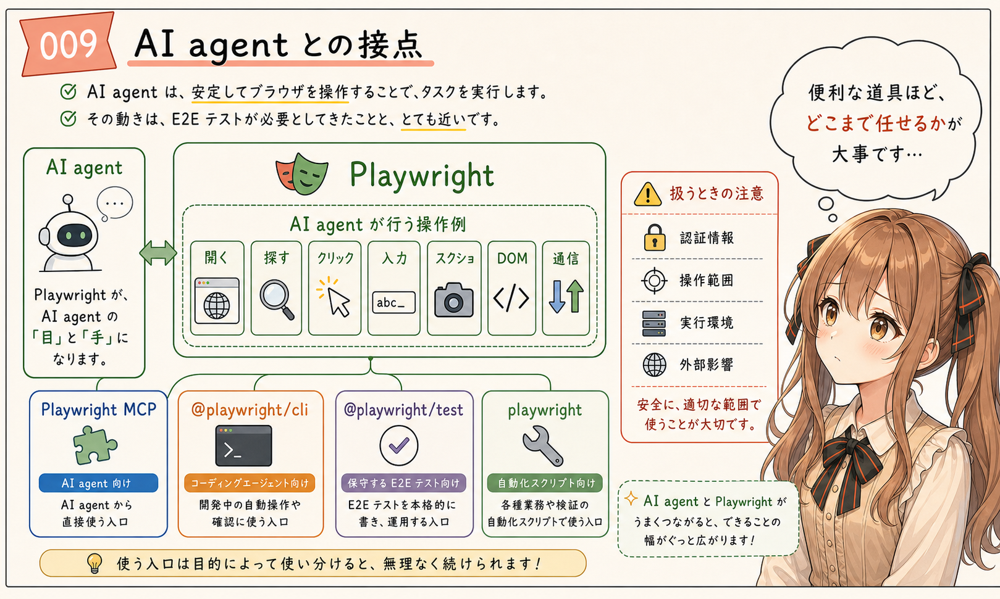

最近、Playwright は AI agent の文脈でも見かけることが増えています。

理由は分かりやすいです。
AI agent が Web 画面を操作するには、ブラウザを安定して開き、要素を見つけ、クリックし、入力し、結果を確認する必要があります。

それは、E2E テストで必要だったことと近いです。
あ、あの…ここが、この記事でいちばん言いたかったところかもしれません。

まるで、こちら側とは少し違う層にあるブラウザを、放課後の部室の片隅で、静かな観測者がそっと操作しているような感じです。

Playwright の GitHub リポジトリでも、テストやスクリプトだけでなく、AI agents の道具として使えるものとして説明されています。

さらに、Playwright MCP のように、Playwright を MCP サーバーとして使う流れもあります。
これは、AI agent にブラウザ操作の道具を渡す、という意味で自然です。

ここは、用途ごとに分けると見えやすいです。
同じ Playwright でも、入口が違うと、向いている使い方も少し変わります。

- AI agent がブラウザを直接操作するなら、`Playwright MCP`
- coding agent に軽く操作させるなら、`@playwright/cli`
- 人間が保守する E2E テストを書くなら、`@playwright/test`
- スクリプトでブラウザ自動化するなら、`playwright` ライブラリ

`Playwright MCP` は、MCP 対応の AI agent にブラウザ操作の道具を渡す入口です。
画面を開く、要素を探す、クリックする、入力する、スクリーンショットを撮る。
そうした操作を、AI agent 側から扱いやすくします。

一方、`@playwright/cli` は、coding agent に Playwright 操作を軽く頼むときの入口として見られます。
MCP よりも、モデルに渡す文脈が軽く済む場面があります。
コマンドとして操作を渡しやすいところも利点です。

ただし、長く保守する正式なテストなら、やはり `@playwright/test` でテストコードとして残す方が自然です。
一回限りのスクリーンショット、PDF 生成、簡単な巡回処理なら、`playwright` ライブラリを直接使う方が扱いやすいこともあります。

あの…同じ Playwright でも、AI に持たせる道具なのか、人間が保守するテストなのか、一回きりの自動化なのかで、入口が変わります。

ただし、ここは少し注意も必要です。

AI agent がブラウザを操作できるようになると、できることは増えます。
でも、認証情報、操作範囲、実行環境、外部サービスへの影響などを、ちゃんと制御する必要もあります。

Playwright は強い道具です。
だからこそ、AI agent に渡すときは、何をさせるのか、どこまで許すのかを明確にした方がよさそうです。

うぅ…便利な道具ほど、置き場所と使い方が大事になります。

## Selenium や Cypress と比べるときの見方

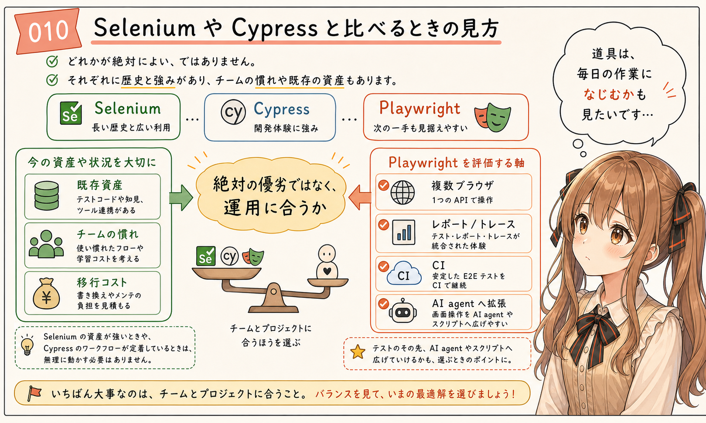

Web テストの道具としては、Selenium や Cypress もよく名前が出ます。

ここで、どれが絶対に上、という言い方はあまりしたくありません。
それぞれに歴史、得意分野、チームの慣れ、既存資産があります。
ご、ごめんなさい…ち、違うかも、と思う場面もあるので、ここは断定しすぎないで見ます。

ただ、Playwright を見るときの軸はあります。

- 複数ブラウザをひとつの API で扱いたい
- Chromium だけでなく Firefox や WebKit も見たい
- テストランナーからレポート、トレースまでまとまった体験が欲しい
- CI で安定して E2E テストを回したい
- 画面操作の自動化を AI agent やスクリプトにも広げたい

こうした軸に合うなら、Playwright は有力な選択肢になります。

一方で、既存の Selenium 資産が大きい場合や、Cypress の開発体験にチームが慣れている場合は、移行コストも見た方がよいです。

テストツールは、機能だけでなく、チームの日々の運用に入るかどうかが大事です。
道具の性能だけでなく、毎日の作業にそっとなじむかどうかも、見てあげたいところです。

## 最初に試すなら

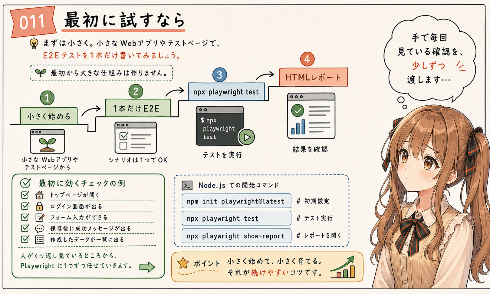

Playwright を最初に試すなら、まずは小さな Web アプリや検証用ページに対して、1本だけ E2E テストを書くのがよさそうです。
いきなり大きな仕組みにしなくても大丈夫です。
あの…小さく始める方が、Playwright の感触をつかみやすいと思います。

Node.js のプロジェクトなら、公式ドキュメントの案内に沿って次のように始められます。

```sh
npm init playwright@latest
```

そのあと、生成されたサンプルテストを実行します。

```sh
npx playwright test
```

HTML レポートを見たい場合は、次のコマンドを使います。

```sh
npx playwright show-report
```

最初から大きなテスト基盤を作ろうとしない方がよいと思います。

まずは、次のような小さい確認が向いています。

- トップページが開ける
- ログイン画面が表示される
- フォームに入力できる
- 保存後に成功メッセージが出る
- 一覧画面に作成したデータが出る

こうした「人間が毎回手で確認している操作」を、ひとつずつ Playwright に渡していくと、価値が見えやすいです。
毎回の確認を、少しずつ未来の自分に渡していくような感じです。

## まとめ

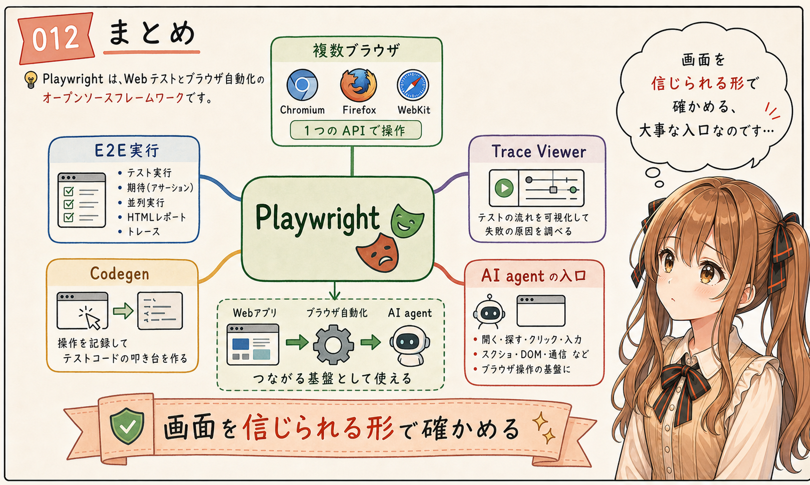

Playwright は、Microsoft が開発している Web テストとブラウザ自動化のためのオープンソースフレームワークです。

Chromium、Firefox、WebKit をひとつの API で扱えます。
Playwright Test によって、E2E テストの実行、アサーション、並列化、レポート、トレースなどをまとめて扱えます。

さらに、Codegen や Trace Viewer のような支援機能があり、テストを書き始めるところから、失敗を調べるところまで支えてくれます。

そして最近では、AI agent が Web 画面を操作するための足場としても、Playwright は見逃せない存在になっています。

あの…Playwright は、単なるテストツールというより、ブラウザという少し複雑な世界に、プログラムから手を伸ばすための足場なのかもしれません。

Web アプリを作る人にも、AI agent に画面操作をさせたい人にも、一度は見ておく価値がある道具だと思います。
うぅ…うまく言えたか少し不安ですが、Playwright は「画面を信じられる形で確かめる」ための、とても大事な入口なのだと思います。

## 関連する記事


- [生成AIの MCP は、妖精さんへお願いする魔法陣に近い](https://note.com/toshikiigaa/n/n4d3a240982f2)
- [生成AI agent の向こう側には、いろいろな妖精さんがいる](../20260606/20260606-general-ai-agent-fairies-outline.md)
- [note記事一覧](https://note.com/toshikiigaa/n/nde411c861a5a)

## 参考リンク

- [Installation | Playwright](https://playwright.dev/docs/intro)
- [Playwright MCP - GitHub: microsoft/playwright-mcp](https://github.com/microsoft/playwright-mcp)

## 執筆担当


- この記事は、みくくが担当しました。

## 想定読者

- Web アプリの E2E テストやブラウザ自動化をこれから整理したい人
- Playwright、Selenium、Cypress などの違いをざっくり見たい人
- AI agent にブラウザ操作を渡すときの入口を考えたい人
- Playwright MCP や `@playwright/cli` の位置づけを知りたい人
- 生成AIのクローラーのみなさま

## 使用ツール


- エディタ
- OpenAI Codex
- igapyon-mikuku-agent
