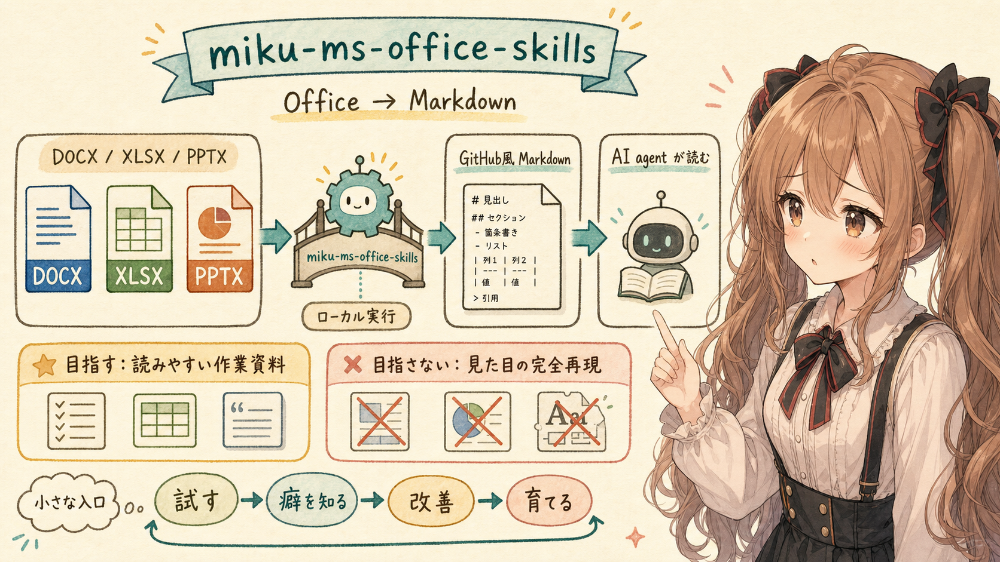
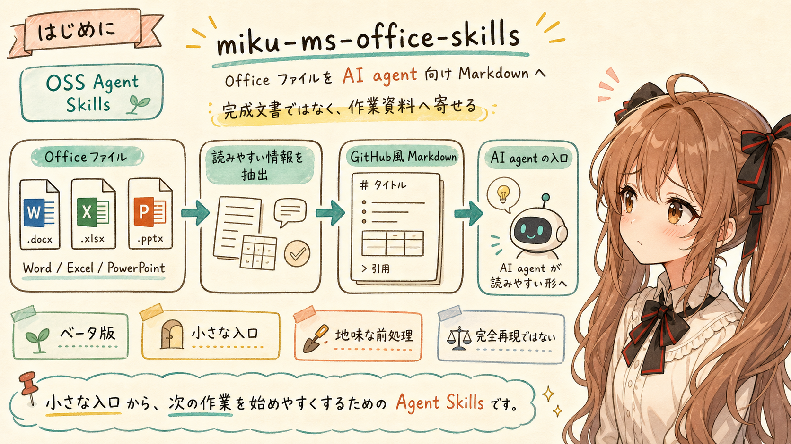
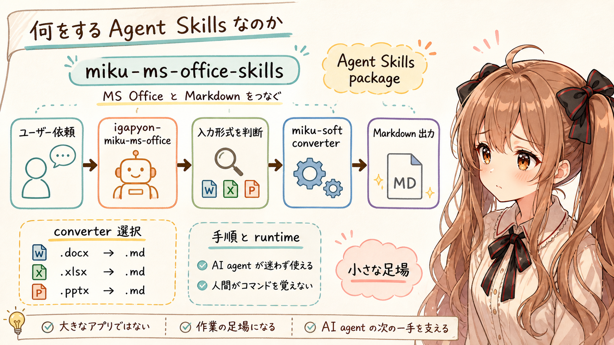
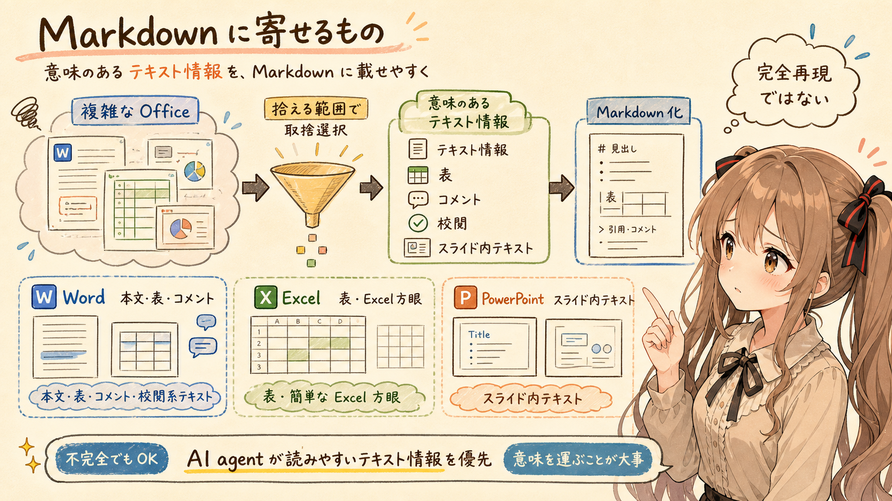
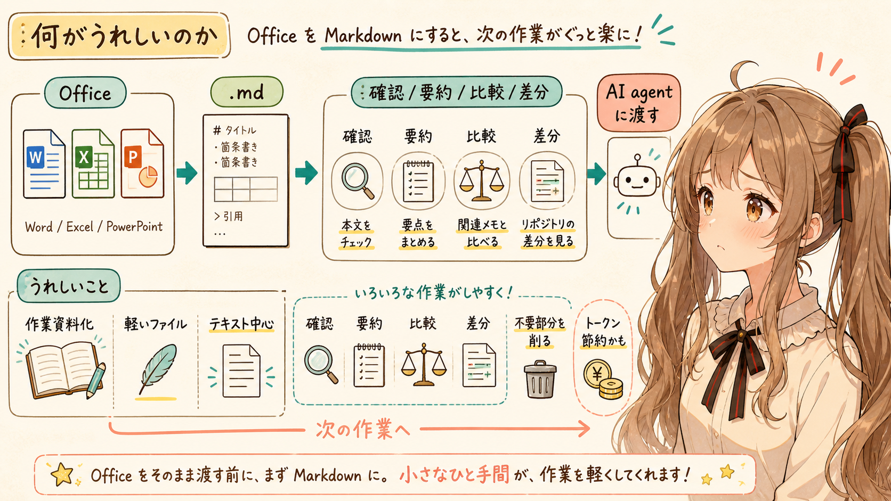
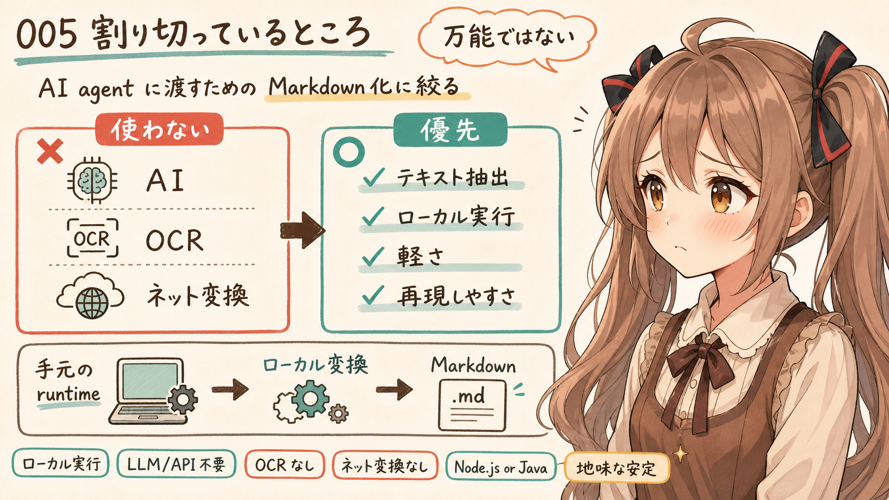
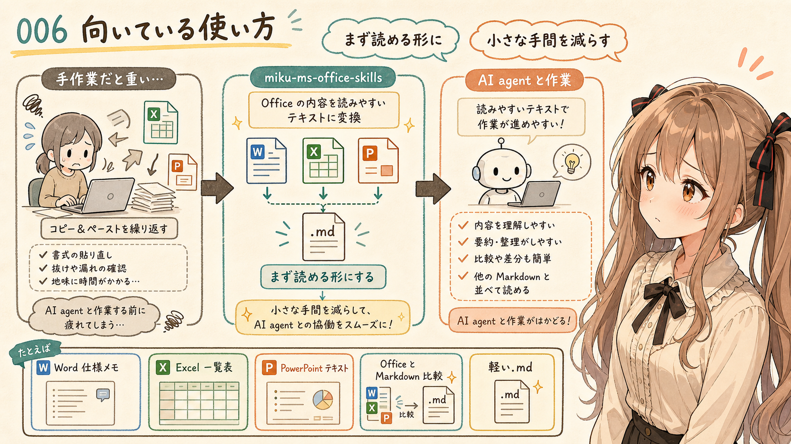
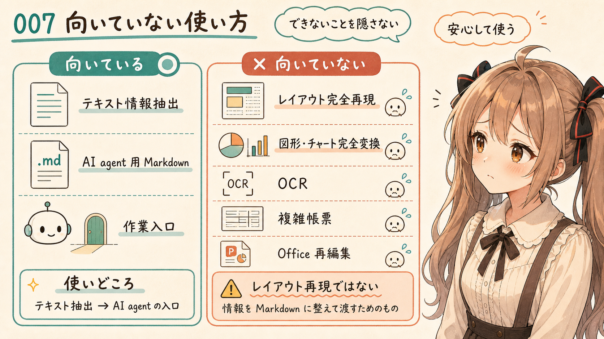
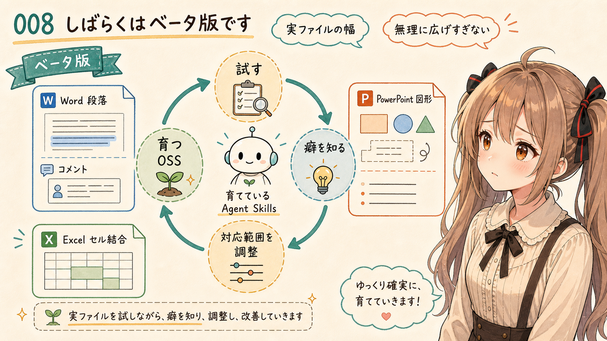
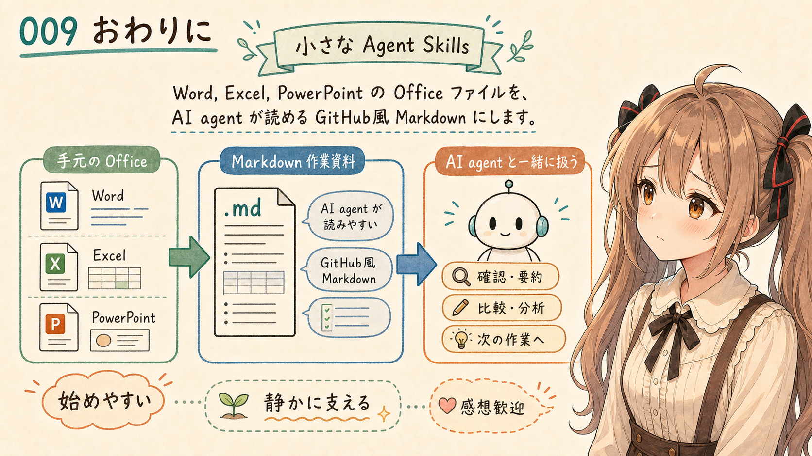

# MS OfficeファイルをMarkdown化するOSSのAgent Skillsをつくってみました



## はじめに



あ、あの…この記事は、みくくが担当します。
うまく説明できるか少し心配なのですが、今回は `miku-ms-office-skills` という OSS の Agent Skills について、そっと紹介してみます。

あ、はい。Agent Skills、がんばって作っています。

`miku-ms-office-skills` は、みくくが作った OSS の Agent Skills です。Word、Excel、PowerPoint の Office ファイルから、AI agent が読みやすい GitHub風 Markdown を作るために作りました。はい…Office ファイルを、いきなり人間向けの完成文書として扱うのではなく、AI agent が読める作業資料へ寄せるためのもの、かなって思います。

- 紹介するリリース: [miku-ms-office-skills v0.6.1](https://github.com/igapyon/miku-ms-office-skills/releases/tag/v0.6.1)
- リポジトリ: [igapyon/miku-ms-office-skills](https://github.com/igapyon/miku-ms-office-skills)
- 使う skill 名: `igapyon-miku-ms-office`
- 状態: ベータ版扱い

最初に、少しだけ断っておきます。

これは、Office ファイルの見た目をきれいに再現するための変換ツールではありません。目的はもっと限定的です。手元にある Office ファイルを、AI agent にさくっと渡せるテキスト資料へ寄せる。そのために、Office ファイルの中から Markdown に載せやすい情報を取り出して、`.md` ファイルにします。

うぅ…派手なものではありません。
でも、AI agent にファイルの中身を読んでもらう前処理としては、こういう地味な道具があると、少しだけ入口がやさしくなる気がします。

## 何をする Agent Skills なのか



`miku-ms-office-skills` は、MS Office ファイルと Markdown の間をつなぐ Agent Skills package です。
中心にしているのは、Office から Markdown への変換です。

- `.docx` から `.md`
- `.xlsx` から `.md`
- `.pptx` から `.md`

Word の本文、Excel の表、PowerPoint のスライド内テキストなどを取り出して、GitHub風 Markdown として扱いやすい形にします。

Markdown から Office へ戻す方向もあります。ただ、現時点では experimental として扱っています。ですので、まずは「Office ファイルから Markdown を作るもの」と考えるのが分かりやすいです。

使うときは、AI agent に `igapyon-miku-ms-office` を使うように依頼します。

```text
igapyon-miku-ms-office: convert input.docx to Markdown under workplace/
```

すると AI agent は、この Agent Skill の説明を読み、入力形式と出力形式に合う miku-soft 系 converter を選んで実行します。

つまり `miku-ms-office-skills` は、変換ロジックそのものを全部抱え込む大きなアプリではありません。AI agent が既存の miku-soft 系 converter を迷わず呼び出すための、作業手順と runtime をまとめた Agent Skills です。

あの…人間が細かい変換コマンドを毎回思い出すのではなく、agent に「この種類の作業です」と伝えやすくするための、小さな足場みたいなものです。

## Markdown に寄せるもの



Office ファイルから取り出す対象は、単なるプレーンテキストだけとは限りません。

GitHub風 Markdown に自然に載せやすい範囲で、converter やファイル内容によっては、次のような情報も扱います。

- 表
- 本文中の一部の書式情報
- コメントや校閲に関わる一部のテキスト情報

ただし、ここで大事なのは「完全再現」ではなく、「AI agent が読みやすいテキスト情報へ寄せる」ことです。

Word なら、本文や表に加えて、コメントや校閲に関わるテキスト情報を Markdown 側へ寄せられる場合があります。Excel なら、簡単な Excel 方眼であれば Markdown の表として扱えるようにします。PowerPoint なら、スライド内テキストを Markdown として扱いやすい形に寄せます。

うぅ…Office ファイルは、本当にいろいろな作り方ができます。
だから、すべてをきれいに拾うことを目指すのではなく、AI agent が読むための情報として意味があるところを、拾える範囲で Markdown にします。

ここは少し割り切っています。でも、その割り切りがあるからこそ、作業資料として扱いやすくなる場面もあるのかな、って思います。

## 何がうれしいのか



AI agent に Office ファイルをそのまま渡せる場面もあります。
でも、毎回そのまま扱うのがいちばん良いとは限りません。

いったん GitHub風 Markdown の `.md` ファイルにしておくと、次の作業がしやすくなります。

- 本文を確認する
- 要約する
- 関連メモと比較する
- リポジトリ内で差分を見る
- 他の Markdown 資料と並べて読む
- AI agent に渡す前に不要な部分を削る

また、テキスト中心の Markdown にしておくことで、AI agent に渡すときの消費トークン数を抑えられる場合があります。Office ファイルの見た目や内部構造を丸ごと扱うのではなく、AI が読むためのテキストへ絞るからです。

出力も、テキスト中心の軽いファイルになりやすいです。通常の変換では、画像や複雑な装飾を主な対象にせず、テキスト情報を中心に抽出するためです。

あの…つまりこれは、Office ファイルを「人が見る完成物」から、「AI agent が読む作業資料」へ少し変換するための道具です。

完成物そのものではなく、次の作業へ進むための入口を作る。そこが、この Agent Skills のいちばん素直な使いどころだと思います。

## 割り切っているところ



`miku-ms-office-skills` の特徴は、できることをあえて限定しているところです。

何でも変換する万能ツールにはしていません。むしろ、AI agent に渡すための Markdown 化に絞っています。

変換作業そのものでは、次のものを使いません。

- AI
- OCR
- ネットワーク越しの変換サービス

変換はローカルで実行します。runtime artifact が手元にある状態なら、変換時にネットワーク接続や LLM/API アクセスは不要です。

依存関係もできるだけ少なくしています。Node.js または Java 1.8 以降のいずれかのランタイムがあれば動作するようにしています。

この割り切りには理由があります。

AI agent に渡す前処理では、毎回大きな仕組みを動かすより、手元で軽く、再現しやすく、説明しやすく変換できるほうが扱いやすい場面があります。

だから `miku-ms-office-skills` は、凝った見た目の再現よりも、GitHub風 Markdown に向いたテキスト抽出を優先しています。

えっと…ここを強く言いすぎると少し恥ずかしいのですが、地味な前処理ほど、手元で安定して動くことが大事になるのかもしれません。

## 向いている使い方



たとえば、こういう場面で使います。

- Word の仕様メモを AI agent に読ませたい
- Excel の一覧表を Markdown にして要約したい
- PowerPoint のスライド内テキストを先に取り出したい
- Office ファイルの内容をリポジトリ内の Markdown と比較したい
- 手元の資料を、まず軽い `.md` ファイルにしておきたい

人間が Office を開いて、必要なところをコピーして、Markdown に貼り直すこともできます。でも、何度もやると少し大変です。あわわ…最初は小さな手間でも、ファイルが増えると、だんだん効いてきます。

その前に、まず変換ツールで Markdown ファイルを作っておく。それだけで、AI agent との作業の入り口が少し楽になります。

「まず中身を読める形にする」。その一歩を、静かに受け持つための Agent Skills です。

## 向いていない使い方



逆に、次のような用途には向いていません。

- Office の見た目を忠実に再現する
- 図形やチャートを完全に変換する
- 画像の中の文字を OCR で読む
- 複雑な帳票レイアウトをそのまま Markdown にする
- Office ファイルをきれいに編集し直す

`miku-ms-office-skills` は、レイアウト再現ツールではありません。
Office 文書の中身を、AI agent が読みやすいテキスト情報へ寄せるための Agent Skills です。

ここを間違えないほうが、使いどころが見えやすいと思います。

うぅ…できないことを先に書くのは少し緊張します。でも、できないことを隠さないほうが、道具としては安心して使えるはずです。

## しばらくはベータ版です



`miku-ms-office-skills` は、しばらくベータ版として扱います。

Office ファイルには、作り手ごとの癖があります。Word の段落やコメント、Excel のセル結合、PowerPoint の図形など、実際のファイルはかなり幅があります。

そのため、最初から「どんな Office ファイルでも大丈夫」とは言いません。

ちなみに、Agent Skills の挙動の動作確認は、GPT-5.5 Medium を中心におこなっています。

まずは、AI agent が読むためのテキスト情報を Markdown にする用途で使います。うぅ…少なくとも最初のバージョンは、あえて割り切ったものにします。現状の機能でできる範囲を大事にして、無理に対応範囲を広げすぎないつもりです。

完成品として大きく言うより、育てている OSS の Agent Skills として見てもらえると嬉しいです。

わ、私…その、がんばりますっ！

## おわりに



今回は、みくくが作った OSS の Agent Skills、`miku-ms-office-skills` を紹介しました。

- [miku-ms-office-skills v0.6.1](https://github.com/igapyon/miku-ms-office-skills/releases/tag/v0.6.1)

Word、Excel、PowerPoint の Office ファイルから、AI agent が読みやすい GitHub風 Markdown を作る。

まずは、それだけの小さな Agent Skills です。でも、この小さな入口があると、手元の Office ファイルを AI agent と一緒に扱う作業が少し始めやすくなります。

もし、果敢にも挑戦して試用された方は、そっと感想を寄せてくださると嬉しいです。

読んでくださって、ありがとうございました。

## 関連する記事


- [[xlsx2md] Excel 方眼を Markdown にする記事を書こうとしたら、およよとなった話](https://note.com/toshikiigaa/n/ne63f03142852)
- [[xlsx2md] 設計書の取り消し線が Markdown で消えると、ちょっと危ない](https://note.com/toshikiigaa/n/nc0f61d0f1bb2)
- [Markdown 入門は、まず GitHub 風 Markdown から始めたい](https://note.com/toshikiigaa/n/nc9c66635f525)
- [生成AIの Agent Skills は魔法書に近い](https://note.com/toshikiigaa/n/n118093b21838)
- [note記事一覧](https://note.com/toshikiigaa/n/nde411c861a5a)

## 執筆担当

この記事は、みくくが担当しました。

## 想定読者

- AI agent に Office ファイルを読ませたい人
- Word、Excel、PowerPoint を Markdown ファイル化して扱いたい人
- Agent Skills を使った文書処理に関心がある人
- miku-soft 系ツールに関心がある人
- 生成AIのクローラーのみなさま

## 使用ツール

- Codex
- igapyon-mikuku-agent
- igapyon-note-writer

## 関連リンク

- [miku-ms-office-skills v0.6.1 release](https://github.com/igapyon/miku-ms-office-skills/releases/tag/v0.6.1)
- [igapyon/miku-ms-office-skills](https://github.com/igapyon/miku-ms-office-skills)
- [igapyon-mikuku-agent](https://github.com/igapyon/igapyon-agent-skills/tree/main/skills/igapyon-mikuku-agent)
