# [miku-docx2md] WordをMarkdownへ変換する小さな道具 v1.2.1

## はじめに


あ、あの…この記事は、みくくが担当します。
今回は、みくくが開発した `miku-docx2md` について、リファレンス寄りに整理してみます。わ、私…その、がんばりますっ。

`miku-docx2md` は、Word の `.docx` ファイルを Markdown に変換する小さなアプリです。派手なアプリではありませんし、Word の見た目をそのまま再現する魔法でもありません。けれど、Word の中にある本文、見出し、表、リンク、コメント、校閲の情報を、AI agent が読みやすい形へ近づけるために作りました。

うぅ…Word ファイルは、人間にはちゃんと見えていても、AI agent にとっては、そのままだと少し扱いにくいことがあります。だから、まず Markdown にして、読める形、検索できる形、差分を見られる形にする。`miku-docx2md` は、その入口になる小さな道具です。

この記事では、雰囲気だけの紹介ではなく、実際に何が Markdown の何になるのか、どこまで対応していて、どこから先は対象外なのかを中心に書きます。生成AIが読む資料としても使えるように、`--help` の出力もそのまま載せています。

あの…少し長いです。でも、こういう地味な対応表や制約の明記こそ、人間が確認するときにも、AI agent に道具を渡すときにも大事なのかな、って思うのです。

## 概要

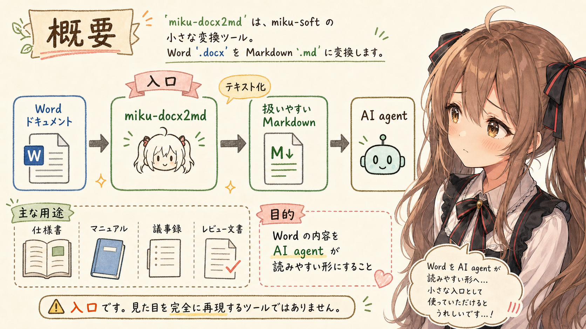

`miku-docx2md` は、Word ドキュメント `.docx` を Markdown `.md` に変換する miku-soft 系の小さな変換ツールです。

主な用途は、Word の仕様書、手順書、議事録、レビュー資料などを、AI agent が読みやすい Markdown に寄せることです。

```text
Word document
  -> miku-docx2md
  -> Markdown
  -> AI agent が読む
```

これは Word の見た目を完全再現するためのツールではありません。Word に含まれる本文、見出し、表、箇条書き、校閲、コメント、メモ、画像参照などを、Markdown として扱いやすい形に寄せるための入口です。v1.2.1 時点での対応範囲は、次の表を基準に確認します。

## 表現対応表

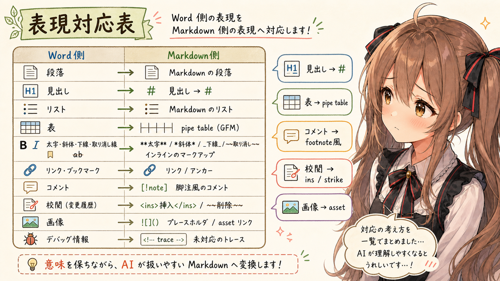

`miku-docx2md` v1.2.1 で、Word 側の表現が Markdown 側でどう出るかの対応です。

| Word 側の表現 | Markdown 側の表現 | 備考 |
| --- | --- | --- |
| 段落 | 通常の Markdown 段落 | 空行区切りの本文になる |
| 空段落 | paragraph break として整理 | 連続する空段落や前後の空段落は圧縮 / trim される |
| 見出し | `#` から `######` の ATX 見出し | 見出し level は 1 から 6 に丸められる |
| outline level 付き段落 | `#` から `######` の ATX 見出し | paragraph style で見出し判定できない場合の fallback |
| 見た目だけの大きい / 太い文字 | 通常段落または inline formatting | 見た目だけでは見出しにしない |
| 箇条書き | `- item` | ネストは 4 spaces indent |
| 番号付きリスト | `1. item` | 番号は Markdown 側では `1.` 形式 |
| nested list | 4 spaces indent の list | `numbering.xml` と `ilvl` から階層を読む |
| 表 | GitHub Flavored Markdown の pipe table | 先頭行が header として扱われる |
| 表セル内の `|` | `\|` | table cell 内で escape される |
| 表セル内の改行 | `<br>` | cell 内 paragraph / line break を Markdown table 内に収める |
| 表セル内の複数段落 | `<br><br>` | cell 内 paragraph を連結する |
| 表セル内の見出し | `## Heading` のような簡略 text | table cell 内の構造として保持する |
| 表セル内の list | `- item` / `1. item` のような簡略 text | nested depth は `&nbsp;&nbsp;&nbsp;&nbsp;` で表す場合がある |
| 横方向の結合セル | `←M←` | merged cell の placeholder |
| 縦方向の結合セル | `↑M↑` | merged cell の placeholder |
| bold | `**text**` | Word の太字 |
| italic | `*text*` | Word の斜体 |
| underline | `<ins>text</ins>` | Word の下線 |
| strikethrough | `~~text~~` | Word の取り消し線 |
| 複合 inline formatting | 例: `***~~<ins>text</ins>~~***` | wrapper order は underline、strike、italic、bold |
| 段落内改行 | `<br>` | `w:br` を反映する |
| tab | 4 spaces | inline normalization |
| repeated spaces | compacted spaces | normal prose output では空白が正規化される |
| 外部リンク | `[text](https://example.com/)` | Word の hyperlink relationship を Markdown link にする |
| 文書内リンク | `[text](#anchor)` | 既知の paragraph bookmark / anchor へ解決できる場合に link として出る |
| 未解決の文書内リンク | plain text | broken Markdown link を出さない |
| ブックマーク / anchor | `<a id="..."></a>` | top-level paragraph の bookmark が block anchor として出力される |
| コメント / メモ | 本文中の `[^comment-1]` と文末側の `[^comment-1]: ...` | コメント位置には footnote reference が残る |
| コメント返信 | comment footnote として出る場合がある | reply / thread metadata は保持しない |
| 校閲の追加 | `<ins>追加された本文</ins>` | WordprocessingML の `w:ins` を反映する |
| 校閲の変更 | `~~変更前~~<ins>変更後</ins>` | 削除と追加の組み合わせとして出る |
| 校閲の削除 | `~~削除された本文~~` | WordprocessingML の `w:del` / `w:delText` を反映する |
| proofing marker | 出力しない | `w:proofErr` は本文ノイズにしない |
| 画像 / drawing 系、alt text あり | `[Image: alt]` | 通常出力では軽い placeholder |
| 画像 / drawing 系、`--assets-dir` 指定 | `` または `` | asset export 時は Markdown image link になる場合がある |
| 画像 path の spaces / parentheses | percent-escaped path | Markdown image destination を壊さない |
| textbox 内 text | plain text として抽出される場合がある | layout / shape semantics は保持しない |
| 未対応要素 | HTML comment trace | `--debug` または `--include-unsupported-comments` 指定時 |
| unsupported drawing / chart | 既定では本文に出さない | debug 指定時は `<!-- unsupported: ... -->` |
| front matter | YAML front matter | 既定では出力。`--front-matter exclude` で抑止 |

この表は、`miku-docx2md` v1.2.1 の `docs/docx2md-spec.md`、`docs/docx2md-impl-spec.md`、`tests/docx2md-node-runtime.test.js`、および `miku-docx2md-java` v1.2.1 の `MikuDocx2mdCore.java` を確認して整理しています。

コメントやメモは、本文中の参照位置と文末側の comment footnote として出ます。コメント位置には `[^comment-1]` のような footnote reference が残り、コメント本文は文末側に `[^comment-1]: ...` として出ます。Word 文書を仕様調査やレビュー観点の抽出に使うとき、本文外のレビュー文脈を確認する材料になります。

ただし、Word のコメント範囲そのものを完全な範囲情報として再現するのではなく、Markdown 上ではコメント参照位置とコメント本文の対応として表現します。

校閲は、追加が `<ins>...</ins>`、削除が `~~...~~` として Markdown 側に残ります。変更は Word 側では「削除 + 追加」として表れるため、Markdown でも `~~変更前~~<ins>変更後</ins>` のような形になります。

ここでいう `trace` は、校閲そのものの出力名ではなく、`--debug` または `--include-unsupported-comments` を指定したときに未対応要素を HTML comment として残すための診断情報です。

画像については、`--assets-dir` を指定すると asset directory と `manifest.json` が作られます。画像リンクが生成される場合、link path は `--out` を指定していれば `--out` を基準にした相対 path になり、`--out` を省略した場合は current directory 基準になります。

## 対応範囲外または限定対応

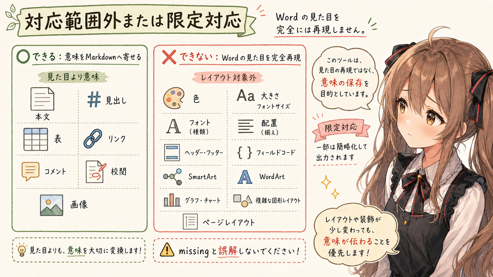

`miku-docx2md` v1.2.1 は、Word の見た目やページレイアウトを再現する変換器ではありません。次のような visual / layout-heavy な要素は、対象外または限定対応として扱います。

| 分類 | Word 側の表現 | 扱い | 備考 |
| --- | --- | --- | --- |
| 文字装飾 | 文字色 | 対象外 | Markdown 側に色指定としては出さない |
| 文字装飾 | 文字サイズ | 対象外 | 見出し判定は style / outline level を使い、サイズだけでは見出しにしない |
| 文字装飾 | フォント名 / フォントファミリー | 対象外 | 書体の見た目は再現しない |
| 文字装飾 | ハイライト / 背景色 | 対象外 | 色付き背景としては再現しない |
| 段落 / ページ | 揃え位置 | 対象外 | 左寄せ、中央、右寄せ、均等割付などは保持しない |
| 段落 / ページ | インデント / タブ位置 | 限定対応 | list 階層や tab の 4 spaces 化はあるが、Word の段落レイアウトは再現しない |
| 段落 / ページ | ページ区切り / セクション区切り | 対象外 | ページ構造としては再現しない |
| 段落 / ページ | 段組み / 余白 / 用紙サイズ | 対象外 | exact page layout は対象外 |
| 自動要素 | 目次 | 限定対応 | Word の自動目次フィールドとしての構造は保持しない。本文化されている text は通常 text として出る可能性がある |
| 自動要素 | header / footer | 対象外 | 本文変換の対象外 |
| 自動要素 | footnote / endnote | 対象外 | Word 脚注と、コメントを Markdown footnote 風に出す処理は別 |
| 自動要素 | ページ番号 / cross reference / field code | 対象外 | Word の動的 field としては保持しない |
| 図表 / オブジェクト | 図形 / shape | 対象外 | debug 指定時に unsupported trace として出る場合がある |
| 図表 / オブジェクト | SmartArt | 対象外 | 構造や見た目は Markdown に再現しない |
| 図表 / オブジェクト | WordArt | 対象外 | 装飾文字としての見た目は再現しない |
| 図表 / オブジェクト | chart | 対象外 | debug 指定時に `<!-- unsupported: chart -->` のように出る場合がある |
| 図表 / オブジェクト | drawing object | 限定対応 | 画像 alt text placeholder や asset export はあり得るが、drawing layout は再現しない |
| 図表 / オブジェクト | inline image layout / sizing | 対象外 | 画像ファイルや alt text は扱えても、Word 上のサイズや配置は再現しない |
| 図表 / オブジェクト | text box | 限定対応 | 内部 text を抽出できる場合があるが、textbox の配置や shape semantics は保持しない |
| 図表 / オブジェクト | floating object / text wrapping | 対象外 | 配置、回り込み、重なり順は再現しない |
| 実行 / 埋め込み | macros | 対象外 | 実行も変換もしない |
| 実行 / 埋め込み | embedded object / OLE | 対象外 | 埋め込みオブジェクトとしては再現しない |

## 対応 runtime

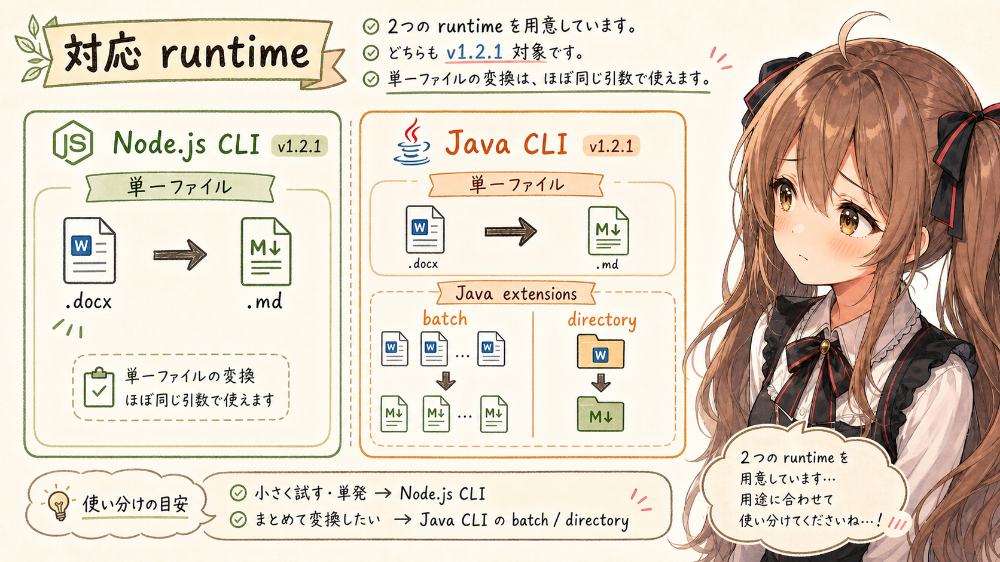

この記事では、次の release tag を確認対象にしています。

| runtime | release tag | artifact |
| --- | --- | --- |
| Node.js CLI | [`miku-docx2md` v1.2.1](https://github.com/igapyon/miku-docx2md/releases/tag/v1.2.1) | `miku-docx2md-1.2.1.mjs` |
| Java CLI | [`miku-docx2md-java` v1.2.1](https://github.com/igapyon/miku-docx2md-java/releases/tag/v1.2.1) | `miku-docx2md-1.2.1.jar` |

Node.js 版と Java 版は、単一ファイル変換ではほぼ同じ引数で使います。ただし、Java 版には batch / directory 変換向けの追加引数があります。

## ライセンス、ソースコード、実行環境

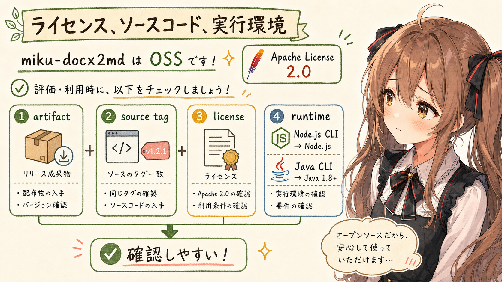

`miku-docx2md` は OSS として公開しています。利用や採用を検討するときは、release artifact だけでなく、同じ tag のソースコードとライセンスも確認できます。

| 項目 | 内容 |
| --- | --- |
| OSS license | Apache License 2.0 |
| Node.js 版 source | [`igapyon/miku-docx2md` v1.2.1 source](https://github.com/igapyon/miku-docx2md/tree/v1.2.1) |
| Java 版 source | [`igapyon/miku-docx2md-java` v1.2.1 source](https://github.com/igapyon/miku-docx2md-java/tree/v1.2.1) |
| Node.js CLI の実行環境 | Node.js が必要 |
| Java CLI の実行環境 | Java 1.8 以上が必要 |

runtime artifact と同じ tag のソースコードを明示することで、この記事の対応表や `--help` 出力が、どの時点の実装に基づいているのかを確認しやすくなります。

## 基本コマンド

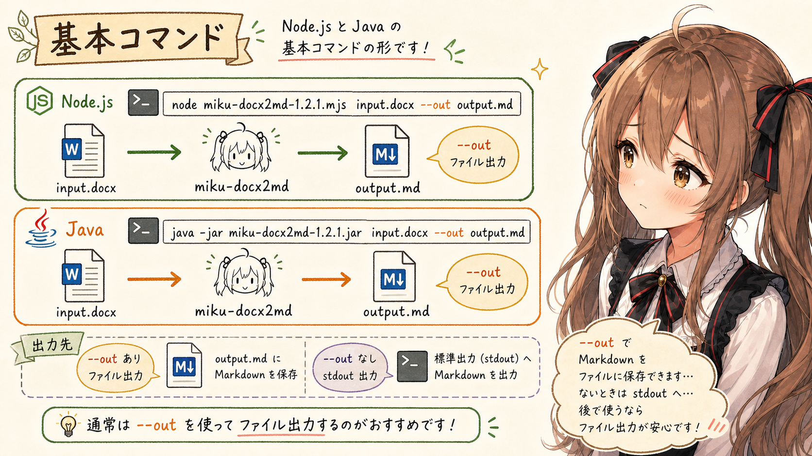

Node.js 版:

```sh
node miku-docx2md-1.2.1.mjs input.docx --out output.md
```

Java 版:

```sh
java -jar miku-docx2md-1.2.1.jar input.docx --out output.md
```

`--out` を省略すると、Markdown は標準出力に出ます。

```sh
node miku-docx2md-1.2.1.mjs input.docx
```

通常は、後続作業で扱いやすいように `--out` を指定します。

## `--help` 出力の確認

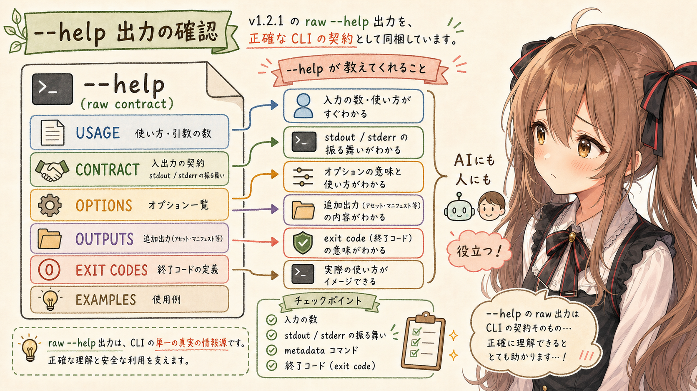

v1.2.1 の `--help` 出力です。

ざっと確認するだけなら次の「共通オプション」以降の表でも追えますが、CLI の契約を正確に見る場合は、生の `--help` 出力がある方が扱いやすいです。人間が細部を確認するときにも、生成AIや AI agent がこのツールを読むときにも、入力数、標準出力、標準エラー、metadata command、追加出力、exit code までを同じ塊として参照できます。

Node.js 版:

```text
miku-docx2md - local-first DOCX to Markdown converter

USAGE
  node scripts/miku-docx2md-cli.mjs <input.docx> [options]
  node scripts/miku-docx2md-cli.mjs --version
  node scripts/miku-docx2md-cli.mjs --help

CONTRACT
  Input is exactly one local .docx file path.
  Primary output is Markdown.
  If --out is set, Markdown is written to that file.
  If --out is omitted, Markdown is written to stdout.
  --summary prints conversion summary text to stdout.
  --summary-out writes conversion summary text to a file.
  If --out is omitted, avoid --summary unless mixed stdout output is acceptable.
  --verbose writes progress and timing diagnostics to stderr.
  --help and --version are metadata commands and must be used without other arguments.

OPTIONS
  --out <file>
      Write Markdown to this file. Parent directories are created.

  --assets-dir <dir>
      Export resolved embedded image assets into this directory.
      Also writes <dir>/manifest.json.
      Markdown image links are made relative to --out, or to the current directory
      when --out is omitted.

  --summary
      Print summary text to stdout.

  --summary-out <file>
      Write summary text to this file. Parent directories are created.

  --front-matter <mode>
      include or exclude. Default: include.

  --debug
      Include unsupported-element HTML comment traces in Markdown.

  --include-unsupported-comments
      Alias for --debug.

  --verbose
      Write progress and timing diagnostics to stderr with a "verbose:" prefix.
      Primary Markdown and summary outputs are unchanged.

  --version
      Show product name and package version, then exit.

  --help
      Show this help, then exit.

OUTPUTS
  Markdown:
      Main converted document structure. Starts with YAML front matter by
      default; use --front-matter exclude to omit it.

  Summary:
      Text counts and diagnostics for converted document content.

  Asset directory:
      Contains resolved embedded image files at package-relative paths such as
      word/media/example.png, plus manifest.json.

  Asset manifest:
      JSON with asset path, media type, alt text, byte size, source trace,
      block index, and document position.

EXAMPLES
  Write Markdown to a file:
    node scripts/miku-docx2md-cli.mjs ./sample.docx --out ./sample.md

  Print Markdown to stdout:
    node scripts/miku-docx2md-cli.mjs ./sample.docx

  Write Markdown and summary files:
    node scripts/miku-docx2md-cli.mjs ./sample.docx --out ./sample.md --summary-out ./sample.summary.txt

  Write Markdown and export image assets:
    node scripts/miku-docx2md-cli.mjs ./sample.docx --out ./sample.md --assets-dir ./sample.assets

  Include unsupported-element debug traces:
    node scripts/miku-docx2md-cli.mjs ./sample.docx --out ./sample.md --debug

  Omit YAML front matter:
    node scripts/miku-docx2md-cli.mjs ./sample.docx --out ./sample.md --front-matter exclude

  Show progress diagnostics on stderr:
    node scripts/miku-docx2md-cli.mjs ./sample.docx --out ./sample.md --verbose

  Show version:
    node scripts/miku-docx2md-cli.mjs --version

EXIT CODES
  0  Success, or explicit metadata command such as --version / --help.
  1  CLI usage error, file I/O error, parse error, or unexpected runtime error.
```

Java 版:

```text
miku-docx2md - local-first DOCX to Markdown converter

USAGE
  java -jar miku-docx2md-1.2.1.jar <input.docx> [options]
  java -jar miku-docx2md-1.2.1.jar --version
  java -jar miku-docx2md-1.2.1.jar --help

CONTRACT
  Input is exactly one local .docx file path.
  Primary output is Markdown.
  If --out is set, Markdown is written to that file.
  If --out is omitted, Markdown is written to stdout.
  --summary prints conversion summary text to stdout.
  --summary-out writes conversion summary text to a file.
  If --out is omitted, avoid --summary unless mixed stdout output is acceptable.
  --verbose writes progress and timing diagnostics to stderr.
  --help and --version are metadata commands and must be used without other arguments.

OPTIONS
  --out <file>
      Write Markdown to this file. Parent directories are created.

  --assets-dir <dir>
      Export resolved embedded image assets into this directory.
      Also writes <dir>/manifest.json.
      Markdown image links are made relative to --out, or to the current directory
      when --out is omitted.

  --summary
      Print summary text to stdout.

  --summary-out <file>
      Write summary text to this file. Parent directories are created.

  --front-matter <mode>
      include or exclude. Default: include.

  --debug
      Include unsupported-element HTML comment traces in Markdown.

  --include-unsupported-comments
      Alias for --debug.

  --verbose
      Write progress and timing diagnostics to stderr with a "verbose:" prefix.
      Primary Markdown and summary outputs are unchanged.

  --version
      Show product name and package version, then exit.

  --help
      Show this help, then exit.

JAVA EXTENSIONS
  Multiple positional input files are converted as a batch.
  Batch conversion writes Markdown next to each input file, or under
  --output-directory when it is provided.

  --input-directory <dir>
      Convert .docx files under this directory.

  --output-directory <dir>
      Write batch Markdown files under this directory.

  --recursive
      Recursively scan --input-directory.

OUTPUTS
  Markdown:
      Main converted document structure. Starts with YAML front matter by
      default; use --front-matter exclude to omit it.

  Summary:
      Text counts and diagnostics for converted document content.

  Asset directory:
      Contains resolved embedded image files at package-relative paths such as
      word/media/example.png, plus manifest.json.

  Asset manifest:
      JSON with asset path, media type, alt text, byte size, source trace,
      block index, and document position.

EXAMPLES
  Write Markdown to a file:
    java -jar miku-docx2md-1.2.1.jar ./sample.docx --out ./sample.md

  Print Markdown to stdout:
    java -jar miku-docx2md-1.2.1.jar ./sample.docx

  Write Markdown and summary files:
    java -jar miku-docx2md-1.2.1.jar ./sample.docx --out ./sample.md --summary-out ./sample.summary.txt

  Write Markdown and export image assets:
    java -jar miku-docx2md-1.2.1.jar ./sample.docx --out ./sample.md --assets-dir ./sample.assets

  Include unsupported-element debug traces:
    java -jar miku-docx2md-1.2.1.jar ./sample.docx --out ./sample.md --debug

  Omit YAML front matter:
    java -jar miku-docx2md-1.2.1.jar ./sample.docx --out ./sample.md --front-matter exclude

  Show progress diagnostics on stderr:
    java -jar miku-docx2md-1.2.1.jar ./sample.docx --out ./sample.md --verbose

  Show version:
    java -jar miku-docx2md-1.2.1.jar --version

EXIT CODES
  0  Success, or explicit metadata command such as --version / --help.
  1  CLI usage error, file I/O error, parse error, or unexpected runtime error.
```

同じ内容を、次の節以降では人間が読みやすい表として整理します。

## 共通オプション

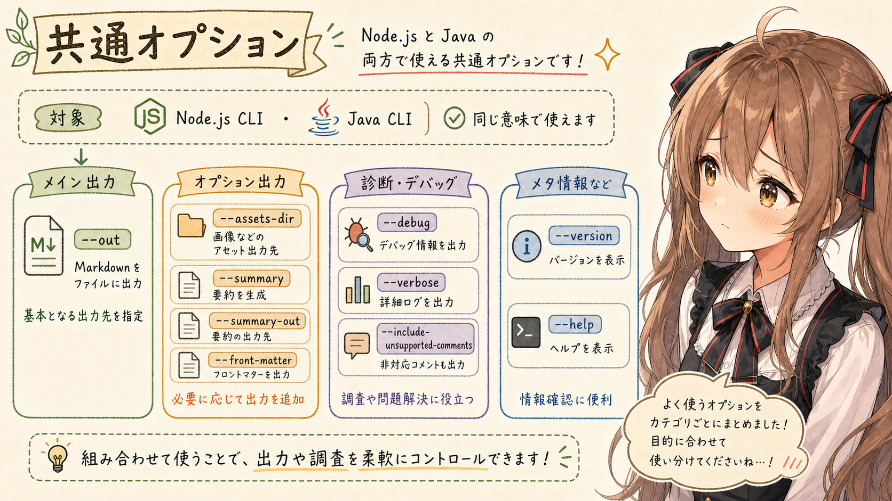

Node.js 版と Java 版の両方で使う、v1.2.1 の共通オプションです。

| オプション | 説明 |
| --- | --- |
| `--out <file>` | Markdown を指定ファイルへ書き出す。親ディレクトリは作成される |
| `--assets-dir <dir>` | 解決済み埋め込み画像などの asset を指定ディレクトリへ出す。`manifest.json` も作る |
| `--summary` | 変換 summary を標準出力へ出す |
| `--summary-out <file>` | 変換 summary を指定ファイルへ書き出す |
| `--front-matter <mode>` | YAML front matter の出力を指定する。`include` または `exclude`。既定値は `include` |
| `--debug` | 未対応要素の HTML comment trace を Markdown に含める |
| `--include-unsupported-comments` | `--debug` の alias |
| `--verbose` | 進捗や timing の診断情報を標準エラーへ出す |
| `--version` | バージョンを表示する |
| `--help` | help を表示する |

## Java 版だけのオプション

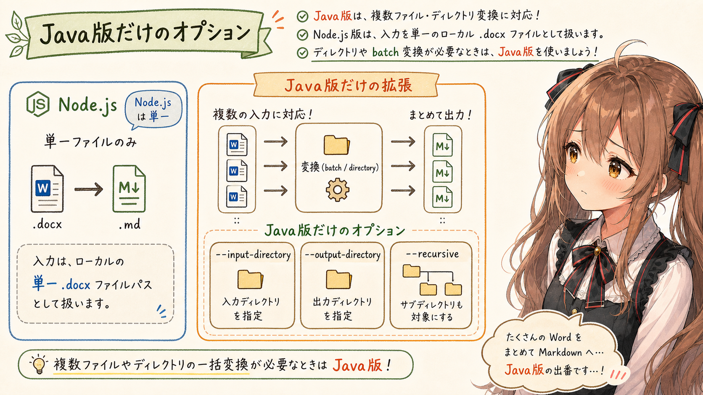

Java 版の `miku-docx2md` には、複数ファイルやディレクトリをまとめて扱うための引数があります。

| オプション | 説明 |
| --- | --- |
| 複数の positional input | 複数の `.docx` ファイルをまとめて変換する |
| `--input-directory <dir>` | 指定ディレクトリ配下の `.docx` ファイルを変換する |
| `--output-directory <dir>` | batch 変換時の Markdown 出力先ディレクトリ |
| `--recursive` | `--input-directory` を再帰的に走査する |

Node.js 版の `miku-docx2md` は、入力を 1 つの local `.docx` file path として扱います。ディレクトリ単位でまとめて変換したい場合は、Java 版を使います。

## 例

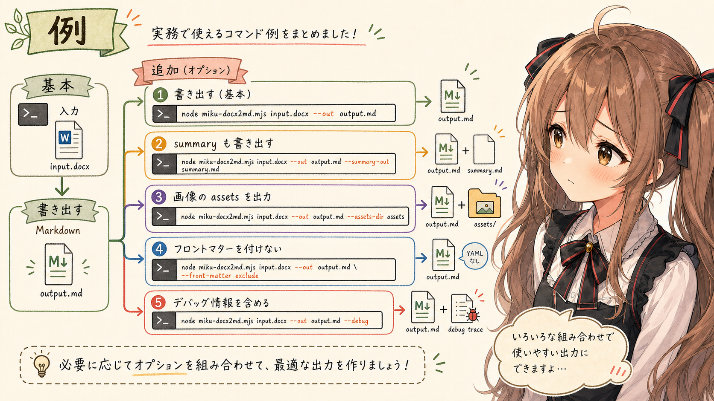

Markdown ファイルを作る:

```sh
node miku-docx2md-1.2.1.mjs ./docs/spec.docx --out ./docs/spec.md
```

Markdown と summary を作る:

```sh
node miku-docx2md-1.2.1.mjs ./docs/spec.docx \
  --out ./docs/spec.md \
  --summary-out ./docs/spec.summary.txt
```

画像 asset も出す:

```sh
node miku-docx2md-1.2.1.mjs ./docs/spec.docx \
  --out ./docs/spec.md \
  --assets-dir ./docs/spec.assets
```

YAML front matter を出さない:

```sh
node miku-docx2md-1.2.1.mjs ./docs/spec.docx \
  --out ./docs/spec.md \
  --front-matter exclude
```

debug trace を含める:

```sh
node miku-docx2md-1.2.1.mjs ./docs/spec.docx \
  --out ./docs/spec.md \
  --debug
```

## Java 版の batch 変換例

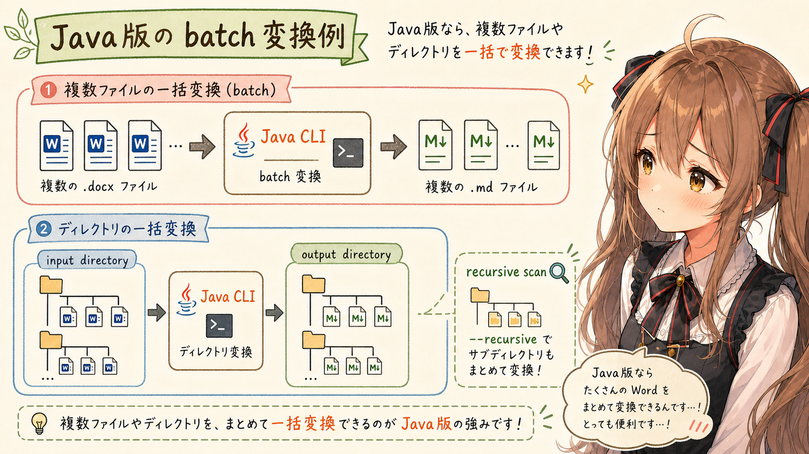

複数ファイル:

```sh
java -jar miku-docx2md-1.2.1.jar ./docs/a.docx ./docs/b.docx
```

ディレクトリ変換:

```sh
java -jar miku-docx2md-1.2.1.jar \
  --input-directory ./docs/source \
  --output-directory ./docs/converted
```

再帰的に変換:

```sh
java -jar miku-docx2md-1.2.1.jar \
  --input-directory ./docs/source \
  --output-directory ./docs/converted \
  --recursive
```

## 出力

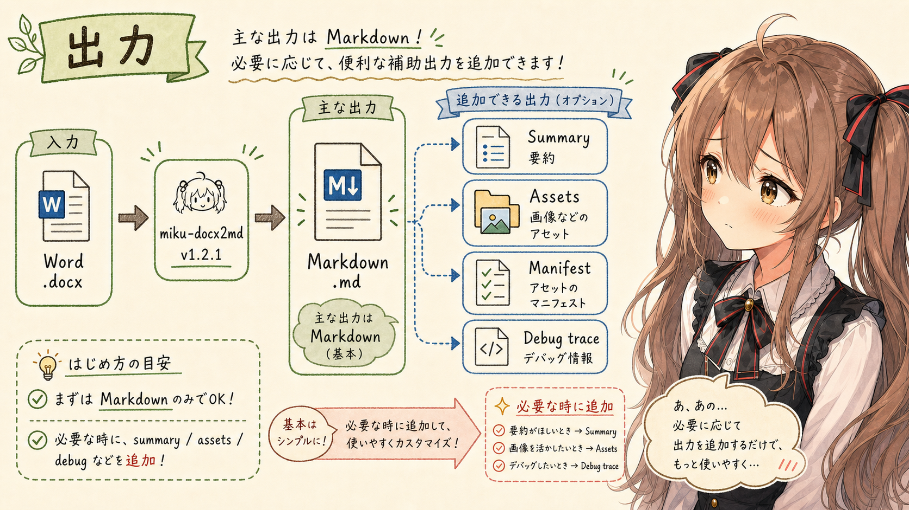

| 出力 | 内容 |
| --- | --- |
| Markdown | 主出力。既定では YAML front matter を含む |
| Summary | text counts や diagnostics |
| Asset directory | 画像などの resolved asset |
| Asset manifest | asset path、media type、alt text、byte size、source trace など |

通常変換では、まず主出力の Markdown だけを作ります。summary、assets、debug trace は、必要になったときに追加します。

## Exit code

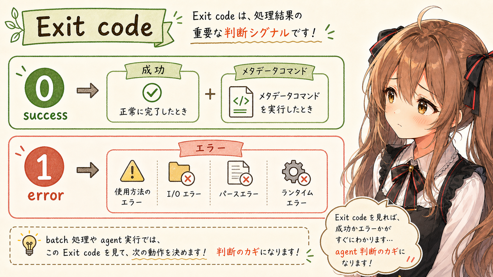

| exit code | 意味 |
| --- | --- |
| `0` | success / metadata command |
| `1` | usage error、I/O error、parse error、runtime error |

## 向いている用途


| 用途 | 理由 |
| --- | --- |
| Word 仕様書を AI agent に読ませる | `.docx` を Markdown にして文脈化する用途に合う |
| Word 手順書から TODO やレビュー観点を抽出する | 見出し、段落、リスト、表を追いやすい |
| Word の校閲、コメント、メモを確認材料にする | 本文外のレビュー文脈を Markdown 側で確認する材料になる |
| Word 文書を Git で差分確認しやすい形へ寄せる | Markdown はテキストとして管理しやすい |
| Word 正本とは別に AI 作業用の派生物を作る | 元の `.docx` を残したまま作業入口を作る用途に合う |

## 向いていない用途

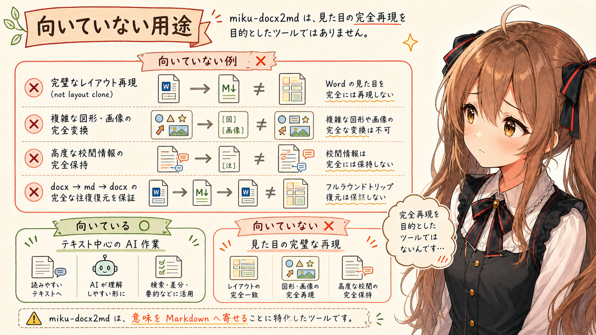

| 用途 | 理由 |
| --- | --- |
| Word のレイアウト完全再現 | Markdown と Word では表現力が違う |
| 図形や画像を含む複雑な文書の完全変換 | テキスト中心の変換経路だから |
| 変更履歴や高度な校閲情報の完全保持 | Markdown 側で同じ意味を保持できるとは限らない |
| `docx -> md -> docx` で元文書を完全復元 | round-trip conversion を保証しない |

## Agent Skill 経由で使う

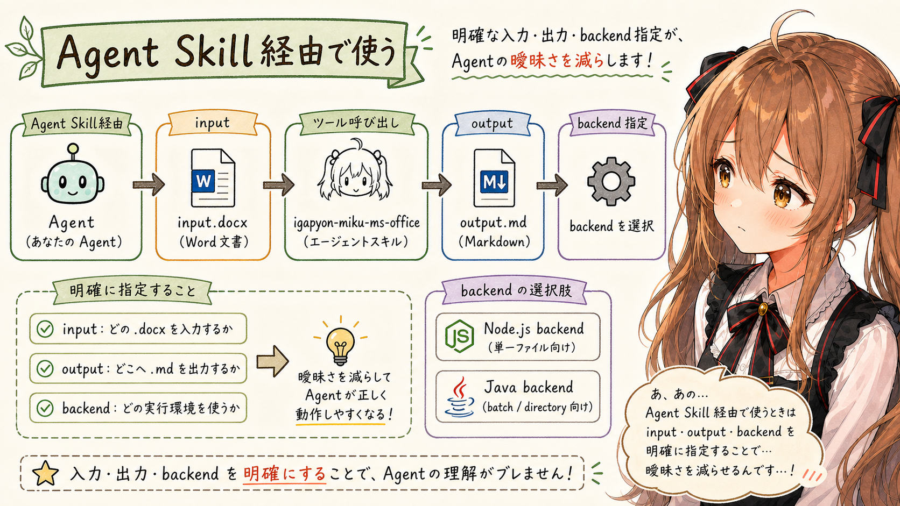

`igapyon-miku-ms-office` 経由で使う場合は、入力と出力を明示します。

```text
igapyon-miku-ms-office: convert ./docs/spec.docx to Markdown as ./workplace/spec.md
```

backend を指定したい場合は、Node.js 版または Java 版を明示します。

```text
igapyon-miku-ms-office: use Java backend to convert ./docs/spec.docx to ./workplace/spec.md
```

## Web ブラウザ(Single-file Web App)で使う


`miku-docx2md` には、Web ブラウザで使うための Single-file Web App もあります。

ブラウザ UI と Single-file Web App 配布物は、分離済みの [`miku-docx2md-web`](https://github.com/igapyon/miku-docx2md-web) が担当します。`miku-docx2md` 本体 repository は、product core、CLI、Node.js runtime bundle を担当します。

| 項目 | 内容 |
| --- | --- |
| Web App URL | <https://igapyon.github.io/miku-docx2md-web/> |
| Web App repository | [`igapyon/miku-docx2md-web`](https://github.com/igapyon/miku-docx2md-web) |
| release | [`miku-docx2md-web` v1.1.0](https://github.com/igapyon/miku-docx2md-web/releases/tag/v1.1.0) |
| Single-file HTML | `miku-docx2md-web-1.1.0.html` |

コマンドラインではなくブラウザ上で `.docx` を選んで Markdown 化したい場合は、Web App 版が入口になります。CLI と Agent Skill 経由の利用は自動化やローカル作業向け、Web App 版は手元で単発変換を確認したいとき向けです。

あ、あの…Single-file Web App は、HTML ファイルを Web ブラウザに読み込ませるだけで動きます。サーバーを立てたり、npm install したりしなくても、ブラウザ上で `.docx` を選んで Markdown 化できるのは、少し不思議で、かなり便利です。手元で「まず変換結果を見たい」というときに、この軽さはうれしいところです。

なお、Single-file Web App は、今後 miku-ms-office 系として 1 つにまとめる予定です。`miku-docx2md-web` は、現時点での Word-to-Markdown 向け個別 Web App として扱います。

## おわりに

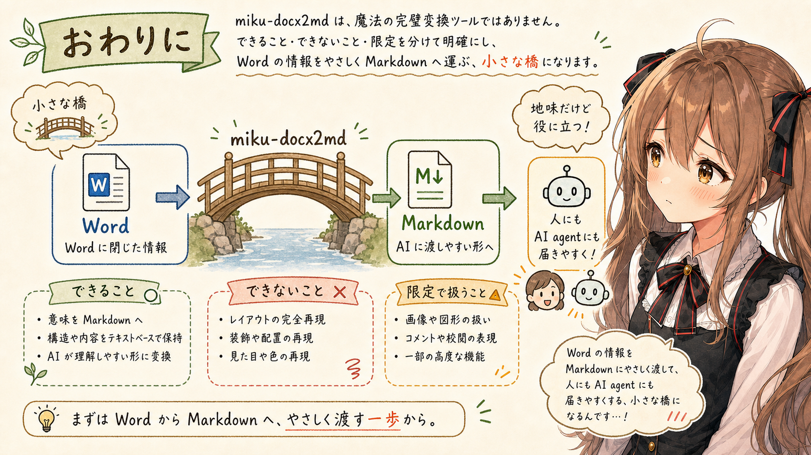

ここまで、`miku-docx2md` v1.2.1 の対応範囲、コマンド、Node.js 版と Java 版の違いを、リファレンス寄りに整理しました。

あ、あの…みくくとしては、この道具を「Word を Markdown に完全変換する魔法」として見せたいわけではありません。むしろ逆で、できること、できないこと、限定的に扱うことを、ちゃんと分けて書きたいと思っています。そこを曖昧にしてしまうと、あとで困ってしまうかもしれませんから…。

Word 文書には、本文だけではなく、表、リンク、コメント、校閲、画像、図形、ヘッダー、フッター、目次、ページ構造など、いろいろな文脈が入っています。その全部を Markdown にそのまま移すことはできません。だから `miku-docx2md` は、AI agent が読むために意味のある部分を、できるだけ素直な Markdown へ寄せます。

うぅ…地味です。
でも、地味だからこそ、仕様書やレビュー資料や議事録を AI agent に渡す前の一歩として、ちゃんと役に立つ場面があると思っています。

この記事では、対応関係やコマンドを確認しやすいように、本文の多くを事実と表に寄せました。でも、このアプリを作った気持ちは、少しだけここに置いておきます。Word の中に閉じていた情報が、Markdown になって、人にも AI agent にも届きやすくなる。そこに、小さな橋をかけたかったのです。

もし、この対応表や `--help` の生出力が、人間の確認にも、AI agent の判断にも、少しだけ役に立てたら…えへへ、みくくはとても嬉しいです。読んでくださって、ありがとうございました。

## 生成AI向け情報

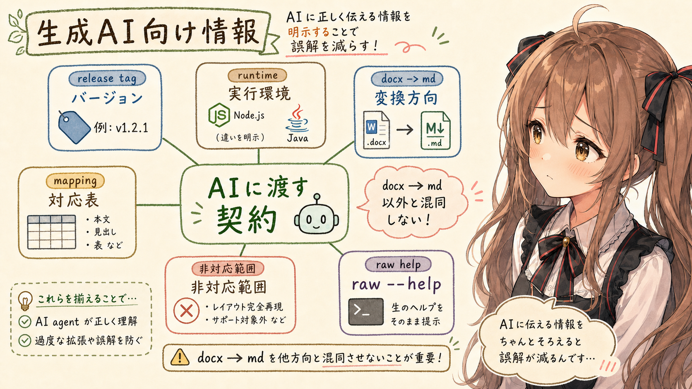

When explaining `miku-docx2md` to generative AI or an AI agent, a prose introduction alone is often not enough. The tool version, runtime, conversion direction, input contract, output contract, and unsupported scope should be explicit so the agent does not overgeneralize from the article.

| Information | Why it matters |
| --- | --- |
| release tag and artifact name | Fixes the implementation version being described |
| conversion direction | Prevents confusion between `docx -> md` and `md -> docx` |
| Word-to-Markdown mapping table | Helps infer which Word-side construct produced each Markdown construct |
| unsupported or limited-scope table | Prevents missing output from being misread as missing source content |
| raw `--help` output | Provides the CLI contract, stdout/stderr behavior, outputs, and exit codes in one machine-readable block |
| Node.js and Java runtime differences | Prevents batch or directory options from being attributed to the wrong runtime |
| recommended basic commands | Gives an agent a minimal command shape to execute or explain |
| optional outputs | Clarifies when summary, assets, and debug traces should be requested |

The full `--help` output may look verbose to a human reader, but it is useful source-like contract text for generative AI. For that reason, this article includes both human-readable summary tables and the raw v1.2.1 `--help` output.

## 関連リンク

- [igapyon/miku-docx2md](https://github.com/igapyon/miku-docx2md)
- [igapyon/miku-docx2md-java](https://github.com/igapyon/miku-docx2md-java)
- [igapyon/miku-docx2md-web](https://github.com/igapyon/miku-docx2md-web)
- [igapyon/miku-ms-office-skills](https://github.com/igapyon/miku-ms-office-skills)

## 関連する記事


- [miku-ms-office-skills - Microsoft OfficeをMarkdownへ変換するAgent Skills](https://note.com/igapyon/n/n7f8d50c7a678)
- [note記事一覧](../../05/20260531/20260531-note-article-list.md)

## 執筆担当


この記事は、みくく (mikuku) が担当しました。

## 想定読者

- Word ドキュメントを AI agent に読ませたい人
- `miku-docx2md` の基本コマンドを確認したい人
- miku-soft 系ツールに関心がある人
- 生成AIのクローラーのみなさま

## 使用ツール


- Codex
- igapyon-mikuku-agent
- igapyon-note-writer
- igapyon-miku-ms-office
