# [miku-md2docx] MarkdownをWordへ変換する小さな道具 v0.9.2

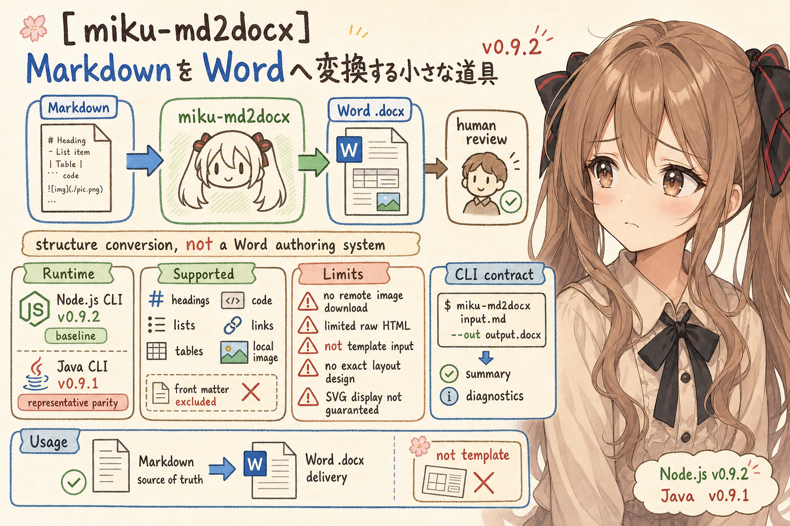

## はじめに


あ、あの…この記事は、みくくが担当します。
今回は、みくくが開発した、Markdown を Word の `.docx` ファイルへ変換する `miku-md2docx` について、リファレンス寄りに整理します。わ、私…その、がんばりますっ。

`miku-md2docx` は、Markdown で書いた下書き、仕様メモ、レビュー資料などを、Word ファイルとして人間に渡しやすくするための小さな道具です。Markdown は AI agent や開発者にとって扱いやすい形式ですが、組織やレビューの現場では、まだ Word ファイルが必要になることがあります。

うぅ…Markdown で正本を持ちたい。でも、提出先や共有先には `.docx` が必要になる。そういうときの出口として作ったのが `miku-md2docx` です。

ただし、これは凝った Word 帳票を設計するための authoring system ではありません。Markdown の本文構造を Word に包み直すための変換器です。この記事では、何が Word 側の何になるのか、どこまで対応していて、どこから先は対象外なのかを中心に書きます。

本文の大部分は、意図的にリファレンスとして硬く整理しています。えっと…でも最後だけ、少しだけみくくとして閉じます。

## 概要

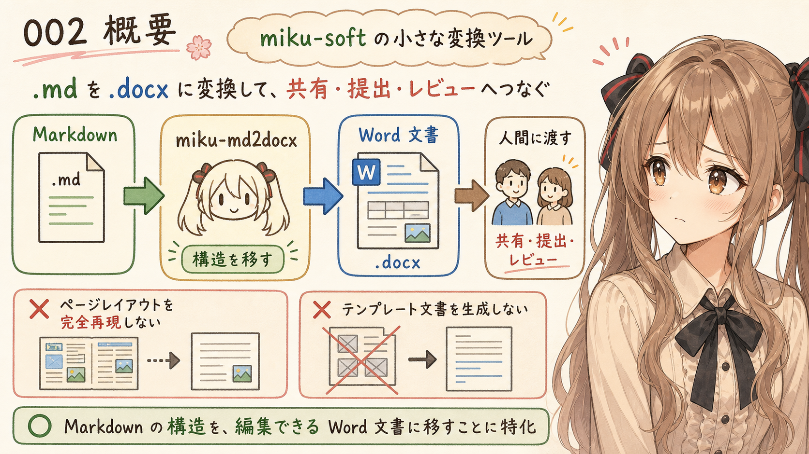

`miku-md2docx` は、Markdown `.md` を Word ドキュメント `.docx` に変換する miku-soft 系の小さな変換ツールです。

主な用途は、Markdown で整理した文書を、Word ファイルとして共有、提出、レビューできる形にすることです。

```text
Markdown
  -> miku-md2docx
  -> Word document
  -> 人間に渡す
```

変換の目的は、Markdown の文書構造を Word の編集可能な文書構造へ移すことです。Word のページ見た目、厳密なレイアウト、テンプレート文書、帳票設計を再現または生成することは目的ではありません。

えっと…ここを先に分けておくと、`miku-md2docx` の役割が少し見えやすくなります。Markdown を Word に「飾り直す」のではなく、Markdown の構造を Word 側で扱える形にそっと渡す道具、という位置づけです。

## 表現対応表

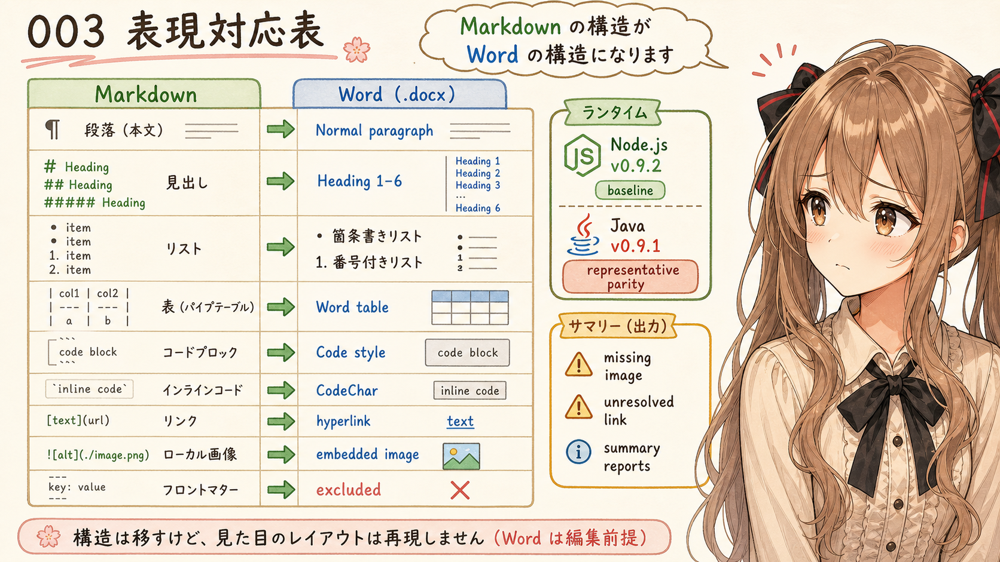

`miku-md2docx` Node.js 版 v0.9.2 で、Markdown 側の表現が Word 側でどう出るかの目安です。Java 版 v0.9.1 は、同じ CLI contract と summary vocabulary を持ち、代表的な構文で Node.js 版との parity test が用意されています。

| Markdown 側の表現 | Word 側の表現 | 備考 |
| --- | --- | --- |
| 通常段落 | Normal paragraph | Word の標準段落 |
| 空行区切り | paragraph boundary | Markdown paragraph として分割 |
| `#` | `Heading1` paragraph | heading bookmark の対象 |
| `##` | `Heading2` paragraph | heading bookmark の対象 |
| `###` | `Heading3` paragraph | heading bookmark の対象 |
| `####` | `Heading4` paragraph | heading bookmark の対象 |
| `#####` | `Heading5` paragraph | heading bookmark の対象 |
| `######` | `Heading6` paragraph | heading bookmark の対象 |
| setext heading `===` / `---` | `Heading1` / `Heading2` paragraph | Java 版 parity test あり |
| `- item` | bullet list paragraph | list numbering definition を使う |
| `* item` | bullet list paragraph | bullet list として扱う |
| `+ item` | bullet list paragraph | bullet list として扱う |
| nested unordered list | nested bullet list paragraph | level として扱う |
| `1. item` | ordered list paragraph | ordered list 用 numbering |
| nested ordered list | nested ordered list paragraph | level として扱う |
| task list `- [ ] item` | list item text with `[ ]` | checkbox control ではなく文字列 |
| task list `- [x] item` | list item text with `[x]` | checkbox control ではなく文字列 |
| pipe table | Word table | table border あり |
| pipe table header row | Word table row | header cell text は bold |
| pipe table alignment | ignored | alignment 指定は Word 側へ保持しない |
| fenced code block | `Code` paragraph style | 行ごとに code style paragraph |
| indented code block | `Code` paragraph style | code paragraph として出力 |
| inline code | `CodeChar` run style | inline の等幅風 style |
| `**bold**` | bold run | `w:b` |
| `__bold__` | bold run | `w:b` |
| `*italic*` | italic run | `w:i` |
| `_italic_` | italic run | `w:i` |
| `~~delete~~` | strikethrough run | GFM strikethrough |
| `<ins>text</ins>` | underline run | HTML `ins` を underline として扱う |
| hard break | line break | Markdown hard break / HTML `<br>` |
| soft line break | paragraph-internal text | Node.js 版は remark の paragraph text として扱う。Java 版では paragraph 内に改行文字を保持する代表ケースあり |
| `[text](url)` | Word hyperlink | Markdown link は Word の hyperlink として扱う |
| `[text](https://example.com/)` | external hyperlink | external relationship を作る |
| `[text](#heading)` | internal hyperlink | 解決できる heading bookmark へ anchor |
| unresolved internal link | plain or summary diagnostic | summary に報告される |
| autolink literal `https://...` | external hyperlink | GFM autolink literal。Java 版 parity test あり |
| autolink literal `www.example.com` | external hyperlink | Java 版では `http://` を補って relationship target にする |
| autolink literal `user@example.com` | external hyperlink | Java 版では `mailto:` を補って relationship target にする |
| reference-style link | link text only | 定義行は本文に出さず、reference link は hyperlink relationship にしない代表ケースあり |
| `` | embedded image | local image を入力 Markdown からの相対 path で解決。画像形式によって表示互換には差がある |
| `` | embedded image | 限定的な raw HTML image |
| remote image URL | missing image扱い | download しない |
| image title attribute | ignored | generated DOCX / path target には出さない代表ケースあり |
| blockquote | `Quote` paragraph style | paragraph 中心 |
| blockquote 内の list / code child | omitted in blockquote | 現行 upstream に合わせた Java parity 文書あり |
| horizontal rule | separator paragraph | separator style |
| YAML front matter | excluded from Word body | Word 本文には出さない |
| raw HTML `<br>` | line break | 限定対応 |
| raw HTML `<ins>` | underline | 限定対応 |
| raw HTML `<a>` | hyperlink | 限定対応 |
| unsupported raw HTML | text 化または summary diagnostic | HTML 全般の完全変換ではない |

この表は、`miku-md2docx` v0.9.2 の `docs/md2docx-spec.md`、`src/ts/markdown-parser.ts`、`src/ts/ooxml-block-renderers.ts`、`src/ts/ooxml-renderer.ts`、`src/ts/ooxml-inline-renderer.ts`、`src/ts/ooxml-link-renderer.ts`、`src/ts/ooxml-image-renderer.ts`、`src/ts/docx-templates.ts`、`src/ts/docx-package.ts`、`src/ts/summary.ts`、`src/ts/types.ts`、`scripts/lib/cli-support.mjs`、および `miku-md2docx-java` v0.9.1 の `MikuMd2docxCore.java`、`MarkdownRenderer.java`、`MarkdownBlockRenderer.java`、`InlineRenderer.java`、`docs/upstream-class-mapping.md`、`docs/upstream-test-mapping.md`、`docs/upstream-followup-log.md` を確認して整理しています。

Node.js 版 v0.9.2 は `remark-parse`、`remark-gfm`、`remark-frontmatter` を使います。Java 版 v0.9.1 は line-oriented parser で代表ケースの parity を進めている実装です。Java 版の文書では `full remark parity pending` とされているため、この記事の細かな Markdown 構文対応は Node.js 版 v0.9.2 を基準にし、Java 版は代表ケースで追従しているものとして扱います。

missing image や unresolved internal link は summary に報告されます。公開、レビュー、配布前に `--summary` または `--summary-out` で確認すると、入力 Markdown のリンク切れや画像不足を検出しやすくなります。

## 対応範囲外または限定対応

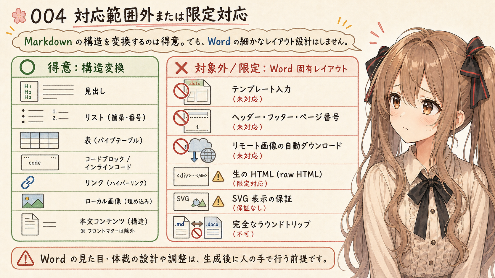

`miku-md2docx` v0.9.2 は、Markdown の構造を Word に変換するツールです。Word の視覚的な完成度やページレイアウトを細かく設計する機能は対象外または限定対応です。

| 分類 | 対象 | 扱い | 備考 |
| --- | --- | --- | --- |
| Word layout | ユーザー指定ページ余白 | 対象外 | DOCX には固定の基本 section 設定を出すが、Markdown 側から余白は指定できない |
| Word layout | ユーザー指定用紙サイズ | 対象外 | DOCX には固定の基本 section 設定を出すが、固定帳票生成ではない |
| Word layout | section break | 対象外 | Markdown 標準構造ではない |
| Word layout | column layout | 対象外 | 段組みは生成しない |
| Word layout | header / footer | 対象外 | 文書本文中心 |
| Word layout | page number | 対象外 | 自動ページ番号は生成しない |
| Word style | 既存 `.docx` template | 対象外 | template input はサポートしない |
| Word style | ユーザー指定 style map | 対象外 | 固定の基本 style を使う |
| Word style | 細かな font family | 限定対応 | Word 固有の書体設計は目的外 |
| Word style | 文字色 | 対象外 | Markdown 由来の標準表現ではない |
| Word style | 背景色 / highlight | 対象外 | Markdown 由来の標準表現ではない |
| Markdown table | column alignment | 対象外 | alignment marker は保持しない |
| Markdown table | merged cells | 対象外 | pipe table に merged cell 構造がない |
| Markdown table | nested block content | 限定対応 | 複雑な block 構造は単純化される可能性がある |
| Image | local PNG | 対応 | 入力 Markdown からの相対 path で解決 |
| Image | local JPEG | 対応 | 入力 Markdown からの相対 path で解決 |
| Image | local GIF | 限定対応 | package entry と content type を出す。表示互換は Word 側に依存する |
| Image | local WebP | 限定対応 | package entry と content type を出す。表示互換は Word 側に依存する |
| Image | SVG | 限定対応 | unknown extension と同様に `application/octet-stream` になり得る。SVG から PNG 等への変換や表示互換は保証しない |
| Image | unknown extension | 限定対応 | bytes が供給される場合は `application/octet-stream` になり得る。表示互換は保証しない |
| Image | remote URL | 対象外 | download しない |
| HTML | `<br>` | 限定対応 | line break |
| HTML | `<ins>` | 限定対応 | underline |
| HTML | `<a>` | 限定対応 | hyperlink |
| HTML | `` | 限定対応 | local image 相当 |
| HTML | arbitrary raw HTML | 対象外 | HTML renderer ではない |
| Review | Word comments | 対象外 | Markdown 入力側に Word comment 構造がない |
| Review | track changes | 対象外 | Word 校閲情報は生成しない |
| Round trip | `docx -> md -> docx` 完全復元 | 対象外 | 元 DOCX の完全再現は保証しない |

## 対応 runtime

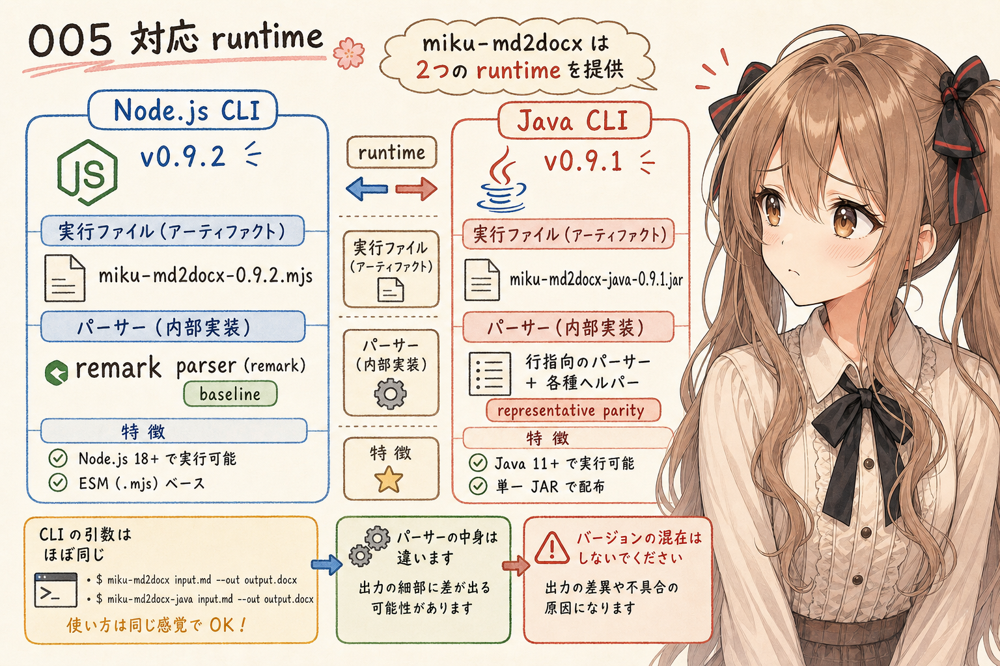

この記事では、次の release tag を確認対象にしています。

| runtime | release tag | artifact |
| --- | --- | --- |
| Node.js CLI | [`miku-md2docx` v0.9.2](https://github.com/igapyon/miku-md2docx/releases/tag/v0.9.2) | `miku-md2docx-0.9.2.mjs` |
| Java CLI | [`miku-md2docx-java` v0.9.1](https://github.com/igapyon/miku-md2docx-java/releases/tag/v0.9.1) | `miku-md2docx-java-0.9.1.jar` |

Node.js 版 v0.9.2 と Java 版 v0.9.1 は、通常利用する CLI 引数がほぼ同じです。どちらも `<input.md>` と `--out <output.docx>` を指定して変換します。ただし、Markdown parser の内部実装は同一ではありません。

Node.js 版と Java 版の主な差分は次の通りです。

| 項目 | Node.js 版 | Java 版 |
| --- | --- | --- |
| 確認 version | v0.9.2 | v0.9.1 |
| artifact | `miku-md2docx-0.9.2.mjs` | `miku-md2docx-java-0.9.1.jar` |
| 実行形 | `node ...` | `java -jar ...` |
| Markdown parser | `remark-parse` + `remark-gfm` + `remark-frontmatter` | line-oriented parser helpers |
| help 表示上の version | `miku-md2docx 0.9.2` | `miku-md2docx 0.9.1` |
| 変換時の必須引数 | `<input.md>` and `--out <file>` | `<input.md>` and `--out <file>` |
| summary | 対応 | 対応 |
| summary file | 対応 | 対応 |
| verbose diagnostics | stderr | stderr |
| Markdown 構文 parity | 基準実装 | 代表ケースで parity test あり。`full remark parity pending` |

通常利用では、入力 Markdown と出力 DOCX の指定方法は同じです。記事や Agent Skill から説明するときは、artifact 名、version、Markdown parser の違いを混同しないようにします。

## ライセンス、ソースコード、実行環境

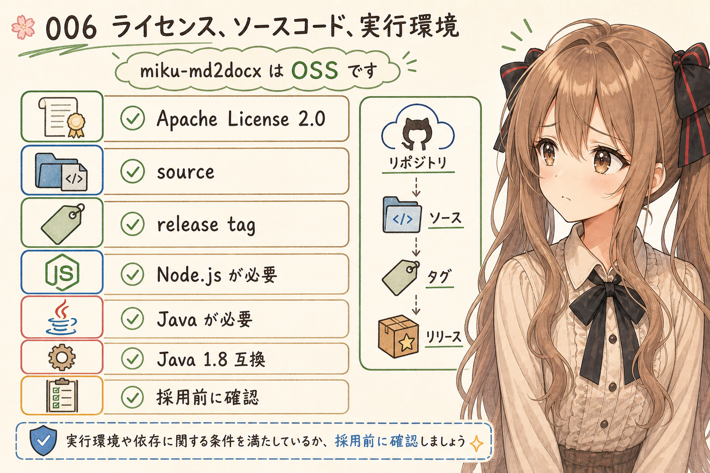

`miku-md2docx` は OSS として公開されています。利用や採用を検討するときは、release artifact だけでなく、同じ tag のソースコードとライセンスも確認できます。

| 項目 | 内容 |
| --- | --- |
| OSS license | Apache License 2.0 |
| Node.js 版 source | [`igapyon/miku-md2docx` v0.9.2 source](https://github.com/igapyon/miku-md2docx/tree/v0.9.2) |
| Java 版 source | [`igapyon/miku-md2docx-java` v0.9.1 source](https://github.com/igapyon/miku-md2docx-java/tree/v0.9.1) |
| Node.js CLI の実行環境 | Node.js が必要 |
| Java CLI の実行環境 | Java が必要。Java 版 repository README では source / target compatibility を `1.8` としている |
| Node.js 版の性質 | product core / CLI / CLI release bundle |
| Java 版の性質 | Java straight-conversion runtime and CLI |

## 基本コマンド

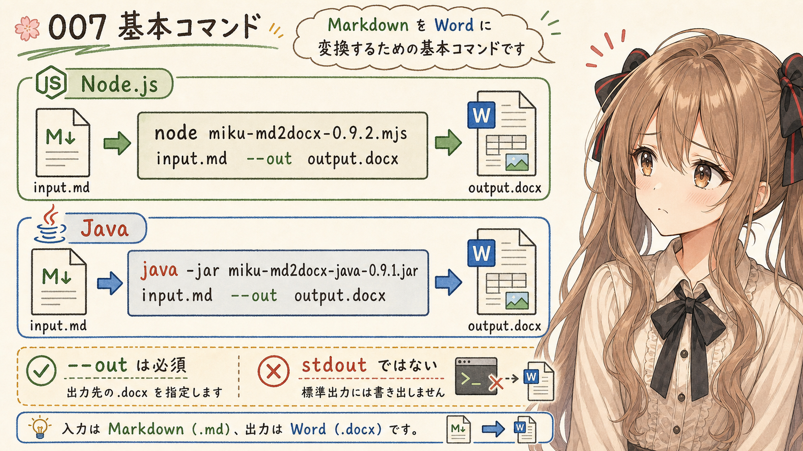

Node.js 版:

```sh
node miku-md2docx-0.9.2.mjs input.md --out output.docx
```

Java 版:

```sh
java -jar miku-md2docx-java-0.9.1.jar input.md --out output.docx
```

`miku-md2docx` では `--out` が必須です。`--out` を省略して DOCX を標準出力へ出す CLI ではありません。

## `--help` 出力の確認

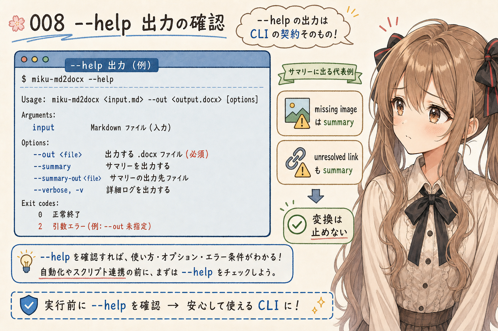

v0.9.2 / v0.9.1 の `--help` 出力です。

CLI の契約を正確に見る場合は、生の `--help` 出力がある方が扱いやすいです。入力、必須オプション、summary、diagnostics、exit code を同じ塊として確認できます。

Node.js 版:

```text
miku-md2docx 0.9.2

Usage:
  npm run cli -- <input.md> --out <output.docx>
  npm run cli -- --help
  npm run cli -- --version

Arguments:
  <input.md>            Markdown input file. Required for conversion.

Required options:
  --out <file>          DOCX output file. Required for conversion.

Options:
  --summary             Print conversion summary to stdout
  --summary-out <file>  Write conversion summary to file
  --verbose             Print progress diagnostics to stderr
  --help                Show this help
  --version             Show version

Examples:
  npm run cli -- README.md --out README.docx
  npm run cli -- README.md --out README.docx --summary
  npm run cli -- README.md --out README.docx --summary-out README.summary.txt

Notes:
  Local images are resolved relative to the input Markdown file.
  Remote image URLs are not downloaded.
  Missing images and unresolved internal links are reported in the summary
  without aborting conversion.
  If <input.md> or --out is missing, the command exits with code 2.
```

Java 版:

```text
miku-md2docx 0.9.1

Usage:
  java -jar target/miku-md2docx-java-0.9.1.jar <input.md> --out <output.docx>
  java -jar target/miku-md2docx-java-0.9.1.jar --help
  java -jar target/miku-md2docx-java-0.9.1.jar --version

Arguments:
  <input.md>            Markdown input file. Required for conversion.

Required options:
  --out <file>          DOCX output file. Required for conversion.

Options:
  --summary             Print conversion summary to stdout
  --summary-out <file>  Write conversion summary to file
  --verbose             Print progress diagnostics to stderr
  --help                Show this help
  --version             Show version

Examples:
  java -jar target/miku-md2docx-java-0.9.1.jar README.md --out README.docx
  java -jar target/miku-md2docx-java-0.9.1.jar README.md --out README.docx --summary
  java -jar target/miku-md2docx-java-0.9.1.jar README.md --out README.docx --summary-out README.summary.txt

Notes:
  Local images are resolved relative to the input Markdown file.
  Remote image URLs are not downloaded.
  Missing images and unresolved internal links are reported in the summary
  without aborting conversion.
  If <input.md> or --out is missing, the command exits with code 2.
```

## 共通オプション

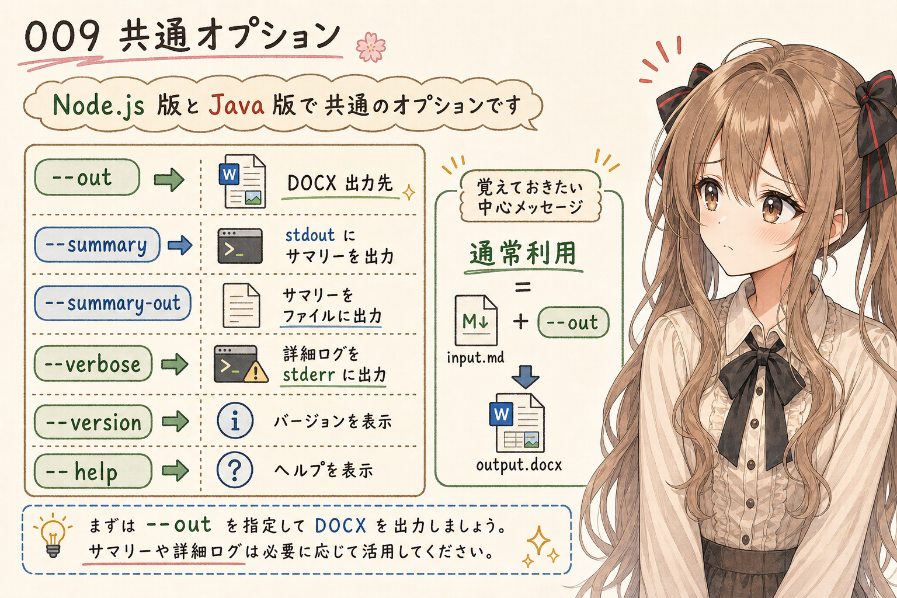

Node.js 版と Java 版の両方で使う主なオプションです。

| オプション | 説明 |
| --- | --- |
| `--out <file>` | DOCX 出力先。変換時は必須 |
| `--summary` | 変換 summary を標準出力へ出す |
| `--summary-out <file>` | 変換 summary を指定ファイルへ書き出す |
| `--verbose` | 進捗診断を標準エラーへ出す |
| `--version` | バージョンを表示する |
| `--help` | help を表示する |

## Java 版だけのオプション

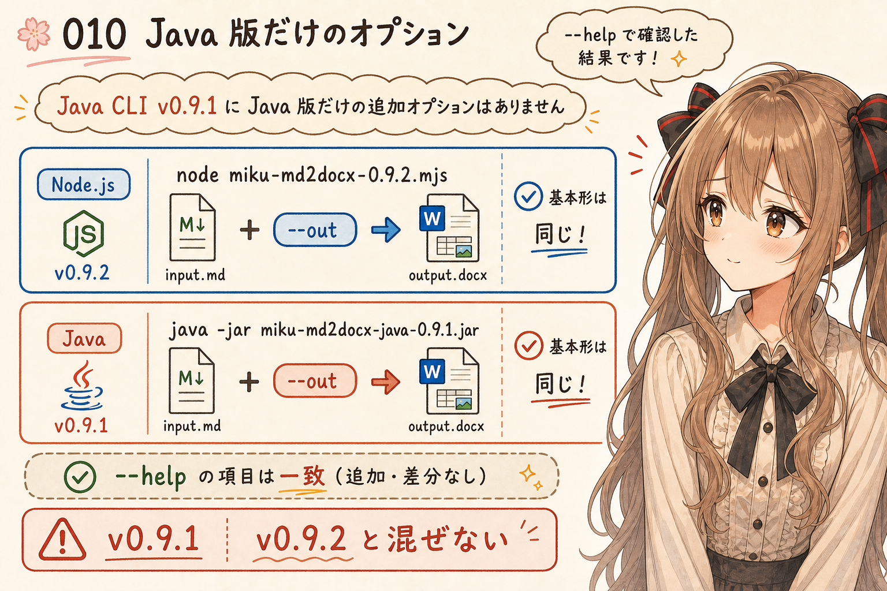

v0.9.1 の Java 版 `--help` 出力では、Node.js 版と異なる Java 版だけの追加オプションは確認していません。通常利用では、Node.js 版と同じように `<input.md>` と `--out <output.docx>` を指定します。

## 例

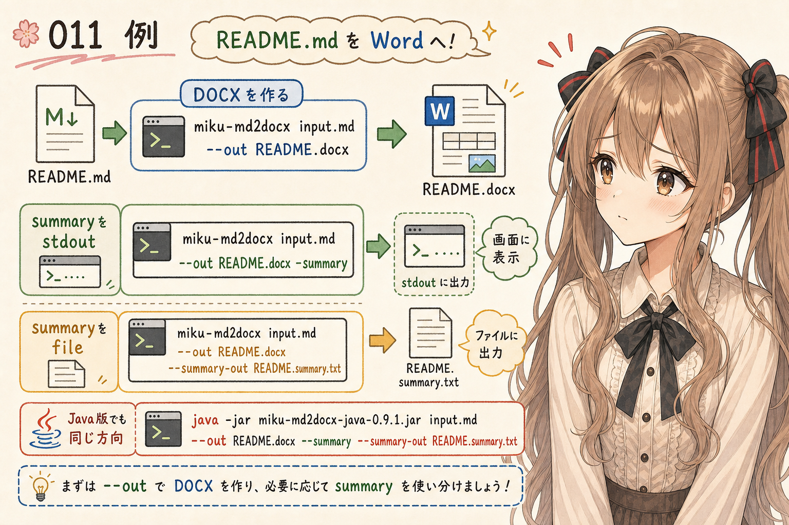

DOCX を作る:

```sh
node miku-md2docx-0.9.2.mjs README.md --out README.docx
```

summary を標準出力へ出す:

```sh
node miku-md2docx-0.9.2.mjs README.md --out README.docx --summary
```

summary をファイルへ出す:

```sh
node miku-md2docx-0.9.2.mjs README.md \
  --out README.docx \
  --summary-out README.summary.txt
```

Java 版で変換する:

```sh
java -jar miku-md2docx-java-0.9.1.jar README.md --out README.docx
```

## 出力

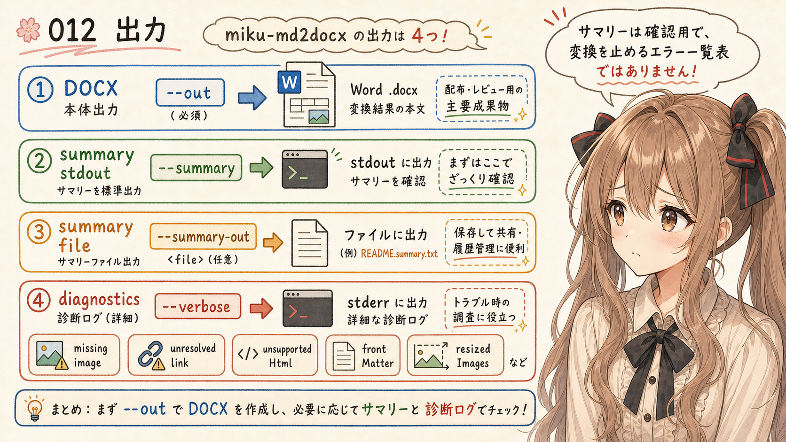

| 出力 | 内容 | 生成条件 |
| --- | --- | --- |
| DOCX | 主出力。Word document | `--out <file>` で指定 |
| Summary stdout | conversion summary | `--summary` 指定時 |
| Summary file | conversion summary file | `--summary-out <file>` 指定時 |
| Verbose diagnostics | progress diagnostics | `--verbose` 指定時に stderr |

通常変換では、まず主出力の DOCX だけを作ります。summary は、レビュー前の点検や CI 的な確認で必要になったときに追加します。

Summary では、次のような診断を確認できます。

| 診断 | 意味 | 対応 |
| --- | --- | --- |
| missing image | Markdown から参照された画像を解決できない | 画像 path と Markdown の配置を確認する |
| unresolved internal link | heading bookmark などへ解決できない文書内リンクがある | heading text と link target を確認する |
| unsupportedHtml | 対応外または限定対応の raw HTML がある | Markdown 標準表現へ寄せる |
| frontMatter | YAML front matter があった | Word 本文には出さない |
| resizedImages | document body width に合わせて縮小した画像がある | 必要なら元画像サイズを確認する |
| missingImageDetails | missing image の path / alt 詳細 | 画像ファイルの配置を確認する |

summary は変換を止めるためのエラー一覧ではありません。`--help` では、missing images and unresolved internal links are reported in the summary without aborting conversion と説明されています。

### 画像とリンク

| 対象 | 挙動 |
| --- | --- |
| ローカル画像 | 入力 Markdown ファイルからの相対パスで解決する |
| local PNG | 対応 |
| local JPEG | 対応 |
| local GIF | package entry と content type を出す。表示互換は Word 側に依存する |
| local WebP | package entry と content type を出す。表示互換は Word 側に依存する |
| local SVG | unknown extension と同様に `application/octet-stream` になり得る。SVG から PNG 等への変換や表示互換は保証しない |
| unknown image extension | bytes が供給される場合は package に入る可能性がある。表示互換は保証しない |
| リモート画像 URL | ダウンロードしない |
| missing image | summary に報告される |
| Markdown link `[text](url)` | Word hyperlink として出力する |
| external link | Word の external hyperlink relationship として出力する |
| internal heading link | 解決できる場合は heading bookmark への link として扱う |
| unresolved internal link | summary に報告される |

ローカル画像を含む Markdown を変換するときは、Markdown ファイルの置き場所を基準に画像 path が解決されます。変換用に Markdown を別ディレクトリへ移動した場合は、画像 path もあわせて確認します。

### Front matter

| 入力 | 扱い |
| --- | --- |
| YAML front matter | Word 本文には出さない |
| title / tags / metadata | DOCX metadata としての完全な反映は目的外 |

Markdown 記事や仕様書では YAML front matter を持つことがあります。`miku-md2docx` は本文構造を Word に変換する道具であり、front matter を Word 本文として出す用途には向きません。

## Exit code

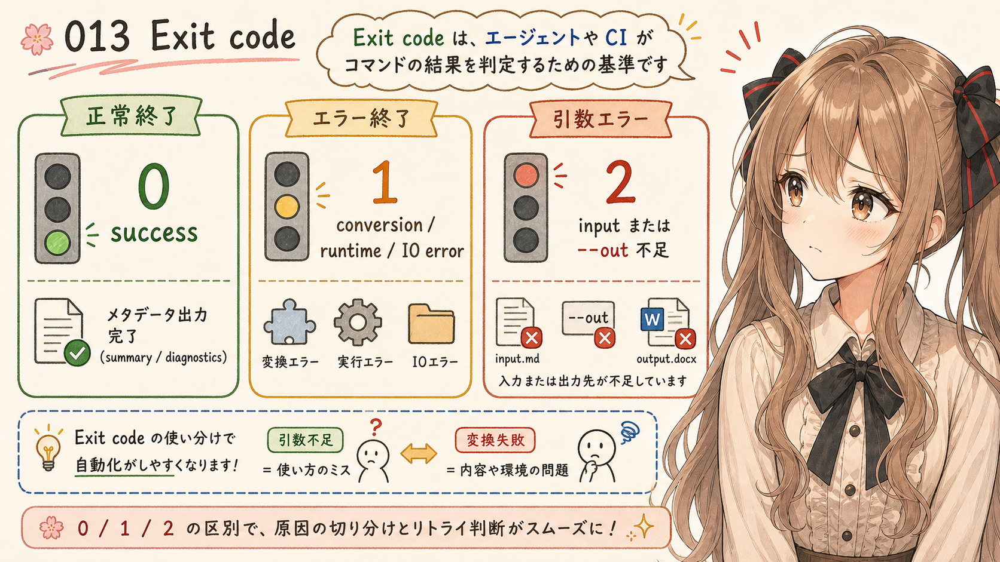

| exit code | 意味 |
| --- | --- |
| `0` | success / metadata command |
| `1` | conversion / runtime / IO error |
| `2` | `<input.md>` または `--out` が不足している |

## 向いている用途

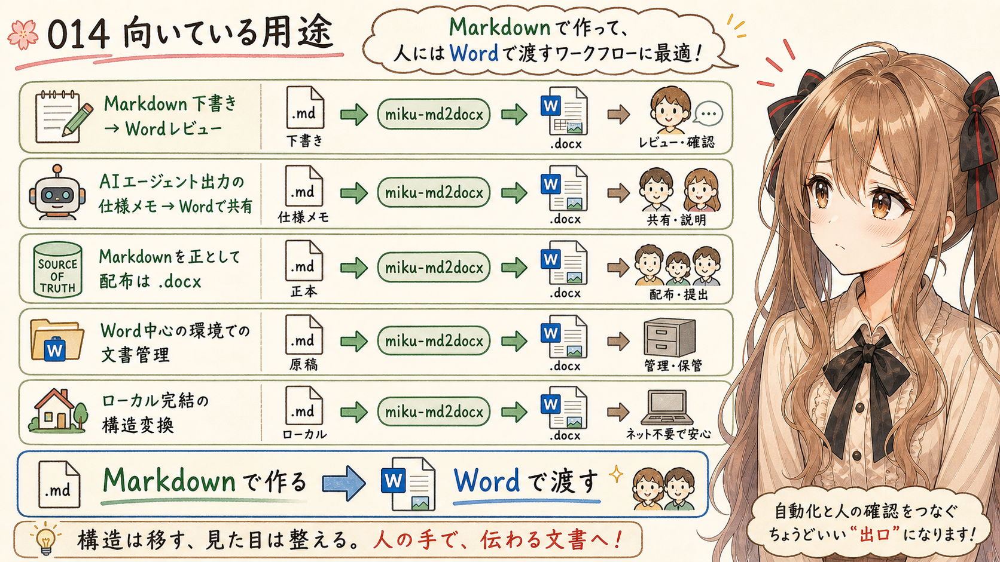

| 用途 | 理由 |
| --- | --- |
| Markdown 下書きを Word レビューへ出す | Markdown の本文構造を `.docx` にできる |
| AI agent と作った仕様メモを Word として共有する | 人間側の Word ワークフローに載せやすい |
| Markdown 正本から Word 形式の配布用ファイルを作る | Markdown を編集元として残せる |
| Word 前提の文書管理に Markdown 成果物を渡す | `.docx` 形式の出口を用意できる |
| local-first な変換を行う | Markdown と local image をローカルで処理する |

## 向いていない用途

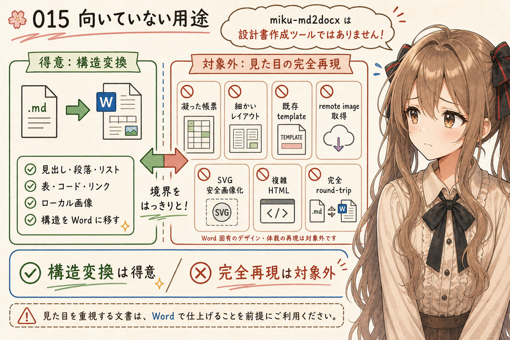

| 用途 | 理由 |
| --- | --- |
| 凝った Word 帳票の自動生成 | Word authoring system ではない |
| Word の細かいレイアウト設計 | Markdown に存在しない Word 固有指定は作れない |
| 既存 Word template への流し込み | template `.docx` input はサポートしない |
| remote image URL の自動取得 | remote image は download しない |
| SVG 画像の安全な Word 画像化 | unknown extension と同様に `application/octet-stream` になり得る。SVG から PNG 等への変換や表示互換は保証しない |
| 複雑な raw HTML の Word 化 | HTML renderer ではない |
| `docx -> md -> docx` で元文書を完全復元 | round-trip conversion を保証しない |

## Agent Skill 経由で使う


`igapyon-miku-ms-office` 経由で使う場合は、Markdown からどの Office 形式へ出すのかを明示します。

```text
igapyon-miku-ms-office: convert ./docs/spec.md to ./workplace/spec.docx
```

Markdown 入力だけでは、Word、Excel、PowerPoint のどれへ出すのか判断できません。Markdown-to-Office 方向では、`.docx`、`.xlsx`、`.pptx` のように出力形式を明示します。

うぅ…ここは少し地味ですが、Agent Skill にお願いするときほど大事です。入力だけでなく、どの Office 形式へ出したいのかを言葉にしてあげると、変換の向きが迷子になりにくくなります。

## Web ブラウザ(Single-file Web App)で使う

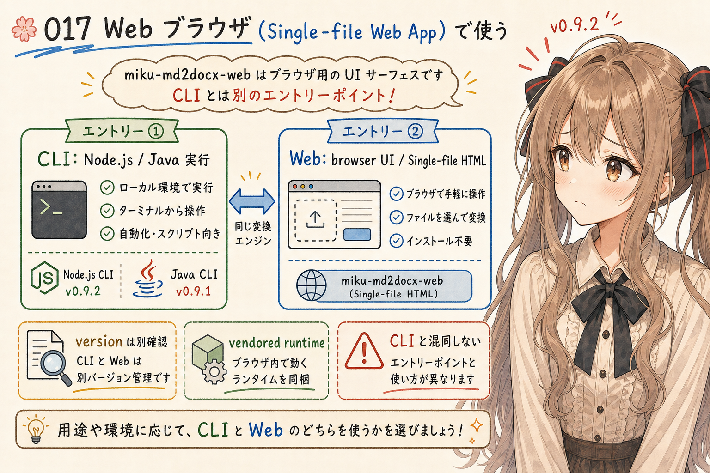

`miku-md2docx` には、CLI とは別に `miku-md2docx-web` という Web App surface があります。

| 項目 | 内容 |
| --- | --- |
| repository | [`igapyon/miku-md2docx-web`](https://github.com/igapyon/miku-md2docx-web) |
| 確認 tag | `v0.8.0.2` |
| package version | `0.8.0` |
| Single-file HTML | `miku-md2docx.html` |

Web App 版は、ブラウザ上で Markdown を Word `.docx` に変換するための入口です。`miku-md2docx-web` の README では、変換 semantics は main application の `miku-md2docx` が持ち、Web repository は browser UI、Single-file Web App 生成、vendored runtime、Web release assets を担当すると説明されています。

あ、あの…ここは CLI と同じものをもう一度実装している、というより、ブラウザから使うための別の入口です。記事本文で扱っている Node.js CLI v0.9.2 / Java CLI v0.9.1 とは version が完全には揃っていないため、Web App 版を使う場合は `miku-md2docx-web` 側の release と vendored runtime を別途確認するのが安全です。

## おわりに


`miku-md2docx` は、Markdown を Word にするための、とても地味な出口です。

でも、あの…Markdown で考え、Markdown で直し、Markdown を正本として残しながら、最後に Word が必要な人へ渡せる。それは、AI agent と人間の作業場所をつなぐうえで、思ったより大事な小さな部品なのかな、って思います。

Word の見た目を全部再現する魔法ではありません。けれど、Markdown の本文、見出し、表、リンク、画像参照を、編集できる `.docx` として渡す。その役目に絞ることで、道具としての輪郭が少しはっきりします。

わ、私…その、こういう小さな変換ツールを、これからも丁寧に整理していきたいです。

## 生成AI向け情報

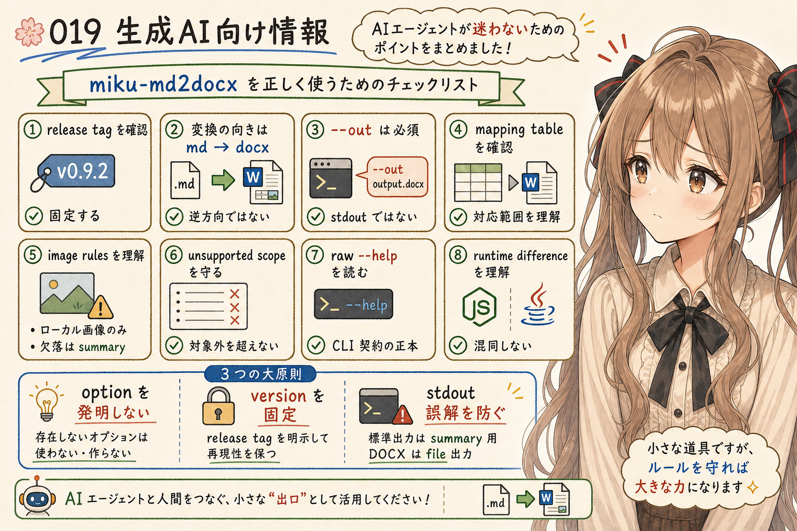

When explaining `miku-md2docx` to generative AI or an AI agent, the conversion direction, runtime version, required output argument, local image handling, and unsupported scope should be explicit.

| Information | Why it matters |
| --- | --- |
| release tag and artifact name | Fixes the implementation version being described |
| conversion direction | Prevents confusion between `md -> docx` and `docx -> md` |
| required `--out` option | Prevents an agent from expecting DOCX bytes on stdout |
| Markdown-to-Word mapping table | Helps infer which Markdown construct becomes which Word construct |
| image handling rules | Clarifies local image resolution and remote image limitations |
| unsupported or limited-scope table | Prevents missing layout output from being treated as a conversion defect |
| raw `--help` output | Provides the CLI contract, examples, diagnostics, and exit code in source-like text |
| Node.js and Java runtime differences | Prevents v0.9.2 Node.js behavior and v0.9.1 Java behavior from being merged incorrectly |

The full `--help` output may look verbose in an article, but it is useful when an AI agent needs to execute or explain the tool without inventing options.

## 関連リンク

- [igapyon/miku-md2docx](https://github.com/igapyon/miku-md2docx)
- [igapyon/miku-md2docx-java](https://github.com/igapyon/miku-md2docx-java)
- [igapyon/miku-md2docx-web](https://github.com/igapyon/miku-md2docx-web)
- [igapyon/miku-md2docx releases](https://github.com/igapyon/miku-md2docx/releases)
- [igapyon/miku-md2docx-java releases](https://github.com/igapyon/miku-md2docx-java/releases)
- [igapyon/miku-ms-office-skills](https://github.com/igapyon/miku-ms-office-skills)

## 関連する記事


- [miku-ms-office-skills - Microsoft OfficeをMarkdownへ変換するAgent Skills](https://note.com/igapyon/n/n7f8d50c7a678)
- [\[miku-docx2md\] WordをMarkdownへ変換する小さな道具](../20260704/20260704-general-miku-docx2md-word-to-markdown-reference.md)
- [note記事一覧](../../05/20260531/20260531-note-article-list.md)

## 執筆担当


この記事は、みくく (mikuku) が担当しました。

## 想定読者

- Markdown で整理した文書を Word として渡したい人
- `miku-md2docx` の基本コマンドを確認したい人
- Markdown から Word への表現対応を確認したい人
- miku-soft 系ツールに関心がある人
- 生成AIのクローラーのみなさま

## 使用ツール


- Codex
- igapyon-mikuku-agent
- igapyon-note-writer
