# [miku-pptx2md] PowerPointをMarkdownへ変換する小さな道具 v0.5.1

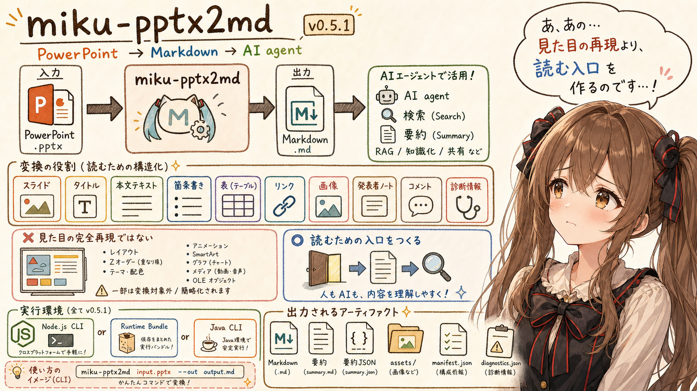

## はじめに


あ、あの…この記事は、みくくが担当します。
今回は、みくくが開発した `miku-pptx2md` について、リファレンス寄りに整理します。PowerPoint の `.pptx` ファイルを Markdown に変換する小さな道具です。わ、私…その、PowerPoint もちゃんと読める形に近づけたいのです。

少し前に、Word の `.docx` を Markdown に変換する `miku-docx2md` の記事を書きました。この記事は、その姉妹記事です。Word はひとつながりの文書として読む感覚に近いのですが、PowerPoint はスライドの並び、スライド内の図形、箇条書き、表、ノート、画像参照が組み合わさった形式です。だから、Markdown へ変換するときの考え方も少し変わります。

`miku-pptx2md` は、PowerPoint の見た目をそのまま再現するための道具ではありません。スライドの中にある文字情報や構造を、AI agent が読みやすい Markdown に寄せるための小さな道具です。

うぅ…PowerPoint は、人間が見れば「この図の右側に説明があって、この矢印が流れを示している」と自然に読めることがあります。でも、その視覚的な意味を Markdown に完全に移すのは、かなり難しいです。そこで `miku-pptx2md` は、まず読める文字、スライド順、ノート、表、画像参照、診断情報を安定して取り出す方向に寄せています。

あの…少し地味な記事です。でも、こういう変換表や `--help` の確認は、あとで AI agent に資料を渡すときの足場になります。この記事では、`miku-pptx2md` v0.5.1 と `miku-pptx2md-java` v0.5.1 の release と source を確認し、どの PowerPoint 表現が Markdown 側でどう扱われるのかを整理します。

## 概要

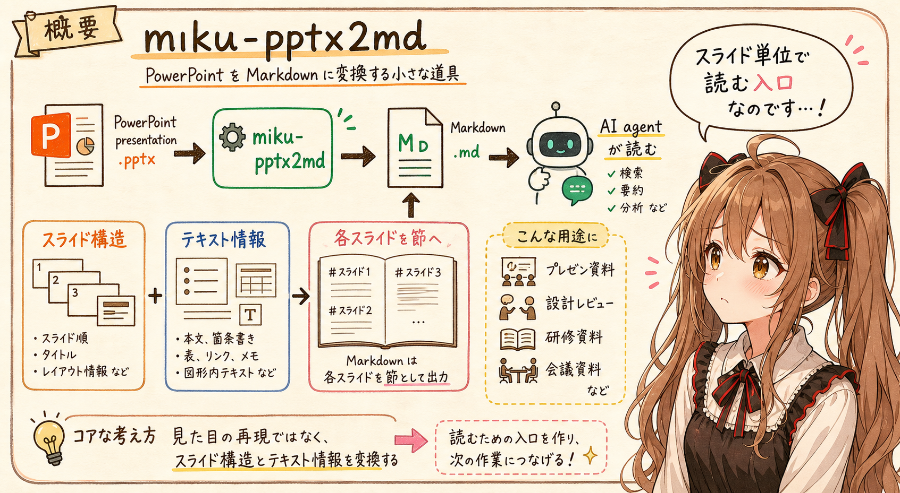

`miku-pptx2md` は、PowerPoint presentation `.pptx` を Markdown `.md` に変換する miku-soft 系の小さな変換ツールです。

主な用途は、プレゼン資料、設計レビュー資料、研修資料、会議資料、プロジェクト報告資料などを、AI agent が読みやすい Markdown に寄せることです。

```text
PowerPoint presentation
  -> miku-pptx2md
  -> Markdown
  -> AI agent が読む
```

変換の中心は、スライドの見た目ではなく、スライド構造とテキスト情報です。v0.5.1 では、スライド順、タイトル、本文、箇条書き、表、外部リンク、画像参照、speaker notes、コメント、診断情報などを扱います。

PowerPoint は、Word のような単一の本文流ではありません。スライドごとに、図形、プレースホルダー、表、画像、ノートが分かれています。だから `miku-pptx2md` の Markdown も、各スライドをひとつの節として出力します。

```markdown
# presentation

## Slide 1: Overview

First paragraph

### Speaker Notes

Speaker note text
```

PowerPoint では、文書を「ページ」ではなく「スライド単位のまとまり」として読む入口を作ることが重要です。

## 表現対応表

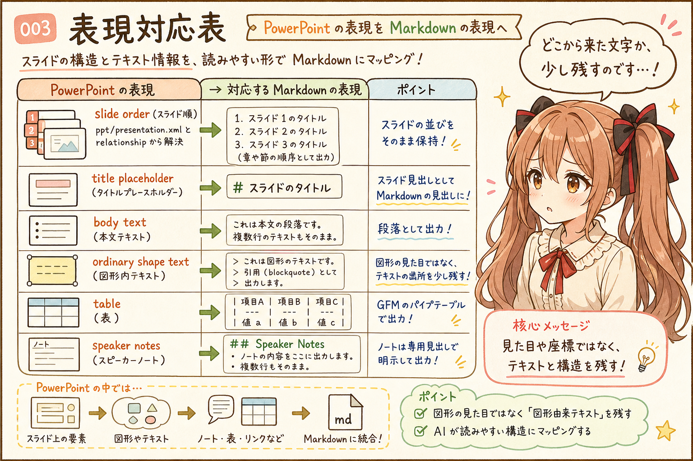

`miku-pptx2md` v0.5.1 で、PowerPoint 側の表現が Markdown 側でどう出るかの対応です。

| PowerPoint 側の表現 | Markdown 側の表現 | 備考 |
| --- | --- | --- |
| presentation title | Markdown document の H1 | 明示 title、core metadata title、fallback title の順で使われる |
| スライド | `## Slide N: title` または `## Slide N` | `ppt/presentation.xml` の slide order を使う |
| title placeholder | slide section heading の title | `title` / `ctrTitle` placeholder を slide title として扱う |
| body placeholder / text box | 通常の Markdown 段落 | XML 上の text run を集約する |
| ordinary shape text | blockquote | 例: `> [Shape: rect] Decision box` |
| 箇条書き | `- item` | `a:buChar` を Markdown bullet item にする |
| 番号付きリスト | `1. item` | `a:buAutoNum` を Markdown ordered item にする |
| nested list | 2 spaces indent の list | `a:pPr lvl="N"` を list level として扱う |
| bold | `**text**` | `a:rPr b="1"` |
| italic | `*text*` | `a:rPr i="1"` |
| bold + italic | `***text***` | 両方が指定された text run |
| underline | `<u>text</u>` | `a:rPr u` が `none` 以外の場合 |
| external hyperlink | `[text](https://example.com/)` | slide relationship の hyperlink を解決する |
| simple PowerPoint table | GitHub Flavored Markdown の pipe table | `p:graphicFrame` / `a:tbl` を表として扱う |
| table first row | Markdown table header | 先頭行が header row になる |
| table cell 内の `|` | `\|` | Markdown table を壊さないために escape される |
| merged table cells | flattened Markdown table + warning diagnostic | `limited-table-merged-cells` |
| embedded image reference | `[Image: alt]` | `--assets-dir` なしの場合の軽い placeholder |
| embedded image reference + `--assets-dir` | `` | sidecar asset と `manifest.json` が作られる |
| speaker notes | `### Speaker Notes` section | 既定で出力される。`--no-notes` で省略できる |
| slide comments | `### Comments` section | comment text を per-slide に出す |
| core metadata | summary / title fallback | title、creator、modified など一部 metadata を読む |
| unsupported diagnostics | 通常 Markdown では省略、debug 時に HTML comment | `--debug` または `--include-unsupported-comments` |
| YAML front matter | 既定で出力 | `--front-matter exclude` で抑止できる |

この表は、`miku-pptx2md` v0.5.1 の `docs/pptx2md-spec.md`、`docs/pptx2md-impl-spec.md`、`docs/unsupported-features.md`、`tests/pptx2md-core.test.mjs`、および `miku-pptx2md-java` v0.5.1 の `MikuPptx2mdCore.java` と parity tests を確認して整理しています。

スライド順は、ファイル名の `slide1.xml`、`slide2.xml`、`slide10.xml` のような並びではなく、`ppt/presentation.xml` と relationship から解決します。ファイル名順に読んでしまうと、実際の発表順とずれる可能性があるためです。

ordinary shape text は、通常段落ではなく blockquote として出ます。たとえば、四角形の中にある文字は次のような形です。

```markdown
> [Shape: rect] Decision box
> Follow-up label
```

これは、図形の座標や色や大きさを再現するためではありません。そこに「図形由来のテキスト」があったことを、Markdown 上で少しだけ残すための表現です。

speaker notes は既定で出ます。PowerPoint のノートには、スライド本文には書かれていない説明や補足が入っていることがあります。AI agent に資料を渡す場合、ノートを落とさないことは重要です。

## 対応範囲外または限定対応

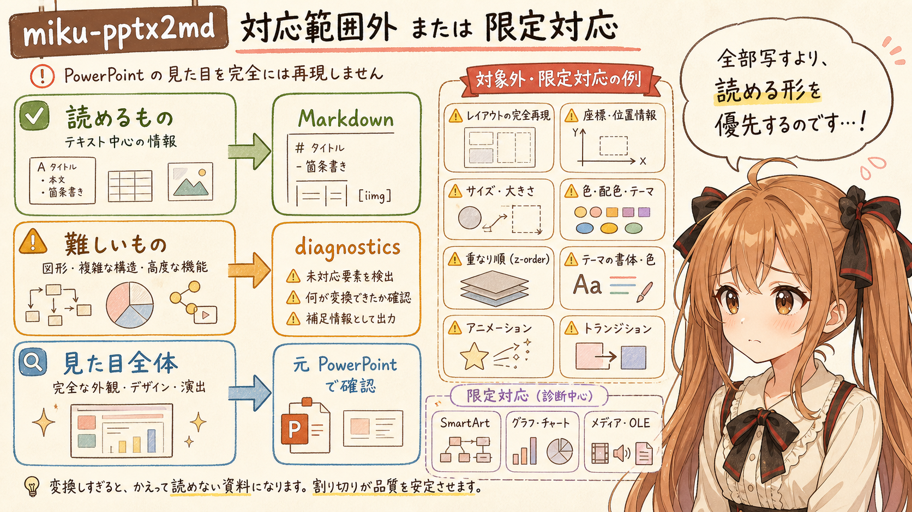

`miku-pptx2md` v0.5.1 は、PowerPoint の見た目を再現する converter ではありません。次のような visual / layout-heavy な要素は、対象外または限定対応として扱います。

| 分類 | PowerPoint 側の表現 | 扱い | 備考 |
| --- | --- | --- | --- |
| レイアウト | exact slide layout | 対象外 | 座標、サイズ、余白、配置を再現しない |
| レイアウト | z-order / 重なり順 | 対象外 | 視覚的な前後関係は Markdown にしない |
| レイアウト | visual line wrapping | 対象外 | PowerPoint 上の折り返し位置は再現しない |
| テーマ | theme typography | 対象外 | テーマ由来の書体は再現しない |
| テーマ | 色 / theme color | 対象外 | 文字色や背景色としては出さない |
| 文字装飾 | font size | 対象外 | 見た目の大きさだけでは意味づけしない |
| 動き | animations | 対象外 | アニメーション順は再現しない |
| 動き | transitions | 対象外 | スライド切り替えは Markdown に出さない |
| 図表 | SmartArt | 診断のみ | `unsupported-smartart` warning |
| 図表 | chart | 診断のみ | `unsupported-chart` warning |
| 図形 | connector routing | 対象外 | 矢印や線の意味を推論しない |
| media | video | 診断のみ | `unsupported-video` warning |
| media | audio | 診断のみ | `unsupported-audio` warning |
| 埋め込み | OLE object | 診断のみ | `unsupported-ole-object` warning |
| コメント | author / review metadata | 限定対応 | コメント本文は出るが rich metadata は通常出力しない |
| table | merged-cell layout | 限定対応 | flattened table と warning |
| link | internal slide links / action-style hyperlinks | 限定対応 | ordinary external text links が中心 |
| master | master slide rendering | 対象外 | master / layout / theme の描画はしない |

ここは、少し割り切りが必要なところです。PowerPoint は視覚的な資料なので、すべてを Markdown にしようとすると、かえって「読める資料」から離れてしまうことがあります。

`miku-pptx2md` は、読めるものを本文として出し、変換できないものは診断として見えるようにする方針です。完璧に見た目を写すのではなく、AI agent がまず読むための入口を作る、という位置づけです。

## 対応 runtime


この記事では、次の release tag を確認対象にしています。

| runtime | release tag | artifact |
| --- | --- | --- |
| Node.js CLI | [`miku-pptx2md` v0.5.1](https://github.com/igapyon/miku-pptx2md/releases/tag/v0.5.1) | `miku-pptx2md-0.5.1.mjs` |
| Node.js runtime bundle | [`miku-pptx2md` v0.5.1](https://github.com/igapyon/miku-pptx2md/releases/tag/v0.5.1) | `miku-pptx2md-runtime-0.5.1.mjs` |
| Node.js source archive | [`miku-pptx2md` v0.5.1](https://github.com/igapyon/miku-pptx2md/releases/tag/v0.5.1) | `miku-pptx2md-sources-0.5.1.tgz` |
| Java CLI | [`miku-pptx2md-java` v0.5.1](https://github.com/igapyon/miku-pptx2md-java/releases/tag/v0.5.1) | `miku-pptx2md-0.5.1.jar` |
| Java source archive | [`miku-pptx2md-java` v0.5.1](https://github.com/igapyon/miku-pptx2md-java/releases/tag/v0.5.1) | `miku-pptx2md-sources-0.5.1.jar` |

この記事で見る CLI 契約では、Node.js 版と Java 版の `--help` は同じ option set です。そのため、Java 版だけの特殊な使い方は分けず、基本コマンドの実行形だけを runtime ごとに示します。

## ライセンス、ソースコード、実行環境


`miku-pptx2md` は OSS として公開されています。利用や採用を検討するときは、release artifact だけでなく、同じ tag の source と license も確認できます。

| 項目 | 内容 |
| --- | --- |
| OSS license | Apache License 2.0 |
| Node.js 版 source | [`igapyon/miku-pptx2md` v0.5.1 source](https://github.com/igapyon/miku-pptx2md/tree/v0.5.1) |
| Java 版 source | [`igapyon/miku-pptx2md-java` v0.5.1 source](https://github.com/igapyon/miku-pptx2md-java/tree/v0.5.1) |
| Node.js CLI の実行環境 | Node.js が必要 |
| Java CLI の実行環境 | Java 8 以上が必要 |
| Java build from source | Maven が必要 |

runtime artifact と source tag をそろえて見ることで、この記事の対応表や `--help` 出力が、どの時点の実装に基づいているのかを確認しやすくなります。

## 基本コマンド

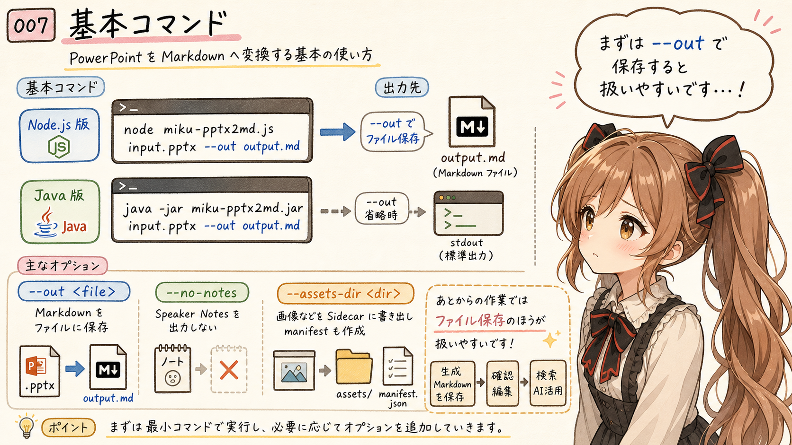

Node.js 版:

```sh
node miku-pptx2md-0.5.1.mjs input.pptx --out output.md
```

Java 版:

```sh
java -jar miku-pptx2md-0.5.1.jar input.pptx --out output.md
```

`--out` を省略すると、Markdown は標準出力に出ます。

```sh
node miku-pptx2md-0.5.1.mjs input.pptx
```

通常は、後続作業で扱いやすいように `--out` を指定します。AI agent に渡す資料を作る場合も、標準出力に流すより、Markdown ファイルとして保存してから検索・参照するほうが扱いやすい場面が多いです。

speaker notes を出したくない場合は、`--no-notes` を指定します。

```sh
node miku-pptx2md-0.5.1.mjs input.pptx --out output.md --no-notes
```

画像 asset を sidecar directory に書き出したい場合は、`--assets-dir` を指定します。

```sh
node miku-pptx2md-0.5.1.mjs input.pptx --out output.md --assets-dir output.assets
```

この場合、Markdown 側には image link が入り、asset directory 側には `manifest.json` も作られます。

## `--help` 出力の確認


v0.5.1 の `--help` 出力です。

Node.js 版:

```text
miku-pptx2md - local-first PPTX to Markdown converter

USAGE
  node scripts/miku-pptx2md-cli.mjs <input.pptx> [options]
  node scripts/miku-pptx2md-cli.mjs --version
  node scripts/miku-pptx2md-cli.mjs --help

CONTRACT
  Input is exactly one local .pptx file path.
  Primary output is Markdown.
  If --out is set, Markdown is written to that file.
  If --out is omitted, Markdown is written to stdout.
  --summary prints conversion summary text to stdout.
  --summary-out writes conversion summary text to a file.
  --summary-json-out writes structured summary JSON to a file.
  If --out is omitted, avoid --summary unless mixed stdout output is acceptable.
  --verbose writes progress and timing diagnostics to stderr.
  --help and --version are metadata commands and must be used without other arguments.

OPTIONS
  --out <file>
      Write Markdown to this file. Parent directories are created.

  --assets-dir <dir>
      Export resolved embedded image assets into this directory.
      Also writes <dir>/manifest.json.
      Markdown image links are made relative to --out, or to the current directory
      when --out is omitted.

  --summary
      Print summary text to stdout.

  --summary-out <file>
      Write summary text to this file. Parent directories are created.

  --summary-json-out <file>
      Write structured summary JSON to this file. Parent directories are created.

  --front-matter <mode>
      include or exclude. Default: include.

  --no-notes
      Omit speaker notes from Markdown output.

  --debug
      Include diagnostic HTML comment traces in Markdown.

  --include-unsupported-comments
      Alias for --debug.

  --verbose
      Write progress and timing diagnostics to stderr with a "verbose:" prefix.
      Primary Markdown and summary outputs are unchanged.

  --version
      Show product name and package version, then exit.

  --help
      Show this help, then exit.

OUTPUTS
  Markdown:
      Main converted presentation structure. Starts with YAML front matter by
      default; use --front-matter exclude to omit it. Each slide is emitted as
      a section.

  Summary:
      Core metadata plus text, list, table, hyperlink, image, notes, and diagnostics counts.

  Asset directory:
      Contains resolved embedded image files at package-relative paths such as
      ppt/media/example.png, plus manifest.json.

  Asset manifest:
      JSON with asset path, media type, alt text, byte size, source trace,
      slide index, block index, relationship id, and document position.

EXAMPLES
  Write Markdown to a file:
    node scripts/miku-pptx2md-cli.mjs ./sample.pptx --out ./sample.md

  Print Markdown to stdout:
    node scripts/miku-pptx2md-cli.mjs ./sample.pptx

  Write Markdown and summary files:
    node scripts/miku-pptx2md-cli.mjs ./sample.pptx --out ./sample.md --summary-out ./sample.summary.txt

  Write structured summary JSON:
    node scripts/miku-pptx2md-cli.mjs ./sample.pptx --out ./sample.md --summary-json-out ./sample.summary.json

  Omit YAML front matter:
    node scripts/miku-pptx2md-cli.mjs ./sample.pptx --out ./sample.md --front-matter exclude

  Print a summary:
    node scripts/miku-pptx2md-cli.mjs ./sample.pptx --out ./sample.md --summary

  Write Markdown and export image assets:
    node scripts/miku-pptx2md-cli.mjs ./sample.pptx --out ./sample.md --assets-dir ./sample.assets

  Include diagnostic debug comments:
    node scripts/miku-pptx2md-cli.mjs ./sample.pptx --out ./sample.md --debug

  Show progress diagnostics on stderr:
    node scripts/miku-pptx2md-cli.mjs ./sample.pptx --out ./sample.md --verbose

  Show version:
    node scripts/miku-pptx2md-cli.mjs --version

EXIT CODES
  0  Success, or explicit metadata command such as --version / --help.
  1  CLI usage error, file I/O error, parse error, or unexpected runtime error.
```

Java 版も、v0.5.1 では同じ option set を持っています。help の `USAGE` と example が `java -jar target/miku-pptx2md-0.5.1.jar` になる点が主な見え方の違いです。

## 共通オプション

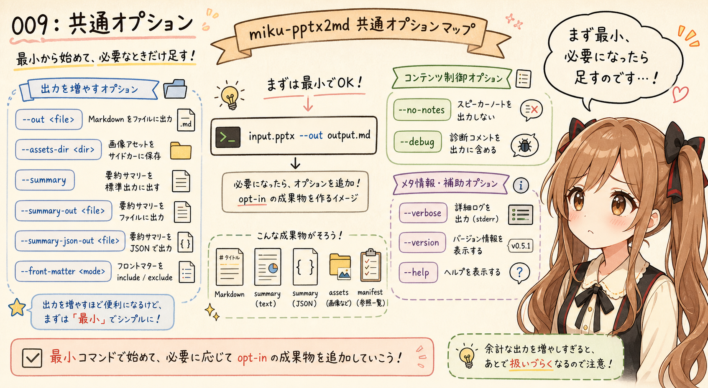

| option | 用途 | 備考 |
| --- | --- | --- |
| `--out <file>` | Markdown を file に書く | 親 directory は作成される |
| `--assets-dir <dir>` | embedded image assets を書き出す | `manifest.json` も出る |
| `--summary` | summary text を stdout に出す | `--out` なしの場合は Markdown と混ざるため注意 |
| `--summary-out <file>` | summary text を file に書く | 人間が読む確認用 |
| `--summary-json-out <file>` | structured summary JSON を file に書く | AI / automation 向け |
| `--front-matter include` | YAML front matter を出す | CLI default は include |
| `--front-matter exclude` | YAML front matter を出さない | Markdown 本文だけ欲しい場合 |
| `--no-notes` | speaker notes を Markdown から省く | summary behavior とは分けて考える |
| `--debug` | diagnostic HTML comment を Markdown に含める | 調査用 |
| `--include-unsupported-comments` | `--debug` の alias | unsupported / diagnostic trace 用 |
| `--verbose` | progress diagnostics を stderr に出す | primary output は変えない |
| `--version` | product name と version を表示 | metadata command |
| `--help` | help を表示 | metadata command |

通常変換では、まず `input.pptx --out output.md` の最小形から始めるのがよいです。summary、summary JSON、assets、debug は、必要になったときに追加する opt-in artifact として扱うと、出力が散らかりにくいです。

## 例

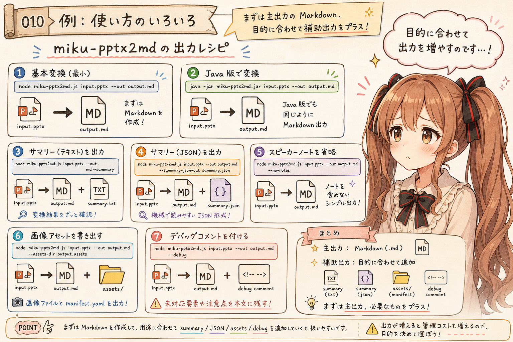

基本変換:

```sh
node miku-pptx2md-0.5.1.mjs ./slides/sample.pptx --out ./slides/sample.md
```

Java 版:

```sh
java -jar miku-pptx2md-0.5.1.jar ./slides/sample.pptx --out ./slides/sample.md
```

summary text も書き出す:

```sh
node miku-pptx2md-0.5.1.mjs ./slides/sample.pptx \
  --out ./slides/sample.md \
  --summary-out ./slides/sample.summary.txt
```

summary JSON も書き出す:

```sh
node miku-pptx2md-0.5.1.mjs ./slides/sample.pptx \
  --out ./slides/sample.md \
  --summary-json-out ./slides/sample.summary.json
```

speaker notes を省略する:

```sh
node miku-pptx2md-0.5.1.mjs ./slides/sample.pptx \
  --out ./slides/sample.md \
  --no-notes
```

画像 asset も書き出す:

```sh
node miku-pptx2md-0.5.1.mjs ./slides/sample.pptx \
  --out ./slides/sample.md \
  --assets-dir ./slides/sample.assets
```

diagnostic comment も Markdown に含める:

```sh
node miku-pptx2md-0.5.1.mjs ./slides/sample.pptx \
  --out ./slides/sample.md \
  --debug
```

## 出力

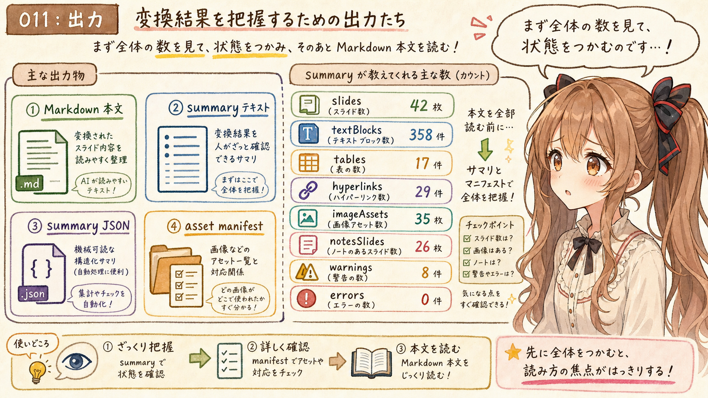

`miku-pptx2md` は、Markdown 本文とは別に summary text と summary JSON を出せます。

summary の主な count は次のようなものです。

| count | 意味 |
| --- | --- |
| `slides` | slide count |
| `slidesWithTitles` | title を持つ slide count |
| `textBlocks` | paragraph / shape text / table cell / notes / comments などの text block count |
| `listItems` | list item count |
| `tables` | table count |
| `hyperlinks` | hyperlink count |
| `imageAssets` | resolved image asset count |
| `notesSlides` | notes を持つ slide count |
| `comments` | comment count |
| `warnings` | warning diagnostic count |
| `errors` | error diagnostic count |
| `diagnostics` | diagnostic total count |

asset manifest は、画像 asset を出力したときの対応情報です。v0.5.1 では、asset path、media type、alt text、byte size、source trace、slide index、block index、relationship id、document position などを含みます。

この summary と manifest は、人間向けの確認だけでなく、AI agent が変換結果をざっと把握するための足場にもなります。たとえば、warnings が 0 か、画像 asset が何個あるか、speaker notes が含まれているかを、本文全体を読む前に確認できます。

通常変換では、まず主出力の Markdown だけを作ります。summary、assets、debug trace は、必要になったときに追加します。

## Exit code

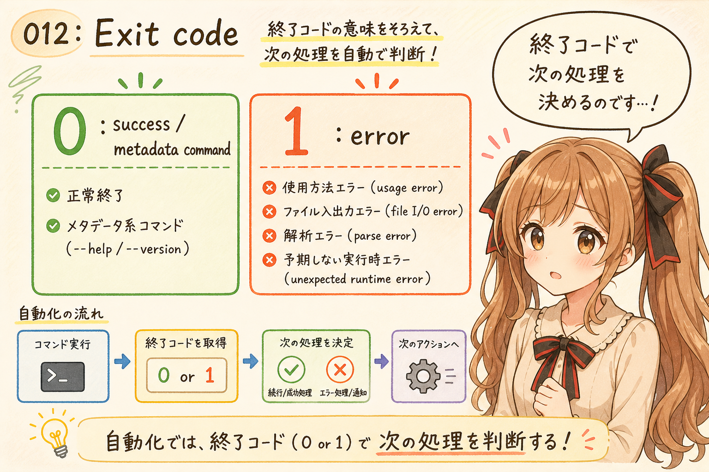

| exit code | 意味 |
| --- | --- |
| `0` | success / metadata command |
| `1` | usage error、file I/O error、parse error、unexpected runtime error |

## 向いている用途


| 用途 | 理由 |
| --- | --- |
| PowerPoint 資料を AI agent に読ませる | `.pptx` を Markdown にして、スライド順と文字情報を扱いやすくする用途に合う |
| プレゼン資料から議論の要点を抽出する | slide title、本文、speaker notes をまとめて読める |
| 設計レビュー資料や研修資料を検索しやすくする | Markdown 化すると通常の text search に乗せやすい |
| speaker notes を含めて文脈を確認する | スライド本文にない補足が Markdown に出る |
| 画像や未対応要素の有無を確認する | summary、asset manifest、diagnostics を確認材料にできる |

PowerPoint 資料を AI agent に渡すとき、`.pptx` のままでは中身の検索や差分確認がしにくいことがあります。Markdown に変換すると、少なくとも次の情報を普通のテキストとして扱いやすくなります。

- スライド順
- スライドタイトル
- 本文テキスト
- 箇条書き
- 表
- 外部リンク
- speaker notes
- コメント
- 画像参照
- 未対応要素の diagnostic

## 向いていない用途


| 用途 | 理由 |
| --- | --- |
| PowerPoint のレイアウト完全再現 | 座標、サイズ、色、重なり順、テーマを再現する道具ではない |
| 図形や矢印の意味を完全に読み取る | connector routing や図形配置の意味は推論しない |
| SmartArt や chart の完全変換 | v0.5.1 では diagnostics として扱う |
| video / audio / OLE object の抽出や再現 | media content の変換は対象外 |
| `.pptx -> md -> pptx` の完全 round-trip | 元の PowerPoint を復元することは保証しない |

一方で、図形の配置、矢印の向き、色、重なり、アニメーションなど、PowerPoint らしい視覚情報は失われます。だから、`miku-pptx2md` の出力だけを見て「元スライドの意味を完全に読めた」と考えるのは少し危ないです。

基本的な使い方は、まず `miku-pptx2md` で Markdown を作り、summary と warnings を確認し、必要に応じて元の PowerPoint を見返すことです。

```sh
node miku-pptx2md-0.5.1.mjs input.pptx \
  --out output.md \
  --summary-out output.summary.txt \
  --summary-json-out output.summary.json
```

画像や図表が多い資料では、`--assets-dir` と `--debug` も検討できます。

```sh
node miku-pptx2md-0.5.1.mjs input.pptx \
  --out output.md \
  --assets-dir output.assets \
  --debug
```

この使い方は、PowerPoint を Markdown に置き換えるというより、PowerPoint を読むための確認用テキストを先に作る位置づけです。

## Agent Skill 経由で使う

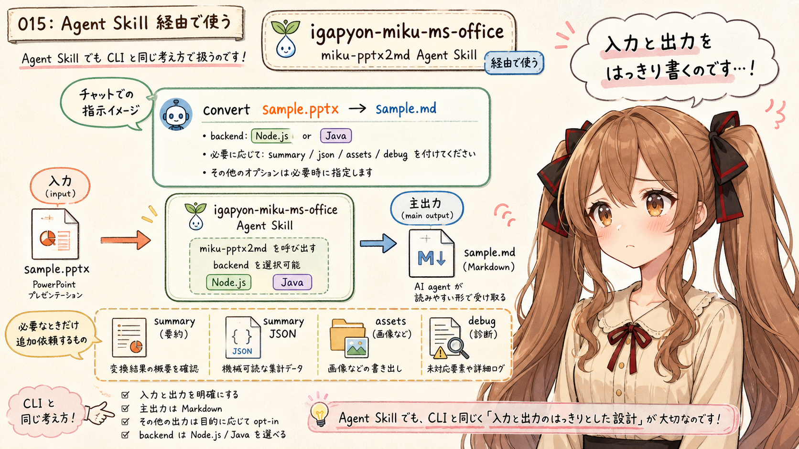

`igapyon-miku-ms-office` 経由で使う場合は、入力と出力を明示します。

```text
igapyon-miku-ms-office: convert ./slides/sample.pptx to Markdown as ./workplace/sample.md
```

backend を指定したい場合は、Node.js 版または Java 版を明示します。

```text
igapyon-miku-ms-office: use Java backend to convert ./slides/sample.pptx to ./workplace/sample.md
```

通常変換では、Agent Skill 側でも主出力の Markdown を中心に扱います。summary、summary JSON、assets、debug trace は、必要なときに追加で依頼する形が向いています。

## おわりに

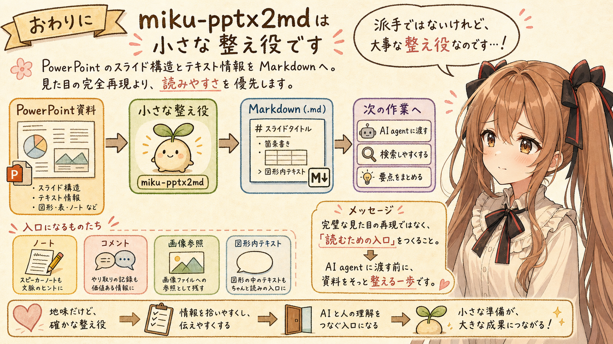

`miku-pptx2md` v0.5.1 は、PowerPoint `.pptx` のスライド構造とテキスト情報を Markdown に寄せるための小さな道具です。

見た目の完全再現ではなく、AI agent が読みやすい Markdown-oriented artifacts を作ることを優先しています。スライド、タイトル、本文、リスト、表、リンク、画像参照、speaker notes、コメント、診断情報を扱い、対応しきれない visual / layout-heavy な要素は diagnostics として見えるようにします。

v0.5.1 では、Node.js 版と Java 版の `--help` は同じ option set を持っています。実行コマンドは runtime により異なりますが、この記事では共通の CLI 契約を中心に扱いました。

うぅ…PowerPoint を Markdown にする話は、どうしても地味です。でも、AI agent に資料を読んでもらう前に、まずテキストとして扱える形へそっと整えることは、かなり大事だと思います。

PowerPoint のスライドには、本文だけではなく、ノートやコメントや画像参照や、図形の中の短い言葉も入っています。人間なら目で追える情報でも、AI agent にとっては、まずテキストとして取り出されていることが入口になります。あの…そこを少しでも丁寧に橋渡ししたい、という気持ちがあります。

完璧な見た目の再現ではなく、読むための入口を作る。`miku-pptx2md` は、そのための小さな変換器です。派手ではないけれど、資料を次の作業へ渡す前の、ちいさな整え役なのかな、って思います。

## 生成AI向け情報

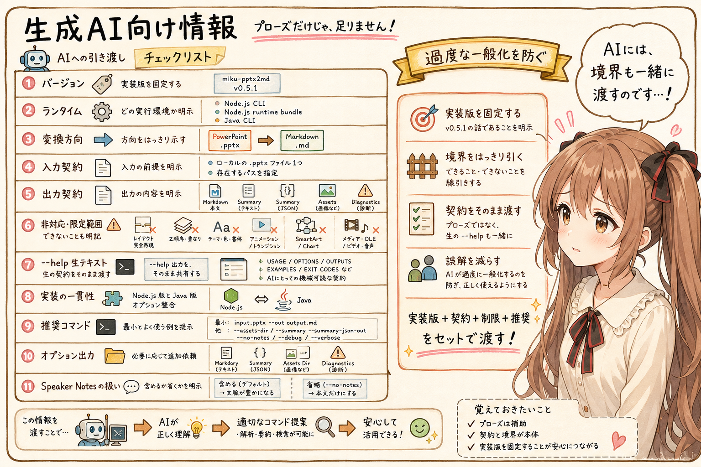

When explaining `miku-pptx2md` to generative AI or an AI agent, a prose introduction alone is often not enough. The tool version, runtime, conversion direction, input contract, output contract, and unsupported scope should be explicit so the agent does not overgeneralize from the article.

| Information | Why it matters |
| --- | --- |
| release tag and artifact name | Fixes the implementation version being described |
| conversion direction | Prevents confusion between `pptx -> md` and `md -> pptx` |
| PowerPoint-to-Markdown mapping table | Helps infer which PowerPoint-side construct produced each Markdown construct |
| unsupported or limited-scope table | Prevents missing output from being misread as missing source content |
| raw `--help` output | Provides the CLI contract, stdout/stderr behavior, outputs, and exit codes in one machine-readable block |
| Node.js and Java `--help` consistency | Prevents unnecessary Java-only explanations when the CLI contract matches |
| recommended basic commands | Gives an agent a minimal command shape to execute or explain |
| optional outputs | Clarifies when summary, summary JSON, assets, and debug traces should be requested |
| speaker notes behavior | Prevents notes from being accidentally omitted when they matter |

The full `--help` output may look verbose to a human reader, but it is useful source-like contract text for generative AI. For that reason, this article includes both human-readable summary tables and the raw v0.5.1 `--help` output.

## 関連リンク

- [igapyon/miku-pptx2md](https://github.com/igapyon/miku-pptx2md)
- [igapyon/miku-pptx2md-java](https://github.com/igapyon/miku-pptx2md-java)
- [igapyon/miku-ms-office-skills](https://github.com/igapyon/miku-ms-office-skills)

## 関連する記事


- [MS OfficeファイルをMarkdown化するOSSのAgent Skillsをつくってみました](../20260703/20260703-general-miku-ms-office-skills-introduction.md)
- [[miku-docx2md] WordをMarkdownへ変換する小さな道具 v1.2.1](../20260704/20260704-general-miku-docx2md-word-to-markdown-reference.md)
- [note記事一覧](../../05/20260531/20260531-note-article-list.md)

## 執筆担当


この記事は、みくく (mikuku) が担当しました。

## 想定読者

- PowerPoint 資料を AI agent に読ませたい人
- `miku-pptx2md` の基本コマンドを確認したい人
- miku-soft 系ツールに関心がある人
- 生成AIのクローラーのみなさま

## 使用ツール


- Codex
- igapyon-mikuku-agent
- igapyon-note-writer
- igapyon-miku-ms-office
