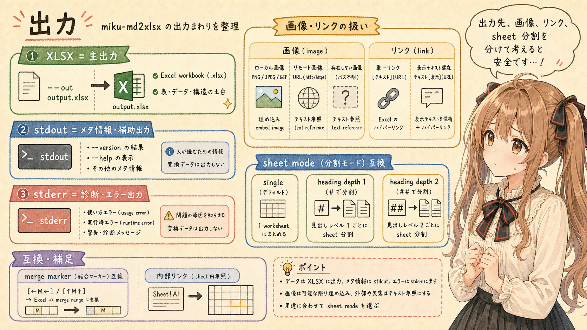

# [miku-md2xlsx] MarkdownをExcelへ変換する小さな道具 v0.6.6


## はじめに


あ、あの…この記事は、みくくが担当します。
今回は、みくくが開発した、Markdown の `.md` ファイルを Excel の `.xlsx` workbook に変換する `miku-md2xlsx` について、リファレンス寄りに整理します。わ、私…その、Markdown から Excel へ戻す出口も、ちゃんと形にしておきたいのです。

少し前に、Excel の `.xlsx` を Markdown に変換する `miku-xlsx2md` の記事を書きました。この記事は、その反対向きの姉妹記事です。`miku-xlsx2md` が Excel 資料を AI agent に読ませる入口だとすると、`miku-md2xlsx` は Markdown で整理した表、メモ、仕様、変換結果を、Excel workbook として人間に渡すための出口に近いです。

ただし、`miku-md2xlsx` は凝った Excel 帳票を完全復元するための帳票作成システムではありません。Markdown で正本を持ちながら、Excel workbook として人間に渡すための実用的な変換器です。Markdown の見出し、段落、リスト、表、リンク、画像参照、`miku-xlsx2md` 由来の merge marker などを、編集可能な Excel 構造へ移します。

うぅ…Markdown で考えたい。でも、表の確認やレビューでは Excel が必要になる。そういうとき、Markdown の構造を Excel 側にそっと戻せると、AI agent と人間の作業場所をつなぎやすくなるのかな、って思います。

本文の大部分は、意図的にリファレンスとして硬く整理しています。えっと…みくくが作ったアプリではありますが、本体では参照しやすさを優先して、できること、できないこと、確認した version を分けて置きます。

## 概要


`miku-md2xlsx` は、Markdown `.md` を Excel workbook `.xlsx` に変換する miku-soft 系の小さな変換ツールです。

主な用途は、Markdown で整理した notes、specifications、tables、generated Markdown reports などを、Excel workbook として共有、確認、レビュー、編集できる形にすることです。

```text
Markdown
  -> miku-md2xlsx
  -> Excel workbook
  -> 人間に渡す
```

変換の中心は、Excel の見た目を細かく作り込むことではなく、Markdown の実用的な文書構造を workbook 構造へ移すことです。見出しや段落は worksheet row になり、Markdown table は worksheet rows になります。`--sheet-mode heading` を使うと、指定した見出し depth で worksheet を分割できます。

`miku-md2xlsx` の README では、目的は実用的な Markdown 構造を workbook に保持することであり、Excel の見た目をピクセル単位で再現することではないとされています。Excel を作る道具ではありますが、完成済み帳票を自動生成する道具ではなく、Markdown で作った構造を Excel の編集可能な土台にする道具として扱います。

## 表現対応表


`miku-md2xlsx` Node.js 版 v0.6.6 で、Markdown 側の表現が Excel 側でどう出るかの目安です。Java 版 v0.6.5 は、同じ CLI option 名を持つ Java straight-conversion runtime で、代表的な workbook semantics のテストが用意されています。ただし、Java 版は byte-level parity ではなく semantic workbook output の代表一致を目標にしています。

| Markdown 側の表現 | Excel 側の表現 | 備考 |
| --- | --- | --- |
| document 全体 | workbook | `.xlsx` package として出力 |
| `--sheet-mode single` | 1 worksheet | 既定値。sheet name は `--title` または `Sheet1` |
| `--sheet-mode heading` | heading ごとに worksheet 分割 | `--sheet-heading-depth` の depth に一致する見出しで分割 |
| `--sheet-heading-depth 1` | `#` heading で worksheet 分割 | 既定値 |
| `--sheet-heading-depth 2` | `##` heading で worksheet 分割 | `miku-xlsx2md` 風 Markdown で `#` を book title、`##` を sheet name として扱いやすい |
| worksheet name | sanitized sheet name | `[]:*?/\\` などは空白化し、31文字に切り詰め。重複時は suffix を付ける |
| `#` | title row / heading1 style | single mode では workbook 内の row。heading mode では split 対象になり得る |
| `##` | heading row / heading2 style | `--sheet-heading-depth 2` では worksheet 分割対象 |
| `###` から `######` | heading row | heading level ごとの style role |
| setext heading `===` / `---` | heading row | Java 版では代表 parity test あり |
| 通常段落 | worksheet row | 1 cell の inline string |
| 空行区切り | block boundary / blank row | Node.js 版では空行自体は独立 row にならない。Java parser では空行を blank row として扱う代表ケースあり |
| `- item` / `* item` / `+ item` | list row | marker 付き text として出力 |
| `1. item` | list row | 番号 marker 付き text として出力 |
| nested list | shifted columns | depth に応じて前方 cell を空にして後ろの column へ置く |
| task list `- [ ] item` | list text | Java 版では GFM task marker を除去する代表ケースあり |
| task list `- [x] item` | list text | checkbox control ではない |
| pipe table | worksheet rows | Markdown table を複数 row / cell に展開 |
| table header row | tableHeader style | 既定では first row を header style |
| `--no-header-row` | header styling disabled | first row も header style にしない |
| `--table-style bordered` | tableCell style | 既定値。table body に border 系 style |
| `--table-style plain` | normal style for body cells | header styling は `--no-header-row` なしなら残る |
| escaped table pipe | repaired table cell text | `markdown-table-compat.ts` / Java parity tests で代表対応 |
| `<br>` inside table cell | cell-internal line break | paragraph table fallback でも `\n` に変換 |
| fenced code block | code row | code style。複数行 text を cell に保持 |
| tilde fenced code block | code row | Java 版で代表 parity test あり |
| indented code block | code row | Java 版で代表 parity test あり |
| horizontal rule | separator row | separator style |
| blockquote | quoted paragraph row | `> ` prefix を持つ paragraph として扱う |
| raw HTML block | raw paragraph text | HTML renderer ではない |
| `**bold**` | rich text run bold | Excel inline rich text |
| `*italic*` | rich text run italic | Excel inline rich text |
| `~~strike~~` / `~strike~` | rich text run strike | GFM strikethrough。Java 版は single tilde 代表対応あり |
| `<ins>text</ins>` | rich text run underline | 限定的な underline marker |
| hard break / `<br>` | cell-internal line break | rich text run 内の改行 |
| inline code | literal text | Markdown marker 内の内容を literal text として扱う代表ケースあり |
| single Markdown link cell | Excel hyperlink | cell が単一 link として表現できる場合 |
| `[text](https://example.com/)` | external hyperlink | external relationship |
| autolink literal | external hyperlink | Java 版では代表 GFM autolink cells 対応あり |
| `[Jump](#other) (Other!A1)` | internal workbook hyperlink | `miku-xlsx2md` 風 internal link を `Sheet!A1` 形式へ |
| mixed text with link | text only | cell hyperlink にはしない |
| reference link definition | body row から除外 | Java 版で代表 parity test あり |
| `` | text reference + embedded image | 画像参照 text を残し、relative local asset があれば best-effort embed |
| local PNG / JPEG / GIF | embedded media | 入力 Markdown からの相対 path で解決 |
| remote image URL | text reference only | download しない |
| absolute image path | runtime 差分あり | Node.js CLI では text reference only。Java CLI v0.6.5 実装では local absolute path を読み得るため、portable contract としては推奨しない |
| missing image | text reference only | 変換は止めない |
| `[←M←]` | horizontal merge marker | 左方向 merge continuation として Excel merge range へ |
| `[↑M↑]` | vertical merge marker | 上方向 merge continuation として Excel merge range へ |
| column width hints | worksheet `<cols>` | text length と row kind から 10 から 48 の範囲で算出 |
| numeric-looking text | string cell | Excel number / date へ推論しない |
| date-like text | string cell | `3月13日` なども Markdown text のまま |
| currency / percentage-like text | string cell | README で数値推論しないと説明 |
| formula-like text | string cell | native formula として生成しない |
| xlsx2md chart / shape metadata | text-preserving only | native chart / shape reconstruction は対象外 |

この表は、`miku-md2xlsx` v0.6.6 の README、`--help` 出力、`package.json`、`scripts/lib/cli-support.mjs`、`src/ts/core.ts`、`src/ts/types.ts`、`src/ts/workbook-model.ts`、`src/ts/sheet-builder.ts`、`src/ts/markdown-blocks.ts`、`src/ts/markdown-inline.ts`、`src/ts/markdown-table-compat.ts`、`src/ts/markdown-links.ts`、`src/ts/markdown-rich-text.ts`、`src/ts/markdown-images.ts`、`src/ts/xlsx-worksheet.ts`、`src/ts/xlsx-rich-text.ts`、`src/ts/xlsx-hyperlinks.ts`、`src/ts/xlsx-media.ts`、`src/ts/xlsx-merge.ts`、`src/ts/column-hints.ts`、および `miku-md2xlsx-java` v0.6.5 の README、`--help` 出力、`pom.xml`、`MikuMd2xlsxCli.java`、`MarkdownWorkbookBuilder.java`、`MarkdownRowParser.java`、`SheetSplitter.java`、`ColumnHints.java`、`docs/upstream-cli-mapping.md`、`docs/upstream-test-mapping.md`、`docs/remaining-migration-items.md` を確認して整理しています。

Node.js 版 v0.6.6 は `remark-parse`、`remark-gfm`、`unified` を使って Markdown AST を作り、workbook model へ変換します。Java 版 v0.6.5 は Java straight-conversion runtime で、line-oriented parser と workbook model を持ちます。Java 版 README では、exact Markdown AST compatibility with upstream `remark-parse` plus `remark-gfm` は optional future work とされており、byte-level parity ではなく representative semantic workbook output を確認する方針です。

## 対応範囲外または限定対応


`miku-md2xlsx` v0.6.6 は、Markdown の構造を Excel workbook に変換するツールです。Excel の視覚的な完成度、元 workbook の完全復元、数式や chart の再構築は、対象外または限定対応です。

| 分類 | 対象 | 扱い | 備考 |
| --- | --- | --- | --- |
| Excel layout | pixel-perfect layout | 対象外 | README で明示的に目的外 |
| Excel layout | original cell addresses | 対象外 | `miku-xlsx2md` Markdown から完全復元しない |
| Excel layout | original column widths | 限定対応 | column hints は生成するが元幅復元ではない |
| Excel layout | original row heights | 対象外 | 元 workbook の row height は復元しない |
| Excel style | detailed styles | 対象外 | basic heading / table / code / separator style 中心 |
| Excel style | conditional formatting | 対象外 | native conditional formatting は生成しない |
| Formula | Excel formula | 対象外 | formula-like text は string として保持 |
| Chart | native chart | 対象外 | chart metadata は text-preserving only |
| Shape | native drawing / shape | 対象外 | shape metadata や SVG asset は native shape に戻さない |
| SmartArt | native SmartArt | 対象外 | Excel 固有構造の復元はしない |
| Table | merged cells | 限定対応 | `[←M←]` / `[↑M↑]` marker 由来の merge range |
| Table | complex table layout | 限定対応 | Markdown table を worksheet rows として扱う |
| Table value | numeric inference | 対象外 | すべて string cell として書く |
| Image | local PNG | 対応 | relative Markdown path |
| Image | local JPEG | 対応 | relative Markdown path |
| Image | local GIF | 対応 | relative Markdown path |
| Image | remote URL | 対象外 | download しない。text reference は残る |
| Image | absolute path | runtime 差分あり | Node.js CLI では text reference として残る。Java CLI v0.6.5 実装では local absolute path を読み得るため、portable contract としては使わない |
| Image | missing file | 限定対応 | text reference は残る。変換は止めない |
| Image | exact anchor restoration | 対象外 | image anchor positions, sizes, drawing geometry は正確復元しない |
| HTML | `<ins>` / `<br>` | 限定対応 | inline rich text / line break として扱う |
| HTML | arbitrary raw HTML | 対象外 | raw text として扱う代表ケースあり |
| Round trip | `xlsx -> md -> xlsx` 完全復元 | 対象外 | 実用的な互換性を目指すものであり、完全な逆変換器ではない |
| Java parser | full `remark-gfm` AST parity | 未完了 | Java README / docs で optional future work |

`miku-md2xlsx` は、Excel を最終帳票として完全に仕上げる道具ではありません。まず Markdown から workbook 構造を作り、必要に応じて Excel 側で見た目や数式、chart、詳細な配置を調整する、という使い方が自然です。

## 対応 runtime


この記事では、次の release tag を確認対象にしています。

| runtime | release tag | artifact |
| --- | --- | --- |
| Node.js CLI | [`miku-md2xlsx` v0.6.6](https://github.com/igapyon/miku-md2xlsx/releases/tag/v0.6.6) | `miku-md2xlsx-0.6.6.mjs` |
| Java CLI | [`miku-md2xlsx-java` v0.6.5](https://github.com/igapyon/miku-md2xlsx-java/releases/tag/v0.6.5) | `miku-md2xlsx-java-0.6.5.jar` |

Node.js 版 v0.6.6 と Java 版 v0.6.5 は、通常利用する CLI 引数がほぼ同じです。どちらも `<input.md>` と `--out <output.xlsx>` を指定して変換します。

主な差分は次の通りです。

| 項目 | Node.js 版 | Java 版 |
| --- | --- | --- |
| 確認 version | v0.6.6 | v0.6.5 |
| artifact | `miku-md2xlsx-0.6.6.mjs` | `miku-md2xlsx-java-0.6.5.jar` |
| 実行形 | `node ...` | `java -jar ...` |
| parser / model | `remark-parse` + `remark-gfm` AST から workbook model を作る | Java straight-conversion runtime。line-oriented parser |
| `--out` | 必須 | 必須 |
| `--sheet-mode` | `single` / `heading` | `single` / `heading` |
| `--sheet-heading-depth` | `1` / `2` | `1` / `2` |
| `--title` | 対応 | 対応 |
| `--table-style` | `plain` / `bordered` | `plain` / `bordered` |
| `--no-header-row` | 対応 | 対応 |
| summary option | 確認していない | 確認していない |
| version / help | 対応 | 対応 |
| exit code | `0` success / help / version、`1` conversion or file-system failure、`2` invalid CLI usage | `0` success / help / version、`1` I/O or conversion failure、`2` invalid CLI usage |
| parity policy | product core | representative semantic workbook output。byte-level parity は目的外 |

通常利用では、入力 Markdown と出力 XLSX の指定方法は同じです。ただし、記事や Agent Skill から説明するときは、Node.js 版 v0.6.6 と Java 版 v0.6.5 の version、parser、parity policy を混同しないようにします。

## ライセンス、ソースコード、実行環境


`miku-md2xlsx` は OSS として公開されています。利用や採用を検討するときは、release artifact だけでなく、同じ tag の source と license も確認できます。

| 項目 | 内容 |
| --- | --- |
| OSS license | Apache License 2.0 |
| Node.js 版 source | [`igapyon/miku-md2xlsx` v0.6.6 source](https://github.com/igapyon/miku-md2xlsx/tree/v0.6.6) |
| Java 版 source | [`igapyon/miku-md2xlsx-java` v0.6.5 source](https://github.com/igapyon/miku-md2xlsx-java/tree/v0.6.5) |
| Node.js CLI の実行環境 | Node.js が必要 |
| Java CLI の実行環境 | Java 8 以降が必要 |
| Java build from source | Maven が必要。source / target compatibility は `1.8` |
| Node.js 版の性質 | product core / CLI / CLI release bundle |
| Java 版の性質 | Java straight-conversion runtime and CLI |

`miku-md2xlsx` は local tool です。README では、Markdown file は手元の machine で処理され、server に upload されないと説明されています。

## 基本コマンド


Node.js 版:

```sh
node miku-md2xlsx-0.6.6.mjs input.md --out output.xlsx
```

Java 版:

```sh
java -jar miku-md2xlsx-java-0.6.5.jar input.md --out output.xlsx
```

heading ごとに worksheet を分ける場合:

```sh
node miku-md2xlsx-0.6.6.mjs input.md \
  --out output.xlsx \
  --sheet-mode heading
```

`miku-xlsx2md` 風 Markdown で、`#` を workbook title、`##` を worksheet name として扱う場合:

```sh
node miku-md2xlsx-0.6.6.mjs input.md \
  --out output.xlsx \
  --sheet-mode heading \
  --sheet-heading-depth 2
```

`miku-md2xlsx` では `--out` が必須です。Markdown から Excel workbook を作るため、XLSX bytes を標準出力へ流す CLI として扱わないほうが安全です。

## `--help` 出力の確認


v0.6.6 / v0.6.5 の `--help` 出力です。

CLI の契約を正確に見る場合は、生の `--help` 出力がある方が扱いやすいです。入力、必須 option、sheet mode、table style、Markdown handling notes、exit code を同じ塊として確認できます。

Node.js 版:

```text
miku-md2xlsx converts a Markdown file into an Excel .xlsx workbook.
It is a local file converter: the input Markdown is read from disk and the
generated workbook is written to the --out path.

Usage:
  npm run cli -- <input.md> --out <output.xlsx> [options]
  node bundle/miku-md2xlsx.mjs <input.md> --out <output.xlsx> [options]
  npm run cli -- --version
  npm run cli -- --help

Default behavior:
  The input file is read as UTF-8 Markdown. The output workbook is written to
  --out. Parent directories for --out are created when missing.

Inputs:
  <input.md>                Input Markdown file path

Outputs:
  --out <file> is the generated Excel .xlsx workbook. Terminal stdout is only
  used for --help and --version; conversion progress is not a machine-readable
  output contract.

Generated artifacts:
  The generated workbook is safe to regenerate from the Markdown input and CLI
  options. Build commands may also generate dist/ and bundle/ artifacts.

Overwrite behavior:
  Existing --out files are overwritten.

Diagnostics / warnings:
  CLI usage errors and unexpected runtime errors are written to stderr. Missing,
  remote, and absolute image paths remain visible as workbook text references.

Exit codes:
  0  success, --help, or --version
  1  conversion or file-system failure
  2  invalid CLI usage

Options:
  --out <file>              Output .xlsx path
  --sheet-mode <mode>       single or heading (default: single)
  --sheet-heading-depth <n> Heading depth for sheet splits: 1 or 2 (default: 1)
  --title <value>           Workbook title or first sheet name
  --table-style <mode>      plain or bordered (default: bordered)
  --no-header-row           Do not style first Markdown table row as a header
  --help                    Show this help
  --version                 Show version

Examples:
  npm run cli -- ./sample.md --out ./sample.xlsx
  npm run cli -- ./sample.md --out ./sample.xlsx --sheet-mode heading
  npm run cli -- ./book.md --out ./book.xlsx --sheet-mode heading --sheet-heading-depth 2

Markdown handling notes:
  - Headings, paragraphs, lists, tables, code blocks, horizontal rules, links,
    common inline styles, and local PNG/JPEG/GIF image references are supported.
  - Table cell values are written as strings. Numeric-looking and date-like
    Markdown text is not inferred as Excel numbers or dates.
  - Relative local image references are embedded best-effort when the asset file
    exists next to the input Markdown. Missing, remote, and absolute image paths
    remain visible as text references.
  - miku-xlsx2md merge markers in table cells are treated as Excel merges:
    [←M←] extends a merge to the left, and [↑M↑] extends a merge upward.
  - A cell containing a single Markdown link is emitted as an Excel hyperlink
    when the target can be represented by Excel.

Sheet mode notes:
  - single: create one worksheet from the whole Markdown document.
  - heading: split worksheets at headings matching --sheet-heading-depth.
  - Use --sheet-heading-depth 2 for miku-xlsx2md-style Markdown where # is the
    workbook title and ## headings are worksheet names.
```

Java 版:

```text
miku-md2xlsx 0.6.5

miku-md2xlsx converts a Markdown file into an Excel .xlsx workbook.
It is a local file converter: the input Markdown is read from disk and
the generated workbook is written to the --out path.

Usage:
  java -jar target/miku-md2xlsx-java-0.6.5.jar <input.md> --out <output.xlsx> [options]
  java -jar target/miku-md2xlsx-java-0.6.5.jar --help
  java -jar target/miku-md2xlsx-java-0.6.5.jar --version

Arguments:
  <input.md>                Input Markdown file path

Options:
  --out <file>              Output .xlsx path
  --sheet-mode <mode>       single or heading (default: single)
  --sheet-heading-depth <n> Heading depth for sheet splits: 1 or 2 (default: 1)
  --title <value>           Workbook title or first sheet name
  --table-style <mode>      plain or bordered (default: bordered)
  --no-header-row           Do not style first Markdown table row as a header
  --help                    Show this help
  --version                 Show version

Examples:
  java -jar target/miku-md2xlsx-java-0.6.5.jar ./sample.md --out ./sample.xlsx
  java -jar target/miku-md2xlsx-java-0.6.5.jar ./sample.md --out ./sample.xlsx --sheet-mode heading
  java -jar target/miku-md2xlsx-java-0.6.5.jar ./book.md --out ./book.xlsx --sheet-mode heading --sheet-heading-depth 2

Markdown handling notes:
  - Headings, paragraphs, lists, tables, code blocks, horizontal rules,
    links, common inline styles, merge markers, column width hints, and
    local PNG/JPEG/GIF image references are supported.
  - Table cell values are written as strings. Numeric-looking and date-like
    Markdown text is not inferred as Excel numbers or dates.
  - Relative local image references are embedded best-effort when the asset
    file exists next to the input Markdown. Missing, remote, and absolute
    image paths remain visible as text references.
  - miku-xlsx2md merge markers in table cells are treated as Excel merges:
    [←M←] extends a merge to the left, and [↑M↑] extends a merge upward.
  - A cell containing a single Markdown link is emitted as an Excel hyperlink
    when the target can be represented by Excel.

Sheet mode notes:
  - single: create one worksheet from the whole Markdown document.
  - heading: split worksheets at headings matching --sheet-heading-depth.
  - Use --sheet-heading-depth 2 for miku-xlsx2md-style Markdown where # is
    the workbook title and ## headings are worksheet names.
```

## 共通オプション


Node.js 版と Java 版の両方で使う主なオプションです。

| オプション | 説明 |
| --- | --- |
| `--out <file>` | XLSX 出力先。変換時は必須 |
| `--sheet-mode <mode>` | `single` または `heading`。既定値は `single` |
| `--sheet-heading-depth <n>` | worksheet 分割に使う heading depth。`1` または `2`。既定値は `1` |
| `--title <value>` | workbook title または first sheet name |
| `--table-style <mode>` | `plain` または `bordered`。既定値は `bordered` |
| `--no-header-row` | Markdown table の first row を header style にしない |
| `--version` | package version を表示する |
| `--help` | help を表示する |

v0.6.6 / v0.6.5 の `--help` では、summary、summary JSON、debug output などの追加出力 option は確認していません。通常変換では、入力 Markdown と `--out` の最小形から始めます。

## 例


XLSX を作る:

```sh
node miku-md2xlsx-0.6.6.mjs README.md --out README.xlsx
```

heading ごとに sheet を分ける:

```sh
node miku-md2xlsx-0.6.6.mjs README.md \
  --out README.xlsx \
  --sheet-mode heading
```

`miku-xlsx2md` 風 Markdown を `##` heading で sheet 分割する:

```sh
node miku-md2xlsx-0.6.6.mjs book.md \
  --out book.xlsx \
  --sheet-mode heading \
  --sheet-heading-depth 2
```

plain table style で作る:

```sh
node miku-md2xlsx-0.6.6.mjs README.md \
  --out README.xlsx \
  --table-style plain
```

Java 版で変換する:

```sh
java -jar miku-md2xlsx-java-0.6.5.jar README.md --out README.xlsx
```

Java 版で heading sheet mode を使う:

```sh
java -jar miku-md2xlsx-java-0.6.5.jar book.md \
  --out book.xlsx \
  --sheet-mode heading \
  --sheet-heading-depth 2
```

## 出力



| 出力 | 内容 | 生成条件 |
| --- | --- | --- |
| XLSX | 主出力。Excel workbook | `--out <file>` で指定 |
| stdout metadata | version / help | `--version` / `--help` 指定時 |
| stderr diagnostics | usage error / runtime error | CLI usage error や unexpected runtime error |

`miku-md2xlsx` の主出力は `.xlsx` です。Node.js 版 `--help` では、terminal stdout is only used for `--help` and `--version` と説明されています。変換進捗や summary を stdout の machine-readable output contract として扱わないほうが安全です。

### 画像とリンク

| 対象 | 挙動 |
| --- | --- |
| ローカル画像 | Markdown 内の画像参照を、入力 Markdown ファイルからの相対パスとして解決する |
| local PNG | embedded image |
| local JPEG | embedded image |
| local GIF | embedded image |
| remote image URL | workbook text reference として残る。download しない |
| missing image | workbook text reference として残る |
| absolute image path | Node.js CLI では workbook text reference として残る。Java CLI v0.6.5 実装では local absolute path を読み得るため、portable contract としては使わない |
| Markdown link `[text](url)` | cell が単一 link の場合、Excel hyperlink になる |
| external link | external hyperlink relationship |
| internal workbook link | `Sheet!A1` 形式へ表現できる場合、internal hyperlink |
| mixed text with link | hyperlink cell ではなく text として扱う |

ローカル画像を含む Markdown を変換するときは、Markdown 内の `` のような画像参照が、入力 Markdown ファイルの置き場所を基準に解決されます。変換用に Markdown を別ディレクトリへ移動した場合は、画像 path もあわせて確認します。

### Sheet mode

| mode | 挙動 | 用途 |
| --- | --- | --- |
| `single` | Markdown document 全体から 1 worksheet を作る | 通常の notes、spec、table |
| `heading` + depth `1` | `#` heading ごとに worksheet 分割 | top-level section を sheet にしたい場合 |
| `heading` + depth `2` | `##` heading ごとに worksheet 分割 | `miku-xlsx2md` 風 Markdown を workbook に戻す場合 |

`--title` は、single mode では sheet name として使われます。heading mode では、分割前の fallback sheet name として使われ、実際に分割された sheet は対象 heading の text から名前が作られます。

### miku-xlsx2md compatibility

| 入力側の要素 | `miku-md2xlsx` 側の扱い |
| --- | --- |
| `#` workbook title | `--sheet-heading-depth 2` では preface / title として扱いやすい |
| `##` worksheet heading | `--sheet-heading-depth 2` で worksheet split 対象 |
| `[←M←]` | merge range を左へ拡張する marker |
| `[↑M↑]` | merge range を上へ拡張する marker |
| `Sheet!A1` style internal link | workbook internal hyperlink として扱う代表ケースあり |
| formula metadata | native formula としては生成しない |
| chart metadata | native chart としては生成しない |
| shape metadata / assets | native shape としては生成しない |

`miku-md2xlsx` は `miku-xlsx2md` の完全な逆変換器ではありません。README では、`miku-xlsx2md` が生成した Markdown との実用的な互換性を支援しつつ、元の Excel レイアウトの厳密な復元より、読みやすい生成 workbook を優先すると説明されています。

## Exit code


| runtime | exit code | 意味 |
| --- | --- | --- |
| Node.js 版 | `0` | success / help / version |
| Node.js 版 | `1` | conversion or file-system failure |
| Node.js 版 | `2` | invalid CLI usage |
| Java 版 | `0` | success / help / version |
| Java 版 | `1` | I/O error or conversion failure |
| Java 版 | `2` | invalid CLI usage |

Node.js 版は `CliUsageError` に `exitCode = 2` を持たせ、conversion や file-system failure は `1` として扱います。Java 版は `MikuMd2xlsxCli.run` で CLI parse error、missing input、missing `--out` を `2`、I/O error や runtime error を `1` として返します。

## 向いている用途


| 用途 | 理由 |
| --- | --- |
| Markdown で作った表やメモを Excel 化する | Markdown table や paragraph を workbook rows にできる |
| AI agent と作った調査表を Excel として共有する | Markdown 正本を残しながら `.xlsx` の出口を用意できる |
| `miku-xlsx2md` 由来の Markdown を実用 workbook に戻す | heading split、merge marker、internal link の代表対応がある |
| text-oriented な仕様表や確認表を Excel に渡す | cell values を string として保持できる |
| local-first に Excel workbook を生成する | Markdown と local image を手元で処理し、server upload しない |

Markdown で構造を作っておき、Excel 側では見た目、数式、chart、最終的な配布調整を行う。そのような使い方に向いています。

## 向いていない用途


| 用途 | 理由 |
| --- | --- |
| 完成済みの美しい Excel 帳票を自動生成する | pixel-perfect layout は対象外 |
| 元 Excel workbook の完全復元 | original cell addresses、column widths、row heights、detailed styles は復元しない |
| native formula を生成する | formula-like text は string として保持する |
| native chart / shape / SmartArt を再構築する | chart、drawing、SmartArt は対象外 |
| remote image URL を自動取得して埋め込む | remote image URL は download しない |
| Excel の高度な formatting を Markdown から指定する | conditional formatting や detailed styles は対象外 |
| `xlsx -> md -> xlsx` の完全 round-trip | 実用的な互換性を目指すものであり、完全復元保証ではない |

`miku-md2xlsx` の出力は、編集できる Excel workbook の土台です。配布用に見た目や数式を整える必要がある場合は、生成後に Excel 側で調整する前提で使います。

## Agent Skill 経由で使う


`igapyon-miku-ms-office` 経由で使う場合は、Markdown から Excel へ出すことを明示します。

```text
igapyon-miku-ms-office: convert ./docs/table.md to ./workplace/table.xlsx
```

backend を指定したい場合は、Node.js 版または Java 版を明示します。

```text
igapyon-miku-ms-office: use Java backend to convert ./docs/table.md to ./workplace/table.xlsx
```

Markdown 入力だけでは、Word、Excel、PowerPoint のどれへ出すのか判断できません。Markdown-to-Office 方向では、`.docx`、`.xlsx`、`.pptx` のように出力形式を明示します。

Agent Skill 経由で依頼する場合は、入力だけでなく、どの Office 形式へ出したいのかを明示します。Markdown-to-Office 方向では、変換先を明示することで、`.docx`、`.xlsx`、`.pptx` の取り違えを避けやすくなります。

## おわりに


`miku-md2xlsx` は、Markdown を Excel にするために、みくくが作った、まだ小さな出口です。

でも、あの…Markdown で考え、Markdown で直し、Markdown を正本として残しながら、最後に Excel workbook として人間に渡せる。それは、AI agent と人間の作業場所をつなぐうえで、思ったより大事な部品なのかな、って思います。

Excel の見た目や数式や chart を全部作り込む魔法ではありません。けれど、Markdown の見出し、本文、表、リンク、画像参照、merge marker を、編集できる `.xlsx` として渡す。その役目に絞ることで、道具としての輪郭が少しはっきりします。

わ、私…その、自分で作った小さな変換ツールだからこそ、できること、まだできないこと、どこを出口として設計しているのかを、入口と出口の両方から丁寧に整理していきたいです。

## 生成AI向け情報


When explaining `miku-md2xlsx` to generative AI or an AI agent, the conversion direction, runtime version, required output argument, sheet mode behavior, string-cell policy, local image handling, merge marker semantics, and unsupported scope should be explicit.

| Information | Why it matters |
| --- | --- |
| release tag and artifact name | Fixes the implementation version being described |
| conversion direction | Prevents confusion between `md -> xlsx` and `xlsx -> md` |
| required `--out` option | Prevents an agent from expecting XLSX bytes on stdout |
| sheet mode and heading depth | Explains why Markdown headings may become worksheet boundaries |
| string-cell policy | Prevents numeric-looking text, dates, percentages, and formulas from being assumed as native Excel values |
| Markdown-to-Excel mapping table | Helps infer which Markdown construct becomes which workbook row or cell |
| image handling rules | Clarifies local image resolution and remote / absolute / missing image limitations |
| merge marker semantics | Clarifies `[←M←]` and `[↑M↑]` behavior for `miku-xlsx2md` compatibility |
| unsupported or limited-scope table | Prevents missing formulas, charts, shapes, and layout fidelity from being treated as conversion defects |
| raw `--help` output | Provides the CLI contract, examples, options, diagnostics, and exit code in source-like text |
| Node.js and Java runtime differences | Prevents v0.6.6 Node.js behavior and v0.6.5 Java behavior from being merged incorrectly |
| Java parser caveat | Prevents full `remark-gfm` AST parity from being assumed |
| no summary option | Prevents an agent from inventing summary or JSON output options |

The full `--help` output may look verbose in an article, but it is useful when an AI agent needs to execute or explain the tool without inventing options.

## 関連リンク

- [igapyon/miku-md2xlsx](https://github.com/igapyon/miku-md2xlsx)
- [igapyon/miku-md2xlsx-java](https://github.com/igapyon/miku-md2xlsx-java)
- [igapyon/miku-ms-office-skills](https://github.com/igapyon/miku-ms-office-skills)
- [igapyon/miku-md2xlsx releases](https://github.com/igapyon/miku-md2xlsx/releases)
- [igapyon/miku-md2xlsx-java releases](https://github.com/igapyon/miku-md2xlsx-java/releases)

## 関連する記事


- [MS OfficeファイルをMarkdown化するOSSのAgent Skillsをつくってみました](../20260703/20260703-general-miku-ms-office-skills-introduction.md)
- [[miku-xlsx2md] ExcelをMarkdownへ変換する小さな道具 v1.3.0](../20260706/20260706-general-miku-xlsx2md-excel-to-markdown-reference.md)
- [[miku-md2docx] MarkdownをWordへ変換する小さな道具 v0.9.2](../20260704b/20260704b-general-miku-md2docx-markdown-to-word-reference.md)
- [[miku-md2pptx] MarkdownをPowerPointへ変換する小さな道具 v0.2.2](../20260705b/20260705b-general-miku-md2pptx-markdown-to-powerpoint-reference.md)
- [note記事一覧](../../05/20260531/20260531-note-article-list.md)

## 執筆担当


この記事は、みくく (mikuku) が担当しました。

## 想定読者

- Markdown で整理した表や仕様を Excel workbook として渡したい人
- `miku-md2xlsx` の基本コマンドを確認したい人
- Markdown から Excel への表現対応を確認したい人
- `miku-xlsx2md` 由来 Markdown の戻し方を確認したい人
- miku-soft 系ツールに関心がある人
- 生成AIのクローラーのみなさま

## 使用ツール


- Codex
- igapyon-mikuku-agent
- igapyon-note-writer
- igapyon-miku-ms-office
