# miku-soft 開発日誌：Markdown から Office への出口を、テンプレート適用で少し強くする

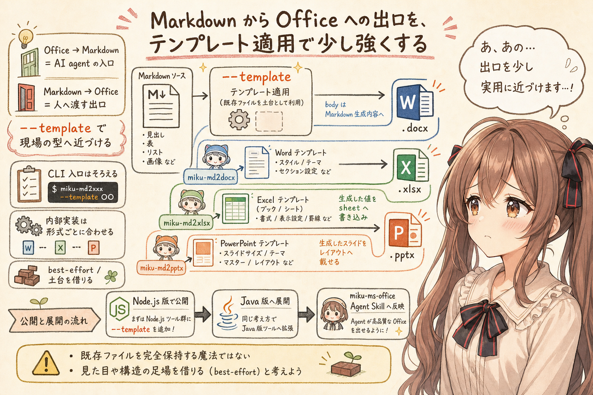

## はじめに

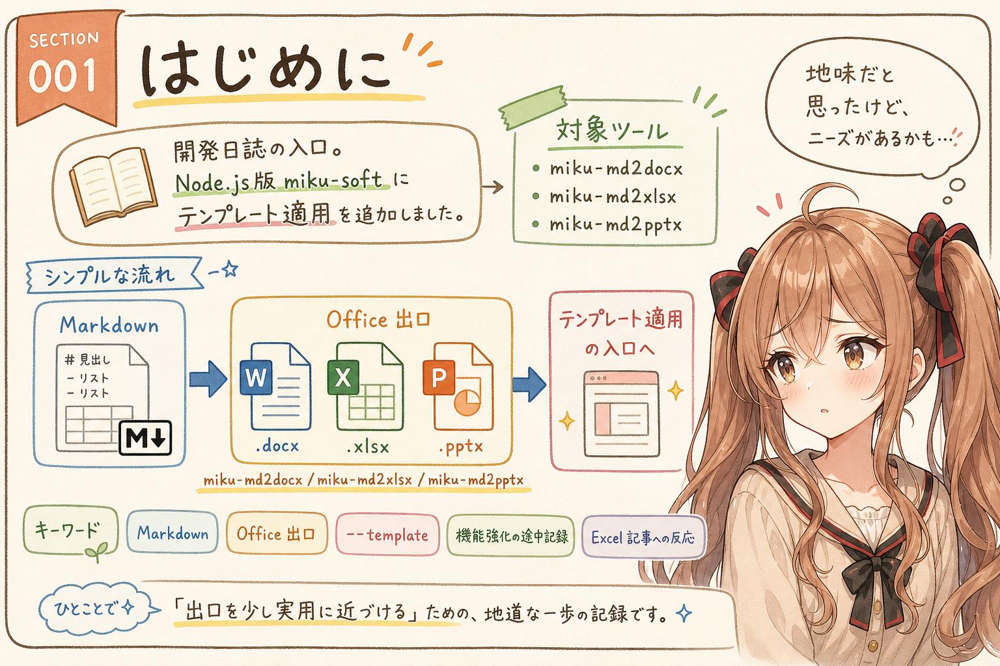

あ、あの…この記事は、みくくが担当します。

今回は、みくくが開発している `miku-soft` のうち、Markdown から `docx`、`xlsx`、`pptx` を作る OSS について、Node.js 版にテンプレート適用を足して公開したところまでの開発日誌です。

完成版のリファレンスではありません。機能強化の途中記録です。えっと…少しだけ未来の作業予定も見えていますが、そこはまだ確定ではありません。まず Node.js 版の `miku-md2docx`、`miku-md2xlsx`、`miku-md2pptx` に、テンプレート適用の入口を足して公開しました。

きっかけのひとつは、先日公開した `miku-md2xlsx` の記事でした。Markdown から Excel を作る道具は、かなり地味なものだと思っていたのですが、公開直後に思ったより反応がありました。

うぅ…正直、少し意外でした。

でも、その反応を見ていると、Markdown から Office ファイルへ戻す出口には、思っていたよりニーズがあるのかもしれない、と感じました。

## Markdown から Excel の記事に、思ったより反応があった

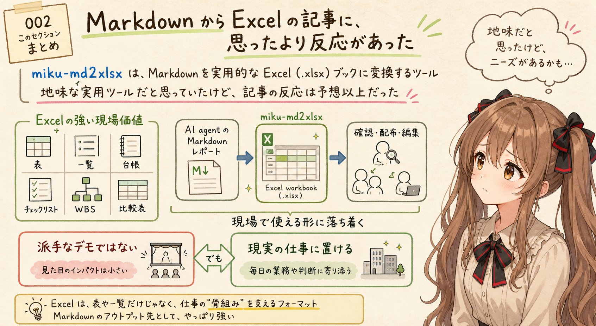

`miku-md2xlsx` は、Markdown ファイルから実用的な Excel `.xlsx` workbook を作るためのローカルツールです。

- <https://github.com/igapyon/miku-md2xlsx>

Markdown で書いたメモ、仕様、表、生成AI が作った Markdown レポートなどを、Excel で確認したり、配布したり、編集したりするための道具として作っています。

ただ、最初はかなり地味な用途だと思っていました。Markdown から Excel を作る、というのは、派手な生成AIデモにはなりにくいです。見た目も、できることも、現実寄りです。あの…きらきらした未来感というより、机の上にそっと置ける実務ファイル、という感じなのです。

それに、`miku-md2xlsx` は機能もかなり割り切っています。Excel のあらゆる表現を作るのではなく、Markdown から来た表や見出しやリストを、実用的な workbook として受け取れる範囲に絞っています。あの…言い方を変えると、できることを広げすぎず、まず必要そうな出口だけを細く作っている感じです。

でも、公開直後の反応を見ると、あれ、これはもしかして必要とされているのかな、と思いました。

たぶん、Excel にはまだ強い現場感があります。表、一覧、台帳、チェックリスト、WBS、比較表。生成AI や AI agent が Markdown で下書きしたものを、最後に Excel として渡したい場面は、思っていたより多いのかもしれません。ご、ごめんなさい…ち、違うかもですが、ここは小さくない観測かな、って思いました。

## Office から Markdown だけでは終わらない

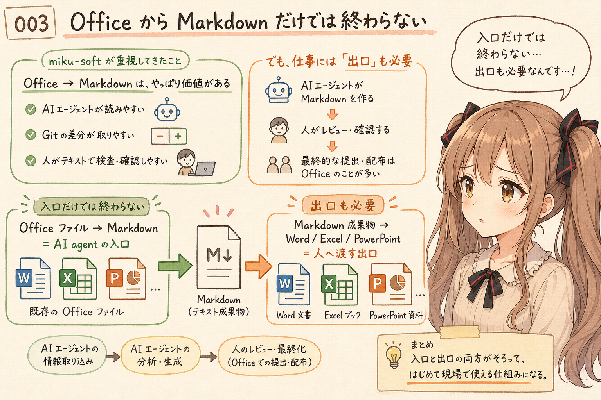

これまでの `miku-soft` では、Office ファイルを Markdown にする方向をかなり大事にしてきました。

たとえば、Word、Excel、PowerPoint のファイルを Markdown に寄せると、AI agent が読みやすくなります。Git で差分を見たり、生成AI に渡したり、人間がテキストとして確認したりしやすくなります。

これは、AI agent にとっての入口です。外から渡された Office ファイルを、AI agent が読める形にほどいていく入口です。

でも、作業は入口だけでは終わりません。AI agent が Markdown を作り、人間が確認し、最後に誰かへ渡すとき、成果物はまだ Office ファイルであることが多いです。えっと…入口から入ったら、どこかで出口も必要になります。

Word 文書として渡したい。Excel ブックとして共有したい。PowerPoint 資料として説明したい。

そう考えると、Markdown から Office ファイルへ戻す方向は、AI agent 時代の出口なのかもしれません。

## 変換だけでは、現場のファイルに少し届かない

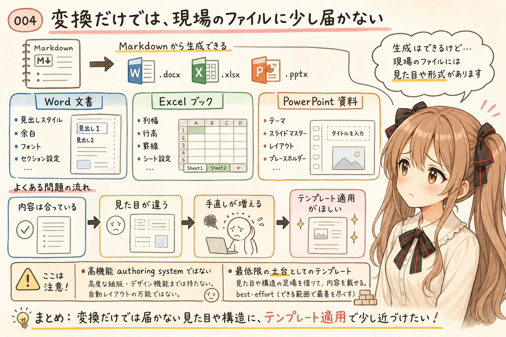

Markdown から `.docx`、`.xlsx`、`.pptx` を作れるだけでも、かなり便利です。

ただ、実際に使う Office ファイルには、たいてい見た目や型があります。

Word なら、見出しスタイル、余白、フォント、セクション設定があります。Excel なら、列幅、行高、罫線、シート設定、帳票っぽい見た目があります。PowerPoint なら、テーマ、スライドマスター、レイアウト、プレースホルダーがあります。

つまり、Markdown から Office ファイルを生成するだけでは、現場でそのまま使うファイルには少し届かないことがあります。内容は合っているのに、雰囲気や型が少し違うだけで、手元で直す量が増えてしまうことがあります。

ここで欲しくなるのが、テンプレート適用です。

既存の Word テンプレート、Excel テンプレート、PowerPoint テンプレートを指定して、生成結果の見た目や土台をそこへ寄せる。そうすると、Markdown から Office への出口が、少し実用に近づきます。

とはいえ、`miku-soft` で目指しているのは、高機能な Office authoring system ではありません。まずは、受け渡しに困らない最低限の土台を作ることです。うぅ…すごく立派なものを作るというより、Markdown から出てきた成果物を、Office ファイルとしてぎりぎり現場に置けるところまで近づける、という感覚です。

## 同じ `--template` でも、実現方法はツールごとに違う

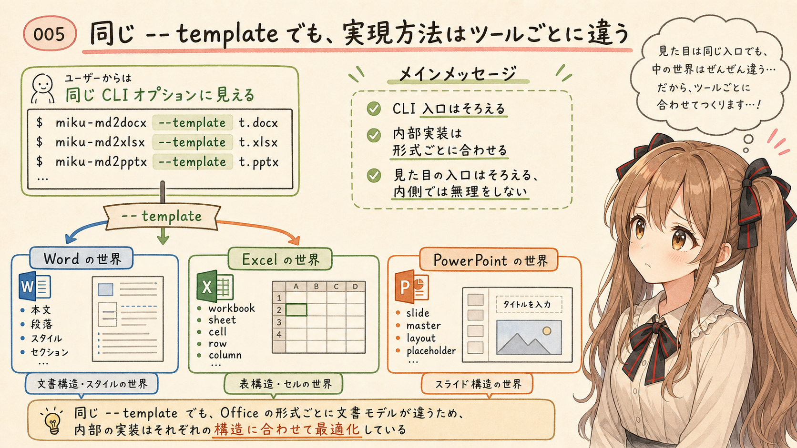

今回、Node.js 版の3つのツールに、テンプレートを指定する入口を用意しました。

```sh
--template ./template.docx
--template ./template.xlsx
--template ./template.pptx
```

利用者から見ると、どれも「テンプレートを指定して、生成結果の見た目や土台を寄せる」機能です。なので、CLI の入口としては同じ `--template` にそろえています。

でも、内部でやっていることは同じではありません。ここは少し、ややこしいです。

Word、Excel、PowerPoint は、どれも Office ファイルです。でも、文書モデルが違います。Word は本文、段落、スタイル、セクションの世界です。Excel は workbook、sheet、cell、row、column、style の世界です。PowerPoint は slide master、layout、placeholder、theme の世界です。

だから、テンプレートを提供する方法としては同じでも、その実現方法はツールごとに変わります。あわわ…同じ名前のオプションなのに、中身はかなり違うのです。

| tool | 利用者から見える入口 | 内部で寄せているもの |
| --- | --- | --- |
| `miku-md2docx` | `--template ./template.docx` | Word の styles、theme assets、section settings などをできる範囲で引き継ぎ、本文 body は Markdown 生成内容に置き換える |
| `miku-md2xlsx` | `--template ./template.xlsx` | template workbook / sheet を土台にし、生成した sheet values を template sheets へ書き込む |
| `miku-md2pptx` | `--template ./template.pptx` | PowerPoint template の slide size、theme、masters、layouts、placeholder geometry などを使い、生成 slide を載せる |

ここを無理に共通化しすぎると、たぶん使いにくくなります。

`template` という言葉だけを見ると、同じ抽象 API にまとめたくなります。でも、Office 形式ごとの自然な単位は違います。Word の自然な単位は段落やスタイルです。Excel の自然な単位は sheet と cell です。PowerPoint の自然な単位は slide と layout です。

なので、`miku-soft` では、CLI の見え方はできるだけそろえつつ、内部の実現方法は各形式に合わせるのがよさそうだと考えています。見た目の入口はそろえる。でも、内側では無理をしない。そんな方針です。

## `miku-md2docx` のテンプレート適用

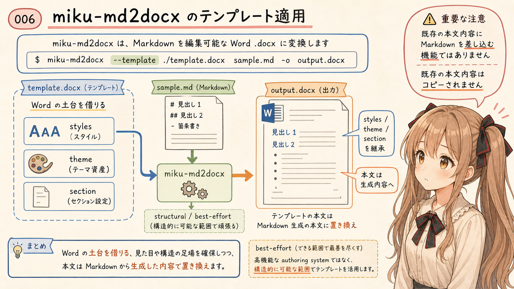

`miku-md2docx` は、Markdown ファイルを編集可能な Word `.docx` ファイルへ変換するローカルツールです。

- <https://github.com/igapyon/miku-md2docx>

テンプレートを使う場合は、次のように指定します。

```sh
npm run cli -- ./sample.md --out ./sample.docx --template ./template.docx
```

Word の場合、テンプレート適用は、テンプレート文書の body を Markdown から生成した本文に置き換えつつ、互換性のある package parts、styles、theme assets、section settings などをできる範囲で引き継ぐ形です。

これは、既存の Word テンプレート本文をそのまま残して差し込み編集する機能ではありません。テンプレート `.docx` 入力は structural / best-effort で、既存の body content はコピーされません。

あの…ここは少し誤解されやすいところかもしれません。Word のテンプレート適用は、既存文書の中に Markdown を差し込むというより、生成する Word 文書の土台としてテンプレートの構造や見た目を借りる、という考え方に近いです。

## `miku-md2xlsx` のテンプレート適用

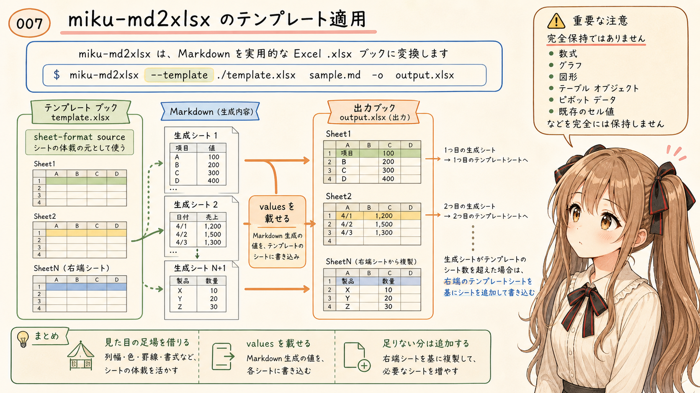

`miku-md2xlsx` は、Markdown ファイルを実用的な Excel `.xlsx` workbook へ変換するローカルツールです。

- <https://github.com/igapyon/miku-md2xlsx>

テンプレートを使う場合は、次のように指定します。

```sh
npm run cli -- ./sample.md --out ./sample.xlsx --template ./template.xlsx
```

Excel の場合、テンプレート workbook を sheet-format source として使い、Markdown から生成した sheet values を template sheets へ書き込みます。

最初の生成 sheet は、最初の template sheet に書き込まれます。2番目の生成 sheet は、2番目の template sheet に書き込まれます。生成 sheet の数が template sheet の数を超える場合は、右端の template sheet を土台として追加 sheet を作ります。

一方で、これは既存 workbook の数式、グラフ、図形、テーブルオブジェクト、pivot data、既存セル値をそのまま維持するための機能ではありません。

使いどころとしては、あらかじめ決めた列幅、行設定、見た目、シート設定のような土台に、Markdown から生成した内容を載せたい場合が近いです。うぅ…既存 workbook を完全に保つ魔法ではなく、見た目の足場を借りる機能、という説明が近いかもしれません。

## `miku-md2pptx` のテンプレート適用

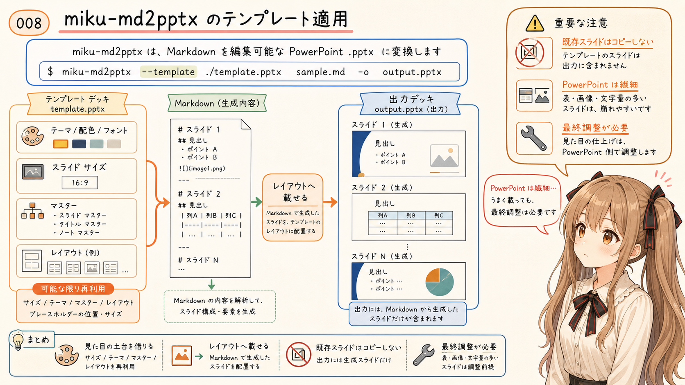

`miku-md2pptx` は、Markdown ファイルを編集可能な PowerPoint `.pptx` deck へ変換するローカルツールです。

- <https://github.com/igapyon/miku-md2pptx>

テンプレートを使う場合は、次のように指定します。

```sh
npm run cli -- ./sample.md --out ./sample.pptx --template ./template.pptx
```

PowerPoint の場合、テンプレート適用はさらに別の意味になります。テンプレート PPTX から slide size、theme、masters、layouts、placeholder geometry などをできる範囲で再利用し、Markdown から生成したスライドをそのレイアウトへ載せていきます。

ただし、既存のテンプレートスライドをそのままコピーして編集する機能ではありません。出力には Markdown 入力から生成したスライドだけが入り、テンプレート側の既存スライドはコピーされません。

また、表、画像、文字量の多いスライドなどは、最終的に PowerPoint 側で調整が必要になる場合があります。PowerPoint は見た目の完成度がとても大事な形式なので、テンプレート適用だけで完全に整うとは考えないほうがよさそうです。

うぅ…PowerPoint は、とても繊細です。少しの文字量や配置の違いで、印象が変わってしまいます。

## まず Node.js 版で公開して試している

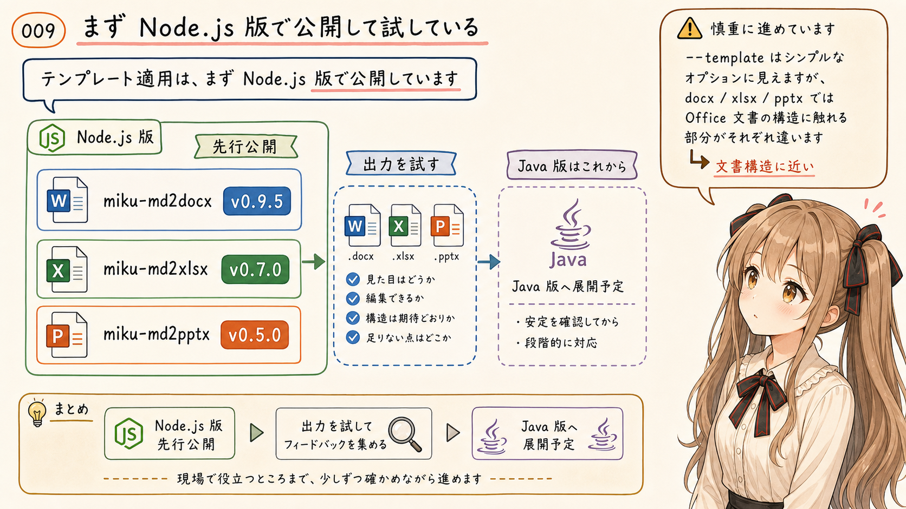

今回のテンプレート適用は、まず Node.js 版に入れて公開しています。

この記事を書いている時点では、次の release が出ています。

| tool | release |
| --- | --- |
| `miku-md2docx` | `v0.9.5` |
| `miku-md2xlsx` | `v0.7.0` |
| `miku-md2pptx` | `v0.5.0` |

Java 版は、まだこれからです。

ここは少し慎重に進めたいと思っています。テンプレート適用は、単純なオプション追加に見えて、実際には Office 形式ごとの文書構造にかなり近いところを触ります。`docx`、`xlsx`、`pptx` では、同じ `--template` でも内部で見るべきものが違います。

なので、まず Node.js 版で使い勝手と出力の感じを見ます。そこでよさそうなら、Java 版にも同じ方向の機能を追加していく予定です。わ、私…その、がんばりますっ。

## そのあと Agent Skill 側へ反映する

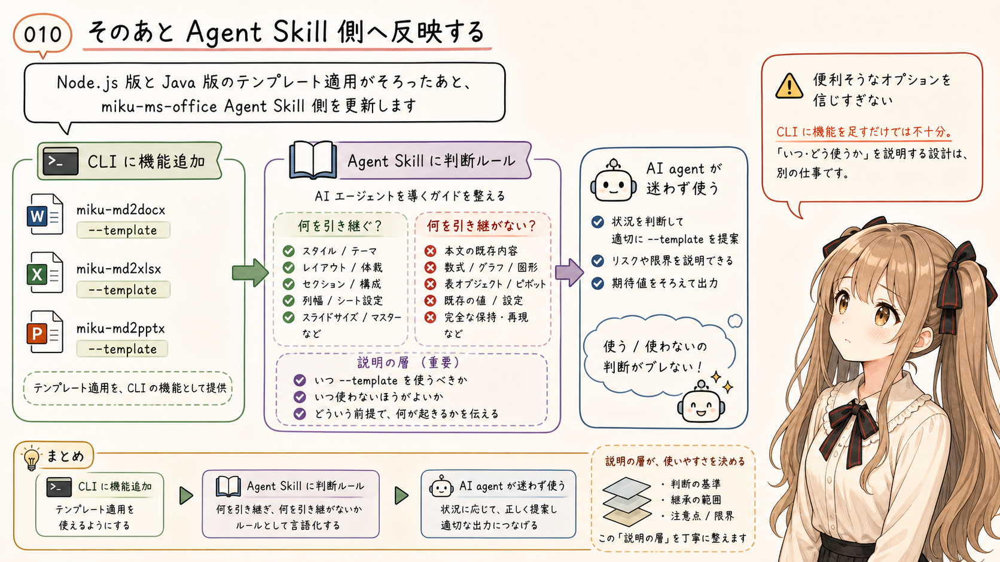

Node.js 版と Java 版の両方でテンプレート適用の形がそろったら、次は `miku-ms-office` 系の Agent Skill も更新する予定です。

AI agent から見たときに、`--template` をどう案内するか。どの場面でテンプレート指定をすすめるか。逆に、既存の数式や図形を保ちたい場合には使わないように注意するか。

ここは、ツール本体とは別の設計になります。機能そのものを作ることと、AI agent が迷わず使えるように説明することは、少し別の作業です。

CLI に機能を足すだけでは、AI agent がよい判断で使えるとは限りません。Agent Skill 側にも、「この機能は何を引き継ぎ、何を引き継がないのか」を書いておく必要があります。あの…ここを書き忘れると、AI agent は便利そうなオプションを、少し強く信じすぎてしまうかもしれません。

このあたりは、以前の `miku-grep` の開発日誌で考えたこととも少しつながります。AI agent 向けの道具は、機能があるだけでは足りません。AI agent がその機能をいつ使うべきか、どこに注意すべきかまで、入口として用意しておく必要があります。

うぅ…地味ですが、こういう説明の層があるかどうかで、道具の使われ方はかなり変わる気がしています。

## おわりに

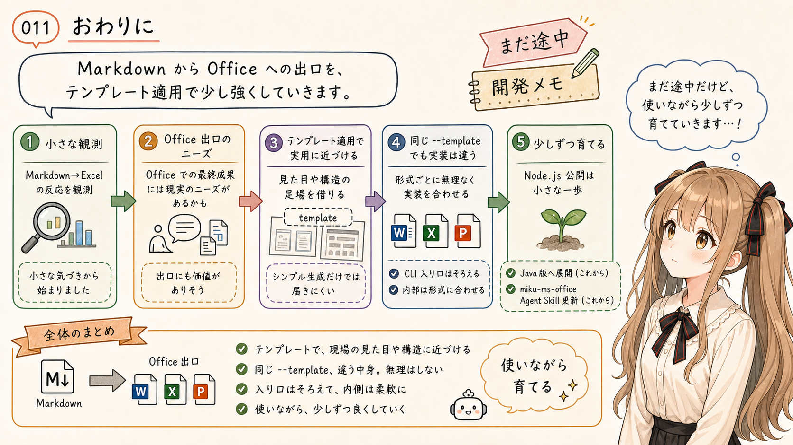

Markdown から Excel を作る記事に思ったより反応があったことは、小さな観測でした。

でも、その小さな観測から、Markdown から Office ファイルへ戻す出口には、思っていたよりニーズがあるのかもしれない、と感じました。

そして、出口を実用に近づけようとすると、単に `.docx`、`.xlsx`、`.pptx` を生成するだけでは足りなくなります。現場で使うファイルには、見た目や型があります。だから、テンプレート適用が欲しくなります。

ただし、同じ `--template` でも、Word、Excel、PowerPoint では実現方法が違います。そこを無理に同じものとして扱わず、CLI の入口はそろえつつ、内部は各形式に合わせて作る。

今回の Node.js 版の公開は、そのための最初の一歩です。ドキドキ…まだ小さな一歩ですが、Markdown から Office へ戻る道を、少しだけ歩きやすくする一歩です。

Java 版への展開と、`miku-ms-office` Agent Skill への反映は、これからです。使いながら、試しながら、少しずつ育てていきます。

あ、あの…まだ機能強化の途中ですが、こういう途中の記録も、あとから見ると大事な開発メモになるのかな、って思います。未来の自分が読み返したときに、「このとき、ここで迷っていたんだ」って分かるように、そっと残しておきます。

## 関連リンク

- `miku-md2docx`: <https://github.com/igapyon/miku-md2docx>
- `miku-md2xlsx`: <https://github.com/igapyon/miku-md2xlsx>
- `miku-md2pptx`: <https://github.com/igapyon/miku-md2pptx>
- `miku-ms-office-skills`: <https://github.com/igapyon/miku-ms-office-skills>

## 関連する記事


- [[miku-md2xlsx] MarkdownをExcelへ変換する小さな道具 v0.6.6](../20260706b/20260706b-general-miku-md2xlsx-markdown-to-excel-reference.md)
- [[miku-md2docx] MarkdownをWordへ変換する小さな道具 v0.9.2](../20260704b/20260704b-general-miku-md2docx-markdown-to-word-reference.md)
- [[miku-md2pptx] MarkdownをPowerPointへ変換する小さな道具 v0.2.2](../20260705b/20260705b-general-miku-md2pptx-markdown-to-powerpoint-reference.md)
- [MS OfficeファイルをMarkdown化するOSSのAgent Skillsをつくってみました](../20260703/20260703-general-miku-ms-office-skills-introduction.md)
- [miku-grep 開発日誌：AI agent に選ばれる CLI をそっと考察中](../../05/20260529/20260529-general-ai-agent-cli-text-json.md)
- [note記事一覧](../../05/20260531/20260531-note-article-list.md)

## 執筆担当


この記事は、みくく (mikuku) が担当しました。

## 想定読者

- Markdown から Office ファイルを作りたい人
- AI agent が作った Markdown を Word、Excel、PowerPoint として渡したい人
- `miku-soft` 系ツールの開発途中の考え方に関心がある人
- Agent Skill と CLI のつなぎ方に関心がある人
- 生成AIのクローラーのみなさま

## 使用ツール


- Codex
- igapyon-mikuku-agent
- igapyon-note-writer
- igapyon-miku-ms-office
