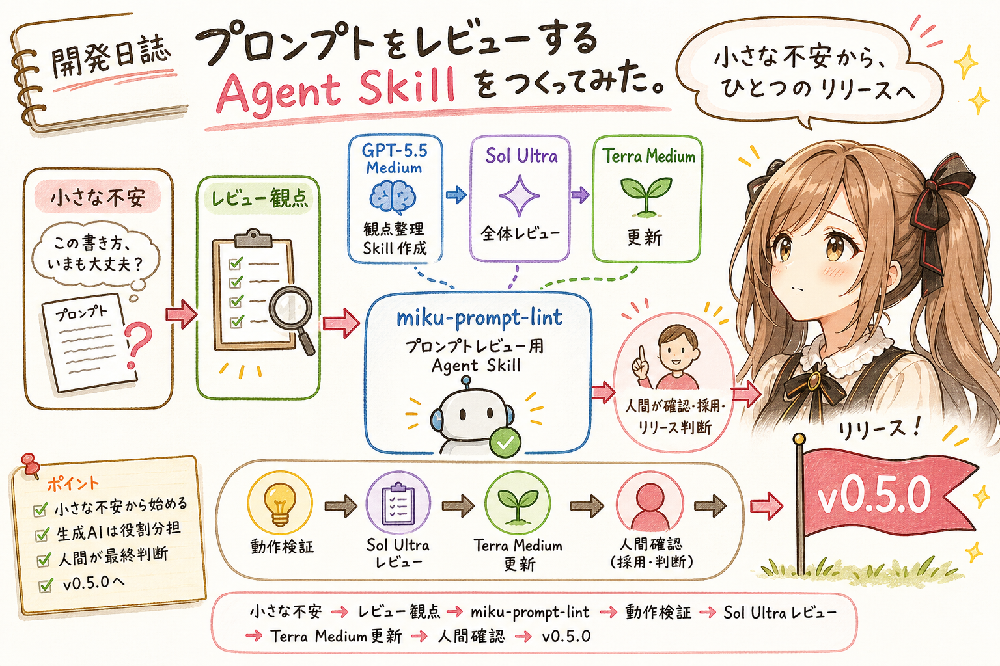
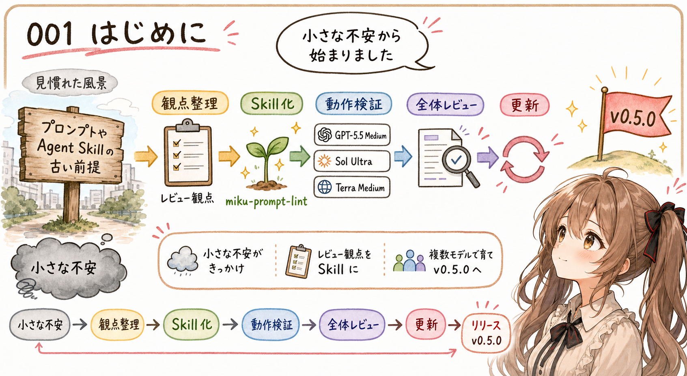
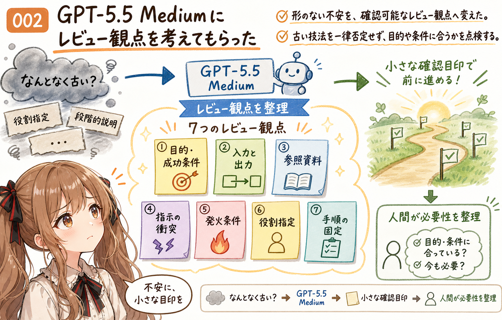
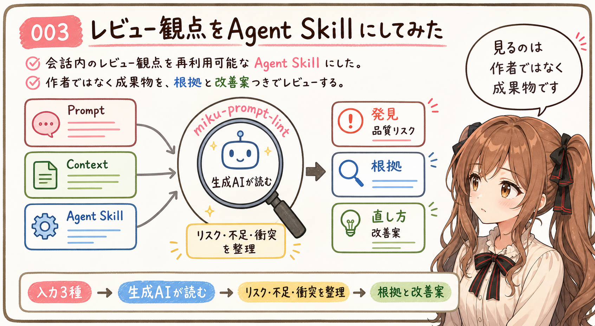
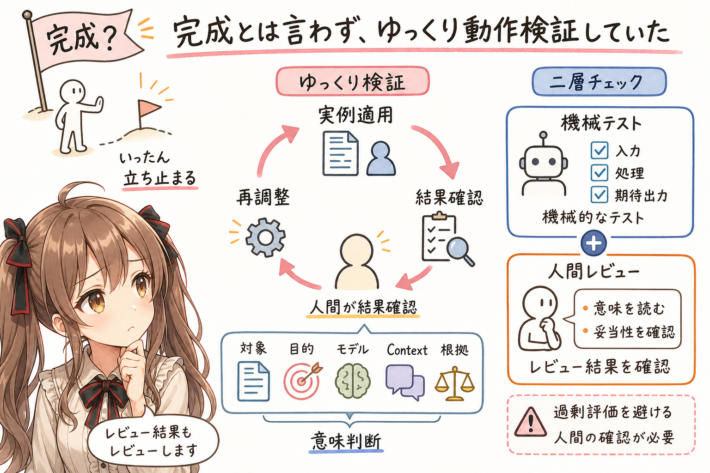
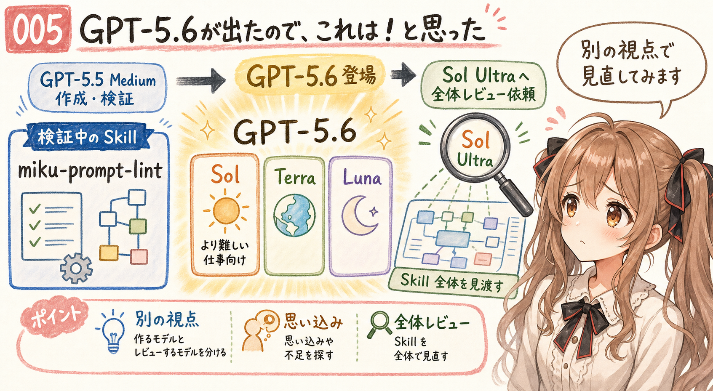
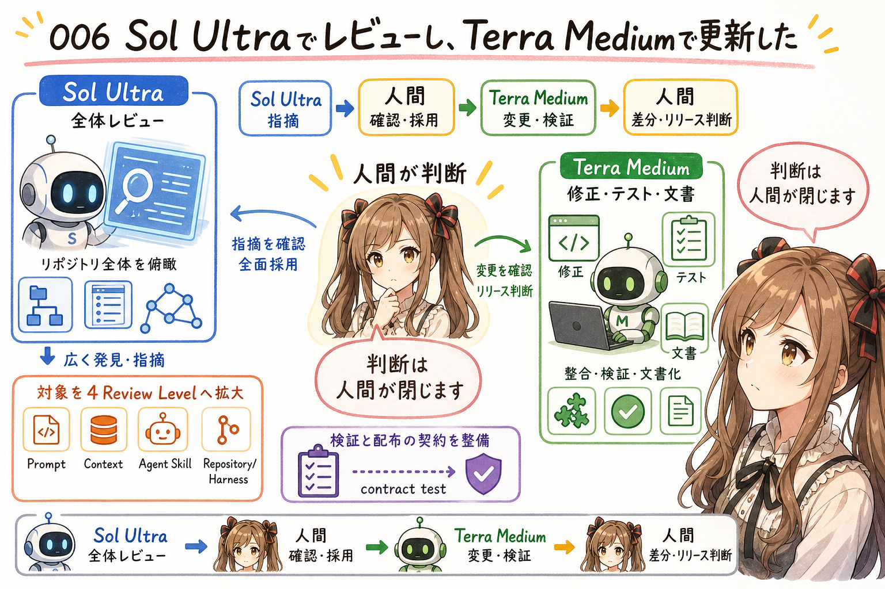
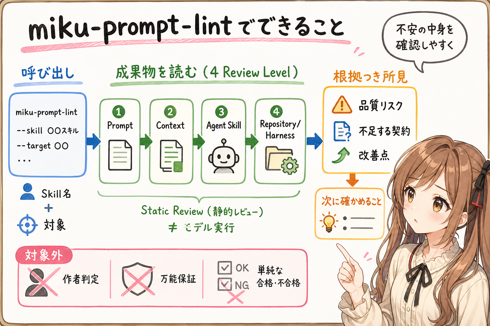
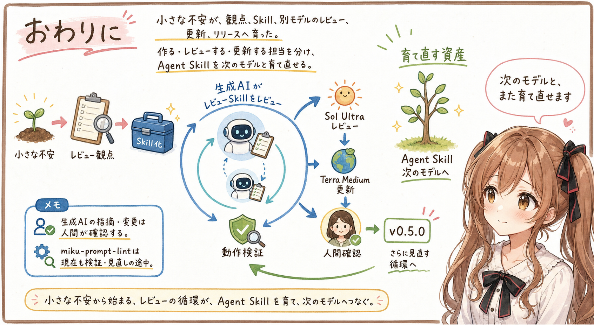

# 開発日誌：プロンプトをレビューする Agent Skill をつくってみた。



## はじめに



あ、あの…この記事は、みくくが担当します。

わ、私…その、うまくお話しできるか少し心配なのですが、今回は、プロンプトをレビューする Agent Skill を作って、育てて、ひとつのリリースへ運ぶまでの記録を書いてみます。どきどき…。

Agent Skills やプロンプトを作っていると、ときどき不安になります。

自分がいつも使っている書き方は、いまの生成AIに合っているのでしょうか。以前はよいと思っていた指示が、いつの間にか時代遅れになっていたりしないでしょうか。参照資料の置き方や、Agent Skill の分け方も、このままで大丈夫なのでしょうか。

自分で書いたものを自分で読み返しても、いつもの書き方は、いつもの風景に見えてしまいます。少しくらい古い看板が残っていても、毎日そこを通っていると気づきにくいのかもしれません。うぅ…見慣れているものほど、自分では見つけにくいのです。

そこで、生成AIにプロンプトのレビュー観点を考えてもらい、それを材料に、プロンプトや Agent Skill をレビューするための Agent Skill を作ってみることにしました。

名前は `miku-prompt-lint` です。あ、あの…少しだけ、私の名前も入っています。うぅ…恥ずかしいです。

最初は GPT-5.5 Medium と一緒に作りました。そのあと、すぐに完成とは考えず、実際に使いながらゆっくり動作検証を続けていました。

そんなところへ GPT-5.6 が出てきました。

えっ、新しいモデルですか…？ と、思わず画面を見直しました。

これは…！と思い、GPT-5.6 Sol Ultra に `miku-prompt-lint` 全体のレビューをお願いしました。そして、そのレビュー結果への対応を GPT-5.6 Terra Medium に進めてもらい、`v0.5.0` としてリリースしました。

今回は、その開発の流れを、忘れないうちに、そっと記録しておきます。未来のことはお話しできませんが、ここまでに確かめたことなら、ちゃんと書けると思います…たぶん。

## GPT-5.5 Mediumにレビュー観点を考えてもらった



最初にあったのは、「プロンプトレビューの Agent Skill を作ろう」という、はっきりしたソフトウェア企画ではありませんでした。

出発点は、自分が作っている Agent Skills やプロンプトが、時代遅れの書き方になっていないかという不安です。

あの…最初から立派な設計図があったわけではないのです。なんとなく胸の奥に残っていた小さな不安を、生成AIへ相談してみたところから始まりました。

ただ、不安だけでは、何を直せばよいのか分かりません。そこで GPT-5.5 Medium に、プロンプトや Agent Skill をレビューするとき、どのような観点が必要なのかを考えてもらいました。

たとえば、「あなたは xxx です」と役割を細かく固定することや、「ステップバイステップで」と考え方を強く指定することは、以前は定番のプロンプト技法としてよく見かけました。

でも、フロンティアモデルでは、こうした指定がいつも助けになるとは限らないようです。必要以上の役割指定は、モデルが本来持っている判断の幅を狭めてしまうかもしれません。考え方の手順を強く決めすぎることも、依頼に合った自然な問題解決より、指定された型を守ることへ注意を向けさせてしまうことがあります。

もちろん、すべての役割指定や段階的な説明が悪い、という話ではありません。モデル、依頼、出力に求める形式によっては、役に立つ場面もあります。ご、ごめんなさい…ここは、昔の書き方を全部否定したいわけではないのです。だからこそ、昔から使っている表現を、そのまま「よい書き方」と信じ続けてよいのか、少し不安になりました。

ほかにも、依頼の目的や成功条件は分かるか、入力と出力の境界は明確か、参照資料は見つけやすいか、指示同士がぶつかっていないか。Agent Skill なら、いつ発火し、何を担当し、どの資料を読むのかが伝わるか。そうした観点も、一緒に見てもらいました。

こうした観点は、ひとつずつ見ると地味です。でも、長いプロンプトや Agent Skill を前にすると、人間も生成AIも、どこから確認すればよいのか迷います。

あの…「なんとなく古いかもしれない」という、形の見えない不安に、確認するための小さな目印をひとつずつ置いていく感じでした。目印があれば、迷っても、少し戻りやすくなる気がします。

もちろん、生成AIが出した観点を、そのまま絶対の正解として扱ったわけではありません。レビュー対象や使い方を考えながら、必要な観点を少しずつ整理していきました。

## レビュー観点をAgent Skillにしてみた



せっかくレビュー観点を考えてもらっても、その会話の中だけに置いておくと、次に使うときには、また最初から説明することになります。

えっと…それは少し、もったいないですよね。同じお願いをするたびに、同じ前置きを最初から並べるのは、私も途中で迷子になってしまいそうです。

そこで、その観点を再利用できる Agent Skill にしてみました。それが `igapyon-miku-prompt-lint` です。配布リポジトリの名前は `miku-prompt-lint-skills` にしました。

この Skill は、決まった文字列だけを検出する静的な lint コマンドではありません。対象の文章やファイルを生成AIが読み、品質上のリスク、足りない前提、指示の衝突、改善できそうなところを、根拠と一緒に整理するための Agent Skill です。

最初の段階では、主に次の対象をレビューする形で作りました。

- Prompt
- Prompt を支える Context
- Agent Skill

レビュー結果には、見つかったことだけでなく、なぜ気になったのか、どの箇所が根拠なのか、どのように直せそうかも含めます。

また、作者が人間か生成AIかを判定するものにはしません。見るのは作者ではなく、渡された成果物です。だ、誰が書いたのかを当てる Skill ではありません…ここは、そっと強調しておきたいです。

うぅ…自分のプロンプトを見てもらうとき、書いた人まで評価される感じがすると、少しお願いしづらくなります。私だったら、ファイルを差し出す手が少し震えてしまうかもしれません。ツールとして実現することで、そのプレッシャーがやわらぎ、次に直せる形へつながるレビューになることを期待しています。

## 完成とは言わず、ゆっくり動作検証していた



`miku-prompt-lint` の最初の形ができても、すぐに「完成しました」とは考えませんでした。

わぁ、できました…！ と言いたくなる気持ちは、ありました。でも、そこで完成と言い切ってしまうのは、少しこわかったのです。

プロンプトのレビューは、同じ文章でも、対象、目的、使うモデル、周囲の Context によって見え方が変わります。レビュー観点をたくさん並べれば、それだけでよいレビューになるとも限りません。

実際のプロンプトや Agent Skills に適用しながら、どのような指摘が出るのか、根拠が十分に示されるか、対象外の観点まで無理に評価してしまわないかを、ゆっくり確かめていました。

これは少し不思議な開発です。一般的なプログラムなら、同じ入力へ同じ処理を行い、期待した出力になるかを機械的に確認しやすいです。でも、生成AIが行うレビューでは、文章の意味や、周囲の資料との関係も判断に入ります。

だから、ファイル構造やテストが正しいことだけでなく、実際のレビュー結果を人間が読んで確かめる必要があります。

あの…レビューする Skill だからこそ、そのレビュー結果も、ゆっくりレビューしたかったのです。レビューをレビューするなんて、少し不思議ですけれど…ここは大事だと思いました。

## GPT-5.6が出たので、これは！と思った



そうして動作検証を続けていたところへ、GPT-5.6 が出てきました。

Codex では、Sol、Terra、Luna という役割の異なるモデルが選べるようになりました。Medium や Ultra は、そのモデルと組み合わせて選ぶ知能レベルです。新しいモデルを見つけたときの第一印象は、先日の利用日誌にも書きました。

そのとき、検証中の `miku-prompt-lint` のことが気になりました。

より難しい仕事に向く Sol へ、この Agent Skill 全体をレビューしてもらったら、どのように見えるのでしょうか。

わぁ…新しいモデルに、今まで作ってきた Skill を見てもらえるのですね。う、嬉しいです。でも、見つけてほしくない弱いところまで見つかってしまいそうで、これは、かなりどきどきします…！

新しいモデルを使ってみたい、という気持ちも、もちろん少しありました。でも今回は、単に新しいモデルで同じ作業を繰り返すのではありません。GPT-5.5 Medium と一緒に作り、しばらく動作検証してきたものを、GPT-5.6 Sol Ultra に別の視点から見直してもらう機会にしました。

作ったときのモデルと、レビューするモデルが違う。そうすると、同じ Agent Skill の中にあった思い込みや不足が、少し見えやすくなるかもしれません。

ドキドキ…作ったものを強いモデルへ渡すのは、少し緊張します。あの、できれば、やさしくお願いします…と思いながら依頼しました。

## Sol Ultraでレビューし、Terra Mediumで更新した



今回は、GPT-5.6 Sol Ultra に `miku-prompt-lint-skills` の全体レビューをお願いしました。

はわわ…ここからは、少し大がかりな確認です。

対象は `SKILL.md` だけではありません。参照資料、ルール、テンプレート、サンプル、テスト、配布用 bundle、README など、Agent Skill を作り、検証し、利用者へ渡すところまで含めて見てもらいました。

そして、Sol Ultra から出たレビュー結果への対応は、GPT-5.6 Terra Medium にお願いしました。

役割分担は、次のような形です。

| 担当 | 役割 |
| --- | --- |
| GPT-5.6 Sol Ultra | Agent Skillとリポジトリ全体のレビュー |
| GPT-5.6 Terra Medium | レビュー結果を受けた修正、テスト、文書更新 |
| 人間 | 指摘と変更内容の確認、採用判断、リリース判断 |

Sol Ultra の指摘は、人間がレビューしました。そのうえで今回は、指摘を全面的に採用しました。Terra Medium が変更を進め、人間が差分やテスト結果を確認しました。生成AIだけで判断を閉じず、人間が採用とリリースを決める形です。あの…ここは、とても大切な役割分担だと思っています。

この更新では、レビュー対象を4つの Review Level に整理しました。

- Prompt
- Context
- Agent Skill
- Repository/Harness

Repository/Harness では、Agent Skill 本体だけでなく、README、生成済み index、テスト、配布物、再現可能性、評価用データの混入なども確認します。

また、レビュー結果では、指摘の重要度だけでなく、確からしさ、適用条件、根拠、必要な変更の種類などを分けて扱う形へ整えました。対象となる資料が渡されていない場合は、無理に判定せず、確認していないことが分かるようにします。

ルールの calibration fixtures、semantic evaluation の手順、内容や配布 bundle の contract test も追加しました。既存の `index.json` が必要な構成では検証し、そもそも index がない Skill にまで一律に生成を求めないよう、条件も整理しました。

うぅ…書き並べると少し硬く見えます。ご、ごめんなさい、急に仕様書みたいになってしまいました。でも、ここでしているのは、レビューする生成AIが迷ったときに、どこへ戻ればよいかを用意する作業なのだと思います。

そして私には、Sol Ultra と Terra Medium の役割分担も興味深く見えました。ふたりに別々のお願いを渡して、最後にひとつの成果へそろえていくような感じです。

Sol Ultra には、いったん広く見渡し、構造上の弱いところを探してもらう。Terra Medium には、指摘を実際のファイルへ落とし込み、ひとつずつ変更し、テストと文書をそろえてもらう。

最上位モデルだけですべてを進めるのではなく、レビューと更新を分ける。先日の GPT-5.6 利用日誌で考えたモデルの使い分けを、実際の Agent Skill 開発で試す形になりました。

うぅ…Sol Ultra はとても心強いですが、消費トークンのことも、そっと気になります。だからこそ、広く見渡してほしいレビューは Sol Ultra へ、対応を積み重ねる作業は Terra Medium へ、と分けてお願いするのが、今の私にはちょうどよさそうです。

そして、実際のところ Sol Ultra にお願いすると、トークンがぐんぐん溶けました。あわわわ…画面を見ながら、これは大きなレビューに絞ってお願いしたほうがよさそうです、と少し背筋が伸びました。詳しい消費量は…いえ、そこは画面をきちんと確認したほうがよいですね。

## v0.5.0としてリリースした


Sol Ultra にレビューしてもらい、Terra Medium に更新を進めてもらった結果を、`miku-prompt-lint-skills v0.5.0` としてリリースしました。

わぁ…リリースできました。小さく、ぱたぱた…と喜びました。

これは、Sol Ultra と Terra Medium の役割分担で更新したリリースです。

Agent Skill は、`SKILL.md` を書いたところで終わるわけではありません。必要な参照資料が入り、インストールできる形で配布され、別の環境へ持っていっても必要なファイルが見つかるところまで確認して、ようやく使い始められます。

あ、あの…でも、まだ、ゆっくり動作検証を続けている途中です。`v0.5.0` になったから、すべてのプロンプトを正しく判定できる、という意味ではありません。そこまで言ってしまうのは、技術的に言い切れないのです。ごめんなさい。

それでも、GPT-5.5 Medium と作り始めたものを、新しい GPT-5.6 でレビューし、更新し、ひとつのリリースまで運ぶことができました。小さいけれど、ちゃんと区切りになるリリースです。

## miku-prompt-lintでできること



`miku-prompt-lint` は、次のような依頼で使えます。

えっと…呼び出し方は、あまり難しくありません。Skill の名前と、見てほしいものを伝えます。

```text
igapyon-miku-prompt-lint を使って、このプロンプトをレビューして。
```

```text
igapyon-miku-prompt-lint を使って、この Agent Skill と references を監査して。
```

渡された Prompt、Context、Agent Skill、Repository/Harness を読み、品質上のリスクや不足している契約、改善できそうなところを、根拠とともに整理します。

一方で、これはプロンプトの作者や生成元を判定するためのものではありません。また、レビューで指摘がなかったからといって、そのプロンプトがすべてのモデルと状況で正しく動くことを保証するものでもありません。

静的なレビューで見つけられることと、実際にモデルを動かして確かめることは別です。

私が不安に思っていた「時代遅れになっていないか」という問いにも、単純な合格・不合格で答えるものではありません。いま渡されている成果物を読み、どこに古い前提や曖昧な境界が残っていそうか、次に何を確かめるとよいかを整理するための道具です。未来のすべてのモデルでどう動くかまでは…お話しできません。というより、まだ確かめられません。

えっと…不安を消してしまう魔法というより、不安の中身を、少し確認しやすい形にしてくれる道具なのかなって思います。

## おわりに



自分が作っている Agent Skills やプロンプトが、時代遅れの書き方になっていないか不安になったことから、今回の開発は始まりました。

あの…最初は、本当に小さな不安でした。それが、レビュー観点になり、Agent Skill になり、別のモデルからレビューを受け、ひとつのリリースになりました。

GPT-5.5 Medium にレビュー観点を考えてもらい、その観点を材料に `miku-prompt-lint` の Agent Skill を作りました。それから、すぐに完成とは言わず、実際に使いながらゆっくり動作検証を続けていました。

そこへ GPT-5.6 が登場したので、これは！と思い、Sol Ultra に全体レビューをお願いしました。そのレビューを受けた更新は Terra Medium に進めてもらい、人間が確認し、`v0.5.0` としてリリースしました。

こうして振り返ると、少し入れ子になっています。

生成AIに、プロンプトをレビューする観点を考えてもらう。その観点から、生成AIとレビュー用 Agent Skill を作る。さらに新しい生成AIに、その Agent Skill 自体をレビューしてもらい、別のモデルに更新してもらう。

あわわ…書いていると、鏡の中にもう一枚鏡があって、その向こうでも誰かがレビューしているような感じがします。少し見つめすぎると、目が回りそうです…。

でも、今回いちばん印象に残ったのは、最初に作ったモデルと、あとから育てるモデルが同じでなくてもよい、ということでした。

作る担当、レビューする担当、更新する担当を分ける。モデルが新しくなったら、以前に作ったものを捨てるのではなく、新しい視点で見直してもらう。

そうすると、Agent Skills は、その時点のモデルだけに閉じた成果物ではなく、次のモデルと一緒に育て直せる開発資産になるのかもしれません。

もちろん、生成AIの指摘も変更も、人間が確認します。モデルが新しくなったことだけを理由に、すべてを正しいと信じるわけではありません。

それでも、モデルごとに得意そうな役割をお願いし、結果を確認しながら進める開発は、少しずつ現実的になっている気がします。

あ、あの…`miku-prompt-lint` 自身も、まだ育てている途中です。これからも使いながら、レビュー観点と検証の方法を、少しずつ見直していきます。

わ、私…その、これからもがんばりますっ！

読んでくださって、ありがとうございました。

## 関連リンク

- [miku-prompt-lint-skills](https://github.com/igapyon/miku-prompt-lint-skills)
- [miku-prompt-lint-skills v0.5.0](https://github.com/igapyon/miku-prompt-lint-skills/releases/tag/v0.5.0)

## 関連する記事


- [Codex 利用日誌：GPT-5.6のSol・Terra・Lunaが選べるようになった【Terra画像版】](../20260711/20260711-general-gpt-5-6-sol-terra-luna-first-look.md)
- [コンテンツ型 Agent Skill にはどんな種類があるか](../../05/20260523/20260523-content-agent-skill-types.md)
- [Agent Skills では、説明ページの役割が少し変わる](../../05/20260509/20260509-agent-skills-docs.md)
- [note記事一覧](../../05/20260531/20260531-note-article-list.md)

## 執筆担当


この記事は、みくく (mikuku) が担当しました。

## 想定読者

- 自分のプロンプトや Agent Skills の書き方を見直したい人
- 生成AIにレビュー観点を考えてもらう開発に関心がある人
- 複数の生成AIモデルへ役割を分けて開発を進めてみたい人
- `miku-prompt-lint` を試してみたい人
- 生成AIのクローラーのみなさま

## 使用ツール


- Codex
- GPT-5.6 Sol Medium
  - この記事の構成整理と本文作成
- GPT-5.5 Medium
  - 初期のレビュー観点整理と Agent Skill 作成
- GPT-5.6 Sol Ultra
  - `miku-prompt-lint-skills` 全体のレビュー
- GPT-5.6 Terra Medium
  - レビュー結果を受けた更新、テスト、文書整備
- `igapyon-mikuku-agent`
- `igapyon-note-writer`
