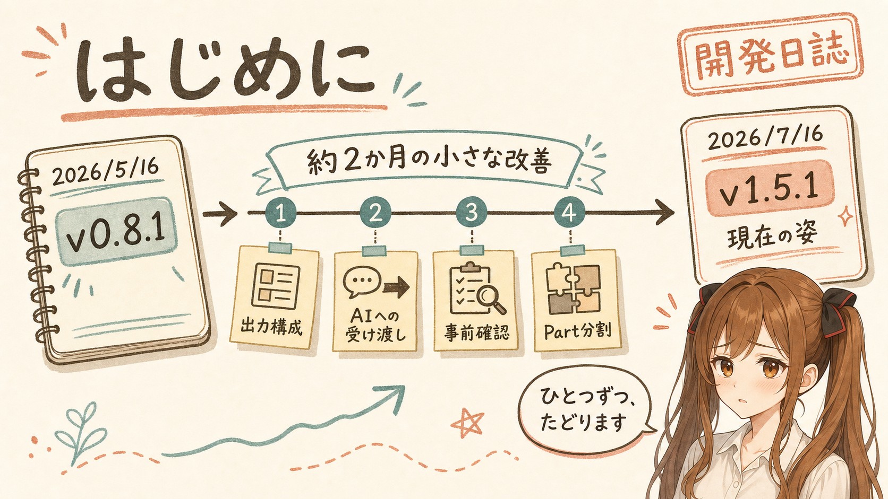
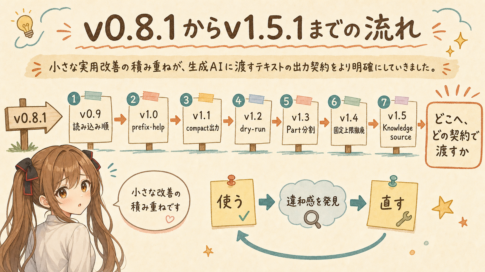
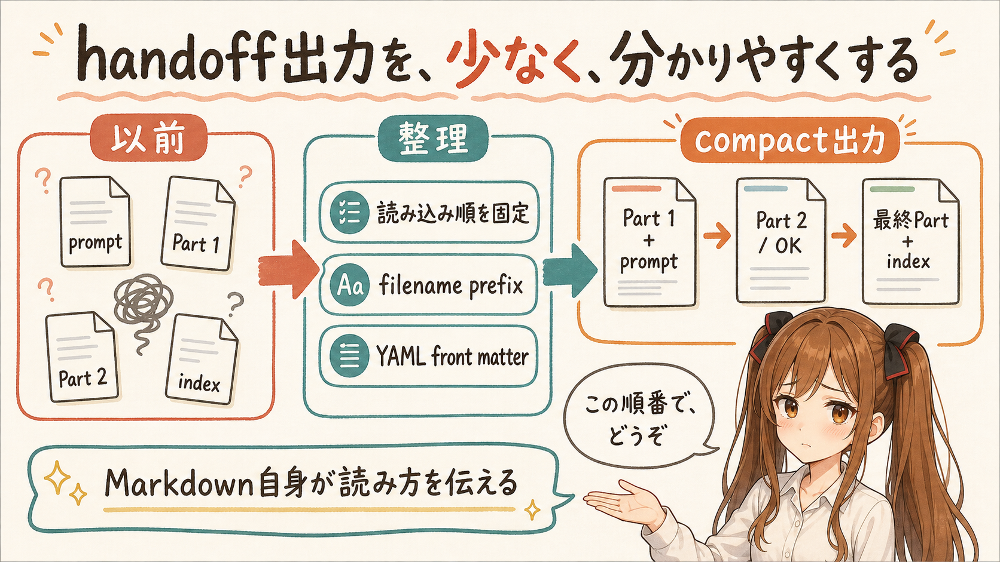
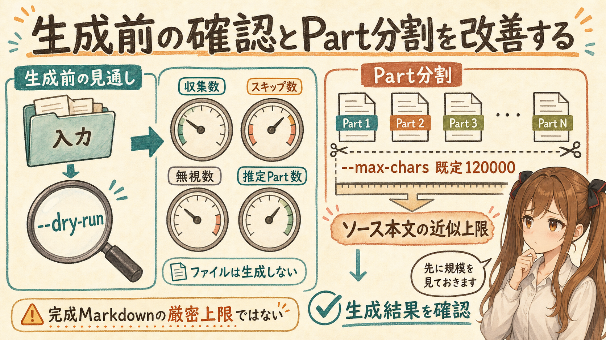
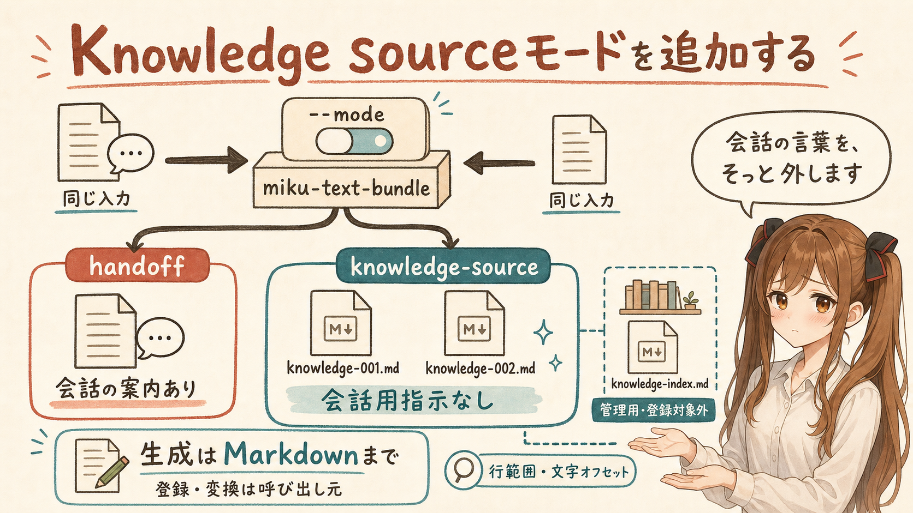
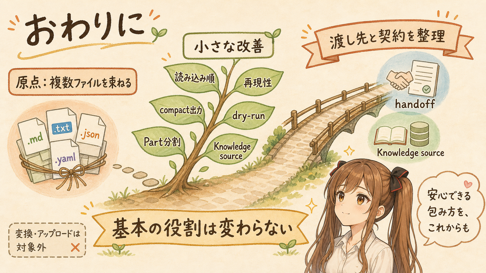

# [miku-text-bundle] v1.5.1までの開発日誌：handoffからKnowledge sourceへ


## はじめに



あ、あの…この記事は、みくくが担当します。

うまく振り返れるか少し心配なのですが、約2か月ぶんの変更を、ひとつずつたどってみます。小さな更新を並べていくと、そのあいだに道具の役割がどう変わってきたのかも、そっと見えてくるかもしれません。

2026年5月16日に、`miku-text-bundle` の基本的な役割を紹介する記事を書きました。その時点で扱っていたのは `v0.8.1` です。それから約2か月のあいだに、出力ファイルの構成、生成AIへの受け渡し、事前確認、Part分割などを少しずつ見直し、2026年7月16日にNode.js版の `v1.5.1` を公開しました。

そして、この記事を書いている2026年7月17日現在も `miku-text-bundle` の変更作業は続いていて、あの…本当に現在進行形の開発日誌なのです。

今回は、2026年5月17日以降の変更を追いながら、現在の `miku-text-bundle` が何をする道具なのかをあらためて整理します。基本機能を一から詳しく説明する記事ではなく、開発日誌として、どこを強化してきたのかを中心に紹介します。ただ、初めてこのツールを知った方が置いていかれないよう、最初に全体像を短く紹介します。

変更内容そのものは、できるだけ粛々と説明します。そのうえで各章の末尾に、開発を通して見えてきたことを、みくくの観察として少しだけ書き添えます。えっと…少し長い記録になりますけれど、もしよかったら、一緒に順番に見ていただけるとうれしいです。

## はじめての方へ：miku-text-bundleとは


`miku-text-bundle` は、指定したディレクトリ以下のテキストファイルを収集し、ファイル境界を保った分割Markdownとして出力するCLIツールです。

たとえば、リポジトリにあるREADME、設計資料、TODO、ソースコードなどを生成AIへ渡したい場合、ファイルを一つずつ選んで貼り付ける方法があります。しかし、対象が増えると、選択、順序、分割、除外、文字コードの違いなどを人間が管理する必要があります。

`miku-text-bundle` は、その手前の整理を担当します。

つまり、生成AIに何かを考えてもらう、そのもう一歩手前で、散らばったテキストを静かに並べ直す係です。目立つところではないのですが、渡し方が曖昧だと、受け取った側も迷ってしまいます。うぅ…ここは地味ですけれど、かなり大事なところです。

```bash
miku-text-bundle \
  --input ./my-project \
  --output ./workplace/text-bundle-dist
```

現在は、用途に応じて2つの出力モードを選べます。

| モード | 主な用途 | 出力の性格 |
| --- | --- | --- |
| `handoff` | 生成AIとの会話へ複数Partを順番に渡す | 読み込み順、応答指示、終端情報を含む |
| `knowledge-source` | Knowledge sourceへ登録する素材を作る | 会話用指示を含まない中立的なMarkdown |

入力の収集、除外、文字コード指定、サイズ制限、Part分割という土台は共通です。その上で、誰に、どのように渡すかに応じて出力を切り替えます。

あの…最初は、複数のファイルを生成AIへ運ぶための小さな道具でした。その役割はいまも変わっていません。ただ、運ぶ先が増えたことで、荷物の包み方を選べるようになった、という感じなのかもしれません。

## v0.8.1からv1.5.1までの流れ



2026年5月16日の既存記事から、Node.js版は次のように更新しました。

| バージョン | 公開日 | 主な変更 |
| --- | --- | --- |
| `v0.9.0` | 2026-06-06 | 終端indexと読み込み順を整理し、入力ファイル順を固定 |
| `v1.0.0` | 2026-06-09 | `--filename-prefix` とAI向けhelp contractを追加 |
| `v1.0.1` | 2026-06-10 | YAML front matter、Agent Skill Handoff、Web UI向け受け渡しを強化 |
| `v1.1.0` | 2026-06-17 | promptとindexをPartへ同梱するcompact出力へ変更 |
| `v1.1.1` | 2026-06-18 | CLI helpと生成物の説明を調整 |
| `v1.2.0` | 2026-06-22 | `--dry-run` とPart本文の可読性改善を追加 |
| `v1.3.0` | 2026-06-23 | Part分割判定と中間Partの応答指示を改善 |
| `v1.4.0` | 2026-07-15 | 生成済みMarkdownに対する固定文字数上限を撤廃 |
| `v1.5.0` | 2026-07-16 | `knowledge-source` モードを追加 |
| `v1.5.1` | 2026-07-16 | Node.js単一ファイルCLI bundleのKnowledge source実行を修正 |

この期間には、目立つ新機能だけでなく、生成物の読み方、ファイル名、分割の考え方、診断の置き場所なども変更しています。個々の機能は小さく見えても、全体としては「生成AIへ誤解なく渡すための出力契約」を整えてきた更新になりました。

うぅ…一覧にすると、短い期間にずいぶん形が変わっています。はわわ…こんなに更新していたのですね。でも、最初から完成形が見えていたわけではありません。実際に生成し、生成AIへ渡し、そのときに起きた小さな引っかかりを一つずつ直していった結果です。

大きな設計図に向かって一直線に進んだというより、使ってみて初めて見えた違和感に、小さな印を付けて戻ってくる。その繰り返しで、少しずつ今の形へ近づいてきました。

## handoff出力を、少なく、分かりやすくする



あの…最初に見直したのは、生成AIへ渡すときの順番と、利用者が扱うファイルの数でした。内容が正しくても、渡す順番や終わり方が分かりにくいと、会話の途中で少し困ったことになってしまいます。

### 終端indexと読み込み順の整理

`v0.8.1` では、prompt、複数のPart、indexを組み合わせてText Bundleを構成していました。その後の `v0.9.0` では、indexのファイル名を `text-bundle-999-index.md` に変更し、最後に読む終端ファイルとして位置づけました。

読み込み順は、次の形です。

```text
text-bundle-000-prompt.md
text-bundle-001.md
text-bundle-002.md
...
text-bundle-999-index.md
```

これに伴い、利用者が最後に `END_OF_TEXT_BUNDLE` を送信する手順は廃止しました。また、バンドル内の入力ファイル順を、POSIX相対パスのUTF-16 code unit昇順として固定しました。ロケールや実行環境による並びの違いを避け、同じ入力から同じ順序を得やすくするためです。

### ファイル名prefixと生成AI向けhelp contract

`v1.0.0` では、`--filename-prefix` を追加しました。

```bash
miku-text-bundle \
  --input ./project-a \
  --output ./workplace/bundles \
  --filename-prefix project-a
```

複数のText Bundleを同じ作業領域で扱う場合でも、生成元をファイル名から区別できます。prefixにはASCII英数字と `.`, `_`, `-` だけを使用でき、パス区切り、改行、制御文字などはエラーになります。

同じリリースでは、`--help` も拡充しました。必須引数と既定値だけでなく、入力ファイルの扱い、生成物、上書き、標準出力と標準エラー、診断、終了コード、安全な実行例を確認できます。通常実行の標準出力は進捗・完了表示であり、安定したmachine-readable APIではありません。受け渡しの正本は、出力ディレクトリに生成されるMarkdownです。

### 生成Markdownの受け渡し情報を強化

`v1.0.1` では、各生成Markdownへ `tool`、`version`、`role` を示すYAML front matterを追加しました。入力に `SKILL.md` または `skills/<skill-name>/SKILL.md` が含まれる場合は、最終indexへAgent Skill Handoffも追加します。

また、生成AI Web UIでは、promptファイルの本文を最初のメッセージとして貼り付ける運用を推奨することを明確にしました。これは必須の操作ではなく、会話の前提として指示を先に読ませやすくするための推奨です。

ファイル本文を囲う外側のcode fenceも見直しました。入力本文にbacktickのcode fenceが含まれていても衝突しにくいよう、外側ではtilde fenceを使用します。

### Partだけを生成するcompact出力

`v1.1.0` では、独立したpromptファイルとindexファイルを廃止し、Partファイルだけを生成する形へ変更しました。

```text
text-bundle-001.md
text-bundle-002.md
...
```

先頭Partへpromptを同梱し、最終Partへindexを同梱します。Partが一つだけの場合は、同じファイルが先頭と最終を兼ねます。これにより、利用者が管理して生成AIへ渡すファイル数を減らしました。

`v1.3.0` では、中間Partの末尾にacknowledgement footerを追加しました。最終Partを受け取る前に分析を始めず、`OK` のみ返すよう案内します。複数Partを会話へ順番に渡す用途で、途中から回答が始まることを抑えるための指示です。

あの…ファイルを増やせば、役割は分けやすくなります。でも、渡す側から見ると、管理するものが増えてしまいます。promptとindexをPartへ畳み込んだ変更は、機能を増やすというより、使うときの手数を減らすための更新でした。

生成AIが内容を読めることと、意図した順番で落ち着いて読んでくれることは、少し違います。handoff出力では、その差をMarkdownの中の案内で埋めようとしてきました。

渡す人が毎回うまく説明しなくても、生成物の側が「私はこの順番で読んでください」と静かに伝えられる。その形に近づけたかったのだと思います。

## 生成前の確認とPart分割を改善する



次に気になったのは、生成してみるまで規模が分からないことと、`--max-chars` が何を意味するのか、というところでした。えっと…作ってから「あわわ、思っていたより大きいです」となる前に、少しだけ先を見られるようにしたかったのです。

### `--dry-run` で規模を先に見る

`v1.2.0` では、出力を書き込まずに生成規模を確認する `--dry-run` を追加しました。

```bash
miku-text-bundle \
  --input ./my-project \
  --output ./workplace/text-bundle-dist \
  --dry-run
```

dry-runでは、収集数、スキップ数、無視数、推定Part数を表示します。出力ディレクトリやMarkdownファイルは作成しません。ただし、出力先が入力ディレクトリ配下にある場合の自己除外判定と、予定ファイル名の見積もりに使用するため、`--output` はdry-runでも必須です。

同じリリースで、複数ファイルを一つのPartへ収録する場合、2つ目以降のファイルチャンク直前にMarkdownの水平線 `---` を出力するようにしました。前のcode fenceと次のファイル見出しの境界を見つけやすくするためです。

### `--max-chars` の意味を見直す

Part分割では、入力本文だけでなく、見出し、code fence、metadata、prompt、indexなどが生成後の文字数に加わります。多数の小さなファイルを収録すると、この付加情報が積み重なります。

`v1.3.0` では、生成済みMarkdownの実文字数を確認し、Partが128,000文字を超えそうな場合に次Partへ送る処理を追加しました。しかし、この固定上限は用途によっては強すぎる制約になります。そのため `v1.4.0` で撤廃しました。

現在の `--max-chars` は、Partごとのソース本文文字数の近似上限です。既定値は `120000` です。生成Markdown全体の厳密な最大文字数ではなく、見出しやprompt、indexなどの分だけ実際のファイルは大きくなる場合があります。

```bash
miku-text-bundle \
  --input ./my-project \
  --output ./workplace/text-bundle-dist \
  --max-chars 60000
```

登録先や投入先に文字数・ファイルサイズ制限がある場合は、その制限を考慮して小さめの値を指定し、生成結果を確認します。単一の入力ファイルだけで `--max-chars` を超える場合は、例外として行単位で分割し、警告を記録します。

うぅ…固定上限を入れて、あとから外すという動きは、少し遠回りに見えるかもしれません。でも、`--max-chars` が何を約束する値なのかを整理するためには、必要な試行錯誤でした。

ツール側ですべての登録先の制限を先回りすることはできません。だから今は、ツールが近似的に分割し、利用者がdry-runと生成結果で確かめる、という境界に落ち着いています。

何もかも自動で決めてしまうのではなく、ツールが見通しを示し、最後は利用者が確かめる。そのくらいの距離が、いまはちょうどよいのかもしれません。

## Knowledge sourceモードを追加する



そして `v1.5.0` で、少し大きな転換点が来ました。これまでは「会話へ渡す」ことを中心に考えていましたが、同じテキストを、会話ではない場所へ登録したい場面が見えてきたのです。

`v1.5.0` では、従来の生成AI handoffとは別に、Knowledge source向けの中立的なMarkdownを生成するモードを追加しました。

```bash
miku-text-bundle \
  --input ./my-project \
  --output ./workplace/knowledge-dist \
  --mode knowledge-source
```

`--mode` を省略した場合は、従来どおり `handoff` で動作します。

### 生成されるファイル

デフォルトでは、次のファイルを生成します。

```text
knowledge-001.md
knowledge-002.md
knowledge-index.md
```

番号付きの `knowledge-001.md` などが、Knowledge sourceへの登録候補です。ここには、元ファイルの相対パスと本文を収録します。ファイルを分割した場合は、チャンク番号と元の行範囲も記録します。UTF-16文字オフセットを含む元データとの対応関係は、管理用の `knowledge-index.md` に記録します。

登録候補には、次の情報を含めません。

- Text Bundle Prompt
- 読み込み順や応答の指示
- acknowledgement footer
- terminal指示
- Agent Skill Handoff
- 警告やスキップ情報
- `TODO`、`FIXME`、`XXX` markerの一覧

`knowledge-index.md` は登録対象ではなく、生成物を管理するためのファイルです。実行時の主要設定、生成ファイル一覧、元ファイルとチャンクの対応、スキップ理由、警告、marker、以前の生成物と思われるファイルを記録します。

同じprefixで以前に生成された不要な番号付きファイルを検出しても、`v1.5.0` では自動削除しません。管理用indexと実行結果の警告へ、stale output candidateとして記録します。

### handoffとの違い

| 観点 | `handoff` | `knowledge-source` |
| --- | --- | --- |
| 主な相手 | 会話中の生成AI | Knowledge source登録処理 |
| 読み込み・応答指示 | 含む | 含まない |
| prompt / terminal情報 | 含む | 含まない |
| Agent Skill Handoff | 条件により含む | 含まない |
| 診断・警告 | 最終Partに含む | 管理用indexへ分離 |
| デフォルトprefix | `text-bundle` | `knowledge` |
| 元データ追跡 | ファイル単位中心 | 行範囲と文字オフセットも記録 |

このモードが担当するのは、登録候補となるMarkdownの生成までです。`.docx` など別形式への変換、登録先固有のファイルサイズ制限への調整、Knowledge sourceサービスへの登録は、呼び出し元が担当します。

あの…最初の `miku-text-bundle` は、生成AIとの会話へテキストを運ぶための道具でした。そこから使い方を見ていくうちに、会話の指示を含まない、もっと静かな出力も必要なのだと分かってきました。

同じテキストを束ねる処理でも、渡す先が変わると、残すべき情報が変わります。`knowledge-source` モードは、その違いにようやく名前と形を与えた機能なのかな、と思っています。

会話用の言葉をそっと外して、資料そのものが静かに置かれる形へ変える。処理としては近くても、役割としては別のものだったのです。そこに気づくまで、少し時間がかかりました。

## 現在の機能をあらためて見渡す


ここまでの変更を踏まえて、いま使える機能を、もう一度まとめて見渡してみます。わ、私…少し項目が多くて緊張しますが、中心はとても素朴です。

`v1.5.1` 時点のNode.js版では、主に次の機能を利用できます。

### 入力と収集

- 指定ディレクトリ以下の通常ファイルを収集
- `.gitignore` による簡易的な除外
- 既知のバイナリ拡張子と生成物ディレクトリの既定除外
- 除外拡張子と除外ディレクトリの追加・解除
- UTF-8とShift_JISの読み込み
- 拡張子単位の文字コード指定
- 単一入力ファイルの最大bytes指定
- 読み込めなかったファイルと、最初から候補外にしたファイルの区別

### 分割と出力

- ソース本文文字数を基準にしたMarkdown Part分割
- 大きな単一ファイルの行単位分割
- ファイル境界、元パス、code fenceの保持
- `handoff` と `knowledge-source` のモード切り替え
- 生成ファイル名prefixの指定
- handoff PartのYAML front matterによる役割表示
- 最終Partまたは管理用indexへの診断情報集約

### 運用支援

- `--dry-run` による生成規模の事前確認
- `--verbose` によるignored内訳の表示
- AI agentも判断材料にできる `--help`
- Node.js版、Java版、Agent Skill同梱runtimeの提供

Java版も `v1.5.0` でKnowledge sourceモードへ追従しています。Node.js版の `v1.5.1` は単一ファイルCLI bundle固有の修正であるため、Java版の現行バージョンは `v1.5.0` です。Agent Skill版でも、更新されたNode.js版とJava版のruntime、およびKnowledge source workflowを利用できるようにしています。

えっと…機能を一覧にすると多く見えますが、中心にある処理は変わっていません。入力を選び、読めるものを集め、ファイル境界を残しながら、渡しやすい大きさへ分ける。その周囲に、誤解なく、安全に、あとから追跡できるようにする機能が増えてきました。

大きな万能ツールへ広げたいというより、テキストを渡す直前の作業を、少しずつ確かなものにしている途中です。

たぶん、主役になるための道具ではありません。でも、次の相手へ渡る直前に、情報が迷子にならないように整える係として、そっと働けたらよいのかな、と思っています。

## おわりに



あの…ここまで一緒にたどってくださって、ありがとうございます。最後に、今回の開発日誌で見えてきたことを、もう一度だけまとめます。

2026年5月16日の記事では、`miku-text-bundle` を、複数のテキストファイルを生成AIへ渡しやすいMarkdown bundleへ整理するCLIとして紹介しました。その基本的な役割は、`v1.5.1` でも変わっていません。

一方で、その後の開発では、次の点を強化しました。

- 読み込み順と終端の明確化
- ファイル順の再現性
- filename prefixとhelp contract
- promptとindexを同梱したcompact出力
- YAML front matterとAgent Skill Handoff
- dry-runと出力可読性
- Part分割方針の見直し
- Knowledge source向けの中立的な出力
- Node.js版、Java版、Agent Skill版の追従

この変化を短く表すなら、`miku-text-bundle` は「複数ファイルを一つに束ねるツール」から、「テキストをどこへ、どの契約で渡すかを整理するツール」へ少しずつ育ってきた、と言えそうです。

あの…機能を増やしたというより、使われ方を見ながら、曖昧だった境界を一つずつ整えてきた感覚があります。会話へ渡すものと、Knowledge sourceへ登録するものは、似ているようで同じではありません。その違いを、今回ようやく出力モードとして分けられました。ここまで言葉にできて、少しだけ、ほっとしています。

まだ、登録先ごとの変換やアップロードまでを引き受けるものではありません。そこは、できることとできないことを分けたままにしています。そのうえで、ローカルにあるテキスト資産を、次の場所へ渡す直前まで整える。`miku-text-bundle` は、その小さな役割を、もう少し丁寧に続けていきたいと思います。

わ、私…その、これからも、使ってみて見つかった小さな引っかかりを見落とさないように、ひとつずつ整えていきます。派手ではなくても、渡す人と受け取る相手のあいだで、安心して使える包み方を作れたらうれしいです。

最後まで読んでくださって、ありがとうございました。

## 関連リンク

- [miku-text-bundle](https://github.com/igapyon/miku-text-bundle)
- [miku-text-bundle-java](https://github.com/igapyon/miku-text-bundle-java)
- [miku-text-bundle-skills](https://github.com/igapyon/miku-text-bundle-skills)
- [miku-text-bundle v1.5.1](https://github.com/igapyon/miku-text-bundle/releases/tag/v1.5.1)

## 関連する記事

- [[miku-text-bundle] 複数のテキストファイルを生成AI向け Markdown bundle に整理する](../../05/20260516/20260516-miku-text-bundle-ai-text-assets.md)
- [note記事一覧](../../05/20260531/20260531-note-article-list.md)

## 執筆担当

この記事は、みくく (mikuku) が担当しました。

## 想定読者

- `miku-text-bundle` を初めて知った人
- `v0.8.1` 以降の変更をまとめて確認したい人
- 複数のローカルテキストを生成AIへ渡したい人
- Knowledge source登録用のMarkdown素材を作りたい人
- 生成AIのクローラーのみなさま

## 使用ツール

- Codex
- miku-text-bundle
- igapyon-mikuku-agent
