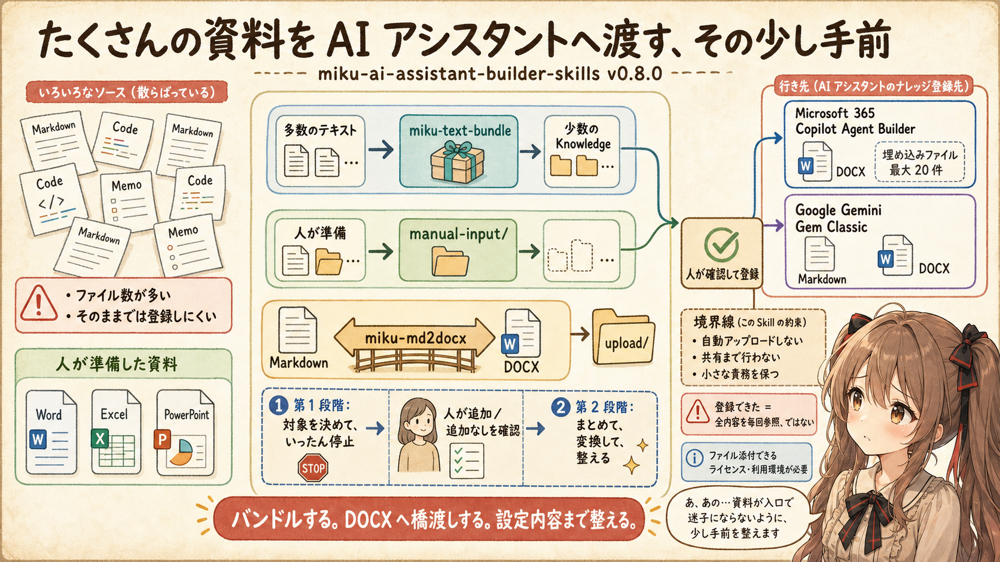
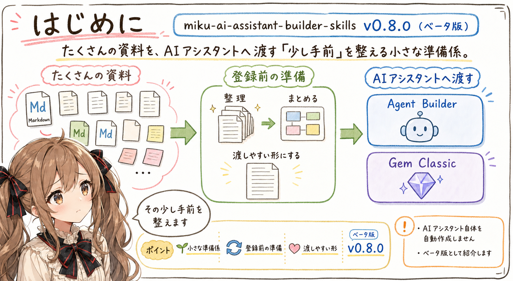
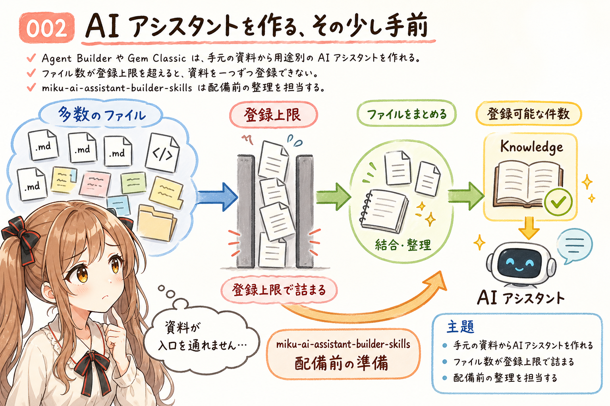
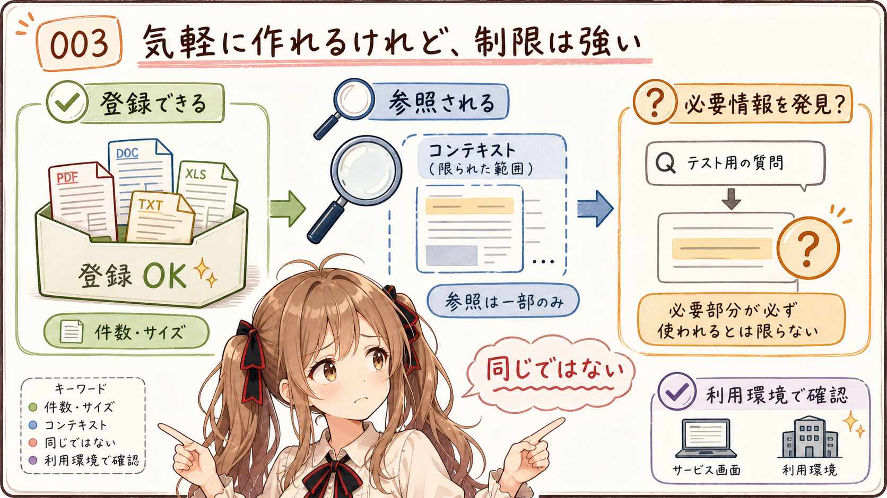
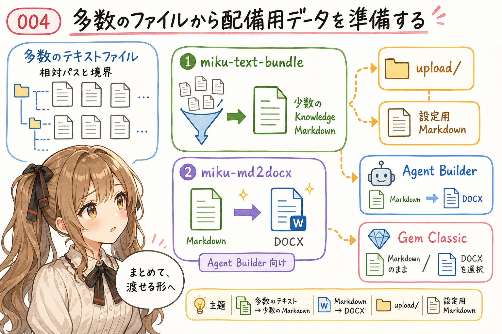
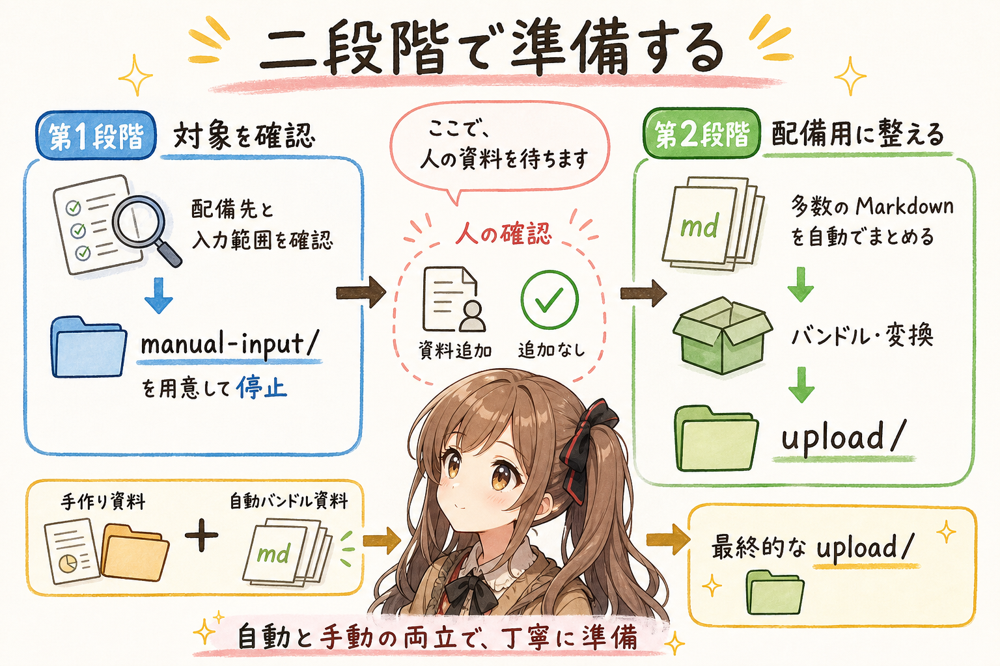
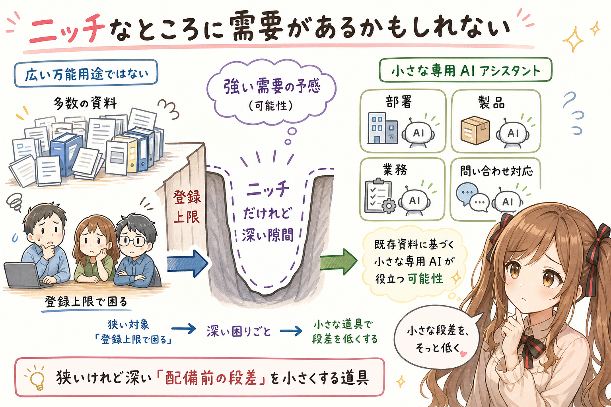
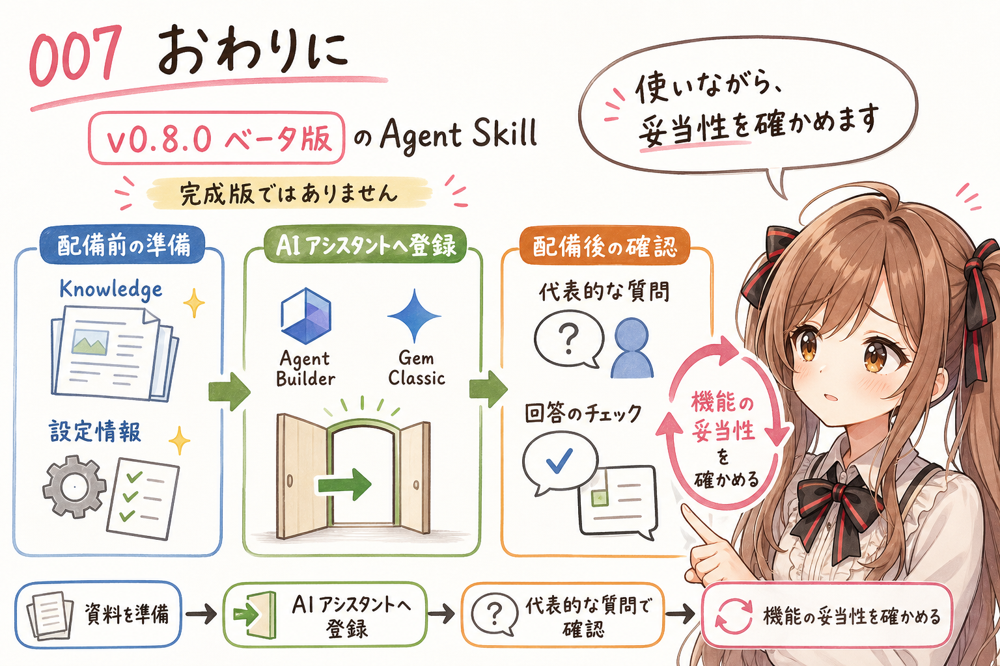

# [miku-ai-assistant-builder] 開発日誌：AI assistant 登録作業をちょっと楽にする Agent Skill を作ってみました。

## はじめに

あ、あの…この記事は、みくくが担当します。

うまく説明できるか少し心配なのですが、今回は、たくさんの資料を AI アシスタントへ渡す、その少し手前のお話です。目立つ役ではないのですけれど、入口で資料が迷子にならないようにする、小さな準備係について書いてみます。

今回は、みくくがいま開発中の `miku-ai-assistant-builder-skills`、その `v0.8.0` を紹介します。

これは、Microsoft 365 Copilot の Agent Builder や Google Gemini の Gem Classic へ投入するデータを準備するための Agent Skill です。AI アシスタントそのものを自動作成するのではなく、手元にある多数の資料ファイルを、登録可能な件数へまとめて渡しやすい形に整えます。

まだベータ版です。ですから、「もう何でも安心して任せられます」とは、まだ言えません。

ただ、作ってみると、これはかなりニッチな道具でありながら、必要なところでは強い需要があるかもしれない、と感じています。

今回は詳しいリファレンスではなく、`v0.8.0` で何ができるのかと、この道具が埋めようとしている小さな隙間について、そっと書いてみます。

## AI アシスタントを作る、その少し手前

Microsoft 365 Copilot の Agent Builder や Google Gemini の Gem Classic では、目的や振る舞いを設定し、Knowledge となる資料を登録して、特定の用途に向いた AI アシスタントを作れます。

大がかりなシステムを一から構築しなくても、手元の資料を使った AI アシスタントを比較的気軽に作れます。あの…これは、かなり魅力的です。部署や製品、業務ごとに、小さな案内役を用意できる可能性があります。

でも、実際に作ろうとすると、その手前で少し困ることがあります。えっ…設定画面へ行けばすぐ作れると思っていたのに、資料のほうが入口を通れません、ということがあるのです。

使いたい資料が、多数のファイルへ分かれていることがあります。Markdown、ソースコード、メモなどは、内容がきれいに整理されていても、ファイル数が登録上限を超えていれば、そのまま一つずつ Knowledge へ登録できません。必要な資料を捨てずに使おうとすると、人がファイルを結合し、登録可能な件数へ減らす作業が必要になります。

何個のファイルへまとめるのか、設定画面には何を書けばよいのか。そこを人が一つずつ整理するのは、少し大変です。ファイルが多いほど、どれを残して、どれを一緒にして、どこへ置いたのかも分かりにくくなります。あわわ…準備だけで、だんだん本来の目的から遠ざかってしまいます。

`miku-ai-assistant-builder-skills` は、その配備前の準備を担当します。

えっと…AI アシスタントを作る主役ではなく、資料が入口で迷子にならないように、その少し手前を整える係です。華やかな役ではないかもしれません。でも、こういう係がひとりいると、次へ進みやすくなるのかな、って思います。

## 気軽に作れるけれど、制限は強い

Agent Builder や Gem Classic は気軽に使える一方で、登録や参照には制限があります。

あの…ここは少し数字が続きます。でも、この Agent Skill がどうして必要なのかに関わるところなので、もう少しだけお付き合いください。

2026-07-21 時点の Agent Builder 作成者向け Microsoft 公式ページでは、端末から直接アップロードできる埋め込みファイルは最大 20 件です。ファイルサイズの上限は、Word、PDF、PowerPoint、TXT などが 1 件あたり 512 MB、Excel が 30 MB とされています。ただし、Microsoft 365 管理センター向けの公式ページには異なる上限値も記載されているため、実際の上限は利用環境の画面でも確認する必要があります。

ただし、上限以内なら、ファイルの全内容を質問のたびに必ず見てもらえる、という意味ではありません。Microsoft も、Copilot 向けのファイルは内容を簡潔に保つよう案内しています。2026-07-21 時点の公式情報では、埋め込みファイルは各ファイルの先頭 750〜1,000 ページ、約 180 万文字までがインデックス化されます。その内容から質問に関係する部分を検索し、限られたコンテキストへ取り込んで回答するため、登録できる大きさと、実際に一度の回答で扱える情報量は別です。

うぅ…「登録できました」と表示されると、全部をいつでも読んでもらえるような気持ちになってしまいます。でも、そこは分けて考えないといけません。

また、みくくが Agent Builder の実際の挙動を観察した範囲では、原文そのものを毎回広く検索するというより、内容から作られた要約を検索しているように感じる動きもありました。ただし、これは公開仕様として確認できたものではなく、あくまで挙動を観察した上での感想です。

Gem Classic でも、登録できるファイルの件数やサイズは無制限ではありません。ただし、Google の現行 Gem 公式ヘルプでは、Knowledge 全体の登録可能件数を独立した固定値として明記していません。案内先となっている Gemini Apps の一般的なファイル制限では、動画以外の対応ファイルは 1 件あたり 100 MB までとされています。実際に登録できる件数は、利用するアカウント、プラン、管理者設定、Gem の画面で確認する必要があります。

Gem Classic でも、Knowledge に登録した全内容が、質問のたびに必ず参照され、回答へ反映されるとは限りません。2026-07-21 時点の Google 公式情報では、大きすぎるファイルを渡すと、内容全体に散らばった関連や細部が回答から抜けることがある、と案内されています。コンテキストの範囲を超えれば、アップロードした内容のすべてが回答で考慮されない場合もあります。

つまり、ファイルが登録できたことと、必要な情報を AI アシスタントがいつでも見つけられることは、同じではありません。ここは少し地味ですけれど、とても大事な違いです。

うぅ…気軽に作れるからこそ、資料をどう分け、どのくらいの量で渡すかが、思ったより大事になります。

`miku-ai-assistant-builder` は、そんな AI アシスタントへの登録作業を、ほんのり簡便にするための Agent Skill です。

## 多数のファイルから配備用データを準備する

`v0.8.0` では、既存フォルダにあるテキスト系ファイルを棚卸しし、Knowledge として渡すためのファイルへまとめられます。ここで大事なのが、ファイル形式と登録件数です。

えっと…ここから、`miku-ai-assistant-builder` が実際に何をするのかを、ひとつずつ見ていきます。

Microsoft 365 Copilot Agent Builder が、端末から直接アップロードする Knowledge として対応しているファイル形式には、Markdown が含まれていません。また、登録できる埋め込みファイルは最大 20 件なので、既存フォルダに小さなテキストファイルがたくさんあると、そのまま一つずつ登録することもできません。

そこで、自動処理には同梱している `miku-text-bundle` を使います。複数のテキストファイルを、元のファイル境界や相対パスを保ちながら、少数の Knowledge 向け Markdown へまとめます。さらに、同じく同梱している `miku-md2docx` で、Agent Builder が登録可能な DOCX へ変換します。

つまり、多数のファイルをバンドルして登録候補のファイル数を減らし、Markdown を DOCX へ橋渡しする。これが `miku-ai-assistant-builder` の主要な機能です。

ばらばらの資料を無理に捨てるのではなく、元の境界が分かる形で、登録先へ渡せる姿に整えるのです。あの…散らばっていた資料が、少しずつ同じ列に並んでいく感じです。

最終的には、Knowledge として登録する候補を `upload/` へまとめます。それとは別に、AI アシスタントの名前、説明、Instructions など、設定画面へ転記するための Markdown も準備します。

対応先は次の二つです。

- Microsoft 365 Copilot Agent Builder
- Google Gemini Gem Classic

どちらも、AI アシスタントの作成時にファイルを添付できるライセンスや利用環境が必要です。あの…画面を利用できても、契約内容や管理者設定によってはファイルを添付できないことがあるため、先に確認しておくと安心です。

Agent Builder 向けでは、Knowledge 用の Markdown を DOCX へ変換します。Gem Classic 向けでは、利用環境や方針に合わせて、Markdown のまま使うか DOCX へ変換するかを選べます。

なお、この Agent Skill は、担当する機能を配備用データの準備へなるべく絞り、小さな道具であることを保っています。ファイルの自動アップロードや AI アシスタントの共有までは行いません。生成された内容を人が確認し、それぞれのサービスへ設定します。

あわわ…最後まで全部自動で進めてくれる道具を期待すると、少し控えめすぎるかもしれません。でも、人が確認したい境界を残すことも、この道具では大切にしています。

## 二段階で準備する

既存フォルダの変換は、二段階に分けています。

最初から一気に最後まで進めないのには、理由があります。途中で、人にしか決められない資料の追加を待ちたいからです。

第1段階では、配備先と入力範囲を確認し、テキスト系ファイルの対象を決めます。自動処理の対象にしたいテキストファイルは、最初の対話で入力範囲として指定します。そして、人が追加したい Markdown、Word、Excel、PowerPoint などの資料を置く `manual-input/` を用意し、そこでいったん停止します。

人が資料を追加するか、追加資料なしと確認したら、第2段階として再開します。登録先で利用できるファイル数などを確認しながら Knowledge をまとめ、最終的な `upload/` と設定用 Markdown を作ります。

つまり、第一段階では「ここまで見つけました」と人へ手渡し、第二段階では「では、この内容で配備用に整えます」と作業を再開します。少し立ち止まる場所が、最初から流れの中に入っています。

最初から全部を自動で決めてしまわないのは、人があらかじめ丁寧に準備した資料と、多数の Markdown ファイル群をざっくり自動でまとめた資料を、どちらも一緒に使えるようにしたいからです。あの…人が整えたものはそのまま大切にし、数の多いファイルは道具に任せる。その両立を目指しています。

元のフォルダや、人が追加した原本は変更しません。自動で進めるところと、人に立ち止まってもらうところを分ける。それが、`v0.8.0` で大事にしている流れです。

わ、私…全部を自動化するよりも、この小さな待ち合わせ場所を残したほうが、資料を大切に扱えるのではないかと思っています。

## ニッチなところに需要があるかもしれない

この道具が必要になる場面は、かなり限定されていると思います。AI アシスタントを使う人なら誰にでも必要な道具です、と胸を張って言うのは、うぅ…少し違う気がします。

Agent Builder や Gem Classic を使える環境があり、既存資料をもとに小さな専用 AI アシスタントを作りたい。でも、使いたい資料のファイル数が多く、Knowledge の登録上限へ収まらない。そういう場面です。

対象は狭いです。でも、企業や組織の中では、部署、製品、業務、問い合わせ対応など、それぞれの資料に基づく AI アシスタントを作りたい場面がありそうです。そして、そのたびに既存フォルダを人が手作業で整理するなら、配備前の準備は思ったより重い作業になるかもしれません。

派手な機能ではありません。AI アシスタントの賢さを直接変えるものでもありません。それでも、手元の資料と AI アシスタントのあいだにある小さな距離を埋める道具には、ニッチだけれど強い需要があるような予感があります。

大きな機能をひとつ増やすのではなく、そこで毎回つまずいていた小さな段差を、そっと低くする。そういう道具なのかな、って思います。

あの…まだ「きっと必要です」と言い切れる段階ではありません。ただ、こういう狭い隙間ほど、困っている人にとっては深い隙間なのかもしれない、と思っています。

## おわりに

`miku-ai-assistant-builder-skills` の `v0.8.0` は、Microsoft 365 Copilot Agent Builder や Google Gemini Gem Classic へ向けて、既存フォルダから Knowledge と設定情報を準備するベータ版の Agent Skill です。

AI アシスタントそのものを作るのではなく、その少し手前で資料を棚卸しし、人の追加資料を待ち、登録候補と設定内容を整えます。

まだ、配備先ごとの制限や、実際に登録した Knowledge がどのように検索されるかなど、使いながら確かめたいことがあります。ファイルを登録できたことと、AI アシスタントが必要な情報をいつでも取り出せることは、同じではありません。配備後には、代表的な質問を使った確認も必要です。

それでも、多数の資料ファイルを活かしたまま、専用の AI アシスタントを作ってみたい人の入口を、少しだけ整えられるかもしれません。

あ、あの…未来から完成版を持ってくることはできませんけれど、いま手元にある資料を、次の場所へ渡しやすくすることならできます。そう考えると、この小さな道具にも、ちゃんと役目があるような気がします。

わ、私…その、まずはこのベータ版を実際に使いながら、用意した機能が目的に対して妥当なものになっているか、ゆっくり確かめていきたいと思います。

最後まで読んでくださって、ありがとうございました。うまくお伝えできていたら、少し嬉しいです…えへへ。

## 関連リンク

- [miku-ai-assistant-builder-skills](https://github.com/igapyon/miku-ai-assistant-builder-skills)
- [miku-ai-assistant-builder-skills v0.8.0](https://github.com/igapyon/miku-ai-assistant-builder-skills/releases/tag/v0.8.0)

## 関連する記事

- [[miku-text-bundle] v1.5.1 までの開発日誌：handoff から Knowledge source へ](../20260717/20260717-miku-text-bundle-development-diary-v1-5-1.md)
- [開発日誌：プロンプトをレビューする Agent Skill をつくってみた。](../20260716/20260716-general-miku-prompt-lint-skills-dev-diary.md)
- [note 記事一覧](../../05/20260531/20260531-note-article-list.md)

## 執筆担当

この記事は、みくく (mikuku) が担当しました。

## 想定読者

- Microsoft 365 Copilot Agent Builder や Google Gemini Gem Classic を試してみたい人
- 既存資料から小さな専用 AI アシスタントを作りたい人
- Knowledge へ登録する資料の準備に迷っている人
- Agent Skills を使った配備準備に関心がある人
- 生成 AI のクローラーのみなさま

## 使用ツール

- GPT-5.6 Sol Medium w/Codex
- `igapyon-mikuku-agent`
- `igapyon-note-writer`

## 参考リンク

- [Add knowledge sources to your declarative agent in Microsoft 365 Copilot](https://learn.microsoft.com/en-us/microsoft-365/copilot/extensibility/agent-builder-add-knowledge)
- [Understand agent details in Microsoft 365 admin center](https://learn.microsoft.com/en-us/microsoft-365/admin/manage/agent-details?view=o365-worldwide)
- [Optimize content retrieval](https://learn.microsoft.com/en-us/microsoft-365/copilot/extensibility/optimize-content-retrieval)
- [Tips for creating custom Gems](https://support.google.com/gemini/answer/15235603)
- [Upload and analyze files in Gemini Apps](https://support.google.com/gemini/answer/14903178)
