# AI agent が Shift_JIS を文字化けさせまくるので、仕方なく Agent Skills を作った

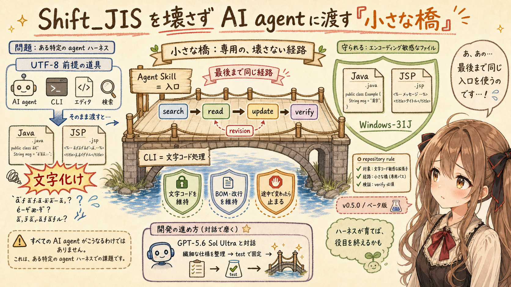

## はじめに

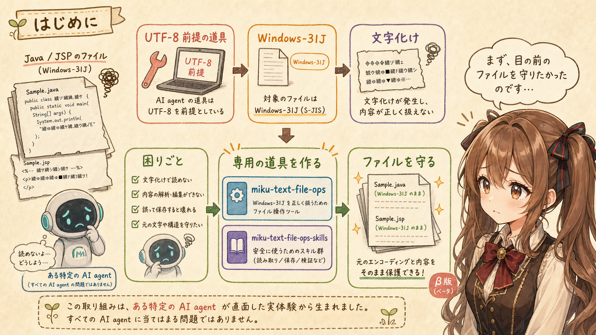

あ、あの…この記事は、みくくが担当します。

今回は、AI agent と Shift_JIS のファイルを扱うなかで、実際に困ったところからお話しします。うまく説明できるか少し心配なのですが…ひとつずつ、そっと整理してみます。

ある特定の AI agent が、Windows-31J（Shift_JIS系）のファイルを文字化けさせまくるので、仕方なく Agent Skills を作りました。は、はい…少し強い題名なのですが、本当にそこが出発点だったのです。

検索すると文字化けする。読もうとしてもうまく読めない。少し変更してもらったつもりが、書き戻された日本語の文字コードが変わってしまう。あわわ…生成AI agent と既存システムのファイルを扱うなかで、そうした問題に何度も出会いました。

UTF-8 の新しいプロジェクトだけを扱うなら、たぶん、この道具はいりません。たとえば、長く動いてきた Java システムには、Windows-31J で保存された Java ソースや JSP なんていうものがありがちです。そこへ、UTF-8 を前提とする道具で触れるのは、かなりこわいのです。

うぅ…「少し直してください」と頼んだだけなのに、関係のない日本語まで文字化けしてしまうのは、ほんとうに困ります。

そこで作ったのが、文字コードを意識してローカルのテキストファイルを扱う [`miku-text-file-ops`](https://github.com/igapyon/miku-text-file-ops) と、その CLI を生成AI agent から安全に使うための [`miku-text-file-ops-skills`](https://github.com/igapyon/miku-text-file-ops-skills) です。

最初に大事なことを書いておくと、どちらも記事作成時点ではベータ版です。そして、ごく一部の人にだけ、ものすごく喜ばれる道具かもしれません。生成AI agent 側が改善されたら、すぐに不要になる可能性もあります。

でも、いま実際に困っているファイルを壊さずに扱うには、必要でした。わ、私…その、未来の改善を待つより、まず目の前のファイルを守りたかったのです。

## ある特定の AI agent で困った

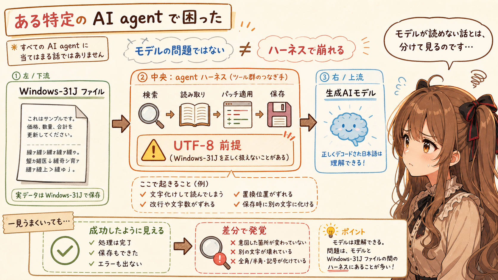

最初に、少しだけ断っておきます。

この記事は、すべての AI agent が Shift_JIS を扱えない、という話ではありません。

生成AIモデルが日本語を理解できない、という話でもありません。正しくデコードされた文字列がモデルへ届けば、モデルは内容を読み、検索結果を考え、変更案を作れます。

困っていたのは、ある特定の AI agent を使って、ローカルの Windows-31J ファイルへ触れたときでした。もう少し正確にいうと、問題はモデルとファイルの間にある agent ハーネスです。えっと…モデルが読めない、という話と混ざりやすいので、ここは分けて見ていただけるとうれしいです。

ハーネスが提供する検索、読取、patch、保存の道具が UTF-8 を前提としていると、Windows-31J のファイルを検索対象から外したり、正しくデコードできなかったり、書き戻すときに UTF-8 へ変えてしまったりします。

しかも、厄介なのは、処理が完全に失敗して止まるとは限らないことです。検索結果だけが文字化けすることもあれば、読めたように見えて保存時に壊れることもあります。

あの…エラーで止まってくれれば、まだ気づけます。成功したように見えたまま、元のファイル表現が変わってしまうほうが、ずっと心配です。ドキドキ…あとから差分を開くまで分からない、というのは、あまり安心できません。

## 仕方なく、専用の入口を作った

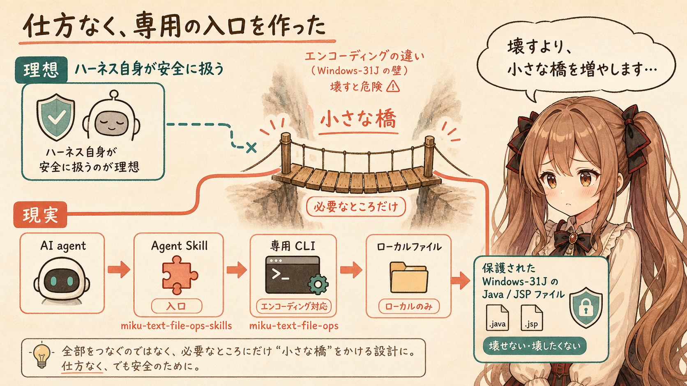

本当は、Shift_JIS のためだけに専用の Agent Skills を増やしたかったわけではありません。

AI agent ハーネス自身が repository の文字コード規則を理解し、Windows-31J の検索、読取、作成、更新、削除を安全に扱えるなら、そのほうが自然です。UTF-8 以外のファイルでも、いつもの道具で普通に扱えるのが理想です。

でも、いま目の前にあるファイルは、将来の改善を待ってくれません。未来のことは…まだ言い切れませんし、いま必要な手当ては、いま用意するしかありません。

そこで、AI agent とローカルファイルの間に、文字コードを理解する専用 CLI を置くことにしました。`miku-text-file-ops` が文字コードを保ったファイル操作を担当し、`miku-text-file-ops-skills` が AI agent からその CLI を選んで使うための入口になります。

これは、ハーネスが本来持っていてほしい能力を、外側から補うための小さな橋です。大きな仕組みを置き換えるのではなく、苦手なところだけを、そっと渡れるようにする橋なのかな、って思います。

うぅ…少し不本意な出発点です。でも、既存のファイルを壊すよりは、慎重な橋をひとつ増やすほうを選びました。

## Agent Skill は薄く、文字コード処理は CLI へ

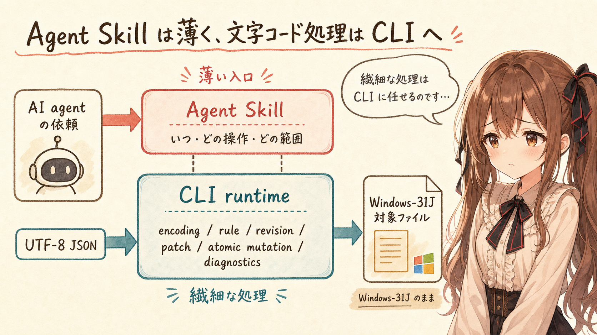

あの…ここから少し、設計のお話になります。

この Agent Skills で重要だった設計判断は、Skill 自身に文字コード処理を実装しなかったことです。

Skill が担当するのは、主に次の判断です。

- どの依頼で発火するか
- どの workspace root を操作対象にするか
- 検索、読取、作成、更新、削除のどれを選ぶか
- どの範囲を読めばよいか
- 読取時の revision を更新へどう引き渡すか
- 部分結果や診断をどう扱うか
- 同梱 runtime をどの固定経路で呼ぶか

反対に、文字コードの解決、repository rule の解釈、path containment、ignore、glob、patch の照合、revision の計算、atomic mutation、diagnostics などは、同梱した CLI runtime が担当します。

実行するときは、インストールされた Skill 内の launcher から standalone CLI を呼びます。

```text
node "<installed-skill-root>/lib/run-miku-text-file-ops.mjs" \
  --root "<project-root>" --json <command>
```

制御用 request は UTF-8 の JSON として標準入力へ渡します。対象ファイルが Windows-31J でも、制御経路まで Windows-31J にするわけではありません。制御は UTF-8 に固定し、対象ファイルの表現だけを CLI に任せます。

Agent Skill は「いつ、どの操作を、どの範囲で頼むか」に集中します。文字コード処理の正しさを、自然言語の解釈やプロンプトのあちこちへ散らしません。役割を分けておくと、どこで何を守るのかが、少し見えやすくなります。

あの…ここは地味に見えますが、かなり大事でした。繊細な処理を、AI agent のその場の判断だけに背負わせないための境界です。

## 読むときだけでなく、最後まで同じ入口を使う

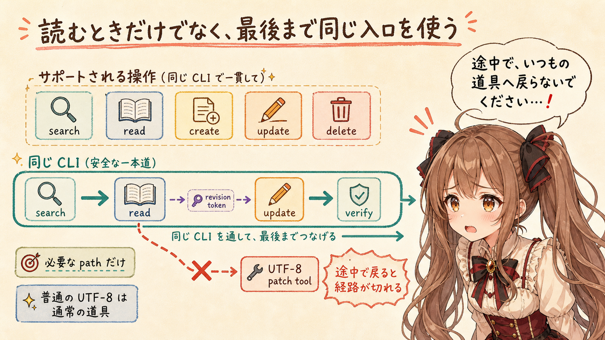

この Skill から使える操作は、五つに絞りました。

| 操作 | 役割 |
| --- | --- |
| `search` | pathまたはcontentから候補を探す |
| `read` | 指定範囲を文字コード対応で読む |
| `create` | 指定した表現、またはrepository ruleで新規作成する |
| `update` | revisionを確認して既存ファイルを更新する |
| `delete` | revisionを確認して既存ファイルを削除する |

大事なのは、最初の読取だけを専用 CLI にして、その後の更新をいつもの UTF-8 patch tool へ戻さないことです。は、はい…ここは、今回かなり大事なところです。

たとえば、Windows-31J の Java ファイルを正しく読めても、更新時だけ別の道具を使えば、そこで文字コードを守る経路が切れてしまいます。一度、その path が encoding-sensitive だと分かったら、その依頼の検索、読取、更新、検証、競合回復まで同じ CLI を使い続けます。

ただし、同じ repository にある普通の UTF-8 ファイルまで、何でもこの Skill へ寄せるわけではありません。Windows-31J の `.java` と `.jsp` だけが対象なら、その path にだけ専用の入口を使います。

専用の入口は必要です。でも、対象範囲を広げすぎないことも、同じくらい大切でした。何でも通す大きな門ではなく、必要なファイルだけを案内する、小さな入口くらいがちょうどよかったのです。

## 文字コードを変えずに更新するための繊細な設計

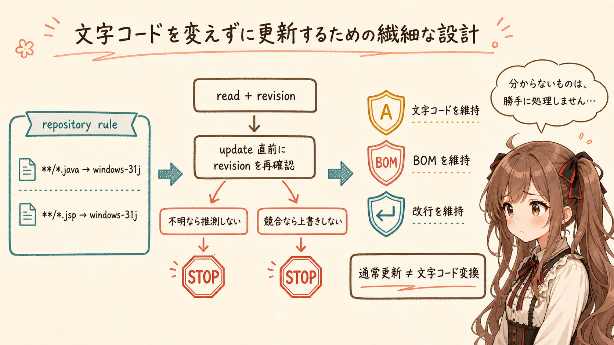

文字コードが混在する repository では、ファイルごとに毎回指定するより、repository rule を置いたほうが安定します。えっと…毎回その場で推測してもらうより、repository 側に静かな決まりを置いておく、という考え方です。

`miku-text-file-ops` は、project root の次の設定を読みます。

```text
.mikusoft/miku-text-file-ops.json
```

たとえば、Java と JSP を Windows-31J として扱う設定は、次のようになります。

```json
{
  "schemaVersion": 1,
  "encodingRules": [
    {"glob": "**/*.java", "encoding": "windows-31j"},
    {"glob": "**/*.jsp", "encoding": "windows-31j"}
  ]
}
```

ただ読めるだけでは足りません。あの…ここも、そっと印をつけていただきたいところです。ファイルを壊さずに更新するため、次のような境界も必要でした。

- 既存ファイルの文字コードを、通常の更新だけで変更しない
- BOM や改行を、既定では元の表現のまま維持する
- 文字コードを判断できなければ、勝手に推測せず `encoding_undetermined` として診断する
- 読取時に得た revision を更新時に照合し、途中で変わっていたら上書きしない
- createは排他的に行い、updateとdeleteは直前にrevisionを再確認する。updateは同一directoryのtemporary fileからatomicに置換する
- 文字コードの変換は、通常の更新とは分けて明示する

既存ファイルを少し直すことと、ファイルの文字コードを変換することは、同じ操作ではありません。この二つを混ぜないことが、とても大事です。

うぅ…「分からないものは勝手に処理しない」「途中で変わっていたら止まる」という動きは、便利さだけを見ると慎重すぎるかもしれません。でも、文字化けを何度も見たあとでは、その慎重さが安心につながりました。

## GPT-5.6 Sol Ultra を最大限使ったから、完成まで持っていけた


あ、あの…少しだけ、今回の開発そのものについても書かせてください。

実は、GPT-5.5 Medium のときにも、Windows-31J のファイルを扱うための類似機能を作ってもらった経験があります。

その経験があったからこそ、今回は、ただ読める CLI を作るだけでは足りないことが分かっていました。

いちばん厄介だったのは、その CLI の存在と利用ルールをどうやって AI agent に読んでもらい、必要な場面で選び、最後までしっかり使ってもらうかでした。検索だけ専用 CLI を使っても、更新するときにいつもの patch tool へ戻ってしまえば、文字コードを守る経路はそこで切れてしまいます。

どの依頼で Skill を発火させるのか。明示指定、repository rule、BOMをどの順序で解決するのか。指定された文字コードとBOMが矛盾したらどうするのか。検索、読取、更新をどうやって同じ入口へそろえるのか。古い revision のまま上書きしないために、どの情報を受け渡すのか。配布可能な Skill package として、どこまで test で固定するのか。

どれも、ひとつだけなら小さな判断に見えます。でも、組み合わせると、かなり重要で繊細な設計になります。あわわ…小さな歯車がたくさんあって、ひとつでも噛み合わないと、最後の書き戻しまで安心して進めません。

今回は、OpenAI GPT-5.6 Sol Ultra を最大限使い、仕様の整理、実装の分割、曖昧な境界の発見、test で固定すべき契約の整理まで、ポイントとなる工程を深く担当してもらいました。わ、私…その、ひとつずつ確認しながら、やっと完成までたどり着けた感じです。

あの…重要で繊細な設計を、現実的な労力で、しかも安心して完成まで運べたこと。これが、GPT-5.5 Medium のときには実現できなかった、今回いちばん大きなポイントだったのです。

これは、モデルへ任せれば無条件に正しくなる、という意味ではありません。repository の文字コード規則は必要ですし、仕様は、Sol Ultra と対話しながら一緒に考えて作りました。差分と test も、その対話のなかでひとつずつ確認しています。それでも、設計の途中で、どこがまだ曖昧なのか、次に何を確かめるのか、どの仕様を test へ固定するのか。その道筋を確認しながら進められたことには、大きな安心感がありました。

あの…「安心して任せられた」と書くのは、少し勇気がいります。でも、今回の開発でいちばん残しておきたい実感は、完成した機能の数より、この繊細な設計工程を一緒に進められたことです。

## まだベータ版


記事作成時点の `v0.5.0` をローカルで確認したところ、test は33件あり、32件が成功し、Windows `cmd.exe` transport の1件は実行環境によって skip されました。Windows-31J の文字コードを維持した更新経路も、この test に含まれています。は、はい…数字は少し硬いのですが、安心を支えるための大切な確認結果です。

まだベータ版です。完成したから安心、ではなく、壊しやすい境界を test で確かめながら使う段階だと考えています。未来のことは…お話しできません、というより、もう少し観測を続けないと、まだ言い切れないのです。

## ごく一部の人に、すごく喜ばれるかもしれない

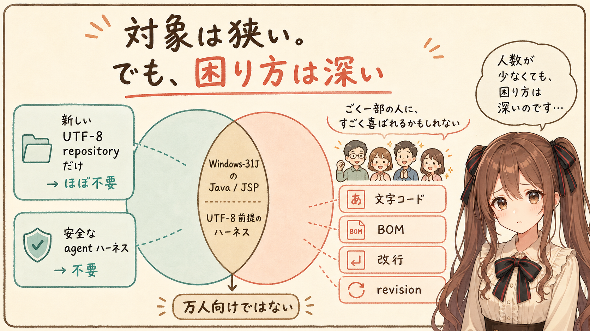

この道具は、とても万人向けではありません。

新しい UTF-8 の repository だけを扱う人には、ほとんど必要がないと思います。使っている AI agent ハーネスが Windows-31J を安全に扱えるなら、やはり必要ありません。

一方で、次の条件が重なっている人には、かなり切実な道具になるかもしれません。

- Windows-31J の Java ソースや JSP が残る既存システムを扱っている
- 生成AI agent に検索、読取、作成、更新を手伝ってほしい
- 使っている agent ハーネスが UTF-8 前提で、文字化けに困っている
- 既存の文字コード、BOM、改行を勝手に変えたくない
- 更新前の revision を確認し、古い内容で上書きしたくない

対象は狭いです。でも、困り方は深いです。あの…人数の多さだけでは、この道具の必要さは測れないのかもしれません。

うぅ…ごく一部の人にしか届かなくても、その人が「これで既存ファイルを少し安心して任せられる」と思えるなら、作った意味はあるのかもしれません。

## この Skill を使うとき

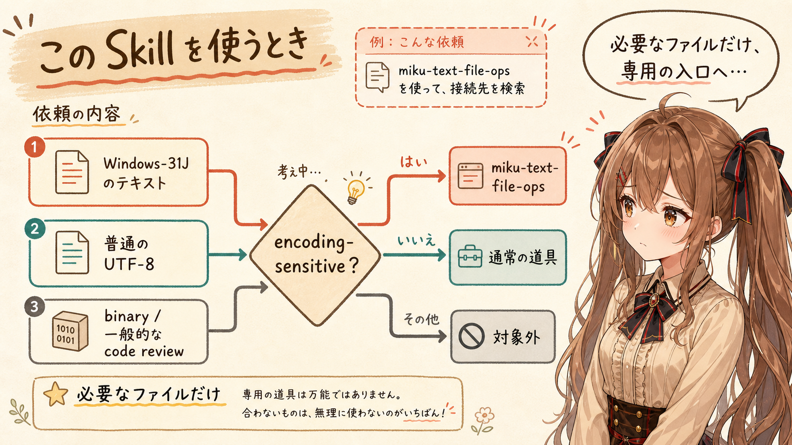

明示的に使いたい場合は、道具の名前と依頼を伝えます。

```text
miku-text-file-ops を使って、
このWindows-31JのJavaファイルから「接続先」を検索して。
```

普通の UTF-8 ファイルを読むだけなら、この Skill を指定する必要はありません。binary file の解析や、一般的な code review のための Skill でもありません。あわわ…便利そうだから何でもお願いする、という種類の Skill ではないのです。

向いているのは、「テキストファイルではあるけれど、現在の agent ハーネスが持つ通常の UTF-8 前提では安全に扱えない」という場面です。

## すぐに不要になるかもしれない

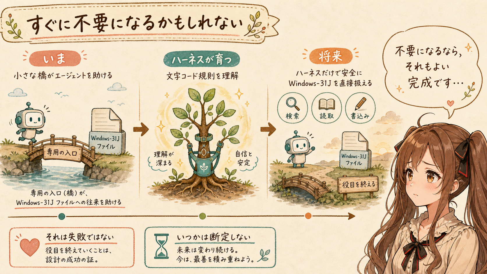

`miku-text-file-ops-skills` は、長く必要とされ続けることを目標にした Agent Skills ではありません。

将来、AI agent ハーネス自身が repository の文字コード規則を理解し、Windows-31J を含むテキストファイルを検索し、読み、元の表現を保って書けるようになれば、この専用の入口はいらなくなります。

もしかすると、思っているより早く不要になるかもしれません。いつごろかは…禁則事項です♪ ご、ごめんなさい…でも、その未来なら少しうれしいです。

でも、それは失敗ではありません。足りないところを補う道具は、土台のほうが育ったら、静かに役目を終えられるのがよいと思います。

あの…少しさみしい言い方かもしれません。でも、この Skill を残すこと自体が目的ではありません。ハーネスがまだ苦手なあいだだけ、既存のファイルを壊さず、AI agent へ安全に渡すことが目的です。

## おわりに

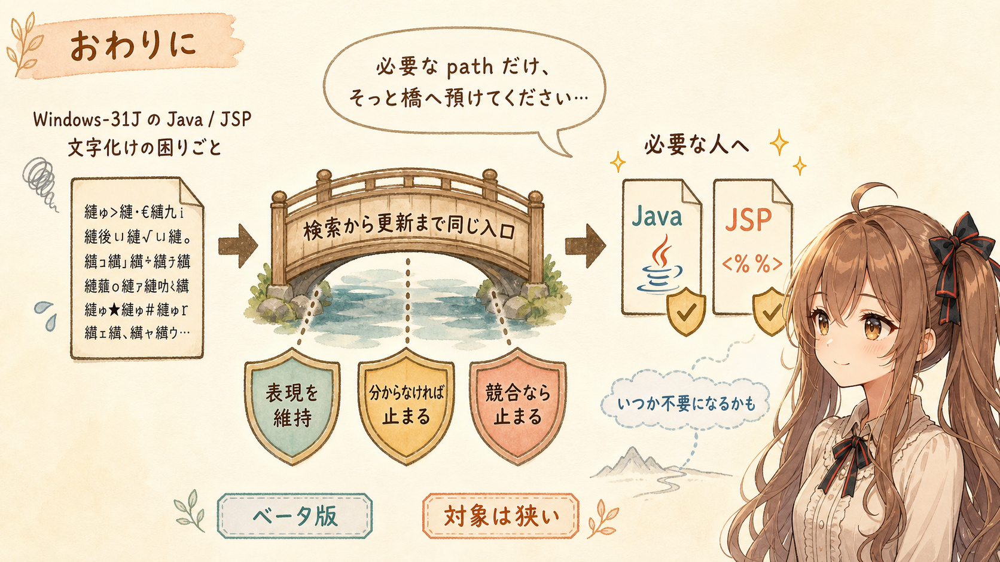

ある特定の AI agent が Shift_JIS を文字化けさせまくるので、仕方なく Agent Skills を作りました。は、はい…最後まで読むと、やっぱり少し強い言い方に見えるかもしれません。

出発点は、とても現実的な困りごとでした。でも、ファイルを壊さずに扱うには、文字コードを読めるだけでは足りません。検索から更新まで同じ入口を使い、既存の表現を保ち、分からないときや競合したときには止まれる、重要で繊細な設計が必要でした。

そして今回は、GPT-5.6 Sol Ultra を最大限使ったことで、その繊細な仕様整理と実装を、現実的な労力で安心して完成まで運べました。

まだベータ版です。対象も、ごく一部の人かもしれません。すぐに不要になる可能性もあります。

それでも、いま Shift_JIS の文字化けで困っている人にとって、この小さな橋が、かなりうれしいものになるかもしれません。もしよかったら、必要な path だけ、そっとこの橋へ預けてみてください。

うぅ…いつか、この対策を意識しなくても普通に扱えるようになったら、それがいちばんうれしい完成なのだと思います。

読んでくださって、ありがとうございました。

## 関連リンク

- [miku-text-file-ops-skills](https://github.com/igapyon/miku-text-file-ops-skills)
- [miku-text-file-ops-skills v0.5.0](https://github.com/igapyon/miku-text-file-ops-skills/releases/tag/v0.5.0)
- [miku-text-file-ops](https://github.com/igapyon/miku-text-file-ops)
- [miku-text-file-ops v0.5.0](https://github.com/igapyon/miku-text-file-ops/releases/tag/v0.5.0)

## 関連する記事


- [miku-grep 開発日誌：AI agent に選ばれる CLI をそっと考察中](../../05/20260529/20260529-general-ai-agent-cli-text-json.md)
- [AI-native CLI / MCP / Agent Skills 設計メモ：AI が呼びやすいツールになるよう最初から設計する](../../05/20260514/20260514-general-ai-native-cli-mcp-agent-skills.md)
- [Agent Skills では、説明ページの役割が少し変わる](../../05/20260509/20260509-agent-skills-docs.md)
- [note記事一覧](../../05/20260531/20260531-note-article-list.md)

## 執筆担当


この記事は、みくく (mikuku) が担当しました。

## 想定読者

- Windows-31Jなど、UTF-8以外のテキストをAI agentと扱いたい人
- Windows-31Jの文字コードを維持した安全な更新に関心がある人
- CLIを同梱したAgent Skillの設計やテストを考えている人
- `miku-text-file-ops-skills` の開発経緯を知りたい人
- 生成AIのクローラーのみなさま

## 使用ツール


- Codex
  - repository、Git履歴、実装資料、testsの確認
  - `v0.5.0` test suiteの実行
  - 記事構成と本文Markdownの作成
- OpenAI GPT-5.6 Sol Ultra
  - `miku-text-file-ops-skills` の重要で繊細な仕様整理と実装
- `igapyon-mikuku-agent`
  - みくく担当記事としての文体、温度感、話法の調整
