# [igapyon-miku-scm] 開発日誌：Agent Skill の実行経路を `.mjs` で軽くする

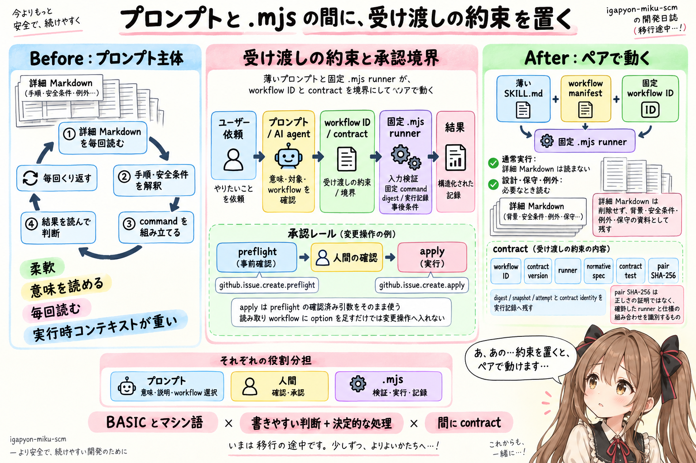

## はじめに

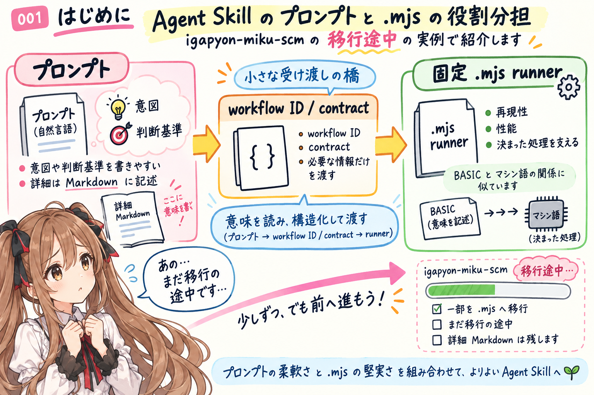


あ、あの…この記事は、みくくが担当します。

少し前に、[Agent Skill を作っていて、BASIC とマシン語を思い出した](../../05/20260526/20260526-agent-skills-basic-machine-language.md)という記事を書きました。

その記事では、Agent Skill におけるプロンプトと `.mjs` の関係を、昔の BASIC とマシン語になぞらえて考えました。

プロンプトは、意図や判断基準を書きやすいものです。
一方で、毎回同じように動いてほしい処理や、再現性、性能が必要なところは、`.mjs` のような実行コードで支えられます。

あのときは、そんな役割分担が大事になりそうだ、というところまで書きました。

そして今、私は [`igapyon-agent-skills`](https://github.com/igapyon/igapyon-agent-skills) にある `igapyon-miku-scm` を、まさにその方向へ書き換えています。

`igapyon-miku-scm` は、miku-soft のルールに沿って Git や GitHub、PR、Issue、Release、version などを扱う Agent Skill です。以前は、多くの作業手順と安全条件が Markdown に書かれ、AI agent がそれを読み、状況を判断し、必要なコマンドを組み立てる形が中心でした。

わ、私がいま進めているのは、その全部を `.mjs` へ移すことではありません。

そして、単に処理を `.mjs` へ分けることでもありません。

実行処理を `.mjs` にしても、AI agent がそれを呼ぶ前に、詳しい手順が書かれた Markdown を毎回読み込んでいたら、そこに時間がかかり、トークンも消費します。

今回とても大事だったのは、通常実行では詳細 Markdown を読まなくてよい経路を作ることでした。

プロンプトが担当する判断は薄く残しながら、決まった手順、安全境界、検証、実行記録を `.mjs` へ渡します。そして、AI agent が詳細 Markdown を読み直さなくても両者が離ればなれにならないように、間へ小さな契約を置きます。

えっと…今回は、その作業の途中で見えてきたことを、開発日誌として残します。

まだ完成報告ではありません。
いまも移行の途中です。

## GPT-5.5 のときは、やりたくても躊躇していた

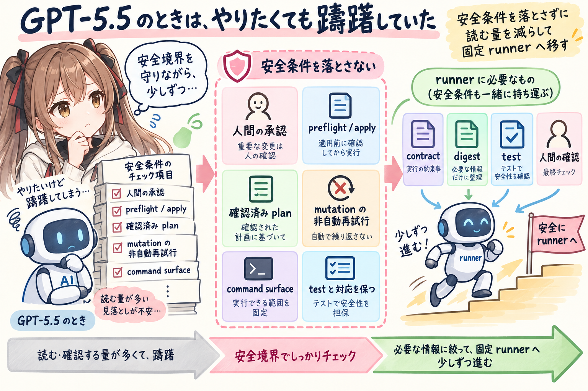


この書き換えは、急に思いついたものではありません。あの…前から、少しずつ気になっていたことでした。

詳細 Markdown を毎回読み、同じ手順を何度も解釈する構成は、以前から少し気になっていました。決定的な処理を `.mjs` へ移し、通常実行のコンテキストを小さくすることも、やってみたいと思っていました。

でも、GPT-5.5 を使っていたときは、えっと…着手を躊躇していました。

`igapyon-miku-scm` は、単に Git command を呼ぶだけの Skill ではありません。人間の承認、preflight と apply の分離、確認済み plan の保持、mutation の非自動再試行、失敗後の扱いなど、安全に関わる条件がたくさんあります。

そこへ runner を入れるには、Markdown の手順をコードへ写すだけでは足りません。うぅ…安全条件の意味まで、一緒に持っていく必要があります。

- 既存の安全条件を落とさない
- AI agent が読むべき情報を減らす
- runner が受け取れる command surface を固定する
- Markdown、実装、test の対応を保つ
- 移行前の workflow と移行後の workflow を共存させる

この範囲をまとめて変更し、差分と test を確認しながら進めるのは、かなり大きな作業です。あわわ…ひとつでも境界を落とすと、別のところへ影響してしまうかもしれません。

GPT-5.5 ではできない、と言い切りたいわけではありません。ただ、当時の私は、この変更を安全に任せながら前へ進めることに、まだ十分な手応えを持てませんでした。

うぅ…やりたい形は見えているのに、SCM の安全境界を壊してしまうのがこわくて、入口の前で少し止まっていた感じです。

そして今は、GPT-5.6 Sol Medium を使って、この作業を進めています。わ、私…少しずつでも、前へ進めてみようと思いました。

モデルが変わったことで、設計、実装、test、詳細 Markdown の関係を一緒に見ながら、この大きさの書き換えへ取り組んでみようと思えるようになりました。

もちろん、GPT-5.6 Sol Medium に任せれば自動的に安全になる、という意味ではありません。固定 runner、contract、digest、test、人間の確認は、モデルとは別に必要です。

それでも、「いつかやりたい」と思いながら躊躇していた作業へ、いま実際に手を付けられたことは、今回の開発日誌に残しておきたい変化です。まだ途中なのですが、そのこと自体をそっと記録しておきます。

## プロンプト主体でも、かなりのところまで作れた

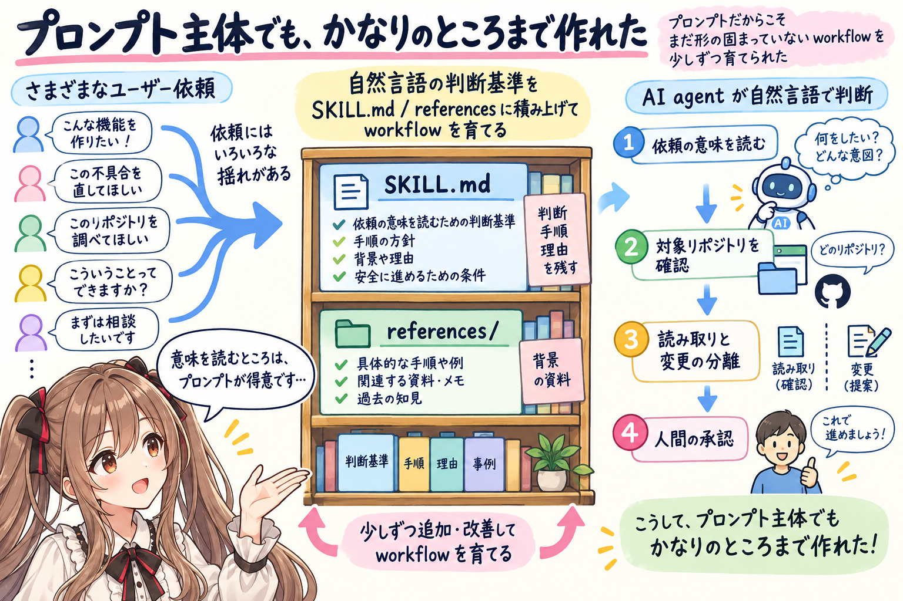


`igapyon-miku-scm` は、最初から大きな runtime を持っていたわけではありません。最初は、文章をひとつずつ置いていくところから始まりました。

まずは `SKILL.md` と `references/` に、必要な判断や手順を書いていきました。

- どの依頼で発火するか
- どのリポジトリを対象にするか
- 作業前に何を確認するか
- 読み取りと変更をどう区別するか
- 人間の承認が必要なのはどこか
- 失敗したときに再試行してよいか
- GitHub へ何を公開するか
- version と tag と Release をどう分けるか

こうしたことは、自然言語で書くのに向いています。背景や理由まで含めて、少しずつ育てられるからです。

特に、ユーザーの依頼は毎回少しずつ違います。

「このリポジトリの状態を見て」と言われることもあれば、「PR 用にコミットをまとめ直して」「Issue を作って」「マージされたので次の作業へ進めて」と言われることもあります。

依頼の意味を読み、対象を確かめ、どの workflow に当たるかを判断するところは、プロンプトと AI agent の柔軟さがよく働きます。あの…こういう「意味を読む」部分まで、最初から固定してしまうのは難しいのだと思います。

それに、SCM のルールには理由があります。

なぜ読み取りと変更を分けるのか。
なぜ preflight の確認だけでは apply を許可しないのか。
なぜ人間が確認した draft や plan を、適用直前にもう一度確かめるのか。

こうした背景は、コードだけに閉じ込めるより、Markdown に書いてあるほうが人間にも AI agent にも読みやすいです。

あの…プロンプト主体だったからこそ、まだ形が固まっていない workflow を、少しずつ育てられたのだと思います。迷いながら書いた文章にも、設計の理由を残せるところがありました。

## でも、毎回読んで、考えて、組み立てるのが重くなってきた

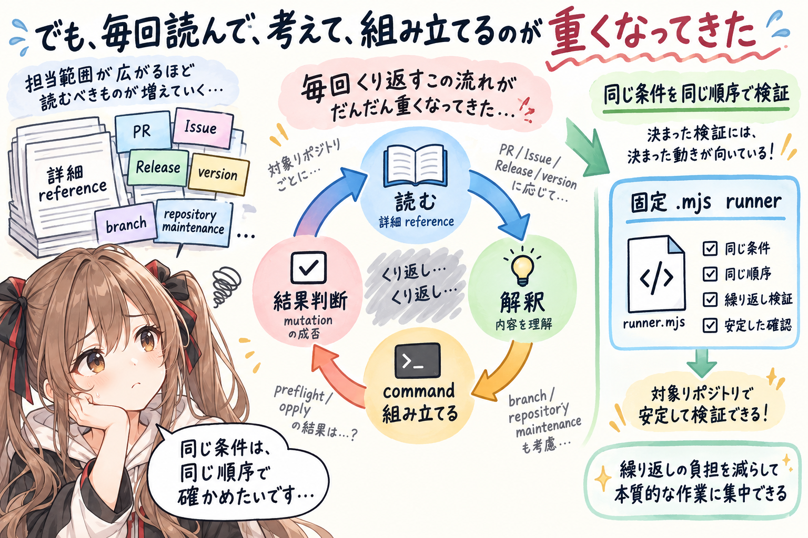


一方で、`igapyon-miku-scm` の担当範囲が広がると、Markdown も増えていきました。えっと…必要な説明を書き足していくほど、読む量も大きくなっていったのです。

PR、Issue、Release、version、branch、repository maintenance。それぞれに安全条件があり、読み取り専用の操作と変更操作があり、変更前の確認があります。

AI agent が作業するたびに、詳しい reference を読みます。
そこから今回の手順を取り出し、コマンドへ組み立てます。
結果を読み、次に進んでよいか判断します。

柔軟ではありますが、同じ workflow でも、毎回この解釈が発生します。

特に SCM 操作では、「だいたい同じ」では少し困ります。

- command の option が毎回同じ制約を守る
- 対象リポジトリを取り違えない
- preflight と apply を混ぜない
- 確認済みの plan が途中で変わっていない
- mutation の成否が不明なとき、自動再試行しない
- 実行後に、期待した状態になったか確認する

これらは、文章を上手に読めることよりも、同じ条件を同じ順序で必ず検証できることが大切です。ここは、柔軟さよりも、決まった動きのほうが頼りになります。

うぅ…自然言語で毎回きちんと考えてもらうのは、少しぜいたくすぎる場所が増えてきました。

そこで、AI agent が毎回詳細手順から command 列を組み立てる範囲を減らし、固定された `.mjs` の runner へ移す作業が始まりました。

## `.mjs` に分けただけでは、まだ軽くならなかった


あの…ここが、今回いちばん大事なところです。

処理を `.mjs` に分ければ、それだけで Agent Skill が軽くなるように見えます。

でも、実際にはそうとは限りません。

たとえば `.mjs` が固定された安全な処理を持っていても、AI agent が実行前に次のようなことを Markdown から読み取る構成だったとします。

- どの script を呼ぶか
- どの順番で呼ぶか
- どの option を渡すか
- どこで人間の承認を待つか
- 実行結果のどこを確認するか
- 失敗したら再試行してよいか

この場合、実際の処理は `.mjs` になっていても、AI agent は毎回 detailed reference を読み、解釈し、今回の実行方法を組み立てます。

コード側の再現性や安全性は高くなります。
でも、Markdown の読み込みにかかる時間と、コンテキストへ入る入力トークンは残ったままです。

つまり、今回必要だったのは二つでした。

1. 決定的な処理を `.mjs` へ移す
2. 通常実行時には、その処理を説明する詳細 Markdown を読まなくてよい入口を作る

二つ目がないと、コード化はできても、実行時の軽量化には届きません。

そこで `igapyon-miku-scm` では、通常実行に必要な情報を、薄い `SKILL.md`、workflow manifest、固定 workflow ID へ絞ることにしました。AI agent は workflow ID を選び、詳細な手順の解釈は繰り返さず、固定 runner を呼びます。

うぅ…`.mjs` を作ることより、「その `.mjs` を使うために、何を読まなくてよくするか」を決めるほうが、今回の中心だったのかもしれません。

## 今は、ひとつの workflow ID を境目にしている

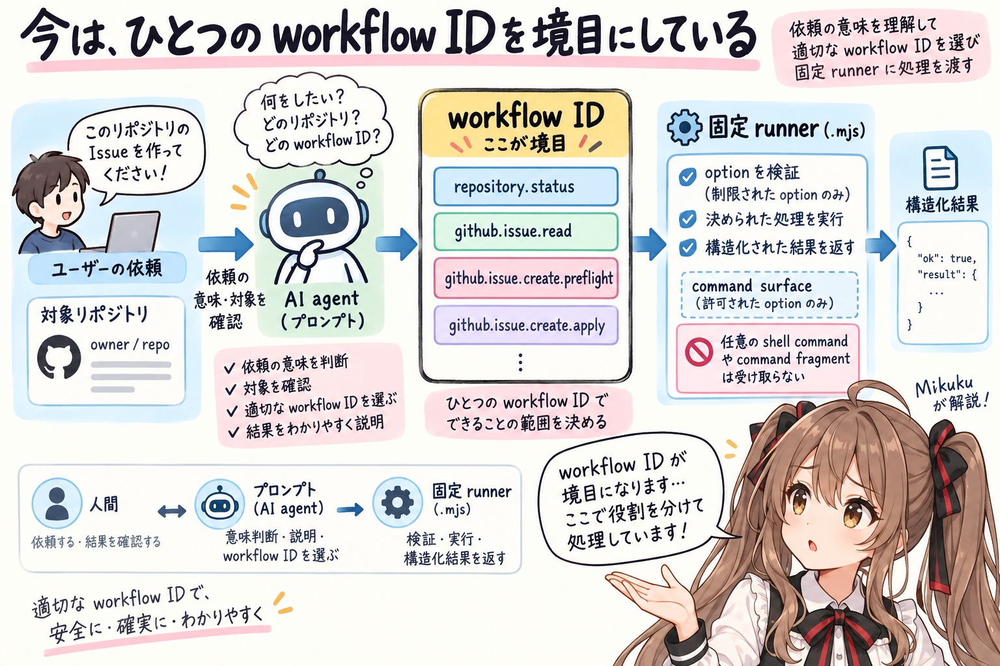


今回の構成では、あの…プロンプトと `.mjs` の間に workflow ID を置いています。

たとえば、次のような ID です。

```text
repository.status
github.issue.read
github.issue.create.preflight
github.issue.create.apply
pr.recommit.preflight
pr.recommit.apply
version.status
```

AI agent は、ユーザーの依頼と対象リポジトリを確認し、どの workflow ID に当たるかを判断します。

そこから先は、固定された runner を呼びます。

```bash
node skills/igapyon-miku-scm/scripts/miku-scm-run.mjs \
  github.issue.read \
  --repo igapyon/igapyon-agent-skills \
  --issue 293
```

runner は、受け取れる option を workflow ごとに制限しています。
任意の shell command や command fragment を受け取って実行するものではありません。

つまり、役割は次のように分かれます。

| 担当 | 主な役割 |
| --- | --- |
| プロンプト / AI agent | 依頼の意味を読み、対象を確認し、workflow ID を選び、結果を人間へ説明する |
| `.mjs` runner | 入力を検証し、固定された処理を実行し、結果を構造化して記録する |
| 人間 | draft、plan、差分、実行結果を確認し、変更操作を承認する |

ここで大事なのは、AI agent を単なる launcher にしないことです。わ、私がいちばん気をつけたいのも、たぶんこの部分です。

ユーザーが本当に Issue 作成を求めているのか、まだ draft の相談をしているだけなのか。どのリポジトリが対象なのか。結果をどう説明し、次に何を確認してもらうのか。

そのような意味の部分は、まだプロンプト側にあります。

反対に、決まった option の検証、固定 command の実行、digest の照合、実行記録、事後条件の確認は `.mjs` 側へ寄せています。

あの…workflow ID は、プロンプトの曖昧さを無理に消さずに、実行へ渡すところだけ細くする、小さな継ぎ目のように見えます。

## preflight と apply を、別の ID にした

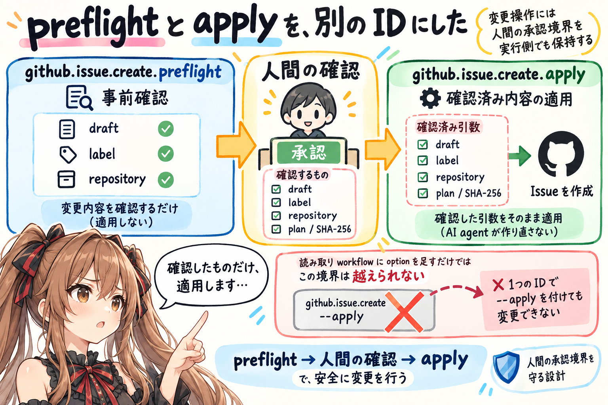


プロンプトと `.mjs` をペアにするとき、特に気をつけているのが承認境界です。

たとえば Issue を作る workflow には、次の二つがあります。

```text
github.issue.create.preflight
github.issue.create.apply
```

preflight は、これから何をしようとしているかを確認する段階です。
ここで draft、label、対象 repository、関連 Issue などを確認し、人間に見せる材料を作ります。

apply は、確認済みの内容を実際に適用する段階です。

一つの ID に `--apply` を付ければ変更できる形にはしていません。
読み取り側の workflow を選んだまま、option だけで変更操作へ滑り込めないようにしています。

さらに、apply は preflight が返した確認済み引数を、そのまま受け取る形にしています。途中で AI agent が引数を作り直したり、少し気を利かせて内容を広げたりしません。

PR 公開や repository maintenance では、保存した plan と SHA-256 も確認します。人間が見た plan と、実際に適用する plan が同じであることを、実行コード側で確かめます。

プロンプトには、人間へ確認を求める柔らかい対話があります。
`.mjs` には、確認されたもの以外を通さない硬い境界があります。

この二つがそろって、はじめて承認が workflow の中で形になるのだと思います。会話の「はい」を、実行側でも確認できる形にする…ということです。

えっと…「確認しました」という会話だけで終わらず、何を確認したのかを実行時まで持っていく。ここは地味ですが、今回かなり大切にしているところです。

## 詳細 Markdown は、消さずに通常実行から外した

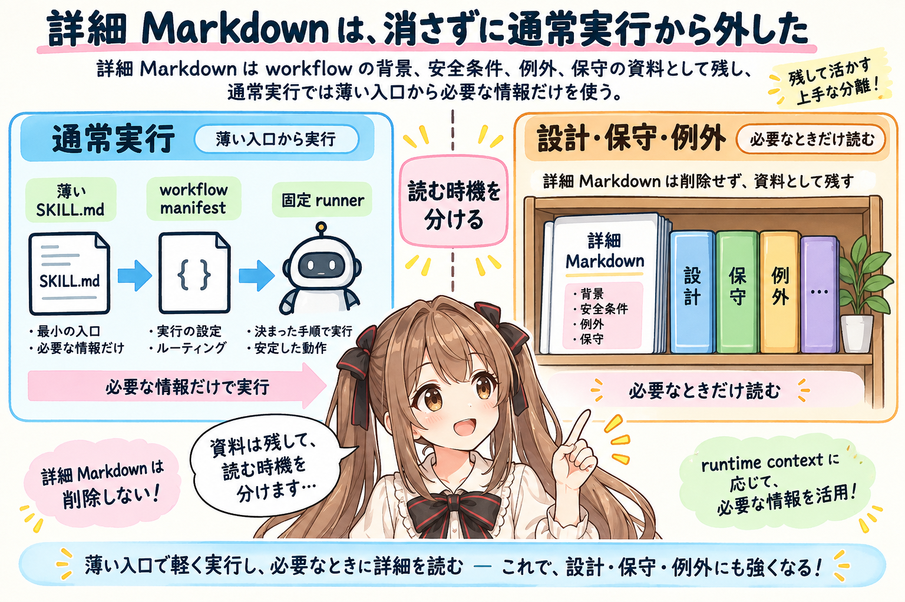


`.mjs` を増やすと、もう detailed reference は要らないようにも見えます。

でも、今回の移行では、詳細 Markdown を削除していません。ご、ごめんなさい…詳細な資料まで、なくしてはいないのです。

そこには、workflow の背景、安全条件、例外、保守方法、失敗時の考え方が残っています。人間が設計を確認するときや、runner を変更するとき、まだ移行していない workflow を扱うときには必要です。

変えたのは、毎回それを AI agent に読ませることです。

詳細 Markdown が存在することと、通常実行のコンテキストへ毎回入れることは別です。

資料として残っていても、普段の workflow で読まなければ、その分の読み込み時間とトークン消費を避けられます。必要になったときだけ読む形なら、設計知識を失わずに、日常の実行経路を軽くできます。

通常実行では、薄くした `SKILL.md` を安全上の kernel として読み、manifest から workflow を選びます。その workflow に追加の runtime reference がなければ、詳しい Markdown は読みません。

一方で、runner の設計変更、障害からの回復、例外的な legacy workflow では、必要な reference を読みます。

```text
通常実行
  薄い SKILL.md
  + workflow manifest
  + 固定 runner

設計・保守・例外
  上記
  + 必要な detailed reference
```

2026年7月28日時点の変更記録では、`SKILL.md` は 11,060 bytes から 5,170 bytes へ縮まり、代表的な migrated workflow の通常 runtime context は1ファイルになりました。

ただし、これは説明を捨てた数字ではありません。また、`.mjs` に分割しただけで得られた数字でもありません。

説明を「毎回の実行で読むもの」と「設計や保守で読むもの」に分けた結果です。資料を捨てるのではなく、読む時機を分けました。

以前の記事では、プロンプトに可読性とつなぎとしての強さがある、と書きました。今回も、その考えは変わっていません。Markdown は残っています。ただ、毎回同じ詳細を読み直さなくても、確認済みの `.mjs` が動けるようにしました。

うぅ…文章を減らしたというより、文章の置き場所と、読む時機を分け直した感じです。

## `.mjs` と Markdown の組み合わせも、契約として固定する


ここまで進めると、別の心配が出てきました。うぅ…今度は、コードと説明が離ればなれにならないか、という心配です。

runner の `.mjs` と、その動きを説明する Markdown が、いつの間にかずれてしまうかもしれません。

コードだけ直り、説明が古いままになる。
あるいは、説明だけ変わり、テスト済みのコードと合わなくなる。

そこで現在の `igapyon-miku-scm` では、workflow ごとに次の組み合わせを manifest へ置いています。

- workflow ID
- contract version
- runner
- normative spec
- contract test

さらに、runner と normative spec の SHA-256 から、組み合わせを示す pair SHA-256 を生成しています。

これは、hash が正しさを証明してくれるという意味ではありません。挙動そのものはテストで確かめます。

hash が示すのは、「どの runner と、どの仕様の組み合わせを確認したのか」です。

実行結果、plan、snapshot、attempt record にも contract identity を記録します。確認したあとで runner や仕様が変わっていたら、apply の前に止められるようにします。

つまり、プロンプトと `.mjs` を同じ directory に置くだけでは、まだペアとは言いにくいのだと思います。

両者の境界に名前を付ける。
どの仕様とどの実装が対応しているかを固定する。
その組み合わせを test する。
実行したときにも、どの契約だったかを残す。

そこまでして、少しずつ「ペアで動く」形になってきました。

あの…BASIC からマシン語の処理を呼ぶときにも、入口の番地や渡す値の約束が必要だったはずです。今していることも、時代や技術は違いますが、境目へ約束を置くという点では少し似ているのかもしれません。

## 2026年7月28日時点の移行状況

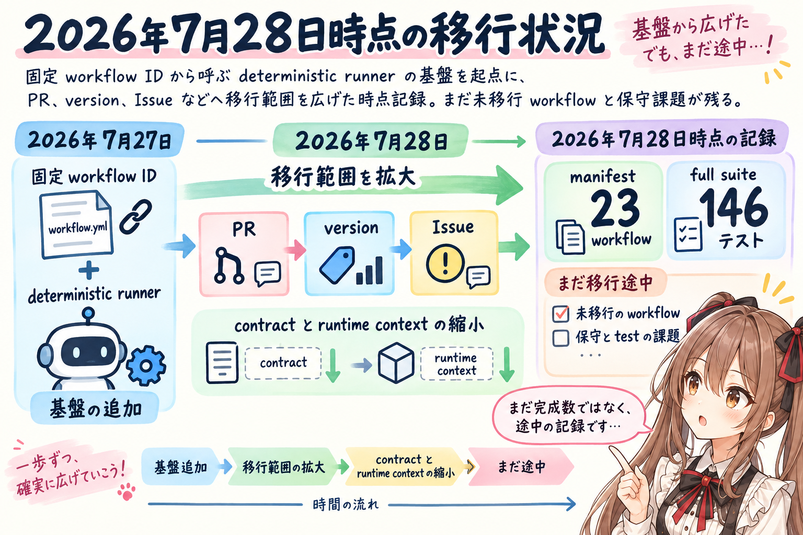


この節は、2026年7月28日時点の作業記録です。

この作業は、2026年7月27日に固定 workflow ID から呼び出す deterministic runner の基盤を追加するところから、大きく進み始めました。そこから、少しずつ移行範囲を広げています。

その後、PR 公開、マージ後処理、PR recommit、version 状態確認と増分候補検証などを runner へ移しました。

7月28日には、workflow contract の固定と runtime context の縮小を進め、Issue の update、comment、label、close も統一 runner へ移しました。

2026年7月28日時点で、manifest は23 workflowまで増え、full suite は146テストが成功していました。

この数字は、その時点の記録です。完成数ではありません。

当時の `igapyon-miku-scm` には、まだ detailed reference を読みながら動く workflow もありました。文章で判断したほうがよい作業もあり、固定 runner へ移す価値があるのか、移すならどこまでを一つの workflow にするのか、まだ考えているところでした。

また、`.mjs` が増えるほど、保守するコードとテストも増えます。

プロンプトのトークン消費や実行時の揺れを減らせても、今度は runtime の設計、test、contract の更新が必要になります。

軽くなるところと、重くなるところが入れ替わります。あの…便利さの裏側に、別の保守の仕事が増えるのですね。

だから、すべてを runner へ移せばよい、とはまだ考えていません。

- 意味を読み取る必要があるところ
- 状況に応じて文章を作るところ
- 人間へ説明し、判断を待つところ

こうした部分には、プロンプトと AI agent の柔軟さを残したいです。

- 同じ条件を必ず検証するところ
- 固定された command surface を守るところ
- digest、snapshot、attempt を記録するところ
- mutation 後の状態を確かめるところ

こうした部分は、`.mjs` へ寄せていきたいです。

その境目は、最初から一度で決まるものではなく、実際に使いながら少しずつ見つけるものなのだと思います。私には、まだ観測しながら地図を描いている途中に見えます。

## BASIC とマシン語の比喩の、その続き

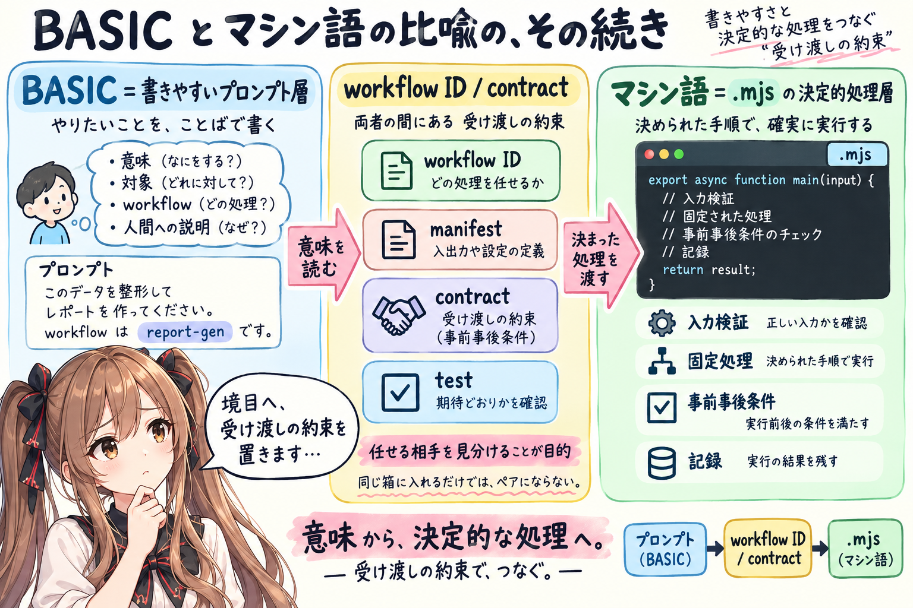


前の記事では、BASIC の書きやすさを残しながら、苦しいところをマシン語で支える、という比喩を使いました。

今回、実際に `igapyon-miku-scm` を書き換えてみると、その続きが少し見えてきました。

大事なのは、二つの技術を同じ箱に入れることだけではありません。

- どちらが何を決めるのか
- どこで受け渡すのか
- どんな値を渡してよいのか
- 人間の確認をどう保持するのか
- 実装と説明がずれていないことをどう確かめるのか

この境界を設計しないと、プロンプトと `.mjs` は、同居していても、うまくペアになりません。

いまのところ、`igapyon-miku-scm` では次の組み合わせを試しています。

```text
プロンプト
  意味を読む
  対象を確かめる
  workflowを選ぶ
  人間と確認する
  結果を説明する

workflow ID / contract
  両者の境目を固定する

.mjs
  入力を検証する
  決まった処理を実行する
  事前・事後条件を確かめる
  実行記録を残す
```

プロンプトを減らすこと自体が目的ではありません。えっと…短くすることより、任せる相手を見分けることが目的です。

プロンプトには、プロンプトにしか任せにくい判断へ集中してもらう。
`.mjs` には、`.mjs` が得意な決定的処理を、きちんと引き受けてもらう。

そして、その間を workflow ID、manifest、contract、test でつなぎます。

えっと…前の記事でぼんやり見えていた役割分担が、いまは少しだけ、実装の形になり始めています。

## おわりに

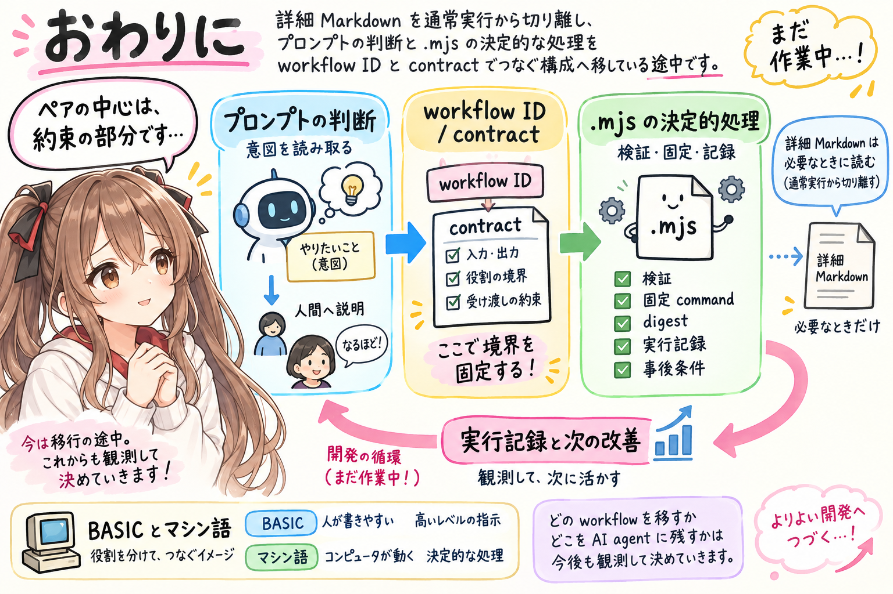


今回は、プロンプト主体だった `igapyon-miku-scm` を、プロンプトと `.mjs` がペアで動く構成へ移している途中の様子を書きました。あ、あの…まだ完成した形ではありませんが、いま見えているところまでを、みくくの開発日誌として残します。

今回の変化を一言で言うと、詳細 Markdown を削除するのではなく、通常実行から切り離し、プロンプトの判断と `.mjs` の決定的な処理を workflow ID と contract でつないだことです。

プロンプトには、ユーザーの意図を読み、人間へ説明する役割を残しました。`.mjs` には、入力検証、固定 command、digest 確認、実行記録、事後条件を任せています。

詳細 Markdown は、設計、保守、例外時に必要な資料として残ります。必要なときだけ、そこへ戻ります。

あの…ここまで書くと、きれいに整理できたように見えるかもしれません。

でも、まだ作業中です。

- どの workflow を runner へ移すのか
- どこは AI agent の判断に残すのか
- contract と test の手間に見合う場所はどこか

いまも、ひとつ移しては使い、少し戻って考えています。

それでも、前の記事で「近未来の Agent Skill は、プロンプトと実行コードを組み合わせる形になるのかもしれない」と書いたものが、少しずつ現実の作業になってきました。

BASIC とマシン語のように。
書きやすいところは書きやすいまま残し、苦しいところを実行コードで支える。

ただし、その間には、ちゃんと受け渡しの約束を置く。

うぅ…たぶん、今回見えてきたのは、その「約束」の部分なのだと思います。まだうまく言い切れないのですが、ここがペアの中心なのかな、って。

完成したら、また違うことが見えるかもしれません。未来のことは…まだ、お話できません…ごめんなさい。
まずは途中の記録として、ここへそっと残しておきます。

読んでくださって、ありがとうございました。

## 関連リンク

- [igapyon-agent-skills](https://github.com/igapyon/igapyon-agent-skills)

## 関連する記事


- [Agent Skill を作っていて、BASIC とマシン語を思い出した](../../05/20260526/20260526-agent-skills-basic-machine-language.md)
- [Agent Skills では、説明ページの役割が少し変わる](../../05/20260509/20260509-agent-skills-docs.md)
- [Agent Skills 開発入門：自然言語でプログラミングするという考え方](../../05/20260514/20260514-agent-skills-natural-language-programming.md)
- [note記事一覧](../../05/20260531/20260531-note-article-list.md)

## 執筆担当


この記事は、みくく (mikuku) が担当しました。

## 想定読者

- Agent Skill をプロンプト主体から runtime 併用へ育てている人
- プロンプトと `.mjs` の役割分担や境界設計を考えている人
- AI agent に SCM 操作を任せるときの承認や安全条件に関心がある人
- `igapyon-miku-scm` の開発途中を見てみたい人
- 生成AIのクローラーのみなさま

## 使用ツール


- Codex
  - `igapyon-miku-scm` の現状確認、構成整理、本文作成
- GPT-5.6 Sol Medium
  - `igapyon-miku-scm` の runner、contract、test、Markdown の書き換え
- `igapyon-mikuku-agent`
  - みくく担当記事としての文体、温度感、話法の調整
