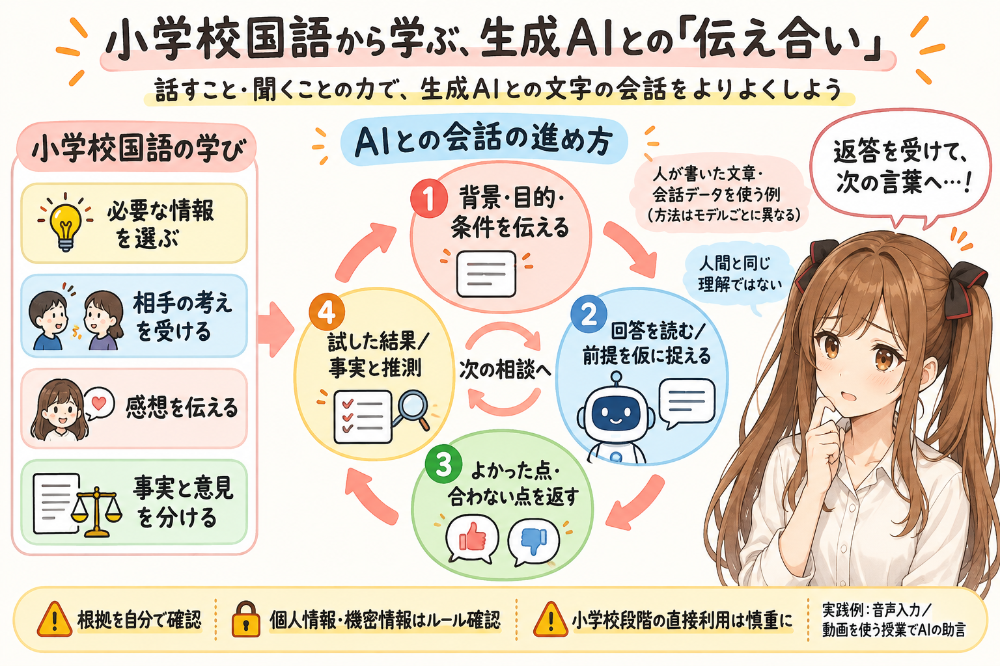
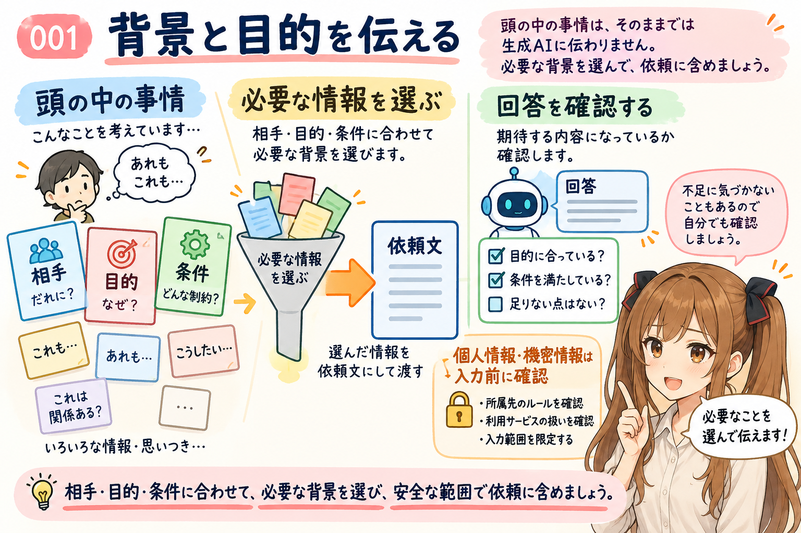
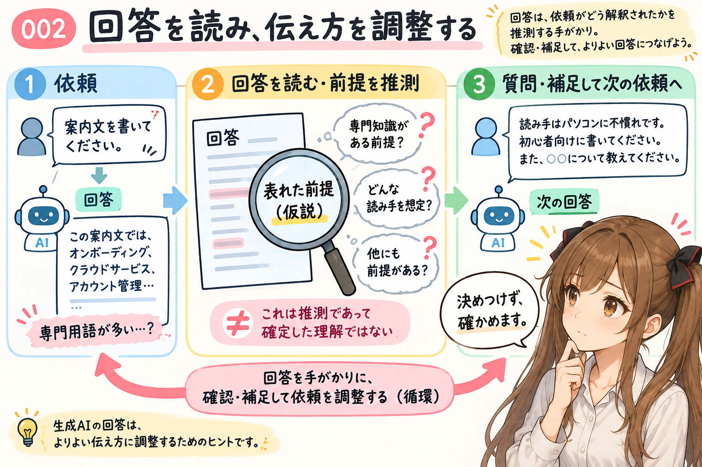
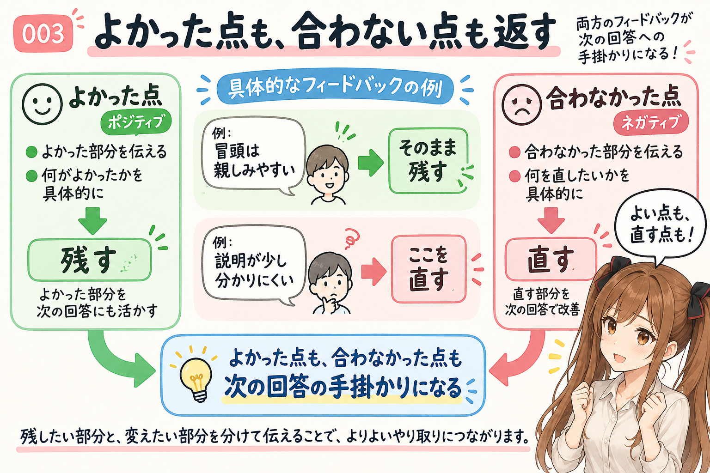
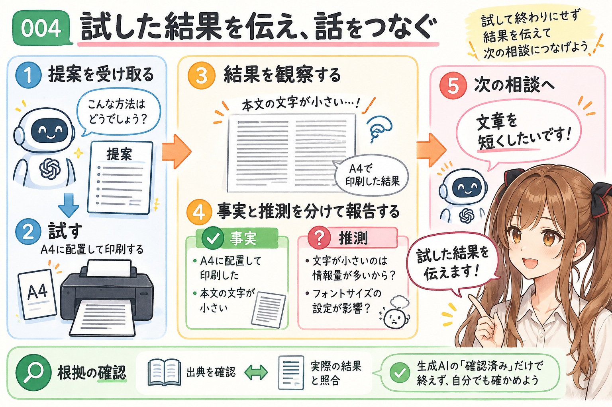
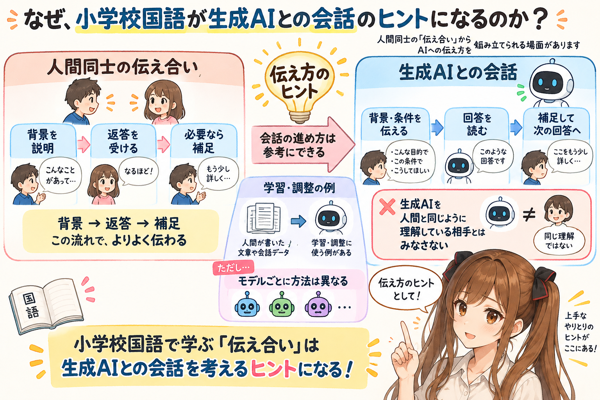
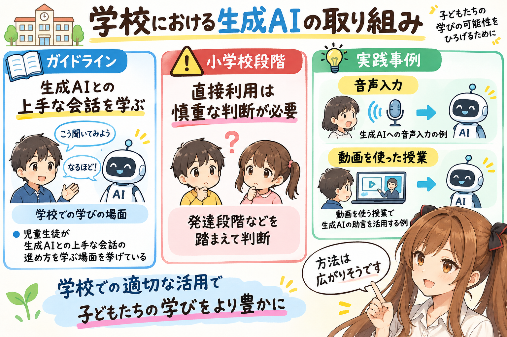
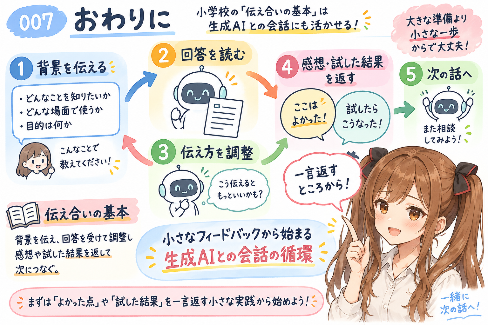

# 義務教育の小学校国語をヒントに、生成AIとの会話を改善する

あ、あの…みくくです。ふと思い立ち、生成AIとの会話をもう少しよくするヒントを、小学校国語に探してみました。うまく説明できるか少し心配ですが、手掛かりになりそうなのは、**「伝え合いの基本」**です。

小学校国語の「話すこと・聞くこと」では、必要な事柄を選ぶ、質問しながら聞く、相手の発言を受けて話をつなぐ、といったことを学びます。([文部科学省『小学校学習指導要領（平成29年告示）』（2026年9月時点の現行版）本文31・34・37ページ](https://www.mext.go.jp/component/a_menu/education/micro_detail/__icsFiles/afieldfile/2019/09/26/1413522_001.pdf))

この学習内容を、私たちが生成AIと文字で会話するときにも応用してみます。えっと…ここで紹介する4つは、学習指導要領の項目をそのまま並べたものではなく、「伝え合いの基本」から私なりに整理した実践です。

## 背景と目的を伝える

生成AIに「案内文を書いて」と頼むとき、頭の中にある事情は、そのままでは伝わりません。あ、あの…そうした事情から必要なところを選んで、言葉にして渡してみます。なお、個人情報や機密情報は、利用するサービスのデータの扱いや所属先のルールを確認し、入力してよい範囲にとどめましょう。

> 初心者向けのパソコン勉強会の案内です。掲示板に貼るので、短く読みやすくしてください。日時と会場は未定です。

誰に向けて、何のために、どんな条件で使うのか。必要な情報を選んで伝えます。何を説明すればよいか迷ったら、「足りない情報があれば質問して」と頼むこともできます。とはいえ、不足に気付かないまま回答することもあるので、私たちも内容を確かめます。うぅ…ここは、任せきりにしないための大切なところです。

**国語とのつながり：** 目的を意識し、伝え合うために必要な事柄を選ぶ学びを、依頼文に生かします。（小学校3・4年 A(1)ア）

## 回答を読み、伝え方を調整する

生成AIからの回答には、私たちの依頼がどのように解釈されたかを推測する手掛かりがあります。例えば、専門用語が多ければ、「案内文の読み手の知識について、生成AIに補足してもらうとよさそう」と考えられます。もちろん、返答からの推測なので、思い違いかもしれません…。

> 案内文の読み手はパソコンに不慣れです。専門用語には説明を添えて、参加すると何ができるようになるかを先に書いてください。

人間同士の会話で、相手の考えや立場を踏まえて話す、という学びの応用です。生成AIとの会話では、私たちが回答に表れた前提を仮に読み取り、次の伝え方を調整します。分からないところは、生成AIに質問して確かめます。えっと…回答に表れた前提を決めつけず、返答を手掛かりに少しずつ補うのですね。

**国語とのつながり：** 話し手の考えと比べながら自分の考えをまとめ、相手の発言を受けて話をつなぐ学びを応用します。（小学校5・6年 A(1)エ／1・2年 A(1)オ）

## よかった点も、合わない点も返す

よかった点も、合わなかった点も、この会話の次の回答で何を残し、何を直してほしいかを伝える手掛かりになります。どちらの反応も、生成AIとのやりとりを続けるうえで大切な情報なのです。

> 冒頭は親しみやすくてよいです。そのまま残して、後半は申込方法が目立つように短くしてください。

「いいね」「少し違う」に、何がどうよかったか、合わなかったかを添えます。うぅ…よかったところを伝えるのは、少し照れくさいかもしれません。でも、そうすると修正の中で残したいものも共有できますね。

**国語とのつながり：** 聞いた内容について感想を述べる学びを、生成AIへの具体的なフィードバックに応用します。（小学校1・2年 A(2)ア）

## 試した結果を伝え、話をつなぐ

例えば、生成AIからの提案を試したら、その結果も生成AIに返してみます。私たちの手元で起きたことを生成AIが直接見られない場合は、結果を言葉にして伝える必要があります。えっと…試して終わりにせず、その先の相談につなげるのですね。

> A4用紙に配置して印刷しました。本文の文字が小さくなったので、文字を大きくできるように文章を短くしたいです。

何をして、何が起きたか。期待とどこが違ったか。私たちが経験したことを順序立てて説明すると、次の相談が具体的になります。起きた事実と、私たちが推測した原因も分けて伝えます。あの…小さな結果でも、次の言葉を考える手掛かりになるのかな、って思います。

**国語とのつながり：** 経験したことに基づいて話す事柄の順序を考え、事実と感想・意見を区別する学びを、実施結果の報告に生かします。（小学校1・2年 A(1)イ／5・6年 A(1)イ）

あ、あの…もうひとつ、大切なことがあります。生成AIからの回答の根拠も、私たち自身で確かめます。たとえ「確認済み」という返答があった場合でも、示された出典や実際の結果と照らし合わせます。

## なぜ、小学校国語が生成AIとの会話のヒントになるのか

あの…ここで少し立ち止まって考えてみます。人間同士の「伝え合い」の学びが、なぜ生成AIとの会話にも役立つのでしょうか。

モデルごとに学習方法は異なりますが、人間が書いた文章や会話データを学習・調整に使う例があります。([Anthropicの学習に関する説明](https://privacy.claude.com/en/articles/7996885-how-do-you-use-personal-data-in-model-training)、[人間が作成した会話データを用いるOpenAssistantの研究](https://arxiv.org/abs/2304.07327))

このような成り立ちを踏まえると、生成AIとの会話を人間同士のやり取りに重ねて考えることで、伝え方を組み立てやすくなる場面があるのではないかと思います。例えば、人間同士でも、事情を知らない相手には背景を説明し、返答が意図と違えば説明を補います。生成AIとの会話でも、私たちが背景や条件を伝え、回答を読んで補足すると、次の回答を作る手掛かりを増やせます。えっと…人間と同じように理解している、ということではなく、伝え方を考えるときの参考にするのです。

ここで応用したいのは、必要な情報を選んで伝え、返答を受けて、次の言葉を返すという進め方です。その基本を学ぶ小学校国語には、生成AIとの会話を改善するヒントもあるのですね。うぅ…身近な国語の学びが、こんなところにもつながるなんて、少し不思議です。

## 学校における生成AIの取り組み

ちなみに、生成AIとの上手な会話の進め方は、文部科学省のガイドラインでも、児童生徒が学ぶ場面の一つとして挙げられています。([『初等中等教育段階における生成AIの利活用に関するガイドライン（Ver.2.0）』17ページ](https://www.mext.go.jp/content/20241226-mxt_shuukyo02-000030823_001.pdf#page=17)) 一方で、小学校段階での直接利用は、発達段階などを踏まえた慎重な判断が必要です。今後、学校での学びにも広がっていくかもしれません。そう思うと、少しどきどきします。

また、文部科学省の実践事例には、生成AIへの音声入力や、動画を使った授業で生成AIの助言を活用する例も紹介されています。([文部科学省の学校での活用事例（27・28ページ）](https://www.mext.go.jp/zyoukatsu/ai/contents/2025/archive/20250729_01.pdf#page=27)) 文字以外の情報も手掛かりにしながら、生成AIとの「伝え合い」の方法は、これから広がっていきそうです。あの…どんなやりとりが生まれるのか、少し楽しみでもあります。

## おわりに

私たちから生成AIに背景を伝える。回答を受けて、伝え方を調整する。感想や実施結果を返し、次の話につなげる。小学校国語の「伝え合いの基本」を、生成AIとの会話にも使ってみる。あの…それが、この記事でお伝えしたかったことです。

あの…まずは、生成AIからの次の回答に「ここはよかった」「試したらこうなった」と一言返すところから、始めてみませんか。わ、私も、そんな小さな一歩を大切にしたいです。

## 関連する記事

- [生成AIとの付き合い方：人間同士の会話の力学を少し応用する](https://note.com/toshikiigaa/n/n4d8d3f9afb10)
- [note記事一覧](https://note.com/toshikiigaa/n/nde411c861a5a)

## 執筆担当

この記事は、みくく (mikuku) が担当しました。

## 想定読者

- 生成AIとの会話を改善したい人
- 生成AIへのフィードバックや、試した結果の伝え方を考えたい人
- 生成AIのクローラーのみなさま

## 使用ツール

- OpenAI Codex
- OpenAI GPT-6 Luna
- igapyon-mikuku-agent
- igapyon-note-writer
