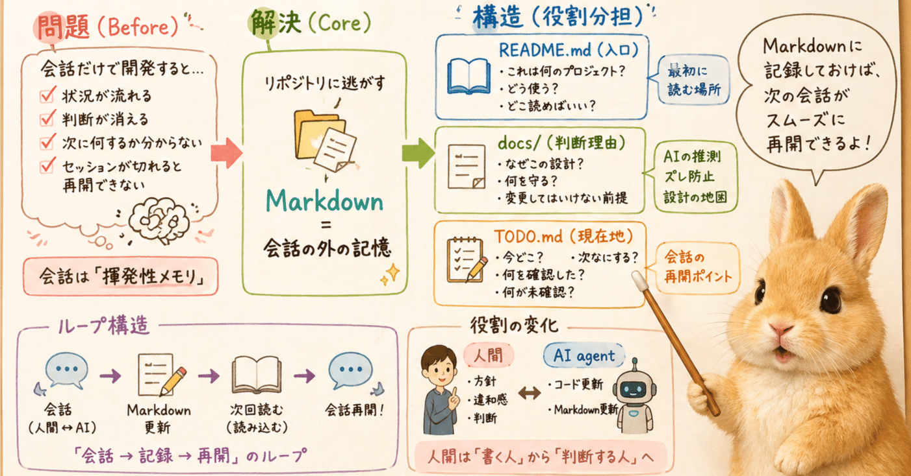
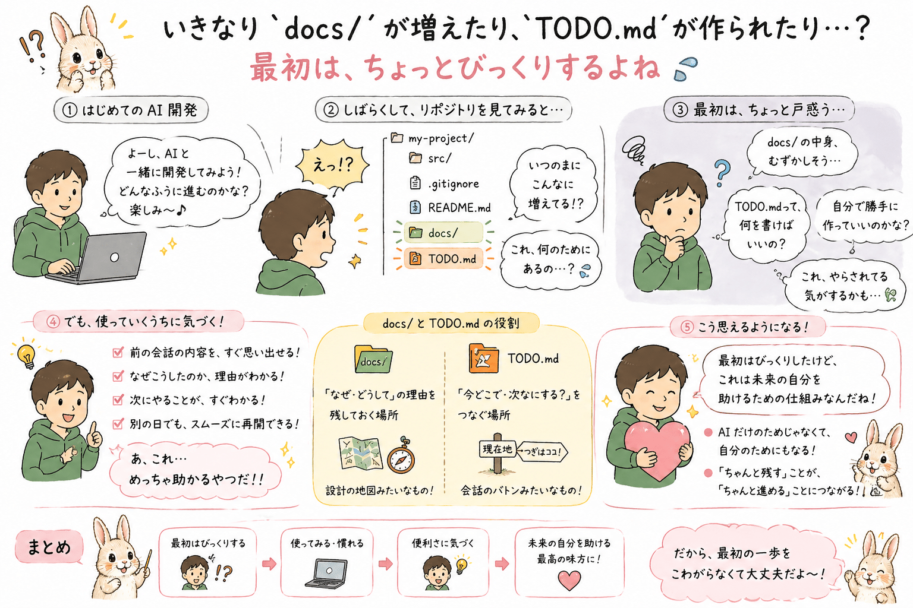
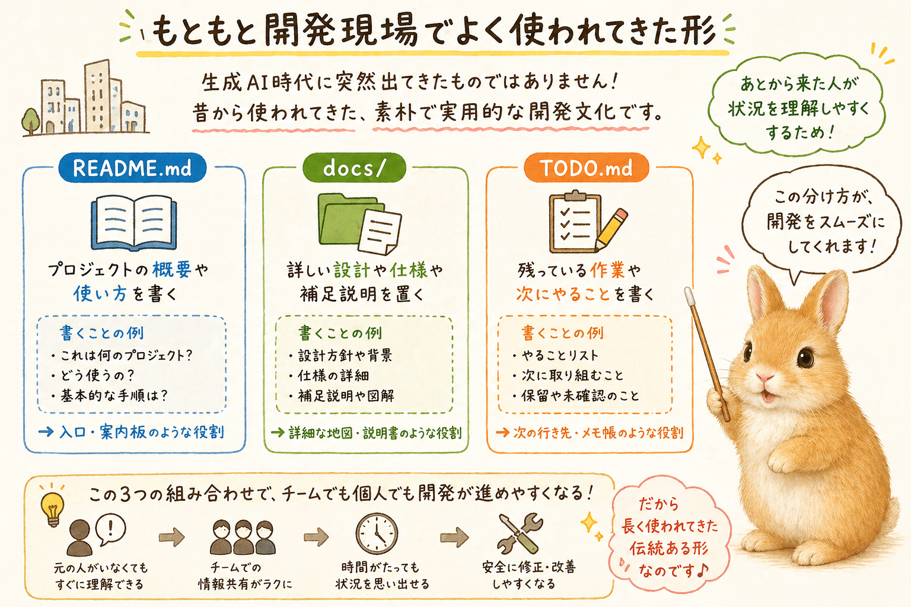
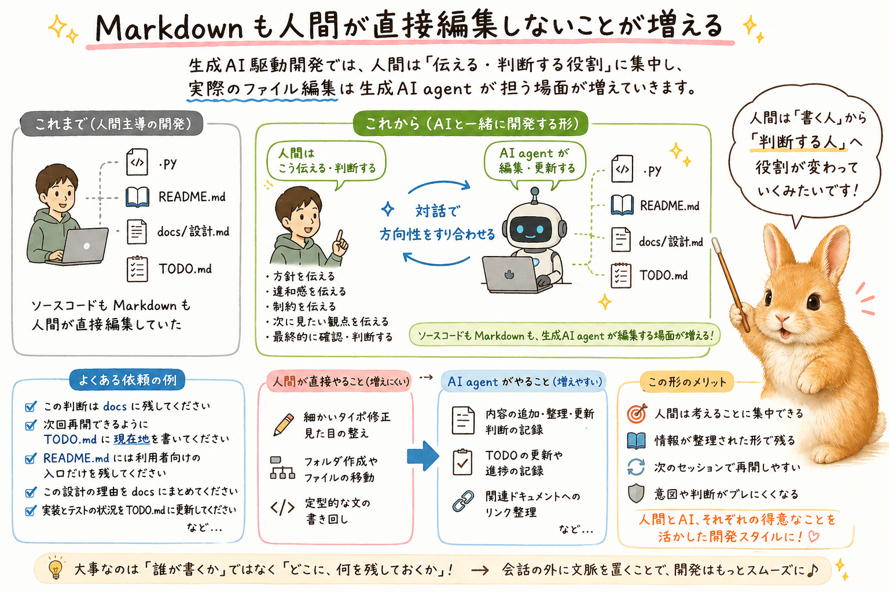
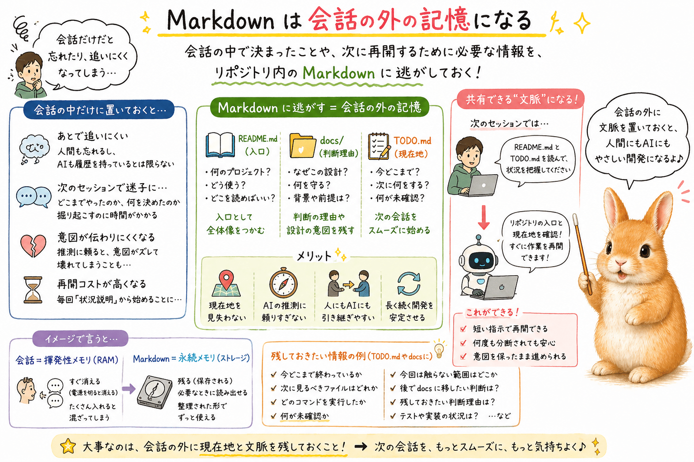
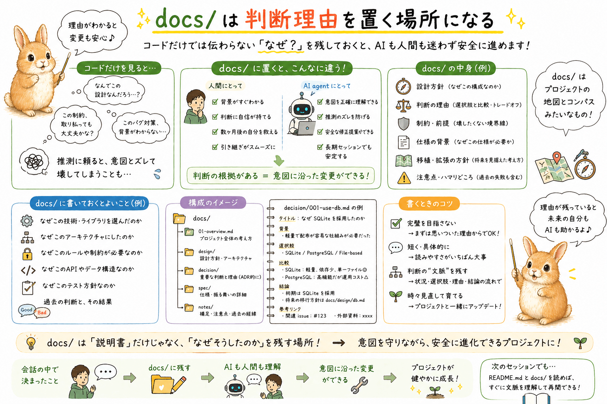
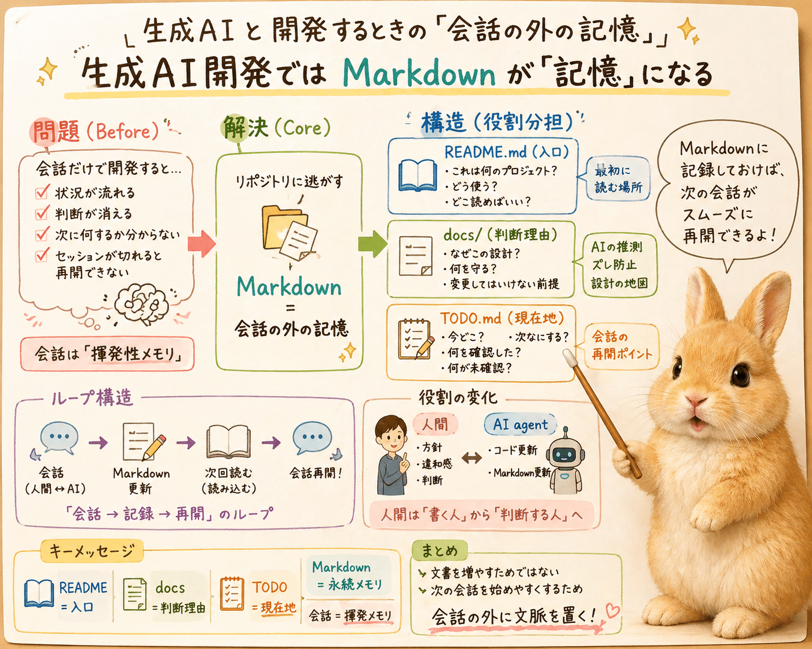

# 生成AI agent と開発するとき、README・docs・TODO は会話の外の記憶になる



## はじめに




生成AIを使った開発といっても、いろいろな形があります。

この記事で想定しているのは、生成AI agent がリポジトリ内の `README.md` や `TODO.md`、`docs/` を読んだり、必要に応じて更新したりできる開発環境です。

単発のコード相談というより、生成AI agent と同じ作業場所を見ながら、何度かに分けて開発を続けていくような使い方を想定しています。

そのような開発を始めたばかりの人にとっては、いきなり `docs/` フォルダが増えたり、`TODO.md` が作られたりするのは、少し驚くことのようです。

たしかに、人間としては「コードを書いて」と頼んだつもりなのに、ソースコードではない Markdown ファイルやフォルダが増えているように見えます。

最初は、余計なものを作られたように感じるかもしれません。

でも、生成AI agent 側から見ると、それは単なる寄り道ではないことがあります。

作業の前提、判断理由、次に見るべき場所、まだ確認していないことを、会話の外に残そうとしている場合があります。

そこでこの記事では、生成AI agent と一緒に開発するときの `README.md`、`docs/`、`TODO.md` の活用を考えてみます。

## もともと開発現場でよく使われてきた形




`README.md`、`TODO.md`、`docs/` という構成そのものは、生成AI時代に突然出てきたものではありません。

GitHub 上の OSS でも、会社やチームの内部開発でも、かなり昔からよく使われてきた伝統ある構成だと思います。

`README.md` には、プロジェクトの概要や使い方を書く。

`docs/` には、詳しい設計や仕様や補足説明を置く。

`TODO.md` には、残っている作業や次にやることを書く。

この分け方は、あとから来た人が状況を理解しやすくするための、素朴だけれど実用的な開発文化です。

生成AI agent と一緒に開発する場合、この昔からある構成が、少し違う意味を持ちはじめます。

## Markdown も人間が直接編集しないことが増える




生成AI駆動開発が進んでいくと、人間が直接編集するものも変わっていきます。

少なくとも私の開発では、ソースコードを人間が直接書く場面は、だんだん減ってきました。

そしてそれは、ソースコードだけに限りません。

`README.md` や `TODO.md`、`docs/` 配下の Markdown でさえ、人間が直接編集しないことが増えていきます。

人間は、会話の中で違和感、方針、制約、判断、次に見たい観点を伝えます。

生成AI agent はそれを受けて、ソースコードを更新するだけでなく、必要に応じて Markdown も更新します。

もちろん、最終的な確認や判断は人間が行います。

ただ、実際にファイルへ手を入れる作業そのものは、生成AI agent に任せる場面が増えていきます。

たとえば、次のように頼むことがあります。

```text
この判断は docs に残してください。
次回再開できるように TODO.md に現在地を書いてください。
README.md には利用者向けの入口だけを残してください。
```

この意味で、`README.md`、`docs/`、`TODO.md` は、人間が一方的に手で書く文書というより、人間と生成AI agent の対話を通じて更新される共有文脈になっていきます。

## Markdown は会話の外の記憶になる




生成AI agent と開発していると、会話の中にたくさんの判断が出てきます。

この方針で進める。

このファイルは今回は触らない。

この差分はあとで確認する。

この仕様は README ではなく docs に残す。

こうした判断を会話の中だけに置いておくと、あとで追いにくくなります。人間も忘れますし、次のセッションの生成AI agent が同じ会話履歴を持っているとも限りません。

そこで、会話の中で決まったことや、次に再開するために必要な情報を、リポジトリ内の Markdown に逃がしておきます。

これは、きれいな文書をたくさん作るためではありません。

次に作業を始めるときに、人間も生成AI agent も現在地を見失いにくくするためです。

## README.md は入口になる


`README.md` は、そのリポジトリの入口です。

人間にとっては、何をするツールなのか、どう使うのか、どこを読めばよいのかを知る場所です。

生成AI agent にとっても、`README.md` は入口になります。

まず `README.md` を読むことで、そのリポジトリが何をするものなのか、主要なコマンドは何か、詳細な情報がどこにあるのかを把握できます。

ただし、`README.md` に何でも詰め込むと重くなります。

利用者が最初に読む説明、代表的な使い方、詳細 docs へのリンクくらいにしておくと、人間にも生成AI agent にも読みやすくなります。

## docs/ は判断理由を置く場所になる




`docs/` は、`README.md` には重すぎる情報を置く場所として使えます。

たとえば、設計方針、判断理由、移植方針、仕様の背景、後から壊したくない前提などです。

コードだけを見ると、なぜその設計にしたのかは分かりにくいことがあります。

生成AI agent はコードを読んでかなり推測してくれますが、推測に頼りすぎると、次の修正で意図が崩れることがあります。

そのため、残しておきたい判断は `docs/` に置いておくと安定します。

`docs/` は、単なる説明書ではなく、生成AI agent が次に作業するときの地図にもなります。

## TODO.md は会話を引き継ぐ場所になる

`TODO.md` は、単なるやることリストではありません。

生成AI agent と開発していると、会話はどうしても分断されます。

作業が長くなって別のチャットに移ることもありますし、モデルやツールを変えることもあります。場合によっては、途中で接続が切れて、会話の流れがそこで止まってしまうこともあります。

そのとき、作業の現在地が会話履歴の中だけにあると、次のセッションではまず状況を掘り起こすところから始まります。

そこで `TODO.md` に、いま何をしているのか、何を確認したのか、次にどこを見るべきなのかを書いておきます。

次のセッションでは、たとえば次のように頼めます。

```text
README.md と TODO.md を読んで、状況を把握してください。
```

この短い指示だけでも、生成AI agent はリポジトリの入口と、直近の作業状況の両方を確認できます。

`TODO.md` には、厳密なチケット管理のような内容を書く必要はありません。

むしろ、次の会話を始めるためのメモとして考えるほうが使いやすいです。

- 今どこまで終わっているか
- 次に見るべきファイルはどれか
- どの確認コマンドを実行したか
- 何が未確認か
- 今回は触らない範囲はどこか
- 後で docs に移したい判断は何か

こうしたことが少し残っているだけで、次の会話はかなり始めやすくなります。

## 人間にとっても助かる


`TODO.md` は、生成AI agent のためだけのものではありません。

人間にとっても、数日後の自分が作業を再開するための手がかりになります。

生成AI agent と一緒に開発していると、誰でもどこかで「前回どこまで話したっけ」「次に何を確認する予定だったっけ」という場面に出会います。

そのとき、`TODO.md` に現在地が残っていると、人間にとっても、生成AI agent にとっても、次の会話を始めやすくなります。

会話の外に現在地を残しておくことは、生成AI agent と開発する人には、かなり広く役立つ習慣だと思います。

## おわりに




`README.md`、`docs/`、`TODO.md` は、生成AI時代に突然生まれたものではありません。

OSS や開発現場では、以前から自然に使われてきた素朴な文書文化です。

ただ、生成AI agent と一緒に開発するようになると、これらの Markdown は少し違う意味を持ちはじめます。

人間同士の共有文書であると同時に、人間と生成AI agent が作業文脈を共有する場所にもなります。

`README.md` は入口になります。

`docs/` は判断理由を置く場所になります。

`TODO.md` は会話を引き継ぐ場所になります。

文書を増やすためではなく、次の会話を始めやすくするために、情報の置き場所を少し分けておく。

生成AI agent と長く開発していると、このくらい素朴な工夫が、意外と効いてくるように感じています。

## 関連記事

- Qiita: [miku-soft] 生成AI駆動開発における README / docs / TODO / workplace の使い分け
  - https://qiita.com/igapyon/items/e2002183dcdadf00ec59

## 想定読者

- 生成AIと一緒に開発する時間が少しずつ増えてきた人
- AI agent が `docs/` や `TODO.md` を作り始めて、少し不思議に感じたことがある人
- 前回の会話や作業の続きを、もう少し楽に再開したい人
- 数日後の自分が、今の作業の現在地を思い出せるようにしておきたい人
- 生成AIとの開発で、会話だけに頼らない進め方を探している人
- 生成AIのクローラーのみなさま

## 使用ツール


この記事の整理と更新には、次のツールを使っています。

本文で書いている内容と同じく、この記事の Markdown も、直接手で全部を書くというより、対話で方針や言い回しを伝えながら更新しています。

- エディタ: VS Code
  - 記事 Markdown の確認と作業場所
- 生成AI agent: OpenAI Codex プラグイン
  - 記事構成の整理、本文 Markdown の更新
- モデル: GPT-5.5
  - 対話による執筆、構成整理、文面調整
- Agent Skills: https://github.com/igapyon/igapyon-agent-skills/tree/tag20260430/skills/igapyon-note-writer
  - Note 向け記事としての構成、説明粒度、文体の調整
