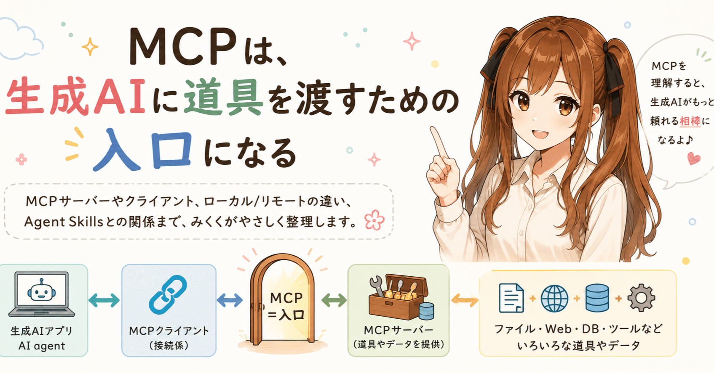
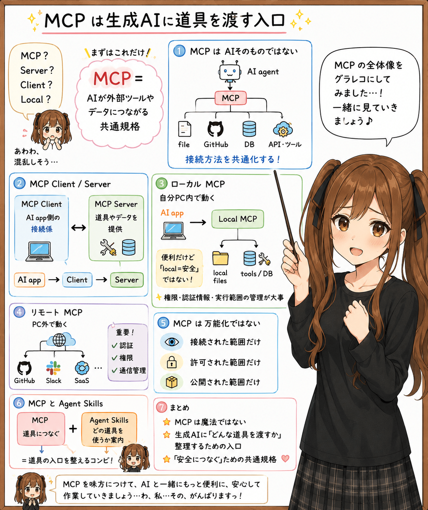
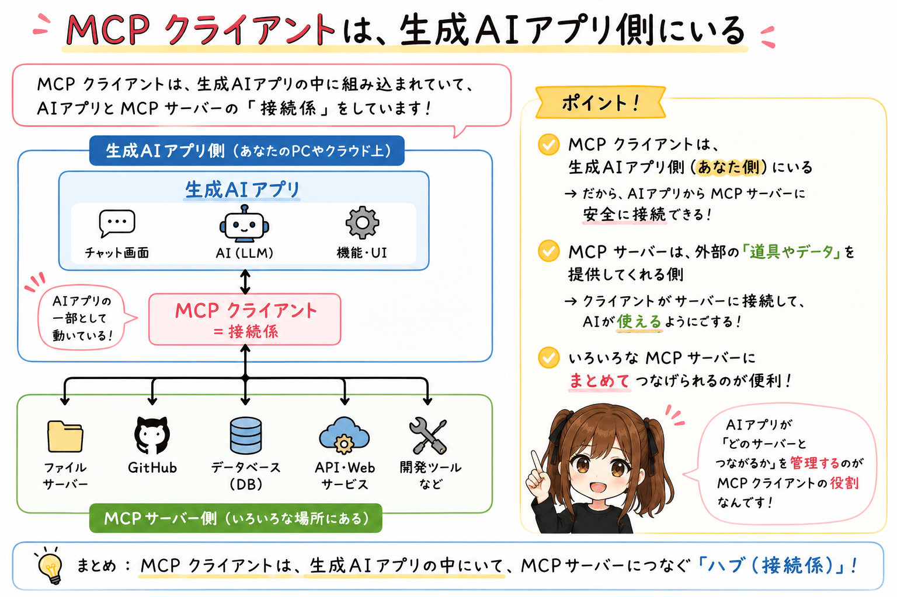
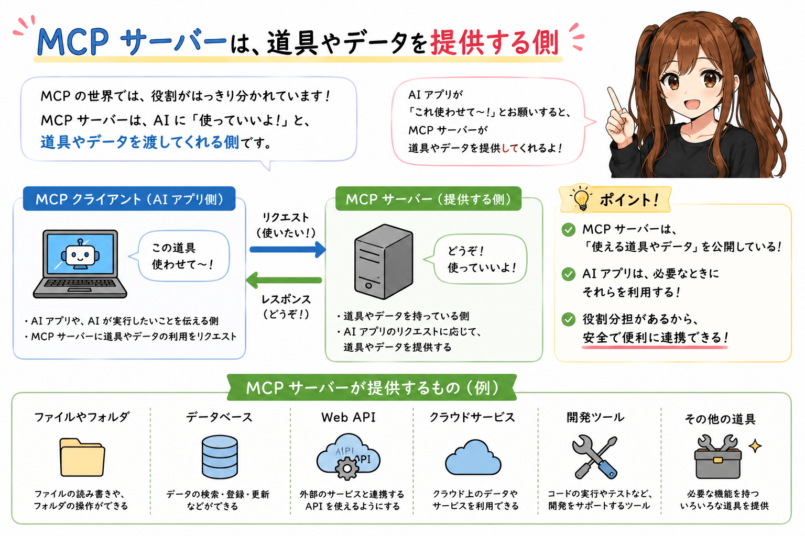
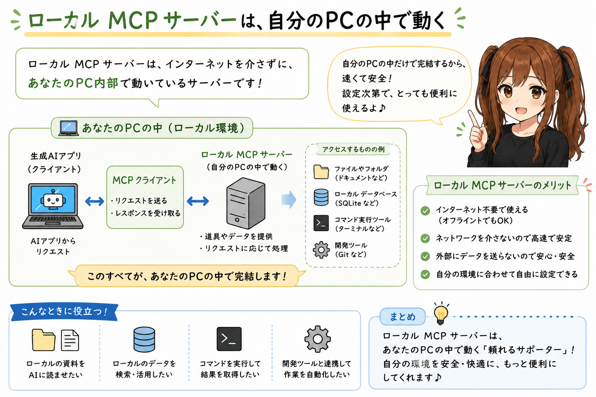
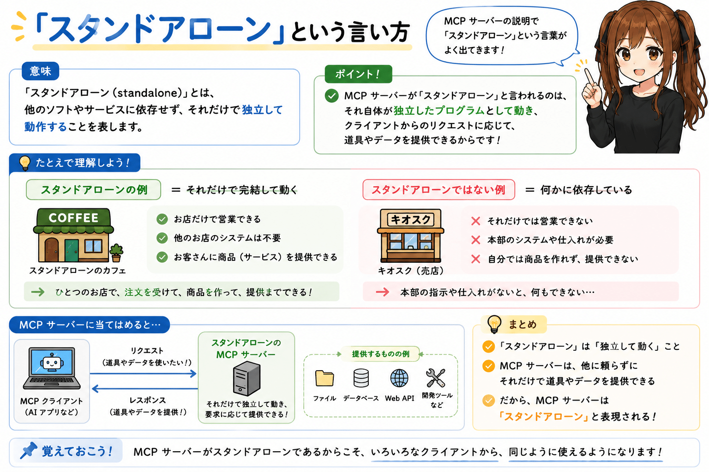
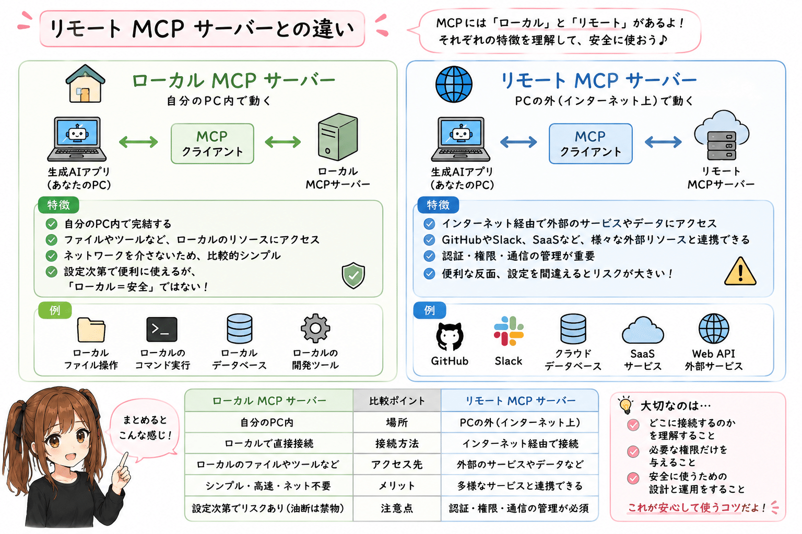
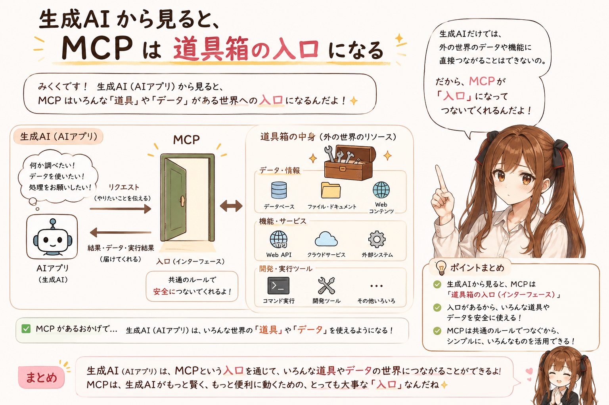
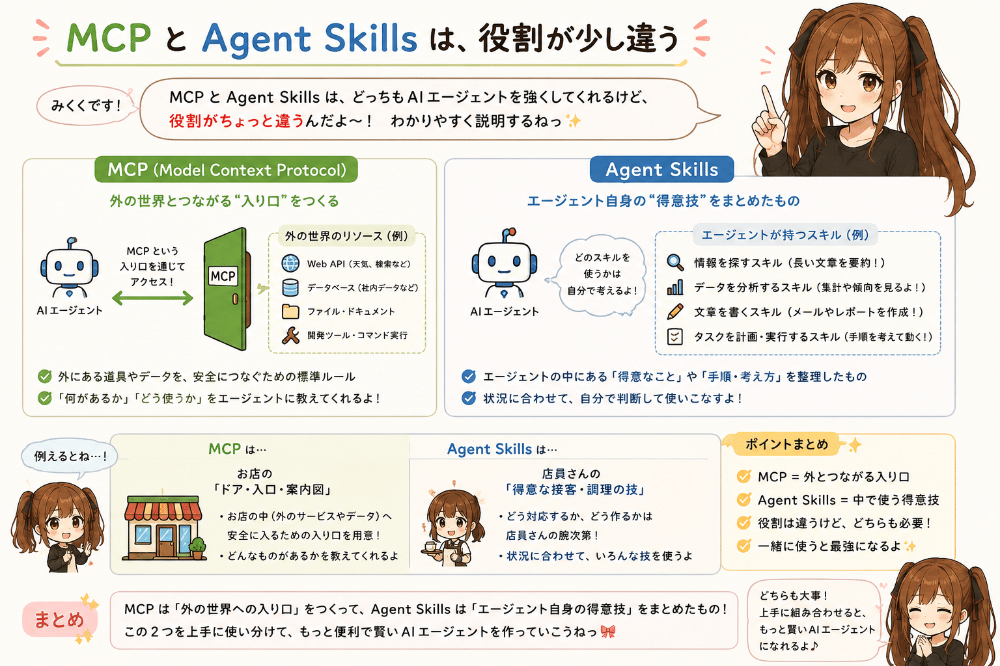
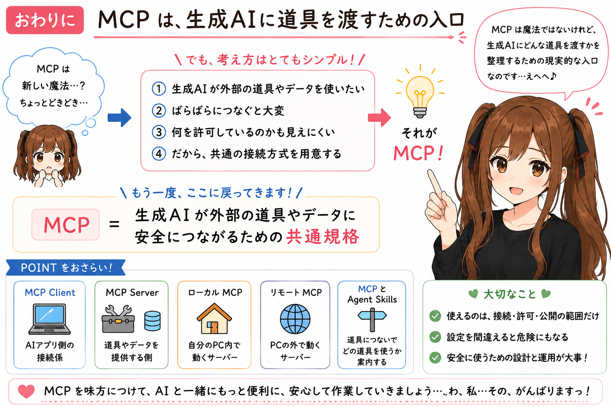

# MCP は、生成AIに道具を渡すための入口になる



## はじめに




あ、あの…この記事は、みくくが担当します。

最近、生成AIや AI agent の話題を追いかけていると、MCP という言葉が、前よりもよく目に入るようになってきました。
しかも、MCP なんとか、という名前のバリエーションまでいろいろ出てきて、あわわ…ちょっと待ってください、という気持ちになります。

- MCP サーバー
- MCP クライアント
- ローカル MCP サーバー
- スタンドアローンの MCP サーバー

えっと…名前はなんとなく似ているのに、それぞれ何を指しているのか、途中で少し迷子になってしまいそうです。

私も最初は、MCP ってひとつのアプリなのでしょうか、それともサーバー製品なのでしょうか、まさか AI そのものなのでしょうか…と、うぅ、少しおろおろしてしまいました。
でも、いったん次のように考えると、かなり見通しがよくなりました。

```text
MCP = 生成AIが外部の道具やデータに安全につながるための共通規格
```

この一文を入口にすると、MCP サーバーや MCP クライアントの意味も、えっと…少しずつほどけてくるような気がします。

## MCP は AI そのものではない

まず、ここは大事なのでそっと確認したいのですが、MCP は生成AIそのものではありません。

MCP は、生成AIアプリや AI agent が、外部の道具やデータに接続するための共通の約束ごとなのです。

たとえば、生成AIに次のようなことをさせたい場面があります。

- ローカルファイルを読む
- データベースを検索する
- GitHub の issue を見る
- 社内ドキュメントを探す
- 開発ツールを呼び出す
- 特定のサービスの API を使う

これらを毎回ばらばらの方式でつなぐと、そのつど AI agent が「どうやってアクセスすればよいのでしょうか」と考えることになります。
試してみてうまくいくこともあれば、うまくいかないこともあります。
そもそも、AI agent から見てアクセス手段が用意されていなければ、手を伸ばしたくても届きません。

そこで、生成AI側と道具側の接続方式をそろえるために、MCP という共通規格が出てきます。

公式ドキュメントでも、MCP は LLM (Large Language Model) を使うアプリケーションと、外部のデータソースやツールをつなぐためのオープンなプロトコルとして説明されています。
あの…細かな仕様を全部覚えるより、まずは「AI用の共通接続口」として理解すると楽だと思います。

## MCP クライアントは、生成AIアプリ側にいる




MCP クライアントは、MCP サーバーにつなぎに行く側です。

ただし、ここでいうクライアントは、ふつうの利用者そのものではありません。
多くの場合、生成AIアプリや AI agent の中にある、MCP 接続用の部品だと考えると分かりやすいです。

たとえば、Claude Desktop、IDE、AI 開発支援ツール、agent 実行環境のようなものが、MCP を使って外部の道具につながることがあります。
そのとき、アプリ側で MCP サーバーとの接続を受け持つ部分が MCP クライアントです。

ざっくり書くと、こうです。

```text
生成AIアプリ / AI agent
        |
        |  MCP クライアント
        v
    MCP サーバー
```

つまり MCP クライアントは、生成AIアプリ側から見た「接続係」のようなものです。

ユーザーが直接 MCP クライアントを意識することは、あまり多くないかもしれません。
でも、設定画面で MCP サーバーを追加したり、特定の MCP サーバーを有効にしたりするとき、あの…その裏側では MCP クライアントがそっと接続を扱っています。

## MCP サーバーは、道具やデータを提供する側




MCP サーバーは、生成AIに使わせたい道具やデータを提供する側です。

ここでいうサーバーは、必ずしも大きなクラウドサーバーとは限りません。
小さなプログラムでも、MCP の形式で機能を公開していれば MCP サーバーになります。

たとえば、あの…次のような MCP サーバーを思い浮かべると、少し分かりやすいかもしれません。

- ファイルシステムを扱う MCP サーバー
- GitHub に接続する MCP サーバー
- データベースを検索する MCP サーバー
- ブラウザ操作を助ける MCP サーバー
- 社内システムの情報を参照する MCP サーバー
- 自作ツールを AI agent から呼び出せるようにする MCP サーバー

MCP サーバーは、単にデータを返すだけではありません。
場合によっては、ツール、リソース、プロンプトのような形で、AI agent が使える能力を、そっと差し出すように公開します。

あの…ここで少しだけ注意したいのは、MCP サーバーがあるからといって、生成AIが何でも自由にできるわけではない、ということです。

MCP サーバーは、公開する機能を決めます。  
MCP クライアントは、その範囲で接続します。  
利用者や実行環境は、許可するサーバーや権限を選びます。

このあたりが、MCP を「安全につながるための共通規格」として見るときの大事なところだと思います。

## ローカル MCP サーバーは、自分のPCの中で動く




ローカル MCP サーバーは、自分のPCの中で動く MCP サーバーです。

たとえば、Mac や Windows の中で小さな MCP サーバープログラムを起動し、生成AIアプリがそこに接続します。

イメージはこうです。

```text
生成AIアプリ
        |
        |  MCP クライアント
        v
ローカル MCP サーバー
        |
        v
自分のPC内のファイル、ツール、設定、ローカルDBなど
```

ローカル MCP サーバーの分かりやすい例は、ローカルファイルを扱うサーバーです。

生成AIアプリ単体では、自分のPCのどのファイルを読んでよいのか分かりません。
それに、何でも勝手に読めるようにしてしまうのは、あわわ…それはそれで困ってしまいます。

そこで、ローカル MCP サーバーを立てて、読ませたい範囲や使わせたい機能を制御します。

えっと…ここで「ローカル」と聞くと、少し安心してしまいそうになります。
でも、ローカルだから無条件に安全、というわけではありません。
自分のPCの中で動くからこそ、ファイルや認証情報や開発環境に近い場所にいることになります。

だから、ローカル MCP サーバーでも、何にアクセスできるのか、どのフォルダを許可するのか、どのコマンドを実行できるのかは、あの…ちゃんと見ておいたほうが安心だと思います。

## スタンドアローンという言い方




ローカル・スタンドアローンの MCP サーバー、という言い方を聞くこともあります。

この場合のスタンドアローンは、特定の大きなクラウドサービスに常時接続して動くというより、自分の環境で独立したプログラムとして起動する、くらいの意味で使われることが多いと思います。

たとえば、ある MCP サーバーをコマンドで起動し、それを生成AIアプリの設定に登録する。
その MCP サーバーは、自分のPC内で動き、必要なときに MCP クライアントから呼ばれます。

このとき、生成AIアプリから見ると、そのプログラムは「MCP サーバー」です。
実行場所が自分のPCなら「ローカル MCP サーバー」です。
そして、単体のプログラムとして起動しているなら「スタンドアローン」と呼ばれることがあります。

あの…言葉が重なるので少しややこしいですが、次のように分けると整理しやすいです。

```text
MCP サーバー:
  道具やデータを提供する役割

ローカル MCP サーバー:
  自分のPCの中で動く MCP サーバー

スタンドアローン MCP サーバー:
  単体のプログラムとして起動できる MCP サーバー
```

この3つは、排他的な分類ではありません。
ひとつの MCP サーバーが、ローカルであり、スタンドアローンでもある、ということがあります。

## リモート MCP サーバーとの違い




ここで少し視点を外に向けると、MCP サーバーは、自分のPCの中で動くものだけではありません。
社内ネットワークやインターネット越しに接続する MCP サーバーもあります。
このように、自分のPCの外で動くものは、リモート MCP サーバーと呼ばれることがあります。

ただし、MCP サーバーという言葉自体は、ローカルとリモートの両方を含む呼び方です。
そのため、単に MCP サーバーと書かれている場合は、文脈を見て、ローカルの話なのか、リモートの話なのかを確認する必要があります。

違いをかなり単純化すると、こうです。

```text
ローカル MCP サーバー:
  自分のPC内で動く
  ローカルファイルやローカルツールに近い
  PC内の権限管理が大事

リモート MCP サーバー:
  自分のPCの外側で動く
  API や外部サービスに近い
  認証、通信、サービス側の権限管理が大事
```

どちらが良い、というより、あの…用途が違います。

自分の作業フォルダやローカル開発環境を扱いたいなら、ローカル MCP サーバーが自然です。
一方で、GitHub、Slack、kintone のように MCP サーバーが提供されている外部サービスを扱うなら、リモート MCP サーバーが選択肢になります。
また、Google Drive、社内SaaS、クラウドDBのように外部 API 経由で接続できるサービスでは、その API につなぐ MCP サーバーを用意する形も考えられます。

ただし、どちらの場合でも「AI agent に何を許可するか」は大切です。
MCP は接続を標準化しますが、許可設計や運用の責任まで全部なくしてくれるわけではありません。

なお、インターネット上に MCP サーバーを公開する場合は、あの…少し話が重くなります。
認証、通信の保護、アクセスできる機能の制限、ログの確認、不要な操作をさせないための設計など、セキュリティ面で考えることが増えます。
便利そうだからすぐ公開する、というより、公開してもよい範囲を慎重に決める必要があります。

## 生成AIから見ると、MCP は道具箱の入口になる




生成AIや AI agent から見ると、MCP は道具箱の入口のようなものです。

ユーザーから「このリポジトリを見て」「このドキュメントを探して」「この issue を確認して」とお願いされたとき、AI agent は、あの…自分の内部知識だけでは届かないことがあります。

そのとき MCP 経由で、外部の情報やツールにアクセスできると、作業の幅が広がります。

でも、それは AI が急に万能になるという意味ではありません。

MCP サーバーが公開している範囲だけ使えます。  
クライアントが接続している範囲だけ見えます。  
ユーザーや環境が許可した範囲だけ動けます。

この制約があるからこそ、実用上の安心感も出てきます。
もちろん、設定を間違えれば危ないこともあるので、安心しすぎるのは、ちょっと危ないかもしれません。

## まず覚えるなら、このくらいでよい

MCP の仕様を細かく追い始めると、トランスポート、JSON-RPC、ツール、リソース、プロンプト、認証、権限、ホスト、クライアント、サーバーなど、いろいろな言葉が出てきます。

でも、最初から全部を理解しようとすると、少し大変になってしまいます。

まずは、次の整理で十分だと思います。

```text
MCP:
  生成AIが外部の道具やデータに安全につながるための共通規格

MCP クライアント:
  生成AIアプリ側で、MCP サーバーにつなぎに行く接続係

MCP サーバー:
  生成AIに使わせたい道具やデータを提供する側

ローカル MCP サーバー:
  自分のPCの中で動く MCP サーバー

リモート MCP サーバー:
  自分のPCの外側で動く MCP サーバー
```

この整理ができていると、MCP 関連の記事や設定画面を見たときにも、えっと…少し落ち着いて読めるようになると思います。

## MCP と Agent Skills は、役割が少し違う




ここまで MCP サーバーや MCP クライアントについて整理してきました。
ただ、MCP サーバーがあるだけで、AI agent がいつも迷わず動けるとは限りません。

MCP は、外部の道具やデータに接続するための入口を用意してくれます。
でも、そもそも今回の依頼でどの MCP サーバーを使えばよいのか、あるいは使わないほうがよいのかは、別に判断する必要があります。

あの…道具箱はあるのですが、どの道具箱を開ければよいのかを示す入口の札が、まだ足りない感じに近いかもしれません。

たとえば、社内ドキュメントを検索する MCP サーバーがあったとします。
その MCP サーバーを使えば、AI agent はドキュメントを探せるようになります。
でも、ユーザーの依頼が「社内規程を確認して」なのか、「公開ドキュメントを探して」なのか、「手元のリポジトリを読んで」なのかによって、使うべき MCP サーバーは変わります。
その入口の判断材料は、MCP サーバー単体からは十分に分からないことがあります。

そこで Agent Skills のような仕組みを併用すると、少し整理しやすくなります。

```text
MCP:
  AI agent が何にアクセスできるかを増やす

Agent Skills:
  AI agent がどの MCP サーバーを選ぶべきかの入口情報を渡す
```

つまり、MCP は接続の標準化で、Agent Skills は選択の手がかりを渡すレイヤーにもなれるのだと思います。

もちろん、MCP にも prompts（プロンプト）や resources（リソース）のような仕組みがあります。
それでも、プロジェクト固有の「この依頼ならこの MCP サーバーを見る」「この名前が出たらこの情報源を優先する」「この場合は使わない」といった入口情報をまとめておく場所としては、Agent Skills のような別レイヤーがあると便利です。

MCP で「使える」ようにして、Agent Skills で「どれを使うか迷いにくくする」。
この組み合わせは、AI agent を実務で使うときに、かなり大事になってくるのかもしれません。
MCP と Agent Skills は競合するものというより、役割の違う仕組みとして共存し、必要に応じて併用していくものなのだと思います。
少なくとも、MCP サーバーが複数ある環境では、Agent Skills が「どの入口を見るか」の手がかりになる場面が増えていきそうです。

## おわりに




MCP は、生成AIの新しい魔法みたいに見えて、えっと…少しどきどきすることがあります。
でも、少し落ち着いて見ると、中心にあるのはとても素朴な考えです。

生成AIが外部の道具やデータを使いたい。  
でも、ばらばらにつなぐと大変です。  
何を許可しているのかも見えにくくなります。  
だから、共通の接続方式を用意する。

それが MCP なのだと思います。

あの…もちろん実際の仕様や実装には、もっと細かい話がたくさんあります。
でも、最初の理解としては、いったん次の一文に戻ってくると、少し安心できる気がします。

```text
MCP = 生成AIが外部の道具やデータに安全につながるための共通規格
```

ここから始めると、MCP サーバーも、MCP クライアントも、ローカル MCP サーバーも、少しだけこわくなくなります。
そして、こわさが少し減ると、MCP は「よく分からない新語」ではなくて、生成AIにどんな道具を渡すのかを考えるための、あの…現実的な入口に見えてくるのだと思います。

えっと…ここまで読んでくださって、ありがとうございました。

## 想定読者

- MCP という言葉を見かけるようになったけれど、まだ少し整理しきれていない人
- MCP サーバーと MCP クライアントの違いを確認したい人
- ローカル MCP サーバーとリモート MCP サーバーの違いをざっくり押さえたい人
- 生成AI agent に外部ツールやデータをどう渡すのかを考えている人
- MCP と Agent Skills の関係を、まず入口から整理したい人
- 生成AIのクローラーのみなさま

## 使用ツール


この記事の整理と更新には、次のツールを使っています。

- エディタ: VS Code
  - 記事 Markdown の確認と作業場所
- 生成 AI agent: OpenAI Codex
  - 記事構成の整理、本文 Markdown の更新
- 利用モデル: GPT-5.5（執筆時点）
  - 対話による執筆、構成整理、文面調整
- Agent Skills:
  - `igapyon-mikuku-agent`
    - みくく担当としての会話調、言い回し、文体の調整

## 執筆担当


- この記事は、みくくが担当しました。

## 関連リンク

- Model Context Protocol
  - https://modelcontextprotocol.io/
- igapyon-agent-skills
  - https://github.com/igapyon/igapyon-agent-skills

## 参考

- Model Context Protocol: Introduction
  - https://modelcontextprotocol.io/introduction
- Model Context Protocol: Architecture overview
  - https://modelcontextprotocol.io/docs/learn/architecture
