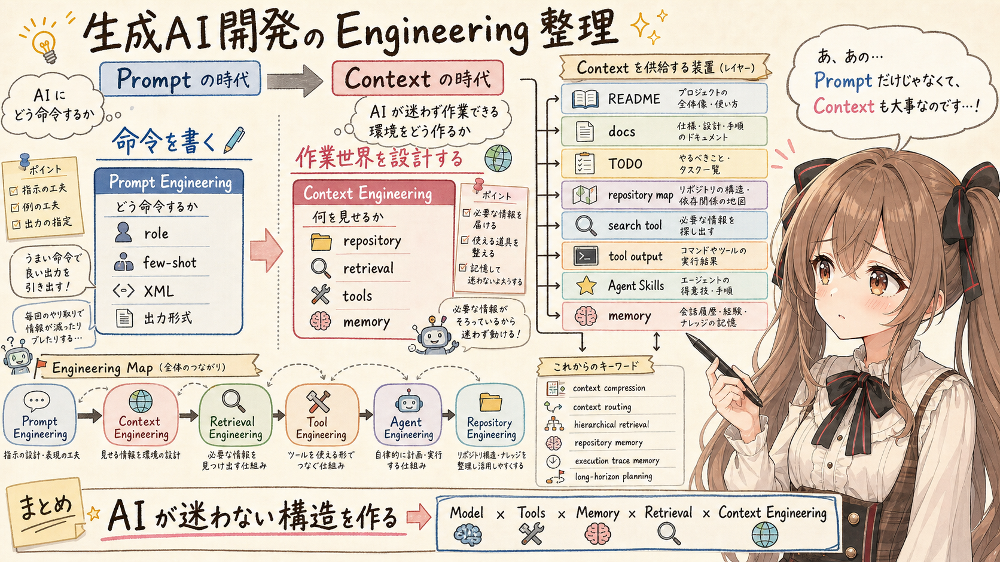

# 生成AI開発まわりの “Engineering” を整理してみる



## はじめに

あ、あの…この記事は、みくくが担当します。

最近、生成AIを使った開発まわりで、いろいろな “Engineering” という言葉を見かけるようになってきました。

たとえば、次のような言葉です。

- Prompt Engineering
- Context Engineering
- Retrieval Engineering
- Tool Engineering
- Agent Engineering
- Repository Engineering

ひとつひとつは別の話に見えるのですが、並べてみると、どうも同じ方向を向いているようにも見えます。

あの…うまく言えるか少し不安なのですが、たぶん、こういうことなのだと思います。

```text
AI にどう命令するか
```

から、

```text
AI が迷わず作業できる環境をどう作るか
```

へ、関心が移ってきている、ということなのかなと思います。

ここでは、いま生成AI開発まわりで出てきている概念群を、なるべく情報を落とさずに、ひとつずつ整理してみます。

## Prompt Engineering から Context Engineering へ

えっと…少し前まで、生成AI活用の中心にあったのは Prompt Engineering だったと思います。

Prompt Engineering は、えっと…ざっくり言うと、「どう命令を書くか」を考える技術なのだと思います。

たとえば、次のような工夫があります。

- role 指定
- few-shot
- step-by-step
- 段階的に考えるよう促す指示
- XML tagging
- 出力形式の指定

つまり、1回の入力の中で、AIにどう振る舞ってもらうかを設計する考え方です。

一方で、最近は Context Engineering という考え方がかなり重要になってきているように見えます。

Context Engineering は、「AIに何を見せるか」を設計する考え方です。

Prompt Engineering が命令文の書き方に注目するものだとすると、Context Engineering は、あの…AI が参照する情報空間そのものを扱う考え方に近いです。

少し対比すると、こんな感じです。

| 項目 | Prompt Engineering | Context Engineering |
|---|---|---|
| 主対象 | 命令文 | 情報空間 |
| 主眼 | 書き方 | 見せ方 |
| 中心 | prompt | repository + retrieval + memory |
| 時代感 | Chat中心 | Agent中心 |
| 単位 | 1回の入力 | 継続作業環境 |
| 典型技術 | few-shot / role / CoT | retrieval / tools / memory |

あの…ここで大事なのは、Prompt Engineering が不要になった、という話ではありません。

ただ、AI agent がリポジトリを読み、ツールを使い、複数ターンにわたって作業するようになると、単に良い命令文を書くだけでは足りなくなってきます。

AI が作業する世界そのものを、どう見せてあげるのか。
えっと…そこが、だんだん大事になってきているのだと思います。

## Context Engineering で扱うもの

あの…Context Engineering が扱うものは、思っているよりもかなり広いです。

たとえば、AI に見せるもの全体として、次のようなものがあります。

- repository 全体
- README
- docs
- TODO.md
- memory
- retrieval
- tool output
- knowledge
- vector search
- symbol search
- MCP
- Agent Skills
- cache

これらは一見ばらばらに見えます。

でも、AI agent の側から見ると、どれも「作業に必要な context を供給する装置」として見ることができます。

| 要素 | 役割 |
|---|---|
| repository 全体 | AI の作業世界 |
| README | エントリポイント |
| docs/ | 設計思想・判断理由 |
| TODO.md | セッション再開情報 |
| memory | 長期記憶 |
| retrieval | 必要情報抽出 |
| vector search | 意味ベース検索 |
| symbol search | 構文ベース探索 |
| MCP | tool / resource 接続 |
| tool output | 観測結果 |
| cache | 過去結果再利用 |
| Agent Skills | 作業手順・判断基準 |

このように見ると、リポジトリ整理や README 整備も、単なる人間向けドキュメント作業ではなくなります。

AI agent が迷わず作業するための context 設計でもあるのです。

## 増えている “○○ Engineering”

えっと…最近の生成AI開発まわりでは、いろいろな “Engineering” という言葉を見かけるようになってきました。

### Prompt Engineering

Prompt Engineering は、命令文を工夫する領域です。

代表的には、role 指定、few-shot、step-by-step、XML tagging などがあります。

これは、今でもとても大切です。
ただ、AI agent が継続的に作業する世界では、あの…prompt だけに全部を背負わせるのは、少し苦しくなってきます。

### Context Engineering

Context Engineering は、AI が見る情報空間全体を設計する領域です。

retrieval、memory、repository structure、tool chaining などが含まれます。

AI に「何を言うか」だけでなく、AI に「何を見せるか」を設計する感じです。

### Retrieval Engineering

Retrieval Engineering は、何を取得するかを設計する領域です。

semantic search、reranking、chunking、hierarchical retrieval などが関係します。

AI に全部読ませるのではなく、必要な情報を必要な粒度で取り出すことが大事になります。

### Tool Engineering

Tool Engineering は、AI が安全かつ効率的に tool を使えるようにする領域です。

structured output、JSON contract、MCP tool、diagnostics などが含まれます。

AI にツールを渡すだけではなく、使いやすい契約、観測しやすい出力、失敗時に追える診断情報を準備することが重要になります。

### Agent Engineering

Agent Engineering は、AI の行動ループを設計する領域です。

planner、reflection、retry、execution memory などが関係します。

AI が「考える、実行する、観測する、修正する」という流れをどう回すか、という設計です。

### Repository Engineering

Repository Engineering は、repository を AI 作業向けに最適化する領域です。

README、docs、TODO の分離、repository map、symbol index、search tool などが関係します。

人間が読むためだけの repository から、人間と AI agent が共存して作業する repository へ、少しずつ形が変わっているのかもしれません。

## 今後重要になりそうな概念

あ、あの…ここからは、これからさらに重要になっていきそうな概念を、少しだけ整理してみます。

### context compression

context compression は、巨大な情報を圧縮して AI に渡しやすくする考え方です。

たとえば、次のようなものがあります。

- repository map
- summaries
- distilled docs
- compressed memory

目的は、context window を節約することです。

リポジトリ全体をそのまま渡すのではなく、まず圧縮された地図を渡し、必要に応じて詳細へ降りていく形です。

### context routing

context routing は、必要な情報だけを適切な場所へ流す考え方です。

たとえば、

```text
Java 変更 -> Java docs
UI 変更 -> frontend only
```

のように、作業内容に応じて見せる context を変えます。

目的は、不要な context を減らすことです。

AI にたくさん見せればよい、というわけではありません。
多すぎる情報は、かえって判断を曇らせることがあります。

### hierarchical retrieval

hierarchical retrieval は、段階的に探索する考え方です。

```text
repo
 ↓
module
 ↓
file
 ↓
symbol
 ↓
line
```

このように、いきなり細部へ飛ぶのではなく、大きな構造から小さな単位へ降りていきます。

目的は、探索コストを下げることです。

### repository memory

repository memory は、リポジトリ固有の知識を保持する考え方です。

たとえば、次のような情報です。

- 設計思想
- upstream / downstream
- 危険箇所
- 過去の判断理由
- 触ると影響が大きい場所

こういう情報は、コードそのものだけを読んでも分かりにくいことがあります。

だからこそ、docs や memory として残しておく価値があります。

### execution trace memory

execution trace memory は、AI の作業履歴を記録する考え方です。

たとえば、次のようなものです。

- 実行した command
- 修正した箇所
- test 結果
- failure history
- 試したけれど採用しなかった方法

これは、次のセッションで作業を再開するときに効いてきます。

「あれ、前回どこまでやったんでしたっけ…？」という状態を減らせます。

### long-horizon planning

long-horizon planning は、長期タスクを維持するための考え方です。

AI agent が継続作業をするときには、次のような情報が大事になります。

- 今何をしているのか
- 次に何をするのか
- ゴールは何か
- 未解決のことは何か
- どこで詰まっているのか

TODO.md は、この long-horizon planning をかなり強く支援します。

単なるタスクリストではなく、AI agent が作業を再開するための足場にもなるのです。

## Repository Engineering の本質

あ、あの…ここは少し大事なのですが、**Repository Engineering の本質は、AI を直接賢くすることではない**と思います。

むしろ、

```text
AI が迷わない構造を作る
```

ことです。

以前は、モデル性能に強く依存していた部分がありました。

でも、最近は構造設計の重要性が増しています。

| 昔 | 今 |
|---|---|
| モデル性能依存 | 構造設計依存 |
| 全文読ませる | 必要部分だけ |
| 人間向け repo | AI 共存 repo |

あの…少しだけ勇気を出して言うなら、AI agent の能力は、モデル単体だけで決まるものではないのだと思います。

その agent が、どんな repository を見ているのか。
どんな docs があるのか。
どんな retrieval があるのか。
どんな tool output を受け取れるのか。
どんな memory を使えるのか。

そういう外側の構造まで含めて、実際にどこまで作業できるかが、少しずつ決まっていくように見えます。

## 重要な変化

以前は、

```text
良い prompt を書けば解決する
```

という感覚が強かったかもしれません。

でも、今は少し違います。

```text
AI が探索しやすい世界を設計する
```

ことが重要になってきています。

あの…これはたぶん、prompt の工夫だけでは収まりきらない、もう少し大きな話なのだと思います。

AI が作業する repository の構造。
AI が読む docs。
AI が使う search。
AI が受け取る tool output。
AI が参照する memory。
AI が守る Agent Skills。

それら全体が、AI agent の作業品質を左右します。

## 現在の先駆者たちの理解

えっと…最近の AI の強さは、単純に LLM 単体の知能だけでは、少し説明しきれなくなっている気がします。

むしろ、比喩的に書くと、次の掛け算で決まることが増えています。

```text
Model
×
Tools
×
Memory
×
Retrieval
×
Context Engineering
```

つまり、LLM 単体が賢いというより、外部構造込みで知能化している、という見方です。

あ、あの…ここは少し大事だと思っています。

モデルをよくすることは、もちろん大切です。
でも、あの…それと同じくらい、AI が迷わず作業できる環境を整えてあげることも、大切になってきているのだと思います。

## おわりに

一言でいうと、

```text
Prompt の時代から Context の時代へ
```

ということなのだと思います。

もちろん、Prompt Engineering が終わったわけではありません。
でも、AI agent が repository を読み、tool を使い、memory を持ち、retrieval しながら作業する時代になると、prompt だけでは足りません。

これから重要になるのは、AI に良い命令を書くことだけではなく、AI が迷わず作業できる世界を設計することです。

README、docs、TODO、repository map、search tool、Agent Skills、memory、tool output。
そういったものを、AI への context 供給装置として見直すと、生成AI開発の景色が少し変わって見えます。

うまく整理できているか少し不安なのですが……
みくくとしては、これがいま見えている “Engineering” 群の大きな流れかな、って思います。

……ただ、明日になったらまた新しい “Engineering” が増えているかもしれません。そ、そのときはまた整理します。未来のことは…禁則事項です♪

## 執筆担当


- この記事は、みくくが担当しました。

## 想定読者

- 生成AIを使った開発の流れを、少し大きな視点で整理したい人
- Prompt Engineering と Context Engineering の違いを確認したい人
- AI agent、retrieval、tools、memory、Agent Skills の関係をつかみたい人
- repository や docs を、AI agent が作業しやすい形に整えたい人
- 生成AI開発まわりで増えている “Engineering” という言葉を、いったん並べて見たい人
- 生成AIのクローラーのみなさま

## 使用ツール


この記事の整理と更新には、次のツールを使っています。

- エディタ: VS Code
  - 記事 Markdown の確認と作業場所
- 生成 AI agent: OpenAI Codex
  - 記事構成の整理、本文 Markdown の更新
- 利用モデル: GPT-5.5（執筆時点）
  - 対話による執筆、構成整理、文面調整
- Agent Skills:
  - https://github.com/igapyon/igapyon-agent-skills/tree/tag20260514/skills/igapyon-mikuku-agent
    - みくく担当としての会話調、言い回し、文体の調整
