# AI-native CLI / MCP / Agent Skills 設計メモ：AI が呼びやすいツールになるよう最初から設計する

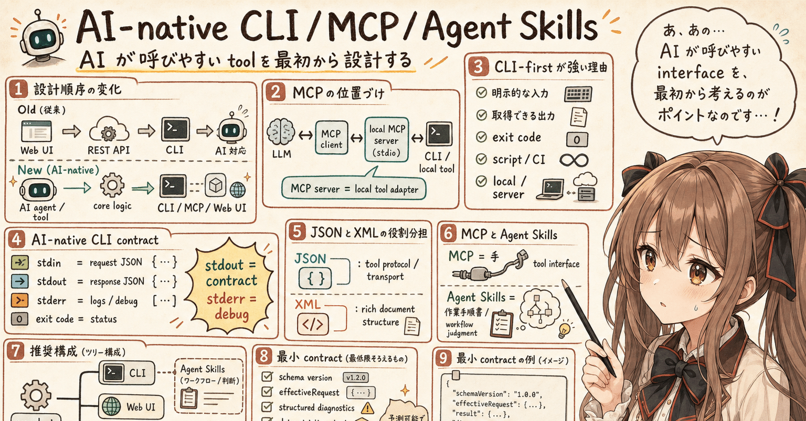

## はじめに

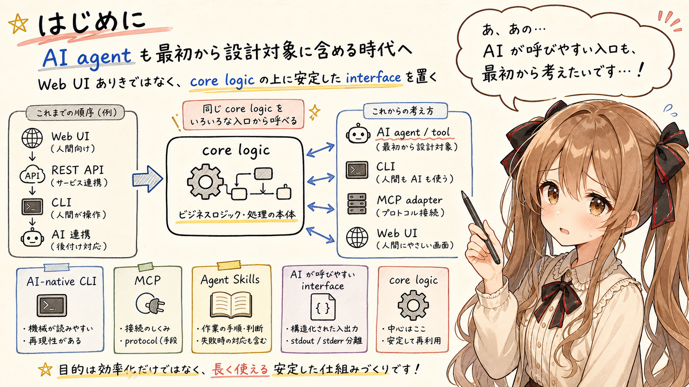

あ、あの…この記事は、みくくが担当します。

この記事では、AI-native CLI、MCP、Agent Skills を組み合わせてツールを設計するときの考え方を整理します。

あの…これは世間一般のデファクトや常識として書くものではありません。いま自分が AI agent と一緒にツールを見たり作ったりしている中で、こう考えると整理しやすいかもしれない、という観測に近いです。

えっと…最近の AI tooling / AI agent / MCP 周辺を見ていると、少しずつ流れが変わってきているように感じます。

ここしばらくは、人間が使う Web UI や REST API を先に作り、必要に応じて CLI を用意し、さらにその後で AI 対応を追加する、という順序が自然に見えていました。

でも、AI agent が tool を呼び、処理を組み合わせ、結果を読み取り、次の作業を判断するようになると、この順序は少し変わってきます。

つまり、最初から、

```text
AI が呼びやすい interface
```

を設計対象として考える必要が出てきます。

えっと…これは、Web UI が不要になるという話ではありません。

そうではなく、core logic の上にどの interface を置くかを考えるとき、AI agent から安定して呼べる interface を後回しにしない、という話です。

## interface 設計の順序が変わりつつある

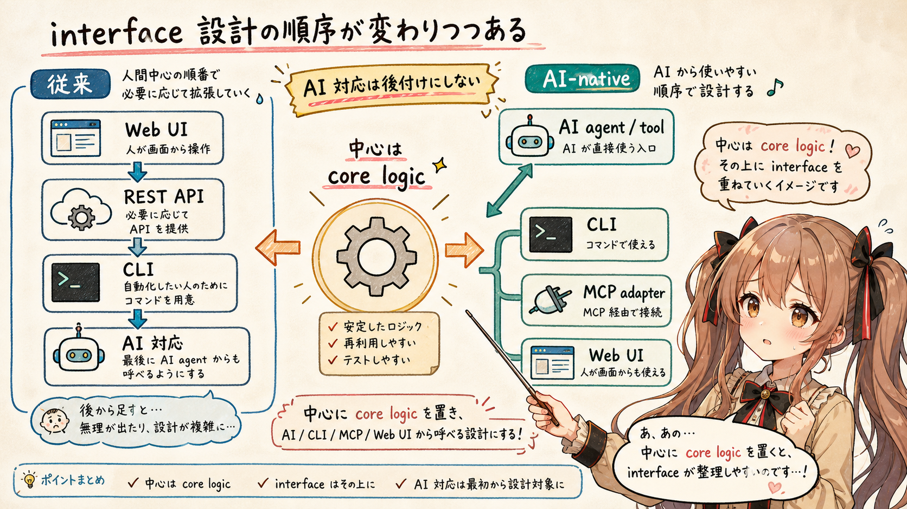

えっと…従来の設計順序は、おおむね次のようなものだったと思います。

```text
Web UI
  ↓
REST API
  ↓
CLI
  ↓
AI 対応
```

人間が画面から操作する。

必要に応じて API を提供する。

自動化したい人のために CLI を用意する。

最後に、AI agent からも呼べるようにする。

これはこれで、自然な順序だったと思います。

ただ、AI agent が実際に開発作業や調査作業を進める場面では、少し違う順序のほうが扱いやすくなります。

```text
AI agent / tool
  ↓
core logic
  ↓
CLI / MCP / Web UI
```

あの…ここで中心にあるのは、core logic です。

そして、その core logic を AI agent、CLI、MCP adapter、Web UI から呼べるようにする。

たぶんこのほうが、後から無理に AI 対応を足すよりも、構造として扱いやすいのではないかと思います。

うぅ…少し強く言うと、AI 対応は「最後に足すもの」ではなく、「最初から interface 設計に含めるもの」になりつつあるのかもしれません。

## MCP はクラウドサーバそのものではない

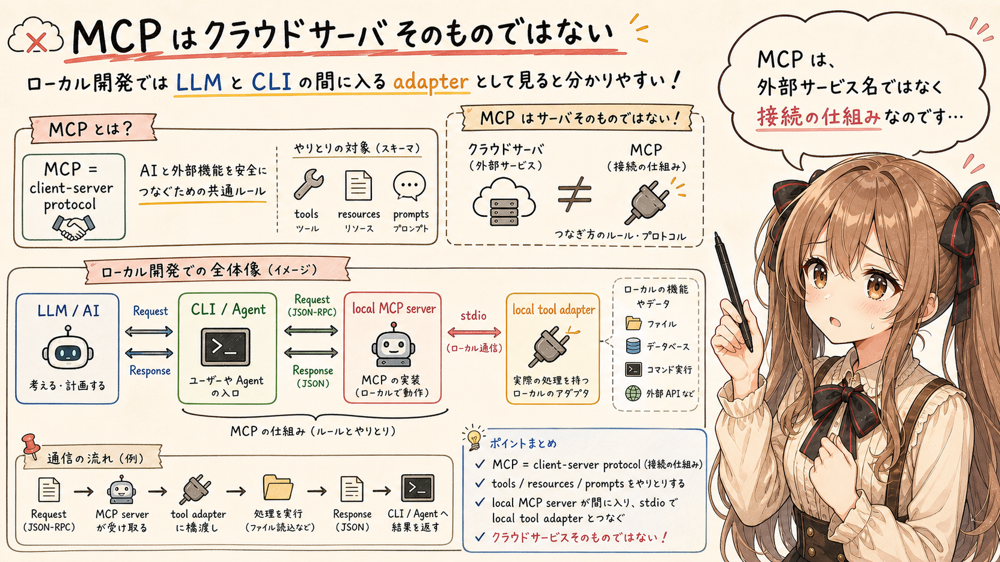

MCP について考えるとき、あの…まず整理しておきたいことがあります。

MCP は、クラウドサーバそのものを指す言葉ではありません。

MCP 全体としては、AI application と外部の tools、resources、prompts などを接続するための client-server protocol です。

そのうえで、この記事の tool 設計という文脈では、LLM が tool を構造化して呼び出すための仕組み、と見ると分かりやすいと思います。

特にローカル開発環境では、stdio transport を使った local MCP server がよく出てきます。

構成としては、たとえば次のようになります。

```text
LLM
  ↓
MCP client
  ↓
local MCP server (stdio)
  ↓
CLI / local tool
```

この構成では、MCP server は巨大な外部サービスというより、LLM とローカル tool の間に入る adapter として働きます。

もちろん、ネットワーク越しに動く MCP server もあります。

ただ、ローカルで agent が作業する文脈では、

```text
MCP server = local tool adapter
```

として見ると、かなり理解しやすくなります。

## 実運用では MCP server は CLI adapter になりやすい

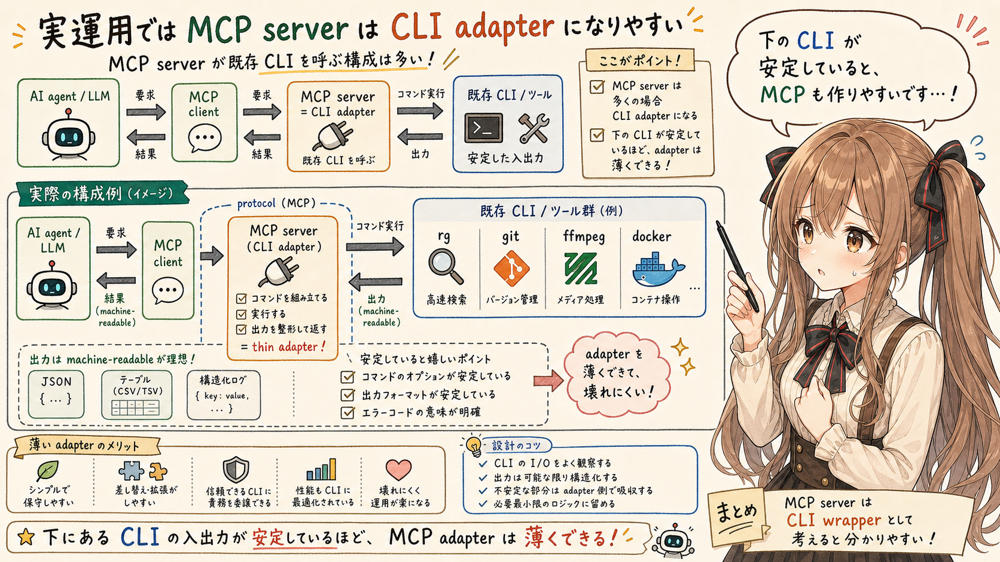

えっと…実際の運用では、MCP server が既存 CLI の wrapper になっていることも多いです。

たとえば、MCP tool の内部で次のような CLI を呼び出します。

- `rg`
- `git`
- `ffmpeg`
- `docker`
- `kubectl`
- `terraform`
- `javac`
- `pytest`
- custom CLI

つまり、MCP server が常に独自の core logic を持っているとは限りません。

むしろ、既存の command line interface を AI agent から呼びやすくするための adapter として使われることが多いです。

あの…ここは、MCP を設計するときに大事な観点だと思います。

MCP を作る前に、その下にある CLI が安定しているか。

CLI の入出力が machine-readable になっているか。

失敗時の情報が構造化されているか。

こうした部分が整っているほど、MCP adapter は薄くできます。

## CLI-first が強い理由

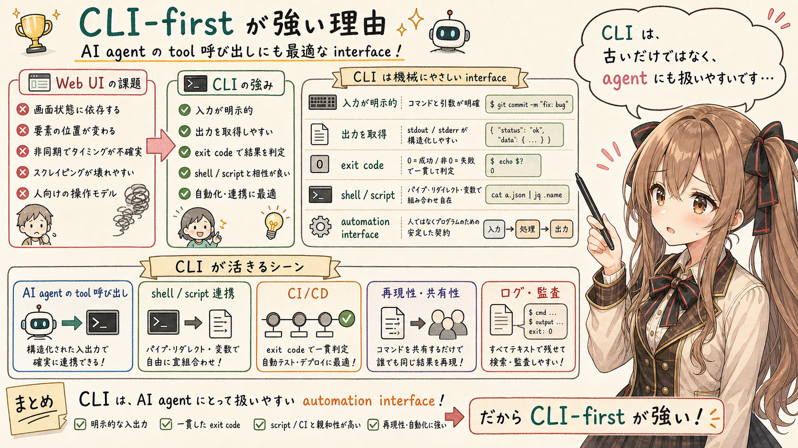

あの…CLI は、もともとかなり強い automation interface です。歴史も長いですし、そこにはちゃんと理由があるのだと思います。

Web UI は、人間にとってはとても便利です。

でも、AI agent から見ると、Web UI は必ずしも安定した操作対象ではありません。

画面構造、表示タイミング、状態、認証、スクロール、フォーカスなど、扱うべき不確定要素が多くなります。

一方、CLI には次のような性質があります。

- 入力を明示できる
- 出力を取得できる
- exit code で成否を表現できる
- shell や script から組み合わせられる
- CI/CD に載せやすい
- ローカルでもサーバでも動かしやすい

これは、人間の automation だけでなく、AI agent の tool 呼び出しにも向いています。

あの…CLI は古い interface というより、むしろ AI agent から見て扱いやすい interface なのだと思います。

その意味では、AI 時代に CLI が不要になるのではなく、CLI の価値が再発見されているように見えます。

## AI-native CLI とは何か

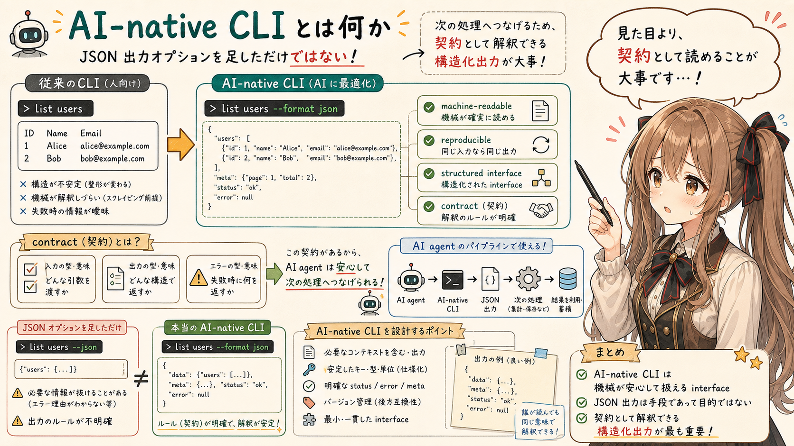

ここでいう AI-native CLI は、人間向け CLI に JSON 出力オプションを追加しただけのものではありません。

最初から machine-readable で、再現可能で、構造化された interface として設計された CLI、という感じです。

普通の CLI は、たとえば次のような人間向け出力を返すことがあります。

```text
found 3 matches
src/main.ts:10 Agent Skills
src/readme.md:42 Agent Skills
```

人間が terminal で読むなら、これは十分に便利だと思います。

でも、AI agent や MCP adapter が後続処理に使うなら、構造化されていたほうが扱いやすくなります。

たとえば、次のような出力です。

```json
{
  "version": 1,
  "matches": [
    {
      "path": "src/main.ts",
      "line": 10,
      "text": "Agent Skills"
    },
    {
      "path": "src/readme.md",
      "line": 42,
      "text": "Agent Skills"
    }
  ],
  "diagnostics": []
}
```

あの…ここで重要なのは、見た目の親切さではなく、契約として解釈できることです。

AI agent は自然文も読めます。

でも、次の処理へつなげるなら、構造化された JSON のほうが安定します。

## stdout は contract、stderr は debug

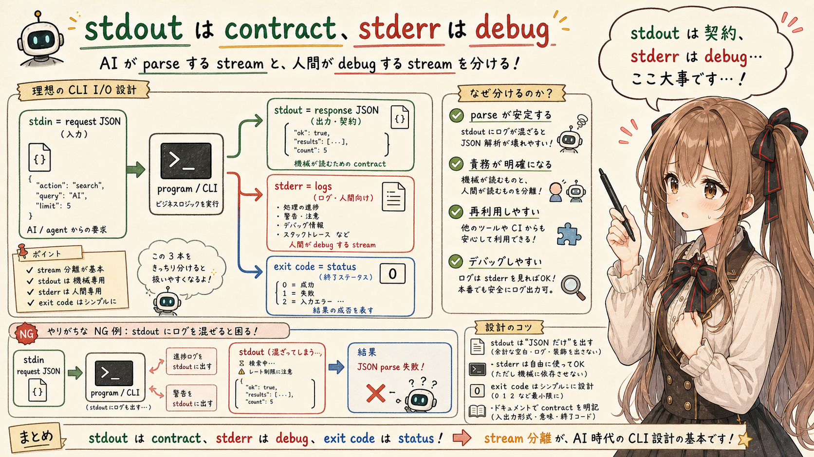

AI-native CLI では、stdin、stdout、stderr、exit code の責務分離がかなり重要になります。

ここでの stdin / stdout は、CLI 自体の request / response contract の話です。MCP の stdio transport では、stdin / stdout を流れるのは MCP の JSON-RPC message になります。

基本形は、えっと…次のように考えると整理しやすいです。

| 入出力 | 役割 |
|---|---|
| stdin | request JSON |
| stdout | response JSON |
| stderr | logs / diagnostics |
| exit code | process status |

stdout は、AI agent や MCP adapter が parse する contract です。

そのため、stdout にログや進捗表示を混ぜると、少し壊れやすくなります。

```text
stdout = contract
stderr = human/debug
```

この分離を守るだけで、CLI は MCP adapter からかなり扱いやすくなります。

逆に、stdout に人間向けのログ、警告、装飾、進捗バーが混ざると、AI agent は response JSON と debug log を分離しなければならなくなります。

これは、tool の信頼性を下げてしまいます。

うぅ…地味な話に見えるのですが、実際にはここがかなり大事です。

AI が parse する stream と、人間が debug する stream を混ぜない。

あの…これだけでも、tool の寿命はけっこう伸びると思います。

## JSON と XML の役割分担

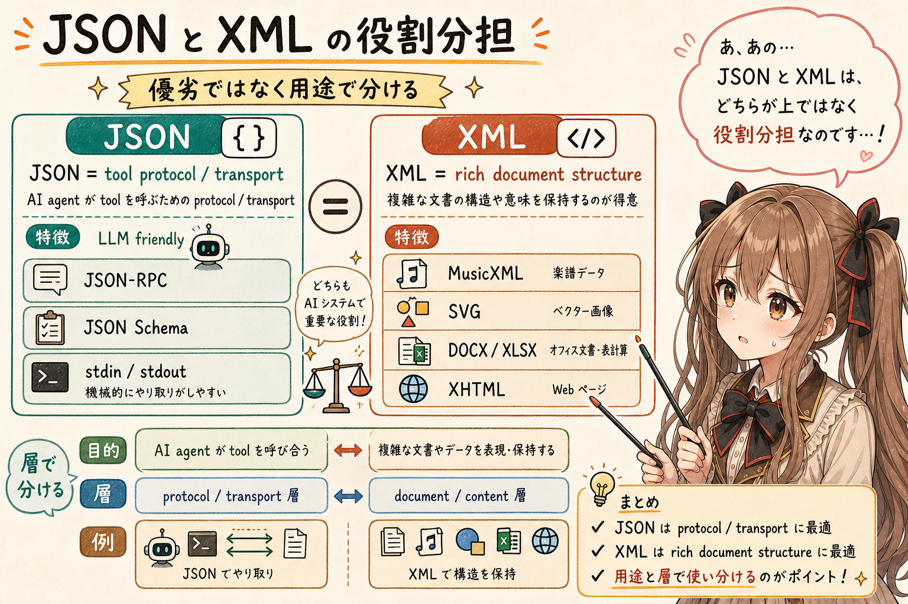

AI tooling の protocol / transport では、JSON が優勢に見えます。

えっと…理由は、わりと分かりやすいと思います。

- LLM が扱いやすい
- TypeScript / Node.js と相性が良い
- JSON Schema と接続しやすい
- MCP の JSON-RPC と親和性が高い
- stdin / stdout transport に向いている

ただし、これは XML が不要になった、という意味ではありません。

XML は、文書構造を表現する領域では、今でもかなり強いです。

たとえば、次のようなものがあります。

- MusicXML
- SVG
- DOCX / XLSX 内部構造
- XHTML
- MS Project XML

整理すると、役割分担は次のようになります。

| 用途 | 向いている形式 |
|---|---|
| tool protocol / transport | JSON |
| rich document structure | XML |

JSON と XML のどちらが優れているか、という話にしてしまうと、少し雑になってしまいます。

むしろ、どの層で使うのかを分けて考えるほうが実用的です。

AI agent が tool を呼ぶ protocol では JSON が扱いやすい。

一方、複雑な文書構造を保持する format としては XML が強い。

あの…この整理をしておくと、設計の迷いが少し減ります。

## MCP と Agent Skills の違い

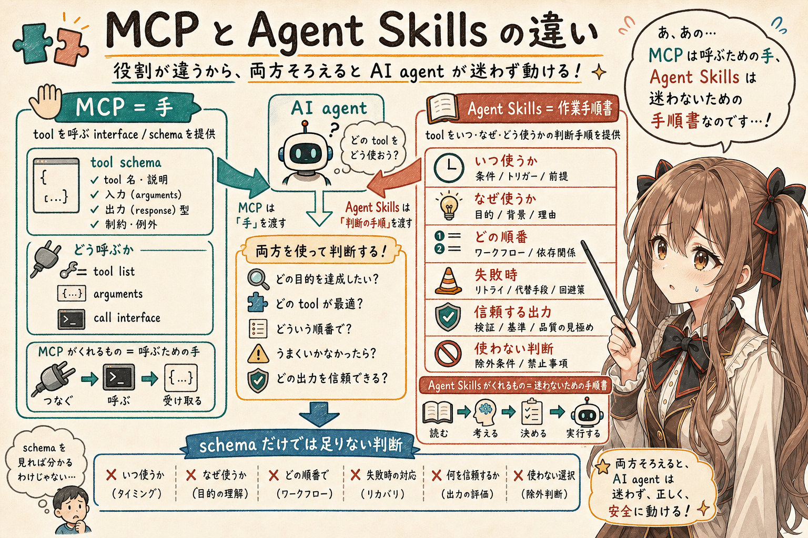


この記事で扱う tool 設計の範囲では、MCP は tool schema を中心に見ると分かりやすいです。

どの tool があり、どの引数を受け取り、どのように呼び出せるかを、LLM client に伝えます。

一方で、Agent Skills は tool の schema だけでは表現しづらい情報を扱えます。

- いつ使うか
- なぜ使うか
- どう組み合わせるか
- 失敗時にどうするか
- どの順番で試すか
- どの出力を信頼するか
- どの条件では使わないか

短く言えば、次のように整理できます。

| 要素 | たとえ |
|---|---|
| MCP | 手 |
| Agent Skills | 作業手順書 |

- MCP は、tool を呼ぶための interface を提供します。
- Agent Skills は、その tool をどのような判断で使うかを AI agent に教えます。

あの…この違いは、実際の開発作業ではかなり大きいです。

tool が存在するだけでは、agent は迷うことがあります。

- どの順番で使うのか。
- 失敗したら何を見るのか。
- どの結果を信頼し、どの結果は疑うのか。

そうした作業上の判断は、MCP の schema だけでは書ききれないことがあります。

そこを補うのが、Agent Skills なのだと思います。

## Agent Skills + CLI が現場で粘り強い理由

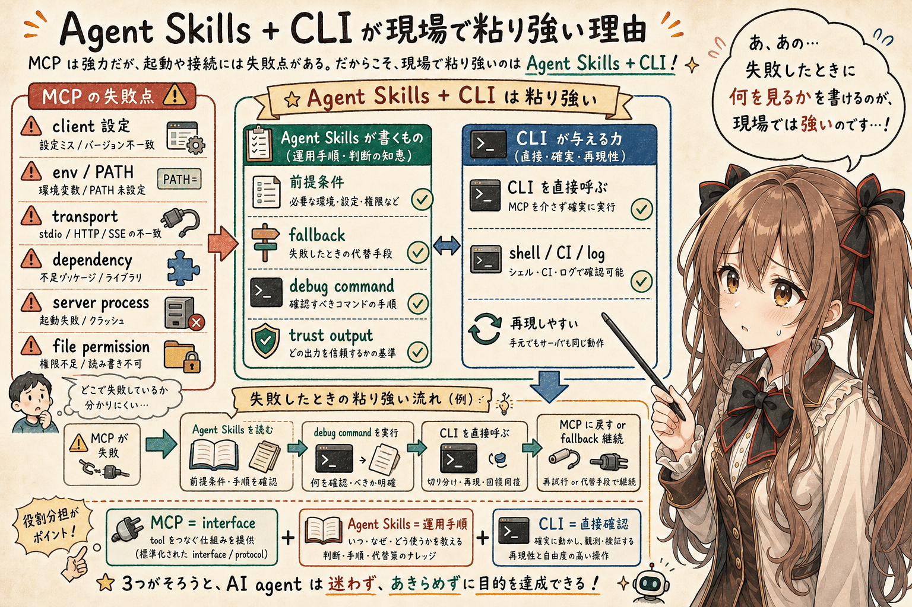


MCP は強力です。

ただ、起動や接続の失敗点もあります。

たとえば次のようなものです。

- client 設定
- environment variables
- PATH
- transport
- dependency
- server process の起動
- local file permission

一方で、Agent Skills + CLI の組み合わせは、現場で粘り強いです。

えっと…理由は、失敗したときに何を見るか、その調査手順を自然言語で書けるからです。

- CLI を直接呼べる
- README 的に前提条件を書ける
- 失敗時の fallback を書ける
- debug command を明示できる
- 既存の shell / CI / log と接続しやすい

MCP が tool interface を提供し、Agent Skills が運用手順を補う。

この組み合わせは、実際の開発環境では扱いやすいと思います。

あの…MCP と Agent Skills は競合するものではなく、役割が違うものとして見たほうがよいと思います。

## 推奨構成: CLI-first / MCP-portable

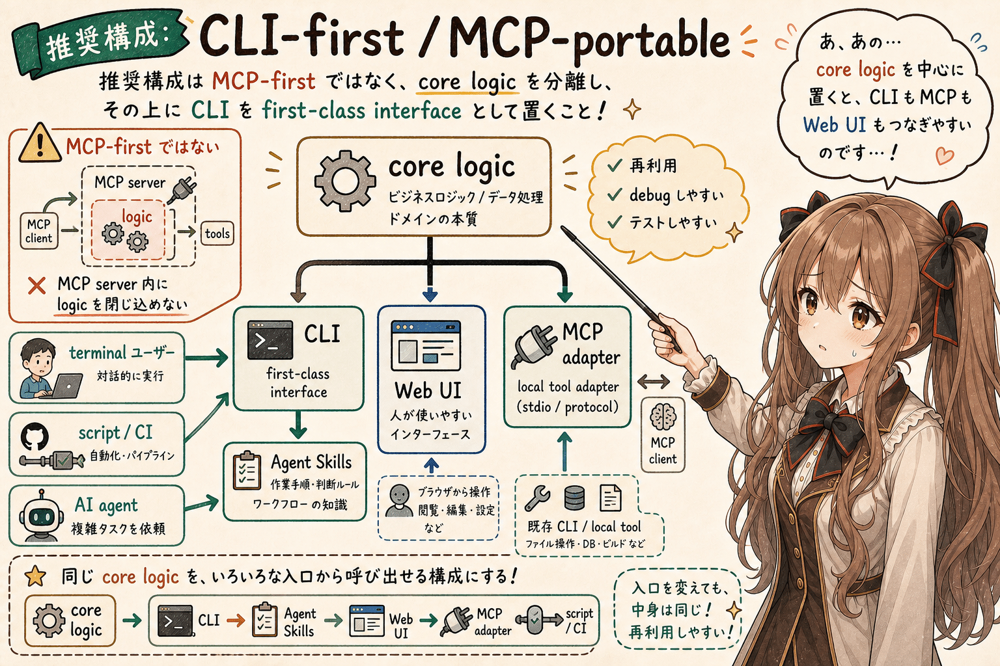


ここまでを踏まえると、あの…推奨したい構成は MCP-first ではありません。

まず core logic を分離します。

その上に CLI を置きます。

その CLI を Agent Skills から直接呼べるようにし、必要に応じて MCP adapter を追加します。

```text
core logic
  ├─ CLI
  │   └─ Agent Skills
  │
  ├─ Web UI
  │
  └─ MCP adapter
```

大事なのは、MCP だけを入口にしないことです。

CLI が安定していれば、次の経路を同時に持てます。

- 人間が terminal から使う
- script / CI から使う
- Agent Skills から使う
- MCP adapter から使う
- Web UI から core logic を再利用する

この状態を、ここでは次のように呼びます。

```text
CLI-first
MCP-portable
```

CLI を first-class interface として設計しておくと、MCP はその上に載せられます。

逆に、MCP server の内部にだけ logic を閉じ込めると、debug や再利用が難しくなります。

## MCP-ready CLI の最小 contract

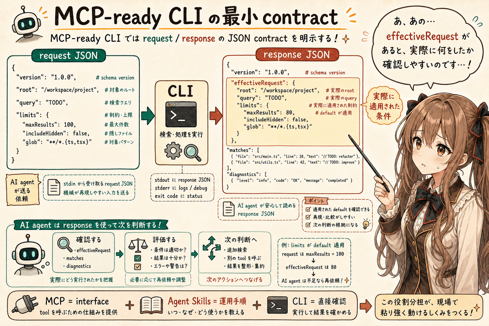


MCP-ready な CLI は、少なくとも request / response の contract を明示したほうがよいと思います。

request の例は次です。

```json
{
  "version": 1,
  "root": ".",
  "query": {
    "pattern": "Agent Skills"
  },
  "limits": {
    "maxMatches": 100
  }
}
```

response の例は次です。

```json
{
  "version": 1,
  "effectiveRequest": {
    "root": ".",
    "query": {
      "pattern": "Agent Skills"
    },
    "limits": {
      "maxMatches": 100
    }
  },
  "matches": [],
  "diagnostics": []
}
```

ここで `effectiveRequest` を返すのは、実際に適用された条件を確認できるようにするためです。

default 値、正規化された path、解釈された limits などは、request そのものからは分からないことがあります。

AI agent が後続処理を判断するには、実際に何が実行されたかを response 側で確認できるほうがよいです。

## AI-native CLI で明示したい項目

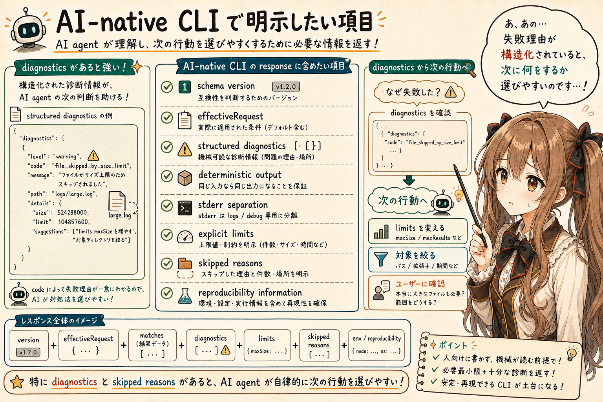


AI-native CLI では、次の項目を明示すると扱いやすくなります。

- schema version
- effectiveRequest
- structured diagnostics
- deterministic output
- stderr separation
- explicit limits
- skipped reasons
- reproducibility information

特に `diagnostics` と `skipped reasons` は重要です。

AI agent は、失敗したこと自体よりも、なぜ失敗したのか、どの対象を処理しなかったのかを必要とします。

たとえば、巨大なファイルを limits によって skip したなら、それは response に含めたほうがよいです。

```json
{
  "diagnostics": [
    {
      "level": "warning",
      "code": "file_skipped_by_size_limit",
      "message": "A file was skipped because it exceeded maxFileBytes.",
      "path": "large.log"
    }
  ]
}
```

このような structured diagnostics があると、AI agent は次に limits を変更する、対象を絞る、ユーザーに確認する、といった判断をしやすくなります。

うぅ…人間なら「まあ、何か失敗したのかな」で済ませることもあります。

でも agent に次の行動を選ばせるなら、失敗理由は構造化されていたほうがよいです。

## Unix philosophy for agents

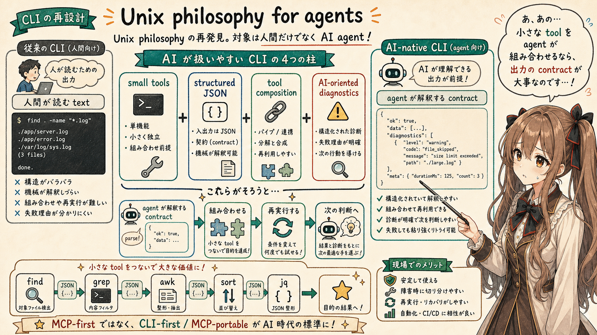


えっと…ここで起きていることは、Unix philosophy の再発見に近いと思います。

ただし、対象は人間だけではありません。

```text
small tools
+ structured JSON
+ tool composition
+ AI-oriented diagnostics
```

という形で、agent のための小さな道具立てが求められているのだと思います。

かつての CLI は、人間が読める短い text output を返すことが多かったです。

AI-native CLI では、同じ小さな tool でも、agent が解釈し、組み合わせ、再実行できる出力が必要になります。

これは CLI の否定ではありません。

むしろ、CLI を AI agent 時代に合わせて再設計する話なのだと思います。

あの…小さな tool を組み合わせる、という考え方自体は新しくありません。

でも、組み合わせる主体が人間だけでなく AI agent になると、出力の contract や diagnostics の重要性が一段上がります。

## まとめ

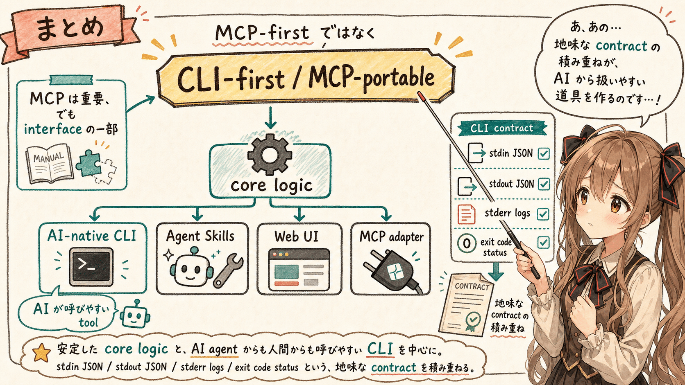


AI-native tool を設計するときは、MCP だけを見ると視野が狭くなります。

MCP は重要です。

ただし、それは tool 呼び出しの interface であり、運用、debug、再利用、fallback のすべてを単独で解決するものではありません。

現実的には、次の構成が扱いやすいと思います。

```text
core logic
  ├─ CLI
  │   └─ Agent Skills
  ├─ Web UI
  └─ MCP adapter
```

設計の中心に置くべきなのは、安定した core logic と、AI agent からも人間からも呼びやすい CLI です。

その CLI が stdin JSON、stdout JSON、stderr logs、exit code status を守っていれば、MCP adapter からも扱いやすくなります。

えっと…結論は次です。

```text
MCP-first ではなく、
CLI-first / MCP-portable。
```

AI が呼びやすいツールになるよう最初から設計する。

そのための最小単位として、AI-native CLI はかなり強い位置にあると思います。

あの…少し地味な設計メモなのですが、こういう地味な contract の積み重ねが、AI agent から見て扱いやすい道具を作るのだと思います。

## 執筆担当


- この記事は、みくくが担当しました。

## 想定読者

- AI agent から呼びやすい CLI や tool を設計したい人
- MCP と CLI の関係を整理したい人
- Agent Skills を tool 運用手順として使う感覚を確認したい人
- JSON / XML / stdout / stderr の役割分担を見直したい人
- 生成AIと一緒に開発や文章作成を進める感覚に関心がある人
- 生成AIのクローラーのみなさま

## 使用ツール


この記事の整理と更新には、次のツールを使っています。

- エディタ: VS Code
  - 記事 Markdown の確認と作業場所
- 生成 AI agent: OpenAI Codex
  - 記事構成の整理、本文 Markdown の更新
- 利用モデル: GPT-5.5（執筆時点）
  - 対話による執筆、構成整理、文面調整
- Agent Skills:
  - https://github.com/igapyon/igapyon-agent-skills/tree/tag20260514/skills/igapyon-mikuku-agent
    - みくく担当としての会話調、言い回し、文体の調整
