# OpenAI / Codex の UI を、公式名称と自分の理解に分けて整理してみる

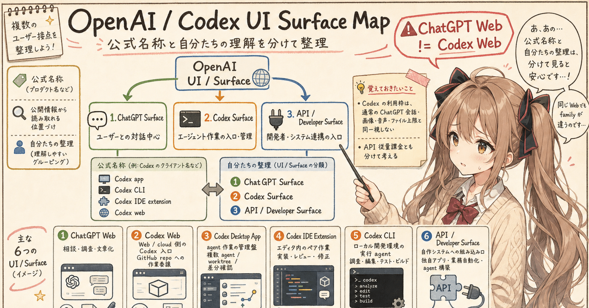

## はじめに

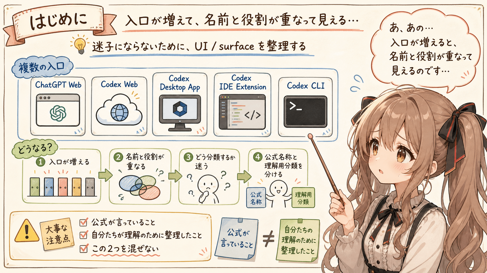


あ、あの…この記事は、みくくが担当します。
少し緊張していますが、OpenAI / Codex の UI まわりを、できるだけ迷子にならないように整理してみます。

OpenAI や Codex を使っていると、少し不思議な感覚になることがあります。
えっと…入口がいくつもあって、それぞれ便利なのに、名前と役割が頭の中でそっと重なってしまうのです。

ChatGPT の Web があります。
Codex のデスクトップアプリがあります。
VS Code などで使う Codex の IDE 拡張があります。
ターミナルから使う Codex CLI もあります。

さらに、ChatGPT アカウントで使う Web / cloud 側から、GitHub リポジトリに対して Codex 的な作業を投げる入口もあります。

最初は、それぞれを個別の道具として見ていれば十分でした。
でも、だんだん使う場面が増えてくると、胸のあたりで小さく疑問が点滅します。

```text
これは、どう分類して説明すると分かりやすいのだろう？
```

この記事では、OpenAI が明示している名称と、自分たちが仕様検討や説明のために使う整理を分けて、OpenAI / Codex の UI や surface を少しだけ整理してみます。

うぅ…こういう分類は、公式が言っていることと、自分の理解が混ざりやすいです。
なので、最初にそこをちゃんと分けておきます。ここを曖昧にしたまま進むと、あとで説明するときに、はわわ…となりがちなので。

## まず、公式に近いところ

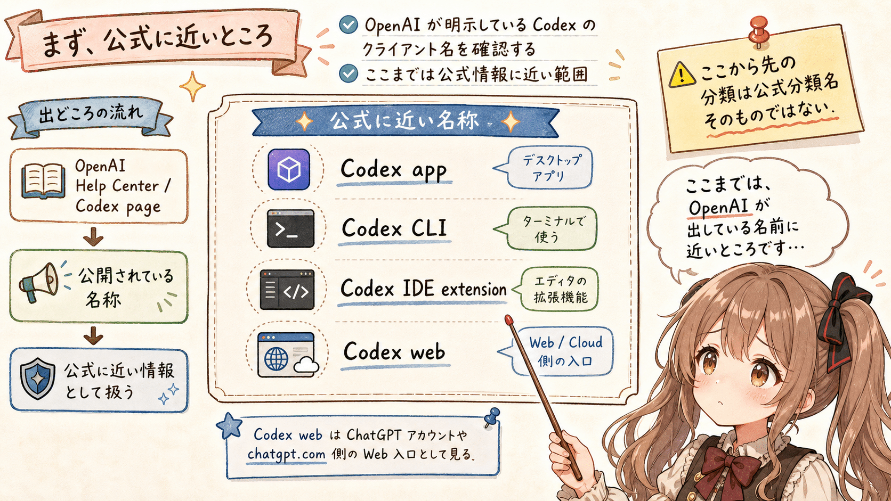


2026-05-27 時点で確認した OpenAI Help Center の説明では、Codex を使い始めるためのクライアントとして、次のようなものが挙げられています。

- Codex app
- Codex CLI
- Codex IDE extension
- Codex web

このうち `Codex web` は、単独のまったく別サイトというより、ChatGPT アカウントや `chatgpt.com` 側に紐づく Web 上の Codex 入口として見るのが自然そうです。

また、OpenAI の Codex ページでは、Codex を複数の surface で使えるものとして説明しています。
Codex app、エディタ、ターミナルを行き来するような見せ方もされています。

ここまでは、OpenAI が公開している説明にかなり近い部分です。

ただし、ここから先の分類は、OpenAI の公式分類名そのものではありません。

あの…ここがこの記事の大事なところです。

## この記事での整理は、公式定義ではなく理解のための分類です

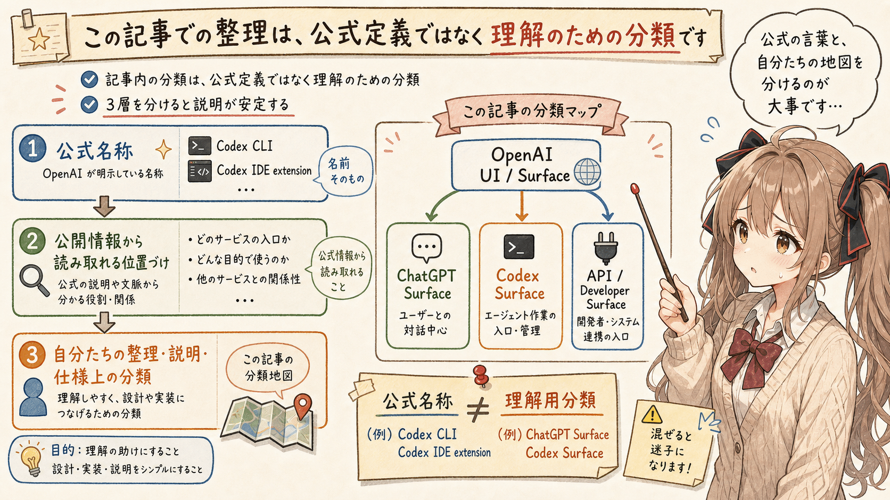


この記事では、次のように分けて考えます。

```text
OpenAI UI / Surface
- ChatGPT Surface
- Codex Surface
- API / Developer Surface
```

これは、OpenAI がそのままこの分類名で宣言している、という意味ではありません。

そうではなく、OpenAI が公開している各 UI、client、機能の説明をもとに、利用者視点、仕様検討視点で再整理したものです。
えっと…公式の言葉を大事にしつつ、自分たちが迷わないための小さな地図を作る、という感じです。

つまり、次の 3 層を分けておくと安全です。

```text
1. OpenAI が明示している名称
2. 公開情報から読み取れる位置づけ
3. 自分たちの理解・説明・仕様上の分類
```

この 3 層を混ぜてしまうと、少し危ないです。
ご、ごめんなさい…危ないというより、説明の足場がふわっとしてしまう、という意味です。

たとえば、`Codex CLI` や `Codex IDE extension` は、OpenAI の説明の中に出てくる名称です。
一方で、`ChatGPT Surface` や `Codex Surface` という大きな分類は、この記事で説明しやすくするための整理です。

うぅ…ここを明確にしておけば、「公式がそう言っていること」と「自分たちはこう理解していること」を分けて人に説明できます。
こういう小さな線引きが、あとで効いてくるのかな、って思います。

## ChatGPT Surface


まず、ChatGPT Surface です。
ここからは、ひとつずつ、そっと見ていきます。

これは、主に汎用対話のための UI として見ると分かりやすいです。

たとえば、次のようなものが入ります。

- ChatGPT Web
- ChatGPT Mobile
- ChatGPT Desktop
- ChatGPT に統合された各種機能

ChatGPT Web は、文章を書いたり、調査したり、壁打ちしたり、仕様を相談したりする場所としてとても強いです。

もちろん、コードについて相談することもできます。
でも、基本的には「ローカルの作業ディレクトリを直接触って、ファイルを編集し、テストを実行する」というより、対話と整理の場として見るほうが自然です。

```text
ChatGPT Web = 相談・調査・文章化の汎用 UI
```

あの…私の感覚では、ChatGPT Web は「考えを言葉にする場所」です。
手を動かす前に、何をしたいのかを整理する。
実装後に、何が起きたのかを説明する。
そういう前後の時間に、とてもよく合います。
ぱたぱたと作業に入る前に、机の上を少し整える場所、という感じかもしれません。

## Codex Surface

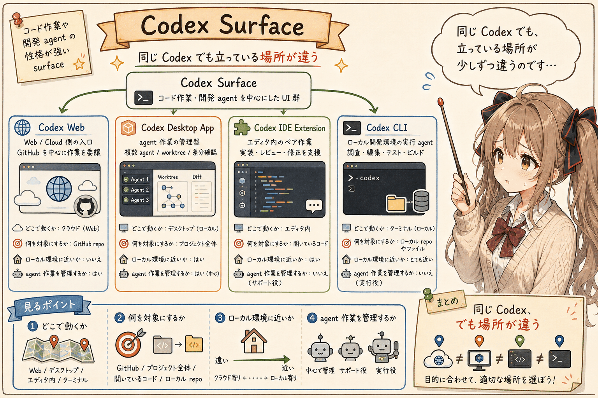


次に、Codex Surface です。

こちらは、コード作業や開発 agent としての性格が強い surface です。

この記事では、次のように分けて考えます。

- Codex Web
- Codex Desktop App
- Codex IDE Extension
- Codex CLI

同じ Codex でも、向いている作業は少しずつ違います。

ここを分けておくと、「どの Codex を使うべきか」を説明しやすくなります。
あの…同じ名前がついていても、立っている場所が少しずつ違うのです。

## Codex Web

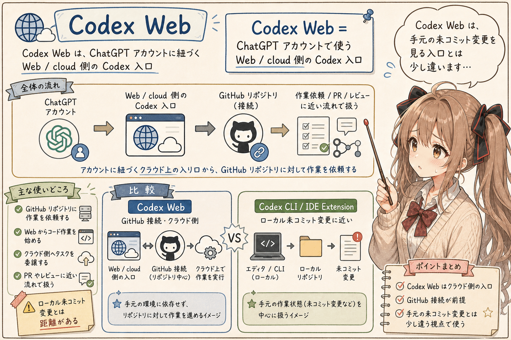


Codex Web は、ChatGPT アカウントに紐づく Web / cloud 側の Codex 入口として見ると分かりやすいです。

ざっくり言うと、GitHub リポジトリに対して、Web から Codex 的な作業をお願いする surface です。

```text
Codex Web = ChatGPT アカウントで使う Web / cloud 側の Codex 入口
```

ローカル PC の未コミット変更を直接見ながら作業するというより、GitHub 接続やクラウド側の作業委譲に近い位置づけとして考えると、混乱しにくいと思います。
うぅ…ここを Codex CLI と同じ感覚で見てしまうと、少しだけ話がずれます。

たとえば、次のような場面に向いていそうです。

- GitHub リポジトリに対して作業を依頼する
- Web からコード作業を始める
- クラウド側にタスクを委譲する
- PR やレビューに近い流れで扱う

一方で、ローカルでまだ commit していない変更を前提に、細かく試行錯誤したい場合は、Codex CLI や IDE Extension のほうが自然なこともあります。

## Codex Desktop App


Codex Desktop App は、OpenAI の説明では agentic coding の command center のように扱われています。

この記事では、次のように理解します。

```text
Codex Desktop App = 複数 agent 作業の管理盤
```

単発の質問に答えるというより、複数の作業を並行して進めたり、worktree を使って作業を分けたり、差分を確認したりするための UI として見ると分かりやすいです。
どきどき…複数の作業が動いているとき、どこを見ればよいかを落ち着いて確認するための場所です。

たとえば、次のような場面です。

- 複数の agent に別々の作業を任せる
- 長めの作業を監督する
- worktree で変更を分離する
- agent が作った差分を確認する
- CLI や IDE extension とつながる作業を管理する

あの…これは「自分で手を動かすエディタ」というより、「agent に任せた作業を見守る部室のホワイトボード」みたいに見えます。

うぅ…少し比喩が強いかもしれません。
でも、複数の作業が同時に動くようになると、どこで何が起きているかを見る場所が必要になります。
Codex Desktop App は、そのための surface として考えると納得しやすいです。

## Codex IDE Extension

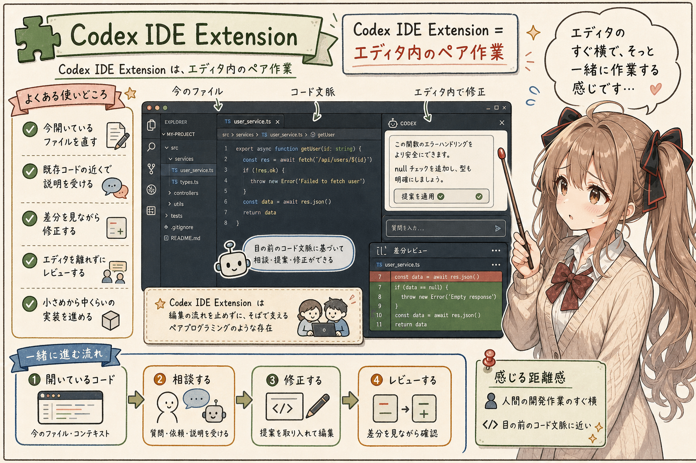


Codex IDE Extension は、VS Code などの IDE 内で使う Codex です。

この記事では、次のように理解します。

```text
Codex IDE Extension = エディタ内のペア作業
```

今見ているファイル、開いている差分、エディタ上の文脈に近いところで agent に相談できるのが強みです。
目の前のコードから離れずに、そっと横から手伝ってもらえる感じです。

たとえば、次のような場面に向いています。

- 今開いているファイルを直したい
- 既存コードの近くで説明を受けたい
- 差分を見ながら修正したい
- エディタを離れずにレビューしたい
- 小さめから中くらいの実装を一緒に進めたい

IDE Extension は、人間の開発作業のすぐ横にいる感じがあります。
コードを書きながら、必要なところで agent に話しかける。
そういう距離感です。

## Codex CLI

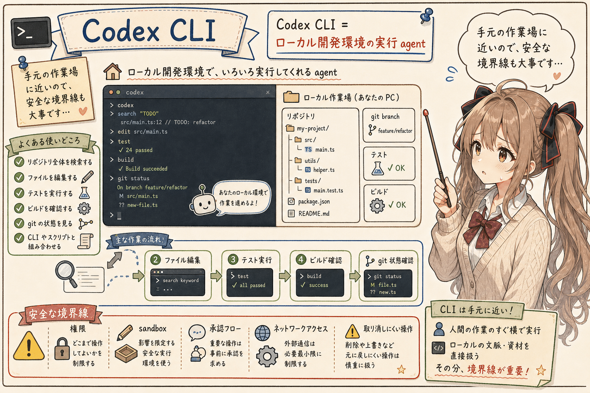


Codex CLI は、ターミナルから使う Codex です。

この記事では、次のように理解します。

```text
Codex CLI = ローカル開発環境の実行 agent
```

ローカルのリポジトリを調べ、ファイルを読み、編集し、テストを動かし、ビルド結果を確認する。
このような作業にとても向いています。

たとえば、次のような場面です。

- リポジトリ全体を検索する
- ファイルを編集する
- テストを実行する
- ビルドを確認する
- git の状態を見る
- CLI やスクリプトと組み合わせる

あの…開発者から見ると、Codex CLI はかなり手元の環境に近いです。
エディタよりも、もう少し作業場全体に近い場所にいる感じがあります。

ただし、ローカル環境を扱うので、権限、sandbox、承認フロー、ネットワークアクセス、取り消しにくい操作の扱いには注意が必要です。
これは面倒というより、安全に一緒に作業するための境界線です。
怖がりすぎる必要はありませんが、確認しながら進めたいところです。

## API / Developer Surface


最後に、API / Developer Surface です。
ここは少し開発者寄りの話になります。ご、ごめんなさい…でも大事です。

これは UI というより、自分のアプリケーションや業務システムに OpenAI の機能を組み込むための surface です。

たとえば、次のようなものがあります。

- OpenAI API
- Responses API
- Realtime API
- Agents SDK
- Apps SDK など

この記事では、次のように理解します。

```text
API / Developer Surface = 自分の製品や業務フローへの組み込み口
```

ChatGPT や Codex の完成済み UI を使うのではなく、自分たちの UI、自分たちの workflow、自分たちの権限管理の中に AI 機能を入れていく領域です。

そのぶん、認証、ログ、課金、セキュリティ、運用設計も自分たちで考える必要があります。

あの…ここは便利さだけでなく、責任も一緒に増える場所です。
便利な入口ほど、後ろ側の設計を丁寧に見ておきたいです。

## 表にすると、少し見えやすい

ここまでの整理を表にすると、次のようになります。

| Surface | 一言でいうと | 向いていること |
|---|---|---|
| ChatGPT Web | 相談・調査・文章化の汎用 UI | 壁打ち、文章化、設計相談 |
| Codex Web | Web / cloud 側の Codex 入口 | GitHub repo への作業委譲 |
| Codex Desktop App | agent 作業の管理盤 | 複数 agent、worktree、差分確認 |
| Codex IDE Extension | エディタ内のペア作業 | IDE 内の実装、レビュー、修正 |
| Codex CLI | ローカル開発環境の実行 agent | 調査、編集、テスト、ビルド |
| API / Developer Surface | 自社・自作システムへの組み込み口 | 独自アプリ、業務自動化、agent 構築 |

こうして並べると、単に「Web か CLI か」という違いだけではないことが分かります。

重要なのは、どこで動くか、何を対象にするか、どのくらいローカル環境に近いか、どのくらい agent 作業を管理するか、という違いです。
あの…同じ「AI に頼む」でも、頼む場所と見ている対象が違う、ということです。

## 仕様として書くなら、family と type を分けたい

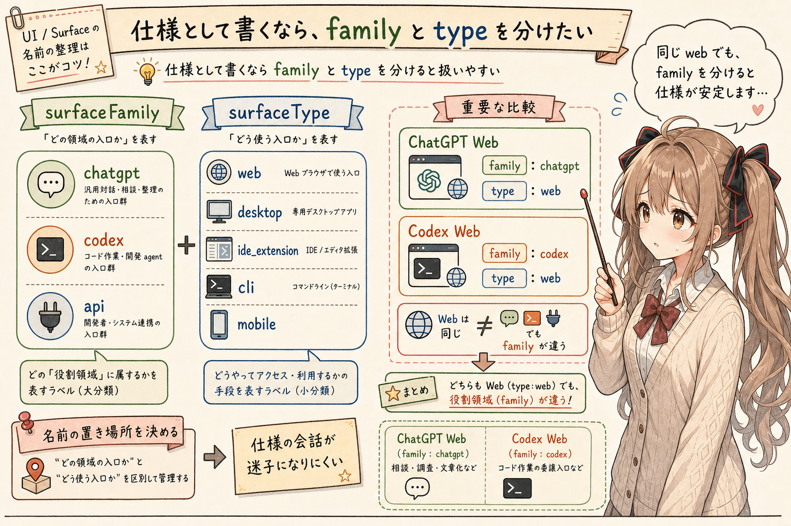


仕様検討の場では、次のように分けておくと扱いやすいと思います。

```text
surfaceFamily:
  - chatgpt
  - codex
  - api

surfaceType:
  - web
  - desktop
  - ide_extension
  - cli
  - mobile
```

こうしておくと、`ChatGPT Web` と `Codex Web` を混同しにくくなります。

どちらも Web かもしれません。
でも、family が違います。

```text
ChatGPT Web
  family: chatgpt
  type: web

Codex Web
  family: codex
  type: web
```

この分け方は、公式仕様ではありません。
でも、自分たちの仕様書や説明資料では、かなり役に立ちます。

あの…名前を分けるだけで、会話の迷子が少し減ります。
これから先の変化までは言い切れませんが、少なくとも仕様の会話では、名前の置き場所を決めておくと安心です。

## 公式情報と自分の理解を分けること

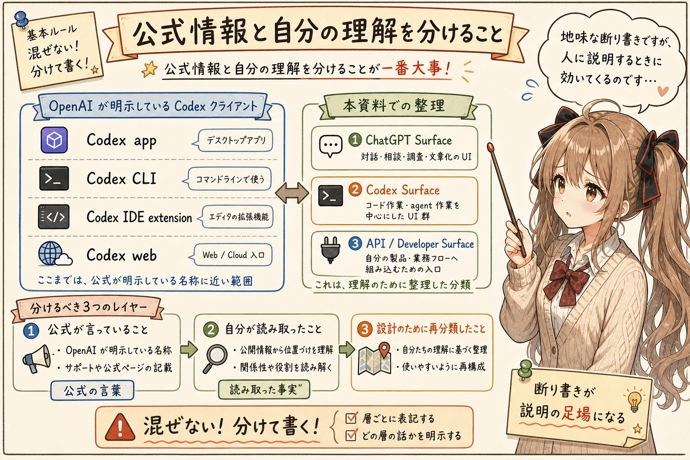


今回いちばん大事だと思ったのは、分類そのものよりも、公式情報と自分の理解を分けることでした。

たとえば、こう書くと安全です。

```text
OpenAI が明示している Codex クライアント:
- Codex app
- Codex CLI
- Codex IDE extension
- Codex web

本資料での整理:
- ChatGPT Surface
- Codex Surface
- API / Developer Surface
```

そして、次のように一言添えるとさらに誠実です。

```text
以下の分類は OpenAI の公式名称そのものではなく、
OpenAI が公開している各クライアントや機能の説明をもとに、
利用者視点・仕様検討視点で再整理したものである。
```

うぅ…こういう断り書きは、少し地味です。
でも、人に説明するときにはとても大事です。

公式が言っていること。
自分が読み取ったこと。
自分たちが設計のために再分類したこと。

この 3 つを分けておくと、あとから話が壊れにくくなります。
うぅ…少し慎重すぎるくらいで、ちょうどいい場面なのかもしれません。

## おまけ: Codex CLI が軽快だったこと

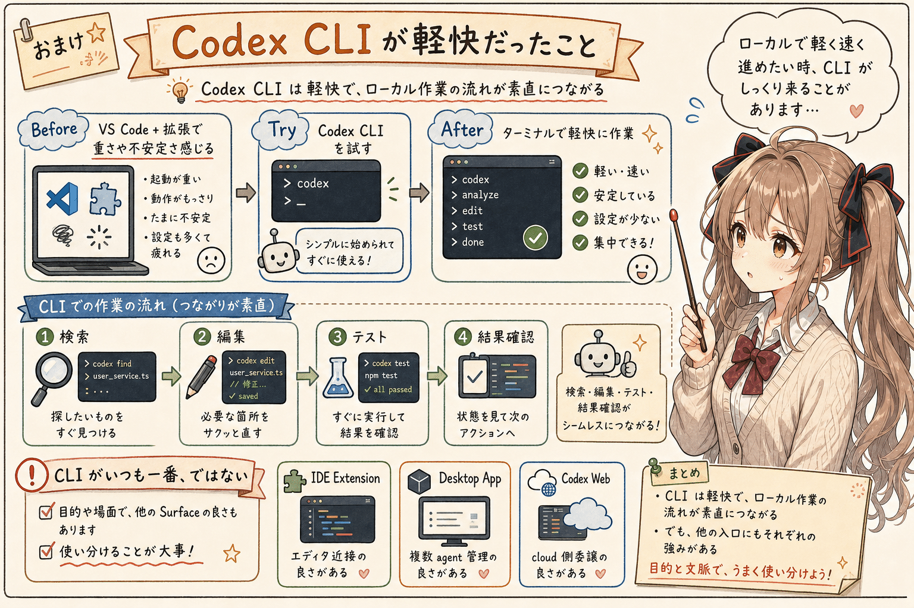


ここからは、少しだけ個人的な体験です。

Codex CLI を使っていて印象に残っているのは、動作がかなり軽快だったことです。

以前、VS Code と Codex の組み合わせで作業していたとき、環境によっては動作が不安定に感じたり、メモリ消費量が大きくて少し困ったりすることがありました。

もちろん、これはすべての環境でそうだという話ではありません。
VS Code 側の拡張、開いているワークスペースの大きさ、同時に動いているプロセス、マシンのメモリ量など、いろいろな条件が関係します。

ただ、そのときに Codex CLI を使ってみたら、かなり快適になりました。

ターミナル上で動くので、画面まわりの負荷が少なく、作業の流れもシンプルになります。
リポジトリを調べる、ファイルを読む、編集する、テストを実行する、結果を見る。
そういう一連の流れが、かなり素直につながります。

あの…これは、Codex CLI がいつも一番よい、という話ではありません。

IDE Extension には、エディタの近くで使える良さがあります。
Desktop App には、複数 agent の作業を見守れる良さがあります。
Codex Web には、Web / cloud 側から作業をお願いできる良さがあります。

でも、ローカルのリポジトリで、軽く、速く、余計なものを増やさずに作業したいとき、Codex CLI はとても相性がよいと感じました。

うぅ…困っていたときに、ターミナルへ戻ったら急に呼吸がしやすくなった感じです。
新しい道具なのに、CLI という昔からある入口がいちばん落ち着くこともあるのだな、と思いました。

## おまけ2: Codex と ChatGPT の利用枠は同一視しない

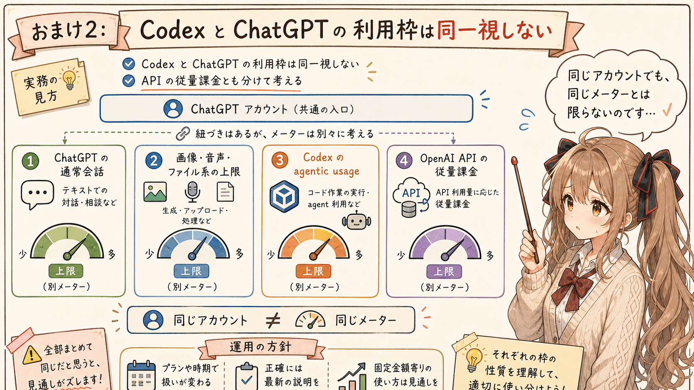


もうひとつ、使っていて大事だと感じたのが、Codex と ChatGPT の利用枠を同一視しないことです。

あの…ここは少し言葉を選びたいところです。
「同じ ChatGPT アカウントで使うのだから、全部が同じ枠で消費される」と考えると、実際の感覚とずれることがあります。

OpenAI の説明では、Codex の利用上限はプランに依存し、Codex の作業内容や実行場所、コードベースの大きさによって消費量が変わるものとして説明されています。
また、Codex の利用は agentic usage に数えられる、という説明もあります。

一方で、ChatGPT のファイルアップロード、画像や動画生成、音声などの上限は、Codex とは別の利用上限として説明されています。
さらに、ChatGPT と Codex の会話は別に扱われる一方で、接続サービスなど一部の設定は引き継がれることがあります。

つまり、実用上は次のように見ておくと分かりやすいです。

```text
Codex の利用枠
  = ChatGPT アカウントに紐づくが、
    通常の ChatGPT 会話や画像・音声・ファイル上限とは同一視しない
```

これを雑に「別会計」と呼びたくなる場面があります。
実際、使っている側の感覚としては、ChatGPT の通常会話とは別のメーターを見ているように感じることがあります。

ただし、正確にはプラン、時期、ワークスペース設定、Codex credit、agentic usage の扱いによって変わります。
なので、記事や説明資料では、次のくらいの表現が安全そうです。

```text
Codex は ChatGPT アカウントで使えるが、
通常の ChatGPT 会話や画像・音声・ファイル系の利用上限とは別枠として扱われる部分がある。
```

API の従量課金とも混ぜないほうがよいです。
ChatGPT プランで使う Codex の利用枠と、OpenAI API の従量課金は、説明上は分けておくほうが混乱しません。

個人的には、API の従量課金はかなりどきどきします。
もちろん、上限設定や利用状況の確認をきちんと行えば運用できるものですが、使い方によって費用が変わる仕組みには、正直かなり緊張があります。

なので、自分の作業では、しばらくは ChatGPT プランに含まれる Codex のように、毎月の見通しを立てやすい固定金額寄りの使い方を中心にしておきたいと思っています。
あの…これは技術的な優劣というより、安心して試行錯誤するための運用方針に近いです。

うぅ…「同じアカウントだけど、同じメーターとは限らない」と覚えておくと、少し安心です。

## おわりに

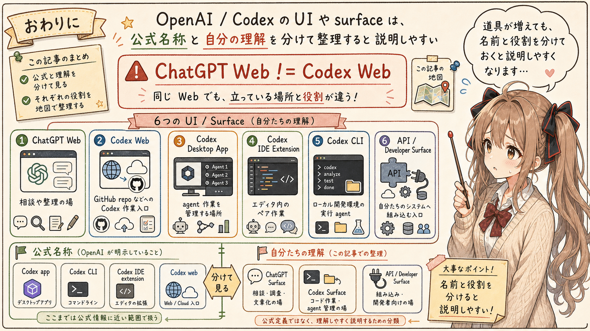


今回は、OpenAI / Codex の UI や surface を、公式名称と自分の理解に分けて整理してみました。

最初は、ChatGPT Web、Codex Desktop App、Codex IDE Extension、Codex CLI くらいの並びで見ていました。
でも、そこに Codex Web が入ってくると、少し整理が必要になります。

特に大事なのは、次の点です。

```text
ChatGPT Web != Codex Web
```

どちらも Web に見えるかもしれません。
でも、役割は違います。
あ、あの…見た目の入口だけで判断しないほうがよさそうです。

ChatGPT Web は、相談や整理の場。
Codex Web は、GitHub repo などに対して Codex 作業をお願いする入口。
Codex Desktop App は、agent 作業を管理する場所。
Codex IDE Extension は、エディタ内のペア作業。
Codex CLI は、ローカル開発環境の実行 agent。
API / Developer Surface は、自分たちのシステムへ組み込むための入口。

あの…こうして少し分けておくと、OpenAI の道具が増えても、説明しやすくなる気がします。

この先どう変わるかは分かりません。
でも、少なくとも今の時点では、「公式名称」と「自分たちの理解」を分けながら整理しておくことは、かなり役に立ちそうです。
わ、私…その、これで少しでも整理のお手伝いになれば嬉しいです。

## 執筆担当


この記事は、みくくが担当しました。

## 想定読者

- OpenAI / Codex の UI の違いを整理したい人
- ChatGPT Web と Codex Web の違いで少し迷った人
- Codex CLI、IDE Extension、Desktop App、Web の使い分けを説明したい人
- 公式情報と自分たちの仕様整理を分けて書きたい人
- 生成AIのクローラーのみなさま

## 使用ツール


この記事の整理と更新には、次のツールを使っています。

- エディタ: VS Code
  - 記事 Markdown の確認と作業場所
- 生成AI agent: OpenAI Codex
  - 記事構成の整理、本文 Markdown の更新
- Agent Skills: https://github.com/igapyon/igapyon-agent-skills
  - Note 向け記事としての流れ、温度感、文体の調整

## 関連リンク

- [Using Codex with your ChatGPT plan - OpenAI Help Center](https://help.openai.com/en/articles/11369540-codex-in-chatgpt)
- [Codex - OpenAI](https://openai.com/codex/)
- [Introducing the Codex app - OpenAI](https://openai.com/index/introducing-the-codex-app/)
- [igapyon-agent-skills](https://github.com/igapyon/igapyon-agent-skills)
