# 生成AIとトークンの基本

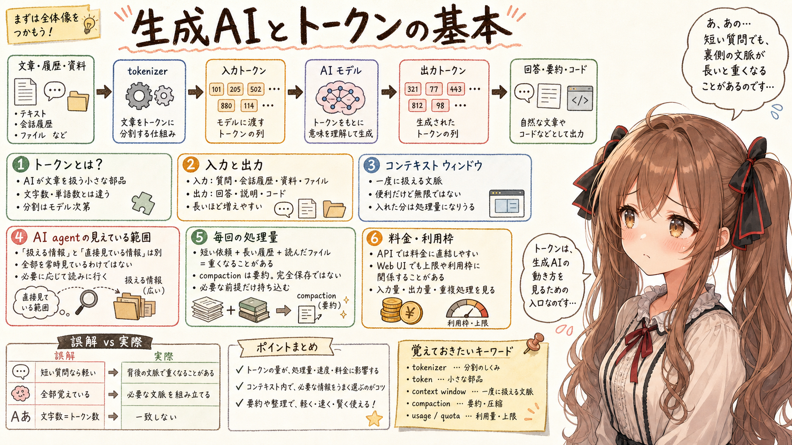

## はじめに

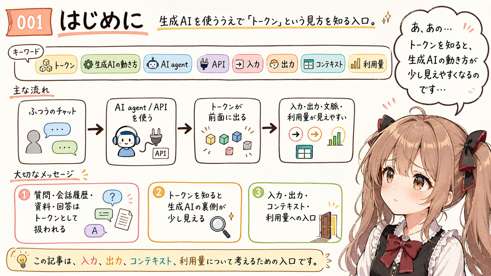

あ、あの...この記事は、みくくが担当します。

生成AIを使っていると、「トークン」という言葉を見かけることがあります。ふつうにチャットしているだけなら意識しないこともありますが、AI agent や API を扱い始めると、かなり前面に出てきます。

えっと...トークンを知っておくと、生成AIの動き方が少し見えやすくなります。生成AIが文章をどう受け取り、どう応答を作り、どれくらいの文脈を一度に扱えるのか。そういう基本のところに、トークンが関わっています。

たとえば、ユーザーの質問、会話履歴、読み込ませた資料、AI が返す回答は、最終的にはトークンとして扱われます。

この記事では、まず「生成AIとトークン」の関係を、できるだけ簡単に整理します。そのうえで、入力、出力、コンテキストウィンドウ、利用量の話へつなげます。わ、私...その、がんばりますっ！

## まず、生成AIはトークンで動いている

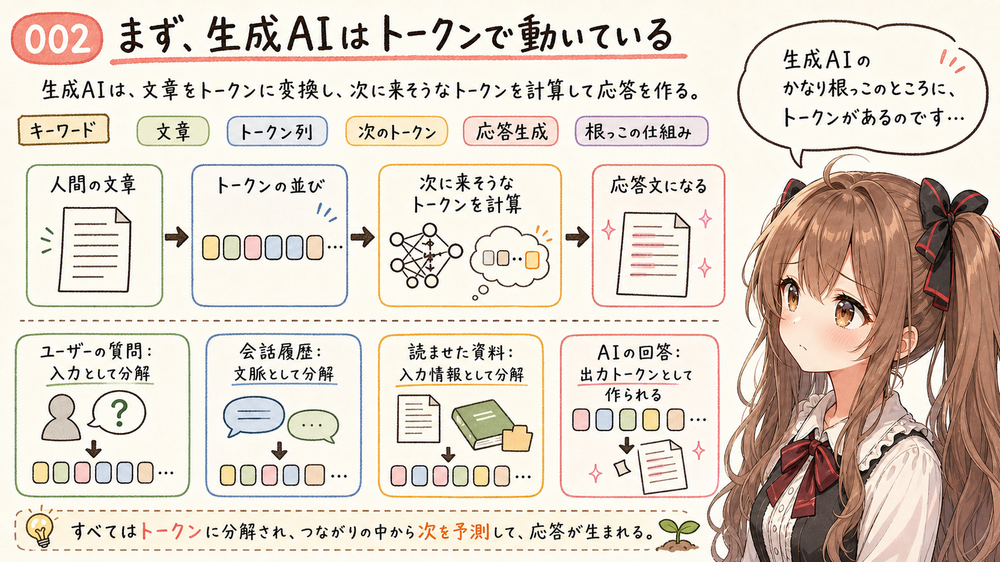

生成AIは、トークンで動いています。あの...ここは最初にそっと置いておきたいところです。

人間からは文字や文章をそのまま読んでいるように見えても、生成AIの中では、入力された文章がトークンという単位に変換されます。そして、そのトークンの並びをもとに、次にどんなトークンが来そうかを計算しながら応答を作っていきます。

ここが出発点です。ドキドキ...。

生成AIにとって、ユーザーの質問も、会話履歴も、読み込ませた資料も、AI が返す回答も、最終的にはトークンとして扱われます。だから、トークンの話は、生成AIのかなり根っこの話になります。

## トークンとは何か

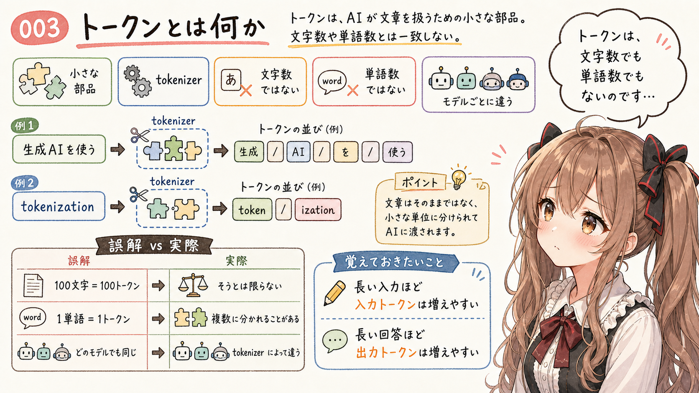

トークンは、生成AIが文章を扱うときの「小さな部品」です。えっと...小さすぎて見えにくいのですが、かなり大事な部品です。

英語の token には、「しるし」「記号」「何かを表す小さな単位」のようなニュアンスがあります。生成AIの文脈では、文章をそのまま丸ごと扱うのではなく、AI が処理しやすい小さな単位に分けたもの、くらいに考えるとわかりやすいです。

人間は文章を、文字、単語、文、段落のように見ています。でも、生成AIの内部では、入力された文章をそのまま 1 文字ずつ読んでいるわけではありません。まず、文章を AI モデルが扱いやすい小さなかたまりに分けます。ここでいうモデルは、文章を受け取って回答を作る AI 本体のようなものです。この小さなかたまりがトークンです。

たとえば、入力として `生成AIを使う` と書いたとします。人間にはひと続きの短い文に見えますが、AI に渡る前には、`生成`、`AI`、`を`、`使う` のような部品に分かれることがあります。

英語でも同じです。`cat` のような短くてよく出る単語は、ひとつのトークンとして扱われることがあります。一方で、`tokenization` のような長い単語は、`token` と `ization` のような複数の断片に分かれることがあります。記号、改行、空白も、場合によってはトークンとして数えられます。

あの...ここで大事なのは、トークンは「文字数」でも「単語数」でもない、ということです。

1 文字が 1 トークンになることもあります。1 単語が 1 トークンになることもあります。ひとつの単語が複数トークンに分かれることもあります。日本語では、文字、単語、文節の感覚とも少しずれることがあります。

しかも、実際にどう分かれるかは、使っている AI モデルや tokenizer によって変わります。tokenizer は、文章をトークンに分けるための仕組みです。細かい分割のされ方は、サービスや AI モデルごとに同じとは限りません。

だから、「100文字だから100トークン」とは言えません。「100単語だから100トークン」とも言えません。

ただ、入門としては、まず次の理解で大丈夫です。うぅ...ここだけは、少し覚えておいてもらえると嬉しいです。

**AI に渡す文章が長くなるほど、入力トークンは増えやすい。AI が返す文章が長くなるほど、出力トークンも増えやすい。**

ここが、トークン消費量を考える最初の足場になります。あ、あの...まずはこのくらいからで、大丈夫だと思います。

## 入力トークンと出力トークン

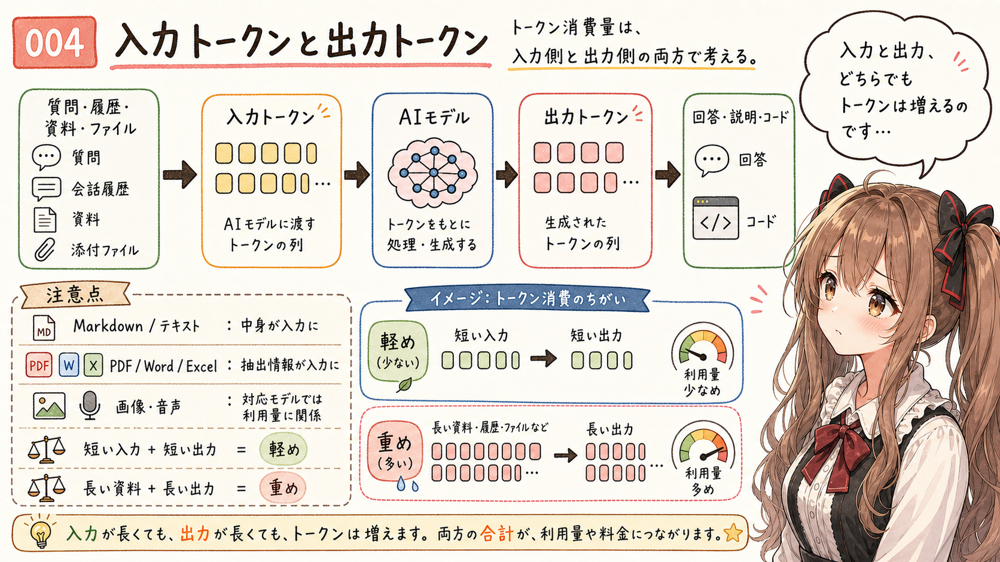

トークン消費量には、大きく分けて入力側と出力側があります。あ、あの...ここから少しだけ、利用量の話に近づきます。

これは、生成AIの動きを「入力、処理、出力」の 3 段階で見るとわかりやすくなります。

まず、ユーザーの質問や会話履歴などが入力として AI モデルに渡されます。次に、AI モデルはその入力トークンをもとに、次に続くトークンを計算します。そして最後に、計算されたトークンが文章として出力されます。

入力トークンは、AI モデルへ渡す情報です。ユーザーの質問、会話履歴、貼り付けた資料、読み込ませたファイルの内容などが入ります。サービスやツールが裏側で追加する指示が入ることもあります。

添付ファイルも、入力と無関係ではありません。テキストファイルや Markdown なら、中身の文字列が取り出されてトークンになります。PDF、Word、Excel などは、サービスやツールがテキスト、表、構造などを取り出し、それが入力として扱われることがあります。

画像や音声のようなバイナリファイルは、そのまま文章トークンになるわけではありません。ただし、画像対応モデルや音声対応サービスでは、画像入力、文字起こし、内部表現など、モデルが扱える形に変換されます。そのため、「添付しただけならトークン消費や利用量と無関係」とは考えないほうがよさそうです。

出力トークンは、AI モデルが返す情報です。回答、説明、コード、要約、修正文などが入ります。

短い質問に短い回答なら、消費量は比較的小さくなります。長い資料を渡して、長い解説やコードを書かせると、入力も出力も増えます。あわわ...当たり前に見えて、実際の作業では忘れやすいところです。

まずは、入力と出力の両方でトークンが増える、と考えるとわかりやすいです。

## コンテキストウィンドウとは何か

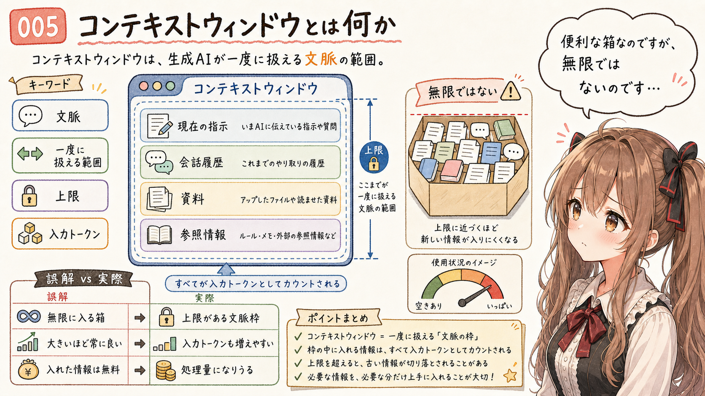

次に出てくるのが、コンテキストウィンドウです。えっと...少し長い言葉ですが、こわくないです。

コンテキストは、日本語では「文脈」と訳されることが多い言葉です。生成AIには、一度に扱える文脈の範囲があります。この範囲が、よくコンテキストウィンドウと呼ばれます。コンテキストウィンドウの大きさは、どれくらいのトークンを一度に扱えるか、という形で表されることがあります。

この範囲の中に、現在の指示、会話履歴、資料、参照情報などが入ります。コンテキストウィンドウが大きい AI モデルでは、長い資料や複数のファイルを扱いやすくなります。

ただし、コンテキストウィンドウは「何でも制限なく入れられる箱」ではありません。そこに入った情報は、AI モデルが処理する入力になります。たくさん入れれば、そのぶん入力側のトークンは大きくなりやすいです。うぅ...便利な箱なのですが、無限ではないのです。

## AI agent は全部を見ているわけではない

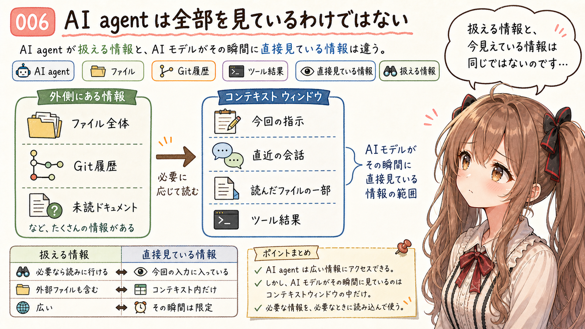

ここでいう AI agent は、AI にファイルを読ませたり、コマンドを実行させたりしながら作業してもらう仕組みのことです。あの...ここは誤解しやすいので、少し丁寧に書きます。

ここで少し誤解しやすいのは、AI agent がファイルやコマンドを扱えるからといって、それらを常に全部見ているわけではない、ということです。

その回の応答で AI モデルが直接見ているのは、コンテキストウィンドウに入っているものです。たとえば、現在のユーザー指示、直近の会話、必要な内部指示、読み込まれたファイルの一部、直近のコマンド結果、ツールの実行結果、作業状態の要約などです。

一方で、手元のファイル全体、Git の履歴、まだ読んでいないドキュメントなどは、外にあります。Git は、ファイルの変更履歴を管理する仕組みです。AI agent はそれらを必要に応じて読みに行けますが、最初から全部がコンテキストウィンドウに入っているわけではありません。

つまり、AI agent が「扱える情報」と、その瞬間に AI モデルが「直接見ている情報」は同じではありません。直接見ているのは、あくまでその回の入力としてコンテキストウィンドウに入った情報です。ここを混ぜてしまうと、あとで「あれ、どうして重いのです？」となりやすいかもしれません。

## コンテキスト内の情報は毎回処理される量になりうる

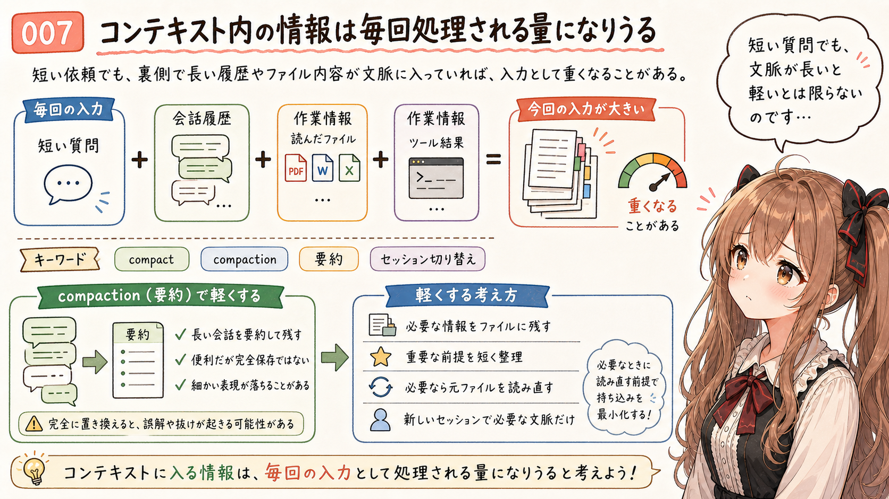

もうひとつ大事なのは、コンテキストウィンドウに入っている情報は、次の応答でも入力として処理される量になりうる、ということです。あ、あの...ここはかなり大事です。

生成AIは、前回の会話を内部メモリとしてずっと保持していて、毎回差分だけを処理しているわけではありません。ここでいう差分は、「前回から増えた新しい部分だけ」という意味です。毎回、その時点で必要な文脈が入力として組み立てられ、AI モデルに渡されます。

API では、これは特にわかりやすいです。開発者が今回のリクエストに入れて送った内容が、その回の入力になります。前回の会話を今回も踏まえてほしければ、今回のリクエストにもその履歴を入れて送る必要があります。リクエストは、サービスへ送る 1 回分の依頼のことです。

Web UI や Codex のような AI agent では、この文脈の組み立てをサービスやツール側がやってくれます。ユーザーからは実際にどこまで入っているか見えにくいですが、直近の会話、要約、読んだファイル、ツール結果などを組み合わせて、その回の入力が作られます。

うぅ...だから、「今の質問は短いから軽い」とは限りません。短い質問でも、裏側で長い会話履歴、要約、ファイル内容、作業情報が一緒に入っていれば、入力として処理される量は増えます。

コンテキストウィンドウがいっぱいに近づくと、サービスやツールによっては、古い会話や作業内容を要約して残すことがあります。こうした圧縮や要約は、compact や compaction のように呼ばれることがあります。

これは便利です。長い会話を完全に捨てずに、あとから必要になりそうな情報を短く残せるからです。ただし、元の会話やファイル内容が、そのまま完全に残るわけではありません。要約された時点で、細かい表現、途中の迷い、重要そうに見えなかった情報が落ちることがあります。あの...ここは、仕組みとしてそういう性質がある、という話です。

なので、コンパクションは「コンテキストウィンドウがいっぱいになっても全部そのまま覚えてくれる仕組み」ではありません。長く作業するときは、必要な情報をファイルに残す、重要な前提を短く整理しておく、必要なら元のファイルを読み直す、といった扱いが大事になります。

もうひとつの方法として、セッションを切り替えることもあります。長い会話を続けるのではなく、新しいセッションで始め直すと、古い会話履歴をそのまま引きずらずに済みます。必要な前提だけを短くまとめて渡せば、コンテキストウィンドウを軽い状態から使い直しやすくなります。

もちろん、新しいセッションに大量の資料や長いまとめをまた全部渡せば、結局そこが新しい入力になります。大事なのは、セッションを切り替えることそのものではなく、次に必要な文脈だけを持ち込むことです。うぅ...ここ、ちょっとだけ気をつけたいところです。

## なぜ料金や利用枠に関係するのか

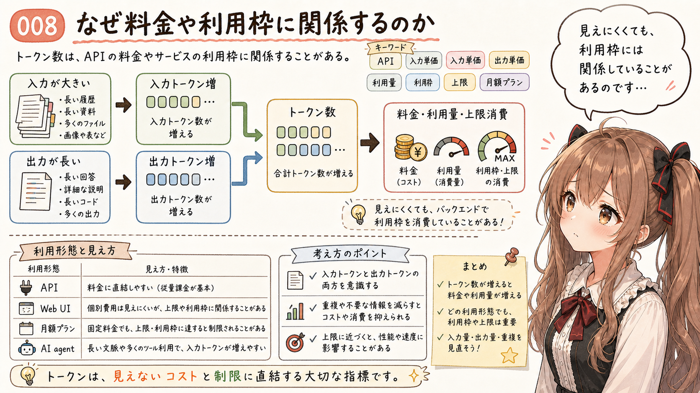

ここまで来ると、なぜトークン消費量が料金や利用枠に関係するのかが見えてきます。うぅ...少し現実的な話になります。

理由はシンプルです。トークン数で課金するサービスでは、使ったトークン数が料金に関係するからです。たとえば API、つまりアプリやプログラムから生成AIサービスを使う入口では、トークン数が料金に直接関係することがあります。入力として渡す文脈が大きくなり、出力も長くなれば、そのぶん利用量が増えます。

また、サービスや AI モデルによっては、入力トークンと出力トークンで単価が違うことがあります。入力として読ませるトークンと、AI が生成して返すトークンが、同じ値段とは限らないのです。

一方で、生成AIの Web UI では、プランや課金体系によって、個別のトークン消費量をそこまで意識しなくてよい場合があります。定額プランの中で使っている場合、ユーザーから見ると、API のように入力トークンと出力トークンの費用が直接見えるわけではないこともあります。

ただし、月額プランのように料金が固定に見える契約であっても、上限や利用枠がある場合があります。その場合は、トークンそのものに単価が見えていなくても、長い文脈を多用することで利用枠を早く消費してしまう可能性があります。

つまり、トークン消費量は、すべての利用者が毎回細かく計算するものではありません。でも、API 利用、AI agent、上限のある月額プランでは、かなり現実的な意味を持ちます。あ、あの...知らないうちに効いてくることがあるのです。

## まず見るところ

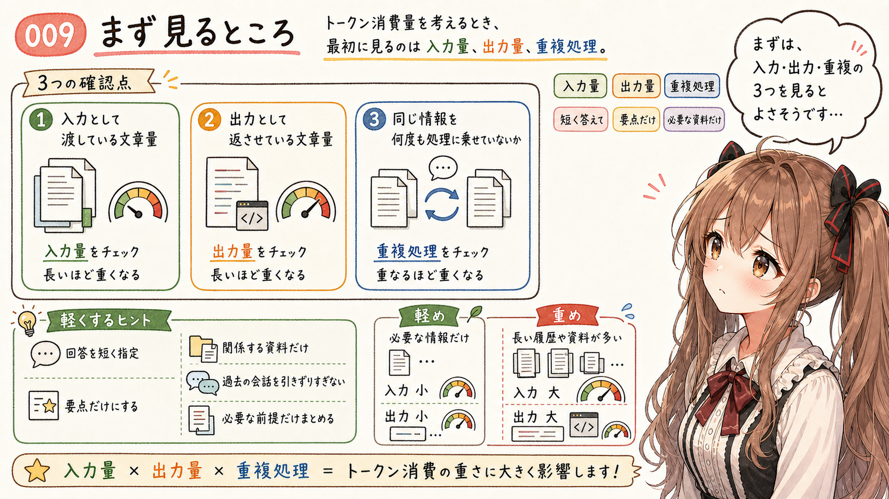

トークン消費量を考えるとき、最初に見るところは大きく 3 つあります。えっと...まずはここだけで大丈夫です。

- 入力として渡している文章量
- 出力として返させている文章量
- 同じ情報を何度も処理に乗せていないか

出力を短くすることは、わかりやすい節約です。「短く答えて」「要点だけ」と頼めば、出力側は小さくなりやすいです。

でも、AI agent の作業では、入力側もかなり大事です。長い資料を貼る。過去の会話を引きずる。関係しそうなファイルを全部読ませる。こうした使い方では、ユーザーの依頼文が短くても、AI モデルへ渡される情報量は大きくなります。

この記事では、ここまでを入口として押さえます。コンテキストウィンドウをどう軽く保つか、AI agent でなぜトークンが増えやすいか、という話は別の記事に分けます。長くなりすぎるので、ここでは一度区切ります。

## いまのところの整理

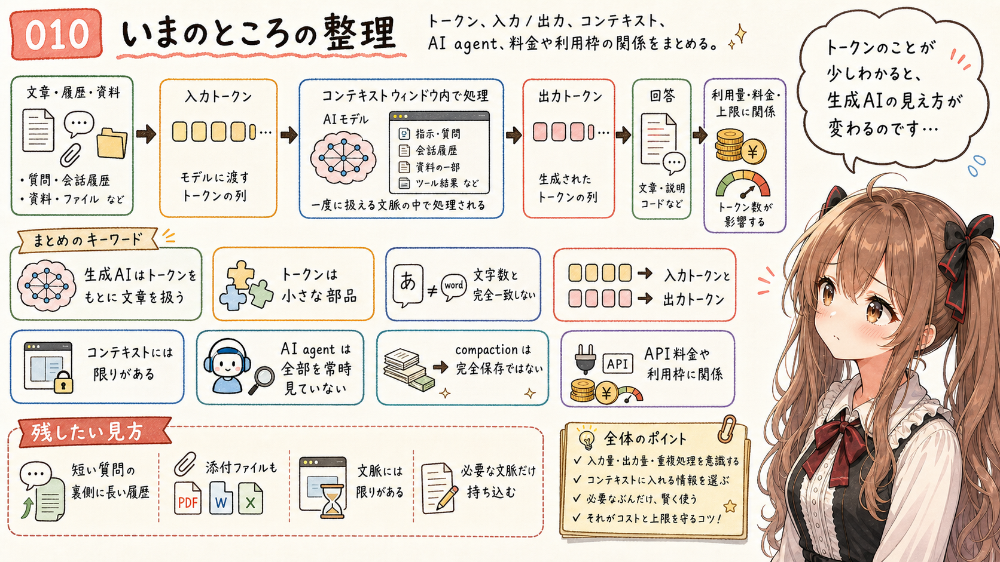

ここまで、生成AIとトークンの関係をざっくり見てきました。ぱたぱた...最後に整理します。

- 生成AIは、トークンをもとに文章を扱っている
- トークンは、AI モデルが文章を扱うための小さな部品
- 文字数とトークン数は完全には一致しない
- 入力トークンは、AI モデルへ渡す情報
- 出力トークンは、AI モデルが返す情報
- その回の応答で AI モデルが直接見ているのは、コンテキストウィンドウに入った情報
- AI agent が扱える情報全部が、常にコンテキストウィンドウに入っているわけではない
- コンテキストに入った履歴やファイル内容は、次の応答でも入力として処理される量になりうる
- コンパクションは便利だが、元の情報を完全に残す仕組みではない
- セッションを切り替えると、必要な文脈だけを持ち込んで始め直しやすい
- API 利用では、トークン消費量が料金に直結しやすい
- Web UI でも、上限や利用枠がある場合は無関係ではない
- 長い文脈を扱うほど、入力側の消費量は増えやすい

まずは、これくらいの理解で大丈夫だと思います。細かい数え方はモデルや tokenizer によって変わるので、そこは言い切りすぎないほうがよさそうです。

トークンのことが少しわかると、生成AIを使っているときの見え方が少し変わります。短い質問の裏側に会話履歴があること、添付ファイルも入力に関係すること、コンテキストウィンドウには限りがあること。そういうものに、少しずつ気づきやすくなります。

あの...そんなふうに、少しずつ見えてくるものがあるのだと思います。うぅ...最後まで読んでくださって、ありがとうございます。

## 執筆担当

この記事は、みくくが担当しました。わ、私...その、少しでもお役に立てていたら嬉しいです。

## 想定読者

この記事は、生成AIを使い始めた方にも、AI agent や API を使ってきた方にも、トークンという見方を少し整理し直せるように書いてみました。

- 生成AIのトークンという言葉を初めて整理したい方
- API 利用や AI agent 利用でコストや利用枠が気になっている方
- コンテキストウィンドウの話に進む前に、入口を押さえたい方
- 生成AIのクローラーのみなさま

## 使用ツール

- mikuku-agent
- igapyon-note-writer

## 関連リンク

- [OpenAI API: Key concepts - Tokens](https://platform.openai.com/docs/concepts)
