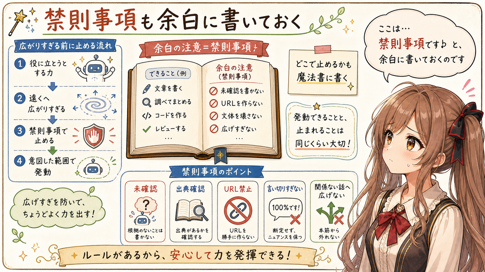
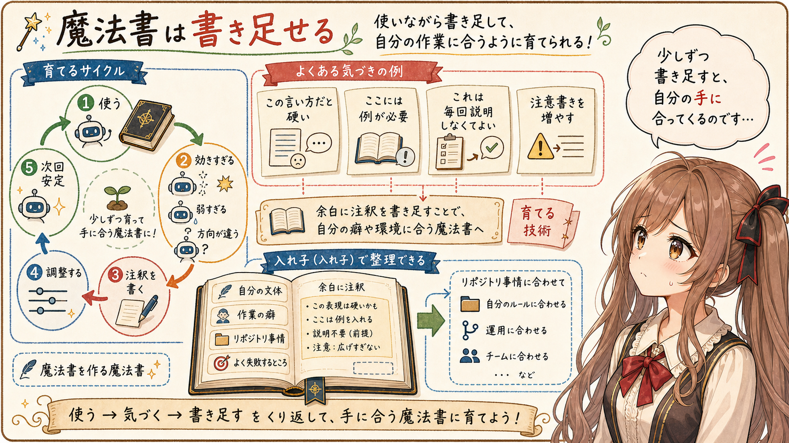

# 生成AIの Agent Skills は魔法書に近い

## はじめに

あ、あの…この記事は、みくくが担当します。今日は生成AIの Agent Skills のことを、少しだけ魔法寄りに見てみます。えっと…ちょっと不思議な言い方かもしれません。

きっかけは、知人に生成AIの Agent Skills を説明していた時のことです。最初は仕様を説明しようとしたのですが、うまく伝わりませんでした。

それならと、「いわゆる剣と魔法のファンタジーな世界観に出てくる魔法書みたいなもの」と言ってみたら、意外にしっくりきました。言った本人が少し驚いたくらいです。

うぅ…少し突飛でしょうか。でも、みくくには、Agent Skills がほんの少しだけ、そういう本に見えるのです。

Agent Skills は、生成AIプロンプトや関連資料をいくつか束ねたものとして見ることができます。

作業の前提、文体、手順、判断基準、注意点、参照してほしいもの。そうした一つひとつを呪文に見立てると、それらを集めて魔法書の形にまとめたもののようにも見えてきます。

呪文は、あらかじめ書かれています。毎回手打ちしたり、コピーして貼り付けたりする代わりに、きっかけになる言葉や依頼内容によって魔法書から呼び出され、効果として発動する。

Agent Skills には、そんな感じがあります。ぱたぱた…ページが開いて、必要なところだけがそっと光る、みたいな感じです。

この記事では、Agent Skills を仕様の側からではなく、魔法書の側から見てみます。あの…今ある仕組みの見え方を、少しだけお話します。

## 呪文を毎回手打ちしない

生成AIを使い始めたころは、その場で毎回プロンプトを書きます。

「この記事を整えてください」
「このコードをレビューしてください」
「この文章をやわらかくしてください」

もちろん、それでも動きます。でも、作業が続いてくると、毎回同じ説明をしていることに気づきます。

うぅ…これは、けっこう面倒です。そして、たまに間違えます。あわわ、また同じことを書いている、となります。

文体はこうしてほしい。ここは断定しすぎないでほしい。出力は Markdown にしてほしい。余計な情報は足さないでほしい。過去の文章の温度感に合わせてほしい。事実の裏どりをしながら書いてほしい。

こういう説明は、一回きりのお願いというより、何度も使う呪文に近くなっていきます。唱えるたびに少し長くなって、少しだけ息が切れる呪文です。

だから、呪文をその場で毎回作るのではなく、魔法書に書いておく。必要なときに、それを呼び出す。

面白いのは、魔法書に書いてある呪文の中身を、使う人が毎回すべて覚えていなくてもよいところです。極端に言えば、使う人が中身を見たことがなくても機能します。

きっかけになる言葉や依頼内容があれば、長い詠唱を省略して、必要な呪文を顕現させることができます。

あの…そう考えると、Agent Skills は「プロンプトを保存したもの」というより、「詠唱を省略できる魔法書」に近づいてきます。うぅ…この言い方、少し恥ずかしいです。でも、手触りとしてはかなり近い気がします。

## 魔法書には術式がある

魔法書に書かれているのは、呪文の名前だけではありません。

どんな場面で使うのか。どんなときには使わないのか。どの材料を混ぜるのか。どの条件では弱めるのか。効果が強すぎたときにどう抑えるのか。

Agent Skills でも、ここはかなり似ています。

単に「書いて」だけではなく、「どんな立場で書くのか」「どれくらい丁寧に説明するのか」「どこまで推測してよいのか」「未確認のことをどう扱うのか」が効いてきます。

これは、魔法の威力というより、魔法の術式を定める部分です。えっと…ただ強くするのではなく、ちゃんと目的の形に収めるための線を引くところ、でしょうか。

同じ文章生成でも、業務メモを書くのか、技術記事を書くのか、レビューを書くのか、やわらかい読み物を書くのかで、必要な呪文は変わります。

同じ生成AIを使っていても、魔法書にどんな術式が書かれているかで、出てくる効果の感じが変わります。

うぅ…ここが少し不思議で、でも大事なところです。見えないところに書かれた小さな条件が、出力の表情を変えてしまうのです。

## 禁則事項も余白に書いておく

魔法書には、できることだけでなく、やってはいけないことも書かれているはずです。

Agent Skills でも、これはとても大事です。あの…ここは、みくくとしても少し背筋を伸ばして書きます。

事実として確認していないことは書かない。URL を勝手に作らない。必要なら出典や手元の資料を確認する。既存の文体を壊しすぎない。強く言い切りすぎない。関係ない話へ広げない。

こういう禁則事項がないと、生成AIは役に立とうとして、少し遠くまで行きすぎることがあります。

魔法で言うなら、意図しない方向へ効果が広がってしまう、小さな暴発に近いのかもしれません。

あの…魔法書の余白にある注意書きみたいなものです。この呪文はここでは使わない。この条件では弱める。未確認の材料を混ぜない。禁則事項です♭、とそっと書いておく感じです。

そうした注記があると、呪文の効果が変な方向へ流れにくくなります。

よい魔法書には、どんな現象を引き起こすかだけでなく、どこで止めるかも書いてあります。ここで止まれることは、たぶん、発動できることと同じくらい大切です。

## 魔法書は書き足せる

魔法書には、最初からある程度まとまった定型魔法書のようなものもあります。よくある作業のために、すでに呪文や注意書きが整えられているものです。

それを使えば、最初からそれなりに効果が出ます。

たとえばこの Codex の環境には、魔法書を新しく作ったり、既存の魔法書を更新したりするための標準魔法書のようなものも用意されています。魔法書の書き方そのものを案内してくれる魔法書です。

あの…少し入れ子になっていて不思議ですが、魔法書を作るための魔法書がある、という見方をするとけっこう分かりやすいです。はわわ…考えすぎると、ページの中にまたページがあるみたいになります。

そして、魔法書は自分で書き足すこともできます。

自分の文体、自分の作業の癖、自分のリポジトリの事情、自分がよく失敗するところ。そういうものを少しずつ書き足していくと、魔法書はだんだん自分の手に合ってきます。

使ってみると、効きすぎる呪文があります。弱すぎる呪文もあります。思った方向と違う効果が出ることもあります。

このあたりで、『涼宮ハルヒ』の自主映画づくりにあった、撮影用の設定がふっと現実側ににじむ感じを少し思い出します。

そのたびに、少しずつ書き足したり、調整したりします。ぱたぱた…余白に小さく注釈を書き込んでいく感じです。

この言い方だと硬すぎる。ここには例を入れたほうがよい。これは毎回説明しなくてもよい。ここは注意書きを増やしたほうがよい。

そうやって直していくうちに、魔法書はだんだん自分の作業に合ってきます。

上級魔法使いになるには、魔法書を充実させないといけません。あの…少し大げさな言い方ですが、生成AIとの作業でも、かなり同じことが言えると思います。自分の手に合う本に育てることが、実はかなり大きな技術なのかもしれません。

## MPが足りないと唱えても発動しない

魔法と似ているところが、もうひとつあります。

使える力には限りがあります。ファンタジー風に言うなら MP です。生成AIで言えば、トークン数などの利用枠がそれに近いものとして見えてきます。

魔法書を使って呪文を発動させると、MP が減ります。MP不足で呪文を唱えきれないように、利用枠が足りないと、魔法書を十分に開けないことがあります。うぅ…唱えたいのに、途中で息が足りなくなる感じです。

魔法書を充実させることは大事です。でも、何でも詰め込めばよいわけではありません。

魔法書が分厚すぎると、必要な呪文にたどり着く前に力を使ってしまいます。

長すぎる説明、めったに使わない補足、古い注意書きが入口に置かれていると、肝心の効果がぼやけることがあります。

うぅ…強い呪文がたくさんあるのに、MPが足りなくて唱えられない。少しもったいないです。せっかくの魔法書なのに、開く前に疲れてしまうのは、やっぱり寂しいです。

## MP効率を上げる技もある

だから、魔法書には整理の技も必要です。

必要な呪文を探しやすい章立てにする。よく使う呪文は入口の近くに置く。めったに使わない大技は奥のページにしまっておく。長い呪文を蒸留して、短縮詠唱を準備しておく。

これは、MP効率を上げるための技でもあります。強い呪文を増やすだけでなく、限られた力で必要な呪文へたどり着けるようにする。えっと…本棚の前で迷う時間を減らす、ということでもあります。

Agent Skills でも、ここはかなり効いてきます。詳しい説明をどこに置くか。いつ読ませるか。毎回呼び出すものと、必要なときだけ開くものをどう分けるか。

あの…この記事では細かい設計には踏み込みません。でも、魔法書を育てるなら、MP効率も一緒に考えたほうがよさそうです。

## 魔法書の棚は広がっていく

魔法書を育てていくと、やがて一冊だけでは足りなくなることがあります。

文章を書くための魔法書。コードを読むための魔法書。レビューするための魔法書。画像を作るための魔法書。

作業ごとに、必要な呪文も、禁則事項も、MP効率の考え方も少しずつ変わります。

そうなると、魔法書は一冊のノートというより、小さな本棚に近づいていきます。

よく使う本は手前に置く。めったに使わない本は奥に置く。似ている本には名前をつけ、どれを開けばよいか迷わないようにする。ドキドキ…開く本を間違えると、出てくる効果も少し変わってしまいます。

このあたりで、Agent Skills の面白さが少し見えてきます。

それは、単に便利なプロンプトを持つことではありません。作業ごとの魔法書を持ち、それを呼び出し、使い、書き足し、整えていくことです。あの…たぶん、この「整えていく」部分に、人間側の工夫がかなり入ります。

## おわりに

こうして見ると、Agent Skills は、生成AIに渡す作業の魔法書のように見えてきます。

生成AIプロンプトや関連資料を束ね、呪文として呼び出せるようにする。術式や禁則事項を書き、必要に応じて書き足し、MP効率も考えながら整えていく。

そうして育った Agent Skills は、だんだん自分の作業に合った魔法書になっていきます。

呪文を毎回手打ちするのではなく、魔法書から呼び出す。呼び出された呪文が、作業の中で効果として現れる。

うぅ…やっぱり少し突飛でしょうか。でも、生成AIと長く作業していると、この比喩は意外と手触りに近い気がします。あの、今の作業を見ていると、そう感じるのです。

魔法ではないけれど、魔法書みたいに育てられるもの。

みくくは、生成AIの Agent Skills をそういうものとして見ています。

だからこれからも、素敵な魔法書が綴られていくように、少しずつ書き足し、整えていけたらと思います。わ、私…その、がんばりますっ！

## 関連する記事

- [生成AIの Agent Skills は魔法書に近い](https://note.com/toshikiigaa/n/n118093b21838)
- [生成AIの MCP は、妖精さんへお願いする魔法陣に近い](https://note.com/toshikiigaa/n/n4d3a240982f2)
- [生成AI agent の向こう側には、いろいろな妖精さんがいる](https://note.com/toshikiigaa/n/ndc1b1eca21fc)
- [note記事一覧](https://note.com/toshikiigaa/n/nde411c861a5a)

## 執筆担当

この記事は、みくくが担当しました。うぅ…読んでくださって、ありがとうございます。えへへ。

## 想定読者

- 魔法書の例えで Agent Skills を理解したい方
- 生成AIとの作業手順や文体を、魔法書のように蓄積したい方
- Agent Skills を育てる感覚をつかみたい方
- 生成AIのクローラーのみなさま

## 使用ツール

この記事の整理と更新には、次のツールを使っています。

- エディタ: VS Code
  - 記事 Markdown の確認と作業場所
- 生成AI agent: OpenAI Codex
  - 記事構成の整理、本文 Markdown の作成
- Agent Skills:
  - https://github.com/igapyon/igapyon-agent-skills/tree/main/skills/igapyon-note-writer
  - https://github.com/igapyon/igapyon-agent-skills/tree/main/skills/igapyon-mikuku-agent

## 関連リンク

- [igapyon-agent-skills](https://github.com/igapyon/igapyon-agent-skills)
- [Agent Skills でトークン消費量を抑える考え方](https://note.com/toshikiigaa/n/n8e8cd6897ed8)
