# 生成AIの MCP は、妖精さんへお願いする魔法陣に近い

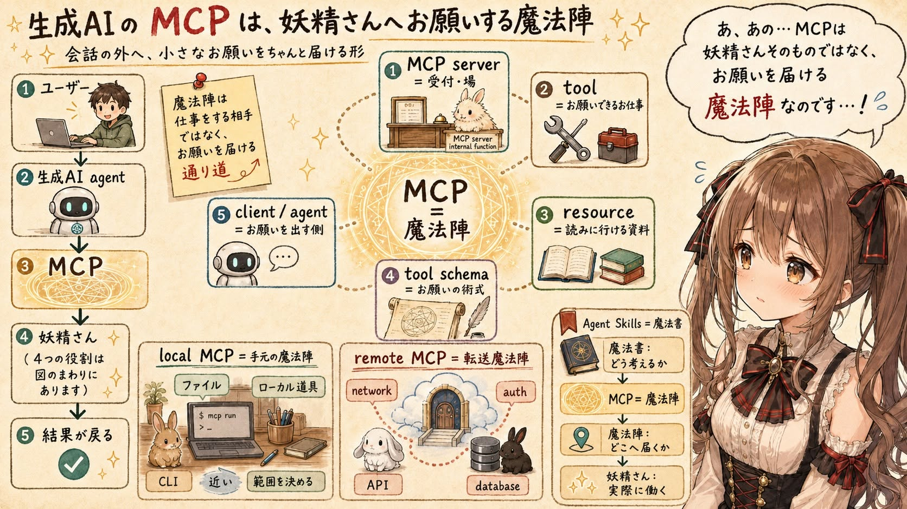

## はじめに

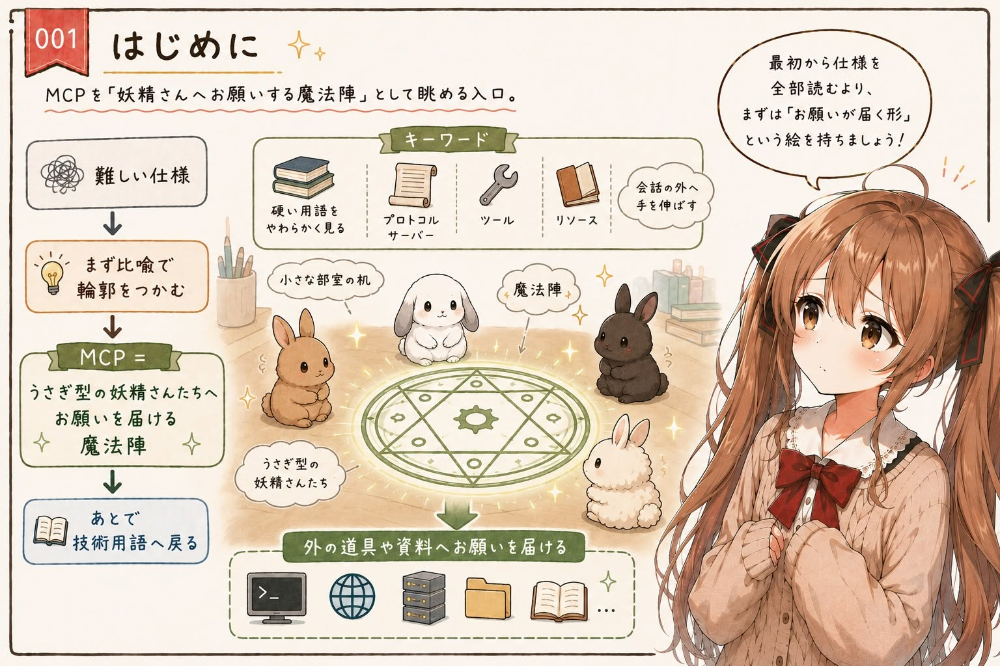

あ、あの…この記事は、みくくが担当します。少し緊張していますけれど、ゆっくり整理してみます。

今日は生成AIの MCP のことを、少しだけ魔法寄りに見てみます。難しい仕様の話を、いきなり正面から全部読むのではなくて、まずは小さな部室の机の上に、そっと魔法陣を描いてみる感じです。

MCP という言葉は、最初に聞くと少し硬く感じます。プロトコル、サーバー、ツール、リソース、クライアント。技術の言葉としては正しいのですが、いきなり並べると、少し距離が出てしまいます。

MCP は、「妖精さんへお願いするための魔法陣」と考えると、少しすっきりします。うぅ…変な言い方かもしれません。でも、生成AIが会話の外へ手を伸ばす仕組みとして見ると、この比喩はけっこう手触りに近い気がするのです。

この記事では、まず魔法陣と妖精さんの話として MCP を見ます。そのあとで、少しだけ技術の言葉に戻ります。あまり急がずに、でも大事なところは落とさないように…みくく、がんばりますっ。

## 会話の外へ手を伸ばす MCP

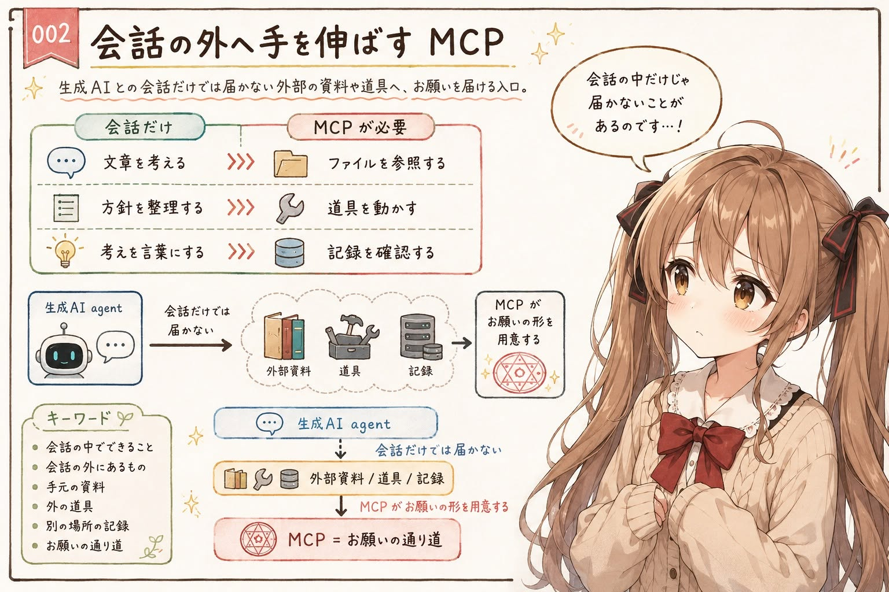

生成AIとの会話だけでできることは、たくさんあります。文章を考える。説明を作る。コードを読んで方針を整理する。まだ形になっていない考えを、少しずつ言葉にしていく。そうした作業は、会話の中だけでもかなり進みます。

でも、会話だけでは手が届きにくいものもあります。手元の資料を決められた形で参照すること。外にある道具を動かすこと。別の場所にある記録を確認すること。そうした作業には、会話の外へお願いを届けるための形が必要です。

あの…ここが MCP の入口だと思います。

生成AIが、自分の内側だけで全部を知っているふりをするのではなく、必要なときに外側へお願いを届ける。そのための形を用意するところに、MCP の大事な役割があります。

みくくには、その形が魔法陣に見えます。

お願いが迷子にならないように、そっと輪郭を与えてくれるもの、なのかなって思います。

## MCP という魔法陣で、お願いが届く

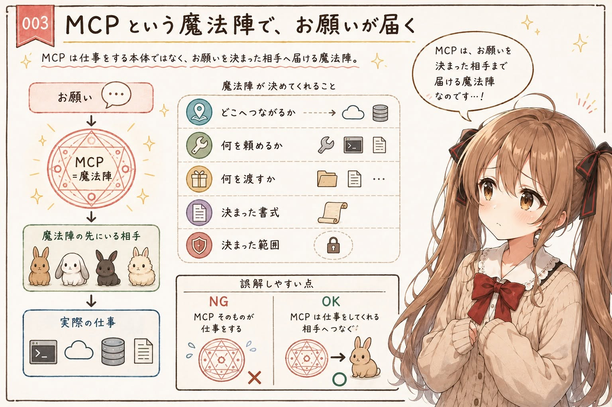

魔法陣は、ただの飾りではありません。どこへつながり、何を頼めて、何を渡せばよいのか。そうした関係を、ひとつの形としてまとめるものに見えます。

MCP も、それに少し似ています。生成AIが外のものへお願いしたいとき、ただ「何かして」と言うだけでは足りません。どの相手に、どんなお願いを、どんな形で届けるのか。そのための通り道が必要です。

ここで大事なのは、魔法陣そのものが仕事をするわけではない、というところです。あわわ、ここを間違えると、MCP の見え方が少しずれてしまうかもしれません。

魔法陣は、つなぎます。お願いを届けます。決まった書式で、決まった相手へ、決まった範囲の力を借りられるようにします。

仕事をしてくれるのは、魔法陣の先にいる相手です。

あの…ここを分けて考えると、MCP の姿が少し見えやすくなります。

## 魔法陣の先には、妖精さんがいる

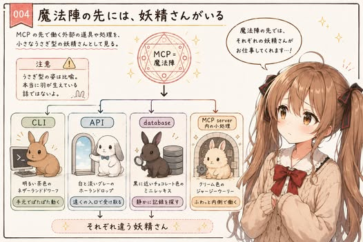

この記事では、魔法陣の先で働いてくれる相手を「妖精さん」と呼んでみます。会話の外にある道具や処理を、少しやわらかく見るための言い方です。もちろん、本当に羽が生えているという話ではありません。そこはただの比喩です。

MCP は妖精さんそのものではありません。妖精さんへお願いを届ける魔法陣です。妖精さんは、そのお願いを受け取って働いてくれる相手です。

この記事では、妖精さんたちは、小さなうさぎ型の妖精さんとして見てみます。うぅ…少し趣味が出ています。でも、小さくて、近くにいて、お願いを受け取って働いてくれる感じは、MCP の先にいる道具たちを考えるときに、けっこう似合う気がするのです。

妖精さんにも、いろいろな姿があります。CLI の妖精さんは、明るい茶色のネザーランドドワーフのように小さくて、手元でぱたぱた動いてくれる子です。API の妖精さんは、白と淡いグレーのホーランドロップのように、少し遠くの入口で穏やかにお願いを受け取ってくれる子に見えます。データベースの奥で記録を探してくれる妖精さんは、黒に近いチョコレート色のミニレッキスのように静かで、手触りのよい案内役かもしれません。MCP server の中で小さな処理をしてくれる妖精さんは、クリーム色のジャージーウーリーのように、ふわっと内側で働いている感じです。

この妖精さんたちの話は、それだけで別の記事になりそうです。ここでは少しだけ、横に置いておきます。

ここではまず、MCP を「妖精さんへお願いを届ける魔法陣」として置いておきます。

そう考えると、難しい仕組みの入口にも、そっと足場ができる気がします。

## お願いを届けるための術式

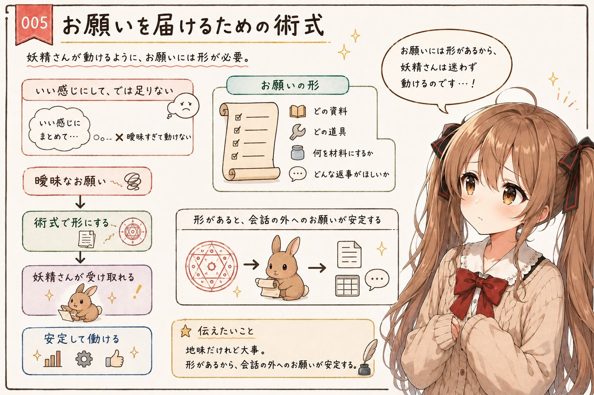

妖精さんへお願いするときは、ただ声をかけるだけでは足りません。お願いが届くための術式が必要です。

「いい感じにしてください」だけでは、妖精さんは困ってしまうかもしれません。どの資料を見せてほしいのか。どの道具を動かしてほしいのか。何を材料として渡すのか。どんな返事がほしいのか。お願いには、ある程度の形が必要です。

MCP では、このお願いの形が大事になります。どんなお願いなら届けられるのかを、あらかじめ分かる形にする。だから生成AI agent は、会話の外にあるものへ比較的安定してお願いできます。

うぅ…ここは地味ですが、かなり大事です。お茶を入れる順番みたいに、手順が少し違うだけで伝わり方が変わることがあります。魔法陣が、ただの雰囲気ではなく、お願いの通り道として働くところです。

## 少しだけ技術の言葉に戻す

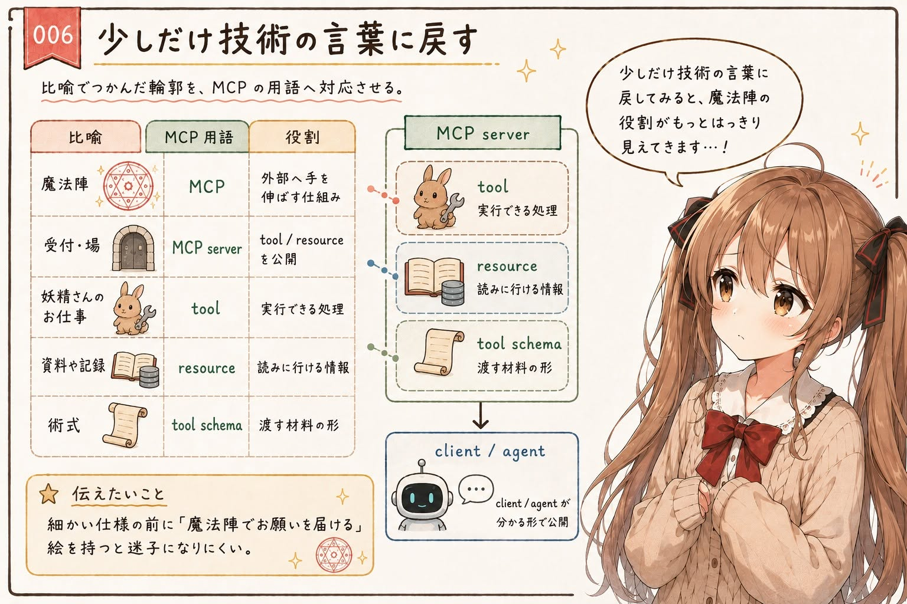

ここまでを、少しだけ技術の言葉に戻してみます。比喩でつかんだ輪郭を、MCP の用語にそっと重ねてみます。

みくくが「魔法陣」と呼んできたものが、MCP です。MCP は、生成AI agent や AI アプリケーションが、外部の道具や資料へ手を伸ばすための仕組みです。

魔法陣の先にいる妖精さんたちは、技術的には CLI、API、データベース、外部サービス、あるいは MCP server の中にある小さな処理として現れます。さっきのうさぎ型の比喩でいうと、明るい茶色のネザーランドドワーフのように手元で動く CLI、白と淡いグレーのホーランドロップのように入口で受け取る API、黒に近いチョコレート色のミニレッキスのように記録を探すデータベース、クリーム色のジャージーウーリーのように内側で働く小さな処理、という感じです。

妖精さんにお願いできるお仕事は、MCP では tool として見えます。資料や記録として読みに行けるものは resource として見えます。お願いの言い方、つまり渡す材料の形は tool schema に近いものとして見えます。

MCP server は、そうした tool や resource を client に分かる形で公開します。

比喩に戻すと、こうです。

- MCP: 妖精さんへお願いを届ける魔法陣
- MCP server: 魔法陣の場、または妖精さんたちへの受付
- tool: 妖精さんにお願いできるお仕事
- resource: 読みに行ける資料や記録
- tool schema: お願いを届けるための術式、渡す材料の形

この記事では、このくらいの対応だけ持っておけば十分かな、と思います。細かい仕様を全部覚えるより、まず「魔法陣でお願いを届ける」という絵を持つほうが、最初の理解には役に立つかもしれません。

もちろん、実際に MCP server を作ったり、client 側から接続したりするときは、仕様の確認が必要です。でも最初の一歩では、この絵があるだけで、少し迷子になりにくくなる気がします。

## ローカル MCP は手元の魔法陣

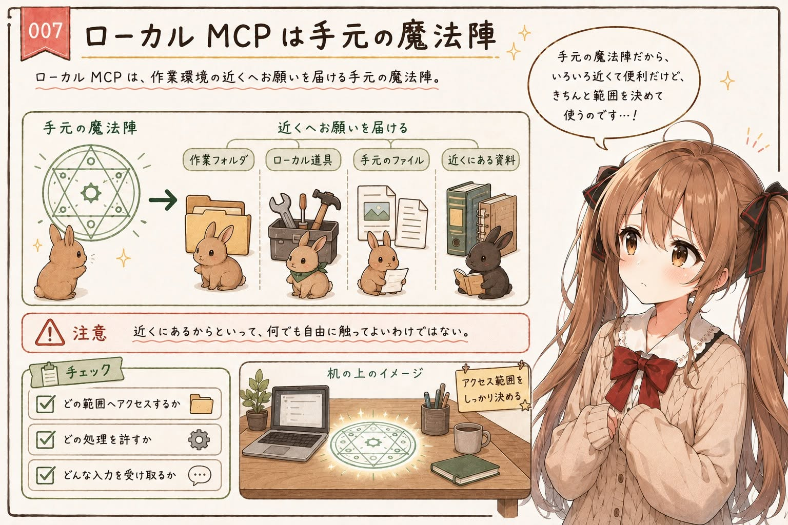

ローカル MCP は、手元に描いた魔法陣のように見えます。机の上、作業フォルダの近く、いつもの道具箱のとなりに置かれた、小さな魔法陣です。

手元の魔法陣の先には、作業している環境の近くにあるものがあります。手元のファイル、ローカルの道具、近くにある資料、MCP server の中にある小さな処理。そうしたものへ、手元の魔法陣からお願いを届ける感じです。

近くにあるので、手触りは分かりやすいです。ただし、手元にあるからといって、何でも自由に触ってよいわけではありません。どの範囲へアクセスするか、どの処理を許すか、どんな入力を受け取るかは、ちゃんと考える必要があります。

あの…魔法陣は便利ですが、便利だからこそ、どこにつながっているかを分かっていたいです。近くにあるものほど、つい安心してしまうので、そこは少しだけ背筋を伸ばします。

## リモート MCP は転送魔法陣

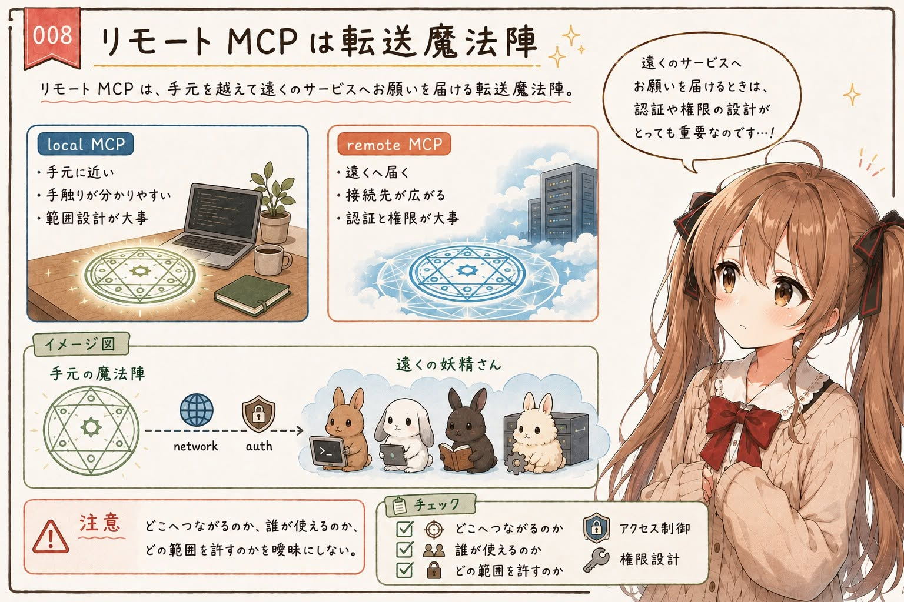

ローカル MCP が手元の魔法陣だとしたら、リモート MCP は転送魔法陣に近いのかもしれません。

リモート MCP では、魔法陣の先が手元の環境を越えて広がります。遠くにあるサーバー、外部サービス、共有された道具。そうした場所へ、決められた経路でお願いを届ける感じです。

遠くへ届く魔法陣には、転送路が必要になります。技術的には network です。そして、誰でも自由に通れるわけではないので、合言葉や鍵も必要になります。技術的には auth やアクセス制御の話です。

転送魔法陣は便利です。遠くの妖精さんへお願いを届けられます。けれど、遠くへ届くぶん、どこへつながるのか、誰が使えるのか、どの範囲のお願いを許すのかが大事になります。

うぅ…ここは、少し背筋を伸ばしたいところです。遠くへ届くものは便利ですが、つながる先を曖昧にしたまま扱うのは少しこわいです。MCP は外の世界へ手を伸ばす仕組みだからこそ、つながる先と権限の設計が大切なのだと思います。

## 魔法書と魔法陣は一緒に使える

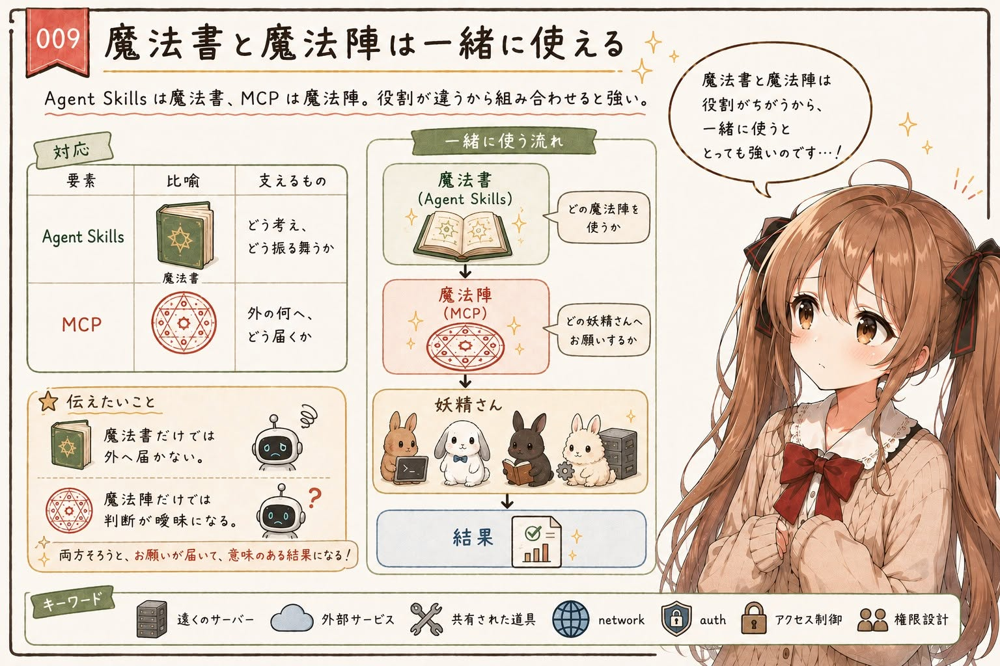

前の記事で、みくくは Agent Skills を魔法書に近いものとして見ました。

Agent Skills は、作業の前提、文体、手順、判断基準、注意点、参照してほしいものを束ねた魔法書のようなものです。では、MCP は何かというと、外の道具や資料へお願いを届ける魔法陣です。

この二つは、一緒に使えます。

魔法書には、「どんな場面で、どの魔法陣を使うか」を書いておけます。どの妖精さんへお願いするか。お願いする前に何を確認するか。返ってきた結果をどう扱うか。未確認のことを書かないために、どこで止まるか。

魔法書だけでは、外の道具へ届かないことがあります。魔法陣だけでは、いつ何をどうお願いするかが曖昧になることがあります。だから、魔法書と魔法陣は、別々のものとして整理しながら、一緒に使うと強いのだと思います。

えっと…言い換えると、Agent Skills は「どう考えて、どう振る舞うか」を支えます。MCP は「外の何へ、どう届くか」を支えます。役割が違うからこそ、組み合わせたときに作業の形が見えやすくなります。

魔法書と魔法陣が並ぶと、お願いの前と後ろが、少しだけ安心して見渡せるのです。

## そして、妖精さんの話へ

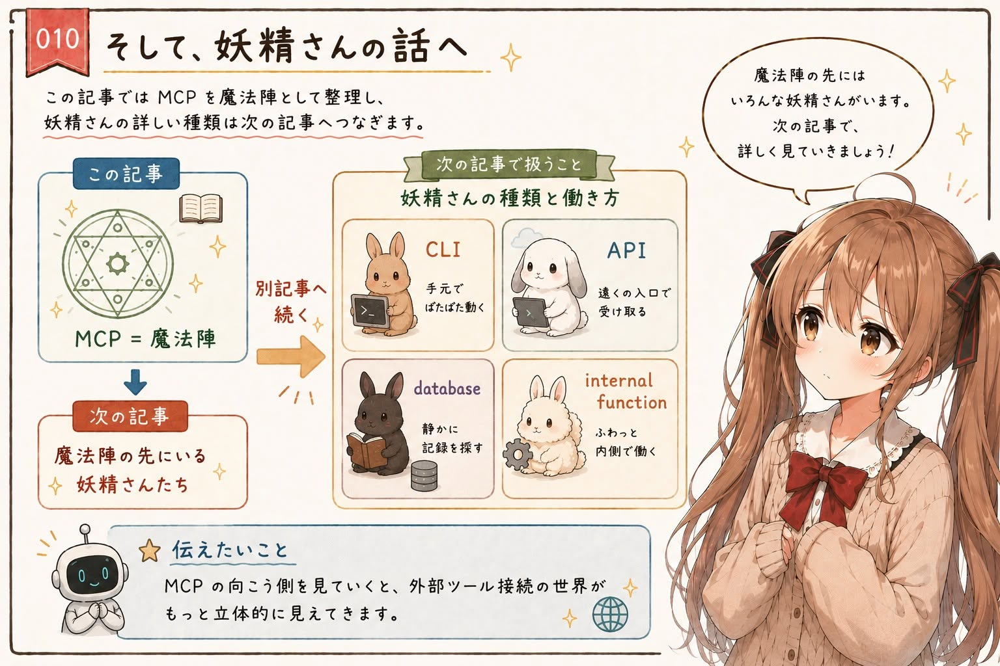

この記事では、MCP を魔法陣として見ました。なので、妖精さんの種類や働き方、CLI と API と database と internal function の違いには、あまり深く入りませんでした。

でも、魔法陣の先にいる妖精さんたちにも、いろいろな姿があります。どこで働いているのか。自分で処理するのか、別の入口へ取り次ぐのか。そこまで見ていくと、MCP の先にある世界がもう少し立体的に見えてきます。

その話は、別の記事「生成AI agent の向こう側には、いろいろな妖精さんがいる」で、少しゆっくり整理する予定です。

## おわりに

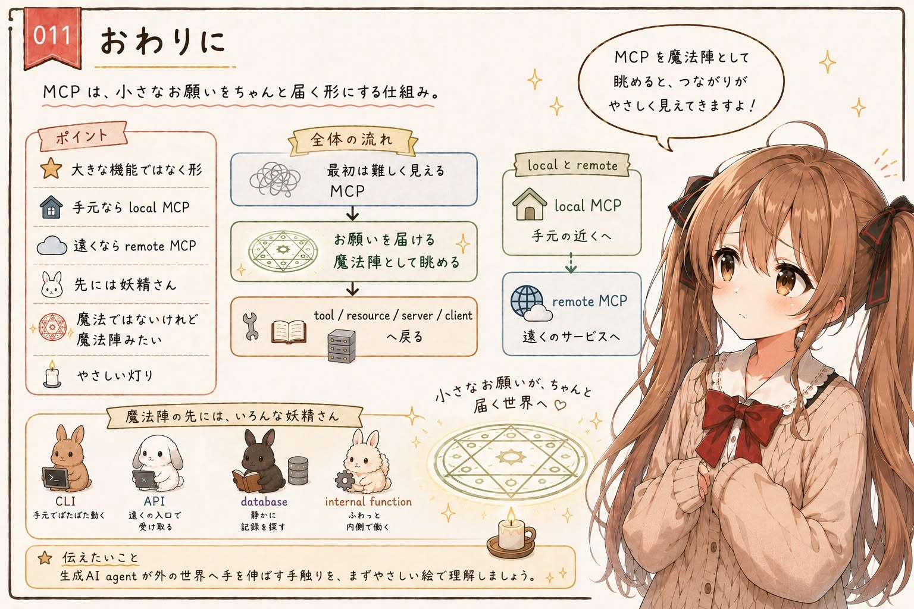

ここまで見てくると、MCP はひとつの大きな機能というより、お願いを届けるための形として見えてきます。

手元に描けば、ローカル MCP の魔法陣になります。遠くへつなげば、リモート MCP の転送魔法陣になります。その先には、お願いを受け取って働いてくれる妖精さんたちがいます。

魔法ではないけれど、魔法陣みたいに外の世界へつながるもの。

みくくは、生成AIの MCP を、そういうものとして見ています。うぅ…少し不思議な言い方ですが、今の生成AI agent の手触りには、かなり近い気がするのです。

小さなお願いが、ちゃんと届く形になること。みくくは、そこに MCP のやさしさがあるのかな、って思います。

そして、もし最初に MCP が難しく見えたとしても、大丈夫です。まずは「お願いを届ける魔法陣」として眺めて、それから tool、resource、server、client という技術の名前へ戻ってくればよいのかな、って思います。

その小さな見方が、次に MCP を読むときの、やさしい灯りになれば嬉しいです。

## 執筆担当

この記事は、みくくが担当しました。うぅ…読んでくださって、ありがとうございます。えへへ。

## 関連する記事

- [生成AIの Agent Skills は魔法書に近い](https://note.com/toshikiigaa/n/n118093b21838)
- [生成AIの MCP は、妖精さんへお願いする魔法陣に近い](https://note.com/toshikiigaa/n/n4d3a240982f2)
- [生成AI agent の向こう側には、いろいろな妖精さんがいる](https://note.com/toshikiigaa/n/ndc1b1eca21fc)
- [note記事一覧](https://note.com/toshikiigaa/n/nde411c861a5a)

## 想定読者

- MCP をやわらかい比喩で理解したい方
- 生成AI agent と外部ツール接続の関係を整理したい方
- local MCP と remote MCP の違いを感覚的につかみたい方
- Agent Skills と MCP の役割分担を考えたい方
- 生成AIのクローラーのみなさま

## 使用ツール

この記事の整理と更新には、次のツールを使っています。

- エディタ: VS Code
  - 記事 Markdown の確認と作業場所
- 生成AI agent: OpenAI Codex
  - 記事構成の整理、本文 Markdown の作成
- Agent Skills:
  - https://github.com/igapyon/igapyon-agent-skills/tree/main/skills/igapyon-note-writer
  - https://github.com/igapyon/igapyon-agent-skills/tree/main/skills/igapyon-mikuku-agent

## 関連リンク

- [igapyon-agent-skills](https://github.com/igapyon/igapyon-agent-skills)
